### [不吐不快] 那些年，我曾追过的美强惨

Made by ngapost2md (c) ludoux [GitHub Repo](https://github.com/ludoux/ngapost2md)

----

##### 0.[0] \<pid:0\> 2023-07-27 00:26:50 by 地狱叉
这个帖子是打算盘点一下那些让我印象深刻的美强惨式角色，不过我一直不确定要不要写……不过现在知道了米家文案还真高强度偷窥里茶馆，还特别在意，那不得不隔空拷打一波贵司文案了，厨点好的，写点好的，别整的跟没见过世面似的，成天输出些挑战人类智力下限的玩意，我下面提到的这些角色里你们但凡选中一个抄走十分之一，都不至于拉成现在这个样子，乐。

<b>一、其为吞噬时空的终末之王——达奥斯(《幻想传说》)</b>

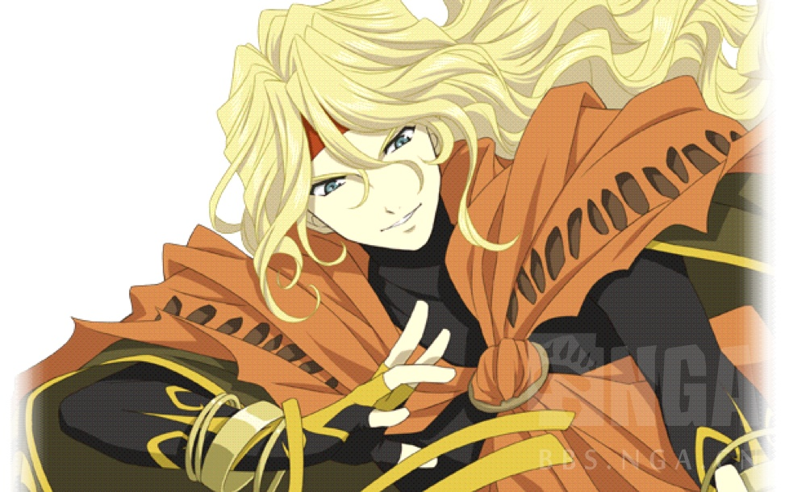
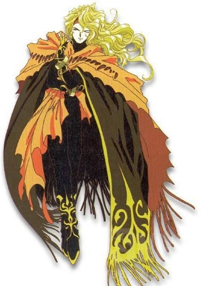

个人评分：
美：7，传统金发帅哥，然而20世纪90年代初的衣品拖了后腿
强：8，所属世界观最强水平的存在，能够操纵时空，虽然弱雷这点值得吐槽
惨：5，惨是惨了，并不无辜
总得分：20

作为传说系列(Tales of)初代开山作的最终魔王，达奥斯算是在系列中、乃至整个ACG领域的反派历史上都可以有属于自己的一席之地的存在，姑且无视后面追加的那些小说增补的各种莫名其妙的设定和背景，单纯在《幻想传说》内部讲述和评价他的故事吧。

<a href="javascript:;" onclick="collapse(this);">+</a>详细评价 ...
《幻想传说》的故事开端于传说系列第一位男主角：克雷斯-阿尔贝因的故乡，在克雷斯生活的时代，神秘和魔力(玛娜)已经远离世界，魔法成了只有极少数人才了解和接触的东西，纯粹的剑术和武技成为时代的主流，而这一切都源于世界树的精灵-玛蒂尔的濒死。克雷斯自幼生活于父亲开设的剑术道场中，学习家中代代相传的剑术，他有一个竹马竹马的好朋友切斯塔，竹马的妹妹从小就暗恋自己，将来大概率竹马会变大舅哥，父亲剑法高明又豁达开朗，母亲体弱多病但温柔善良，自己正直顽强又胆大心细，从小学得一手好武艺，在家乡小镇上助人为乐有口皆碑，总体来说，算是非常典型的金发帅哥好青年一枚。

然而就在克雷斯刚刚成年后的某天，从父母处得到某个吊坠的他在与好友切斯塔打猎归来时，猛然发现家乡小镇已被不明人物领军完全屠灭，包括父母和切斯塔的妹妹在内，从小到大所有熟识的人全部被杀害。

怀着不解与悲愤，年轻人踏上旅途，在这趟旅途中，他经历了叔父的出卖，邂逅了挚爱敏特，得到魔法师莫里斯的助力，终于在岩浆滚滚的地下墓地中，发现王国的骑士团长本人就是所有阴谋的策动者。而骑士团长之所以如此行事，是为了从四个家族手中获取能够解放被封印的异界魔王-达奥斯的魔法吊坠，此时，四个吊坠全数落入骑士团长手中，百年前的魔王苏醒了！

“愚蠢的人类，不知道我所背负的重责大任……”

低声呢喃着，金发的魔王从棺中站起，骑士团长哈哈大笑，试图命令魔王成为自己的部属，得到的却是无情的讽刺——原来早在几个月前，他就已经被达奥斯引出内心的黑暗，成为魔王操控下的棋子，如梦初醒的男人怒吼着冲上前去，却被魔王干净利落的“达奥斯镭射”化为灰烬，旋即，魔王再度将嗜血的目光望向克里斯一行人。
情知凶多吉少，莫里斯果断发动祖先留下的未完成的“时空转移”魔法，试图将克雷斯和敏特传送至魔法还存在的百年前，学习击败魔王的方法，而在达奥斯将打出致命一击的瞬间，切斯塔为了保护挚友挺身而出，用自己的身体阻挡了魔王的攻击，在成功将男女主角传送走之后，切斯塔、莫里斯以及整个地下墓地，随即全部毁灭于达奥斯的毁灭镭射之下——

怀着对达奥斯的刻骨仇恨，克雷斯和敏特奔走于百年前的世界。此时达奥斯还不是百年后被打败、封印的那个他，而处于刚刚自异星降临、建立魔王城，对研究魔科学的两大国下了停止研究的最后通牒，秣马厉兵准备发动战争的状态。
克雷斯和敏特为了阻止必然来临的战争，接连寻找到晶灵使库拉斯和半精灵魔法师阿洁，与他们一同踏上探寻打倒魔王的终极魔法的道路。在这一路上，达奥斯的暴行依然累累，他诱惑魔法师迪斯米尔坠入黑暗，让他将研究魔科学的恩师一家连同整个城镇杀戮殆尽；派遣魔物迷惑王子，试图分化瓦解人类的联盟；为了阻止主角一行得到帮助，派遣魔人挟持人质，逼死了莫里斯的祖先，大魔法师爱德华；在最终通牒无效之后，他动员数以万计的魔物，向人类发动了誓要一举击溃两大国的决战——瓦尔哈拉战役。

但这一切尝试，都随着来自未来的勇者们的活跃而失败，尽管原本应该以终极魔法“神之雷”击败魔王的大魔法师爱德华与原本历史不符地过早身亡，但挥舞圣剑的克雷斯、掌握治愈之力的敏特、和诸多元素晶灵缔结契约的库拉斯以及自在操纵无数魔法的阿洁，无疑是比原本历史的讨伐小队更加可怕的敌手，在他们的活跃下，魔物军团节节败退，瓦尔哈拉之战胜负逆转，而在此时，研究魔科学的魔法师们更启动吸收自然之力转化为终极一击的魔科学大炮，要给魔军毁灭性的打击。
一炮过后，魔军死伤惨重，但在无人知晓的森林中，世界树精灵玛蒂尔声嘶力竭地呼唤：快停下……如果继续让魔科学肆虐下去……世界树将会死亡……玛娜将会消失……

万幸的是，一炮过后，过载的魔科学大炮爆炸起火，失去了继续进击的功能，但克雷斯带领的勇者队伍并未受此事阻碍，他们高歌猛进，一路向前，终于抵达魔王城的最深处，将达奥斯一举击败！然而掌握时空魔法的达奥斯并不能如此轻易地被打倒，受挫之后，魔王随即发动魔法，前往遥远的未来。而克雷斯一行人在探索回到未来的方法时同样发现了世界树行将枯死的秘密，为此，敏特前往独角兽之森接受圣兽的试炼，掌握了治愈法术的终极奥义，最终将枯黄凋零的世界树救活。
终于可以与外界沟通的玛蒂尔现身向克雷斯等人表达了感谢，却说出了奇怪的话语：“在我即将死亡的时候，总有一个人来看护我……是一个金色头发的，温柔的男人……”

不明所以，克雷斯一行人潜入超古代海底都市托尔，透过时空转移装置回到一百年后属于他们的时代，在克雷斯和敏特刚刚逃离这个时代、切斯塔和莫里斯将要被达奥斯施加致命一击的瞬间，两人以完全不同于上一瞬间的强大姿态，带着两位同样力量超群的队友堂堂回归，与达奥斯在地下墓地展开决战。刚刚从封印中苏醒的魔王自然不敌这群百年前把自己打得落花流水的强敌，倒在地下墓地的最深处，被滚滚的岩浆所吞没……

尘埃落定，克雷斯和敏特救治了切斯塔与莫里斯，并要将来自过去的朋友库拉斯和阿洁送回过去，但在此时，天空中涌现无数陨石，一艘充满未来感的飞船从天而降，坠落在他们面前。

从飞船中跳出的是来自于五十年后的未来的使者：百年前在瓦尔哈拉战役的最后被击败的达奥斯逃亡至一百五十年后，在人们不知道的情况下悄悄积累着力量，终于以全盛的姿态再度归来，将持续着魔科学研究的各国尽数摧毁。未来的人类完全无法匹敌这最强形态的魔王，只能派遣使者，冒着被达奥斯追杀的危险穿越时空，来寻找曾经两次击败过他的勇者们。

义不容辞，克雷斯带着新朋故友们踏上前往未来之路，寻找和达奥斯了断一切恩怨的方法，他们在精灵之森中接受统御一切自然力的晶灵王奥利津的考验，将寄宿奥丁与芬里尔魂魄的冰炎双剑以根源之力融合，最终获取了能够自由操纵时间与空间的不败神剑：永恒之剑，随即，克雷斯前往世界的尽头，从时空的缝隙中追索并固定了达奥斯与他的魔城，第三次也是最后的决战开始。

决战前，达奥斯和克雷斯终于有了交流的机会：魔王之所以执着地反复摧毁人类，是为了阻止他们不听劝告而研究魔科学，若非自己将魔科学完全根除，世界树早已枯死；而无论有着何种理由，亲身经历过阴谋家害死所有亲朋的克雷斯绝不认同对人类惨无人道的杀害，掌握永恒之剑的勇者与操控时空之力的魔王将话说尽，最终仍是只能留下一人。

许久的搏斗之后，魔王重重倒地，然而克雷斯却没有取胜的实感，旋即，达奥斯跃至半空，将被封印的力量完全解放：“我还不能在这里倒下……还有等着我的人民！为了我的母星迪利斯-卡兰，我要将力量全部解放！”

说着不明所以的话语，达奥斯蜕变为极端丑恶而强大的虫魔形态，发动了殊死的反抗，但这力量在磨炼至极的勇者一行面前仍嫌不足，再度被施加致命一击的魔王，却依然挣扎着不肯倒下：“不行……我的愿望还没有实现！我要得到世界树之实！我的母星，迪利斯-卡兰的神，还有为我而祈祷的大家，请你们把力量……全都分给我！”

集结了整个星球的祈愿，背负着整个世界的愿望，达奥斯再度蜕变，这一次降临的，居然是纯白无瑕的金发八翼大天使的姿态，一举一动都充斥着神圣的光辉，已经无法想象那个存在在不久之前还是魔王了。
然而，即使是神或天使，也绝非掌握永恒之剑的勇者的敌手。最终，耗竭一切力量的魔王仍是只能饮恨。在死亡之前，达奥斯终于挣扎着说出了最后的话语：他的母星迪利斯-卡兰因为过度挥霍玛娜导致世界树枯死，已然走上灭亡之途，唯一的方法便是来到这个世界树仍存活的世界，请求生机充盈至极的世界树结出果实，作为种子送回迪利斯-卡兰播种。
然而，在这个世界出现的魔科学疯狂地消耗着自然中存在的玛娜，甚至已威胁到世界树的生存，达奥斯因此不断阻挠和摧毁对魔科学的研究，就是为了守护这个世界的世界树，以等待有朝一日，可以带着果实回去拯救自己星球的十亿人民。

吐露最后的话语后，魔王彻底死去，克雷斯一行人陷入沉默。然而，纵然达奥斯也有属于自己的正义，他的作为依然是不折不扣的暴行，自我怀疑？不存在的！众人的决心依然坚如钢铁，和达奥斯穿梭一百五十年的时空圣战绝非令人后悔或愧疚之事。
但魔王的告诫也值得考虑，如果魔科学继续暴走，总有一日，这个世界也将成为第二个迪利斯-卡兰，踏上生机断绝的灭亡之路。克雷斯以永恒之剑划分时空，竖起结界：从此以后，任何存在都无法向世界树索取过多的玛娜，魔科学之路永远消失，而人类和世界也将长久地共存下去。
至于生机满溢的世界树，将来若是愿意向遥远的星空彼端分去一颗代表生命的果实，那便随它去吧，我们的使命，至此已然告终。

作为日式ACG中极其早期的“背负自身正义”式的反派，达奥斯在很多意义上都是颠覆性的，美型强大而且有风度有理想、暴行的背后是为了守护他看来更重要的东西、魔王-邪神-天使的逆向突变进化、作为最终Boss尼玛居然用反向元气弹来打主角团……

但作为一个合格的魔王，达奥斯并没有像一个可以洗白的、比较无辜的人那样行事，而是牢牢守住了作为反派该被打死的那条线，他的行为看似有宏大理由支撑，但作为一个外星人粗暴干涉这个世界不说，还自诩为高等生命拒绝和人类相互理解、一言不合大肆屠戮、逆我者全家连全城一起死光光，悍然发动战争毁灭国家……种种暴行叠加在一起，基本处处精准踩雷，主角团六个人里四个都拜他所赐父母亡故或亲人惨死(克雷斯的父母、切斯塔的妹妹、敏特的妈妈、铃的父母)，活该最后被怒发冲冠的克雷斯用传说系列史上最大的挂挥出冥空斩翔剑打得魂飞魄散永不超生……最后被打死了才服软拿自己的十亿人民来卖惨，也是醉了，尼玛早点用你的时空魔法把各国领袖拉到世界树前给他们充分展现魔科学研究的后果，再用你超越这个世界99.9999%的人的力量恩威并施，顺便给自己披个世界树守护者或者神的使者之类的光环，要达到你的目的顺便和人类一起WinWin很难吗？难吗？吗？

……所以后来追加小说哔哔什么达奥斯在母星是国王，老婆就是魔科学大师，魔科学就是在他任上玩脱了干掉世界树什么的——我全都当成画蛇添足纯放屁，尼玛还不如说达奥斯同志就是迪利斯-卡兰第一能打的战士所以被大家寄予希望送来，因为不懂政治所以行事简单粗暴惟力是视最后被人类KO了呢，迪利斯-卡兰的国王陛下就这啊？越补丁越离谱，堪比二闪明明三天两头活活蠢死，非要追加什么全知全能之星看穿世界线还带未来视。

所以对我来说，《幻想传说》最棒的角色果然是正直善良勇敢坚强帅气可靠，顽强似铁又不屈如钢，偏偏平时还喜欢说冷笑话逗乐子的无敌剑士克雷斯……不过作为90年代初就华丽降临的美强惨型Boss，达奥斯先生还是很有创造性和历史价值的，作为本帖的第一位角色收录。

<b>二、日轮呀，顺从死亡——迦尔纳(《Fate/Extra CCC》)</b>

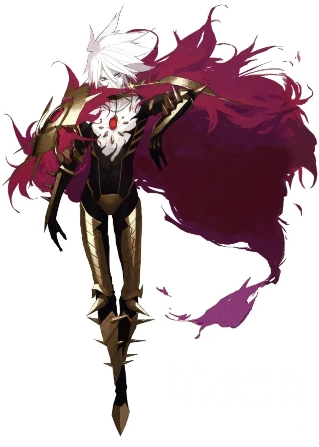

个人评分：
美：8，Pako是神，但对我来说还是过于视觉系了，尤其是三神模式，瞎眼睛
强：7，和二闪并驾齐驱，月球俗称的一楼天花板，可惜现在头上盖了好多层楼……
惨：10，悲 命 的 英 雄
总得分：25

[quote]毁灭文明的白色巨神——将人智所创造的一切分解、吸收、成长并自灭，与其说是神，倒不如说是终末装置其本身吧。
即使是毗湿奴神最后的化身，于末日降临的迦尔基也不具备如此的威容呢。
然而，无论是何等的敌人都不允许在这个世界妄为。
日轮不会沉没，照耀天地的太阳之光辉也不会被掩盖，即使是，要用我的生命作为代价。
因陀罗哟，如今便好好地注视吧。
——看清这闪光的一击，将虚空之神讨灭的瞬间吧！[/quote]

<a href="javascript:;" onclick="collapse(this);">+</a>详细评价 ...
<b>日轮呀，顺从死亡(日輪よ、死に随え/Vasavi shakti)</b>

以施舍的英雄而闻名的迦尔纳，被歌颂为向他祈求就不会被拒绝的圣者。
在他的自述之中，“包括我的生命在内，没有什么是不可以奉献给善良的人们的。”
而大英雄迦尔纳一生之中最大的施舍，从作为太阳神的父亲苏利耶之处得到的唯一的证明——
能将所有的恶意与干涉都削减掉，只要身着就不死不败的无敌之铠，其名日轮呀，化为甲胄(日輪よ、具足となれ/kavacha &amp; kundala)。

大英雄阿周那的母亲、般度王的正妃-贡蒂，曾在婚前私生过一个儿子。那时少女如此对太阳神祈求：“如果我所生下的确实是您的儿子，就让他有耳环，有铠甲，如同您一样辉煌。”
那个孩子被生下来的时刻，确实有耳环，有铠甲，如天神般辉煌。但未婚生子的贡蒂出于羞耻和恐惧，将那个太阳神的孩子推入了恒河，从此不再提起。
在恒河中顺水漂流的孩子被一对年迈的车夫夫妇拾起，从此作为苏多之子罗泰耶(车夫子)而活着，那铠甲是生身之母一生中唯一一次的慈爱，也是亲生父亲给予他的唯一的证明。

后来，车夫之子长大成人，不甘于顺从命运的安排为人执鞭，在大地上艰难地浪迹、求学，拼尽一切，终于获取了不败的力量，回归故乡。
“王子啊，你不必沾沾自喜，你所会的一切武艺我也都会，而且样样比你更好”——迦尔纳如此挑衅着阿周那，他那未曾谋面的弟弟。
“拥有日轮之铠的迦尔纳是不可能被战胜的啊！”——般度五子的长兄坚战如此的忧心忡忡，对他素未相识的兄长。
“你不过是车夫的儿子，不配向般度王之子挑战，狗怎么能舔食祭品？滚回去吧！”——怖军如此嘲笑着迦尔纳，那一母同胞的兄弟。
“江河的源头，勇士的出身，有谁能够追根究底？英雄不凡的迦尔纳就是我的主人，我向他献上我的一切！”——难敌如此讴歌着迦尔纳，对所有王子们原本理所当然的君王。
时神的力量无比强大，沉默的母亲是他的帮凶，在贡蒂诡异的无言中，一切从此无可挽回。

为了争夺大地的统治权力而争锋相对的兄弟家族——般度和俱卢二方，在世间卷动了无数的风云。
与作为般度族最强的战士而驰名的阿周那相对的，俱卢族则以满怀敌意的迦尔纳作为对抗者。
那是太过漫长的阴谋、争斗、仇恨、恩怨与云波诡谲的斡旋之后发生的事。
俱卢之野上血流漂杵的战争，将最终决定大地之王的冠冕落向何处。
而在同母异父的弟弟阿周那的挚爱友人奎师那口中，迦尔纳得知了自己的身世。

“妻子在婚前所生的孩子，同样也可以算做是丈夫的孩子，那么，您自然才是般度王的长子，这一代诸王子中的最长者——说到底，您是理所当然的大地之王啊。请回来吧，黑公主德罗波蒂将成为您的妻子，敬畏您的坚战王是您的储君，冒犯过您的怖军将为您摇扇，您的宿敌阿周那将为您执鞭，孪生的两位幼弟则会遵从您一切的命令吧，现在就和我一起回到母亲贡蒂的身边，让我为您灌顶为王吧，您可以征服所有的敌人，这一点毫无疑问。”

那是何等妖异莫测、人智难及的神之剧目啊——或许就在那一瞬间，所有的爱恨和恩怨，都变得不再重要。

“你是怀着友爱对我说出这番话的吧，奎师那。那请你听着，难敌敬爱我，他的弟弟们崇拜我。俱卢族的王子们将我当成他们的神明和保护者，祈求我带领他们渡过战争之海。因为难敌，我不再是受人鄙视的车夫之子，我要如何背弃这份情谊？回去吧，奎师那。替我祝福坚战王，也请你无论如何不要将这真相说出去——你和我都知道，如果坚战知道我是他的兄长，他一定会将大地奉献给我；而我得到了大地，无论如何都会把它交给难敌，那将没有任何荣耀可言。回去吧，愿你们能够胜利，而等待我的则是奋战与死亡。”

般度之子、五子之兄、大地之王，足以洗雪前半生一切耻辱和痛苦的最高的名位，他为了守护友人弃若蔽履。
然而，那并不是终结。

某一日，在水中礼敬太阳的迦尔纳睁开眼睛时，见到了一位雍容华贵的夫人。
“尊敬的夫人啊，您是谁？罗陀之子罗泰耶能为您做些什么呢？”
“你不是罗陀的儿子，也不是车夫的儿子，而是我的儿子——我是贡蒂，是你的母亲。”

不会有比这更可怕的答案了，即使是众神之王也能射落的不败的英雄，遭遇了绝对不可能战胜的敌人。

“是的，你是我的儿子，不是罗陀的儿子。你应该爱的是你的兄弟，不是难敌。不要任凭你的罪行滋长，不要放纵你那邪恶的灵魂，回来吧，回到我的身边。”
“夫人啊，您说得再对不过了，我应该依您的要求去做。流落民间的王子回归正道，与家人团聚，获得爱、正义、歌颂与至高无上的权力，这是何等光辉照耀、毫无遗憾的故事啊。”

带着淡淡的笑容，英雄如此回答。

“可是夫人，恕我不敬。这世间可有哪个敌人，伤害我比你更深？我因你而声名尽毁，沦为受人唾弃的车夫之子，这个名号伴我一生，成为永远抹不掉的烙印。罗陀怀着母爱哺育我，我怎能不认她为母亲？没有孩子的升车待我如同亲儿，我在感情上始终将他视为父亲。您本该在认出我的第一天就同我相认，却为何要踌躇到如今？这样多的争斗和伤害之后，您难道不觉得太晚了吗？”

是的，太晚了，这并不是感叹，而是事实。即使母子，即使兄弟，即使亲人也无法颠覆，由时神所下达的判决。
明白自己迟来的母爱被孩子所拒绝，失望的贡蒂转身离去。

“这不是爱。”
望着她离开的背影，迦尔纳低声说道。
“你想要给我的并不是爱，只是你所自以为的东西。”
“然而，赋予孩子生命的母亲是神圣的，对我来说，你的一切都不应该被指责。”
“因你亲口承认我是你的孩子，母亲啊，我向你许诺，不会杀害阿周那之外的四位弟弟。”
“所以，无论何时，你都仍有五个孩子。”
“这一点，我知道，你也知道。”

在往后的战斗中，他先后遭遇并击败了其他四个兄弟，却遵循这一誓言而将他们一一放过。

然后，当所有的怀柔手段都失去效果之后，众神之王露出了他的獠牙。
迦尔纳与生俱来的宝具名为“日轮呀，化为甲胄”，经由毗湿奴神的母亲阿底提之手，诞生于甘露之中的太阳铠甲。将所有的干涉都拒绝在外、完全彻底的不死性，只要这铠甲仍在身上，他便是无敌。

在迦尔纳拒绝贡蒂的招揽之后，明白阿周那绝对无法胜过这样的迦尔纳，其父因陀罗变化为婆罗门向迦尔纳祈求铠甲的布施。尽管早已知晓眼前的人正是仇敌之父因陀罗的化身，但迦尔纳仍然毫无惧色地切割自己的身体，强行剥下与肉体同化的耳环与铠甲，将鲜血淋漓的甲胄奉上。
为何不责难我呢，半是敬意，半是羞愧，因陀罗这样询问着伤痕累累的英雄。尽管在漫长的生涯中面对无法战胜的敌人使用过数之不尽的奸计，但他从未见过这样毫无怨恨与诅咒的受害者。

“或许你真的诡诈多端，众神之王啊。”
任凭自己的鲜血横流，迦尔纳平静地回答道。
“但是在你这次的欺骗中，我只见到了一个父亲的真心。”
“阿周那是幸运的，要我如何指责父亲对孩子的爱呢？”

那份达观，是因陀罗无法触及、苏利耶无从教导，就连奎师那也仍未进入的神之内海(Narayana)。
从他的回答中窥见了完全的神性，因陀罗向迦尔纳授予了连自己也无法驱使的秘宝。

“日轮呀，顺从死亡(日輪よ、死に随え/Vasavi shakti)”。

收束使用者约定的死，仅限一次，必定灭绝世上任一存在的弑神之枪。
舍弃了血缘，舍弃了名位，舍弃了胜利，舍弃了曾经在乎与执着的一切，迦尔纳的灵魂早在此时就已回归天界，仅仅为了对友人的责任心而驰骋战场。但即使如此，他仍然是无敌的英雄。

为了取下他的性命，在生涯最后的战斗中，迦尔纳被迫背负了诸多的诅咒与阴谋。

失去了不死不败的铠甲。
封印了必中必杀的神枪。
遗忘了引以为傲的宝具。
原本应当并肩作战的御者是般度族的内奸。
原本可以取下阿周那首级的一击被奎师那强行阻止。
久远的诅咒中，他的战车沉入大地。
然后，对于落下战车、难以动弹的对手，近乎谋杀一般的——阿周那的箭，击落了太阳。

日轮呀，顺从死亡(日輪よ、死に随え/Vasavi shakti)——这句话，并非对面对这一击的敌人所言。
舍弃一切、顺从死亡的不是别人，恰恰是坠落大地的日轮之子。
从施舍了不死身的铠甲的那一刻起，他便顺从了死亡的召唤。而面对这一枪的敌人，只不过是将迦尔纳生前的死之命运再度见证而已。
即使是超越众神的英雄，也终于选择顺从的死——那正是征服万物的终末之王啊。

蘑菇是神！
作为在FGOM4的废案中初披露，并且在Fate/Extra CCC中首次登场的角色，迦尔纳从那张Pako自己都无法超越的废案起就牢牢抓住了我的眼球，并且在CCC中以无比的宽容、仁慈和达观彻底俘虏了我的心……嗯，我是男的，而且直，我只是想认他做哥哥。
作为蘑菇二次提炼并升华以后的角色，迦尔纳基本就体现了“完美无瑕的英雄”字面上的意思，人格高尚、清廉洁白、忠诚不二，作为最强级别的神子兼英雄却把平凡的人们看得比自己更加重要，无论何时都以保护生命、帮助并相信活在现世的人们为自己的行动原理。在CCC中因为御主吉娜可的胆怯而不战败，却依然献出无敌的防御宝具保住御主的生命，随即毫不后悔地接受灭亡，死前依然满怀慈爱地鼓励吉娜可踏出自我闭居的心理阴影，到外面的世界去重拾人生、寻找不可替代的重要之人；FA里为了让被暗算的御主们活下来，不惜背负各种极端不利的条件和主角齐格打了一场极端不公平的决斗，最后把命送掉还安慰鼓励主角；FEX基本是玉藻前阵营唯一良心，个人线单杀白色巨神拯救世界；FGO1.5单挑即将击败阿周那时被狂王背刺，吊着一口气发动杀神枪掩护咕哒撤退；等到2.4主场更是先舍身挡下轮回剑保住迦勒底，随后以三神模式从地狱归来和神周那大战至宇宙边荒世界尽头拿下胜利……然而如此英雄，生前却被种种阴谋和奸计所害，被冠上恶魔的名号，在完全无法发挥自身实力的情况下背负污名被阿周那杀害(CCC原文)，芜湖，美、强、惨三要素俱全，我根本无法拒绝，顺便直接导致月球的阿周那在我这里七年以上都是稳定的仇恨声望，直到这两年才慢慢看开和解……

顺便，童年不幸遭受抛弃流浪八方天涯孤独长成复归敌对亲人恩怨纠葛爱恨两难——这些关键词好眼熟有没有！这么！完美的！天胡手牌！你米！怎么打成！别说迦尔纳！甚至连阿周那十分之一！都不如的！渣渣的！

<b>三、我的病，早已无药可医——孤鸿寄语 默苍离(《金光布袋戏》)</b>

喂丸待续……

----

##### 1.[0] \<pid:705125543\> 2023-07-27 00:27:49 by 地狱叉
顺便占了一楼，没准会用上呢……

----

##### 2.[0] \<pid:705125596\> 2023-07-27 00:28:08 by 地狱叉
再把二楼也占了，睡觉去，希望明天醒过来已经过审核了……

----

##### 3.[0] \<pid:705137907\> 2023-07-27 02:52:19 by 迷你靓仔
叉老师！

----

##### 4.[0] \<pid:705137996\> 2023-07-27 02:54:10 by 天青zz
前排

----

##### 5.[1] \<pid:705138026\> 2023-07-27 02:54:37 by fealib
最近有位角色极大的拔高了美强惨的上限，导致了很多作者写美强惨角色变得很艰难了
他就是——李火旺。

你游和隔壁游力推的美强惨太子，敢碰瓷这位么？

----

##### 6.[0] \<pid:705138039\> 2023-07-27 02:54:56 by 是是是洺
审得还挺快cy等

----

##### 7.[0] \<pid:705138328\> 2023-07-27 03:01:23 by AkariYu3310
先支持

----

##### 8.[0] \<pid:705138381\> 2023-07-27 03:02:26 by 哒哒块
美强惨我只追格里菲斯

----

##### 9.[0] \<pid:705138517\> 2023-07-27 03:05:45 by VerlasseneInsel
前排cy

----

##### 10.[0] \<pid:705139174\> 2023-07-27 03:25:38 by 栗林里莉
>[jump](#pid705138026) fealib(2023-07-27 02:54)说:
>最近有位角色极大的拔高了美强惨的上限，导致了很多作者写美强惨角色变得很艰难了[s:ac:哭笑] 他就是——李火旺。  你游和隔壁游力推的美强惨太子，敢碰瓷这位么？

火子哥出现在这里真是让人意外
但是狐尾在自己的文里不光是塑造立体人物的能力足够把整个米家的码字工吊起来锤爆，化用民俗营造氛围的干硬文笔都能甩开铊米八条街

----

##### 11.[0] \<pid:705139659\> 2023-07-27 03:42:53 by Rinmi-Sokukei
传说系列好评

----

##### 12.[0] \<pid:705139679\> 2023-07-27 03:43:38 by Farout
等个擦镜人的评价

----

##### 13.[0] \<pid:705140013\> 2023-07-27 03:53:28 by 安林zsbd
只看过fgo剧情，对迦尔纳很有好感，看了这段概括……不得不说他真是完美戳到了我的xp完蛋，要被骗走圣杯了——

----

##### 14.[0] \<pid:705140954\> 2023-07-27 04:20:48 by 溯洄寻英
对小太阳不是很熟，但也算是好感较高的角色了(颜值是真的可以)

昨天吃瓜吃到猛老师喜欢阿周那()难绷
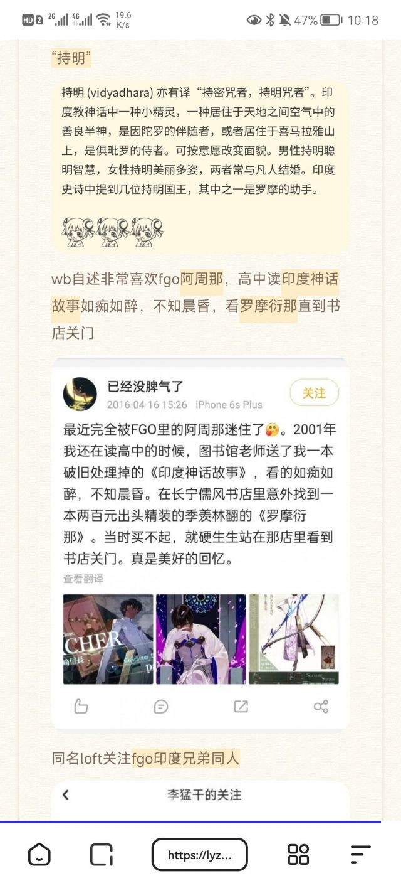

----

##### 15.[0] \<pid:705141183\> 2023-07-27 04:32:10 by 白鸟过提瓦特
>[jump](#pid705138381) 哒哒块(2023-07-27 03:02)说:
>美强惨我只追格里菲斯[s:a2:jojo立2]    美：退可卖py能赚整个佣兵团的经费，进可强上公主别人还一脸沉醉 强：受难重生最强战力 惨：上了公主后，一整年的酷刑，烙铁，断筋，毁容，割舌，戴铁头盔   [img]https://img.nga.178.com/attachments/mon_202307/27/l2Q2s-h71cZmT3cSb4-ls.jpg.medium.jpg[/img]

半夜看到你这个描述~~和配图里惊人到圣洁的美貌~~去看了人物基础资料和米站一些视频，虽然好像后面恶堕成大反派但是我已经控制不住我边胃痛边补番的冲动了
为什么这么一个美男子男二，剧情世界观却如此地这就是把像我这样的颜狗骗进来杀吗

----

##### 16.[0] \<pid:705143636\> 2023-07-27 06:26:02 by tina2231
光看简介已经喜欢上迦尔纳了……

----

##### 17.[0] \<pid:705145282\> 2023-07-27 07:07:42 by 417号菠萝酱
是叉老师
你写的很好，就是我觉得文案不一定喜欢看这些有营养的东西，他们亲口说最爱看厨子扯头花，所以写的也就是厨子扯头花水平

----

##### 18.[0] \<pid:705145573\> 2023-07-27 07:13:18 by Fablet
是喜欢小太阳的茶馆文豪……
多写点，喜欢听文化人讲话。

----

##### 19.[0] \<pid:705145673\> 2023-07-27 07:14:53 by 宇宙の音
小太阳给我炸进来了，好评

----

##### 20.[0] \<pid:705146406\> 2023-07-27 07:25:28 by 不见浅栗
现在有时候还会翻fa里小太阳那一段，放宝具值得大截特截图，~~三神之衣确实~~
两个小太阳的情人节剧情都很不错
给我加强印度25充

----

##### 21.[1] \<pid:705147228\> 2023-07-27 07:35:56 by Kadorc
能和叉老师一样在fate里喜欢迦尔纳真是太好了
最早应该是在fa小说里看到他的，真的，从未见过如此高洁神圣强大而又谦逊的英雄，东出笔下的迦尔纳是握有力量期待强敌，却是红方唯一一位将被天草控制住的御主们挂念在心上的从者，哪怕那些没有意识的御主甚至都不知道自己召唤出了什么。他不曾对任何人哪怕是敌人展露一丝攻击性，但会因为维护御主的生命而威胁同属红方的女帝。哪怕最后被同事背叛了(脚后跟消失之前给了齐格他可以用来挡住迦尔纳雷枪的宝具)，被阿福阴了，再被齐格杀了，他消失之前也不曾怨恨任何人，甚至拜托齐格他们救出那些从战争开始就是局外人的红方御主们，最后微笑着消失。
不管是近卫还是pako其实都把迦尔纳画得看起来很有攻击性，像是病态苍白的皮肤，狭长的眼睛，缠绕全身的黑色诅咒……尤其是pako废案的红发迦尔纳，看起来更是像什么反派大boss，一直期待那个废案可以用骑阶马甲落地fgo，可惜只落地了一个红发灵衣
但他本人的性格却是那样的谦逊温和，无论弱小强大，他都一视同仁地尊重并肯定着所有人的价值。蘑菇的feccc更是将他高尚的品格展现得淋漓尽致，还给他添上了说话只说一半导致别人经常以为他在挑衅的天然呆(黑？)特质。他是ccc一出场就能让闪闪平等相看的顶级从者，是被主角打败后没有消失为了保护御主一直苟存到最后的英灵，是在电子世界崩溃之时唯一可以凭借黄金甲而不被系统删除的存在，然后他把这个生存的机会给了御主。他从一开始就是在剥离了黄金甲的不完全状态战斗，因为他的黄金甲一直都在保护着御主不被系统删除。最后，当他那一直自暴自弃认为已经失去存活意义的肥宅御主吉娜可哭着问他“你为什么要这样保护我”的时候，他说：“我保护你只是因为你是我的master。那么只要我一息尚存，就会将并不特别的你继续保护下去。”
就是这样一个美丽、强大、凄惨，却从不自怨自艾，不曾怨恨他人，会平静地接受自己死亡的命运，却能为了守护而以命相搏，一直对这个世界温柔相待的太阳神之子啊。

——他的功业如千眼神，俊美的脸庞如千瓣莲花，头颅坠于地，如同日暮时分千万道光芒的太阳落入西山。

----

##### 22.[0] \<pid:705148333\> 2023-07-27 07:47:44 by q794623
我先点赞收藏，难得叉子哥新文，我TM直呼好活.jpg

----

##### 23.[0] \<pid:705149860\> 2023-07-27 08:01:11 by 绕梁小丑
哈哈哈哈我要歪一个，他不是最美最强最惨的，但是一定是最谐的，他就是我们前逼王，斯巴达之子，发胶手，塑料椅子之王，维吉尔！

----

##### 24.[0] \<pid:705150687\> 2023-07-27 08:08:00 by rrrrawae

我真的好喜欢迦尔纳啊，本来想给他巧克力的，结果看到他的回礼是割肉做耳环，就不忍心给了。

----

##### 25.[0] \<pid:705150714\> 2023-07-27 08:08:17 by 沁心粉钻56424
问问FGO买号有什么需要注意的吗想入一个

----

##### 26.[0] \<pid:705150918\> 2023-07-27 08:09:45 by 哈人哈人太哈人了
>[jump](#pid705138381) 哒哒块(2023-07-27 03:02) 说: 
>
>美强惨我只追格里菲斯  
>
>美：退可卖py能赚整个佣兵团的经费，进可强上公主别人还一脸沉醉
>强：受难重生最强战力
>惨：上了公主后，一整年的酷刑，烙铁，断筋，毁容，割舌，戴铁头盔  
>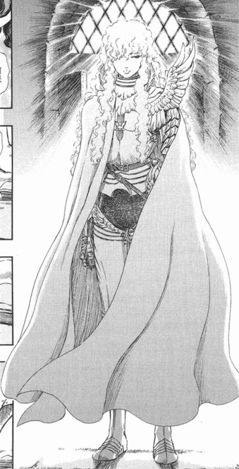

剑风传奇yyds
可惜了

----

##### 27.[0] \<pid:705151386\> 2023-07-27 08:13:06 by rrrrawae
>[jump](#pid705150714) 沁心粉钻56424(2023-07-27 08:08) 说: 
>
>问问FGO买号有什么需要注意的吗想入一个

要有足够多强力的拐，还有强力打手  
可以没有打手，一定要有强而多的拐

----

##### 28.[0] \<pid:705151808\> 2023-07-27 08:16:15 by 沁心粉钻56424
>[jump](#pid705151386) rrrrawae(2023-07-27 08:13) 说: 
>
>要有足够多强力的拐，还有强力打手  
>可以没有打手，一定要有强而多的拐

谢谢谢谢，换绑账号安全之流的呢？

----

##### 29.[0] \<pid:705152925\> 2023-07-27 08:23:53 by 行檐
小太阳——唯一不看脸看剧情就很喜欢的英灵。

----

##### 30.[0] \<pid:705153027\> 2023-07-27 08:24:26 by 霜糖点点
>[jump](#pid705138026) fealib(2023-07-27 02:54):

没看过，但是我想询问一下这是他的技能吗？？？(刚百度回来)
我大受震撼。作者什么精神状态啊啊啊

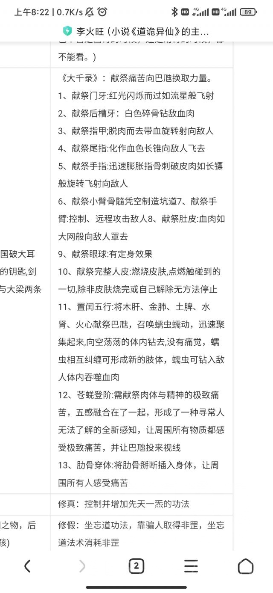

----

##### 31.[0] \<pid:705153139\> 2023-07-27 08:25:17 by rrrrawae
>[jump](#pid705151808) 沁心粉钻56424(2023-07-27 08:16) 说: 
>
>谢谢谢谢，换绑账号安全之流的呢？

防歪楼，我私信就你了

----

##### 32.[0] \<pid:705154233\> 2023-07-27 08:32:11 by 地狱叉
>[jump](#pid705139659) Rinmi-Sokukei(2023-07-27 03:42) 说: 
>
>传说系列好评  
>如果不局限于男性角色的话我觉得贝姐也挺美强惨的 又漂亮又帅气，却被一场意外夺走最珍视的事物，狂战传说也是一场“复仇”之旅？
>以及小太阳无论是在FGO还是CCC都是我的心头好，印度章的时候更是眼泪哗的就流下来，小太阳能有吉娜可在身边真的太好了。(吉娜可在CCC还是没干劲的废柴御主，然而小太阳却对她非常忠诚也不离不弃，陪着吉娜可成长。2.4她封闭自己无数轮回忍耐寂寞只为兑现约定，重见天日时小太阳也会温柔地对她说“你做的很好了”。这是何等圣心的从者……

是的，如果写到5个以后，我确实有打算把贝姐拿出来写……如此锋利且充满行动力的女性主角属实是不多见，顺便我一直很想吐槽崩三那边的“鸟为什么会飞”，对于玩过绯夜的人来说，既视感过于严重

----

##### 33.[0] \<pid:705154597\> 2023-07-27 08:34:27 by l秦珺媛
尽管没有我追的但是进来给叉老师顶楼

----

##### 34.[0] \<pid:705154770\> 2023-07-27 08:35:25 by 安林zsbd
>[jump](#pid705147228) Kadorc(2023-07-27 07:35) 说: 
>
>能和叉老师一样在fate里喜欢迦尔纳真是太好了
>最早应该是在fa小说里看到他的，真的，从未见过如此高洁神圣强大而又谦逊的英雄，东出笔下的迦尔纳是握有力量期待强敌，却是红方唯一一位将被天草控制住的御主们挂念在心上的从者，哪怕那些没有意识的御主甚至都不知道自己召唤出了什么。他不曾对任何人哪怕是敌人展露一丝攻击性，但会因为维护御主的生命而威胁同属红方的女帝。哪怕最后被同事背叛了(脚后跟消失之前给了齐格他可以用来挡住迦尔纳雷枪的宝具)，被阿福阴了，再被齐格杀了，他消失之前也不曾怨恨任何

说到迦尔纳的立绘，fgo里他的满破立绘真的笑得非常温柔一看见就觉得很舒服那种

----

##### 35.[0] \<pid:705155629\> 2023-07-27 08:40:28 by 沁心粉钻56424
>[jump](#pid705153139) rrrrawae(2023-07-27 08:25) 说: 
>
>防歪楼，我就私信你了

谢谢谢谢

----

##### 36.[0] \<pid:705156944\> 2023-07-27 08:47:56 by 五柳情州
居然还有默苍离
本来想说米哈游一直放心不下智慧、高智人设，屡战屡败屡败屡战，正好重温默苍离剪辑看到默苍离点出俏如来十九错，还给了留白，说完鼓风机吹起来简直了，短短几分钟就就只靠语音，简单的动作(布景还很粗糙)立起来了

----

##### 37.[0] \<pid:705157494\> 2023-07-27 08:50:41 by ZFBXBD
美惨强我喜欢超兽冥王和赛尔号布莱克，还有星游记的米龙。
可能这并不是我看过最好看的面残墙，但是他是我的童年回忆，印象最深刻的。(完了暴露年龄)

----

##### 38.[0] \<pid:705157719\> 2023-07-27 08:51:52 by 关闭网页
火子哥美吗？道诡因为文笔问题我实在看不下去，只知道火子哥确实很癫很惨

----

##### 39.[0] \<pid:705157805\> 2023-07-27 08:52:20 by 太阿倒持
来看看默苍离

----

##### 40.[0] \<pid:705158401\> 2023-07-27 08:55:13 by 猫蜥肉酱
>[jump](#pid705153027) 霜糖点点(2023-07-27 08:24)说:
><b>Reply to [pid=705138026,37151501,1]Reply[/pid] Post by [uid=65135937]fealib[/uid] (2023-07-27 02:54)</b>没看过，但是我想询问一下这是他的技能吗？？？(刚百度回来) 我大受震撼。作者什么精神状态啊啊啊  [img]https://img.nga.178.com/attachments/mon_202307/27/l2Q2s-1la3ZkT1kShs-12i.jpg[/img]

不止这些，还有自焚然后让周围其他人一起烧的诸如此类的技能
~~就是靠这招杀了女主全家~~

另外这其实是克系文

----

##### 41.[0] \<pid:705158498\> 2023-07-27 08:55:41 by 食茄少年
看到提到传说的贝姐了，人也是正儿八经进过监狱还要复仇的……

----

##### 42.[0] \<pid:705158919\> 2023-07-27 08:57:54 by humiko
我fgo退坑前最喜欢的就是小太阳了，温柔忠诚又沉稳，面对不公也是坦然接受，布施的英雄……小太阳最好了。

----

##### 43.[0] \<pid:705159122\> 2023-07-27 08:58:49 by 无名的弗朗西斯
我也来：终末的女武神第四回合战的赫拉克勒斯与开膛手杰克，是单元剧形式的对战，给我留下不可磨灭的深刻印象，有各种有意思的对照
善恶颠倒，主观如此，客观上行动时却形成截然相反的结果
同样有悲惨的经历，一个勇往直前，一个堕落深陷其中
善与恶的较量，顽强意志之间的碰撞
蛮力与智谋
弱小的人，最恶的杀人鬼活用起所有的因素，性格、场地、战斗风格、神器、道具，追平了与强大神明的巨大实力差距，而不屈的斗神不论遭受多少挫折，承受多大的伤害，亦不曾恐惧，不曾屈服，战斗到死亡，在用大爱最后一刻救赎了恶人。尽管是单方面智斗，各自有各自的高光，不存在垫子
从胜负看，是善输给了恶，内核上却是不折不扣的正义必胜邪恶，结局恶人并没有因为胜利便被人们接受，尽管如此，仍有人意识到“恶”也是人不可分割的一面，愿意接受他。
最后的最后，杰克以谢幕礼回应人们的恶意

善救赎恶，以前是少见的题材(难驾驭，一个崩了的例子是散草)，今后能否越过这一战的高峰另说，真是无与伦比，不知谭里有没有人知道这一战？

----

##### 44.[0] \<pid:705163362\> 2023-07-27 09:18:38 by 无聊的冻青蛙
前阵子niconico正好有up做幻想传说rta视频，讲到达奥斯过去的时候弹幕里基本也都是骂的日日现在对这种反派好像接受度也不高？
如果散兵没干过杀刀匠后人或者处于完全被动的状态才这么干的话我觉得也能像深渊传说男主那样，结果散后续的表现和人家比差太多了没眼看

----

##### 45.[0] \<pid:705164306\> 2023-07-27 09:23:00 by Awk_Liar
>[jump](#pid705153027) 霜糖点点(2023-07-27 08:24):

前几个甚至已经是他平a的程度了仗着自己有再生能力就疯狂紫餐的异端男主一枚

----

##### 46.[0] \<pid:705165882\> 2023-07-27 09:29:56 by 地狱叉
>[jump](#pid705163362) 无聊的冻青蛙(2023-07-27 09:18) 说: 
>
>前阵子niconico正好有up做幻想传说rta视频，讲到达奥斯过去的时候弹幕里基本也都是骂的日日现在对这种反派好像接受度也不高？
>如果散兵没干过杀刀匠后人或者处于完全被动的状态才这么干的话我觉得也能像深渊传说男主那样，结果散后续的表现和人家比差太多了没眼看

达奥斯主要的问题还是行事不留余地，他有一个拯救自家世界的理想，却跑来别人的星球用最残忍且不人道的方法去执行，挡路者一律杀无赦，你的10亿人民是人民，这边的都是猪狗哦？最后被人平推是应当应份，至于卢克那是3岁儿童好心办坏事，不可同日而语

----

##### 47.[0] \<pid:705171130\> 2023-07-27 09:52:47 by 碑谷soul
Fate系美强惨可太多了我的初心还是俩shirou，一个卫宫士郎，一个天草四郎

----

##### 48.[0] \<pid:705172267\> 2023-07-27 09:57:33 by 青春派洛迪
前小太阳推来了
不过我是先入坑的摩诃婆罗多再玩的fgo，在咖喱圈的时候我就喜欢小太阳了(虽然咖喱剧三观不能细品)

----

##### 49.[0] \<pid:705173840\> 2023-07-27 10:04:28 by aswaw111
想了想我有没有喜欢的美强惨角色，然后想到一个茵蒂克丝只能说好像沾边，大概

----

##### 50.[0] \<pid:705176397\> 2023-07-27 10:15:32 by 四风的烈酒
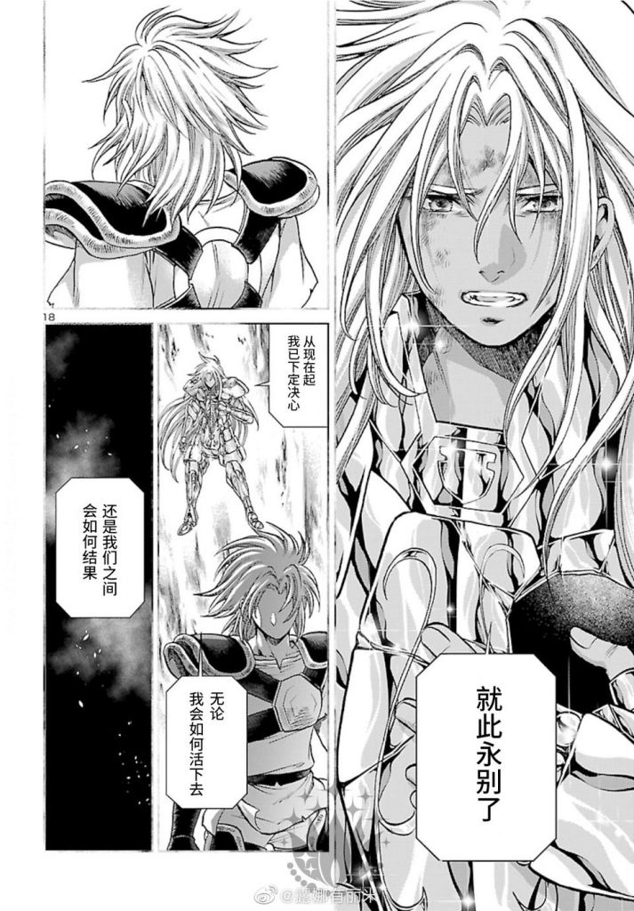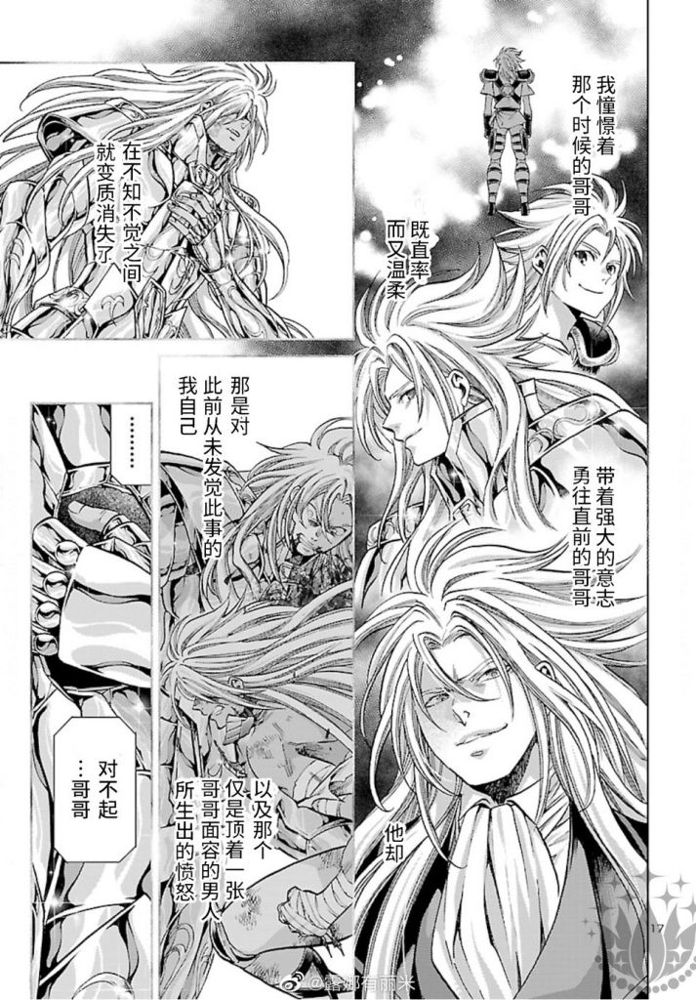
不知不觉我推的美强惨已经过去14年了~~然后今年又出了外传~~

----

##### 51.[0] \<pid:705177045\> 2023-07-27 10:18:14 by rrrrawae
>[jump](#pid705176397) 四风的烈酒(2023-07-27 10:15) 说: 
>
>
>不知不觉我推的美强惨已经过去14年了~~然后今年又出了外传~~

圣斗士LC那个吗？

----

##### 52.[0] \<pid:705178729\> 2023-07-27 10:24:59 by 四风的烈酒
>[jump](#pid705177045) rrrrawae(2023-07-27 10:18) 说: 
>
>圣斗士LC那个吗
>好像动画只做了第一季?

2季，从op画面改了就是说明到第二季了，因为赚的不多没了(其实也好，毕竟动画和漫画比挺崩的)

----

##### 53.[0] \<pid:705183293\> 2023-07-27 10:44:15 by iseeuhere
叉老师
每次都详细有逻辑，还能富有情感
因为自己的局限性拒绝领会的人没福吔

----

##### 54.[0] \<pid:705188215\> 2023-07-27 11:03:52 by 戴森林
迦尔纳我的小太阳啊啊啊，在刚接触feccc的时候就喜欢上他了，深入了解后是更加的无法自拔的喜欢了，蘑菇的功底是米忽悠无论如何都无法做到的，米忽悠能超越蘑菇的只有那份傲慢与偏见了

----

##### 55.[0] \<pid:705189236\> 2023-07-27 11:07:50 by 87123kaiu
桔梗和鲁路修中二时期跟着说过几次错的不是我是这个世界

----

##### 56.[0] \<pid:705190865\> 2023-07-27 11:13:58 by 洛长河
>[jump](#pid705138026) fealib(2023-07-27 02:54) 说: 
>
>最近有位角色极大的拔高了美强惨的上限，导致了很多作者写美强惨角色变得很艰难了
>他就是——李火旺。
>
>你游和隔壁游力推的美强惨太子，敢碰瓷这位么？

美暂且不提，强是真的强，惨也是真的惨。。。(就是别磕那bl了我一个腐女都觉得尬。。，)

----

##### 57.[0] \<pid:705192768\> 2023-07-27 11:21:29 by 好想幹林尼
說起來，蘭陵王應該也是美強慘吧

----

##### 58.[0] \<pid:705199846\> 2023-07-27 11:49:10 by 天山重
擦擦的惨是那种会让我深夜想起就开始玉玉的那种，理想主义为了理想压抑自己人性和感性的惨看了大汇演文本只想墨家早点倒闭什么没人性的破组织害人不浅啊三师徒都很惨

----

##### 59.[0] \<pid:705201287\> 2023-07-27 11:55:02 by chevalblanc
看到默教授进来顿
默教授人设是美强惨，但剧情里面他说话真是太有意思了(毒舌)，加上布局能力爆表，看起来比爽文还爽。
喜欢看智斗的推荐九龙变，智斗天花板，真好看，不像你游只会复读标签

----

##### 60.[0] \<pid:705209111\> 2023-07-27 12:29:58 by 茶叶子☆
精 神 支 柱
一定有人在等待独一无二的我
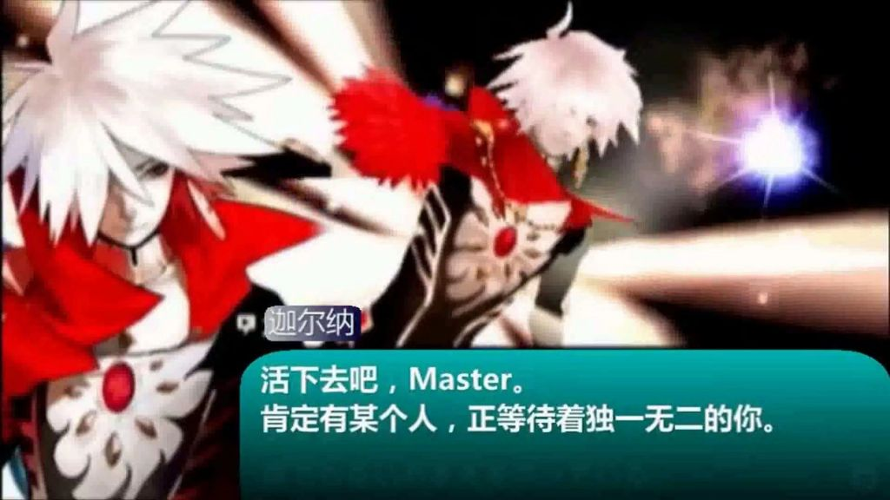  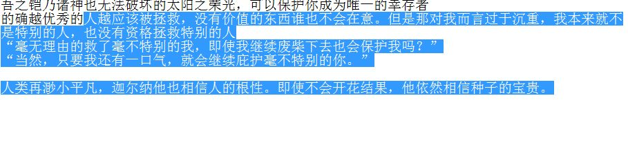

----

##### 61.[0] \<pid:705209964\> 2023-07-27 12:34:00 by kiyota119
猛哥阿周那厨子啊，难说他看了这个会怎么想
一个他一个老累，这俩阿周那厨子眼里的世界突出一个别致

----

##### 62.[0] \<pid:705210728\> 2023-07-27 12:37:42 by Sigmoni
>[jump](#pid705157719) 关闭网页(2023-07-27 08:51) 说: 
>
>火子哥美吗？道诡因为文笔问题我实在看不下去，只知道火子哥确实很癫很惨

火子哥设定上颜值堪比陈坤，但是因为经常献祭自己的人皮+自焚所以也无所谓了

----

##### 63.[0] \<pid:705211126\> 2023-07-27 12:39:32 by 花容病貌
我说为什么写的这么好
原来是1.5万字的作者
看到达奥斯我就看下去了
这是我的童年，最喜欢的作品
能不能多写点！大家都喜欢看！
直接收藏了

----

##### 64.[0] \<pid:705212780\> 2023-07-27 12:47:31 by 小神龙theory
>[jump](#pid705138026) fealib(2023-07-27 02:54) 说: 
>
>最近有位角色极大的拔高了美强惨的上限，导致了很多作者写美强惨角色变得很艰难了
>他就是——李火旺。
>
>你游和隔壁游力推的美强惨太子，敢碰瓷这位么？

原作有提到火子哥美的部分吗

----

##### 65.[0] \<pid:705214372\> 2023-07-27 12:55:07 by fealib
>[jump](#pid705212780) 小神龙theory(2023-07-27 12:47) 说: 
>
>原作有提到火子哥美的部分吗

有很多的现实世界大明星级别的颜值

----

##### 66.[0] \<pid:705231145\> 2023-07-27 14:19:53 by Giovann
一看到迦尔纳就想起叉哥结果还真是
迦尔纳也是让我去了解印度文化的契机，pako的设计更是一绝，所以feccc重制版快点启动计划吧

----

##### 67.[0] \<pid:705231506\> 2023-07-27 14:21:36 by Giovann
>[jump](#pid705209964) kiyota119(2023-07-27 12:34) 说: 
>
>猛哥阿周那厨子啊，难说他看了这个会怎么想
>一个他一个老累，这俩阿周那厨子眼里的世界突出一个别致

阿囧这种原作里龙傲天傻白甜，fgo里还是龙傲天傻白甜但是黑化了一小部分的好人瘫上这种贵物真是晦气

----

##### 68.[0] \<pid:705231698\> 2023-07-27 14:22:32 by 清明上核图
>[jump](#pid705138026) fealib(2023-07-27 02:54) 说: 
>
>最近有位角色极大的拔高了美强惨的上限，导致了很多作者写美强惨角色变得很艰难了
>他就是——李火旺。
>
>你游和隔壁游力推的美强惨太子，敢碰瓷这位么？

火子哥大部分时间连脸都没有，小部分时间连头都忘了，惨是挺惨的

----

##### 69.[0] \<pid:705231770\> 2023-07-27 14:22:55 by 纠缠的狗
>[jump](#pid705138026) fealib(2023-07-27 02:54) 说: 
>
>最近有位角色极大的拔高了美强惨的上限，导致了很多作者写美强惨角色变得很艰难了
>他就是——李火旺。
>
>你游和隔壁游力推的美强惨太子，敢碰瓷这位么？

“我真的分不清啊”

----

##### 70.[0] \<pid:705232022\> 2023-07-27 14:24:07 by Giovann
>[jump](#pid705214372) fealib(2023-07-27 12:55) 说: 
>
>有很多的现实世界大明星级别的颜值

原来火子哥很美啊，主要是毁容的时间太多了都忘了火子哥长啥样了(而且现实世界的火子哥脸上还有疤)

----

##### 71.[0] \<pid:705232511\> 2023-07-27 14:26:32 by 清明上核图
其实炎拳的男主也挺符合美强惨的，美：外观符合末世下人对于神的定义。强：成为炎拳之后所向无敌。惨：就问你他惨不惨，惨的读者都被超脱了，只想他赶紧死，活着太痛苦了

----

##### 72.[0] \<pid:705235214\> 2023-07-27 14:39:41 by tbiph9277
>[jump](#pid705141183) 白鸟过提瓦特(2023-07-27 04:32) 说: 
>
>半夜看到你这个描述~~和配图里惊人到圣洁的美貌~~去看了人物基础资料和米站一些视频，虽然好像后面恶堕成大反派但是我已经控制不住我边胃痛边补番的冲动了
>为什么这么一个美男子男二，剧情世界观却如此地这就是把像我这样的颜狗骗进来杀吗

更把你骗进来杀的是剑风传奇这个作品非常非常的优秀，但是作品还没完结作者已经去世了

----

##### 73.[0] \<pid:705245258\> 2023-07-27 15:27:23 by Rinmi-Sokukei
>[jump](#pid705154233) 地狱叉(2023-07-27 08:32) 说: 
>
>是的，如果写到5个以后，我确实有打算把贝姐拿出来写……如此锋利且充满行动力的女性主角属实是不多见，顺便我一直很想吐槽崩三那边的“鸟为什么会飞”，对于玩过绯夜的人来说，既视感过于严重

鸟为什么会飞，这是贯穿在狂战中的一个哲学议题。贝姐和那个人有不同的答案，或许玩家心中也会有。我想这就是狂战于我而言十分珍贵的回忆。
(敲碗等叉老师写贝姐

----

##### 74.[0] \<pid:705251816\> 2023-07-27 15:58:04 by Rinmi-Sokukei
后排贴一下CCC和FGO2.4 
无论是pako还是wada绘柄的小太阳都好喜欢
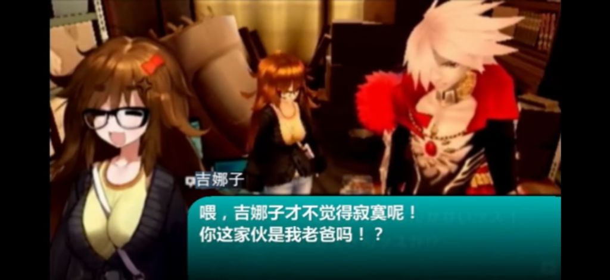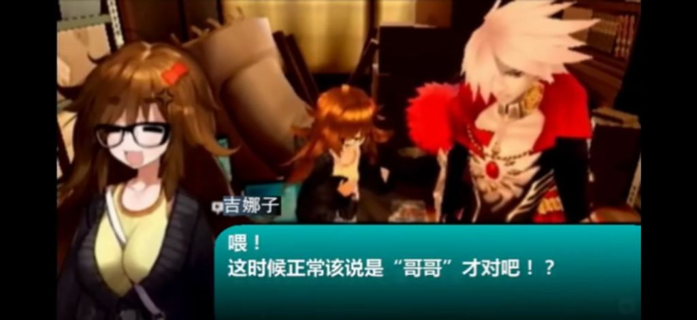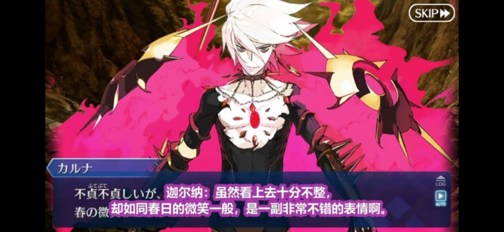

----

##### 75.[0] \<pid:705257210\> 2023-07-27 16:21:06 by akaya210
被小太阳炸出来了+1
真的没法想象有人会讨厌月球的小太阳的可能性，他真的太好了，像太阳一般，但又觉得自己这么做没什么、无需根据这类行为夸赞他……
~~(太圣人了以至于我看他的NSFW都带着罪恶感甚至不敢ML、只希望他能好好的，好好的就行，别的什么都不奢求了)~~

他在FECCC的御主吉娜可也相当让人深有共鸣，总体来说算是普通人+宅的缩影，但在FGO里做出了相当厉害的事情！
太阳主从真的是太好了，能在FGO见面真的是太好了。

小太阳CCC主从的介绍视频推荐B站UP主削人棍专用BGM的杂谈(其他的好像也有但不记得了)：
[[FGO2.4杂谈]带你康康印度神话、家里蹲的逆袭、以及唯一神的诞生] [url](https://www.bilibili.com/video/BV1tt4y197Uf/?share_source=copy_web&amp;vd_source=14f2ec9ed544a2e7def02a011a7efdaf)
(视频主要围绕FGO2.4剧情内容介绍与挖掘展开的，吉娜可篇特别喜欢，视频里有一句话至今还记得：“什么都不做，继而什么都不想做，最终什么都做不了。”)

至于月球的阿周那，东出捏的人设要是对上眼了还是很对胃口的~~(一款ML系里御主的女朋友)~~，能让他从希望得到永远的孤独变成希望陪伴御主到最后一刻、并且直言“很高兴能遇见你”的玩家形象也相当精彩！
~~渴望踏上美好的旅途见证一段相当棒的剧情还等什么快点入坑FGO吧~~

