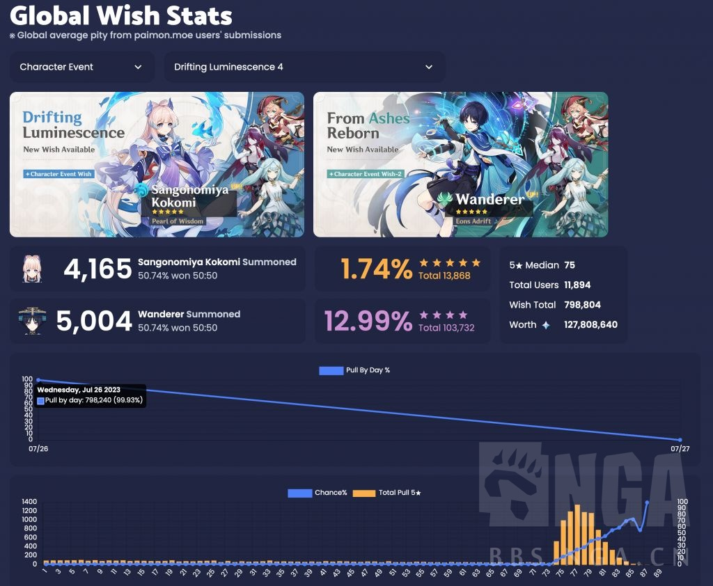
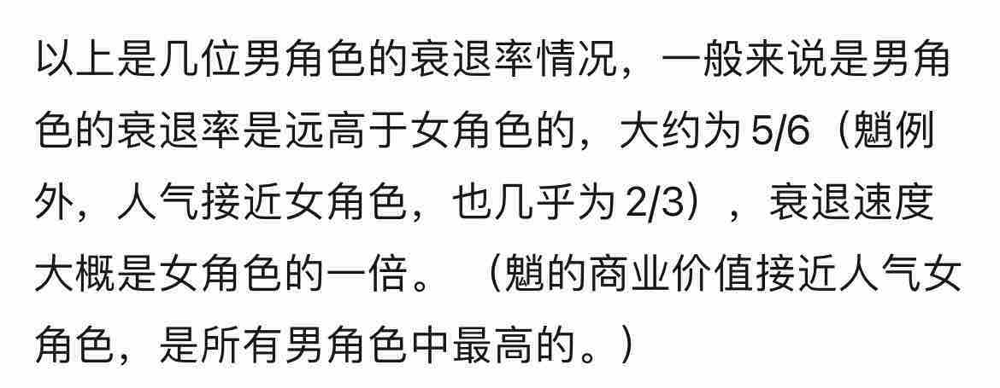

### [热点事件] 介绍一下散兵池首日的流水情况

Made by ngapost2md (c) ludoux [GitHub Repo](https://github.com/ludoux/ngapost2md)

----

##### 0.[6] \<pid:0\> 2023-07-27 00:43:27 by pataphysicien
起因是看到各位朋友总爱拿七麦的数据比较流水，贴主觉得这种锚定排名的流水确实缺乏定量分析，不是很让人信服。

抱着实事求是(闲着没事)的态度，贴主自己搞了个数据小研究，分析了下散兵池的首日抽取数据。
不吊大家胃口，先说结论吧，散兵这次复刻的数据确实是相当的拉胯，估计老米内部都受到了不小的惊吓。

这里我只用一个指标，就能说明问题：卡池衰退率。
这个词是指两次复刻之间，角色抽取数量的衰退率，因为一般来说，复刻抽的次数总是会远小于首池。(雷神、夜兰等少数例外)
选取这个指标的好处在于，只要数据上传网站锚定的活跃用户总量不产生太大变动，那么以该样本群体作为参照，是能很好判断整体流水变动情况的。

贴主用了派蒙网的数据作为参考，排除了雷神、夜兰等个别反常数据，发现了一些有意思的小结论：
1.人气女角色的衰退率大差不差，基本都是2/3左右，也就是说复刻抽取数一般为上次抽取数的1/3 左右。
2.男角色的衰退率是高于女角色的，大约为5/6(钟离例外)，衰退速度大概是女角色的一倍。

因为衰退率是一个基本上较为稳定的指标，贴主认为这个是能衡量一个角色人气(粘性)的标准，也是卡池流水预估的有效指标。

以下是几组参照组的表现情况

八重

甘雨

公子

剩下的具体数据大家可以去派蒙网看，我就不搬运了

以下进入1分钟正片环节：我们看看须弥太子的卡池衰退率，由于卡池还未关闭，选取换算后的首池首日祈愿次数作为替代指标。

经过抽取比例换算，太子首池首日祈愿次数2,881,683次，复刻首日祈愿次数439,553次
卡池首日衰退率约合0.85，(角色卡池流水预估为首池的1/7) 左右，衰退速度高于一般人气男角色平均卡池(1/6)。

结论：须弥太子此次复刻情况打不过三无复刻。
米家真有内鬼了，敢情搞模型、ep，控评、买量，都是反向宣发。(还真有人嫌自己凉得不够快，乐)

----

##### 1.[0] \<pid:705127858\> 2023-07-27 00:45:34 by pataphysicien
以上是我在贴吧首发的，刚看见有朋友问，正好发一下。

----

##### 2.[2] \<pid:705128340\> 2023-07-27 00:49:51 by 衛陽
我反而看到这个数据觉得很正常，因为1/6和1/7差不多(如果()不是定位那几个反常角色的话)。
我根本不会觉得米吓了一跳，我永远在棺材上才开香槟。

----

##### 3.[0] \<pid:705128364\> 2023-07-27 00:50:01 by 113322qwe1
也就某些3畜或者米忽悠的流水厨觉得重要吧

----

##### 4.[0] \<pid:705128523\> 2023-07-27 00:51:29 by rionp
米咋可能吓一跳，我觉得他们只会更傲慢地觉得玩家果真啥都不懂

----

##### 5.[1] \<pid:705128668\> 2023-07-27 00:52:50 by pataphysicien
>[jump](#pid705128340) 衛陽(2023-07-27 00:49)说:
>我反而看到这个数据觉得很正常，因为1/6和1/7差不多(如果()不是定位那几个反常角色的话)。 我根本不会觉得米吓了一跳，我永远在棺材上才开香槟。

你知道魈和钟离都是2/3吗？多说一句，公子大概是是3/4。

----

##### 6.[2] \<pid:705128803\> 2023-07-27 00:54:14 by Nghez
他们只会出更多的太子剧情来证明他们没有错

----

##### 7.[0] \<pid:705128895\> 2023-07-27 00:55:06 by 黑蜀黍电动输弹机
现在没法确认的是第一天流水是厨子在死顶还是常态如此
如果是前者的话那么收官阶段就能看出吸不来路人粉，最后小于1/7

----

##### 8.[0] \<pid:705129005\> 2023-07-27 00:56:02 by 大牧羊犬
你这整的我好奇雷神夜兰发生了什么

----

##### 9.[0] \<pid:705129136\> 2023-07-27 00:57:09 by 末日时会做什么
>[jump](#pid705128668) pataphysicien(2023-07-27 00:52) 说: 
>
>你知道魈和钟离都是2/3吗？多说一句，公子大概是是3/4。

公子这是糊糊的很安心……(开个玩笑不要打我

----

##### 10.[0] \<pid:705129164\> 2023-07-27 00:57:23 by bishoujo！！！
本来挺好一模型，结果被剧情和狂热粉丝还有制作组私活拖累，可能这就是失败中的失败吧。

----

##### 11.[0] \<pid:705129286\> 2023-07-27 00:58:39 by pataphysicien
>[jump](#pid705128895) 黑蜀黍电动输弹机(2023-07-27 00:55)说:
>现在没法确认的是第一天流水是厨子在死顶还是常态如此 如果是前者的话那么收官阶段就能看出吸不来路人粉，最后小于1/7

没事，大气点给1/7还是很难看，只要结论还是反向宣发，就够能让大伙一乐了。

----

##### 12.[0] \<pid:705129313\> 2023-07-27 00:58:58 by 玩c罗玩的
这下让我想看看别的角色了

----

##### 13.[0] \<pid:705129505\> 2023-07-27 01:00:52 by mASAYUMecHASIN
楼主，能分析一下海森吗？

----

##### 14.[0] \<pid:705129687\> 2023-07-27 01:02:15 by 扶光む
>[jump](#pid705129505) mASAYUMecHASIN(2023-07-27 01:00) 说: 
>
>楼主，能分析一下海森吗？

我看别的帖说是将近15w比2w，只能说卖腐应得的

----

##### 15.[0] \<pid:705130060\> 2023-07-27 01:04:53 by pataphysicien
>[jump](#pid705129687) 扶光む(2023-07-27 01:02)说:
>[quote][pid=705129505,37151662,1]Reply[/pid] <b>Post by [uid=65201085]mASAYUMecHASIN[/uid] (2023-07-27 01:00):</b>  楼主，能分析一下海森吗？[s:ac:羡慕][/quote]我看别的帖说是将近15w比2w，只能说卖腐应得的[s:ac:哭笑][img]https://img.nga.178.com/attachments/mon_202307/27/l2Q2s-3zjtK19T1kSg4-8q.jpg[/img][img]https://img.nga.178.com/attachments/mon_202307/27/l2Q2s-41zsK1fT1kSg4-95.jpg[/img]

人设不讨喜，复刻间隔时间短，就是这样的。

----

##### 16.[0] \<pid:705130229\> 2023-07-27 01:06:12 by momookyk
>[jump](#pid705129005) 大牧羊犬(2023-07-27 00:56) 说: 
>
>你这整的我好奇雷神夜兰发生了什么

强度过高，两者都是强力泛用插件(夜兰后台开个Q，只要你打普攻，丘丘人都能给你扶起来)

----

##### 17.[0] \<pid:705130550\> 2023-07-27 01:08:29 by UID42694396
>[jump](#pid705129005) 大牧羊犬(2023-07-27 00:56)说:
>你这整的我好奇雷神夜兰发生了什么[s:ac:哭笑]

两个复刻池创了流水新高你说发生了什么

----

##### 18.[0] \<pid:705130699\> 2023-07-27 01:09:39 by mdy3502
首次复刻衰退率基本不受跨版本拉新影响，作为指标应该更好？
另外3.x版本中途热度跳崖，对总活跃样本的影响也不容小觑。如果能放出来须弥版本各角色的首次复刻衰退率，以及须弥对比其他地区的整体衰退率，就更有意思了

----

##### 19.[0] \<pid:705130863\> 2023-07-27 01:11:03 by mASAYUMecHASIN
>[jump](#pid705129687) 扶光む(2023-07-27 01:02)说:
>[quote][pid=705129505,37151662,1]Reply[/pid] <b>Post by [uid=65201085]mASAYUMecHASIN[/uid] (2023-07-27 01:00):</b>  楼主，能分析一下海森吗？[s:ac:羡慕][/quote]我看别的帖说是将近15w比2w，只能说卖腐应得的[s:ac:哭笑][img]https://img.nga.178.com/attachments/mon_202307/27/l2Q2s-3zjtK19T1kSg4-8q.jpg[/img][img]https://img.nga.178.com/attachments/mon_202307/27/l2Q2s-41zsK1fT1kSg4-95.jpg[/img]

谢谢好心人，喜欢看

----

##### 20.[0] \<pid:705130895\> 2023-07-27 01:11:23 by pataphysicien
>[jump](#pid705130699) mdy3502(2023-07-27 01:09)说:
>首次复刻衰退率基本不受跨版本拉新影响，作为指标应该更好？ 另外3.x版本中途热度跳崖，对总活跃样本的影响也不容小觑。如果能放出来须弥版本各角色的首次复刻衰退率，以及须弥对比其他地区的整体衰退率，就更有意思了

甘雨几次复刻跨版本的。

----

##### 21.[0] \<pid:705130981\> 2023-07-27 01:12:10 by 老婆说什么都对
散这个，感觉就是路人盘崩了造成的

----

##### 22.[0] \<pid:705131536\> 2023-07-27 01:16:48 by 嗯嗯哒吧
>[jump](#pid705129005) 大牧羊犬(2023-07-27 00:56) 说: 
>
>你这整的我好奇雷神夜兰发生了什么

雷神首次up54.7w
复刻025.1w，首次up的5/11，4个版本间隔
二次20.1w，首次的4/11，，上次复刻的4/5，6个版本间隔
夜兰首次up25.4w
第一次复刻18.8w，首次up的3/4，5个版本间隔
，给太子，5个版本复刻间隔，复刻比的一点小小的震撼

----

##### 23.[0] \<pid:705132535\> 2023-07-27 01:26:34 by mdy3502
>[jump](#pid705130895) pataphysicien(2023-07-27 01:11) 说: 
>
>甘雨几次复刻跨版本的。

是啦，只是说减少变量结论可能更稳健些～

----

##### 24.[0] \<pid:705132882\> 2023-07-27 01:30:09 by pataphysicien
>[jump](#pid705132535) mdy3502(2023-07-27 01:26)说:
>[quote][pid=705130895,37151662,2]Reply[/pid] <b>Post by [uid=65134240]pataphysicien[/uid] (2023-07-27 01:11):</b>  甘雨几次复刻跨版本的。[/quote]是啦，只是说减少变量结论可能更稳健些～

横向的其实也很容易看，就比较每个卡池消耗的原石数量就行了，心海散兵的首日数据我记得稍微比优菈可莉高一点点，两者基本差不多。

----

##### 25.[0] \<pid:705134289\> 2023-07-27 01:48:34 by szqiyimu
这个不准的
有些女角色衰退率绝对是负的，打比方夜兰，复刻绝对是比首发抽的多的，但你这里还是衰退的
因为这个网站是你要去更新才会有结果，所以历史越久的池子，采样率越高，对比新复刻池，衰退也更多，但是散兵的复刻和首发离得并不远，这个衰退率我觉得是低估了的。

----

##### 26.[0] \<pid:705134397\> 2023-07-27 01:50:05 by pataphysicien
>[jump](#pid705134289) szqiyimu(2023-07-27 01:48)说:
>这个不准的 有些女角色衰退率绝对是负的，打比方夜兰，复刻绝对是比首发抽的多的，但你这里还是衰退的 因为这个网站是你要去更新才会有结果，所以历史越久的池子，采样率越高，对比新复刻池，衰退也更多，但是散兵的复刻和首发离得并不远，这个衰退率我觉得是低估了的。

我寻思八重复刻得不慢啊。。。

----

##### 27.[0] \<pid:705134967\> 2023-07-27 01:57:55 by szqiyimu
>[jump](#pid705134397) pataphysicien(2023-07-27 01:50) 说: 
>
>我寻思八重复刻得不慢啊。。。

你还忽略了距离今天的日期，理论上，排除玩家群体变更的因素，距今天越远的池子得到的数据会越全
还有，玩家的更新抽卡的行为模式不是线性的，是事件驱动的，如果特定玩家群体已经退坑，那他们是不会来更新抽卡数据的，在原玩家退坑潮和群体特征出现变动的当下，我觉得这个算法低估了散兵的衰退率。1/6和1/7差的很多么？无法解释60小时到0小时的巨变的。

----

##### 28.[0] \<pid:705136031\> 2023-07-27 02:16:53 by 江海寄余生ξ
你怎么自己搬自己的帖子还搬少了？是怕引起战争吗

----

##### 29.[0] \<pid:705136983\> 2023-07-27 02:36:11 by 哒哒块
假设衰退率不变，她下次复刻大概是14w(实际因为慌忙的原因可能更低)

小男孩直接套海哥的15w(初见好感何德何能跟海哥比)

也就是总销量指标不会超过29w，接近八重2.5水平？

----

##### 30.[0] \<pid:705162727\> 2023-07-27 09:15:53 by 巳吕成卯师全
>[jump](#pid705136031) 江海寄余生ξ(2023-07-27 02:16) 说: 
>
>你怎么自己搬自己的帖子还搬少了？是怕引起战争吗
>
>

别人怎么想还不好说，三阶看到这条可不得原地气死，虾仁猪心啊

----

##### 31.[0] \<pid:705168384\> 2023-07-27 09:40:57 by 球球游侠
>[jump](#pid705162727) 巳吕成卯师全(2023-07-27 09:15) 说: 
>
>别人怎么想还不好说，三阶看到这条可不得原地气死，虾仁猪心啊

确实，气不气别人不知道，但是三姐一定气的要死

