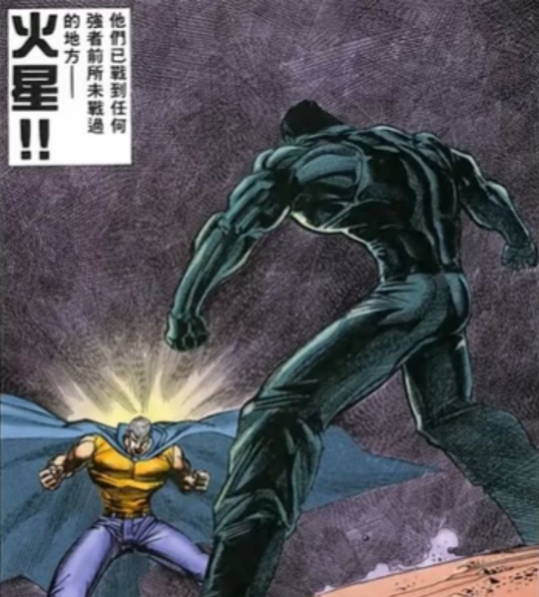

### [不吐不快]散兵冲树相关问题

Made by ngapost2md (c) ludoux [GitHub Repo](https://github.com/ludoux/ngapost2md)

----

##### 0.[0] \<pid:0\> 2023-07-27 04:16:41 by pspniw1w1xindingmy
为什么总有人说散兵冲树是为了消除自身的影响。
我们就假设散兵的目的就是这样，但是他失败了啊，失败之后是不是又取回了记忆，那他取回记忆后又干了什么呢？忏悔？赎罪？有什么具体行动吗？别人是不知道你干的那些杀人放火的事了，你自己取回记忆了你还不知道嘛？就一点愧疚之心都没有觉得理所应当的是吧，反正我已经冲过树了，他没成功我的罪孽也消失的一干二净了，那我现在就是洁白无瑕的是吧？？？哕，恶心。

----

##### 1.[0] \<pid:705140885\> 2023-07-27 04:18:38 by 小小小棠芫
致远星战况如何？
还是刚入坑的萌新

----

##### 2.[0] \<pid:705140888\> 2023-07-27 04:18:43 by 莫莫宵
那我会说 很重要吗？只有你们雷电五传厨才会觉得重要吧

----

##### 3.[0] \<pid:705140940\> 2023-07-27 04:20:23 by Scaramer
蒸馍，旅行者，这都是我的意思

----

##### 4.[0] \<pid:705141000\> 2023-07-27 04:23:30 by 垂露东风
被其他剧情恶心是每个萌新都要经历的一环

----

##### 5.[0] \<pid:705141090\> 2023-07-27 04:27:16 by pspniw1w1xindingmy
>[jump](#pid705140885) 小小小棠芫(2023-07-27 04:18) 说: 
>
>致远星战况如何？
>还是刚入坑的萌新

不是，只是刚刚看视频评论下面一堆说散兵冲树是抱着消除自己然后让世界变好去的，看得我恶心，我已经尽力在3.3往后不看散兵和草神相关的剧情了，但是他们这种只要我有牺牲精神那我就是正派的这种说辞真的是令人作呕。

----

##### 6.[1] \<pid:705141159\> 2023-07-27 04:31:01 by CHNGHO
自毁不就是逃避吗，逃避凄惨的过去，那也是自己作的恶业，紫炒一次了有什么用

----

##### 7.[1] \<pid:705141184\> 2023-07-27 04:32:10 by 透明级
用不正当手段赎罪结果造成了更严重的恶
草王：比例尺
mhy：兰纳罗
散兵：往事俱已成空
散厨：他白了(但你不许说他有洗白)

----

##### 8.[0] \<pid:705141263\> 2023-07-27 04:35:52 by pspniw1w1xindingmy
>[jump](#pid705141159) CHNGHO(2023-07-27 04:31) 说: 
>
>自毁不就是逃避吗，逃避凄惨的过去，那也是自己作的恶业，紫炒一次了有什么用

他撞树要是成了把他的罪孽一笔勾销了那我顶多说他句懦夫，也不会对他有太大的敌意，但是他没成还把自己的罪孽熟视无睹就很令人恶心了

----

##### 9.[0] \<pid:705141301\> 2023-07-27 04:37:28 by cecial
不冲树怎么变成风系小男孩，问问神父吧

----

##### 10.[0] \<pid:705141416\> 2023-07-27 04:43:03 by ptreesptrees
我以前举过一个例子就是散兵想上服务器修bug,结果不仅没修好还把别人的数据删了,顺便还把自己的犯罪记录转到别人头上,事后没看出一点弥补的态度.
搁现实里也是要蹲橘子的行为,何况他影响的不是什么数据,而是别人的整个人生,要更恶劣得多.

----

##### 11.[0] \<pid:705141789\> 2023-07-27 05:03:22 by 还想长高耶
我觉得他就是为了抹去罪行的，不过现在不重要了

----

##### 12.[0] \<pid:705142796\> 2023-07-27 05:53:16 by 我修院淳平

----

##### 13.[0] \<pid:705158108\> 2023-07-27 08:53:52 by 野猫布鲁斯
他说了啊，那些被灭门几百年的人大可以找他复仇

----

##### 14.[0] \<pid:705170182\> 2023-07-27 09:48:41 by a463880809
>[jump](#pid705158108) 野猫布鲁斯(2023-07-27 08:53) 说: 
>
>他说了啊，那些被灭门几百年的人大可以找他复仇

复仇?
百目家:是我，杀了我?

----

##### 15.[0] \<pid:705172790\> 2023-07-27 09:59:50 by 野猫布鲁斯
>[jump](#pid705170182) a463880809(2023-07-27 09:48) 说: 
>
>复仇?
>百目家:是我，杀了我?

这就是地狱笑话的地方，雷电五传有的已经被灭门了，有后代的家族在他们认知里也是百目家杀的，永远不可能有人来找其他

----

##### 16.[0] \<pid:705173533\> 2023-07-27 10:03:09 by 是风动，也是心动
>[jump](#pid705170182) a463880809(2023-07-27 09:48)说:
>[quote][pid=705158108,37152508,1]Reply[/pid] <b>Post by [uid=65166700]野猫布鲁斯[/uid] (2023-07-27 08:53):</b>  他说了啊，那些被灭门几百年的人大可以找他复仇[/quote]复仇? 百目家:是我，杀了我?

笑了，复仇？你把人家记忆都搞没了怎么让人家复仇？

还是说他都说了让你黄毛摄像头告诉别人？得了吧，摄像头就是摄像头，去稻妻活动的时候可快乐了，和派蒙那是一点不记得这事的。

你散兵都宣传大世界飞行能力，怎么就不能从须弥飞到稻妻去呢？喔忘了，现在科技发达不需要飞都行，还有船呢，稻妻可没有锁国了

----

##### 17.[0] \<pid:705174859\> 2023-07-27 10:08:56 by 油门踩到底
冲树剧情上没有问题，符合散兵的人设逻辑的
本身散兵这个角色就是胆小鬼，欺软怕硬，最后冲树无非是失败了，就摆烂了，但贼心不死。
散兵冲树就是为了消除自身，当鸵鸟，不接受自己是个小丑的现实。
换句话说，散兵冲树就像下卡池梭哈，保底消除自身，可以搏一搏更好的结果，博出来算我散兵的功劳，博不出来我也没辙。但万一沉了，出了点啥问题我也没办法
如果跳一下世界就恢复到我不存在的样子，那更好；要是出事了我也没办法，反正我都把自己删了你能把我咋地

一句话概括：在生命的最后拿私自拿世界的根本(世界树)做赌注梭哈，让全世界为他的失败人生承担连带风险

----

##### 18.[0] \<pid:705178440\> 2023-07-27 10:23:44 by 洛长河
>[jump](#pid705141184) 透明级(2023-07-27 04:32) 说: 
>
>用不正当手段赎罪结果造成了更严重的恶
>草王：比例尺
>mhy：兰纳罗
>散兵：往事俱已成空
>散厨：他白了(但你不许说他有洗白)

如白

----

##### 19.[0] \<pid:705179712\> 2023-07-27 10:29:12 by 司及乌
散兵冲树我本来以为是那种“我希望我从未出生”否定自己存在的意义消灭自己的存在，然后因为他从未出生因他而起的悲剧也从未发生，所有人都有可能过上幸福的生活起码一定不会葬送在因他而起的愚蠢悲剧里。结果好吧这太因果了对于考据党脆弱的神经又是一次巨大打击但是这很重要吗.jpg
但是只是找了替罪羊真是太小丑了我看了这么多年ACGN类作品第一次见甩锅式洗白法，编剧功力深厚哇

----

##### 20.[0] \<pid:705180534\> 2023-07-27 10:32:45 by 霜糖点点
解决不了就自杀挺符合他的人设的……问题在于后面发生的一切

----

##### 21.[0] \<pid:705181667\> 2023-07-27 10:37:38 by 冰冷的心脏

