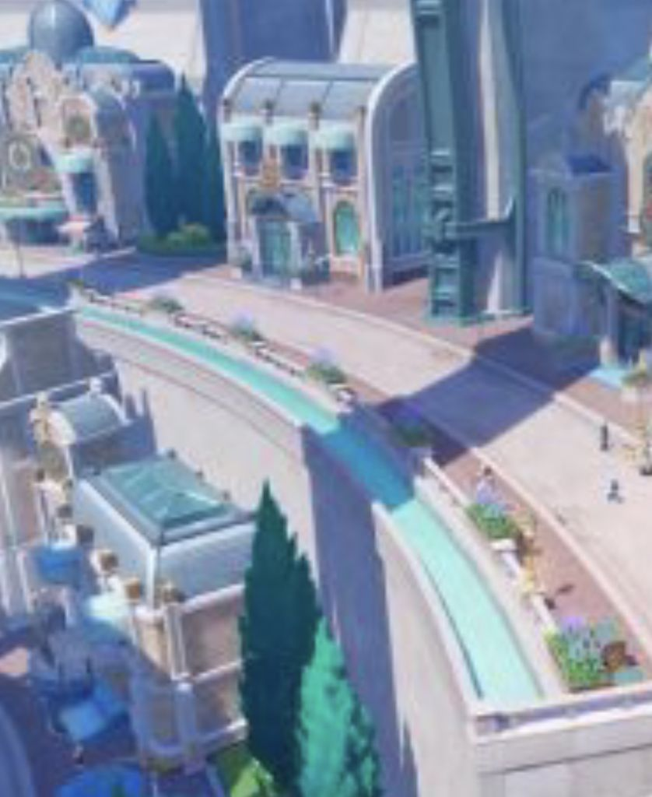

### [不吐不快]直球推荐刚发现的枫丹建筑的考据帖

Made by ngapost2md (c) ludoux [GitHub Repo](https://github.com/ludoux/ngapost2md)

----

##### 0.[0] \<pid:0\> 2023-07-27 07:12:52 by 宇宙の音
[url](https://ngabbs.com/read.php?tid=37152407)

真的，不带情绪输出，这帖子写的风趣幽默，而且行文清晰(比我这种写文思维跳跃ex的清晰几倍)

我觉得对枫丹建筑风格有想法，但没有相关了解的朋友可以看看，真的很不错。作为科普闲读，或者作为素材积累，都很有价值

----

##### 1.[0] \<pid:705146059\> 2023-07-27 07:20:59 by mihomopromax
看他通篇想给米哈游找补最后崩溃笑出声。很多人虽然没有专业的知识但是有一套符合现实理学的思维逻辑的，这枫丹建筑如此反常人会下意识觉得有问题。

----

##### 3.[0] \<pid:705146744\> 2023-07-27 07:29:56 by 宇宙の音
>[jump](#pid705146059) mihomopromax(2023-07-27 07:20) 说: 
>
>看他通篇想给米哈游找补最后崩溃笑出声。很多人虽然没有专业的知识但是有一套符合现实理学的思维逻辑的，这枫丹建筑如此反常人会下意识觉得有问题。

是啊。我直接选择回复并摘抄，这考据大佬太给力了，发问和推测都是暴击啊

----

##### 4.[0] \<pid:705146960\> 2023-07-27 07:32:34 by wzdlc
想到了神子专武名字那个事儿mhy如果改了记得给老哥打钱嗷

----

##### 5.[0] \<pid:705148031\> 2023-07-27 07:44:57 by tsqtt
这重要吗？只有考据党觉得重要吧

----

##### 6.[0] \<pid:705149260\> 2023-07-27 07:56:03 by coyove
稻妻那会儿好像还有天守阁榻榻米形状考究，大家都赞叹一句好细，到枫丹已经塔防成这样
不过毕竟不是母国，可以原谅

----

##### 7.[0] \<pid:705149606\> 2023-07-27 07:59:05 by buyuchan2
这事重要吗，也就喜欢水上儿童乐园的人觉得重要吧

----

##### 8.[0] \<pid:705155173\> 2023-07-27 08:37:50 by S.R.I.Saracroops
>[jump](#pid705146577) 一念の差(2023-07-27 07:27) 说: 
>
>进去复读这很重要吗，会不会被口

正经考据还是不太建议玩这个梗了，毕竟刷多了确实没什么内容。

需要展现攻击性或者理查用用问题不大。

----

##### 9.[0] \<pid:705158461\> 2023-07-27 08:55:29 by cocotm1989
有饭圈脑残粉抽卡就行了，没人在乎大世界

----

##### 10.[0] \<pid:705160443\> 2023-07-27 09:05:24 by 月上七楼6004537238
这么一列举，发现蒙德大教堂真顺眼真好看啊，之前都没注意过

----

##### 11.[0] \<pid:705160508\> 2023-07-27 09:05:40 by 陌生的牙刷
细节爆炸=&gt;细节多看一眼就会爆炸
我要笑死了

----

##### 12.[0] \<pid:705164992\> 2023-07-27 09:26:14 by 宇宙の音
>[jump](#pid705160508) 陌生的牙刷(2023-07-27 09:05) 说: 
>
>细节爆炸=&gt;细节多看一眼就会爆炸
>我要笑死了

是的是的，真的读下来又欢乐又有收货

----

##### 13.[1] \<pid:705165158\> 2023-07-27 09:26:59 by 宇宙の音
>[jump](#pid705160443) 月上七楼6004537238(2023-07-27 09:05) 说: 
>
>这么一列举，发现蒙德大教堂真顺眼真好看啊，之前都没注意过

作者直接配一句“(哥特在蒙德呢，没想到吧各位)”

论枫丹抬高了蒙德的含金量hhh

----

##### 14.[0] \<pid:705165280\> 2023-07-27 09:27:30 by 食茄少年
这下真的太细了

----

##### 15.[0] \<pid:705165594\> 2023-07-27 09:28:53 by Sern·Simuka
只能说其实我挺喜欢这种考据帖的，学到了很多
只是看到连考据老哥都一脸无语我现在有点想笑

----

##### 16.[0] \<pid:705165854\> 2023-07-27 09:29:52 by 凌依凌依
>[jump](#pid705146577) 一念の差(2023-07-27 07:27)说:
>进去复读这很重要吗，会不会被口[s:a2:doge]

精华帖捣乱处罚超级加倍，你考虑好

----

##### 17.[0] \<pid:705166908\> 2023-07-27 09:34:37 by 侵晓窥檐语丶
这很重要吗？只有法国人才觉得重要吧反正国外流水都g了，咱们普通中国人只觉得怪又说不出所以然

----

##### 18.[0] \<pid:705168298\> 2023-07-27 09:40:31 by sumoboss
看得好想出去旅游，考据佬选得图每张都直击我的心黄金比例设计真的太漂亮了

----

##### 19.[0] \<pid:705170838\> 2023-07-27 09:51:29 by 小腿的btq
枫丹这地图看着是真的像宝可梦的地图。。。尤其是街道的那个图，一眼宝可梦医院 各种商店 道馆啥的

----

##### 20.[0] \<pid:705174927\> 2023-07-27 10:09:09 by hx0539
玩ff的其实一打眼就觉得枫丹主城形似

----

##### 21.[0] \<pid:705584667\> 2023-07-29 07:25:07 by Tony特别帅
实在是对不住科普老哥但不得不说这个小房子跟我小时候看到的玩具小模型差不多。。。
唯一问题是我实在想不起来到底是什么系列的玩具了，查理有没有哪位老哥见过啊？

----

##### 22.[0] \<pid:705596101\> 2023-07-29 09:21:49 by 呜喵Loa
>[jump](#pid705584667) Tony特别帅(2023-07-29 07:25) 说: 
>
>实在是对不住科普老哥但不得不说这个小房子跟我小时候看到的玩具小模型差不多。。。
>唯一问题是我实在想不起来到底是什么系列的玩具了，查理有没有哪位老哥见过啊？
>

芭比娃娃？

----

##### 23.[0] \<pid:705597030\> 2023-07-29 09:28:19 by 锈河F
>[jump](#pid705584667) Tony特别帅(2023-07-29 07:25)说:
>实在是对不住科普老哥但不得不说这个小房子跟我小时候看到的玩具小模型差不多。。。 唯一问题是我实在想不起来到底是什么系列的玩具了，查理有没有哪位老哥见过啊？ [img]https://img.nga.178.com/attachments/mon_202307/29/l2Q2s-lcvxK27T3cSna-sg.jpg.medium.jpg[/img]

看起来像那种旁边立面有个拉杆，一压就中间三个屏幕滚动的抽奖老虎机

----

##### 25.[0] \<pid:705598227\> 2023-07-29 09:36:06 by Khris2456
插个矛等等看

----

##### 26.[0] \<pid:705622775\> 2023-07-29 12:01:22 by Euncydar
说实话脱离游戏和吐槽这也是篇不错的帖子 ~~想起以前看的各种简史~~

