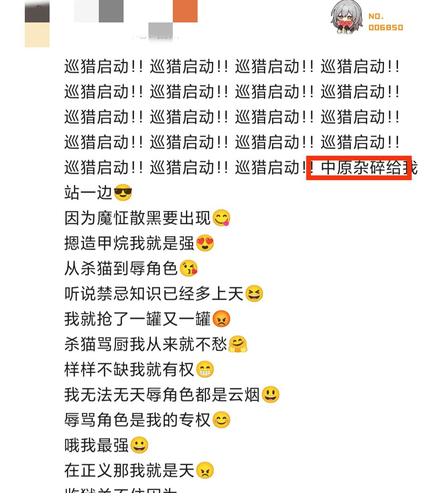

### [热点事件]ep评论区看见的，这下菜名有问题都不演了是吧

Made by ngapost2md (c) ludoux [GitHub Repo](https://github.com/ludoux/ngapost2md)

----

##### 0.[3] \<pid:0\> 2023-07-27 09:21:03 by 月上七楼6004537238
不是?结晶那么努力把中原杂碎说成单纯的菜名了，这边反手背刺友军?

----

##### 1.[7] \<pid:705164171\> 2023-07-27 09:22:26 by 一个苦柚子
说了一万遍了我还是要说
在自家评论区拉屎真的好蠢

----

##### 2.[1] \<pid:705164411\> 2023-07-27 09:23:31 by 铁观音奶冻家军

引用猛干先生的话，
看一群人……真是太快乐了

----

##### 3.[0] \<pid:705164464\> 2023-07-27 09:23:45 by mihomopromax
这很重要吗，也只有被夺舍的先驱觉得重要吧

----

##### 4.[0] \<pid:705164512\> 2023-07-27 09:23:56 by Inquisit
原来他们也知道中原杂碎在骂谁呀

----

##### 5.[0] \<pid:705164814\> 2023-07-27 09:25:21 by 九叶喵
这帮人真的，呃，弱智且低能？

----

##### 6.[0] \<pid:705164985\> 2023-07-27 09:26:12 by GravityRush
真的不是很懂 仙家军怎么有脸把自己叫成巡猎的？

----

##### 7.[0] \<pid:705164987\> 2023-07-27 09:26:13 by 当个乐子人
米哈游家大业大，能不能养点聪明的？

----

##### 8.[0] \<pid:705165003\> 2023-07-27 09:26:16 by 沙漏和gsx
这就是为什么说仙是一群低能智障呢

----

##### 9.[3] \<pid:705165088\> 2023-07-27 09:26:39 by 野猫布鲁斯
从猛干来看米高层明显什么都懂，那之前起节奏的中原杂碎，枝枝楠楠龙龙，立本，贯虹等等米到底是怎么想的真不好说了

----

##### 10.[0] \<pid:705165369\> 2023-07-27 09:27:50 by 嘀嘟滴嘟嘀
仙手摇独轮车那么厉害，怎么不爆金币呢？
把散的流水冲上去不就狠狠的打散黑的脸？
建议仙借钱给散兵冲冲流水。

----

##### 11.[4] \<pid:705165423\> 2023-07-27 09:28:04 by 雁门关下的小蘑菇
讲真，当年对中原杂碎这个节奏我是很不理解的，因为我一个内蒙人从小吃杂碎长大，看到杂碎这俩字的第一反应永远是好吃来一碗而不是脏话我当时寻思可能写这个的文案也经常吃杂碎，所以没觉出有啥问题
不过现在嘛，以最大的恶意揣测mhy就对了，谁让以往每次看似滑坡的贷款吃x最后一大半都成真了呢历史的教训告诉我人就不能把mhy往好处想

----

##### 12.[2] \<pid:705165674\> 2023-07-27 09:29:12 by Aritaaa
看一群人为了他们迷迭的爱恨生死尖叫抓挠真是太快乐了

----

##### 13.[0] \<pid:705165868\> 2023-07-27 09:29:54 by 月上七楼6004537238
>[jump](#pid705165423) 雁门关下的小蘑菇(2023-07-27 09:28) 说: 
>
>讲真，当年对中原杂碎这个节奏我是很不理解的，因为我一个内蒙人从小吃杂碎长大，看到杂碎这俩字的第一反应永远是好吃来一碗而不是脏话我当时寻思可能写这个的文案也经常吃杂碎，所以没觉出有啥问题
>不过现在嘛，以最大的恶意揣测mhy就对了，谁让以往每次看似滑坡的贷款吃x最后一大半都成真了呢历史的教训告诉我人就不能把mhy往好处想

我记得争议点主要是中原，提瓦特根本没中原的地名，不存在提瓦特但存在现实，结合杂碎才显得怪

----

##### 14.[0] \<pid:705166325\> 2023-07-27 09:32:09 by 河畔稻田

说实话，“中原杂碎”算不算骂人我不太清楚，但米哈游自己就用“杂碎”在进行攻击性描写

