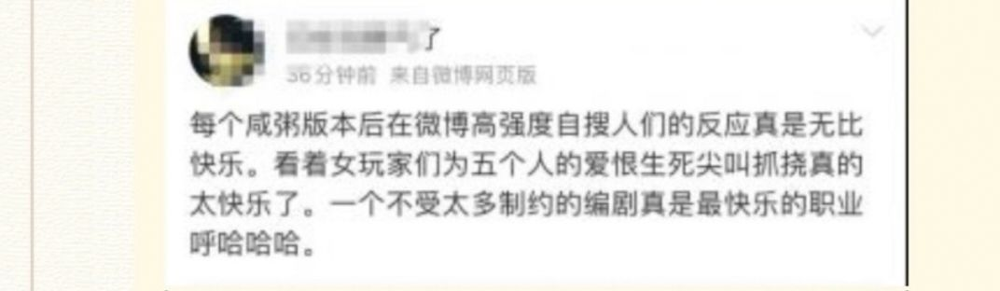

### [不吐不快][热点事件]联动忏悔帖的碎碎念

Made by ngapost2md (c) ludoux [GitHub Repo](https://github.com/ludoux/ngapost2md)

----

##### 0.[0] \<pid:0\> 2023-07-27 09:31:12 by 诗酒趁年华-狼人
个人关注电子游戏20年了(当年还是买游戏杂志了解信息的)，见识过各种游戏厂商的各种骚操作。
从网游鄙视链顶端的EVE，魔兽到征途，贪玩蓝月，我都有所了解。
但米是第一个，让我很讨厌的游戏公司。
我在原神开服，钟离事件时就已经是云原黑了，我入坑原神的理由就是在和人对线时被说是云玩家(确实云)，为了验证我的猜想就入了原神，玩了1年不到，大小月卡不断+氪金点首充，总计2000块钱的样子吧。事实证明，我对原的猜想不算全对，但大方向没啥问题。
然后，我就更讨厌米了。

就很奇怪，TX，猪场(懂得都懂)暴雪(炉石开服玩家)那么坑我，征途，各种骗氪游戏那么被我鄙视。
我都没那么讨厌他们，最多就是顺手踩踩，大多数时候无视掉。

这是为什么呢？

----

##### 1.[0] \<pid:705166604\> 2023-07-27 09:33:23 by 零点，陈彬
20年？老哥今年40了？前辈啊我20出头没经历过当年的游戏，更别提传说中的雅达利大崩溃了

----

##### 2.[3] \<pid:705167070\> 2023-07-27 09:35:17 by momookyk
别的游戏是为了赚钱必须恶心你，米哈游是宁可不赚钱也要恶心你，那肯定是不一样的啊

----

##### 4.[0] \<pid:705167298\> 2023-07-27 09:36:14 by 诗酒趁年华-狼人
>[jump](#pid705166604) 零点，陈彬(2023-07-27 09:33) 说: 
>
>20年？老哥今年40了？前辈啊我20出头没经历过当年的游戏，更别提传说中的雅达利大崩溃了

30多点好吧，魔兽RPG开始玩的。

----

##### 5.[0] \<pid:705167644\> 2023-07-27 09:37:42 by 司及乌
对于我来说是因为瑜不掩瑕，以及米不是为了钱恶心人而是愿意为了恶心人不要钱

----

##### 6.[0] \<pid:705167823\> 2023-07-27 09:38:28 by 零点，陈彬
>[jump](#pid705167298) 诗酒趁年华-狼人(2023-07-27 09:36) 说: 
>
>30多点好吧，魔兽RPG开始玩的。

我道歉，那老哥你还是比我年长10岁左右，我小时候玩魔兽争霸战役和鬼泣4

----

##### 7.[0] \<pid:705167901\> 2023-07-27 09:38:51 by 随便看看186215
个人看法，无论是猪鹅还是暴雪，他们的风格和目的都是从头到尾始终一致的
猪鹅大多时候明摆着坑钱，目的清晰，暴雪也始终是这种风格，一直到现在，就是它感觉越来越拉了。
米哈游感觉就是又想赚你钱，又要恶心你。甚至不赚你钱也要恶心你。当然不一样

----

##### 8.[0] \<pid:705167943\> 2023-07-27 09:39:02 by 食茄少年
在米之前我最恨的游戏公司叫史克威尔艾尼克斯，因为他们亲手把玩家小时候最美好的jrpg回忆都毁掉了，抛下了老的jrpg玩家去吸收新人结果……而米刚好把我在游戏里最美好的3.0-3.2回忆都毁掉了。然后滤镜碎了再来看他们的骚操作，想来蒙德时候还挺有日系幻想那个经典味的，璃月国风，稻妻是家乡大大滴熟悉然后把喜欢这些东西的骗进来一起在给太子抬轿的歌舞升平里都杀了

----

##### 9.[0] \<pid:705168168\> 2023-07-27 09:39:57 by ToutSeul
人家要钱至少还要点脸
那儿像这儿啊，脸都不要了，恰你的米还要暗戳戳踩两脚，现在这模样都是米桑的辐气啊

----

##### 10.[0] \<pid:705168462\> 2023-07-27 09:41:16 by 野猫布鲁斯
>[jump](#pid705167901) 随便看看186215(2023-07-27 09:38) 说: 
>
>个人看法，无论是猪鹅还是暴雪，他们的风格和目的都是从头到尾始终一致的
>猪鹅大多时候明摆着坑钱，目的清晰，暴雪也始终是这种风格，一直到现在，就是它感觉越来越拉了。
>米哈游感觉就是又想赚你钱，又要恶心你。甚至不赚你钱也要恶心你。当然不一样

暴雪是，但烤屌不是，中国这么大块饼他直接不要了

----

##### 11.[2] \<pid:705168627\> 2023-07-27 09:42:03 by 无涯本涯
米哈游旗下的游戏都是恨不得广告天下“我是米哈游旗下的！我是这公司做的第几款游戏！在我之前这公司还整过什么大作！”
评论区里也全是“喜闻乐见”的“多厨狂喜”，ky不叫ky，叫姐姐妹妹一家亲，敢反驳你就是友商水军看不得米好
饭圈都不会有这么强的公司荣誉感吧，真要是饭圈不应该是厨刘伟的和厨蔡浩宇的成天打架，团粉不敢吭声吗

----

##### 12.[0] \<pid:705168805\> 2023-07-27 09:42:58 by 黄金之羽
别人最多也就想骗你米，我大不了充点钱。当初玩炉石，新卡迭代，战棋那个通行证，一样边骂边玩，起码我真玩爽了，mhy是你充钱还要被恶心。

----

##### 14.[0] \<pid:705170195\> 2023-07-27 09:48:45 by 诗酒趁年华-狼人
>[jump](#pid705168462) 野猫布鲁斯(2023-07-27 09:41) 说: 
>
>暴雪是，但烤屌不是，中国这么大块饼他直接不要了

烤是为了个人利益，选择放弃公司利益，不一样的。

----

##### 15.[0] \<pid:705170439\> 2023-07-27 09:49:50 by 呙邱邱
米不仅骗氪，还试图高高在上以作弄玩家取乐，猪鹅吃相难看冲厂商天经地义，到米这里一堆护官宝，只能说不愧是网络营销株式会社。

----

##### 16.[0] \<pid:705170705\> 2023-07-27 09:50:56 by 阿来
都是开饭馆的，有的店家至少表面做做样子，客官你好，客官慢走，等你走了转身骂你一句难伺候
有的你刚坐下，发现菜里有苍蝇，你找老板，老板回答：爱吃吃不吃滚！ 边上的其他客人：又吃不死你！/ 这个人住在xxx街xxx号就是爱找事 /大胆你敢说菜不好吃！？

----

##### 17.[0] \<pid:705171101\> 2023-07-27 09:52:41 by lhx2770544613
别能一样么，别的事游戏公司，游戏是产品，玩家是衣食父母。
米是饭圈公司，玩家上供就行

----

##### 18.[0] \<pid:705171519\> 2023-07-27 09:54:22 by buyuchan2
其他游戏没有xz啊，只有米骂不得说不得。
不过倒也正常，对子骂父，是为无礼。

----

##### 19.[0] \<pid:705179594\> 2023-07-27 10:28:43 by xueman1234
咋说呢，我原之前一直玩的猪厂的游戏，玩了原之后我个人感官来说最大的区别是，怎么会有玩家这么护公司啊，太震撼了

----

##### 20.[0] \<pid:705187859\> 2023-07-27 11:02:36 by 诗酒趁年华-狼人
>[jump](#pid705167901) 随便看看186215(2023-07-27 09:38) 说: 
>
>个人看法，无论是猪鹅还是暴雪，他们的风格和目的都是从头到尾始终一致的
>猪鹅大多时候明摆着坑钱，目的清晰，暴雪也始终是这种风格，一直到现在，就是它感觉越来越拉了。
>米哈游感觉就是又想赚你钱，又要恶心你。甚至不赚你钱也要恶心你。当然不一样
>
>而且米哈游感觉是很擅长画饼或者说骗进来杀。宣传和实物对不上可能才是最让人讨厌的。
>他的游戏都是开始很美，你看起来是受众，然后玩了一段时间后，之后恍然大悟。然后意识到自己已经被骗进来杀了[s:a

暴殄天物既是米家传统，又是氪金抽卡游戏的宿命。

----

##### 21.[1] \<pid:705191247\> 2023-07-27 11:15:19 by 人是有极限的
因为一般策划恶心玩家的原因为了爆更多的米，他不是刻意针对我，只是我已经不是目标客户了而已但我感觉马哈鱼就是在刻意针对我这已经不是游戏的问题了，而是私人恩怨

----

##### 22.[0] \<pid:705192237\> 2023-07-27 11:19:21 by 银河外的水滴
我感觉二次元浓度越高，越容易被恶心到

----

##### 23.[0] \<pid:705192605\> 2023-07-27 11:20:52 by 诗酒趁年华-狼人
>[jump](#pid705191247) 人是有极限的(2023-07-27 11:15) 说: 
>
>因为一般策划恶心玩家的原因为了爆更多的米，他不是刻意针对我，只是我已经不是目标客户了而已但我感觉马哈鱼就是在刻意针对我这已经不是游戏的问题了，而是私人恩怨

这，罪过就大了。

----

##### 24.[0] \<pid:705195816\> 2023-07-27 11:33:08 by akanatsu
20年的话，和猛干哥同龄人了，是对同龄人特有的一种臭味嗅觉敏锐吧
老人我当他们时代局限，小孩我当他们未来可期，只有猛干哥这种同龄人我最知道他们的实际斤两，三次元接触过的一类烂人的合集

