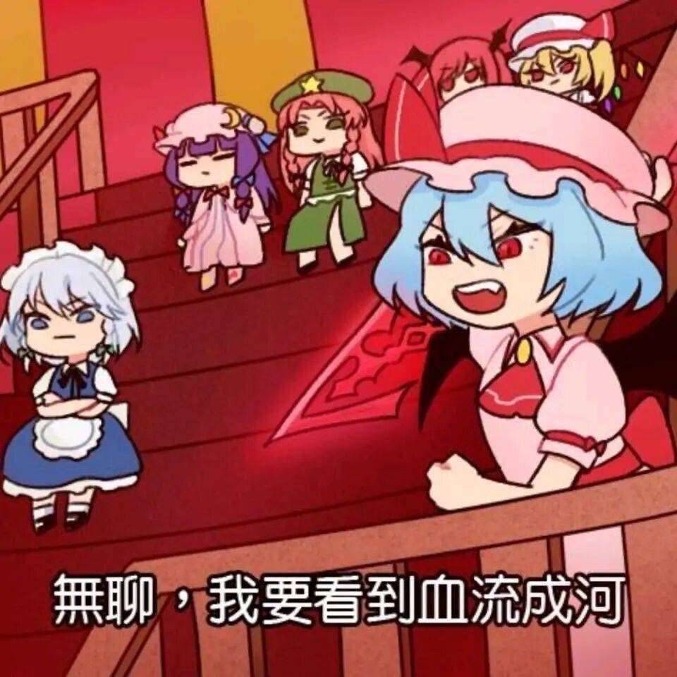

### [不吐不快] 身边好多人都退坑了，旅途短暂的玩家视角来聊聊。

Made by ngapost2md (c) ludoux [GitHub Repo](https://github.com/ludoux/ngapost2md)

----

##### 0.[0] \<pid:0\> 2023-07-27 11:30:23 by 一只墩邦妮
楼主入坑晚。3.0才入坑，从一开始的肝与提瓦特到现在电子羊尾原来也没多少时间。(活跃时长280天左右)
现在身边很多朋友都退坑了，尤其是重氪的朋友们，起码两个大版本没上线了。并且也没有跑去玩别的米家游戏，如崩铁之类的。
也明白了那句歌词“你灰色头像不会再跳动。”

楼主一开始对其他的剧情都处于无视的状态，他在剧情里“口出狂言”我也就是面无表情的鼠标点点点，毕竟游戏是自己玩的没必要跟这些过不去。

因为对我来说玩原的主动力是因为这里有我喜欢的角色，我喜欢用他们在璃月闲逛，有他们在，单机面对美景也不会觉得孤单。

但是事情开始越来越不对劲，在之后的剧情里对我的三观造成很大的冲击，我匪夷所思。我甚至感觉背后的丑恶的编剧在嗤笑，在笑我们玩家面对“一陀贵物”也不得不吞下去。

后来上论坛看见大家的解析，我的感受得到了论证。我终于明白为什么我推会被人叫“雷垫影”，也明白为什么原本亲切可爱的小草会让我感到陌生。

以及，我不理解为什么会有那么多CP向的剧情(尤指gay)，我可以理解有这类的受众，但是我觉得卖得是不是有点太多了？好像整个版本都在渲染男男之间的暧昧气氛。

和“我”这个异世界来到提瓦特的玩家好像没啥关系，可是，“我”不是主角吗？

除此之外，米力推“打牌”、让人头疼的深渊12层，更是让我和我身边的朋友兴致消磨殆尽。

我实在想不到现在还有什么能留住玩家的，剧情稀烂、玩法单一不创新、圣遗物养成搞人心态、玩家提出的建议被当草纸、新角色吸引力大不如前，甚至被人诟病。

老角色就算人气高强度也不尽人意，让很多厨子心灰意冷。(宵宫、迪希雅云云)

哎呀，一开始真的想在这个游戏里待很久，因为原确实给了我不少回忆。可身边好多人都走了，我大概也会有彻底凉心的一天，就快了。

目前的乐子就是在论坛吃瓜唠嗑了，这可比玩游戏来得有意思多了。

----

##### 1.[0] \<pid:705197423\> 2023-07-27 11:39:27 by Liciamenoon
同3.0入坑，昨晚想给心海找点珍珠，打开好友列表居然一个上线的都没有，最后F2敲了十几分钟门，只有一个头像迪希雅的玩家让我进
现在就是挺期待枫丹剧情的，不刷论坛的朋友问我枫丹是个什么主题，我说“正义”然后我俩拍桌大笑了半天，好期待会出什么乐子，一天都等不下去了

----

##### 2.[1] \<pid:705199111\> 2023-07-27 11:46:16 by 一只墩邦妮
>[jump](#pid705197423) Liciamenoon(2023-07-27 11:39) 说: 
>
>同3.0入坑，昨晚想给心海找点珍珠，打开好友列表居然一个上线的都没有，最后F2敲了十几分钟门，只有一个头像迪希雅的玩家让我进
>现在就是挺期待枫丹剧情的，不刷论坛的朋友问我枫丹是个什么主题，我说“正义”然后我俩拍桌大笑了半天，好期待会出什么乐子，一天都等不下去了

我男女角色都会抽的，从pv上看，枫丹的男角色对我来说没什么吸引力，可能女角色还会让我有所期待吧，但不多就是了，毕竟我感觉米写不出什么好活了。到时候又端上来一坨我是不会像从前那样舍得氪金了，白嫖不会被伤害。

----

##### 3.[0] \<pid:705201903\> 2023-07-27 11:57:31 by RebbitX
>[jump](#pid705197423) Liciamenoon(2023-07-27 11:39) 说: 
>
>同3.0入坑，昨晚想给心海找点珍珠，打开好友列表居然一个上线的都没有，最后F2敲了十几分钟门，只有一个头像迪希雅的玩家让我进
>现在就是挺期待枫丹剧情的，不刷论坛的朋友问我枫丹是个什么主题，我说“正义”然后我俩拍桌大笑了半天，好期待会出什么乐子，一天都等不下去了

发小广告的多了，现在F2普遍严加防范了，以前56+级的基本都是随便让进。

----

##### 4.[0] \<pid:705203801\> 2023-07-27 12:05:29 by Inquisit
3.1，入坑就想抽还买了谷的角色如今已经没兴趣了，意外喜欢上的自推在我玩的期间好像也并不是我喜欢的那种样子，我只想祝mhy好似

----

##### 5.[0] \<pid:705204780\> 2023-07-27 12:09:56 by 天山重
3.3因为抽到了散才正式入坑的因为很喜欢配色和日系正太，立绘让我想起了孩子气战争这首歌。剧情其实基本不看，但其实很不喜欢刷机，因为他直接舍弃了这个角色的成长性。
氪金抽了海森之后觉得这角色文案有种没接触过但硬蹭哲学塑造理性角色的微妙感觉，后面卡维出了发现什么互补人性心理学之类的鬼东西，简直就是怼在我嘴里说，“他们两个在一起是很有&#39; 道理和逻辑&#39; 的所以赶紧给我嗑cp”。
这个时候米桑编剧骨子里傲慢还有实际上浅薄的见识已经把我恶心坏了。
虽然那时候就说不会再碰米家游戏，但还是去玩了一下星铁，好嘛，一个文案自嗨仿佛在发神经的游戏，不知道别人怎么看，这个感觉在我看见他给垃圾桶写了好几段文案的时候到了巅峰，我觉得编剧要么精神状态有问题要么嗑了
总之现在就爱来理查看看乐子，米家游戏这辈子不会碰

----

##### 6.[1] \<pid:705206078\> 2023-07-27 12:15:56 by 一只墩邦妮
>[jump](#pid705203801) Inquisit(2023-07-27 12:05) 说: 
>
>3.1，入坑就想抽还买了谷的角色如今已经没兴趣了，意外喜欢上的自推在我玩的期间好像也并不是我喜欢的那种样子，我只想祝mhy好似

是的，我又肝又氪又买谷，现在成红鼻子了。我的心情如图：

----

##### 7.[1] \<pid:705206365\> 2023-07-27 12:17:15 by 一只墩邦妮
>[jump](#pid705204780) 天山重(2023-07-27 12:09) 说: 
>
>3.3因为抽到了散才正式入坑的因为很喜欢配色和日系正太，立绘让我想起了孩子气战争这首歌。剧情其实基本不看，但其实很不喜欢刷机，因为他直接舍弃了这个角色的成长性。
>氪金抽了海森之后觉得这角色文案有种没接触过但硬蹭哲学塑造理性角色的微妙感觉，后面卡维出了发现什么互补人性心理学之类的鬼东西，简直就是怼在我嘴里说，“他们两个在一起是很有&#39; 道理和逻辑&#39; 的所以赶紧给我嗑cp”。
>这个时候米桑编剧骨子里傲慢还有实际上浅薄的见识已经把我恶心坏了。
>虽然那时候就说不会再碰米家游戏，但还是去玩了

是的……谁也不能再忽悠我玩米家游戏了，原神是第一个也是最后一个。

----

##### 8.[0] \<pid:705211722\> 2023-07-27 12:42:24 by jasmine4869
我去年国庆开始玩的，不过一开始玩的很慢，刚开始真想探索大世界连主线都不推，在去三个神庙那里卡了很久，有看过几个开荒up主，对我来说最有意思的也是刚开始玩的时候，比如风主染个火放个e就能点火，感觉还挺惊奇的，现在想想也是模仿了塞尔达的思路，一个答案可以有不同解，但玩到后面这种惊喜感就完全没有了
至于剧情，当时就云过3.2的剧情，对一边倒的赞美没啥感觉，而且我非常讨厌修改人认知记忆的机械降神，在一片赞美声中更讨厌了，不过3.3起越来越多人跟我一样被恶心了
世界树这个设定出来就很不尊重角色设计，就随意揉捏角色的感觉，所以看到李猛干这种一点都不意外，本来就是骨子里轻飘飘地对待角色，不过这样还吹什么做内容的游戏对待角色很认真，真是不要face，你但凡有个剧情跳过，黑泥可以少一大堆

----

##### 9.[0] \<pid:705216106\> 2023-07-27 13:03:18 by 一只墩邦妮
>[jump](#pid705211722) jasmine4869(2023-07-27 12:42) 说: 
>
>我去年国庆开始玩的，不过一开始玩的很慢，刚开始真想探索大世界连主线都不推，在去三个神庙那里卡了很久，有看过几个开荒up主，对我来说最有意思的也是刚开始玩的时候，比如风主染个火放个e就能点火，感觉还挺惊奇的，现在想想也是模仿了塞尔达的思路，一个答案可以有不同解，但玩到后面这种惊喜感就完全没有了
>至于剧情，当时就云过3.2的剧情，对一边倒的赞美没啥感觉，而且我非常讨厌修改人认知记忆的机械降神，在一片赞美声中更讨厌了，不过3.3起越来越多人跟我一样被恶心了
>世界树这个设定出来就很不尊重角色设计，就随意

是啊，原神宣扬自己的剧情多么多么精彩，实则确是多么多么不堪。现在的大世界完全是策划教你玩游戏，要根据它们给的指示、根据任务指引去开点，去探索。不跟任务有些地方都进不去，这让我感觉像被捆着手玩一样。

