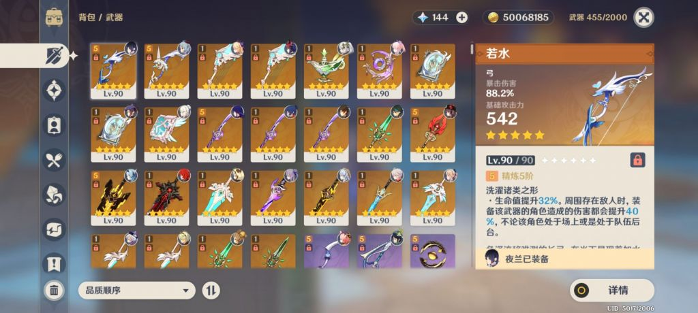
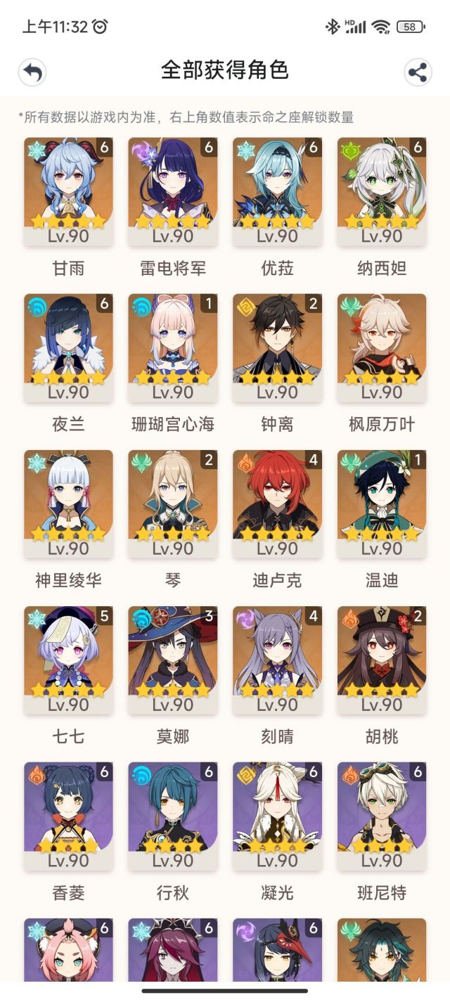
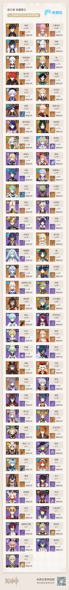
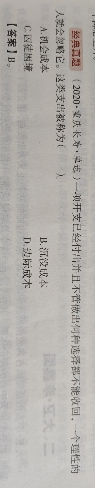
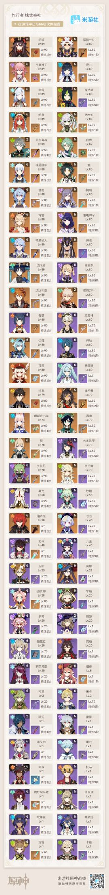

### [不吐不快]有没有跟我一样被沉没成本束缚住，没法潤的

Made by ngapost2md (c) ludoux [GitHub Repo](https://github.com/ludoux/ngapost2md)

----

##### 0.[0] \<pid:0\> 2023-07-27 11:38:54 by NTRの黄毛

氪了3个w，算低中氪吧，想跑路，但是被之前付出去的成本给束缚住了，虽然可以狠心跑路，但弃之可惜，食而无味。

要是我只氪月卡的话，我早跑路了，也不用跑里版来发牢骚
      再也不玩米家的游戏了。

----

##### 1.[6] \<pid:705198019\> 2023-07-27 11:41:44 by Inquisit
提供不了情绪价值的游戏还不如趁早回回血，等神奇的元素出了你的沉没成本还得贬值

----

##### 2.[4] \<pid:705198696\> 2023-07-27 11:44:32 by rain123456
越这样沉没成本越大，你就说原神能给你带来什么吧
别只看自己付出了什么

----

##### 3.[2] \<pid:705199129\> 2023-07-27 11:46:20 by lcm68
我感觉你好欧3w那么满命和满精

----

##### 4.[0] \<pid:705199418\> 2023-07-27 11:47:27 by 小卒龍寒
虽然但是，沉没成本这词的意思本来就是告诉你越早跑路越好，不早跑路沉没成本就越滚越大，除非你有什么特殊喜好非要靠继续玩原神才能维持，不然还是趁猛干哥爆典尽早退了好

----

##### 5.[0] \<pid:705199778\> 2023-07-27 11:48:53 by 一颗魔法螺丝
没啥沉默成本的吧

mhy又不会把你的角色和圣遗物吃了
看你这么多满名感觉也不差钱

感觉不如先润然后等到有风声整了好活再回来也不迟
这个几个版本本来就没啥好玩的

----

##### 6.[0] \<pid:705200134\> 2023-07-27 11:50:28 by Blancville
不要再氪，新剧情别看，随缘上线带老婆逛街就好
会慢慢淡出的

----

##### 7.[0] \<pid:705200887\> 2023-07-27 11:53:28 by 鹭闲
以前我也是这么想的，付出了太多扔不掉，后来专属客服摆烂了，加上这一堆事，然后我就把崩三号卖了，原现在也挂上去了，看看情况，运气好的话过几天就能出掉。氪的金回不来了，这么绊下午只会越来越累，继续投入的成本还是会增加

----

##### 8.[1] \<pid:705201042\> 2023-07-27 11:54:08 by 燕国地图
不懂为什麽觉得有沉本成本，又不是你玩到原神倒闭米哈游会连本带利把钱还给你，在我看来花钱就是买快乐，当初开心过已经值得，捏着鼻子玩下去，只会令当初的快乐(钱)贬值

----

##### 9.[0] \<pid:705201464\> 2023-07-27 11:55:43 by 冷泠棱凌
当手办模拟器嘛。
我已经看开了，上线欣赏老婆老公的美颜不好吗？

----

##### 10.[0] \<pid:705201522\> 2023-07-27 11:55:59 by MC6666698
你氪这么多了也不在乎每日月卡登录给的那点了吧
弃坑就弃坑没必要毁号也没必要卖了啊，也卖不了几个钱

----

##### 11.[0] \<pid:705201809\> 2023-07-27 11:57:09 by 猜你想看
我10w都润了能安慰你吗  

----

##### 12.[0] \<pid:705201882\> 2023-07-27 11:57:26 by 森罗万象AL
不跑路沉没成本越来越大

----

##### 13.[0] \<pid:705201895\> 2023-07-27 11:57:29 by 剑乙女
我曾经也因为沉没成本逼着自己继续每天登录，清体力做每日。过了两周突然想明白了，现在玩原给我提供不了任何正反馈只会让我恶心。已弃坑一个多月，看论坛乐子比游戏本身爽

----

##### 14.[0] \<pid:705202065\> 2023-07-27 11:58:14 by 四方形打柠檬茶
等神奇元素出了成本就沉没了已经

----

##### 15.[0] \<pid:705203851\> 2023-07-27 12:05:42 by 案前神水咒不成
不知道3w对你来说算什么数字
以前还是学生玩魔兽时，我是真的省下吃早餐的钱去充点卡的，当时废寝忘食别说学习，连谈恋爱都觉得没劲，前前后后玩了十年以上，而现在外服的号已经搁置了，哪怕冲一年的卡还不如现在请人吃顿饭的钱多
这里是nga，想必有相似的经历人不在少数
这么一想3w是不是就不算什么了？

----

##### 16.[0] \<pid:705204207\> 2023-07-27 12:07:12 by Aritaaa
有一说一，沉默成本这个理论最大的作用不就是叫你立马切割沉默成本吗

----

##### 17.[0] \<pid:705204501\> 2023-07-27 12:08:38 by Scaramer
PUA者往往会引导对方投入时间甚至金钱，对方会本能地为自己的行为寻找合理性，然后认为自己动了情，接着投入越来越多，离开PUA者的成本也会越来越高，最终陷入离不开的困境。

----

##### 18.[1] \<pid:705204612\> 2023-07-27 12:09:07 by Bauhaus的大豪斯
沉没成本不是成本，望周知

----

##### 19.[0] \<pid:705205105\> 2023-07-27 12:11:26 by 疯狂de兔子n
 6命草神

坐，谈一下感想

----

##### 20.[0] \<pid:705205205\> 2023-07-27 12:11:51 by 鱼什么都知道
你都知道它是沉默成本了忍受住一两天不上线的痛苦，第三天你会发现刹那天地宽

----

##### 21.[1] \<pid:705205304\> 2023-07-27 12:12:23 by 什锦
你要不要再了解一下边际成本这个概念

----

##### 22.[0] \<pid:705205584\> 2023-07-27 12:13:38 by Rean-7
扔给代肝玩一个月，就不想玩了

----

##### 23.[1] \<pid:705206012\> 2023-07-27 12:15:42 by fireeeeee
楼主的签名图十分震撼。。。

----

##### 24.[0] \<pid:705206498\> 2023-07-27 12:17:56 by 格里兹纳特
区区三万而已，花钱买个教训。~~花10万也是买个教训~~

----

##### 25.[0] \<pid:705207834\> 2023-07-27 12:24:04 by xxxxttmm
你好欧 我4w多就只是全图鉴加一些角色的专武

----

##### 26.[0] \<pid:705208320\> 2023-07-27 12:26:25 by 拿到了小孩角色卡噜
赶紧跑

----

##### 27.[0] \<pid:705216739\> 2023-07-27 13:06:27 by NTRの黄毛
>[jump](#pid705205105) 疯狂de兔子n(2023-07-27 12:11) 说: 
>
> 6命草神
>
>坐，谈一下感想

有sha编剧的冲动

----

##### 28.[0] \<pid:705217397\> 2023-07-27 13:09:40 by Dilidili拍
经济学中很重要的一课：沉没成本是没有意义的，大哥，多看看你继续玩下去还能得到什么

----

##### 29.[0] \<pid:705217746\> 2023-07-27 13:11:26 by 野猫布鲁斯
隔壁有个老哥十几个满命都润了

----

##### 30.[0] \<pid:705219023\> 2023-07-27 13:17:48 by 露缇娜丝
要是真没啥可留恋的角色但又觉得沉没成本高了退不掉可以先找个dai，减缓上游戏的频率同时又不会觉得是突然弃坑，然后慢慢等一两个月你就会发现，不玩原神好像也没什么，你就可以着手卖hao了

----

##### 31.[0] \<pid:705220846\> 2023-07-27 13:27:03 by 一只二一四啊
因为沉没成本太高了所以只能让它越来越高对吧

----

##### 32.[0] \<pid:705221095\> 2023-07-27 13:28:24 by 罗一川
实在不舍得润不充钱白嫖不就完了，要是还管不住手那只能说是活该了

----

##### 33.[0] \<pid:705221536\> 2023-07-27 13:30:42 by QDXEX

非纯图

----

##### 34.[0] \<pid:705222921\> 2023-07-27 13:37:57 by The_Emerald
楼主你的签名图是怎么回事……

----

##### 35.[0] \<pid:705224687\> 2023-07-27 13:47:04 by 经常看书看得开
不要刻意去想自己再也不玩了，就当暂时分开一段时间。 

玩玩别的游戏，等哪天原改了 原变了再回来(虽然不一定有这天)

----

##### 36.[0] \<pid:705229527\> 2023-07-27 14:11:52 by 迈步启航
前后都忘了，总之只要你向前看，这段时间和金钱的沉没成本只会是你人生的比例尺上的一小部分

----

##### 37.[0] \<pid:705230625\> 2023-07-27 14:17:18 by vnight！
看在同是3w氪我比你少一半金的份上兄弟，签名关键词是？

----

##### 38.[0] \<pid:705230754\> 2023-07-27 14:17:50 by 剑筑师と書記官
当你意识到已经是沉没成本的时候，你第一件事应该是尽快止损而不是和它共沉沦

----

##### 39.[0] \<pid:705236642\> 2023-07-27 14:46:07 by NTRの黄毛
>[jump](#pid705230625) vnight！(2023-07-27 14:17)说:
>看在同是3w氪我比你少一半金的份上兄弟，签名关键词是？

作者  可老(かろう)

----

##### 40.[0] \<pid:705242739\> 2023-07-27 15:15:06 by vnight！
>[jump](#pid705236642) NTRの黄毛(2023-07-27 14:46)说:
><b>Reply to [pid=705230625,37155377,2]Reply[/pid] Post by [uid=63621378]vnight！[/uid] (2023-07-27 14:17)</b>作者  可老(かろう)

谢谢！

----

##### 41.[0] \<pid:705244720\> 2023-07-27 15:25:00 by ttct875
先停氪，再弃坑，一时离不开可以循序渐进，我现在已经到停氪每天一上这个进度了，慢慢的几天一上然后版本更新上不去基本上就算润完成了

----

##### 42.[0] \<pid:705244891\> 2023-07-27 15:25:40 by 溶解在暧昧中
现在你知道日活有什么用了

