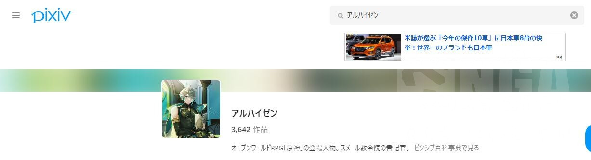
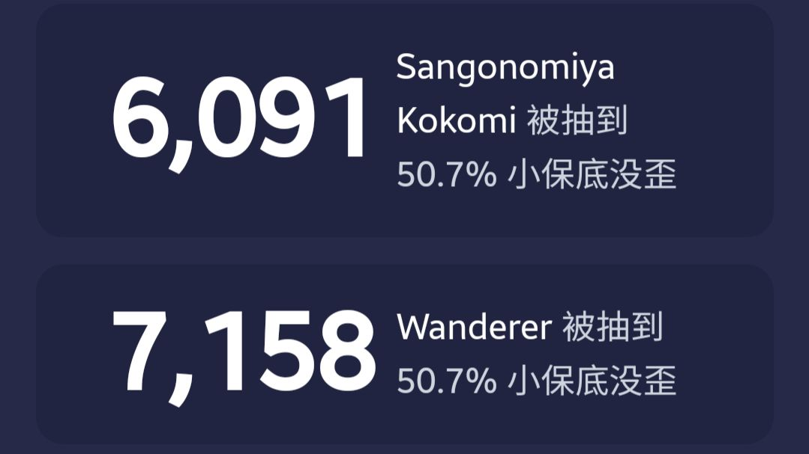

### [不吐不快]想问一下散兵在外网的热度到底怎么样

Made by ngapost2md (c) ludoux [GitHub Repo](https://github.com/ludoux/ngapost2md)

----

##### 0.[0] \<pid:0\> 2023-07-27 15:49:34 by 云天间
逛知乎的时候看到很多结晶吹虽然流水不行但散兵在外网的热度一顶一的好，就比如说在日本的同人数非常高，欧美也很热，我想知道一下 真的是这样吗，还是说只是嗓门大而已

----

##### 1.[0] \<pid:705250217\> 2023-07-27 15:50:51 by 电风扇kkks
如果你说的是没落地之前还是执行官的雷散，还能说热度可以
如果是风散，只能说凉得透心凉

----

##### 2.[0] \<pid:705250293\> 2023-07-27 15:51:21 by 白开水巨好喝
这是我看到最好笑的笑话，外服散心抽取比例都一比一了。
第二次up就这样，什么赔钱货玩意儿。

----

##### 3.[2] \<pid:705250693\> 2023-07-27 15:53:08 by 混血朋克恶魔
只能说我屏蔽了几个爱玩烂梗的画手后就再也没刷到过它了，饭圈小妹的特点不就是人菜爱吹死缠烂打

----

##### 4.[0] \<pid:705250744\> 2023-07-27 15:53:25 by 淼霆
外网抽取比例和心海基本1:1

----

##### 5.[0] \<pid:705250806\> 2023-07-27 15:53:46 by ttct875
热度不就是嗓门吗，日本作为米哈游的精神故乡，其他就是冲着八嘎人去的，热度确实不错，大多数人什么看法你看流水就很清楚了

----

##### 6.[0] \<pid:705250958\> 2023-07-27 15:54:21 by AkariYu3310
畢竟賠錢貨流水崩了要挽尊呢

----

##### 7.[0] \<pid:705250974\> 2023-07-27 15:54:25 by kiyota119
那帮人喜欢吹同人热度啥的
那说到同人热度那我就有话说了，他们须弥“同人热度一骑绝尘”角色和cp，这一个两个的都暴不出米是咋回事啊
之前可是同人热度游戏本体卡池热度双管齐下的，须弥这咋回事啊，咋回事啊~

----

##### 8.[9] \<pid:705251161\> 2023-07-27 15:55:12 by 九叶喵
首先外网原就凉的比国内快，整体凉了里面的角色肯定都会被牵连，然后再高的人气也经不住米这样的傻逼剧情折腾，角色逻辑也不要了，伏笔也丢掉了，现在人气emmm……

----

##### 9.[2] \<pid:705251217\> 2023-07-27 15:55:27 by 疯狂de兔子n
外网喜欢的是Joker，不是clown

----

##### 10.[3] \<pid:705251250\> 2023-07-27 15:55:35 by 瓦连京
命座战士，热度很高，流水“居然是零耶”

评价为骗哥们可以

非要说的话，外网散兵落地前热度确实很高，但人家好的是一口反派，不是米哈游洗出来又当又立逻辑可笑的小丑。至于yhm，散草美美官宣的时候大概会掉很多小珍珠吧

----

##### 11.[1] \<pid:705251380\> 2023-07-27 15:56:12 by q794623
已经完蛋了，这次外服抽卡比例都无法跟心海拉开差距，摆明了亏钱的败家玩意。。。还要心海镇邪祓除。。你心真是。。。

----

##### 12.[0] \<pid:705251711\> 2023-07-27 15:57:35 by 青春派洛迪
樱花这边同人热度我有发言权去了4.5次神睿现场了，我说实话，同人被须弥F4吊着打。当时须弥开了的时候海哥和赛诺在同人展上忙死，散兵有，但挺分散的，主要是没有火的cp
但没关系，散解会说单推人多谷价高的

----

##### 13.[0] \<pid:705252022\> 2023-07-27 15:59:00 by AkariYu3310
>[jump](#pid705251711) 青春派洛迪(2023-07-27 15:57)说:
>樱花这边同人热度我有发言权[s:ac:哭笑]去了4.5次神睿现场了，我说实话，同人被须弥F4吊着打。当时须弥开了的时候海哥和赛诺在同人展上忙死，散兵有，但挺分散的，主要是没有火的cp 但没关系，散解会说单推人多谷价高的[s:ac:哭笑]

竟然是赛诺？意料之外

----

##### 14.[0] \<pid:705252028\> 2023-07-27 15:59:03 by 森罗万象AL
首先“同人作品”是能买的，不管是插画视频还是长文，其次把买的也算上，热度也就那样，要真有热度，干嘛不放数据呢

----

##### 15.[0] \<pid:705252110\> 2023-07-27 15:59:26 by Luoxifq
倒是我在国际服米游社看到的关于()的帖子都是年纪不大的在发电，而且都是繁体中文居多想想之前不是他们微博凑了个什么庆祝首次复刻的图，那图上面的首次复刻旁边还带注音的

----

##### 16.[0] \<pid:705252475\> 2023-07-27 16:01:13 by lalawwww
除了三，还有啥热度高流水低的二游角色例子吗？如果热度真的高的话

----

##### 17.[0] \<pid:705252671\> 2023-07-27 16:02:14 by 醉梦泪千行
中日美韩四服没一个流水成绩好看的，也就她们爱这么挽尊了

----

##### 18.[0] \<pid:705252842\> 2023-07-27 16:03:02 by Adrammelech
散兵分为两个阶段，3.3之前借着冬夜愚戏的执行官热度在欧美是超高人气卫星，3.3之后流浪者光速糊穿地心，要么接着蹭“雷散”，要么属于不可接触者，鄙视链底端的卖惨反派

----

##### 19.[0] \<pid:705252955\> 2023-07-27 16:03:35 by AkariYu3310
>[jump](#pid705252110) Luoxifq(2023-07-27 15:59)说:
>倒是我在国际服米游社看到的关于()的帖子都是年纪不大的在发电，而且都是繁体中文居多[s:ac:哭笑]想想之前不是他们微博凑了个什么庆祝首次复刻的图，那图上面的首次复刻旁边还带注音的

嗯 國中生特攻

----

##### 20.[0] \<pid:705253054\> 2023-07-27 16:03:57 by ggt12
和四次复刻的我心抽取比例1：1程度的高热度。

----

##### 21.[0] \<pid:705253538\> 2023-07-27 16:06:02 by 今锁朱楼
客观来讲同人数据确实好，入池后飙升的很快，今年已经在整个p站拍得上号了。(印象里是这样)
但就是不爆米，也是神奇。

----

##### 22.[0] \<pid:705253608\> 2023-07-27 16:06:19 by 子怡哈哈哈
>[jump](#pid705252022) AkariYu3310(2023-07-27 15:59) 说: 
>
>竟然是赛诺？意料之外

可能是因为海赛？这个cp在霓虹热度也不低

----

##### 23.[5] \<pid:705253802\> 2023-07-27 16:07:05 by 世事苍茫成云烟
>[jump](#pid0) 云天间(2023-07-27 15:49) 说: 
>
>逛知乎的时候看到很多结晶吹虽然流水不行但散兵在外网的热度一顶一的好，就比如说在日本的同人数非常高，欧美也很热，我想知道一下 真的是这样吗，还是说只是嗓门大而已

热度，是指首次up就被人p个垃圾桶在头上获得一致好评的热度

----

##### 24.[2] \<pid:705253823\> 2023-07-27 16:07:10 by 黑蜀黍电动输弹机
硬捧也赚不了钱的废物，欧美社群喜欢的是雷散，就像和蝙蝠侠对打的Joker，智慧狡诈且有自己信条的坏逼才是他们喜欢的款
再说Dehya事件后整个欧美社群也都看开了，醒悟得要更早，热度和流水都是断崖下跌的

----

##### 25.[2] \<pid:705253872\> 2023-07-27 16:07:26 by maurara
某种程度确实一顶一~~指第二次复刻抽取比和我心一比一~~

----

##### 26.[0] \<pid:705254270\> 2023-07-27 16:09:08 by 青春派洛迪
>[jump](#pid705253608) 子怡哈哈哈(2023-07-27 16:06) 说: 
>
>可能是因为海赛？这个cp在霓虹热度也不低

是的，须弥后我第一次去看到了一排的海赛，当时大热
其他cp就是围绕海哥赛诺为中心一顿乱磕

----

##### 27.[0] \<pid:705254361\> 2023-07-27 16:09:31 by 大洋海神草
在日本的同人数非常高？
吓死我了，赶紧去p站上看看

不说雷甘刻这类高人气角色了，放浪者tag就连同期须弥出的海森都不如
什么？你说还有个从1.1熄星开始就有的散兵tag？

哦，总算打赢须弥才登场的海森了
再让我们来看看同为1.1登场，同为执政官的公子

散兵同人数真是太高了

----

##### 28.[0] \<pid:705254660\> 2023-07-27 16:10:48 by AkariYu3310
>[jump](#pid705254361) 大洋海神草(2023-07-27 16:09)说:
>在日本的同人数非常高？ 吓死我了，赶紧去p站上看看 [img]https://img.nga.178.com/attachments/mon_202307/27/l2Q2s-cwlxK1pT3cSya-9a.jpg[/img] [img]https://img.nga.178.com/attachments/mon_202307/27/l2Q2s-dx2lK1jT3cSxj-94.jpg[/img] [img]https://img.nga.178.com/attachments/mon_202307/27/l2Q2s-2mqtK1eT3cSyu-9i.jpg[/img] [img]https://img.nga.178.com/attachments/mon_202307/27/l2Q2s-68dxK1gT3cSxq-98.jpg[/img] [img]https://img.nga.178.com/attachments/mon_202307/27/l2Q2s-9o2nK1hT3cSy3-9a.jpg[/img] 不说雷甘刻这类高人气角色了，放浪者tag就连同期须弥出的海森都不如 什么？你说还有个从1.1熄星开始就有的散兵tag？ [img]https://img.nga.178.com/attachments/mon_202307/27/l2Q2s-9dpaK1jT3cSxj-95.jpg[/img] 哦，总算打赢须弥才登场的海森了 再让我们来看看同为1.1登场，同为执政官的公子 [img]https://img.nga.178.com/attachments/mon_202307/27/l2Q2s-9ysxK1jT3cSxl-9d.jpg[/img] 散兵同人数真是太高了

不是 有分tag的
編輯：我盲了抱歉 讓大家看笑話吧

----

##### 29.[0] \<pid:705254670\> 2023-07-27 16:10:51 by 岚岚鹭
>[jump](#pid705252022) AkariYu3310(2023-07-27 15:59):

赛诺在小蓝鸟上很多二创的
神睿本子也买了一堆质量还很高
也就mhy捧着个赔钱货了

----

##### 30.[0] \<pid:705254999\> 2023-07-27 16:12:09 by 今锁朱楼
>[jump](#pid705254270) 青春派洛迪(2023-07-27 16:09)说:
>[quote][pid=705253608,37158246,2]Reply[/pid] <b>Post by [uid=64717740]子怡哈哈哈[/uid] (2023-07-27 16:06):</b>  可能是因为海赛？这个cp在霓虹热度也不低[s:ac:哭笑][/quote]是的，须弥后我第一次去看到了一排的海赛，当时大热[s:ac:闪光] 其他cp就是围绕海哥赛诺为中心一顿乱磕

~~海赛本子挺好看的而且很搞笑~~

----

##### 31.[0] \<pid:705255231\> 2023-07-27 16:13:08 by Luoxifq
>[jump](#pid705252955) AkariYu3310(2023-07-27 16:03):

確實，所以希望他們長大之後回過頭來看曾經的自己不會破防

----

##### 32.[2] \<pid:705256128\> 2023-07-27 16:16:53 by 冰河新栖姬

----

##### 33.[0] \<pid:705256751\> 2023-07-27 16:19:19 by AkariYu3310
>[jump](#pid705255231) Luoxifq(2023-07-27 16:13)说:
><b>Reply to [pid=705252955,37158246,1]Reply[/pid] Post by [uid=65054161]AkariYu3310[/uid] (2023-07-27 16:03)</b> 確實，所以希望他們長大之後回過頭來看曾經的自己不會破防

別了吧 巴哈專版高強度控評 早就玩爛了
尼采那篇一眼到處發的商單直接入精華我是沒想到
給TW人民一點少少的飯圈文化輸出震撼
~~第一次是TFboys 當迷弟迷妹是每個人的必經階段~~

----

##### 34.[0] \<pid:705259533\> 2023-07-27 16:30:37 by Luoxifq
>[jump](#pid705256751) AkariYu3310(2023-07-27 16:19)说:
><b>Reply to [pid=705255231,37158246,2]Reply[/pid] Post by [uid=65159007]Luoxifq[/uid] (2023-07-27 16:13)</b> 別了吧 巴哈專版高強度控評 早就玩爛了 尼采那篇一眼到處發的商單直接入精華我是沒想到 給TW人民一點少少的飯圈文化輸出震撼 <del class='gray'> 第一次是TFboys 當迷弟迷妹是每個人的必經階段 </del>

啊&amp;#8943;巴哈我很早就不看了
本來入坑原神的時候也是只看NGA跟B站
還好後面有里版的出現，不然那會真的被散解跟劇情噁心的想要退坑了

----

##### 35.[0] \<pid:705261049\> 2023-07-27 16:37:02 by cheyenne_xu
和扣扣米五五开罢了，46：54

----

##### 36.[0] \<pid:705269914\> 2023-07-27 17:12:26 by 狐狸吃团子
散兵在外网热度最高的时候是没落地的时候，人家是真信了波西米亚狂想曲的梗，老米但凡给个joker都能让外网反派厨变米卫兵，结果是离不开他老母的中二巨婴~~连散兵日配都会认为后面和雷神有剧情~~之前考据党考据的都是他和雷神有关系，他在稻妻有故事，结果大头砸地，岁月史书，然后依赖草神而活
知道散兵烂了但还希望后面剧情能救，结果3.6跟草神卿卿我我，草神爆典散兵认可阿帽这个名字，这对厨子都是毁灭性打击，玩家前面救草神后面给囚犯散兵取名，见证它们重生，结果人家凑一起打得火热，黄毛你谁真不熟？
一直期待的迪希雅强度也崩了，地图连续扩张连匹马都不愿意给，就嗯靠两条腿，任务涨原石不涨，一个版本连续让人失望，玩家失去耐心纷纷A了
3.3流水高那是真有很多人没过剧情，3.4 3.6看清一切早跑了，外网玩家又不缺游戏玩，你原神不过是人家的调味剂可不会当宝贝一样供着

----

##### 37.[0] \<pid:705270281\> 2023-07-27 17:13:58 by k384698637
>[jump](#pid705261049) cheyenne_xu(2023-07-27 16:37) 说: 
>
>和扣扣米五五开罢了，46：54
>

其他可以抽7次，心海只能1次，所以是6：1

----

##### 38.[0] \<pid:705270540\> 2023-07-27 17:15:01 by 樱木花kun
然后不爆米，有什么用呢？

----

##### 39.[0] \<pid:705270615\> 2023-07-27 17:15:24 by gtgce
曾经确实辉煌过
但那是曾经

----

##### 40.[0] \<pid:705271233\> 2023-07-27 17:18:04 by xlsq03
如果你说雷散，那人气确实高
风散来了之后雷散也被拖累不行了

----

##### 42.[0] \<pid:705272234\> 2023-07-27 17:22:19 by Faul反
>[jump](#pid705254270) 青春派洛迪(2023-07-27 16:09):

说起海赛我要笑死了，已经知道后续不会再有互动了的情况下，硬是因为这拉稀剧情在理查搞出了点鸟尽弓藏组合的惺惺相惜感

----

##### 43.[0] \<pid:705272414\> 2023-07-27 17:23:05 by 吃烤肉去啊
>[jump](#pid705269914) 狐狸吃团子(2023-07-27 17:12):

之前很多人期待的雷散本质上不也是离不开雷神的巨婴吗草神是真的救了雷神一命，让雷神给散兵当妈妈真的不会有人再帮雷神说话的，本质上[母亲]这个身份就是应该牺牲自己成全儿子。

----

##### 44.[0] \<pid:705272734\> 2023-07-27 17:24:25 by 香槟买好了就等
ao3比较好查，刚去看了，单人前十吧，被前二的公和钟倍杀

----

##### 45.[0] \<pid:705273422\> 2023-07-27 17:27:22 by DxhSN2022
海外人气高？
7/6 &gt; 3/2 ??

----

##### 46.[0] \<pid:705273959\> 2023-07-27 17:29:33 by moonlight34
据我观察很久，低龄化非常严重，很多一股全世界要害他giegie一样，和惨圈高度重合

----

##### 47.[0] \<pid:705275002\> 2023-07-27 17:34:03 by aiopsx
这么说吧，我现在去推特搜scaramuche的tag
首页7成以上都是用中文的
搜#tartaglia，dottore arlecchino这几个，中文占比不会超过5成

----

##### 48.[0] \<pid:705276835\> 2023-07-27 17:42:22 by 狐狸吃团子
>[jump](#pid705272414) 吃烤肉去啊(2023-07-27 17:23) 说: 
>
>之前很多人期待的雷散本质上不也是离不开雷神的巨婴吗
>草神是真的救了雷神一命，让雷神给散兵当妈妈真的不会有人再帮雷神说话的，本质上[母亲]这个身份就是应该牺牲自己成全儿子，不肯为他牺牲那就是罪大恶极。
>唯有爱他、为他牺牲、为他奉献，他大度地原谅你，你的风评才能好那么一丁点。这就是很多雷散厨眼里雷电影作为一个[母亲]应该展现出来的姿态。
>所有的给雷神散兵贷款“母子关系”的人，潜台词就是期待看到这一幕。

散兵写烂了谁碰谁死，岁月史书这种三观扭曲的剧情，外网不一定有国内的厌恶程度但心里还是会抗拒的
雷神up的早，强度人气都在线，基本盘稳每次流水都高，老米不敢拿雷神赌，结果用了我们新生的小草，小草3.3之前的人气可是相当高的，几次为散兵暴典后一落千丈，牺牲开局巅峰角色来洗low 穿地心的反派，老米你做得好啊

----

##### 49.[0] \<pid:705278470\> 2023-07-27 17:49:50 by 狐狸吃团子
>[jump](#pid705275002) aiopsx(2023-07-27 17:34) 说: 
>
>这么说吧，我现在去推特搜scaramuche的tag
>首页7成以上都是用中文的
>搜#tartaglia，dottore arlecchino这几个，中文占比不会超过5成

外网散兵的人气基本靠冲树前的雷散维持，因为现在这个全新的流浪者一点自己的魅力都没有，不怕你不信，写英文的也有国服散厨，和xz粉一样跑外网蓝色微博上造势，然后截图回国内微博吹世界顶流

----

##### 50.[0] \<pid:705280382\> 2023-07-27 17:57:04 by KOUBAKU
散兵人氣很高啊，只不過是雷散，應該說愚人眾角色人氣都很高，像是達達利亞也算人氣不錯的角色。
然後洗白人氣先砍一大半，還洗的爛得要命人氣再砍一大半，自然現在這個角色流浪者就沒啥正常人廚了，畢竟他們喜歡的是有魅力的反派而不是小丑。
也有一些嫌棄這個流浪者(已奪舍)是因為他造成整個須彌劇情崩壞與小草神人設OOC崩壞。

----

##### 52.[0] \<pid:705280793\> 2023-07-27 17:58:29 by winterandfrost
按国家划分的话，小日子的同人热门是须弥f4、璃月钟魈、蒙德红蓝、至冬公子、稻妻雷军，枫散有一些但万叶在国外没有国内那么高，总体而言就是……不好评价，光看点赞数据是蛮好的

----

##### 53.[0] \<pid:705288850\> 2023-07-27 18:34:33 by 狐狸吃团子
>[jump](#pid705280608) 天射星(2023-07-27 17:57) 说: 
>
>可是日服流水过不了漫画(类比抖音)登不了顶耶
>另外再说个好消息，散兵只有台湾区登顶了
>全线暴死只有毒区好评，这要是敢再吹海外人气我觉得得拷打拷打是不是有50万了

破案了，散兵是湾湾区特供
联想到猛干哥的“国中生”突然理解一切

