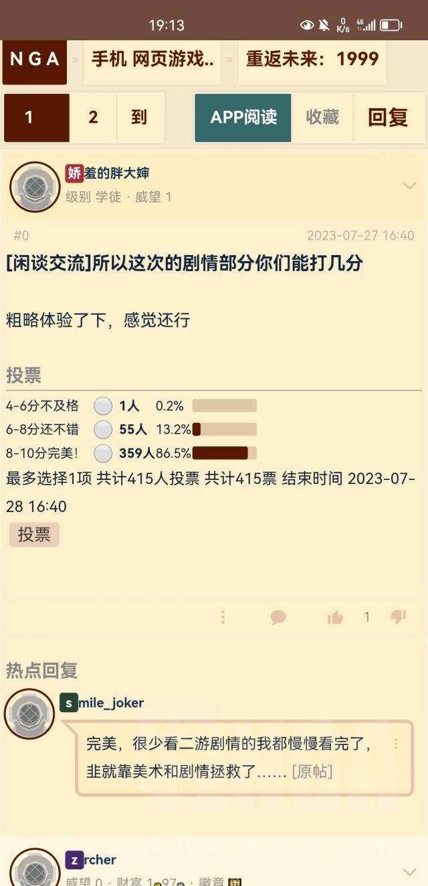

### [不吐不快]都说原的剧情烂，有没有剧情好的手游和单机推荐？

Made by ngapost2md (c) ludoux [GitHub Repo](https://github.com/ludoux/ngapost2md)

----

##### 0.[0] \<pid:0\> 2023-07-27 17:43:11 by 唵嘛呢叭弥
伸手党蹲一个好点的剧情向的游戏推荐。手游不强求所有剧情好，推荐下剧情好的几个章节就行。
云玩家打算去网上过遍剧情。
另：有没有反派塑造比较好的游戏章节剧情推荐。

----

##### 1.[0] \<pid:705277226\> 2023-07-27 17:44:05 by 壬侯孟乙莫隋
推荐下rdr2，慢热，但是叙事真的顶尖

----

##### 2.[0] \<pid:705277251\> 2023-07-27 17:44:13 by ou2021
荒野大镖客2
某个今年出的剧情解析我已经看三四遍了

----

##### 3.[2] \<pid:705277415\> 2023-07-27 17:44:55 by 电风扇kkks
1999？虽然策划是个傻逼，但美术剧情这块确实能c

----

##### 4.[0] \<pid:705277502\> 2023-07-27 17:45:19 by Sailinghome
弹丸论破/人狼村之谜/逆转裁判ovo

----

##### 5.[0] \<pid:705277509\> 2023-07-27 17:45:21 by ochaaki
命运石之门，ba

----

##### 6.[0] \<pid:705277559\> 2023-07-27 17:45:38 by beatles05
最近在推p5，真的很好玩，而且也是二次元画风

----

##### 7.[0] \<pid:705277618\> 2023-07-27 17:45:54 by 我妻亚修
这个时候，那我肯定推荐七都了
提剧情必少不了我七七
ps：全名永远的七日之都
狠狠的ml

----

##### 8.[1] \<pid:705277629\> 2023-07-27 17:45:58 by 天射星
推荐一下艾希吧，虽然是单机横版动作手游，但是我觉得剧情不错的。
这可是猛干锐评的含金量

----

##### 9.[0] \<pid:705277788\> 2023-07-27 17:46:41 by cloudfruittea
>[jump](#pid705277629) 天射星(2023-07-27 17:45) 说: 
>
>推荐一下艾希吧，虽然是单机横版动作手游，但是我觉得剧情不错的。
>这可是猛干锐评的含金量

~~主要是调戏旁白真好玩~~

----

##### 10.[0] \<pid:705277827\> 2023-07-27 17:46:49 by Just  Monika
推荐弹丸论破12部，不要看动画

----

##### 11.[0] \<pid:705277831\> 2023-07-27 17:46:51 by 神乐苍籁
流行之神1、2[没有中文]，逆转裁判1、2、3，大逆转1、2，幽灵诡计，夜迴、深夜迴，烟火

----

##### 12.[0] \<pid:705277867\> 2023-07-27 17:47:00 by 食茄少年
女神异闻录2真的是我心中的神作

----

##### 13.[0] \<pid:705277946\> 2023-07-27 17:47:22 by scoutqq
99,57,梦战,昨天上的银河境界线,战双

如果你需要明确的cpml区分的话,应该只有57和战双更偏向ml,梦战和银河是srpg玩起来会比较费时间  

另外非二游里面我个人觉得寒王剧情属于能看的一档

----

##### 14.[1] \<pid:705278136\> 2023-07-27 17:48:17 by jinjin886
等明天月光蟑螂老师的新作《三伏》，等不及可以先玩他的《烟火》

----

##### 15.[0] \<pid:705278270\> 2023-07-27 17:48:55 by mie001
最近的话我推荐F.E.A.R(第一代)和I am NOT a monster

----

##### 16.[0] \<pid:705278290\> 2023-07-27 17:48:59 by UID43055609
隔壁无期迷途，剧情可以纯云，B上有目前的所有章节
文案质量不说顶尖也算我接触过的手游里一流那一批了，可以康康

----

##### 17.[0] \<pid:705278350\> 2023-07-27 17:49:16 by 咕哒阳
开个模拟器推古早gal量大管饱而且质量完全不是现在任何手游能比的

----

##### 18.[0] \<pid:705278376\> 2023-07-27 17:49:23 by Satsushiki
推荐p4g，虽然是个老游戏但剧情和代入感都是很强的，而且也有塑造得不错的反派以及隐藏结局。如果能接受psv级的游戏画面的话值得一试

----

##### 19.[0] \<pid:705278388\> 2023-07-27 17:49:27 by 是大可不是duck
单机，我最近在玩的大逆转裁判，神一般的剧情，太好看了我玩了好几个通宵，大逆1剧情有点子拖沓，但是大逆2剧情神中神，那几个案子我不打完不睡觉那种，幽灵诡计剧情也很好！！！而且都不是很长！我一个多星期打完的大逆12！！
还有p5剧情也很好！！p5r就是地图线性了，但是剧情也很不错！！

----

##### 20.[1] \<pid:705278586\> 2023-07-27 17:50:25 by 衛陽
F...FGO的某些章节。。。
粥...粥的某些章节
我是真玩过。。。

----

##### 21.[0] \<pid:705278638\> 2023-07-27 17:50:41 by 敌の炼狱
手游推荐nikke，直白没有生僻字、谜语人。主角智商在线，个人好感剧情甚至有直球上垒，人称方舟魅魔。

----

##### 22.[1] \<pid:705278690\> 2023-07-27 17:50:57 by 弧光流转
幽灵诡计和逆转裁判系列，巧舟我的神

----

##### 23.[0] \<pid:705278741\> 2023-07-27 17:51:09 by ArseneZ
ever17 把每条线推完，绝对值得

----

##### 24.[0] \<pid:705278747\> 2023-07-27 17:51:10 by 李奥??阳
我认为所有长线更新的手游基本都能找出一个写的不错的部分跟一个写的很屎的部分，换句话说没有一个经得起全方位审视拷打的，所以还是多谈谈单机游戏吧

----

##### 25.[1] \<pid:705278822\> 2023-07-27 17:51:24 by 慕潮声
战双的枯朽为灯湮灭残昼绝海星火和新出的章摇篮游行都不错，ml超大杯
单机来推销一点avg蓝宝石般的被害妄想少女，我在七年之后等着你(手机像素)

----

##### 26.[0] \<pid:705278900\> 2023-07-27 17:51:45 by 火星的居民3
不如试试gal

----

##### 27.[0] \<pid:705278944\> 2023-07-27 17:51:57 by 最初的剑鱼二番队队长
幽灵诡计、废都物语、异度装甲

----

##### 28.[2] \<pid:705278946\> 2023-07-27 17:51:57 by 星翼舞
无期迷途-妙梦泡影活动剧情，对梦境这一元素的运用与破局能把花神诞祭和草一吊起来打

----

##### 30.[2] \<pid:705279041\> 2023-07-27 17:52:22 by Asche1017
首先，极乐迪斯科，只要你愿意玩极乐迪我们就是异父异母的亲兄弟姐妹不要嫌弃文本量大，真的量大管饱，特别特别特别好
逆转裁判算不算一种剧情向游戏，算不算反派塑造好(？)证人席都是反派，辩论这个过程很上头也很爽，算不算打反派(？)
p5r的剧情在我看来不算特别牛，但是代入感和沉浸感非常强，属于虽然有很多小问题，但是直接砸进去几十个上百小时的那种剧情
手游的话，fgo不用说了，学者死似者死，全靠一手剧情撑起一片天
无期迷途的配音和剧情都很好，尤其是配音，特别特别自然，有一种说人话的幸福感
1234有一些单独的篇章剧情也很好，所谓一星二光三人ss，或者短篇故事集，不用看前置剧情也能看懂

----

##### 31.[0] \<pid:705279178\> 2023-07-27 17:53:04 by 做我的猫子
《魔法使之夜》《月姬》

----

##### 32.[0] \<pid:705279375\> 2023-07-27 17:53:47 by mjaetj
这个标题，我记得我以前也见过啊？我穿越了？

看了下，哦原来那个贴子冲水了。

----

##### 33.[0] \<pid:705279494\> 2023-07-27 17:54:10 by 呆河马？？？
巫师3？巫师3剧情是很细腻，但他真正的强是强在很多选项都确实地影响了剧情走向，玩家不得不做出鱼和熊掌的选择，能够体会到在那种黑暗世界下强如主角盖骆驼也有心无力。
不过你要云通关可以考虑纯剧情向的文字冒险类游戏，比较新画质比较好的比如底特律变人(我觉得有点虎头蛇尾，节奏也一般，中间的剧情对我来说挺平淡的)，或者找些2d/像素风口碑好的神作，画质的亏模换来的就是剧情的超模，而且有很多主播都有录过实况，云的选择比较多。

----

##### 34.[0] \<pid:705279498\> 2023-07-27 17:54:10 by 須賀悠衣
玩gal呗，海量美少女和好剧本

----

##### 35.[0] \<pid:705279768\> 2023-07-27 17:54:58 by 鸟咕
va11 hall-A，剧情这块我永远的白月光

----

##### 36.[0] \<pid:705279778\> 2023-07-27 17:55:01 by 月双影
你这算上单机可太好找了，随便拿出个欧美经典RPG都要被薄纱的程度
质量效应三部曲，龙腾世纪哪怕是审判都够吊打它了
米的编剧水平很早吐槽过，就是崩铁开服那段，能看出来连基本的编剧课都没上过，很多基础错误反复犯，哪怕读过那几本经典科普性质的好莱坞编剧宝典都不可能犯得那种错误
就我这几天随便搜到了避世血族：寒冬獠牙，一个普通的授权美漫短短4话的节奏把控人物塑造，调度，埋伏笔细节能力都能秒杀米哈游编剧水平了。二这种水平其实就是有上过编剧课的程度...

----

##### 37.[0] \<pid:705279967\> 2023-07-27 17:55:39 by 水月镜花QAQ
默默安利少女前线

----

##### 38.[0] \<pid:705279997\> 2023-07-27 17:55:45 by 雁掷
1999，美工和剧情没得说

----

##### 39.[0] \<pid:705280031\> 2023-07-27 17:55:52 by 阿特拉斯院长
单论剧情的话，7都，少前，碧蓝档案，fgo吧
反派塑造好的推荐fgo的2.6章Lostbelt No.6 妖精圆桌领域 阿瓦隆·勒·菲，高尚的三大灾厄，冬之女王，无奈的奈落之虫，单纯屑的贝里尔和某妖精，各种反派都有，塑造都不错~~(不如说这屌地方全是反派吧？)~~
其实Lostbelt No.5 神代巨神海洋 亚特兰蒂斯的剧情和反派基尔什塔利亚·沃戴姆的塑造也不错，但要到Lostbelt No.5 星间都市山脉 奥林波斯才会揭露他的过去，动机和理想，但这章又写砸了，所以不推荐

----

##### 40.[0] \<pid:705280258\> 2023-07-27 17:56:39 by Hanaisnotok
为什么没有人推我们异度之刃系列
异度之刃我评价为穿着游戏外衣的番剧，播片量大管饱到我的手柄常常误认为我已经离开游戏自动关闭

----

##### 41.[1] \<pid:705281058\> 2023-07-27 17:59:24 by 卡普琪琪3
生化奇兵系列，无论美术还是剧情都是顶尖的。

----

##### 42.[0] \<pid:705281252\> 2023-07-27 18:00:11 by 零点，陈彬
>[jump](#pid705280258) Hanaisnotok(2023-07-27 17:56) 说: 
>
>为什么没有人推我们异度之刃系列
>异度之刃我评价为穿着游戏外衣的番剧，播片量大管饱到我的手柄常常误认为我已经离开游戏自动关闭

异度3播片前后不均匀啊异度2太糊了除此以外都挺好

----

##### 43.[0] \<pid:705281254\> 2023-07-27 18:00:11 by 千峰|云起
单机那可太多了

只限定手游二游那强推fgo最烂也只会剧情白开水，更何况精彩章节很多

----

##### 44.[0] \<pid:705281642\> 2023-07-27 18:01:41 by 无。乡4
单机好剧情太多了，数不尽数

----

##### 45.[0] \<pid:705281768\> 2023-07-27 18:02:13 by 鵅_
我头像出处《海市蜃楼之馆》，原疯狂卖CP时我正好在玩这部galgame，卖CP水平天差地别

----

##### 46.[0] \<pid:705281825\> 2023-07-27 18:02:26 by 编外水军提督
没人嘴一下巫师三吗  dlc还蛮不错

----

##### 47.[0] \<pid:705281974\> 2023-07-27 18:02:59 by UID5273393
无期迷途的第二个活动妙梦泡影，剧情配合神bgm简直薄纱，应该是我玩这么多年手游第一次被手游调动起来情绪，那bgm配合ep图片惆怅的心情一下就起来了。虽然这个活动后我弃坑了，但手游里我印象最深的就这个了。神bgm&quot;夏至&quot;，原里和夏至一个等级的bgm也有，比如皎洁的月光，但是和bgm相得益彰的剧情真没有

----

##### 48.[0] \<pid:705282249\> 2023-07-27 18:04:04 by CUKA2024
这不得不推荐腾讯的二次元美少女游戏《红烧天堂》了

----

##### 49.[0] \<pid:705282626\> 2023-07-27 18:05:44 by 葡萄水晶酒
p5r，人狼村之谜，行尸走肉系列，dq11s

----

##### 50.[0] \<pid:705282785\> 2023-07-27 18:06:14 by Ngchikrn
地獄之刃、血源、戰神1，太多了

----

##### 51.[0] \<pid:705283130\> 2023-07-27 18:07:48 by ﹋微笑只是假装
enderlilies 剧情和音乐都很不错(就是有点刀)

----

##### 52.[0] \<pid:705283555\> 2023-07-27 18:09:32 by 伊莱亚斯0508
手游喜欢科幻的就：战双和少前
单机：异度之刃 命运石之门

----

##### 53.[0] \<pid:705283650\> 2023-07-27 18:09:54 by 青蓝星
只说手游，战双、fgo
优秀的章节有很多，文案很有诚意，角色性格健全ml浓度拉满，好感度是真的有陌生、喜欢、爱意等分级，男的女的大家都喜欢你
主角全程在线前线英雄人格魅力无敌(类似光环的士官长

fgo
剧情量大管饱，还有动画看。有ml也有史实夫妇，想吃啥都有
~~这游戏除了不好玩啥都好~~

----

##### 54.[0] \<pid:705283728\> 2023-07-27 18:10:15 by zhue
生化奇兵无限，虽然剧情很谜语，但是人物塑造和沉浸感很棒，搞懂剧情会很有感触

----

##### 55.[0] \<pid:705284181\> 2023-07-27 18:12:18 by Hanaisnotok
>[jump](#pid705281252) 零点，陈彬(2023-07-27 18:00) 说: 
>
>异度3播片前后不均匀啊异度2太糊了除此以外都挺好

糊是游戏的问题吗那不是老任太拉胯

----

##### 56.[0] \<pid:705284255\> 2023-07-27 18:12:40 by 5151208
你有这种想法，并且还玩过原神。
那你如果不玩下方舟，你的人生会不完整

----

##### 57.[0] \<pid:705284589\> 2023-07-27 18:14:04 by 蒂莫西
>[jump](#pid705277618) 我妻亚修(2023-07-27 17:45) 说: 
>
>这个时候，那我肯定推荐七都了
>提剧情必少不了我七七
>ps：全名永远的七日之都
>狠狠的ml

泻药，人在交界都市，刚死。

----

##### 58.[1] \<pid:705284796\> 2023-07-27 18:14:56 by loadin233
fgo和粥的部分剧情，逆转裁判123，人狼村，海市蜃楼之馆，纸嫁衣123，山海旅人，口味问题应该会偏女性向一些 还有国产武侠仙剑和古剑我也都挺喜欢的，之前的猫猫模拟器stray可能剧情不多但是我也很喜欢 碎片一点的我推荐同一个制作组的脑叶公司和废墟图书馆，暂时只想到这么多

----

##### 59.[0] \<pid:705284973\> 2023-07-27 18:15:42 by 常青树347
蛇之命，一二周目伏笔回收非常巧妙，并且最后画龙点睛引出主旨，不停逆转的思维拍手称快

----

##### 60.[0] \<pid:705285126\> 2023-07-27 18:16:19 by Hipper
如果你是剧情党又喜欢成熟大姐姐，那我推荐无期迷途。

----

##### 61.[0] \<pid:705285429\> 2023-07-27 18:17:35 by 白苹果k
巫师三，你知道吗，玩到后面我根本不舍得把这个游戏通关，真希望白狼的旅途永远没有终点

----

##### 62.[0] \<pid:705285481\> 2023-07-27 18:17:47 by sffgn
人狼村

----

##### 63.[0] \<pid:705285679\> 2023-07-27 18:18:38 by xlsq03
王国之泪
虽然开局配合名字基本猜到走向了但还是很感动

----

##### 64.[1] \<pid:705285805\> 2023-07-27 18:19:11 by 琉鋶
隐形守护者

----

##### 65.[0] \<pid:705285814\> 2023-07-27 18:19:13 by zc_bpkq
艾尔登法环，空洞骑士
和原是两个极端，一流的文案能用非常少的文本量渲染出宏大真实的世界观。
相比较下原就是个就是个废话堆砌的幼儿园。
越想越来气

----

##### 66.[0] \<pid:705286283\> 2023-07-27 18:21:20 by 格林斯特特特特
战双，刚好这版本剧情很好，全员ml绝不两头卖，而且没有午餐肉哦

----

##### 67.[0] \<pid:705286310\> 2023-07-27 18:21:27 by 四方形打柠檬茶
海猫鸣泣之时，混沌之子，命运石之门等等，好看的还是挺多的

----

##### 68.[0] \<pid:705286374\> 2023-07-27 18:21:46 by 辛万江卯迟董
要看剧情单机，异域镇魂曲不可错过

----

##### 69.[0] \<pid:705286445\> 2023-07-27 18:22:09 by 转生能成功吗
1999，主线和这次活动剧情都很不错

----

##### 70.[0] \<pid:705286528\> 2023-07-27 18:22:31 by 醉梦泪千行
逆转裁判123，正好给枫丹预热

----

##### 71.[0] \<pid:705287048\> 2023-07-27 18:25:00 by 鵅_
大逆转裁判12

----

##### 72.[0] \<pid:705288171\> 2023-07-27 18:31:08 by 白浪梅
巫师三和底特律，plz答应我了解一下

----

##### 73.[0] \<pid:705288225\> 2023-07-27 18:31:25 by 伊歌帕斯
尼尔机械纪元！

----

##### 74.[0] \<pid:705288285\> 2023-07-27 18:31:45 by loadin233
>[jump](#pid705286283) 格林斯特特特特(2023-07-27 18:21) 说: 
>
>战双，刚好这版本剧情很好，全员ml绝不两头卖，而且没有午餐肉哦

问问推荐自建还是买号啊

----

##### 75.[0] \<pid:705288295\> 2023-07-27 18:31:47 by 路灯灯灯
手机端的话推荐一手战双

----

##### 76.[0] \<pid:705288686\> 2023-07-27 18:33:48 by KOUBAKU
蘑菇寫的作品吧，不過電波對不上就算了，手遊的話FGO也只有蘑菇寫的章節能看。
打越剛太郎的作品，有興趣可以去跑看看Ever17 -the out of infinity，對味口再往他的其他作品跑。
逆轉裁判系列也不錯，雖然有不少地方有點問題不過瑕不掩瑜，喜歡這系列也可以試試最近重製的幽靈詭計。
彈丸論破系列可以玩一、二代，V3就....見仁見智。
十三機兵防衛圈，雖然真相有點可惜，不過前至中期後段都還是挺不錯的。

----

##### 77.[0] \<pid:705288926\> 2023-07-27 18:34:55 by 辛珷
为什么没有人推荐古剑奇谭系列！反派控不可错过的优秀国产单机，而且就是以剧情取胜的
123各有特色，不玩前作也不影响玩后作，2代反派沈夜超有魅力，我到现在还喜欢；3代立意高远，当了好久的国产单机天花板，真正的人民史观，不是米桑的那种碰瓷，星火世传奋飞不辍yyds
同一个公司的手游也要出了，叫白荆回廊，可以期待一波

----

##### 78.[0] \<pid:705289545\> 2023-07-27 18:37:45 by 神無千夜
FGO的话，除了大众好评的一部第六章和2.6之外，个人还很喜欢一部终章和2.1，2.4和2.51

----

##### 79.[0] \<pid:705289684\> 2023-07-27 18:38:23 by 燕国地图
如果不反感百合，推荐绯染天空，B站就有目前到最新剧情视频

----

##### 80.[0] \<pid:705289918\> 2023-07-27 18:39:44 by ai助手
你要以原神为标准
那是个有剧情的手游都可以

----

##### 81.[0] \<pid:705290220\> 2023-07-27 18:41:14 by 银河外的水滴
王国风云3，自己导演宫廷权谋大剧

----

##### 82.[0] \<pid:705290485\> 2023-07-27 18:42:35 by knimose
偏铝酸钠

----

##### 83.[0] \<pid:705290695\> 2023-07-27 18:43:32 by 好好好好111
暴雨，超凡双生，底特律化生为人，大表哥2

----

##### 84.[0] \<pid:705290909\> 2023-07-27 18:44:24 by FirstKissx
rdr2，算是塑造了3个“反派”
平克顿，迈卡，达奇
与亚瑟身份对立的反派，平克顿
背叛帮派导致帮派分裂的反派，迈卡
和背叛了亚瑟的“反派”，达奇
这3个都塑造的非常好

----

##### 85.[0] \<pid:705291008\> 2023-07-27 18:44:50 by paradoxtale
好像还没人提到纸嫁衣系列(六葬菩萨探头.jpg

----

##### 86.[0] \<pid:705292411\> 2023-07-27 18:51:55 by 格林斯特特特特
>[jump](#pid705288285) loadin233(2023-07-27 18:31) 说: 
>
>问问推荐自建还是买号啊

卖号吧，自建要赶上进度太慢了

----

##### 87.[0] \<pid:705292696\> 2023-07-27 18:53:30 by 岂不罹凝寒
所有问剧情好的手游的我一律推荐无期迷途。二游剧情稳定当人的不多了，无期是一个。

----

##### 88.[0] \<pid:705293360\> 2023-07-27 18:56:53 by 龙澂
楼里没人推荐坎公吗，我觉得坎公的剧情是真的超神啊，叙事和游戏高度关联，有笑点有泪点，有伏笔有反转，第二季之后演出效果也上来了，我真的强推

----

##### 89.[0] \<pid:705294170\> 2023-07-27 19:00:24 by kid_kodo
底特律变人、量子破碎，这个游戏厂商出的游戏剧本哪一个不在吊打米忽悠

----

##### 90.[0] \<pid:705294452\> 2023-07-27 19:01:30 by tbiph9277
七都，剧情这块确实顶

----

##### 91.[0] \<pid:705294509\> 2023-07-27 19:01:45 by 超超提纳里
个人建议，想要好剧情的话要不放弃手游吧

----

##### 92.[0] \<pid:705294876\> 2023-07-27 19:03:23 by setsuna2023
既然枫丹要开了，先玩逆转裁判系列和弹丸论破系列建立免疫力吧，枫丹大概率要蹭这些“玩梗”

----

##### 93.[0] \<pid:705295236\> 2023-07-27 19:04:55 by 牧钟吾仁se
key现在成腾讯的了，那我是不是能在这推荐Clannad了

----

##### 94.[0] \<pid:705295699\> 2023-07-27 19:06:53 by 夜山鬼
逆转裁判啊..休闲+剧情好
我每年都会打一遍逆转系列所有作品…

----

##### 95.[0] \<pid:705296059\> 2023-07-27 19:08:27 by CodeEyi
《海沙风云》，全程配音(粤语)的国产AVG，一个在内忧外患中挣扎求生的小国的故事，多线叙事，剧情很丰富，玩的梗和剧情结合地也很好
《丸子与银河龙》，脑洞奇大的银河冒险故事，很有古早动画的味道，过场CG和动画非常多

----

##### 96.[0] \<pid:705296978\> 2023-07-27 19:12:15 by 橘猫天下第一
居然还没有人推老滚5我是没想到的，到现在为止都是开放世界的绝对标杆之一。
世界观宏大，人物自主性强代入感也好。可以完全不做主线，就当成一个真真实实的活在天际的居民体会北方内战时期的生活，也可以在不同势力间奔走体会不同的人生。
npc真·有自己的生活轨迹，白天会出来务工，会出去狩猎，晚上会去酒吧喝酒听歌。可以和他们交好甚至ml也不是不可以
~~可以装mod并且因为大佬们做的mod和enb实在是类型太多质量太好了B社完全没有要抓紧做6的想法~~
可选择的职业路线繁多~~万物开局转钳工~~
音乐也经典skyrim，dragonborn comes，far from horizion听了十年了都不厌

----

##### 97.[0] \<pid:705297636\> 2023-07-27 19:15:19 by Big·O
>[jump](#pid705280258) Hanaisnotok(2023-07-27 17:56) 说: 
>
>为什么没有人推我们异度之刃系列
>异度之刃我评价为穿着游戏外衣的番剧，播片量大管饱到我的手柄常常误认为我已经离开游戏自动关闭

系列原点的异度装甲，我记得有一次我看播片看了一个半小时……

----

##### 98.[0] \<pid:705297733\> 2023-07-27 19:15:45 by cfsbmbh
那我就要向你推荐一个四字游戏明日方舟了，可以直接在B站上云，不用下载，好的比如孤星，长夜临光，叙拉古人等，看完也差不多了，看不下去就果断放弃吧，不用勉强自己

----

##### 99.[0] \<pid:705297801\> 2023-07-27 19:16:02 by sumoboss
单机，我最近在玩人狼村之谜，剧情真的不错或者极乐迪斯科？我不知道那玩意能不能说有剧情，但我看得挺爽的，神神叨叨的风格

----

##### 100.[0] \<pid:705297904\> 2023-07-27 19:16:32 by 维维耶奇
19999版对新剧情的投票好评贼高

----

##### 101.[0] \<pid:705298012\> 2023-07-27 19:17:00 by Khris2456
退了原之后现在玩什么都感觉剧情不错

----

##### 102.[0] \<pid:705298222\> 2023-07-27 19:18:03 by Bauhaus的大豪斯
国外的游戏推荐底特律变人，国内推荐隐形的守护者。两个都是主打剧情的游戏，可以自己玩，或者网上云，体验都不错。

----

##### 103.[0] \<pid:705298407\> 2023-07-27 19:18:46 by Khris2456
>[jump](#pid705296978) 橘猫天下第一(2023-07-27 19:12) 说: 
>
>居然还没有人推老滚5我是没想到的，到现在为止都是开放世界的绝对标杆之一。
>世界观宏大，人物自主性强代入感也好。可以完全不做主线，就当成一个真真实实的活在天际的居民体会北方内战时期的生活，也可以在不同势力间奔走体会不同的人生。
>npc真·有自己的生活轨迹，白天会出来务工，会出去狩猎，晚上会去酒吧喝酒听歌。可以和他们交好甚至ml也不是不可以
>~~可以装mod并且因为大佬们做的mod和enb实在是类型太多质量太好了B社完全没有要抓紧做6的想法~~
>可选择的职业路线繁多[

老滚这算沉浸式游戏，不是一般二游手游人追求的剧情吧
沉浸起来是真好玩，但故事演出说实话有点单薄

----

##### 104.[0] \<pid:705298755\> 2023-07-27 19:20:30 by 罗德羽兰
>[jump](#pid705277618) 我妻亚修(2023-07-27 17:45) 说: 
>
>这个时候，那我肯定推荐七都了
>提剧情必少不了我七七
>ps：全名永远的七日之都
>狠狠的ml

永远的七日之都，ml的最佳选择，男有少年青年中年老年(？)女有萝莉少女成女，还有机娘高达人外异形等多种选择居家、交际花、病娇、纯爱、木头、傲娇等多种性格酒鬼、囚犯、神官、占卜师、医生、教授、学弟、画家等多种职业。
因为已经被作成植物人所以还不用担心运营作妖
世界背景七天轮回所以大家最后全 都 要 死，不用担心你推会意外领盒饭，因为大家都是七天一领

----

##### 105.[0] \<pid:705299008\> 2023-07-27 19:21:44 by Z10y8h23
bangumi上面高分gal依次玩下去就是了

----

##### 106.[0] \<pid:705299091\> 2023-07-27 19:22:04 by 惊鲵b
悬疑推理：逆转裁判，弹丸论破，蓝宝石般的被害妄想少女，人狼村之谜
群像叙事：圣歌德嘉的晚钟，从此再无天人书
老经典：隐形守护者(潜伏之赤途)
二游中战双的非早期剧情还算不错(不排除玩ys玩的审美阈值拉低了)，比较好的章节为咏叹回声，绝海星火，枯朽为灯

<a href="javascript:;" onclick="collapse(this);">+</a>女性向 ...
迷雾空城，E.PLOJECTA

----

##### 107.[0] \<pid:705299364\> 2023-07-27 19:23:25 by a838695857
最近steam上刚刚上的轩辕剑云与山的彼端，虽然是老游戏了但非常经典

----

##### 108.[0] \<pid:705299473\> 2023-07-27 19:23:56 by Sailinghome
>[jump](#pid705278136) jinjin886(2023-07-27 17:48):

安利+10086qwq
三伏打完demo整个人都被美术惊喜到了！

----

##### 109.[0] \<pid:705299750\> 2023-07-27 19:25:19 by DRMSHARP
碧蓝档案

----

##### 110.[0] \<pid:705299853\> 2023-07-27 19:25:53 by 良和先生
单机的话灵魂摆渡吧，太催泪了草
然后我还在等一波明天的三伏

----

##### 111.[0] \<pid:705300084\> 2023-07-27 19:27:08 by 久万久万
必须是ba，有一说一ba的编剧甩大部分二游一大截，世界观自洽逻辑圆满，剧情节奏张弛有度不拖泥带水，而且基本全程稳定，个人剧情也是厨力拉满，只能说nexon毕竟还是老牌游戏厂商，底蕴比普通二游小厂子强太多了

----

##### 112.[0] \<pid:705308287\> 2023-07-27 20:10:01 by 予晞
剧情那我就要推永远的七日之都了
最开始那是真的很有代入感，推剧情的时间(体力)和现实1:1攒的
虽然后来可能把一些不耐烦的人创走了改革这一点，但是当时玩的时候我对这个设计真的很惊奇也很有代入感

----

##### 113.[0] \<pid:705309776\> 2023-07-27 20:18:01 by Frranxx
极乐迪斯科崩铁和1999都有蹭的那个
极乐迪斯科的剧情真的是我时时刻刻都会想念的程度，打了四周目每次到结局听到ZA/UM结束曲都会百感交集

----

##### 114.[0] \<pid:705310495\> 2023-07-27 20:22:23 by 洛长河
给所有说尼尔机械纪元和巫师三的人点赞，虽然仅仅只是很小的时候云过剧情(中午有条件上车补票了)。另外最终幻想一整个系列我都喜欢，人物也很美型，我真希望脑壳疼永远是那个小王子啊。。。

----

##### 115.[0] \<pid:705310714\> 2023-07-27 20:23:42 by 碎银酿普洱
对夏活最后的火柴人剧情演出怨气冲天的原因其实是因为我见过1999的演出，属于是在有限的2d与资源内尽了自己所能，把气氛烘托到最好，编剧与演出设计互相成就，再看那火柴人真是一肚子气，毫无才气的一群人。

反派上1999的康斯坦丁哪怕输了议会投票也保持住了反派的逼格，一位优雅的政治家，可以不喜欢但不得不佩服的那种。

----

##### 116.[0] \<pid:705310886\> 2023-07-27 20:24:41 by 蹦蹦炸弹哄
1999再加一票 虽然策划不做人 但是你也少氪就行了 无论是剧情还是画风都是相当不错的 这次的活动剧情也很好 不像原我想狂点 不过剧情好也可以在b站上看

----

##### 117.[0] \<pid:705313425\> 2023-07-27 20:40:15 by minthoney
~~ 白色相簿2~~
要看“好”是什么标准了，如果按照fgo大多数章节都是及格线挣扎这个标准……我觉得手游是不太行还是看一下单机吧  

正经说我觉得国产二游还不错的，舟，双，9

----

##### 118.[0] \<pid:705314474\> 2023-07-27 20:46:00 by 冷泠棱凌
>[jump](#pid705277618) 我妻亚修(2023-07-27 17:45) 说: 
>
>这个时候，那我肯定推荐七都了
>提剧情必少不了我七七
>ps：全名永远的七日之都
>狠狠的ml

永七，我的永七有没有人来带带真名书萌新啊

----

##### 119.[0] \<pid:705316598\> 2023-07-27 20:55:49 by 我妻亚修
>[jump](#pid705314474) 冷泠棱凌(2023-07-27 20:46) 说: 
>
>永七，我的永七有没有人来带带真名书萌新啊

天之锁救不了

----

##### 120.[0] \<pid:705317394\> 2023-07-27 20:59:44 by 玖玖77
不如去玩gal兄弟，大部分手游剧情就那样，不玩游戏又喜欢故事不如专门看故事，小说、动画、电影…

----

##### 121.[0] \<pid:705317831\> 2023-07-27 21:02:16 by diver思凡
巫师3，2077，虽然网上声讨2077的挺多的，但故事是真挺好的，我当时玩到某个结局的时候都哭了，游戏性其实也不错的，当然配置要求有的

----

##### 122.[0] \<pid:705317849\> 2023-07-27 21:02:22 by 8991aiih
>[jump](#pid705281252) 零点，陈彬(2023-07-27 18:00):

xbde：别因为是重置版就无视我啊！

介於xb2跟3之间的优质rpg作品
硬要说的话就是底子的xb1是xb最老的，所以有的地方可能是比较古早味的jrpg
不过除此之外没什麽重大短板

其实我觉得修尔克看上去就很有小男孩的气质(因为同队的丹邦跟莱恩，长相都太成男了)
然而这个金毛小男孩的重要程度跟角色塑造是什麽程度，反观……

再加上三作都是mono社出品的，地图设计或许在自家作品内能分高低，但是单独拿出去，全都是非常能打的程度
一台ns就能畅玩三部xb系列作
喜欢比较二次元的开放世界游戏吗？
喜欢王道jrpg游戏吗？
如果是，那麽这个系列非常推荐

----

##### 123.[0] \<pid:705317949\> 2023-07-27 21:02:56 by 岁月之遥
单机剧情好的可太多了，手游的话我提名一个碧蓝档案

----

##### 124.[0] \<pid:705318593\> 2023-07-27 21:06:29 by CuSO412345
要不要考虑一下沙耶之歌，老虚出品的

----

##### 125.[0] \<pid:705319194\> 2023-07-27 21:09:30 by 我修院淳平
既然是云剧情，而且有人提到了粥
那我一个老粥皮得说一句
粥的剧情云的话推荐画中人，愚人号，叙拉古人，风雪过境和春分
虽然孤星评价很高，但作为一个收束世界观的刷情，要完整体验还要过一堆剧情

----

##### 126.[0] \<pid:705321071\> 2023-07-27 21:20:04 by 幻想边缘
baldrsky 游戏性和剧情兼优

----

##### 127.[0] \<pid:705321735\> 2023-07-27 21:24:33 by 祈安Mokia
99今天更新的活动活动剧情看了一半还不错，打算先skip把水拿了然后B站云剧情
主线也很棒。

感觉99的剧情更适合云，一边推剧情动不动冒出来个小怪揍我整的很恼火，不如量大管饱当个小说一次看完

----

##### 128.[0] \<pid:705322682\> 2023-07-27 21:30:40 by 子宿QAQ
9，这次活动剧情不错。
舟，部分活动剧情很精彩，风雪过境、画中人、将进酒个人都蛮喜欢。
fgo，推荐2.1和2.5上，2.6，第一部有些章节也很好。
七都，剧情很好，且量大。云看体验比较好。

----

##### 129.[0] \<pid:705322905\> 2023-07-27 21:32:04 by 倾落影
1999，主线和美术不错

----

##### 130.[0] \<pid:705323566\> 2023-07-27 21:35:52 by ソフィスト
少前1除非打算要看长篇小说，否则其实挺难云全剧情的

要不要试试全中文配音，重要时刻加入CG演出的少女前线追放

----

##### 131.[0] \<pid:705324620\> 2023-07-27 21:41:36 by 8991aiih
>[jump](#pid705298755) 罗德羽兰(2023-07-27 19:20):

我再补充几句吧

“记忆”是7都剧情中非常重要的要素，数次在剧情中产生了重大作用
即使千百次忘却，仍旧会有事物残留下来
岁月史树什麽的……哪有这种东西？

ml福音：两人线
在大部分角色都是ml，以及大家都是时间到领盒饭的前提下，不论你喜欢哪个角色，大部分都有一个好感度刷满之後的後续结局
(少部份没有两人线的……那是因为他们有自己当主角的主线剧情，戏份本来就比别人更多)
因为这些前提的关系，这个结局变成了大部分角色的个人发糖end
世界终结之前的时间，与你最推的那个ta一起渡过吧

想看“无垢的人偶”，或者“主观认定遭到背叛的小男孩”，这样的主题，怎麽写好剧情吗？
7都主线，请

人偶主要能看两个路线：
开局就有的安线，安跟主角属於需要虽然主动攻略她，但是拿下之後ml拉满的苦命鸳鸯
可能是不少玩家无攻略开荒打出的前三个结局之一，因此陪伴了不少新手玩家
安，我的恋爱悲剧故事女主角
&gt;离开
留下

剧情进入了第二年的主线之後，会看到千式这个横跨了三条主线的重量级角色
从一个杀了不少人的反派boss，到ml拉满的电气妖精
有办法合理的写出转变过程，她为过去付出代价的部分也没少，最终塑造出了一个不少玩家觉得可以接受的机娘老婆
我先放一首《依存之夜》在这

上面提及的千式线推完之後，会解锁的二周年线，评价是7都全主线中都算顶尖的部分
(7都有一个玩家给主线篇章打分跟写评论的系统，二周年是少数获得最高分的篇章)
本路线的主要角色：小男孩希罗
他作为本路线的主要角色，同时也是最终还是拒不洗白的反派
玩家能够看到：
他的偏激性格是如何形成的
他觉得自己被“神”(埃索林)给背叛了
那之後他做出的选择与变化
……或许还有怎麽维持住b格？
而且严格来说，他其实一直都没洗白，甚至一直是按照同一套行为逻辑去行事

剧情把上述全部要素都写好了，不少玩家对於这个路线的“小男孩”的剧情塑造给予了高度评价
“因为我是真的很喜欢草莓口味……”   

----

##### 132.[0] \<pid:705325630\> 2023-07-27 21:45:37 by 星际兄贵
剧情的话……底特律变人？

----

##### 133.[0] \<pid:705327343\> 2023-07-27 21:53:42 by StarryForest
想安利一下毒电波，但这种真的看个人口味，感兴趣的话可以试试素晴日()

----

##### 134.[0] \<pid:705327501\> 2023-07-27 21:54:35 by 海风。
>[jump](#pid705278747) 李奥??阳(2023-07-27 17:51) 说: 
>
>我认为所有长线更新的手游基本都能找出一个写的不错的部分跟一个写的很屎的部分，换句话说没有一个经得起从头到尾全方位无死角审视拷打的。大伙推荐的时候一般都是选择性挑最好的说，你说原神难道找不出一个写的动人的段落吗？不可能吧？搞半天推荐手游剧情还特别容易引发田忌赛马，就是互相找对面最烂的部分狂黑/踩头，所以我觉得大伙还是多谈谈单机游戏吧

文案笔力不行导致观感不佳 和 文案以戏耍玩家为乐 还是有亿点点区别的

----

##### 135.[0] \<pid:705331255\> 2023-07-27 22:15:08 by 麦哲伦环企鹅
手游剧情基本都是田忌赛马，神鬼齐飞，一些重剧情的纸片人游戏(比如1999)完全可以靠B站纯云。
个人觉得实在是想玩游戏本体，去挑口碑好的经典单机，不然不如去B站看那些手游优秀剧情，当视觉小说看

----

##### 136.[0] \<pid:705336896\> 2023-07-27 22:49:00 by Jason794
喜欢现代战争剧情就选少女前线，目前续作临近公测了，剧情也是非常的好

----

##### 137.[0] \<pid:705337853\> 2023-07-27 22:55:14 by Laeditil
好像没人提蓝宝石般的被害妄想少女？忽略画风真的挺好的，尤其是男主角塑造(还有隐形守护者也不错

----

##### 138.[0] \<pid:705355645\> 2023-07-28 00:51:51 by EdithFinch
魔法使之夜

----

##### 139.[0] \<pid:705359028\> 2023-07-28 01:18:02 by reinca
>[jump](#pid705318593) CuSO412345(2023-07-27 21:06)说:
>要不要考虑一下沙耶之歌，老虚出品的[s:pg:满分]

老虚在n+的那几部gal都挺不错值得一试
~~除了吸血歼鬼~~

----

##### 140.[0] \<pid:705359384\> 2023-07-28 01:20:49 by astronova
貌似没有人提异域镇魂曲

----

##### 141.[0] \<pid:705359931\> 2023-07-28 01:25:30 by 鼻梁骨一飞冲天
pc的话死亡搁浅不得不品，辐射3和新维加斯也可以试试，前段时间出的HiFi-Rush也很不错，画风和玩法都很有意思。孤岛危机系列也不错，2和3虽然是线性流程但是主角的描写还是可以的。
手游虽然我很想推少前但这个b游戏是真的难绷所以算了，想又要好玩又要好剧情我觉得也就pc上有了

----

##### 142.[0] \<pid:705361231\> 2023-07-28 01:39:03 by 逐光影
视频云通关的话看看战神系列吧，很好的神话改编故事，当然游戏的演出效果也特别优秀

----

##### 143.[0] \<pid:705362451\> 2023-07-28 01:54:55 by 番茄酱06
博德之门

----

##### 144.[0] \<pid:705362893\> 2023-07-28 02:01:39 by kdggd
单机力荐人狼村之谜！手游的话红烧天堂无期迷途，另外想私心推荐一个非常冷门的百合神作seabed

----

##### 145.[0] \<pid:705365093\> 2023-07-28 02:36:21 by 宸钧
看到前面有提的，烟火真的可以，大廉老师今天下午的三伏我肯定也买
p5的剧情我慎重推荐吧……玩起来真的可以，剧情说真的也一般吧……
有个国产gal，他人世界末，不过真的需要对上，买游戏玩认真看简介，作者自己对受众的认识也写的挺清楚的，受众比较独特的一款gal，爱的人很爱，不爱的人也不少
手游的话fgo的剧情肯定没的说，1.6 1.7 2.5 2.6 2.7没得说的手游剧情顶峰

----

##### 146.[0] \<pid:706086478\> 2023-07-31 18:39:35 by bwzkuc233
好好好，插个眼

----

##### 147.[0] \<pid:706089158\> 2023-07-31 18:54:43 by coaljun
废都物语，古早但神

----

##### 148.[0] \<pid:706090031\> 2023-07-31 18:59:46 by safindem
Galgame的话rewrite和白色相簿2
妖韭韭韭我觉得真的太装了。不管是对神秘学的理解还是剧情设定上，真正加分的是美工。确实有点理解为什么有路过的策划说能感觉到目标消费群体是文化水平有一点但不多的女性

----

##### 149.[0] \<pid:706095757\> 2023-07-31 19:34:24 by 罗塞塔xcjs
来玩网络侦探和骇客追忆吧，虽然游戏性比较一言难尽但剧情是真的可以

----

##### 150.[0] \<pid:706097036\> 2023-07-31 19:42:01 by tina2231
>[jump](#pid0) 唵嘛呢叭弥(2023-07-27 17:43):

战双帕弥什的古铭遗章，绝海星火，湮灭残昼，明日方舟的春分，叙拉古人，孤星这些我都看过，其中绝海星火和孤星的格局和立意都很棒，值得一看

----

##### 151.[0] \<pid:706097323\> 2023-07-31 19:43:52 by 骑空士透也
伊苏8，我永远喜欢丹娜

----

##### 152.[0] \<pid:706097549\> 2023-07-31 19:45:19 by sugown
p4g，各种coop写得都很好，主线通关怅然若失
p5也还可以

----

##### 153.[0] \<pid:706097892\> 2023-07-31 19:47:44 by 苍瓦
单机推荐一下散人实况的《蛇之命》

----

##### 154.[0] \<pid:706103358\> 2023-07-31 20:22:22 by 10oct
手游最强就是无期迷途 别和我说崩铁和1999 前者疯狂玩梗而且米哈游新工业化下内容极少主线时长巨短无比后者谜语人主线装x 
单机 p系列我看很多人推荐 我作为P1P2云通关P3P4P5都通关的人 我只想说P5R德不配位 实在喜欢日系RPG，可以等一下ATLUS的暗喻幻想和p3复刻 p5r狗尾续貂真的恶心

----

##### 155.[0] \<pid:706105270\> 2023-07-31 20:35:10 by auvds
明日方舟的 画中人(这才是中国哲学思维，米写的都什么东西)  孤星(内容极具争议，是和须弥相同的科研题材，但我认为在立意人物塑造方面吊打须弥这破剧情，它也有关于虚假天空的描写)长夜临光(水陈事件后的救场活动)叙拉古人 春分 愚人号和水月肉鸽(两剧情连在一块的)
fgo的1.6神圣圆桌 1.7魔兽战线(这才叫人类的底蕴，这是人神诀别的时代，原神之前也是照这个方向写的，须弥怎么能弄成这样的)2.51击坠神明之日(猛干锐评的东出也是能写好东西的，结局的神与人bg描写毫不客气的说秒杀原神的bg，猛干写的出来吗？)2.6妖精圆桌(90万字太长，我只看了结局，结局很好，但听说中间有瓜，所以我不好评价)
永七，强推彼安汀线，在卖ml上独断万古的彼安汀，之后羽弥线，狗狗线，女仆线，安托线都很好，可惜游戏被网易搞死了，看游戏视频就行，不建议入

----

##### 156.[0] \<pid:706106253\> 2023-07-31 20:41:55 by salmonequation
编辑了不太好

----

##### 157.[0] \<pid:706107339\> 2023-07-31 20:49:03 by Fablet
怎么说呢，坛友推荐的简直是降维打击，斩获各种奖项的作品，例如老滚巫师三……
用来对比o，有点太抬举它了。
我倾向于，楼主了解一下o可能会借鉴~~碰瓷~~的作品比较好。
机制，例如阿特拉斯家的作品(不光是p系列，请了解一下本家smt)，例如法老控家的作品(不光是轨迹系列，请了解一下伊苏系列)例如鬼泣啦猎天使魔女啦血源诅咒啦，剧情炫酷~~中二~~。
法庭/推理，认准巧舟，把他写的全看一遍。

----

##### 158.[0] \<pid:706108809\> 2023-07-31 20:59:08 by 不淡定の文
>[jump](#pid705277251) ou2021(2023-07-27 17:44) 说: 
>
>荒野大镖客2
>某个今年出的剧情解析我已经看三四遍了

大表哥2我也强烈推荐，什么才叫真正的第九艺术啊

----

##### 159.[0] \<pid:706122763\> 2023-07-31 22:37:26 by Ast预警
餐瘾地城，剧情看过的都说好

----

##### 160.[0] \<pid:706136355\> 2023-08-01 00:16:45 by 3回合
永远的七日之都，手游快死了，但是可以在b站看剧情

----

##### 161.[0] \<pid:706136441\> 2023-08-01 00:17:25 by 天涯墨刀
>[jump](#pid705296978) 橘猫天下第一(2023-07-27 19:12) 说: 
>
>居然还没有人推老滚5我是没想到的，到现在为止都是开放世界的绝对标杆之一。
>世界观宏大，人物自主性强代入感也好。可以完全不做主线，就当成一个真真实实的活在天际的居民体会北方内战时期的生活，也可以在不同势力间奔走体会不同的人生。
>npc真·有自己的生活轨迹，白天会出来务工，会出去狩猎，晚上会去酒吧喝酒听歌。可以和他们交好甚至ml也不是不可以
>~~可以装mod并且因为大佬们做的mod和enb实在是类型太多质量太好了B社完全没有要抓紧做6的想法~~
>可选择的职业路线繁多[

fos ro daaaaah！老滚5太经典了那个dovakin(拼错，音对)史诗，太震撼了

刺客信条4黑旗，海上开船的水手歌，无论哪一部的信仰之跃bgm都是美极了

巫师3小酒吧里面的歌声

多少年了，这些想起来都是很美好的

----

##### 162.[0] \<pid:706140255\> 2023-08-01 00:51:53 by 年下萝莉控
都不用拿什么杰作比

最近在ps5玩渡神纪，就是当年刚出被原油踩的“原神竞品”“低配原神”

无论从系统、玩法、剧情都是游戏大厂优秀工业化的成熟作品
感谢原神，降低了俺的游戏审美拓宽了俺的游戏选择

顺便，原神现在这种按头注水无聊的剧情，妥妥倒扣分

----

##### 163.[0] \<pid:706141492\> 2023-08-01 01:05:31 by 不得不谨言慎行
我又拉着老脸推荐灵魂献祭了
灵魂献祭不仅优秀在本体剧情和支线剧情上，而是在每个怪物和场景都写了一个故事，非常有意思
但是这个游戏是宝石姬上的游戏，而且目前B站视频只有主线剧情流程，而没有游戏文本内怪物的内容，其他地方也没有移植，实属无奈

----

##### 164.[0] \<pid:706147381\> 2023-08-01 02:37:42 by 一拳打死白学家
来试试gal吧量大管饱 废萌向和剧情向 总能找到合适的

----

##### 165.[0] \<pid:706147783\> 2023-08-01 02:47:56 by whiskyDJ
好像竟然没人推荐少前，少前药丸

----

##### 166.[0] \<pid:706148537\> 2023-08-01 03:08:58 by Hesperia
单机我求你去看底特律和伊迪芬奇的秘密

手游…fgo，1234，9，57。总有一款满足你

~~听说坎公剧情挺好的但我没玩过仅供参考~~

----

##### 167.[0] \<pid:706149004\> 2023-08-01 03:23:48 by nnhywgk
>[jump](#pid705277251) ou2021(2023-07-27 17:44) 说: 
>
>荒野大镖客2
>某个今年出的剧情解析我已经看三四遍了

我被剧透了就玩不下去了

----

##### 168.[0] \<pid:706149440\> 2023-08-01 03:39:33 by 三世寂静
国产单机推一波古剑奇谭三

