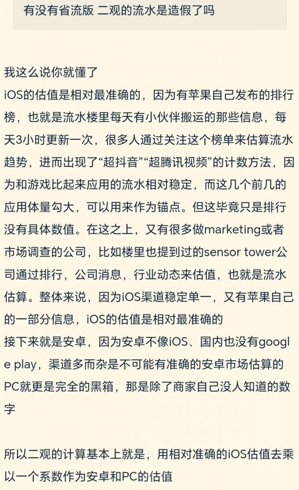
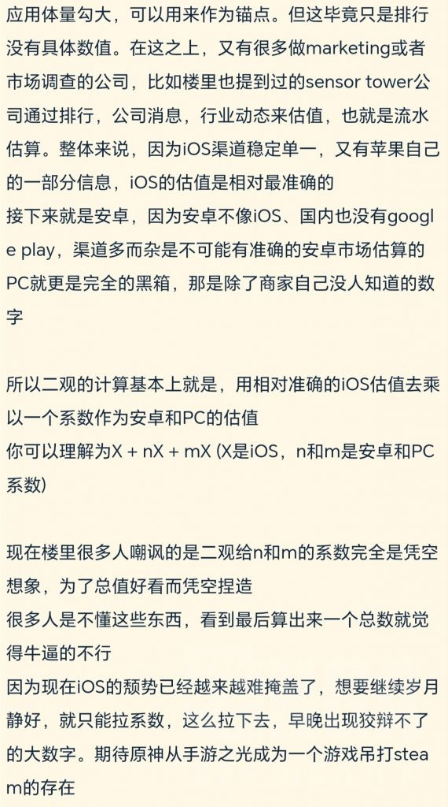

### [热点事件] 测测理查的逻辑能力时刻来了

Made by ngapost2md (c) ludoux [GitHub Repo](https://github.com/ludoux/ngapost2md)

----

##### 0.[15] \<pid:0\> 2023-07-27 18:30:14 by I_come
外边开赌局了

用 网易[今年][财报][手机端][收入前五][游戏] 之和 与 观圣今年 O流水对比

来论证 O到底凉没凉

问： 你们能在这句话中找到几处逻辑陷阱

----

##### 1.[33] \<pid:705288279\> 2023-07-27 18:31:44 by yeeaaaah
用二观就很难绷原有多大产全看观圣有多大胆

----

##### 2.[3] \<pid:705288316\> 2023-07-27 18:31:52 by Teddydesu
说到这个，有没有真正的懂哥来解释一下二观的系数是怎么给的啊

我是真不懂，对流水也没啥研究

----

##### 3.[20] \<pid:705288368\> 2023-07-27 18:32:09 by rrrrawae
拿收入和流水比?
你原神的利润是百分百吗？

----

##### 4.[13] \<pid:705288393\> 2023-07-27 18:32:17 by 小狼全肯定人
首先论证：一个pc系数&gt;1的游戏究竟是有一点pc端的手游还是有一点移动端的端游
我倾向于后者   

----

##### 5.[10] \<pid:705288511\> 2023-07-27 18:32:55 by La da
所以是不能否认玩家流失、流水狠狠下滑的事实，只能复读就算下滑了现在的流水依然很多吗？

那我只能狠狠的支持他们的观点了。

再接再厉！

----

##### 6.[12] \<pid:705288537\> 2023-07-27 18:33:03 by 格里兹纳特
流水对折再对折，它原神也一样能养活一批无能

----

##### 7.[5] \<pid:705288550\> 2023-07-27 18:33:05 by 嘀嘟滴嘟嘀
手综天天骂里茶滑坡厉害，我看他们也挺会顺着滑的。
不过散宝垮了，他们还要装着冷静客观也是不容易。

----

##### 8.[0] \<pid:705288822\> 2023-07-27 18:34:23 by Inquisit
网易：笑似 端游要是赚钱我做手游干嘛

----

##### 9.[0] \<pid:705289006\> 2023-07-27 18:35:20 by 无料通贩商
哪个贴啊

----

##### 10.[1] \<pid:705289037\> 2023-07-27 18:35:26 by Gdygfdqqqq
手综是不是脑子让门夹了，财报和流水比

----

##### 11.[0] \<pid:705289103\> 2023-07-27 18:35:43 by erzai
>[jump](#pid705288316) Teddydesu(2023-07-27 18:31)说:
>说到这个，有没有真正的懂哥来解释一下二观的系数是怎么给的啊
>
>我是真不懂，对流水也没啥研究

水楼之前存的图。

----

##### 12.[0] \<pid:705289277\> 2023-07-27 18:36:31 by 咸鱼摆烂王
用财报和B站野鸡UP预测对比？

----

##### 13.[0] \<pid:705289281\> 2023-07-27 18:36:34 by 不尔魃
这话其实就是很难绷
原今年的流水到底有多少是靠着那几个老东西的卡池贡献的、甚至新角色到底有多大程度上靠着老东西打下来的基本盘的惯性，难道有些人没个数吗
真就只看纵坐标不看斜率呗

----

##### 14.[1] \<pid:705289313\> 2023-07-27 18:36:42 by 阿古斯的影灵衣
不如用摩尔定律和观圣外服pc系数对比，来论证原神对科技发展的影响

----

##### 15.[1] \<pid:705291746\> 2023-07-27 18:48:34 by 马哈鱼鱼卵
pc系数倍率太低了不够用啊，有坛友知道观圣抽到二命能解锁独立增伤乘区吗？

----

##### 16.[1] \<pid:705292585\> 2023-07-27 18:52:47 by La da
>[jump](#pid705291746) 马哈鱼鱼卵(2023-07-27 18:48) 说: 
>
>pc系数倍率太低了不够用啊，有坛友知道观圣抽到二命能解锁独立增伤乘区吗？

pc系数已经是独立乘区了，还敢要新的啊

1命解毒充能
2命增加效果范围(指刷遍各大忠诚社区)

不能更多了，后面的命座留给后面的人来构思。

----

##### 17.[0] \<pid:705292847\> 2023-07-27 18:54:11 by 经常看书看得开
刚刚还过去占楼了，谁赢了我都乐。

原赢了易友roll钱，易赢了原友roll钱. 赌注十单648耶 你敢想吗？

----

##### 18.[0] \<pid:705292856\> 2023-07-27 18:54:13 by aswaw111
找逻辑谬误的话可能我还感兴趣，你把一句疯话放这里让我评价疯的程度，那我只能说反正我还没疯

----

##### 19.[0] \<pid:705293043\> 2023-07-27 18:55:13 by 透明的视野
>[jump](#pid705292585) La da(2023-07-27 18:52) 说: 
>
>pc系数已经是独立乘区了，还敢要新的啊
>
>1命解毒充能
>2命增加效果范围(指刷遍各大忠诚社区)
>
>不能更多了，后面的命座留给后面的人来构思。

继大贤者之后，里版又要出新角色了吗

----

##### 20.[0] \<pid:705293379\> 2023-07-27 18:57:01 by 马哈鱼鱼卵
>[jump](#pid705292585) La da(2023-07-27 18:52) 说: 
>
>pc系数已经是独立乘区了，还敢要新的啊
>
>1命解毒充能
>2命增加效果范围(指刷遍各大忠诚社区)
>
>不能更多了，后面的命座留给后面的人来构思。

桃一个三命普攻加3(指各服数据均取最大值)

----

##### 21.[0] \<pid:705293483\> 2023-07-27 18:57:30 by tbiph9277
首先我们需要讨论一下。二观给原的pc系数到哪了

----

##### 22.[0] \<pid:705294147\> 2023-07-27 19:00:18 by 一个苦柚子
都不考虑税的问题了吗，流水肯定是含税的啊，收入可是不含税了

----

##### 23.[0] \<pid:705294838\> 2023-07-27 19:03:12 by p19871120
观圣，米哈游的守护者，只有他能帮米哈游抗住腾讯网易打压，还能反过来打压腾讯网易

----

##### 24.[1] \<pid:705295310\> 2023-07-27 19:05:15 by UID42694396
>[jump](#pid705288316) Teddydesu(2023-07-27 18:31):

“内部消息”对，跟结晶们最恨的幽夜蛆传话太监一模一样，“内部消息”

----

##### 25.[0] \<pid:705296837\> 2023-07-27 19:11:42 by 无料通贩商
>[jump](#pid705294147) 一个苦柚子(2023-07-27 19:00) 说: 
>
>都不考虑税的问题了吗，流水肯定是含税的啊，收入可是不含税了

都五打一了，肯定就不一样了

----

##### 26.[0] \<pid:705297292\> 2023-07-27 19:13:43 by Bauhaus的大豪斯
>[jump](#pid705289103) erzai(2023-07-27 18:35):

原来这个系数是这么来的，一个个人up主竟然想反驳一个靠数据分析吃饭的公司给出的数据，属实离谱

----

##### 27.[0] \<pid:705298185\> 2023-07-27 19:17:53 by UID64792814
第一 大命题上 为什么比过了就不凉了
第二 观圣 上下限差出一半来了用 中间值好像多委屈
第三 为什么用带逆天pc系数的估计和 手游对比
第四 财报中 营业收入 净收入 毛利润 净利润用哪个
第五 财报从来没公布单项游戏收入 他哪来的数据
第六 网易去年游戏总营收千亿 你怎么不把米氏全家桶一起拉来比

----

##### 28.[0] \<pid:705298359\> 2023-07-27 19:18:34 by NeroliPortofino
虽然但是……
首先财报利润表上的营业收入是不含增值税的，而且会牵扯到是否符合收入的确认条件，~~如果是中期报表看的母公司合并主表的话还有乱七八糟的调整，除非去扒拉后面的披露事项~~。
粗略理解的话就是当期公司的进账不一定就全部会体现为当期的营业收入。
这是表最顶上的一格还暂时扯不到利润率的问题。
其次，数据的可靠性、时间口径不一致也拿来比的话……
顺从吧，还有什么好说的。

----

##### 29.[0] \<pid:705304025\> 2023-07-27 19:49:37 by 随时随刻事实上
>[jump](#pid705288316) Teddydesu(2023-07-27 18:31) 说: 
>
>说到这个，有没有真正的懂哥来解释一下二观的系数是怎么给的啊
>
>我是真不懂，对流水也没啥研究

再解释一下流水的问题

真实的数据算第一手数据，只有游戏公司内部和苹果公司知道(仅限App Store)
iOS畅销榜是第二手数据，是苹果根据真实数据加工而来的
sensor tower之类的公司是第三手数据，是根据iOS畅销榜加上自己的加权算法得来的
观圣则是第四手数据，是根据sensor tower的数据自己加系数得来的

现在的矛盾是流水楼知道观圣是第四手数据，但观圣xz却坚持认为观圣的数据是第一手数据，因为“网易前员工”“有大佬微信”，总之暗示观圣有内部消息。

然而观圣自己都写了流水是用sensor  tower的三手数据乘了个自己想的系数，还几把有人觉得他有内部消息。他有内部消息用sensor tower的数据？乘个没有任何依据的系数就装懂哥，信观圣的多少沾点

