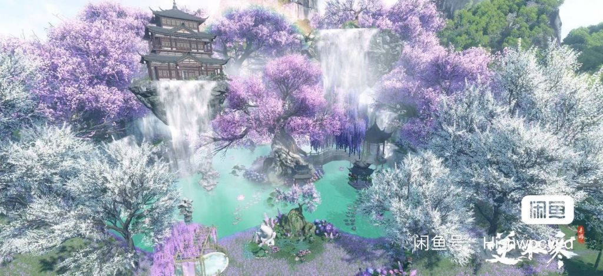
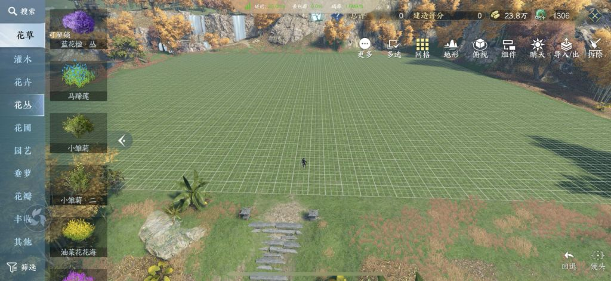
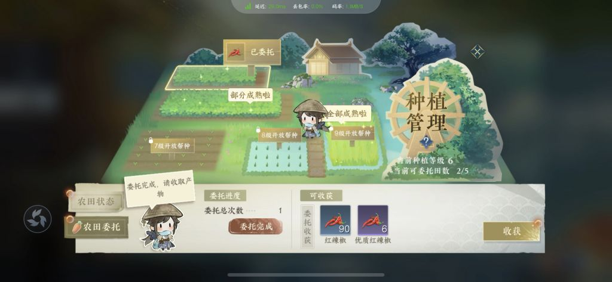
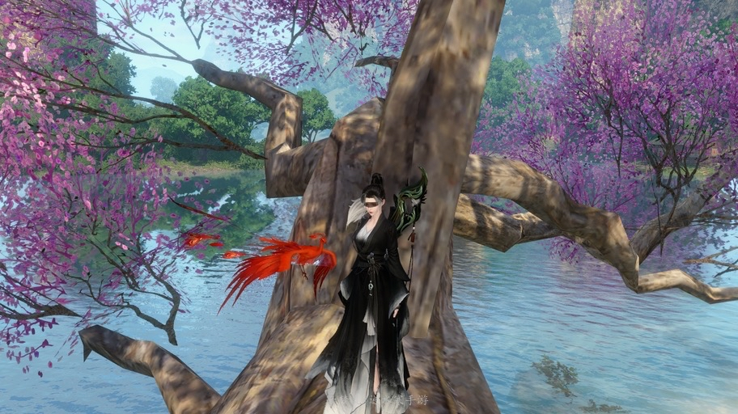
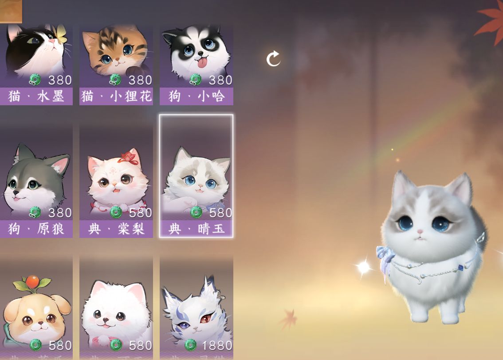

### [不吐不快] 共创模式才是手游的未来

Made by ngapost2md (c) ludoux [GitHub Repo](https://github.com/ludoux/ngapost2md)

----

##### 0.[0] \<pid:0\> 2023-07-27 20:50:07 by 走路草233
illusion宣告停止活动之后，怀旧找回来很多资源，重温了不少“少年回忆”，最大的感想就是：共创游戏才是生命力的保证，早在本世纪初，i社就开创了两个玩家深度参与的游戏模式——摄影棚和自制角色，让我震惊的是，仝妙3至今还有玩家在制作角色，可见其生命力之顽强。
回想起之前玩的单机游戏，共创同样是最受欢迎的模式，饥荒、星露谷、暗黑地牢、上古卷轴哪一个不是因为模组增加了可玩性？~~还有瑟瑟！~~即使放到原神游戏内也是一样，神工天巧跟其他一众4399活动相比，口碑要好得多，由此可见，从“教你玩游戏”走向“请你做游戏”才是未来丰富游戏内容的大势所趋，比起傲慢的暴雪，虚心的鸽雷才是一家游戏厂商该有的模样。
但这跟hy又有什么关系呢？噪音罢了，给自己打造一口精美的棺材才是当务之急。

----

##### 1.[1] \<pid:705316573\> 2023-07-27 20:55:44 by 油门踩到底
我觉得原神最遗憾的是尘歌壶系统
每次去看别人造的房子，以及用各种机关建筑构建的谜题，都觉得他们好有创意，好想去模仿or去玩
但是一轮到自己，看着那傻逼的一天5个仙速瓶，用完了就要等好几个小时造家具，每个家具又要刷一堆木头，一个摹本里面又有一大堆家具
抄都抄不来，累了，随便摆一堆石狮子屏风当矿场了

----

##### 2.[1] \<pid:705317780\> 2023-07-27 21:01:56 by FrozenFrigidFrantic
他们当然知道啊，不然为啥下一个去抄动物森友会，问题在于接下来会怎样把这玩意和养饭圈结合起来。

----

##### 3.[0] \<pid:705317974\> 2023-07-27 21:03:03 by 冬马乔太郎
i社好像换了个子公司名字复活了

----

##### 4.[0] \<pid:705318459\> 2023-07-27 21:05:46 by DxhSN2022
“限制玩家”已经刻进米的DNA了，和自由八字不合。

尘歌壶一个几乎独立的系统，除了大月卡家具没有任何盈利点，也搞成养成系统那样，用十几小时的建造时间和各种每周购买上限来卡玩家，在游戏里体验现实装修呢这是？

----

##### 5.[0] \<pid:705319955\> 2023-07-27 21:13:39 by Inquisit
>[jump](#pid705318459) DxhSN2022(2023-07-27 21:05) 说: 
>
>“限制玩家”已经刻进米的DNA了，和自由八字不合。
>
>尘歌壶一个几乎独立的系统，除了大月卡家具没有任何盈利点，也搞成养成系统那样，用十几小时的建造时间和各种每周购买上限来卡玩家，在游戏里体验现实装修呢这是？

方方面面都是对玩家强烈的控制欲，开放世界看不到半点自由度是这样的

----

##### 6.[0] \<pid:705320662\> 2023-07-27 21:17:28 by kunizu
有可能

----

##### 7.[0] \<pid:705321632\> 2023-07-27 21:23:49 by 药师鬼
隔壁的庄园↓(图网上找的)

你就说休闲玩家会喜欢这个还是随便放点东西就红了的负载

----

##### 8.[0] \<pid:705322158\> 2023-07-27 21:27:16 by Schia19
>[jump](#pid705321632) 药师鬼(2023-07-27 21:23)说:
>隔壁的庄园↓(图网上找的) [img]https://img.nga.178.com/attachments/mon_202307/27/l2Q2s-83pcZfT3cSsg-d3.jpg.medium.jpg[/img]  你就说休闲玩家会喜欢这个还是随便放点东西就红了的负载

没想到能建得这么漂亮，看得我都心动了。

----

##### 9.[0] \<pid:705322603\> 2023-07-27 21:30:12 by usfdocb
有一说一饥荒和星露谷是真的好玩

----

##### 10.[0] \<pid:705323023\> 2023-07-27 21:32:43 by 药师鬼
>[jump](#pid705322158) Schia19(2023-07-27 21:27) 说: 
>
>没想到能建得这么漂亮，看得我都心动了。

那边的建设基本是对标端游的，收菜养殖大豪斯很满足

----

##### 11.[0] \<pid:705325770\> 2023-07-27 21:46:21 by yblc
>[jump](#pid705322158) Schia19(2023-07-27 21:27) 说: 
>
>没想到能建得这么漂亮，看得我都心动了。

它的家园真的很适合建造，可以平地起高山还可以造湖，而且也就是收菜卖出去之后的建材来建房子，在庄园下线上线还是庄园，菜的种子也不贵，一波菜是十分钟到六小时不等，但是就是每个星期只能卖58w的建材，会卡点装修

----

##### 12.[0] \<pid:705325815\> 2023-07-27 21:46:35 by Schia19
>[jump](#pid705323023) 药师鬼(2023-07-27 21:32)说:
>[quote][pid=705322158,37162262,1]Reply[/pid] <b>Post by [uid=65073277]Schia19[/uid] (2023-07-27 21:27):</b>  没想到能建得这么漂亮，看得我都心动了。[s:ac:愁][/quote][img]https://img.nga.178.com/attachments/mon_202307/27/l2Q2s-fgdzZbT3cSsg-d5.jpg.medium.jpg[/img] [img]https://img.nga.178.com/attachments/mon_202307/27/l2Q2s-a2ozK1sT3cSsg-d5.jpg.medium.jpg[/img]  那边的建设基本是对标端游的，收菜养殖大豪斯很满足

竟然还能种田！这个种田系统做得怎么样？
这下真的有空就去下个来玩玩了。
原神无论是钓鱼还是壶还是种田，个个都难以形容。
就没见过哪个游戏能把这些休闲玩法全都做得这么糟糕的。

----

##### 13.[0] \<pid:705326576\> 2023-07-27 21:50:08 by 雾霁天明
想当初蛋仔也是靠一手开放地图编辑器给盘活了(乐园真的好玩)

----

##### 14.[0] \<pid:705327198\> 2023-07-27 21:52:55 by Schia19
>[jump](#pid705325770) yblc(2023-07-27 21:46)说:
>[quote][pid=705322158,37162262,1]Reply[/pid] <b>Post by [uid=65073277]Schia19[/uid] (2023-07-27 21:27):</b>  没想到能建得这么漂亮，看得我都心动了。[s:ac:愁][/quote]它的家园真的很适合建造，可以平地起高山还可以造湖，而且也就是收菜卖出去之后的建材来建房子，在庄园下线上线还是庄园，菜的种子也不贵，一波菜是十分钟到六小时不等，但是就是每个星期只能卖58w的建材，会卡点装修

看来是模拟人生的那种家园建造？
之前别人介绍的大世界npc对话生动有趣我都没心动，这次是真的不得不玩了。

----

##### 15.[0] \<pid:705328249\> 2023-07-27 21:58:15 by 猫小乐1124
爆论：并不仅仅是手游，而是任何游戏。

隔壁lol为啥不好玩的言论越来越多，大乱斗玩家越来越多，不就是因为设计师越来越按头加强或者削弱英雄吗。卢娜从削弱到彻底改版，猫咪的几次改动，泽丽的改动等等数不胜数的脑瘫改动。

玩游戏最忌讳的就是策划教你玩游戏。

----

##### 16.[0] \<pid:705331555\> 2023-07-27 22:16:48 by 药师鬼
>[jump](#pid705325815) Schia19(2023-07-27 21:46) 说: 
>
>竟然还能种田！这个种田系统做得怎么样？
>这下真的有空就去下个来玩玩了。
>原神无论是钓鱼还是壶还是种田，个个都难以形容。
>就没见过哪个游戏能把这些休闲玩法全都做得这么糟糕的。

还蛮不错的，旱地水地，可以手动耕种施肥收割也可以托管。作物有几十种，分季节，每周有指定作物收购，可以到其他人的庄园高卖(类似于动森卖大头菜/剑三高价花)。

畜牧业可以养孔雀兔子猪什么的，掉下来的产物还能精加工。

另外今天开了宠物系统，我直接188搞了凤凰(普通的小猫小狗有十几个花色，只需要不花钱的绑玉)，你可以语音喊他跟随……

----

##### 17.[0] \<pid:705333294\> 2023-07-27 22:26:54 by Inquisit
>[jump](#pid705322158) Schia19(2023-07-27 21:27) 说: 
>
>没想到能建得这么漂亮，看得我都心动了。

而且去阿b看寒的庄园都是全景视频一点不带骗的，我这种不会造的人拿个官方模板也能自己慢慢装修，
不像壶基本都是凹角度硬拍好看的图，真抄下来一看就一小块因为负载不够

----

##### 18.[0] \<pid:705333317\> 2023-07-27 22:27:00 by Schia19
>[jump](#pid705331555) 药师鬼(2023-07-27 22:16)说:
>[quote][pid=705325815,37162262,1]Reply[/pid] <b>Post by [uid=65073277]Schia19[/uid] (2023-07-27 21:46):</b>  竟然还能种田！这个种田系统做得怎么样？ 这下真的有空就去下个来玩玩了。 原神无论是钓鱼还是壶还是种田，个个都难以形容。 就没见过哪个游戏能把这些休闲玩法全都做得这么糟糕的。[/quote]还蛮不错的，旱地水地，可以手动耕种施肥收割也可以托管。作物有几十种，分季节，每周有指定作物收购，可以到其他人的庄园高卖(类似于动森卖大头菜/剑三高价花)。  畜牧业可以养孔雀兔子猪什么的，掉下来的产物还能精加工。  [s:a2:doge]另外今天开了宠物系统，我直接188搞了凤凰(普通的小猫小狗有十几个花色，只需要不花钱的绑玉)，你可以语音喊他跟随…… [img]https://img.nga.178.com/attachments/mon_202307/27/l2Q2s-byhbK1kT3cSsg-d5.jpg.medium.jpg[/img] [img]https://img.nga.178.com/attachments/mon_202307/27/l2Q2s-2yukZ14T3cSpc-e8.jpg.medium.jpg[/img] [img]https://img.nga.178.com/attachments/mon_202307/27/l2Q2s-7xjiZ1zT3cSvi-mm.jpg.medium.jpg[/img]

全都缝上了是吧。十几年种田游戏老玩家表示缝得越多越高兴。

----

##### 19.[0] \<pid:705335896\> 2023-07-27 22:42:22 by Schia19
>[jump](#pid705333294) Inquisit(2023-07-27 22:26)说:
>[quote][pid=705322158,37162262,1]Reply[/pid] <b>Post by [uid=65073277]Schia19[/uid] (2023-07-27 21:27):</b>  没想到能建得这么漂亮，看得我都心动了。[s:ac:愁][/quote]而且去阿b看寒的庄园都是全景视频一点不带骗的，我这种不会造的人拿个官方模板也能自己慢慢装修， 不像壶基本都是凹角度硬拍好看的图，真抄下来一看就一小块因为负载不够[s:ac:无语]

壶的系统真的很敷衍，难用得不行。像我这种超级喜欢在游戏里建房的都只弄了个太屏间。
人家二十几年前的游戏家园建造都暴打它！

----

##### 20.[0] \<pid:705342726\> 2023-07-27 23:24:55 by 药师鬼
>[jump](#pid705333317) Schia19(2023-07-27 22:27)说:
><b>Reply to [pid=705331555,37162262,1]Reply[/pid] Post by [uid=7826199]药师鬼[/uid] (2023-07-27 22:16)</b> 全都缝上了是吧。十几年种田游戏老玩家表示缝得越多越高兴。[s:a2:笑]

探索也非常友好，一个望气(元素事业)可以显示所有的解谜和宝箱。大地图上玩家的探索进度是共享的，今天开了新的地图，大家都在解密，我就跟在后面开箱子，开箱子还能出饰品什么的，进度也非常明晰，还有可以兑换奖励的商店。

----

##### 21.[0] \<pid:705361211\> 2023-07-28 01:38:48 by 麻雀爱吃西红柿
把所有人一起创死的共创模式吗

