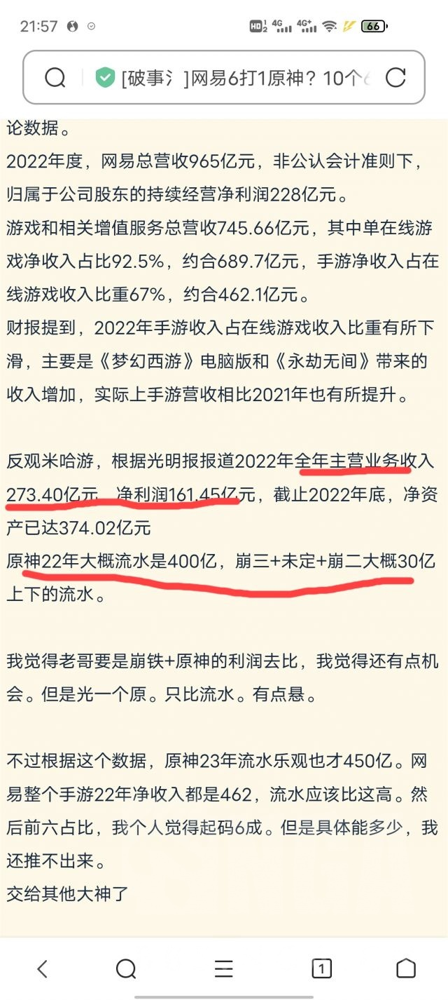

### [不吐不快] 隔壁看到的关于2022米的流水和收入，我脑子咋转不过圈呢

Made by ngapost2md (c) ludoux [GitHub Repo](https://github.com/ludoux/ngapost2md)

----

##### 0.[0] \<pid:0\> 2023-07-27 22:03:03 by xiehuaijiu76
收入273亿，原神年流水400亿？哪怕一半算苹果扣去30%抽成也340亿了吧。ps和b站用户贡献加起来有10%吗

<a href="javascript:;" onclick="collapse(this);">+</a>点击展开 ...

----

##### 1.[0] \<pid:705331955\> 2023-07-27 22:19:06 by ak1212ak
273是光明日报
二观那个我没看，他们说的小400那个好像是二观的
而且打网易还专门去掉端游这也就是腾讯手游也强，不然也能去掉非游戏业务和端游比腾讯了

----

##### 2.[0] \<pid:705332649\> 2023-07-27 22:23:15 by 广阔的蓝天i
手综脑子还用去想？连网wytx为了让财报好看巴拉巴拉什么的手段都用上了你还要去理这群玩意的脑子？

----

##### 3.[0] \<pid:705333823\> 2023-07-27 22:29:52 by ohgscn
你就当人家厨流水，为数字发情

