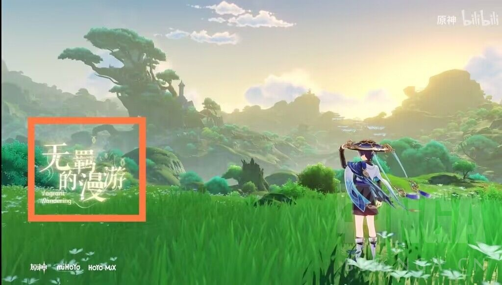
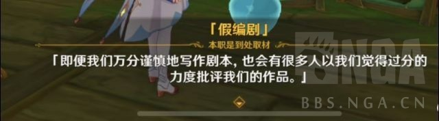
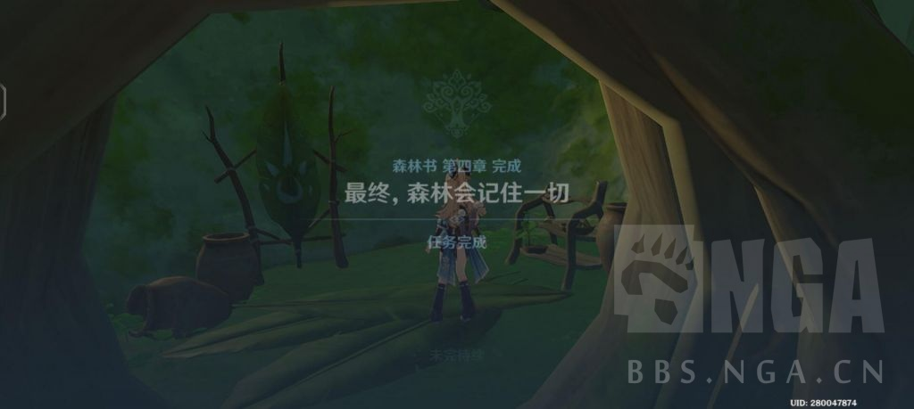

### [不吐不快] 仲夏夜愚戏(带ooc)

Made by ngapost2md (c) ludoux [GitHub Repo](https://github.com/ludoux/ngapost2md)

----

##### 0.[0] \<pid:0\> 2023-07-28 00:50:45 by innovation9

“草木自以为无所不知，我等才明白那些智慧背后的叵测”

“拉拢，没有所谓的立场”

“因为对这场算计来说，学派代表并非是终点”

“今日我们相聚于此，是为了纪念我们的好神明”

“她的牺牲对于整个提瓦特而言，值得足足数年的断氪缅怀”

“呵……仅仅数年……都说树王大人推崇的是智慧与慈爱”

“可大风纪官大人您的信仰，比我这巡林官还要淡薄啊”

“草之王在世界树下陨落，对你们这些远离神之宝座——

又难以窥见净善宫一隅的雨林/沙漠功臣们来说，应该无法想象吧”

“既然如此，就好好侧耳倾听，不然不明真相的那菈们会哭的”

“喂喂——就连作为佣兵的我都觉得，这儿可不是斗嘴的场合”

“哎——真是可惜”

“尽管能力不及树王大人，小吉祥草王的逝去依旧令人惋惜”

“她的离去并不会让我们背弃须弥”

“倒是旅行者，正机之神和稻妻的人偶初号机呢？”

“须弥人都认为[神明罐装知识]是人类无法理解的神的智慧”

“在清洗了过去嫌疑后，他已实质脱离罪的镣铐”

“[生命]的愚戏该结束了，此刻你们没有观众”

“所有悲剧的牺牲，都将铭记于森林心中，与梦长存”

“在自大的文案笔下，她已失去月光的皎洁”

“神明的温柔，此为太阳的恩赐，此为月亮的仁慈”

“你虽长辞于此世间，永别于地脉洪流之中”

“但是，纳西妲，我承诺你”

“你的灵柩，将会是整个[提瓦特]”

----

##### 1.[0] \<pid:705356193\> 2023-07-28 00:55:39 by 你家破猫不招财
愚 戏    ？
马戏团 ！

----

##### 2.[0] \<pid:705397544\> 2023-07-28 09:47:23 by cheyenne_xu
图2的纳西崩有点东西

----

##### 3.[0] \<pid:705397796\> 2023-07-28 09:48:32 by 倾落影
为什么不打码

----

##### 4.[0] \<pid:705398243\> 2023-07-28 09:50:29 by 丑齐宗丁武祝
没有眼白&gt;瞳孔我不是很认可这是其他   

----

##### 5.[0] \<pid:705402580\> 2023-07-28 10:09:31 by 海上飘丝瓜
>[jump](#pid705397544) cheyenne_xu(2023-07-28 09:47) 说: 
>
>图2的纳西崩有点东西

忽然想到，假如散兵化身I always cum back的fnaf紫色老登，主线后假装可怜纯白人偶，骗取没见过同类同龄生物的孤单纯良小草神信任，让她真的以为这小哥哥是同类。

然后散兵直接老登紫色病毒夺舍草神化身纳西散，利用纳西妲躯壳核心重启蒸鸡。

打法也可以和fnaf老登和Cassidy金色公主一样，打七神小游戏，一边打一边了解散兵那些过去，打过了就破解紫色病毒，拯救小草神让她成长，别几把在那里瞎圣母了

然后散也可以直接弃甲果断跑路，拆开机甲发现里面没有人，直接让他当真正的流浪者，日后无论是在阴影里还是哪里巅峰相见再合作

越写越气，虽然老说他害得别的角色崩，但真的想想，这哥们自己也崩坏得一塌糊涂了，简直了，米，牛皮

----

##### 6.[0] \<pid:705419182\> 2023-07-28 11:17:18 by Fablet
>[jump](#pid705402580) 海上飘丝瓜(2023-07-28 10:09) 说: 
>
>忽然想到，假如散兵化身I always cum back的fnaf紫色老登，主线后假装可怜纯白人偶，骗取没见过同类同龄生物的孤单纯良小草神信任，让她真的以为这小哥哥是同类。
>
>然后散兵直接老登紫色病毒夺舍草神化身纳西散，利用纳西妲躯壳当核心重启蒸鸡。
>
>打法也可以和fnaf老登和Cassidy金色公主一样，打七神小游戏，一边打一边了解散兵那些过去，打过了就破解紫色病毒，拯救小草神让她成长，别几把在那里瞎圣母了
>
>然后散也可以直接弃甲果断跑路，拆开机甲发现里面没有人，直接让他当真正的流浪者，日后无

竟然在这里都能见到fnaf……
可是老实说，阿夫顿的塑造比()疯批恶人多了，塑造()的人肯定hold不住，还可能让他们蹭到

----

##### 7.[0] \<pid:705422763\> 2023-07-28 11:31:14 by wwwpoiu
如果最后那三个字不是提瓦特而是米忽悠就更好玩了

