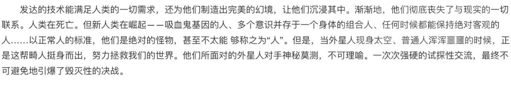

### [不吐不快] 稍微认真点说，猛干哥的兴趣领域其实在某种程度上暴露了米哈游的创作基调和行为底层逻辑

Made by ngapost2md (c) ludoux [GitHub Repo](https://github.com/ludoux/ngapost2md)

----

##### 0.[0] \<pid:0\> 2023-07-28 05:43:59 by safindem
那就是哥特幻想艺术家不过你们拯救世界的大众化路线是不是有亿点走歪了呀？

----

##### 1.[0] \<pid:705372839\> 2023-07-28 06:57:34 by bzbjzj
这个我似乎见过类似的，偶尔一次围观逆天加入到一个建政群，发现了一个空想~~家~~，好像是认为人类目前走的路都是错的，企图虚构(或者他说发现)一种在所有概念上的至高绝对的道德，但是问是什么道德就是道德，具体是什么？就是道德。怎么实现？唔嗯呜呜。

----

##### 2.[1] \<pid:705374926\> 2023-07-28 07:30:39 by 怎样才能不被禁言1
我在微博上看到有人在一个克苏鲁论坛认出了猛干哥，他好像翻译了很多年克苏鲁作品，你的感觉可能是真的。可惜我再想看找不到那篇微博了，我也不知道那个克苏鲁论坛

----

##### 3.[0] \<pid:705389350\> 2023-07-28 09:09:33 by fysx
>[jump](#pid705374926) 怎样才能不被禁言1(2023-07-28 07:30) 说: 
>
>我在微博上看到有人在一个克苏鲁论坛认出了猛干哥，他好像翻译了很多年克苏鲁作品，你的感觉可能是真的。可惜我再想看找不到那篇微博了，我也不知道那个克苏鲁论坛  
>编辑：找不到原博，但是找到了这个
>

trow不是dnd论坛吗

----

##### 4.[0] \<pid:705389880\> 2023-07-28 09:12:02 by 零点，陈彬
>[jump](#pid705389350) fysx(2023-07-28 09:09) 说: 
>
>trow不是dnd论坛吗

trow那里现在居然还活跃吗

----

##### 5.[0] \<pid:705393103\> 2023-07-28 09:27:42 by 溶解在暧昧中
>[jump](#pid705374926) 怎样才能不被禁言1(2023-07-28 07:30) 说: 
>
>我在微博上看到有人在一个克苏鲁论坛认出了猛干哥，他好像翻译了很多年克苏鲁作品，你的感觉可能是真的。可惜我再想看找不到那篇微博了，我也不知道那个克苏鲁论坛  
>编辑：找不到原博，但是找到了这个
>

论坛就叫trow，n年前似乎还在里面下过博德2的不完整汉化，不知道是不是记错了

----

##### 6.[0] \<pid:705406115\> 2023-07-28 10:25:13 by Tartaglia_11th
猛干哥还研究战锤呢，很正常

----

##### 7.[0] \<pid:705406630\> 2023-07-28 10:27:14 by fcvqz421
无内鬼，来点猛图

----

##### 8.[0] \<pid:705407152\> 2023-07-28 10:29:21 by 到底什么是禁止字词
>[jump](#pid705406115) Tartaglia_11th(2023-07-28 10:25) 说: 
>
>猛干哥还研究战锤呢，很正常

那他可真是研究了个锤子，各种意义上的

----

##### 9.[0] \<pid:705419547\> 2023-07-28 11:18:38 by 怎样才能不被禁言1
>[jump](#pid705389350) fysx(2023-07-28 09:09) 说: 
>
>trow不是dnd论坛吗

trow克鲁苏版和苹果园的土匪窝是国内比较大的克鲁苏神话论坛板块

----

##### 10.[0] \<pid:705426148\> 2023-07-28 11:45:33 by HyacinthTU
突然想起自己在和别人讨论剧情时顺便分析了一下原神“克味儿”的来源，写着写着又觉得崩坏系列更“克系”。

根本原因是克苏鲁创作者洛夫克拉夫认为“宇宙是一种对人类冷漠、无目的的高等存在”、“有限的人类永远无法理解这个宇宙”。本质上他是“机械唯物主义”的。

但是我大意了，我突然发现李猛干可能不只是想要把“崩坏”或者“深渊”表现得很克系，他可能是自己想当崩坏宇宙和原神宇宙的古神——冷漠(这很重要吗？只有你们__才在乎吧)，无目的(看女玩家扯头花)，自以为高等(笔在人家手里)的“邪神”。

真是有够自恋和中二。呕。

----

##### 11.[0] \<pid:705429681\> 2023-07-28 12:01:05 by 冰川真琴
在果园没见过ID，搜了下有几个翻译帖子提到，感觉TROW用户偏WOD和COC，这人应该也是跑过DND的，但是可能比较少。
DND口味其实从爱好纸浆文学的GG老爷那开始就……偏向美国起点了
毕竟是个组队PVE，主打正义冒险者战胜邪恶怪物的基调。

----

##### 12.[0] \<pid:705432428\> 2023-07-28 12:13:49 by 月半鲸鱼

还研究他干嘛

他自己都把自己恶趣味说了，自我意识旺盛而已。

----

##### 13.[0] \<pid:705449409\> 2023-07-28 13:41:08 by cecial
>[jump](#pid0) safindem(2023-07-28 05:43) 说: 
>
>那就是哥特幻想艺术家，超脱于文本和游戏为每一位玩家提供犹如进入克苏鲁世界的体验，你们真的我哭死。
>不过你们想要通过创作来拯救世界的大众化路线是不是有亿点走歪了呀？
>或者我稍微尝试一下通过共情来揣摩正向用意吧，散兵这个角色和他极具争议性的故事是不是你们做同类筛选实验的牺牲品呢？
>
>[img]./mon_202307/28/l2Q2s-b2jqZpT3cSps-sg.jpeg

这是猛干哥早期作品吗

