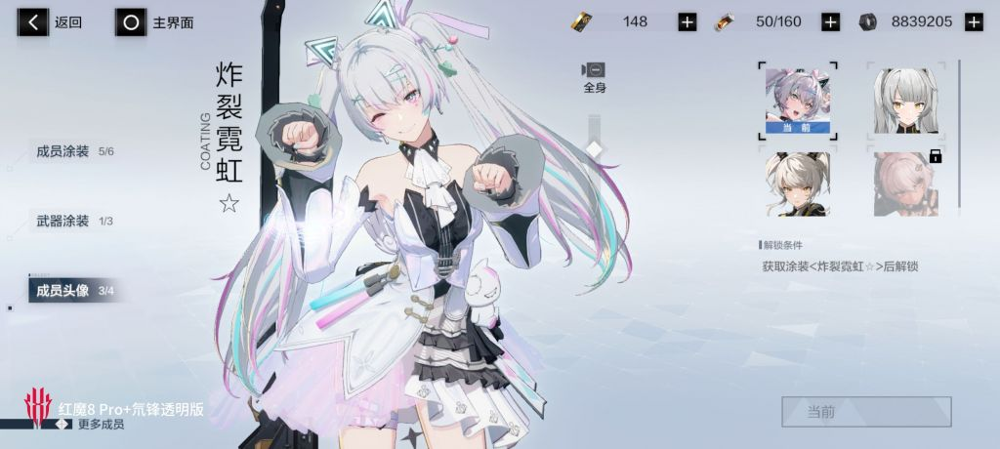
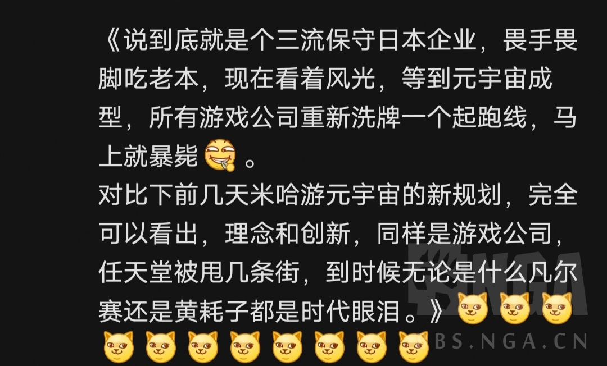

### [不吐不快] 还真有人信十亿用户沉溺的原宇宙啊？

Made by ngapost2md (c) ludoux [GitHub Repo](https://github.com/ludoux/ngapost2md)

----

##### 0.[0] \<pid:0\> 2023-07-28 10:23:10 by 格兰登
从某站和某乎来看，结晶居然真的会信

从技术上来说，
<b>“卡通渲染”</b>。米哈游自己最骄傲的，卫兵贬低其他厂商最重要的资本，对于二次元圈内来说可能有十分重要的意义，但是对于非二次元受众来说，“屁都不是！” ，而且现在其他二游厂慢慢赶上来了
<b>“人工智能”</b>。鹿鸣？逆熵AI？感觉不如科大讯飞。
“云游戏技术”。单纯凑数的，没什么特殊之处。
额外：<b>“live2D”</b>。不用我评价了，只有亚食人这种若治才会吹。不过比起空大佐吹爬墙，智力还算正常的。

从管理上来说：
刘某自曝公司扩张过快，<b>大公司病</b>。
三巨头沉迷<b>飙车</b>(心在哪收获就在哪，祝他成为赛车冠军)
<b>李猛干事件</b>、没X谁愿工作事件.....

从美术风格来说：
<b>二次元</b>受众减少，因美术质量明显下滑，一些角色元素堆砌过多，一些小众爱好占比过高
<b>主流</b>其实对二次元风格并不感冒，不用说有些人极端抵制日漫风

从舆论上来说：
圈外：市场渗透率接近饱和，在大众影响中<b>风评极差</b>      ps.   结晶“反正风评没法在差了，需要在意路人缘吗？”
圈内：本来不大的传统ACGN圈子愈加抵触这家公司      ps.   桥洞版：ACG加起来不够原神打的。(相互敌对)

我根本不假定他有10亿用户会发生什么，遇到什么无解的问题，因为他既不可能有“十亿用户”，也不会做“虚拟世界”，更做不到让人“愿意生活其中”

----

##### 1.[1] \<pid:705406769\> 2023-07-28 10:27:47 by 格兰登
蔡老板嘴比技术可硬多了，做脱口秀演员的话，粉丝可能会更多

----

##### 2.[1] \<pid:705406944\> 2023-07-28 10:28:29 by 风之碧海之翠
十亿用户溺死的原宇宙

----

##### 3.[1] \<pid:705407039\> 2023-07-28 10:28:54 by 雨源rainsource
进原宇宙，说米哈游一句不好把exit给你抠了

----

##### 4.[0] \<pid:705407085\> 2023-07-28 10:29:04 by RebbitX
虚拟宇宙只是手段、工具，真正的目的是从玩家口袋里摸钱

----

##### 5.[0] \<pid:705407145\> 2023-07-28 10:29:19 by ToutSeul
都科技领域了，拿点干货出来看看啊
光画饼那不纯纯cjb

----

##### 6.[1] \<pid:705407620\> 2023-07-28 10:31:15 by 1703kj
>[jump](#pid705407039) 雨源rainsource(2023-07-28 10:28) 说: 
>
>进原宇宙，说米哈游一句不好把exit给你抠了

再官方开盒去家里噶腰子是吧

----

##### 7.[0] \<pid:705407734\> 2023-07-28 10:31:44 by Cloudrapid133
这不就是跟区块链一样拿去吹逼的概念吗  
只要人敢想，人就敢给你画饼
16-18年那会儿说话就是这么硬气

----

##### 8.[3] \<pid:705407959\> 2023-07-28 10:32:41 by 格兰登
>[jump](#pid705407145) ToutSeul(2023-07-28 10:29) 说: 
>
>都科技领域了，拿点干货出来看看啊
>光画饼那不纯纯cjb

他的科技领域，单指卡通渲染，魔改unity引擎

技术宅人设都是围绕这个来的

其他的实在没有

----

##### 9.[0] \<pid:705408014\> 2023-07-28 10:32:51 by 扉与
就mhy的道德水平，做出来我也不敢用

----

##### 10.[0] \<pid:705408078\> 2023-07-28 10:33:07 by 森罗万象AL
现实中谁敢生活在随时删记忆的世界啊，是吧3.3

----

##### 11.[0] \<pid:705408254\> 2023-07-28 10:33:49 by macree
这是我的可莉夏日皮肤，看看原的

----

##### 13.[0] \<pid:705408653\> 2023-07-28 10:35:32 by AkariYu3310
全球有十亿用户的公司是不是一只手数得完了

----

##### 14.[0] \<pid:705409258\> 2023-07-28 10:38:10 by 格兰登
>[jump](#pid705408254) macree(2023-07-28 10:33) 说: 
>
>这是我的可莉夏日皮肤，看看原的

所以我说，米哈游赖以生存的“卡通渲染”，不是什么多牛逼的玩意，只是渲染技术的一个分支罢了，赛道上根本没几个人。

其他厂商在这方面赶上来很快的

----

##### 15.[0] \<pid:705410168\> 2023-07-28 10:42:03 by 格兰登
>[jump](#pid705408653) AkariYu3310(2023-07-28 10:35) 说: 
>
>全球有十亿用户的公司是不是一只手数得完了

一只手刚好数不完
TikTok-10亿，第六

----

##### 16.[0] \<pid:705410509\> 2023-07-28 10:43:32 by muziqiduan
他敢出，我不敢进，怕真的里面塞烧烤架。

----

##### 18.[0] \<pid:705411593\> 2023-07-28 10:48:03 by 水禾歌
放肆，知不知道探索前沿科技企业的含金量啊。

----

##### 19.[0] \<pid:705411966\> 2023-07-28 10:49:26 by 剑筑师と書記官
肯定会的，我相信mhy继续作死下去，里版就会实现他的愿望

----

##### 20.[0] \<pid:705412179\> 2023-07-28 10:50:14 by Sigmoni
>[jump](#pid705409258) 格兰登(2023-07-28 10:38) 说: 
>
>所以我说，米哈游赖以生存的“卡通渲染”，不是什么多牛逼的玩意，只是渲染技术的一个分支罢了，赛道上根本没几个人。
>
>其他厂商在这方面赶上来很快的

其实再嘴一句，网易早在2014年就用上自研引擎了(藤子也有)，魔改unity其实就是自封二次元皇帝罢了

----

##### 21.[0] \<pid:705412455\> 2023-07-28 10:51:18 by 何事金刀向明月
以前可能信它真给我掏个绿洲，现在？今天逼我厨散兵，明天逼我爱C罗，后天可能强制我穿林尼套上台表演切人魔术，变不回去的那种

----

##### 23.[0] \<pid:705416685\> 2023-07-28 11:07:51 by kemax3
mhy还是先关心关心自家公司管理吧。

一是内鬼频频，现在来看虽然有部分官方舅舅，但肯定也有内鬼是个人行为，侧面说明公司的管理保密这块做的非常差。哪天内鬼带着资料往别的公司跑了都不知道。

二是这次猛干哥事件，有一种说法是，这次爆料的人是mhy内部成员，看不惯猛干哥才爆料的，可能公司内部早已存在不和。像港迅，猪场这种拉帮结派的事可能在mhy内部已悄然发生。考虑到mhy之前盲目扩招，跟着三巨头打江山自缢功臣的老员工和扩招来的新进出现分歧这种情况也不无可能。

----

##### 24.[0] \<pid:705417440\> 2023-07-28 11:10:41 by luobenkexin
十亿用户元宇宙。。

我怕进去被权限狗+卫兵抓起来玩弄+游街啊。。

人家当个文案都控制不住玩弄玩家的欲望，真有权限你看看那些vr本子的玩法是不是还想象力不足了

----

##### 25.[0] \<pid:705418095\> 2023-07-28 11:13:15 by 君影清灵
十亿元宇宙不知道为什么让我想起了cf那个什么三亿鼠标的枪战梦想

----

##### 26.[0] \<pid:705419224\> 2023-07-28 11:17:27 by gtmmd
我前司去年底的时候还真去mhy总部交流过元宇宙的东西，因为当时我们老板也是做元宇宙的。大家会上吹得花好月圆的，私底下我们同事里但凡是玩游戏的，都知道元宇宙概念现在就是个臭鱼烂虾，谁碰谁傻逼

----

##### 27.[0] \<pid:705425948\> 2023-07-28 11:44:44 by 夺命小绵羊
>[jump](#pid705417440) luobenkexin(2023-07-28 11:10) 说: 
>
>十亿用户元宇宙。。
>
>我怕进去被权限狗+卫兵抓起来玩弄+游街啊。。
>
>人家当个文案都控制不住玩弄玩家的欲望，真有权限你看看那些vr本子的玩法是不是还想象力不足了

这不是爽死我了？

----

##### 28.[0] \<pid:705426322\> 2023-07-28 11:46:25 by 随便改个名字吧
戳啦 10亿npc生活的元宇宙啦
角色有自己的生活

----

##### 29.[0] \<pid:705426349\> 2023-07-28 11:46:31 by Inquisit
怎么会有人相信四人联机都做的依托答辩的厂商能做的好虚拟世界

----

##### 30.[0] \<pid:705427175\> 2023-07-28 11:49:58 by 星耀的逐光者
我當初竟然還信了……
還敬佩他們是有理想的
結果嘛像是滿嘴跑火車

----

##### 31.[0] \<pid:705428260\> 2023-07-28 11:54:41 by imCaigz
米内部全是猛干哥，他们的内部的排行可能是谁做的东西让粉丝破防的数和卡池做个比较，数值越小，功能越高

米就不是游戏公司

对了，瓜版那个帖子1楼不是光速删号跑路了吗？有理由怀疑他也是米的人，怕被人扒皮，所以才光速销号的

----

##### 32.[0] \<pid:705429801\> 2023-07-28 12:01:35 by kunizu
>[jump](#pid705407039) 雨源rainsource(2023-07-28 10:28) 说: 
>
>进原宇宙，说米哈游一句不好把exit给你抠了

SAO万岁，茅场晶彦NB！

----

##### 33.[0] \<pid:705430061\> 2023-07-28 12:02:45 by 做我的猫子
十亿用户宇宙和C罗谈恋爱，C罗暖暖吗

----

##### 34.[0] \<pid:705430858\> 2023-07-28 12:06:32 by 咼佱
>[jump](#pid705425948) 夺命小绵羊(2023-07-28 11:44) 说: 
>
>这不是爽死我了？

不和其它XX做那个就绝对出不去的房间，爽吧

----

##### 35.[0] \<pid:705431818\> 2023-07-28 12:10:56 by 夕音子
技术是指瓦片是纸片么

----

##### 37.[0] \<pid:705432410\> 2023-07-28 12:13:44 by cccherch
把公司投资项目和企业文化拿出去吹的仅此一家，标榜高技术人设都敢跟华为相提并论，可见结晶的主要群体是根本没工作过的低龄人群，甚至有可能学历都堪忧。

----

##### 38.[0] \<pid:705432498\> 2023-07-28 12:14:09 by shli—
以前我还真希望他做得出来。。。
现在想来就是用以提纯结晶的噱头罢了，笑死，真是傻逼东西

----

##### 39.[0] \<pid:705433565\> 2023-07-28 12:19:17 by xinsd
感觉这种做出十有亿用户沉浸式体验的虚拟游戏公司最后以我国国情会变成国企或者国家控股。

----

##### 40.[0] \<pid:705434096\> 2023-07-28 12:21:37 by lhx2770544613
十亿用户指内含五亿结晶剩下五亿是商单

----

##### 41.[0] \<pid:705434587\> 2023-07-28 12:23:54 by ToutSeul
>[jump](#pid705430858) 咼佱(2023-07-28 12:06):

什么euphoria

----

##### 42.[0] \<pid:705434812\> 2023-07-28 12:25:00 by akanatsu
可以买粉丝和买各种商单制造蒸蒸日上与有荣焉和鼓励扯头花尖叫
十亿数字生命，蒸馍？

----

##### 44.[1] \<pid:705436058\> 2023-07-28 12:31:15 by 灵芝是个快乐的小蘑菇
我一直觉得，元宇宙，本质不就是的RPG游戏？再进一步，就mmorpg？隔壁顺火暖都给npc搞了ai对话了，原还是领带美元的套模npc，毫无沉浸感啊，《关于重生到原宇宙因为恐怖谷效应被复活的哲平吓到当场转生这件事》。

----

##### 45.[0] \<pid:705436126\> 2023-07-28 12:31:37 by もいです
所以真的说句zzbzq的话 魔怔黑再多 架不住有的人真的把o和m当一切 二次元也好 角色也好 厨力也好 故事也好 世界观也好 m没有哪个是顶端 哪怕在二次元届也是一样的 再怎么吹嘘 从塞翁手游X批拐到miku和key社 最败坏人缘的就是一次次的 “你流水玩的人比得过原神吗”这种傲慢

----

##### 46.[0] \<pid:705436657\> 2023-07-28 12:34:14 by 星际兄贵
就mhy的屁股不怕来个刀剑神域现实版？

----

##### 47.[0] \<pid:705437092\> 2023-07-28 12:36:14 by 清蒸盐姜香菜鱼
说起来这个鹿鸣，很有知名度吗，以前都没怎么听说过。还是一个非常关注mhy的人说了才知道
谭友们都一直知道吗

----

##### 48.[0] \<pid:705439279\> 2023-07-28 12:47:02 by 嫩鸡馍馍蒸着吃
我真的信了
对，玩原神玩的

----

##### 50.[0] \<pid:705442890\> 2023-07-28 13:05:22 by salmonequation
小学生是这样的，毕竟没接触过电脑

----

##### 51.[1] \<pid:705443252\> 2023-07-28 13:07:24 by 壬游穆辰方乔
>[jump](#pid0) 格兰登(2023-07-28 10:23):

脑中不自觉的就想象到了十亿用户的米家宇宙，大多数人对米的各种操作沉默或无比狂热，顶部结晶化身盖世太保高强度堵嘴+大清洗，对外天天糖豆人塔塔开，太哈人了

----

##### 52.[0] \<pid:705444141\> 2023-07-28 13:11:57 by 万岁玛利亚
渲染技术感觉不如罪恶装备一根极霸矛

----

##### 53.[0] \<pid:705444297\> 2023-07-28 13:12:46 by 无料通贩商
>[jump](#pid705443252) 壬游穆辰方乔(2023-07-28 13:07) 说: 
>
>脑中不自觉的就想象到了十亿用户的米家宇宙，大多数人对米的各种操作沉默或无比狂热，顶部结晶化身盖世太保高强度堵嘴+大清洗，对外天天糖豆人塔塔开，太哈人了

heil mhy

----

##### 54.[0] \<pid:705445246\> 2023-07-28 13:18:15 by 黑眼睛的银白色暴风雪
>[jump](#pid705436126) もいです(2023-07-28 12:31) 说: 
>
>所以真的说句zzbzq的话 魔怔黑再多 架不住有的人真的把o和m当一切 二次元也好 角色也好 厨力也好 故事也好 世界观也好 m没有哪个是顶端 哪怕在二次元届也是一样的 再怎么吹嘘 从塞翁手游X批拐到miku和key社 最败坏人缘的就是一次次的 “你流水玩的人比得过原神吗”这种傲慢

问题是他们从来也不对农批提流水

----

##### 55.[0] \<pid:705445959\> 2023-07-28 13:22:13 by 樱木花kun
十亿用户的原宇宙，然后维护治安的是仙家军是吧想想都挺可怕的。

