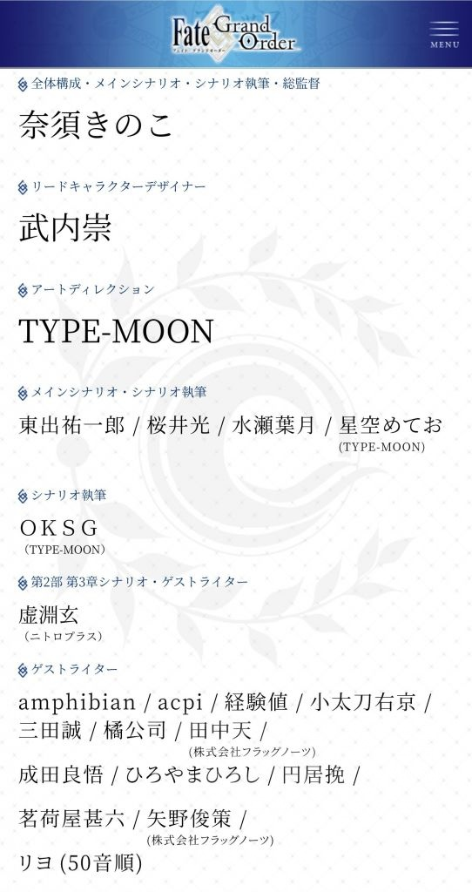

### [热点事件][不吐不快]理性讨论，原神须弥的剧情是哪个ch写的

Made by ngapost2md (c) ludoux [GitHub Repo](https://github.com/ludoux/ngapost2md)

----

##### 0.[0] \<pid:0\> 2023-07-28 10:37:54 by 七宗罪之贪吃
什么让玩家激动的烧树是一场梦啊，什么散兵变成风宝宝失忆了，什么拯救拉娜，什么散草cp，都是谁写的啊？

写得太好了

那位ch能麻烦报上名字吗？？

你要是说这是让手底下的大专生写的就不礼貌了啊

----

##### 1.[12] \<pid:705409454\> 2023-07-28 10:39:06 by muziqiduan
这种东西能端上来，从写的到校的到审的到拍板的，有一个无辜的么

----

##### 2.[0] \<pid:705409748\> 2023-07-28 10:40:26 by 无。乡4
孟干哥，你能忍吗？

----

##### 3.[0] \<pid:705410068\> 2023-07-28 10:41:37 by 七宗罪之贪吃
>[jump](#pid705409748) 无。乡4(2023-07-28 10:40) 说: 
>
>孟干哥，你能忍吗？

不尬黑，猛干哥写的还能看下去，拉娜的破玩意真看不下去

----

##### 4.[0] \<pid:705410352\> 2023-07-28 10:42:52 by 无。乡4
>[jump](#pid705410068) 七宗罪之贪吃(2023-07-28 10:41) 说: 
>
>不尬黑，猛干哥写的还能看下去，拉娜的破玩意真看不下去

我说的是他被内部人爆了，肯定是原神组干的建议孟干哥开小号也爆一下原神组

----

##### 5.[0] \<pid:705410408\> 2023-07-28 10:43:06 by bluebayouplus
这次李公公能冲出剧情署名也行
做人总得有点羞耻心吧，挣钱总得带点尊严吧，知道自己的名字会一辈子和一坨狗屎剧情绑定，总得有点自觉吧？写下那些弱智对话真的不觉得愧对人生吗？

----

##### 6.[1] \<pid:705411079\> 2023-07-28 10:45:53 by 七宗罪之贪吃
>[jump](#pid705410408) bluebayouplus(2023-07-28 10:43) 说: 
>
>这次李公公能冲出剧情署名也行
>做人总得有点羞耻心吧，挣钱总得带点尊严吧，知道自己的名字会一辈子和一坨狗屎剧情绑定，总得有点自觉吧？写下那些弱智对话真的不觉得愧对人生吗？

李公公应该不写原吧，我觉得写原的是比李公公更强的世外高人。他写的崩至少没给玩家干得大规模退坑

----

##### 7.[0] \<pid:705411177\> 2023-07-28 10:46:21 by 心累板蓝根
之前早就有人说这坨屎文案组是全员通过的，怎么到现在都看不清原神全体文案都是癫的如出一辙呢？

----

##### 8.[0] \<pid:705411322\> 2023-07-28 10:46:55 by 哈人哈人太哈人了
这就需要大猛老师发力了

----

##### 9.[0] \<pid:705411905\> 2023-07-28 10:49:12 by 七宗罪之贪吃
>[jump](#pid705411322) 哈人哈人太哈人了(2023-07-28 10:46) 说: 
>
>这就需要大猛老师发力了

我只希望大猛老师也能爆一下原的，我绝得他写得真挺好，认识认识，再给他捎点钱，哦不，是烧

----

##### 10.[0] \<pid:705412096\> 2023-07-28 10:49:56 by 碑谷soul

正好在fgo版看到这个不是最喜欢拐fgo了吗，落实下写手责任制

----

##### 11.[0] \<pid:705412566\> 2023-07-28 10:51:46 by bluebayouplus
>[jump](#pid705411079) 七宗罪之贪吃(2023-07-28 10:45) 说: 
>
>李公公应该不写原吧，我觉得写原的是比李公公更强的世外高人。他写的崩至少没给玩家干得大规模退坑

据我了解剧情一般是分组并行的，先想出来一个剧情大致走向，再分成abc不同的part，然后几个组同时完成这些part，最后再统一组合润色。原神和崩铁应该都是这样。李公公不过是把剧情组的无能摊到台面上说了，这点两个游戏应该都一样。

----

##### 12.[2] \<pid:705413971\> 2023-07-28 10:57:19 by 寅蔡詹庚邓卫
>[jump](#pid0) 七宗罪之贪吃(2023-07-28 10:37) 说: 
>
>什么让玩家激动的烧树是一场梦啊，什么散兵变成风宝宝失忆了，什么拯救拉娜，什么散草cp，都是谁写的啊？
>
>写得太好了
>
>那位ch能麻烦报上名字吗？？
>
>你要是说这是让手底下的大专生写的就不礼貌了啊

别的不说。
我觉得写花赤的，和写唢呐的是同一个贵物。

----

##### 13.[0] \<pid:705479920\> 2023-07-28 16:12:35 by 好吃饭饭
说实话 难道只有文案组的问题吗？这坨屎都拉了大半年了都没人铲，海岛还暗戳戳的嘲讽玩家，甚至还死性不改卖散草99，目之所及的版本都在继续拉屎，连改变的诚意都欠奉，这难道不是米桑上下一心合力喂屎给玩家？

----

##### 14.[0] \<pid:705481090\> 2023-07-28 16:17:38 by 云影之离
>[jump](#pid705410068) 七宗罪之贪吃(2023-07-28 10:41) 说: 
>
>不尬黑，猛干哥写的还能看下去，拉娜的破玩意真看不下去

也别抬举猛干老师了，猛干老师味儿冲的一个字都看不下去，须弥3.2之前好歹能看看，花赤树就颇有猛干老师风范

----

##### 15.[0] \<pid:705481565\> 2023-07-28 16:19:43 by 剑筑师と書記官
>[jump](#pid705410408) bluebayouplus(2023-07-28 10:43) 说: 
>
>这次李公公能冲出剧情署名也行
>做人总得有点羞耻心吧，挣钱总得带点尊严吧，知道自己的名字会一辈子和一坨狗屎剧情绑定，总得有点自觉吧？写下那些弱智对话真的不觉得愧对人生吗？

改个署名就是二人论了这活里版可能确实不知道吧
~~比如大好评的烧鸡编剧有前世？~~

----

##### 16.[0] \<pid:705482219\> 2023-07-28 16:22:42 by Seeyoupelos
原神这种挺像临时工写的，突出一个莫名其妙，但是拍板那个绝对不是无辜。

----

##### 17.[0] \<pid:705483753\> 2023-07-28 16:29:44 by yaxylum
ip负责人肯定是老腰，这个上过前瞻谁都能去看。

3.6活动文本暂且先放一边，3.3这种归进主线的章节很难说服自己没有ip负责人签字……好消息(？)是马上要开4.0前瞻了遵循须弥旧历ip负责人应该也会露面吧

----

##### 18.[0] \<pid:705484477\> 2023-07-28 16:33:04 by 给我七天光明
>[jump](#pid705483753) yaxylum(2023-07-28 16:29) 说: 
>
>ip负责人肯定是老腰，这个上过前瞻谁都能去看。
>
>3.6活动文本暂且先放一边，3.3这种归进主线的章节很难说服自己没有ip负责人签字……好消息(？)是马上要开4.0前瞻了遵循须弥旧历ip负责人应该也会露面吧

那小螺号呢，不会是推出来给老腰背锅的吧，当时大家猜到老腰身上的时候有匿名突然就把矛头从老腰身上引开对准小螺号了

----

##### 20.[0] \<pid:705487144\> 2023-07-28 16:44:48 by 卷心菜267
一个两个文案就能决定主线的走向么，这坨东西能端出来就一定是全组通过有负责人签字拍板的，到现在就不要幻想是一两个蠢货的问题了，直接默认全公司上下都是猛干哥就完了

----

##### 21.[0] \<pid:705488447\> 2023-07-28 16:50:46 by moonlight34
这东西也有三巨头同意的，三巨头自己就烂了

----

##### 22.[0] \<pid:705490069\> 2023-07-28 16:58:00 by 狐狸吃团子
>[jump](#pid705411079) 七宗罪之贪吃(2023-07-28 10:45) 说: 
>
>李公公应该不写原吧，我觉得写原的是比李公公更强的世外高人。他写的崩至少没给玩家干得大规模退坑

我觉得李猛干代表的是一种态度，一些自以为是的编剧对待玩家的态度。
李猛干的事和散兵流水暴死几乎同步发生，我甚至觉得散兵和他有异曲同工之妙，李猛干看着玩家为剧情抓耳挠腮的时候心态何尝不是叫大声点！把头低下！
打玩家一巴掌，你很重要？又舔着脸拿角色跟玩家套近乎，只有你投在纸片人身上的钱重要，感情不重要。

