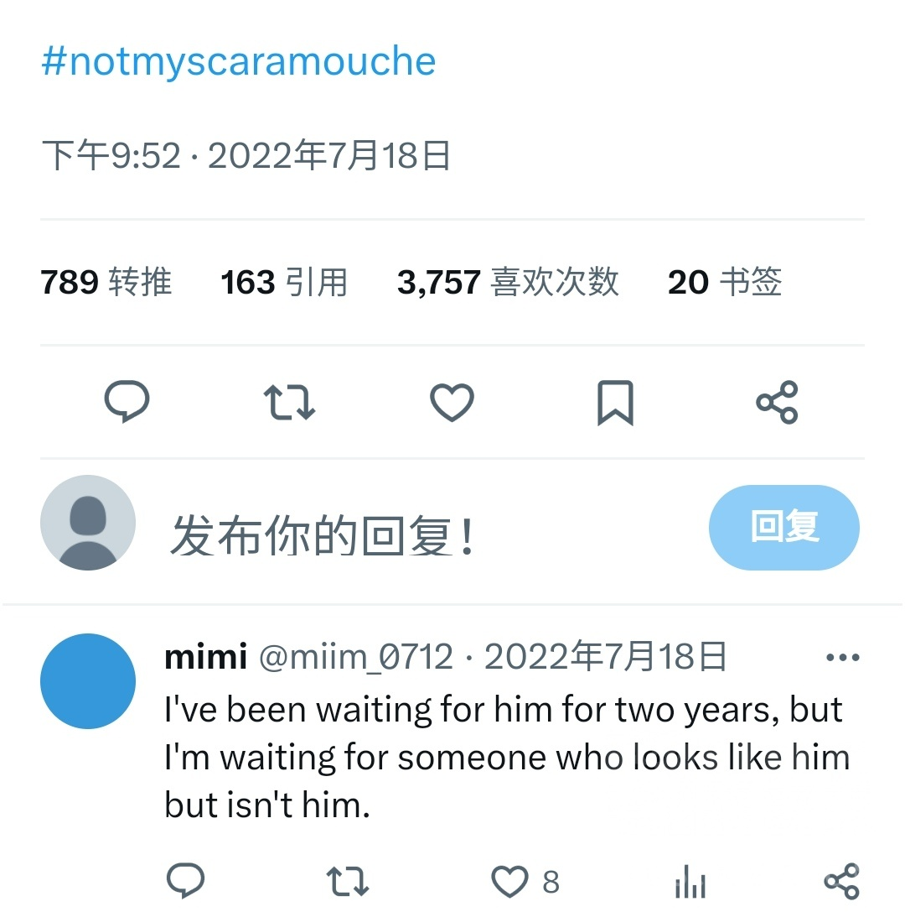
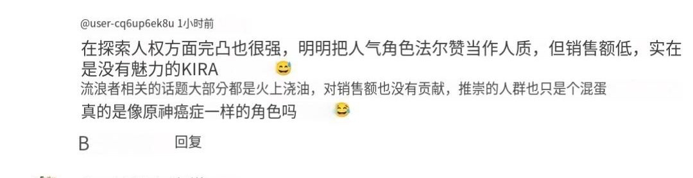

### [不吐不快] 理查多少人知道3.3当时在外网闹的也挺大的

Made by ngapost2md (c) ludoux [GitHub Repo](https://github.com/ludoux/ngapost2md)

----

##### 0.[2] \<pid:0\> 2023-07-28 11:32:39 by 落穹千刃
要我说的话，散兵写烂和海哥麦麸事件已经是结成草种子了，然后迪希雅事件是压倒欧美玩家的最后一根稻草，彻底引爆了草种子

快8月时外网就听说了3.3的爆料，大部分欧美的愚人众厨和散厨第一反应是：

noooooo！！！

notmyscaramouche这个tag当天就上了热搜，里面一群执行官粉发表感想：等了2年，就这？就这？

有个(当时)粉丝还不算多的油土鳖的up主下场总结了一下为什么大家不接受外观改变和剧情写烂的理由，评论区也是一群执行官厨和散厨囔囔着退坑

----

##### 1.[2] \<pid:705423768\> 2023-07-28 11:35:44 by 世事苍茫成云烟
结晶：“我们原神在海外依旧受欢迎，每次更新都会~~登顶~~，~~榜单前十~~，榜单有名”

----

##### 2.[0] \<pid:705423783\> 2023-07-28 11:35:48 by 老虎二世
人家欧美玩家真的就退坑不玩不氪了，国内…我不好说

----

##### 3.[4] \<pid:705424065\> 2023-07-28 11:36:57 by 落穹千刃
只能说米忽悠确实懂得什么是踩雷，不光把国内玩家的雷都踩了一遍，还在外网玩家的雷区上使劲蹦迪

----

##### 4.[0] \<pid:705424220\> 2023-07-28 11:37:40 by 再也不随意注销了
根据我在fgo喜欢的反派来看，就从我自己的角度，我觉得喜欢反派的人宁愿看到他成为败犬也不愿意看到他变成清清白白小白花吧

----

##### 5.[0] \<pid:705424232\> 2023-07-28 11:37:44 by UID3563849
以前次次登顶确实能吹
现在前十都吹不起来了

----

##### 6.[0] \<pid:705424259\> 2023-07-28 11:37:50 by imCaigz
>[jump](#pid705423768) 世事苍茫成云烟(2023-07-28 11:35)说:
>结晶：“我们原神在海外依旧受欢迎，每次更新都会<del class='gray'> 登顶 </del>，<del class='gray'> 榜单前十 </del>，榜单有名”[s:ac:茶]

我们原神在外网是pc游戏，爆杀移动端2倍，爆杀苹果3倍

蒸么？你不服气，不服气你也充钱给b站，让叔叔把水军都删了啊

----

##### 7.[0] \<pid:705424362\> 2023-07-28 11:38:15 by muziqiduan
原神能火因为全世界在这个全球化的消费时代，文娱品味其实都差不多。。
所以国内觉得不对的，欧美老外也不会觉得很好，只是一般比较含蓄不会直接掀桌喷而已。

----

##### 8.[1] \<pid:705424400\> 2023-07-28 11:38:23 by 铁观音奶冻家军
感觉只有贵米的游戏内容是做出来满足自己的，
确实和其他公司不太一样，
碰见leader是个脑瘫就完全没得救了

----

##### 9.[0] \<pid:705424452\> 2023-07-28 11:38:37 by 木有山兮
知道啊，毕竟也是天天逛推特的，但是结晶们嘴巴是真的硬，堵嘴的功力更是厉害

----

##### 10.[1] \<pid:705424558\> 2023-07-28 11:39:07 by 江右商帮
看美服这次池子是22名就知道了，创了原神池子新低

----

##### 11.[3] \<pid:705424773\> 2023-07-28 11:39:59 by 落穹千刃
>[jump](#pid705424220) 再也不随意注销了(2023-07-28 11:37)说:
>根据我在fgo喜欢的反派来看，就从我自己的角度，我觉得喜欢反派的人宁愿看到他成为败犬也不愿意看到他变成清清白白小白花吧[s:ac:哭笑]

是的，迪希雅事件时国内结晶还骂欧美玩家不够宽容，虽然我也挺讨厌欧美玩家的氛围，但是他们其实也是忍了米忽悠很久很久了，一次次踩雷别人怎么还陪你过家家

----

##### 12.[0] \<pid:705425036\> 2023-07-28 11:41:03 by 唔於
>[jump](#pid705424452) 木有山兮(2023-07-28 11:38) 说: 
>
>知道啊，毕竟也是天天逛推特的，但是结晶们嘴巴是真的硬，堵嘴的功力更是厉害

外面也有结晶堵嘴啊，总不能也是mvb吧

----

##### 13.[0] \<pid:705425829\> 2023-07-28 11:44:16 by muziqiduan
>[jump](#pid705424773) 落穹千刃(2023-07-28 11:39) 说: 
>
>是的，迪希雅事件时国内结晶还骂欧美玩家不够宽容，虽然我也挺讨厌欧美玩家的氛围，但是他们其实也是忍了米忽悠很久很久了，一次次踩雷别人怎么还陪你过家家

不是，这事情是宽容不宽容的问题么，身份标签是跟人一辈子的东西，你把人身份标签，还是肤色加移民双重标签拿起来踩，这梁子结下了是一辈子不死不休的，毕竟二次元老婆可以换，身份这辈子标签永远是这些。

----

##### 14.[0] \<pid:705425896\> 2023-07-28 11:44:31 by 落穹千刃
>[jump](#pid705425036) 唔於(2023-07-28 11:41)说:
>[quote][pid=705424452,37168582,1]Reply[/pid] <b>Post by [uid=61250019]木有山兮[/uid] (2023-07-28 11:38):</b>  知道啊，毕竟也是天天逛推特的，但是结晶们嘴巴是真的硬，堵嘴的功力更是厉害[s:ac:哭笑][/quote]外面也有结晶堵嘴啊，总不能也是mvb吧

我说句实话，迪希雅事件后，确实外网玩家里护着米忽悠的越来越多了

----

##### 15.[0] \<pid:705425977\> 2023-07-28 11:44:50 by EWSCHNEE
“我等了他两年，结果我等到的他不是我喜欢的他”

跟雷散厨异曲同工啊

----

##### 16.[0] \<pid:705426267\> 2023-07-28 11:46:09 by 一颗魔法螺丝
>[jump](#pid705425036) 唔於(2023-07-28 11:41)说:
>[quote][pid=705424452,37168582,1]Reply[/pid] <b>Post by [uid=61250019]木有山兮[/uid] (2023-07-28 11:38):</b>  知道啊，毕竟也是天天逛推特的，但是结晶们嘴巴是真的硬，堵嘴的功力更是厉害[s:ac:哭笑][/quote]外面也有结晶堵嘴啊，总不能也是mvb吧

同一个公司，同样的营销手法，同样的商单
你为什么觉得不能养出同样的结晶

----

##### 17.[0] \<pid:705426389\> 2023-07-28 11:46:41 by 落穹千刃
>[jump](#pid705425829) muziqiduan(2023-07-28 11:44)说:
>[quote][pid=705424773,37168582,1]Reply[/pid] <b>Post by [uid=65208717]落穹千刃[/uid] (2023-07-28 11:39):</b>  是的，迪希雅事件时国内结晶还骂欧美玩家不够宽容，虽然我也挺讨厌欧美玩家的氛围，但是他们其实也是忍了米忽悠很久很久了，一次次踩雷别人怎么还陪你过家家[/quote][s:a2:冷笑]不是，这事情是宽容不宽容的问题么，身份标签是跟人一辈子的东西，你把人身份标签，还是肤色加移民双重标签拿起来踩，这梁子结下了是一辈子不死不休的，毕竟二次元老婆可以换，身份这辈子标签永远是这些。

结晶是这样的，他们的反应是：不就做烂了一个迪希雅吗，你们不能玩别的强力角色？矫情

----

##### 18.[0] \<pid:705426528\> 2023-07-28 11:47:14 by Aster7
小日子瑞萍散兵流水，简单机翻

----

##### 19.[0] \<pid:705426642\> 2023-07-28 11:47:43 by 一颗魔法螺丝
>[jump](#pid705425896) 落穹千刃(2023-07-28 11:44)说:
><b>Reply to [pid=705425036,37168582,1]Reply[/pid] Post by [uid=64661581]唔於[/uid] (2023-07-28 11:41)</b>  我说句实话，迪希雅事件后，确实外网玩家里护着米忽悠的越来越多了[s:ac:哭笑]

成功提纯确信
想都不用想肯定有外服的结晶话术：就只有mhy会出不zzzq的角色了

结果马上就是()

----

##### 20.[0] \<pid:705427285\> 2023-07-28 11:50:27 by 沙漏和gsx
>[jump](#pid705425896) 落穹千刃(2023-07-28 11:44) 说: 
>
>我说句实话，迪希雅事件后，确实外网玩家里护着米忽悠的越来越多了

玩家都跑了，还留着的只有结晶了

----

##### 21.[0] \<pid:705427367\> 2023-07-28 11:50:51 by lazurita
>[jump](#pid705426528) Aster7(2023-07-28 11:47) 说: 
>
>小日子瑞萍散兵流水，简单机翻
>
>

把珐露姗当人质

----

##### 22.[0] \<pid:705427436\> 2023-07-28 11:51:11 by 木有山兮
>[jump](#pid705426642) 一颗魔法螺丝(2023-07-28 11:47) 说: 
>
>成功提纯确信
>想都不用想肯定有外服的结晶话术：就只有mhy会出不zzzq的角色了
>
>结果马上就是()

讲道理，这波提纯有点亏啊，欧美流水几乎崩盘就换来这点结晶值得吗

----

##### 23.[0] \<pid:705427683\> 2023-07-28 11:52:13 by bluebayouplus
原神英语区在3.0其实就已经开始衰退了，也不止散兵这件事，这些图那是在2.8夏天。到12月3.3实装的时候英语区早就凉一大半了，无论是骂的还是夸的都不多。抱怨剧情的关键字更多在于bad redemption。

----

##### 24.[0] \<pid:705427983\> 2023-07-28 11:53:31 by 冰川真琴
>[jump](#pid705426528) Aster7(2023-07-28 11:47):

癌症是由于机体细胞失去正常调控, 过度增殖而引起的疾病。过度增殖的细胞称癌细胞，癌细胞常可侵犯周围组织(浸润，invasion), 甚至可经体内循环系统和/或淋巴系统转移到身体其他部分(癌症转移)。

HY这种损害正常角色垫另一个角色的塑造法，确实是癌症，不仅剧情，深渊和怪物拉踩也是。

----

##### 25.[0] \<pid:705428135\> 2023-07-28 11:54:09 by 碎月翩跹
米菌国内的尖叫抓挠要看，国外的尖叫抓挠也要看

----

##### 26.[0] \<pid:705428136\> 2023-07-28 11:54:09 by ky446
说句老实话欧美能火很大原因是因为原神免费+手机就能玩还有一定的疫情原因，然鹅现在呢？

原神其实已经是越来越贵了，从抽角色变成抽角色+专武+辅助角色，难道玩家都是瞎子和傻子真看不出来老米的小心思啊

现在能有一台玩原神30分钟不烫手的手机可以说屈指可数，而且电脑都时不时卡顿和掉帧，玩起来都不爽

最后疫情就不用多说了吧，几年没有比较好玩的游戏，今年都开始不停回归了，而且游戏越来越多，玩家可以选择的游戏变多了，原神就不再是他们想玩的了

最后再说一句：欧美玩家连他们自己家的ZZZQ游戏和电影都不卖单，怎么可能卖你个二次元游戏的？

----

##### 27.[0] \<pid:705428284\> 2023-07-28 11:54:48 by 落穹千刃
>[jump](#pid705427683) bluebayouplus(2023-07-28 11:52)说:
>原神英语区在3.0其实就已经开始衰退了，也不止散兵这件事，这些图那是在2.8夏天。到12月3.3实装的时候英语区早就凉一大半了，无论是骂的还是夸的都不多。抱怨剧情的关键字更多在于bad redemption。

都已经开始衰退了，不仅不想办法挽救，还要猛踩油门加速

----

##### 28.[0] \<pid:705428441\> 2023-07-28 11:55:28 by EWSCHNEE
说起来我想不明白为什么外网还有结晶

什么成分啊

----

##### 29.[0] \<pid:705429698\> 2023-07-28 12:01:10 by 木有山兮
>[jump](#pid705428441) EWSCHNEE(2023-07-28 11:55) 说: 
>
>说起来我想不明白为什么外网还有结晶
>
>什么成分啊

别是官方套皮下场吧，当年yys有类似操作，勾起我不好的回忆了

----

##### 30.[0] \<pid:705430110\> 2023-07-28 12:02:59 by ANUBlS
>[jump](#pid705428441) EWSCHNEE(2023-07-28 11:55) 说: 
>
>说起来我想不明白为什么外网还有结晶
>
>什么成分啊

有些人只因为原神是所谓免费游戏就恨不得供起来
他们那边好玩的游戏大部分都是付费购买的，大部分免费能玩到游戏水平可能比国内页游还不如
对原自然是含在嘴里怕化了

----

##### 31.[0] \<pid:705431362\> 2023-07-28 12:08:43 by 落穹千刃
>[jump](#pid705428441) EWSCHNEE(2023-07-28 11:55)说:
>说起来我想不明白为什么外网还有结晶[s:a2:不明觉厉]  什么成分啊

迪希雅事件后红迪和汤不热护着米忽悠的越来越多了……额我不好说

----

##### 32.[1] \<pid:705432884\> 2023-07-28 12:15:58 by bluebayouplus
>[jump](#pid705428284) 落穹千刃(2023-07-28 11:54) 说: 
>
>都已经开始衰退了，不仅不想办法挽救，还要猛踩油门加速

英语区对剧情的不满更多纠结于为什么要让散兵“being good terms with traveler”，认为剧情糟糕的原因在于强行让散兵redemption导致故事非常白烂，感觉和中文区还是有点区别的

----

##### 33.[1] \<pid:705432933\> 2023-07-28 12:16:13 by 寅房苏卯包巫
避免被找到社交账号匿了，我3.5的时候说卡维定位很怪外网口味清奇(原话更委婉，没攻击谁)的才会特别爱卡维这个塑造，因为我经常刷外网知道那边酗酒+心理疾病是个很国情的点，这都不是卖不卖cp的问题，结果被找上门刷图控评骂我不懂外语不懂卡维的好外网都是好评(这些倒是原话，呃)，我就知道原整这些娱乐圈饭圈迟早要完蛋

----

##### 34.[0] \<pid:705433282\> 2023-07-28 12:17:59 by 花瓣飘零
>[jump](#pid705423783) 老虎二世(2023-07-28 11:35):

国内买的商单更多，控评推广更花钱，一份付出一分收获嘛，还是有被骗进来的

----

##### 36.[0] \<pid:705433991\> 2023-07-28 12:21:09 by 花瓣飘零
>[jump](#pid705427683) bluebayouplus(2023-07-28 11:52)说:
>原神英语区在3.0其实就已经开始衰退了，也不止散兵这件事，这些图那是在2.8夏天。到12月3.3实装的时候英语区早就凉一大半了，无论是骂的还是夸的都不多。抱怨剧情的关键字更多在于bad redemption。

但是会用推特热度说事，不过我看了一下推热度确实高，动不动几十k点赞，这哪有这么多人吗，转发倒是比微博热门低，一般是2k-4k多

----

##### 37.[0] \<pid:705434509\> 2023-07-28 12:23:34 by Cloudrapid133
每次说原神在去宅化，拥抱真·一般向的时候我都想拿迪希雅的强度和执行官的塑造来狠狠打脸
大众对反派的品位、对主流价值观角色的喜好、对真·多元化差异化的追求其实中外都差不多(最多在对黑皮的态度方面有所差别)，所以这根本就不是原神现在的方向
原神现在在做的是男女混厕，是小众细分化宅向，媚的都是那种会“尖叫抓挠”的那批人，要么就是从这批人里养蛊提取公司厨。

----

##### 38.[0] \<pid:705435336\> 2023-07-28 12:27:34 by 我冲我自己
>[jump](#pid705432933) 寅房苏卯包巫(2023-07-28 12:16) 说: 
>
>避免被找到社交账号匿了，我3.5的时候说卡维定位很怪外网口味清奇(原话更委婉，没攻击谁)的才会特别爱卡维这个塑造，因为我经常刷外网知道那边酗酒+心理疾病是个很国情的点，这都不是卖不卖cp的问题，结果被找上门刷图控评骂我不懂外语不懂卡维的好外网都是好评(这些倒是原话，呃)，我就知道原整这些娱乐圈饭圈迟早要完蛋

说起来，我有见过洋妞说卡维是跨性别女性只能说这很难评，我祝她们成功吧

----

##### 39.[0] \<pid:705435837\> 2023-07-28 12:30:09 by bluebayouplus
>[jump](#pid705433991) 花瓣飘零(2023-07-28 12:21) 说: 
>
>但是会用推特热度说事，不过我看了一下推热度确实高，动不动几十k点赞，这哪有这么多人吗，转发倒是比微博热门低，一般是2k-4k多

点赞高因为人多，英语区是面向所有英语群众的，不仅有欧美，还有东南亚，南美(西语)这些，只是他们不用英语讨论的时候大家看不到
英语区的社交除了推特，还会集中在更封闭的discord，discord最大原神社区雷神mains，相比巅峰时期同时在线人数降了能有三分之二吧，反正凉凉，均摊到具体角色身上就更少了。

----

##### 40.[0] \<pid:705437010\> 2023-07-28 12:35:52 by renjianhualaozi
>[jump](#pid705426389) 落穹千刃(2023-07-28 11:46) 说: 
>
>结晶是这样的，他们的反应是：不就做烂了一个迪希雅吗，你们不能玩别的强力角色？矫情

结晶应该搬出李猛干编剧的经典语录

----

##### 41.[0] \<pid:705437627\> 2023-07-28 12:39:03 by 落穹千刃
>[jump](#pid705432884) bluebayouplus(2023-07-28 12:15):

的确，他们主要吐槽点在于剧情设定前后矛盾和米家对反派的洗白一坨翔，他们对冲树也是有意见的，只不过反应是比国内小一点

现在欧美的原学家大部分也淡游了，当时还有个老哥的万赞推是：世界树这玩意原来大家都可以进的吗？

----

##### 43.[1] \<pid:705438589\> 2023-07-28 12:43:38 by 落穹千刃
>[jump](#pid705437010) renjianhualaozi(2023-07-28 12:35)说:
>[quote][pid=705426389,37168582,1]Reply[/pid] <b>Post by [uid=65208717]落穹千刃[/uid] (2023-07-28 11:46):</b>  结晶是这样的，他们的反应是：不就做烂了一个迪希雅吗，你们不能玩别的强力角色？矫情[/quote]结晶应该搬出李猛干编剧的经典语录[s:ac:哭笑]

结晶要是知道猛兄骂他们op会怎么想

----

##### 44.[0] \<pid:705444019\> 2023-07-28 13:11:27 by cecial
>[jump](#pid705428441) EWSCHNEE(2023-07-28 11:55) 说: 
>
>说起来我想不明白为什么外网还有结晶
>
>什么成分啊

这个就很神奇，捂嘴方式和国内一样

----

##### 45.[0] \<pid:705445532\> 2023-07-28 13:19:47 by qfxxldrqbcmz
>[jump](#pid705432933) 寅房苏卯包巫(2023-07-28 12:16) 说: 
>
>避免被找到社交账号匿了，我3.5的时候说卡维定位很怪外网口味清奇(原话更委婉，没攻击谁)的才会特别爱卡维这个塑造，因为我经常刷外网知道那边酗酒+心理疾病是个很国情的点，这都不是卖不卖cp的问题，结果被找上门刷图控评骂我不懂外语不懂卡维的好外网都是好评(这些倒是原话，呃)，我就知道原整这些娱乐圈饭圈迟早要完蛋

不了解外网爱好纯好奇，为什么说这个很国情的点会让卡维受众清奇啊

----

##### 46.[0] \<pid:705445807\> 2023-07-28 13:21:17 by 白菊 ほたる
不是环国内好评，环nga米游社好评嘛，尊重就完事了，我们只是信息茧房呢

----

##### 47.[0] \<pid:705447537\> 2023-07-28 13:30:41 by 樱木花kun
国外又不缺游戏玩，而且也没像文输，国产之光这些场外因素，更不吃你技术宅理工男这一套，伺候不好他们他们真的说退就退。

----

##### 48.[0] \<pid:705449649\> 2023-07-28 13:42:27 by 泛舟浮白
>[jump](#pid705424220) 再也不随意注销了(2023-07-28 11:37) 说: 
>
>根据我在fgo喜欢的反派来看，就从我自己的角度，我觉得喜欢反派的人宁愿看到他成为败犬也不愿意看到他变成清清白白小白花吧

反正我个人一眼看上或者欣赏的反派我都希望跟TA周本见或者落得个不得好死的结局~~然后尽情欣赏美妙的战损~~

----

##### 49.[0] \<pid:705451856\> 2023-07-28 13:54:08 by nxt3510871
唉，米哈游

----

##### 50.[0] \<pid:705452089\> 2023-07-28 13:55:14 by ggt12
知道啊，Gayshit Impact又不是国内先叫的。

----

##### 51.[0] \<pid:705455657\> 2023-07-28 14:14:18 by 寅房苏卯包巫
>[jump](#pid705445532) qfxxldrqbcmz(2023-07-28 13:19) 说: 
>
>不了解外网爱好纯好奇，为什么说这个很国情的点会让卡维受众清奇啊

当地文化不是一两句说的清的，简单来说美国推行过禁酒令而且至今在法规上对未成年饮酒严控(实际执行就，呃呃)，法律都是滞后的对社会问题的响应，从这个角度可以快速感受酗酒是多大面积的问题了吧。从酗酒衍生的家庭关系扭曲和心理问题都能养活一大堆社科医学人了
举这个例子只是为了说明国内外信息差导致的茧房和被茧房养出来的饭圈认知作战模式

----

##### 52.[0] \<pid:705459826\> 2023-07-28 14:35:09 by jasmine4869
就算喜欢反派也不喜欢小丑

----

##### 53.[0] \<pid:705461378\> 2023-07-28 14:42:54 by szqiyimu
>[jump](#pid705445532) qfxxldrqbcmz(2023-07-28 13:19) 说: 
>
>不了解外网爱好纯好奇，为什么说这个很国情的点会让卡维受众清奇啊

我的理解是，酗酒和心理疾病很多时候和家暴有关的
基本上给人的画面就是那种无能+犯罪+虐待家人的人，你说自己哈草可能都比酗酒加精神疾病形象好一些

----

##### 54.[0] \<pid:705461662\> 2023-07-28 14:44:24 by 爱丽丝茶友会
>[jump](#pid705424220) 再也不随意注销了(2023-07-28 11:37) 说: 
>
>根据我在fgo喜欢的反派来看，就从我自己的角度，我觉得喜欢反派的人宁愿看到他成为败犬也不愿意看到他变成清清白白小白花吧

伽摩:报我名字算了

----

##### 56.[0] \<pid:705462485\> 2023-07-28 14:48:22 by tdcr
我当初还真被它们唬住了，真以为外国人不在乎这个

----

##### 57.[0] \<pid:705463998\> 2023-07-28 14:56:18 by szqiyimu
>[jump](#pid705462277) 厉害费多大劲(2023-07-28 14:47) 说: 
>
>大概就类似于出个摇花手的厌学鬼火少年，家里设定还有三个姐姐辍学打工
>你说有人怜爱吗？那肯定有人怜爱，但大众确实吃不了这口饭

不不不，你说的这种大概在美国这边是辍学少年，其实还好了
酗酒+心理问题下一步就是家暴了，是人品问题，价值观问题。比什么鬼火少年家里有辍学妹妹这种纯经济导致的问题严重多了

----

##### 58.[0] \<pid:705467805\> 2023-07-28 15:15:04 by 我爱吃斯内克
我也感觉欧美还是画执行官多，日韩就比较喜欢流

----

##### 59.[0] \<pid:705469505\> 2023-07-28 15:23:10 by 炒鸡内金
>[jump](#pid705428441) EWSCHNEE(2023-07-28 11:55) 说: 
>
>说起来我想不明白为什么外网还有结晶
>
>什么成分啊

游戏糊了，结晶自然就多了

----

##### 60.[0] \<pid:705495743\> 2023-07-28 17:24:40 by 甲叶
>[jump](#pid705445532) qfxxldrqbcmz(2023-07-28 13:19) 说: 
>
>不了解外网爱好纯好奇，为什么说这个很国情的点会让卡维受众清奇啊

我这么给你说，因为禁酒令以及严禁青少年饮酒等问题，导致酒这个东西在北美的象征性和暗示性比国内强很多

不知道你有没有看过一个美剧，《成瘾计量》，讲普渡公司卖奥施康定的(实际上就是合法贩毒)，里面在后期有一幕是一个工人家庭的女儿嗑药死了以后。这个女儿的医生(也是给这个女儿开药导致她走上毒品嗑药道路的人，虽然本身是个好人，开药的时候也不知道这个是毒)去这个家庭道歉。后来走的时候这个家里的爸爸看着医生离去的背影拿出来一个酒瓶喝了一口(这个爸爸本来是不喝酒的)。

这一幕要是放在国内，大家多半会觉得没啥感觉对吧？工人家庭出身的中年男人喝酒会是什么稀罕事情呢？但是在北美那边，由于酗酒和相关家庭问题很多，这就是暗示性很强的一幕(你可以理解为类似在国产剧里面有人家里人死后去嗑药那种)，可以说基本上就是暗示家破人亡那种。

所以喝酒这种行为在中美的意义完全不同(就好像嗑药在中美的意义也完全不同一样，只不过喝酒是”中轻美重”，嗑药是“中重美轻”)

----

##### 61.[0] \<pid:705521653\> 2023-07-28 19:49:40 by 纠缠的狗
>[jump](#pid705423768) 世事苍茫成云烟(2023-07-28 11:35) 说: 
>
>结晶：“我们原神在海外依旧受欢迎，每次更新都会~~登顶~~，~~榜单前十~~，榜单有名”

老哥，3.3怎么了？我当时退了半年

----

##### 62.[0] \<pid:705521843\> 2023-07-28 19:50:52 by 纠缠的狗
>[jump](#pid0) 落穹千刃(2023-07-28 11:32) 说: 
>
>要我说的话，散兵写烂和海哥麦麸事件已经是结成草种子了，然后迪希雅事件是压倒欧美玩家的最后一根稻草，彻底引爆了草种子
>
>快8月时外网就听说了3.3的爆料，大部分欧美的愚人众厨和散厨第一反应是：
>
>noooooo！！！
>
>notmyscaramouche这个tag当天就上了热搜，里面一群执行官粉发表感想：等了2年，就这？就这？
>
>有个(当时)粉丝还不算多的油土鳖的up主下场总结了一下为什么大家不接受外观改变和剧情写烂的理由，评论区也是一群执行官厨和散厨囔囔着退坑
>
>
>[img]./mon_20230

又是老哥你

----

##### 63.[0] \<pid:705521950\> 2023-07-28 19:51:34 by 不想上班999号
>[jump](#pid705521653) 纠缠的狗(2023-07-28 19:49) 说: 
>
>老哥，3.3怎么了？我当时退了半年

岁月史树啊

----

##### 64.[0] \<pid:705523357\> 2023-07-28 20:00:02 by Lilith330
>[jump](#pid705428441) EWSCHNEE(2023-07-28 11:55) 说: 
>
>说起来我想不明白为什么外网还有结晶
>
>什么成分啊

我外国朋友给我发的图，原话是“typical genshin player”  细品上面的要素

----

##### 65.[0] \<pid:705524482\> 2023-07-28 20:07:00 by LU&#39;&#39;
>[jump](#pid705523357) Lilith330(2023-07-28 20:00) 说: 
>
>我外国朋友给我发的图，原话是“typical genshin player”  细品上面的要素
>
>

9岁的trans？？lgbt真的从娃娃抓起啊

----

##### 66.[0] \<pid:705524685\> 2023-07-28 20:08:18 by 魑魅魍魉魖魌
>[jump](#pid705461378) szqiyimu(2023-07-28 14:42) 说: 
>
>我的理解是，美国这边酗酒和心理疾病很多时候和家暴有关的
>基本上给人的画面就是那种无能+犯罪+虐待家人的人，是大量社会问题的祸根，美国21岁才能买酒，但是18岁就可以买步枪酒的负面形象太深了。
>你说自己哈草可能都比酗酒加精神疾病形象好一些

啊这，这可真是美国特色国情了

----

##### 67.[0] \<pid:705530491\> 2023-07-28 20:47:02 by 狐狸吃团子
就是雷散变风散的节奏啊，对洋妞来说就是换了个人，不是她们等了很久的Scaramouche，她们脑子里的反派scara除了雷系不可能是其他的，不过风散出来很快也就没声了，不知道跑了还是接受了，反正疯还是疯的
这也涉及到自欺欺人的心理问题，不想承认自己厨的角色被大改了，大改意味着mhy对之前那个铺垫很久的角色不尊重不在意，她们不想自己厨了个不被在意的反派，所以叫两声也就过去了，就像剧情漏洞百出玩家想办法补得合理一样，结果不被在意的换了身衣服成了老米特别在意的，她们又高兴了

----

##### 68.[0] \<pid:705532929\> 2023-07-28 21:03:23 by 大a加油
当时迪姐节奏我直接闭麦，不好意思洗地
据我了解，酗酒在老美约等于在东大磕粉

