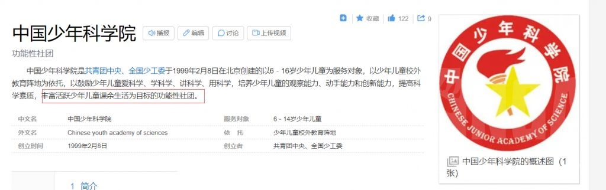

### [热点事件] 为什么只有米是技术宅公司人设？

Made by ngapost2md (c) ludoux [GitHub Repo](https://github.com/ludoux/ngapost2md)

----

##### 0.[0] \<pid:0\> 2023-07-28 12:50:16 by 格兰登
马化腾  深圳大学  计算机及应用
李彦宏  北京大学  信息管理
张朝阳  清华大学  物理系
雷军     武汉大学  理学学士学位
周鸿祎  西安交通大学  电信学院计算机系
任正非  重庆建筑工程学院(已并入重庆大学

天天吹米哈游三巨头是理工生，搞不懂这有什么好吹的

另外：
关于蔡老板的
中国少年科学院小院士 ≠ 少年中国科学院院士
前面一个是共青团颁的奖，和后面哪个相比根本没有含金量，研究的目的就是鼓励小朋友多动手，培养兴趣爱好。

而且就算是这样，当时的条件下，蔡老板的父母可以给他提供最好的电脑，但其他小朋友可能连电脑都没见过。

最后的最后：
就算他小时候可能有科技梦想，现在也是一个飙豪车的大土鳖而已

----

##### 1.[1] \<pid:705441825\> 2023-07-28 12:59:48 by 格兰登
十岁就评为中科院院士的人，会有机会读上交大吗？

----

##### 2.[1] \<pid:705442215\> 2023-07-28 13:01:43 by roseta
饭圈凹人设是这样的，善战者无赫赫之名

----

##### 4.[0] \<pid:705442350\> 2023-07-28 13:02:27 by wzdlc
张朝阳甚至是mit的物理博士

----

##### 5.[0] \<pid:705443100\> 2023-07-28 13:06:34 by 叶公好龙娘
学历问题参照张雪峰
他刚刚火起来的时候也一直被质疑
但是后来大家发现
就算小学文化和你说不要报土木也是正确的

人设和实际结果

----

##### 6.[0] \<pid:705443138\> 2023-07-28 13:06:47 by 千歌12345
技不技术不重要，重要的是“宅”，米桑显然是想营销一个和广大宅男站在统一战线的二次元公司形象

----

##### 7.[0] \<pid:705443426\> 2023-07-28 13:08:18 by lly0571
就你这些例子而言，百度和小米都尝试树立过技术宅人设，小米最早的口号甚至是“为发烧而生”，然而二者现在的舆论评价大家都看到了。
真正的问题是：为什么米能<b>维持</b>技术宅人设。

----

##### 8.[0] \<pid:705443562\> 2023-07-28 13:09:04 by 格兰登
>[jump](#pid705443138) 千歌12345(2023-07-28 13:06) 说: 
>
>技不技术不重要，重要的是“宅”，米桑显然是想营销一个和广大宅男站在统一战线的二次元公司形象

哈哈哈，哎哟，嘿嘿嘿i

----

##### 9.[0] \<pid:705443672\> 2023-07-28 13:09:41 by 玩c罗玩的
缺什么就越要强调什么

----

##### 10.[0] \<pid:705443716\> 2023-07-28 13:09:55 by 今锁朱楼
这几个比较有自知之明吧，对自己资本家的屁股非常坦诚

----

##### 11.[0] \<pid:705444404\> 2023-07-28 13:13:19 by lollipopx
丁三石电子科大也不妨碍他养猪

----

##### 12.[0] \<pid:705444877\> 2023-07-28 13:16:04 by 黑眼睛的银白色暴风雪
而且蔡老板的技术实力甚至不配给雷军提鞋

----

##### 13.[0] \<pid:705445160\> 2023-07-28 13:17:47 by LEAVENED
百度虽然烂到透顶，但李彦宏发明的超链分析是现代搜索引擎的基石之一，含金量非常高

----

##### 14.[0] \<pid:705445386\> 2023-07-28 13:19:01 by 樱木花kun
感觉米哈游更像偶像宅。

----

##### 15.[2] \<pid:705446086\> 2023-07-28 13:22:57 by 纳西妲真太可爱了
就跟饭圈明星硬凹学霸人设一样呗，越缺啥越想凹

----

##### 16.[0] \<pid:705446426\> 2023-07-28 13:24:55 by Bauhaus的大豪斯
想起来之前还有人拿mhy的利润和小米的利润做比较在对社会影响的层面上，恐怕mhy给小米提鞋都不配

----

##### 17.[0] \<pid:705447097\> 2023-07-28 13:28:27 by 右手边03
这就和某女星解个二元一次方程就被成为学霸差不多，或者说上交在饭圈里确实算可以吹的啦，和别的技术公司路线又不同，10亿人的虚拟网络 含金量。

----

##### 18.[0] \<pid:705449173\> 2023-07-28 13:39:55 by 暗之铃音
>[jump](#pid705444404) lollipopx(2023-07-28 13:13) 说: 
>
>丁三石电子科大也不妨碍他养猪

你对网易口碑最好的商品有什么不满吗

----

##### 19.[0] \<pid:705449669\> 2023-07-28 13:42:32 by ggt12
雷军一直也是这个人设吧？只是小米手机开屏不给你来个“技术宅拯救世界”的开屏语音。

----

##### 20.[0] \<pid:705449928\> 2023-07-28 13:43:53 by write54
不是自己说的吗

----

##### 21.[0] \<pid:705450328\> 2023-07-28 13:46:03 by Sigmoni
隔壁yj最纯的时候也喜欢吹rua牛上交毕业noi银牌小兵能实时更新最短路都拿来吹。滤镜碎掉之后发现甚至还没和unity的图层和解

只能说手游饭圈的套路都是相通的，要知道你消费的是产品和服务而不是制作人

----

##### 22.[0] \<pid:705451222\> 2023-07-28 13:50:40 by 扭曲虚空之触
第一次打开崩坏3，看见“技术宅拯救世界”，我的心情是emmmm……的，因为我记得崩坏1什么样。

一个FLASH水平的横板卷轴清版游戏，数据一坨粪必须充值，文案属于“文青式二次元”，充值系统骗傻子(这点我太年轻了，傻子的钱真是好赚，我也是真的傻，当时网页游戏氪金系统刚开始流行)。

----

##### 23.[0] \<pid:705453608\> 2023-07-28 14:03:39 by zjp198893
还是吹g胖不会错，人家是真技术大佬

----

##### 24.[0] \<pid:705453726\> 2023-07-28 14:04:15 by 剑筑师と書記官
放心，真正的技术宅，恐怕是mhy决定裁员的时候第一批被清退的老东西

----

##### 25.[0] \<pid:705454557\> 2023-07-28 14:08:38 by 谢谢我不喝
说个不好听的，只要不是纯投资不参与，那哪家互联网不是技术人员，甚至广义的宅啊
拿这个营销在当年也就打一打跟风的煤老板，谁真信那就得笑了

----

##### 26.[0] \<pid:705455319\> 2023-07-28 14:12:28 by Seeyoupelos
这就是个二次元梗，当年Nico做mmd的不少打技术宅拯救世界的tag

