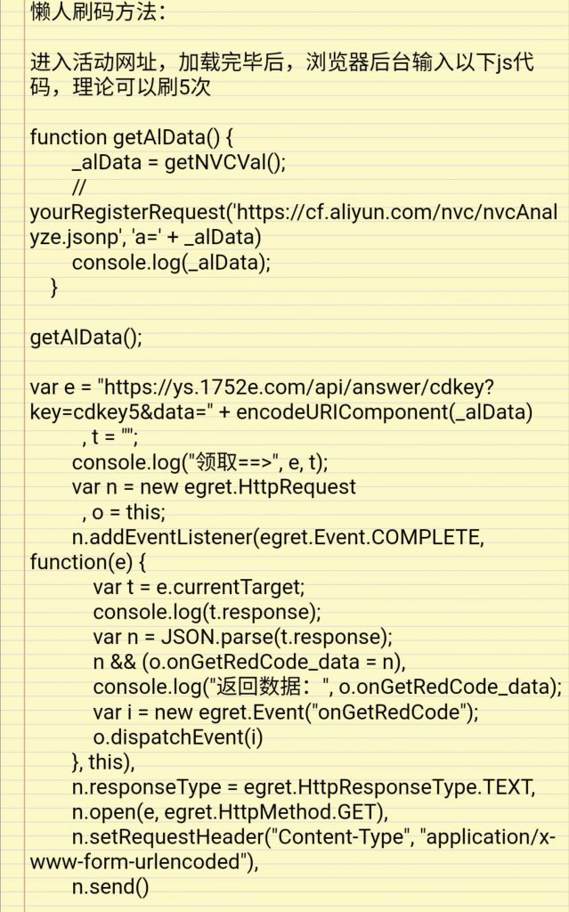

### [热点事件]关于原的网页活动，请问一下各位前端大佬

Made by ngapost2md (c) ludoux [GitHub Repo](https://github.com/ludoux/ngapost2md)

----

##### 0.[0] \<pid:0\> 2023-07-28 13:04:41 by RebbitX
本来看到主版吐槽这次网页活动做得烂还没感觉，直到看到群里有人发了通过控制台发送请求直接获取礼包码的代码，就实在绷不住了。
想问问各位前端大牛，实际开发流程中，如何避免这种情况的发生？混淆加密应该有一定作用吧？除此之外还有其他手段吗？

----

##### 1.[0] \<pid:705455707\> 2023-07-28 14:14:36 by 咕咕Phi
起 起猛了我都看到了啥 让我缓一下

----

##### 2.[0] \<pid:705455821\> 2023-07-28 14:15:10 by 冷泠棱凌
我只是个路过的马猴烧酒，话说这活动送原石吗？

----

##### 3.[2] \<pid:705456089\> 2023-07-28 14:16:30 by 塞拉斯媞娅
验证码简单有效鉴别机器人

----

##### 4.[0] \<pid:705456240\> 2023-07-28 14:17:14 by YVANLAU
肯定有啊，不然页游早死完了

----

##### 5.[0] \<pid:705459654\> 2023-07-28 14:34:23 by whiskyDJ
想避免非常简单啊，强制登录mhy通行证才能玩呗

----

##### 6.[0] \<pid:705463129\> 2023-07-28 14:51:55 by Sonymapanda
>[jump](#pid705456089) 塞拉斯媞娅(2023-07-28 14:16) 说: 
>
>验证码简单有效鉴别机器人

没用，lz图里代码第一段就是识别阿里云滑块验证的代码，看那个getaidata直接获取cf.aliyun.com/nvc结果了

----

##### 7.[1] \<pid:705464415\> 2023-07-28 14:58:24 by rr1317
不清楚这个网页活动是啥，如果是让玩家进行一定操作之后再领码，那正确做法应该是把玩家操作的每一步存给后端，领码的时候后端校验

----

##### 8.[0] \<pid:705465053\> 2023-07-28 15:01:31 by Linkle_211
dnf有个东西叫蚊子腿小助手，各种cookie设置好后能帮你把各种网页活动客户端活动里的蚊子腿奖励都领取了，几年了腾讯都没管或者说管不了，可能确实挺难管的吧

----

##### 9.[0] \<pid:705465583\> 2023-07-28 15:04:17 by 仲夏月影
最基础的方法就是每次发送请求时填写验证码, 将验证码与生成验证码的标识一起传给后端校验

----

##### 10.[0] \<pid:705473948\> 2023-07-28 15:44:15 by UID64544820
没必要搞这么复杂， 照楼上这么说， 验证码还能接入打码平台呢。
只要提高成本， 让大部分人难绕过， 再降低收益。

----

##### 11.[0] \<pid:705474076\> 2023-07-28 15:44:52 by E_FrostBlade
>[jump](#pid705465053) Linkle_211(2023-07-28 15:01) 说: 
>dnf有个东西叫蚊子腿小助手，各种cookie设置好后能帮你把各种网页活动客户端活动里的蚊子腿奖励都领取了，几年了腾讯都没管或者说管不了，可能确实挺难管的吧

米游社之前也有自动签到和米游币，后来被mhy封杀了

----

##### 12.[0] \<pid:705475372\> 2023-07-28 15:50:58 by UID64792814
很简单啊 只允许请求发送游戏数据
游戏完没完成 任务完没完成 完全后端判断
你把权限接口给前端了 别怪别人玩坏他
什么野鸡实习生写的

----

##### 13.[0] \<pid:705476099\> 2023-07-28 15:54:21 by ayase252
兑奖接口接入风控，风控了弹人机验证码

这都标准流程了，不搞会被人薅空的

----

##### 14.[0] \<pid:705477272\> 2023-07-28 15:59:46 by 吸水恶魔
正常是这样的
前端发送数据，比如活动每进行一步就发送一次，共有五步，12345
先发送1，后端拿到1之后把你这个账号相关的进度变成1。
然后发送2，后端拿到1了，判断你这个账号是否已经处于1了，是那就变成2。
直到变成5，后端把兑换码发送至前端。
如果你还没到4，直接发5后端会直接拒绝。

当然正常不会这么简单，会发送很多次，很多个数据，不会说你直接12345就可以了的。

一般还有一些数据验证的步骤，比如当你进入这个页面的时候，后台会生成一个特殊的验证码(区别于前端那个让用户输入的验证码，这个验证码是隐藏的)，带着这个验证码的才可以提交数据，用后即毁。

还有一些联合判断，比如达到4的条件除了前端发送4之外，还有一些比如某某关卡到达什么进度，你不是开发者很难知道触发到底在哪儿。

----

##### 15.[0] \<pid:705477628\> 2023-07-28 16:01:27 by sfasfvvx
>[jump](#pid705475372) UID64792814(2023-07-28 15:50) 说: 
>
>很简单啊 只允许请求发送游戏数据
>游戏完没完成 任务完没完成 完全后端判断
>你把权限接口给前端了 别怪别人玩坏他
>什么野鸡实习生写的

没用的，无非就是多几行代码，游戏完成也是请求，他只要过一遍找到你的参数就行了

----

##### 16.[0] \<pid:705479010\> 2023-07-28 16:08:27 by 灬yorick灬
他这个纯属是后端的逻辑在前端判断了没有校验,
这次活动没做不知道到是不是用u3d做完了直接转过来的,
之前有几个活动一眼用u3d写的(比如说那个骑风魔龙的那个

----

##### 17.[0] \<pid:705481089\> 2023-07-28 16:17:37 by Extrawdw
米哈游没恶心你呢
它可以加延迟的，就必须要等到x秒之后才能下一步
一步一步到最后才能给你码

----

##### 18.[0] \<pid:705512278\> 2023-07-28 18:53:45 by CookiNeko
也没啥安全风险的话 一般这种都不会去遏制吧

