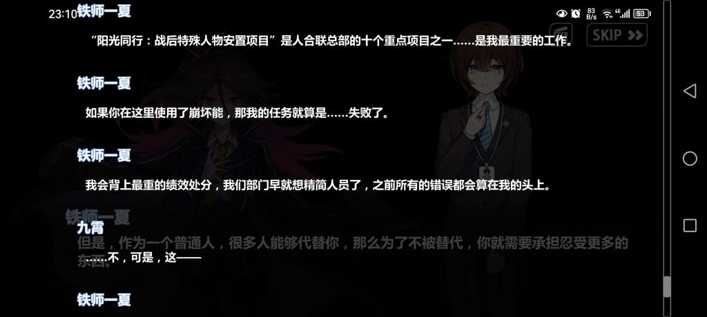
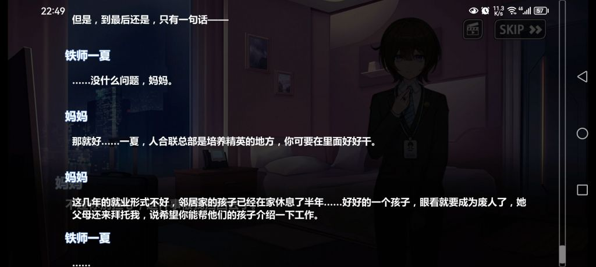
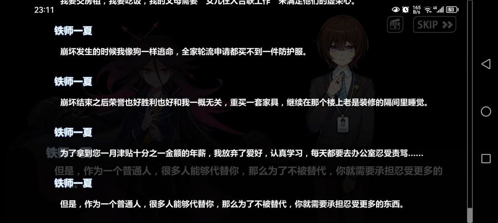
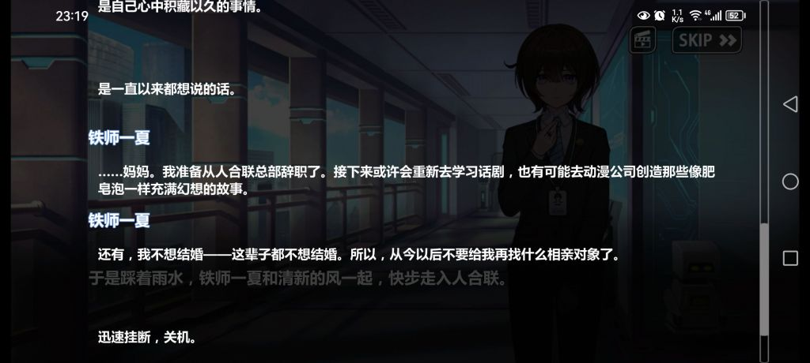

### [不吐不快] 从崩三时期开始，米哈游一旦想碰瓷现实剧情就烂掉

Made by ngapost2md (c) ludoux [GitHub Repo](https://github.com/ludoux/ngapost2md)

----

##### 0.[0] \<pid:0\> 2023-07-28 14:23:39 by 子守歌
给我印象最深的是崩三第二十四二十五章，千律和琪亚娜的辩论、女王和琪亚娜的辩论
编剧借着千律的口说出一个幸存者被遇难者家属欺压、幸存者因此崩溃的故事，而琪亚娜对此的回复只有强调遇难者家属好的一面，并认为幸存者崩溃都是因为千律，“她也不是这么脆弱的人！”
我很难评，我只能说幸存者没自杀已经是很坚强了，人家因为绝望变成千律，你的评价是脆弱，呃呃
还有就是女王强调牺牲和理想在现实面前一文不值，讲的其实是破坏容易建设难的道理，这个道理想必经过整个须弥版本的人没人get不到
而琪亚娜的回复是什么呢，还是顾左右而言他，虽然破坏容易建设难，你说得对，但我们有信念啊，我有美好能量就够了，呃呃
我不是说编剧不能安排有现实主义和影射的辩论情节，但假如你自己的主角都要靠顾左右而言他来获得“辩论胜利”的话，你还安排这个情节是要干什么呢
你琪亚娜说为了世界所有的美好而战，那具体到千律这件事上，你难道不是在空喊口号？面对对方提出的现实问题，你有想怎么帮幸存者摆脱困境，怎么让遇难者家属放下成见吗？没有，你认为这是千律找茬，幸存者不会这么“脆弱”
女王质疑人心的恶意，说很多人的理想和善意被践踏，这些现象不止于支配剧场，在外面世界也从未变过，你琪亚娜的回复是什么？你有打算解决这种现象吗？没有，你强调自己获得了更多的善意，善意一定能战胜恶意
很可惜，现在这些话应验了：须弥整个大版本，纳西妲的塑造和玩家的善意被某些人轻易践踏毁掉，怎么没有美好能量来拯救世界？米哈游又何尝不是一个支配剧场呢？

米哈游在崩三现实问题上犯的最大的错误，就是吧“美好”和“战胜崩坏”画等号。你说主角团是为了战胜崩坏而战，逻辑好歹是通的，你说你为世界上所有的美好而战，没有崩坏的世界就没好了吗？这种情况下你还要刻意去碰现实题材，就很难不出戏了

----

##### 1.[2] \<pid:705473355\> 2023-07-28 15:41:34 by 广阔的蓝天i
你当为什么崩坏3剧情被嘲讽为美好能量

----

##### 2.[0] \<pid:705473733\> 2023-07-28 15:43:14 by nanamisamas
一言以蔽之就是文案拉胯，把握不住

----

##### 3.[0] \<pid:705474085\> 2023-07-28 15:44:56 by 广阔的蓝天i
讨论现实最后只有一个美好能量唯心

----

##### 4.[1] \<pid:705476422\> 2023-07-28 15:55:45 by 雨源rainsource
能把现实问题写好，本身要是有现实经历又要沉得下心，文笔也要好，米家文案是一个没有，空中楼阁，能写好才怪了

----

##### 5.[0] \<pid:705476906\> 2023-07-28 15:58:00 by 剑筑师と書記官
这就是典型的自己不行赖世界的症状

----

##### 7.[0] \<pid:705477179\> 2023-07-28 15:59:19 by TheLegislator
eva的设定用在老eva写后冷战日本年轻人的迷茫还挺合适的，结果mhy把eva的设定和王道热血少年漫缝合起来，一打不过了就大喊友谊啊羁绊啊回忆杀啊，又典又尬得不行就算了，和老版eva的那种设定也严重消化不良。

----

##### 8.[0] \<pid:705478257\> 2023-07-28 16:04:42 by 无神之主
崩3组文案水平不够罢了

----

##### 9.[0] \<pid:705486530\> 2023-07-28 16:42:03 by 绯想天风
文案和美工都拉胯啊

----

##### 10.[0] \<pid:705487142\> 2023-07-28 16:44:47 by 被塞抹布后的小号
这也是终章崩盘的主要原因：永远不真正面对并解决问题。

----

##### 11.[0] \<pid:705487409\> 2023-07-28 16:46:00 by 剑筑师と書記官
>[jump](#pid705486530) 绯想天风(2023-07-28 16:42) 说: 
>
>文案和美工都拉胯啊

美工原来还可以，现在是清凉侠胡搞+阿鸡摆烂江郎才尽组合拳下来，做实丑工这说法了。
也就只有音乐组还在稍微换人的时候质量没崩塌，
如果陈致逸那个工作室真的走了不排除也会雪崩。

----

##### 12.[0] \<pid:705489353\> 2023-07-28 16:54:43 by 月宫的牧羊人C
它本来就不该碰瓷现实剧情，文娱商品写现实剧情就没一个写得好的，受众本来也不是冲着这个来的，创作者为什么要用自己那小布尔乔亚味十足的浅薄头脑妄谈现实呢？
支撑任何一个简单现实剧情的都是一个完整的社会背景，那些坐在办公室里喝咖啡敲键盘的普通人靠缝各种历史、宗教、神话、哲学、名作、民俗素材缝出一个看上去有点意思的幻想世界就不错了，再有点想法的把历史事件包装包装合理地缝进剧情里那就算能力卓绝了，千万别表达，小资一思考，上帝就发笑

----

##### 13.[0] \<pid:705525045\> 2023-07-28 20:10:29 by lleevvin
>[jump](#pid705489353) 月宫的牧羊人C(2023-07-28 16:54)说:
>它本来就不该碰瓷现实剧情，文娱商品写现实剧情就没一个写得好的，受众本来也不是冲着这个来的，创作者为什么要用自己那小布尔乔亚味十足的浅薄头脑妄谈现实呢？ 支撑任何一个简单现实剧情的都是一个完整的社会背景，那些坐在办公室里喝咖啡敲键盘的普通人靠缝各种历史、宗教、神话、哲学、名作、民俗素材缝出一个看上去有点意思的幻想世界就不错了，再有点想法的把历史事件包装包装合理地缝进剧情里那就算能力卓绝了，千万别表达，小资一思考，上帝就发笑[s:a2:笑]

那不小资的作品，现在能在哪里看到呢

----

##### 14.[0] \<pid:705525910\> 2023-07-28 20:16:05 by 李孟安的老攻
一边想蹭现实显得自己有深度，一边又不知道怎么圆只能用美好能量这种唯心的大空话来强行自我感动，有种既要又要里外不是人的美

----

##### 15.[0] \<pid:705526842\> 2023-07-28 20:22:13 by gloriel
终章要把普通人从美梦中唤醒那段剧情也是如此，德莉莎一行人遇到的只是遇到挫折的社畜、慨然赴死的绝症老人，而根本不敢写真正活在苦难绝望里需要美梦当做唯一慰籍的人。
之后又很突兀的加了一个美梦只能是一天内循环所以时间久了肯定会出破绽的设定

----

##### 17.[0] \<pid:705527696\> 2023-07-28 20:28:22 by 被塞抹布后的小号
>[jump](#pid705526842) gloriel(2023-07-28 20:22) 说: 
>
>终章要把普通人从美梦中唤醒那段剧情也是如此，德莉莎一行人遇到的只是遇到挫折的社畜、慨然赴死的绝症老人，而根本不敢写真正活在苦难绝望里需要美梦当做唯一慰籍的人。
>之后又很突兀的加了一个美梦只能是一天内循环所以时间久了肯定会出破绽的设定

原因当然主角团没那个能力解决，但又要代表正义，所以就开始疯狂加设定，把圣痕计划压到绝不可以实现的地步

----

##### 18.[0] \<pid:705528013\> 2023-07-28 20:30:31 by Ngchikrn
老實說，不如我看的網文瘟疫醫生，千人律那里我半跳著看，就挺怪的

----

##### 19.[0] \<pid:705528370\> 2023-07-28 20:33:03 by 日德兰的悲歌
>[jump](#pid705525045) lleevvin(2023-07-28 20:10) 说: 
>
>那不小资的作品，现在能在哪里看到呢

看世界名著

----

##### 20.[0] \<pid:705529892\> 2023-07-28 20:43:14 by 转生三周目
所以我一看到吹崩三剧情的就觉得蚌埠住
短片煽情是很有效的，但出脑后再重新审视这个故事，就只会觉得漏洞百出。k奇葩/皇的地方实在太多了，终章造梦那部分看得非常不舒服

----

##### 21.[0] \<pid:705530984\> 2023-07-28 20:50:00 by 转生三周目
>[jump](#pid705528370) 日德兰的悲歌(2023-07-28 20:33) 说: 
>
>看世界名著

这也太泛了，而且得看你怎么定义小资色彩。林震吃个荸荠，赵慧文听个曲儿还能被嘲讽为小资呢

----

##### 22.[0] \<pid:705537426\> 2023-07-28 21:32:22 by 月宫的牧羊人C
>[jump](#pid705525045) lleevvin(2023-07-28 20:10):

很多啊，比如说所有单纯朴实看大奶子看大炸逼做童话梦骑士梦修仙梦不碰瓷什么真实苦难不用幻想世界碰瓷现实的文娱作品

----

##### 23.[0] \<pid:705540331\> 2023-07-28 21:51:03 by 星辰之剑
乌合之众这个词崩三的剧情直接就是乱用，而且用的非常典，这玩意当时有人就怀疑是被改过的来嘲讽当时tnl风波的问题给结晶站台的，之前只能说这个典法有典过头了没多少人往这个角度想。
但是这次猛干的爆典真的不难说这个滑坡的想法是不是真的

----

##### 24.[0] \<pid:705541315\> 2023-07-28 21:57:33 by meterorite·陨星
某三的美好能量是我见过二游最垃圾的言论

----

##### 25.[0] \<pid:705542332\> 2023-07-28 22:04:50 by 子周宁卯夏万
我个人非常讨厌一些人在写作中抖映射现实的包袱，你说作者不可能摆脱现实的影响这个我认，但是避不开和主动沾那是两码事，也就是无意和故意的区别，米就特喜欢故意沾，就显它能了，恶心

----

##### 26.[0] \<pid:705542497\> 2023-07-28 22:06:00 by 重生之我是荣誉骑士
也就写写12+啦，想写有深度的写不好的啦，弄巧成拙

----

##### 27.[0] \<pid:705542895\> 2023-07-28 22:08:56 by 丑余景壬陈庞
旁边帖子有个评论说的特别好

崩的俩女角色，都是切割了心中恶意，只存在善意的一面，在崩坏3这个故事里就是律者意识更多是恶意，在k423身上还钦定空律是恶面，k是正面，爱丽也是。

他最后结局这一年最出众的俩女性都是这种完全切割后的善，还指望他写点现实吗？

另外我之前跟朋友也说，我觉得爱莉归终这种宛如白月光的角色，那他们好就好在他们要么故事一开始就死了，要么就是在死的同时完成了最后的塑造和升华。只要还活着还有剧情发生崩塌、剧情烂完是早晚的事情。

反正这种写法不适合写现实的故事，不然就太空白太不现实，也就是太“美好能量”拯救一切了。

----

##### 28.[0] \<pid:705543560\> 2023-07-28 22:13:28 by 科莱恩，克怂
>[jump](#pid705525045) lleevvin(2023-07-28 20:10) 说: 
>
>那不小资的作品，现在能在哪里看到呢

哲学书，或者你直接知乎建政滚两圈，然后结合自己的生活经验去看社会学相关书籍。多看几本，然后涉猎范围广一点，还有就是生物化学，历史政治等等与现实高度相关的(现实中曾经发生或可再现的)。然后不能说你学的多会，但是思考起来小资那味儿会淡很多。反正这方面重点是多看现实相关记载

----

##### 29.[0] \<pid:705543761\> 2023-07-28 22:14:57 by 科莱恩，克怂
>[jump](#pid705528013) Ngchikrn(2023-07-28 20:30) 说: 
>
>老實說，不如我看的網文瘟疫醫生，千人律那里我半跳著看，就挺怪的

瘟疫医生前面大半本都好看的，氛围渲染太棒了。就是后期有一段有点乱了。不过还好结尾结的不错

----

##### 30.[0] \<pid:705544189\> 2023-07-28 22:17:57 by 159357呵
>[jump](#pid705542332) 子周宁卯夏万(2023-07-28 22:04) 说: 
>
>我个人非常讨厌一些人在写作中抖映射现实的包袱，你说作者不可能摆脱现实的影响这个我认，但是避不开和主动沾那是两码事，也就是无意和故意的区别，米就特喜欢故意沾，就显它能了，恶心

它不光是抖包袱和影射的问题。它是在以一种既高高在上、嘲笑讥讽底层苦难，又顾影自怜、自我陶醉、怨天尤人(抱怨社会)的姿态来影射现实。主要是态度问题。
既然某人引用鲁迅，那就拿鲁迅来说，鲁迅也影射现实啊，而且更加辛辣无情，但我们不会从鲁迅的文字间感受到那种指指点点的高傲，不会有那种刻意去“找一个社会典型，发表一下自己独到的见解，哈哈，众生皆醉我独醒”的异味
横眉冷对千夫指，俯首甘为孺子牛。不能只记得前半句话。

----

##### 31.[0] \<pid:705545354\> 2023-07-28 22:26:04 by 科莱恩，克怂
>[jump](#pid705544189) 159357呵(2023-07-28 22:17) 说: 
>
>它不光是抖包袱和影射的问题。它是在以一种既高高在上、嘲笑讥讽底层苦难，又顾影自怜、自我陶醉、怨天尤人(抱怨社会)的姿态来影射现实。主要是态度问题。
>既然某人引用鲁迅，那就拿鲁迅来说，鲁迅也影射现实啊，而且更加辛辣无情，但我们不会从鲁迅的文字间感受到那种指指点点的高傲，不会有那种刻意去“找一个社会典型，发表一下自己独到的见解，哈哈，众生皆醉我独醒”的异味
>横眉冷对千夫指，俯首甘为孺子牛。不能只记得前半句话。

好骂
鲁迅写讽刺，是先看见了苦难，为那些困难的人感到心痛，为群众感到不甘，感到同情。所以带着股愤怒去试图唤醒他人，他是新文化运动旗手，某种角度来说鲁迅写文就是为了输出观点，所以天然带着一种训诫的味道，但是鲁迅的训诫是为了让世人更好。我敢说如果能用不写文来换觉醒，鲁迅绝对愿意封笔。
而米呢？
他压根不在乎也不理解苦难，他就是觉得哇，这观念好高大上，借一下这观点肯定能赚钱。一种高高在上的态度肆意评判，实际上改变对于苦难毫无怜悯心。如果和他说从今天开始世界都是和平和爱了，它第一想法估计是“唉？没人受苦了？那我要写啥才能搞得像是高大上的样子呢”

----

##### 32.[1] \<pid:705546629\> 2023-07-28 22:35:11 by Noven
>[jump](#pid705545354) 科莱恩，克怂(2023-07-28 22:26)说:
>[quote][pid=705544189,37170469,2]Reply[/pid] <b>Post by [uid=65210729]159357呵[/uid] (2023-07-28 22:17):</b>  它不光是抖包袱和影射的问题。它是在以一种既高高在上、嘲笑讥讽底层苦难，又顾影自怜、自我陶醉、怨天尤人(抱怨社会)的姿态来影射现实。主要是态度问题。 既然某人引用鲁迅，那就拿鲁迅来说，鲁迅也影射现实啊，而且更加辛辣无情，但我们不会从鲁迅的文字间感受到那种指指点点的高傲，不会有那种刻意去“找一个社会典型，发表一下自己独到的见解，哈哈，众生皆醉我独醒”的异味[s:ac:呆] 横眉冷对千夫指，俯首甘为孺子牛。不能只记得前半句话。[/quote]好骂 鲁迅写讽刺，是先看见了苦难，为那些困难的人感到心痛，为群众感到不甘，感到同情。所以带着股愤怒去试图唤醒他人，他是新文化运动旗手，某种角度来说鲁迅写文就是为了输出观点，所以天然带着一种训诫的味道，但是鲁迅的训诫是为了让世人更好。我敢说如果能用不写文来换觉醒，鲁迅绝对愿意封笔。 而米呢？ 他压根不在乎也不理解苦难，他就是觉得哇，这观念好高大上，借一下这观点肯定能赚钱。一种高高在上的态度肆意评判，实际上改变对于苦难毫无怜悯心。如果和他说从今天开始世界都是和平和爱了，它第一想法估计是“唉？没人受苦了？那我要写啥才能搞得像是高大上的样子呢”

说起鲁迅我倒是想起契诃夫，文学是情人，医学是老婆，然后天天用情人赚的钱补贴老婆

用写这么多小说的钱免费为穷人看病然后天天给朋友的信哭穷

----

##### 33.[0] \<pid:705547599\> 2023-07-28 22:41:05 by awa233223
崩三剧情这个美好能量是真的很难泵，一到真正实际的现实问题主角就直接代表全人类表示要什么美好世界
然后终章再一个机械降神打破次元壁，编剧不会真的觉得这个想法很好吧
还有就是倍受诟病的&#39;&#39;不断引入各种新设定和哲学概念，好像它的剧情还不够乱似的   

----

##### 34.[0] \<pid:705547708\> 2023-07-28 22:41:54 by Ngchikrn
>[jump](#pid705543761) 科莱恩，克怂(2023-07-28 22:14) 说: 
>
>瘟疫医生前面大半本都好看的，氛围渲染太棒了。就是后期有一段有点乱了。不过还好结尾结的不错

對，千律這段就跟黑山羊事件很像

----

##### 35.[0] \<pid:705547867\> 2023-07-28 22:42:51 by 159357呵
>[jump](#pid705546629) Noven(2023-07-28 22:35) 说: 
>
>说起鲁迅我倒是想起契诃夫，文学是情人，医学是老婆，然后天天用情人赚的钱补贴老婆
>
>用写这么多小说的钱免费为穷人看病然后天天给朋友的信哭穷
>
>以前有段时间的话题:是不是不该因人废文
>
>但看到鲁迅，朱自清这些知行合一的实在无法同意

哈哈哈哈。一个被高尔基托尔斯泰柴可夫斯基等俄罗斯文艺界众人喜爱的男人。
“如果我有钱的话，我是会到处飞的。到处飞的哦！”
但人家写出了《小公务员之死》

----

##### 36.[0] \<pid:705549140\> 2023-07-28 22:51:18 by 星踪幻影
>[jump](#pid705542895) 丑余景壬陈庞(27楼) (2023-07-28 22:08)说:
>旁边帖子有个评论说的特别好  崩的俩女角色，都是切割了心中恶意，只存在善意的一面，在崩坏3这个故事里就是律者意识更多是恶意，在k423身上还钦定空律是恶面，k是正面，爱丽也是。  [s:ac:呆]他最后结局这一年最出众的俩女性都是这种完全切割后的善，还指望他写点现实吗？  另外我之前跟朋友也说，我觉得爱莉归终这种宛如白月光的角色，那他们好就好在他们要么故事一开始就死了，要么就是在死的同时完成了最后的塑造和升华。只要还活着还有剧情发生崩塌、剧情烂完是早晚的事情。  反正这种写法不适合写现实的故事，不然就太空白太不现实，也就是太“美好能量”拯救一切了。

英杰啊，其实故事开始时候活着不少的

----

##### 37.[0] \<pid:705549770\> 2023-07-28 22:55:10 by 夜寒溟
讲真千律那段剧情我过的时候很认真思考了一下，发现我就是天生的千人律者

----

##### 38.[0] \<pid:705553489\> 2023-07-28 23:21:51 by tina2231
>[jump](#pid0) 子守歌(2023-07-28 14:23):

崩三的基本盘崩坏是从k423和真琪开始埋下来的，到二十八章彻底爆炸，从根本上把呆鹅和k423都变成了巨大小丑，当时期待真琪k琪如何处理的我，看完二十八章破口大骂，恶心的无以复加

----

##### 39.[0] \<pid:705553922\> 2023-07-28 23:25:04 by 流量猫
所以我很好奇到底为什么会天天有人吹崩坏3剧情好的，八成都是碎片剧情了解下就乱吹

----

##### 40.[0] \<pid:705555491\> 2023-07-28 23:37:18 by 我修院淳平
感觉须弥三杰也是，机械生命先不谈，人造梦境和集群思维那块基本都是在攻击实施者与技术的问题，而对人造梦境与集群思维本身闭口不谈

----

##### 41.[0] \<pid:705555734\> 2023-07-28 23:39:03 by 星踪幻影
>[jump](#pid705553489) tina2231(2023-07-28 23:21) 说: 
>
>崩三的基本盘崩坏是从k423和真琪开始埋下来的，到二十八章彻底爆炸，从根本上把呆鹅和k423都变成了巨大小丑，当时期待真琪k琪如何处理的我，看完二十八章破口大骂，恶心的无以复加

如果K琪配角或者小说漫画还处理那很简单。但偏偏图标主角而且官方看板娘主人公，必须占着不然“琪亚娜”这角色位会空缺，
虽然剧情内“合理”是K让位鹅去当，但是剧情外作品角度的话，我感想是：再巨魔点，编剧再脑筋不对劲“其实鹅也不是真琪，真琪又是别人”更加有乐子？
本质一个看板娘主人公的身份随便被替换夺取是比较微妙生草的

----

##### 42.[0] \<pid:705556333\> 2023-07-28 23:42:53 by mithy-
大伙儿对剧情还这么较真的，崩3剧情很多年前我就看不懂了，基本就是听几句语音就开始跳，就感觉特别玛丽苏，而且是为了推卡写剧情，最初感觉还是剧情到了开始推这个角色

----

##### 43.[0] \<pid:705558775\> 2023-07-29 00:00:29 by 白开水巨好喝
>[jump](#pid705553922) 流量猫(2023-07-28 23:25) 说: 
>
>所以我很好奇到底为什么会天天有人吹崩坏3剧情好的，八成都是碎片剧情了解下就乱吹

大概是看了泛式的速度崩坏三开吹的。
到时候再看几个剧情动画就开始自我感动了。

----

##### 44.[0] \<pid:705561334\> 2023-07-29 00:21:22 by Toposes
其实这类事情我一直想暴论一嘴

虽然旧传统说的是文史哲不分家，虽然大众心目中是知识分为文科理科

但是当代大学体制下文史哲就是分家的，所谓的文科知识里面不仅人文学科和社会学科分家，人文学科内部搞文献的搞思辨的和搞艺术创作的也分家

基本可以说一个中文系/文学系/外语系出身的编剧，他的社科素养和哲学素养基本只能自我培养，但是当他参加工作面对理科出身的人时，别人又默认他们懂点社科和哲学，甚至一个编剧自己也觉得自己懂这些……

一般这些编剧除了文学素养外，历史文献(而不是历史思辨！)方面的素养是最好的，所以什么各区域冷门历史知识，碎片化叙事，各种原型小伏笔和小考据他们都挺能胜任的。说不定跟国内文学系课程设置里重历史文献有点关系

----

##### 45.[0] \<pid:705562014\> 2023-07-29 00:27:01 by 100100
写好现实主义的阅历和水平哪是这帮眼高手低的象牙塔小资能有的。

----

##### 46.[0] \<pid:705570700\> 2023-07-29 01:35:55 by 流量猫
>[jump](#pid705558775) 白开水巨好喝(2023-07-29 00:00) 说: 
>
>大概是看了泛式的速度崩坏三开吹的。
>到时候再看几个剧情动画就开始自我感动了。

感觉现在这种做碎片爆点适合捞钱和吸引人气，去年丽可丽丝也差不多

----

##### 47.[0] \<pid:705571225\> 2023-07-29 01:41:30 by Kururugi
>[jump](#pid705525045) lleevvin(2023-07-28 20:10) 说: 
>
>那不小资的作品，现在能在哪里看到呢

看历史和政治，比任何文学作品都有趣太多太多。

----

##### 48.[0] \<pid:705571689\> 2023-07-29 01:47:27 by 右手边03
最大的问题是没认识到自己就是个从大学到办公室，阅历不丰富的人，还觉得自己上流。像极了初中生高中生无病呻吟，说一些大而虚的东西感动自己。

----

##### 49.[0] \<pid:705572029\> 2023-07-29 01:51:47 by 安希雅_R4
>[jump](#pid705525045) lleevvin(2023-07-28 20:10):

起点飞卢番茄不够你看的。
爽文基本上不会讨论这么有病的问题(讨论完了结果订阅马上教你做人不说还会被读者直诉胸襟)，爽就完了谁想那么多。

----

##### 50.[0] \<pid:705575032\> 2023-07-29 02:38:03 by gloriel
>[jump](#pid705553922) 流量猫(2023-07-28 23:25) 说: 
>
>所以我很好奇到底为什么会天天有人吹崩坏3剧情好的，八成都是碎片剧情了解下就乱吹

1，主线全配音+高质量演出+动画短片煽情。

----

##### 51.[0] \<pid:705575209\> 2023-07-29 02:40:44 by ZX_hysh
说实话写不好可以不写的，原也好崩也好很多东西不写对剧情整体影响有限，但是编剧又非得卖弄一下他对现实发散产生的伟大观念。

----

##### 52.[0] \<pid:705575430\> 2023-07-29 02:44:22 by 色胚茄子
只能说没有金刚钻非揽瓷器活，自视甚高，又菜又爱玩，翻车在所难免
好好写二次元幻想世界得了，非要对三次元指手画脚，反倒让人对二次元也没了兴趣

----

##### 53.[0] \<pid:705575510\> 2023-07-29 02:45:38 by 年下萝莉控
这很重要吗？也就你们这些   才觉得重要吧

----

##### 54.[0] \<pid:705577069\> 2023-07-29 03:14:32 by 星际兄贵
不得不说，在搞现实向剧情方面啊米比对门的鹰小姐差远了
同样是架空世界对门写的戏剧冲突都是现实中也会有的，看着让我都要犯焦虑症了，相比之下我对崩和原的剧情就不会有这种感觉

----

##### 55.[0] \<pid:705600136\> 2023-07-29 09:48:48 by 流量猫
>[jump](#pid705575032) gloriel(2023-07-29 02:38) 说: 
>
>1.主线全配音+高质量演出+动画短片煽情。有这些资源，剧情观感直接能上两个台阶。你想想连没有动画短片的原神依靠前两点都让剧情体验增色不少，即使是拉胯的稻妻后半主线因为无想一刀与万叶挡刀都有很多人吹。
>2.角色数量少，平均每个角色能分到的剧情量相对较多，能容易塑造出让玩家喜欢或是印象深刻的角色。所谓没有量就谈不上质。再加上崩3运营那么多年，很多玩家都对角色有比较深的感情。
>3.崩3主线总体上走的还是王道热血少年向，这个题材本来就是受众最广的。
>4.姬子是二游里罕有的彻底死亡的自机角色，用她来发刀煽

可是这很重要么，结合猛干哥来看

----

##### 56.[0] \<pid:705607902\> 2023-07-29 10:37:20 by znaibeind
让二次元去面对现实，本来就不是很现实吧 
能坦然面对现实的人还会沉迷二次元吗？

