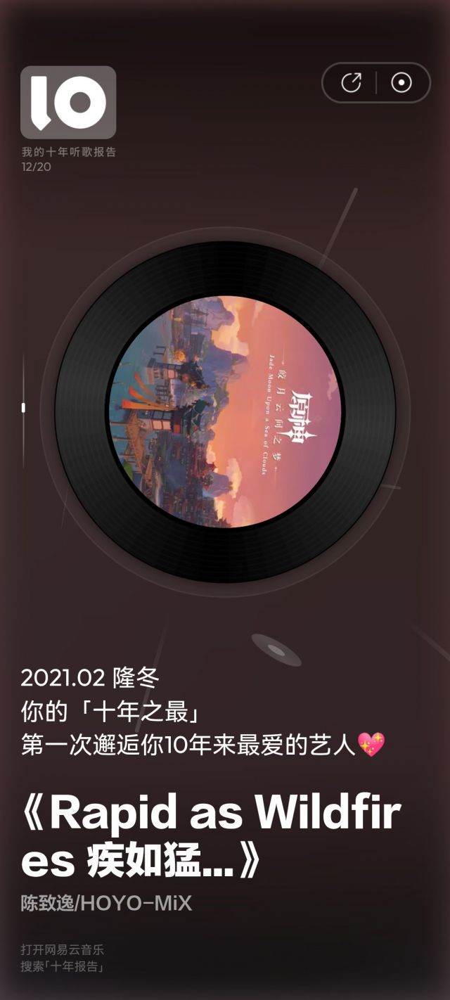
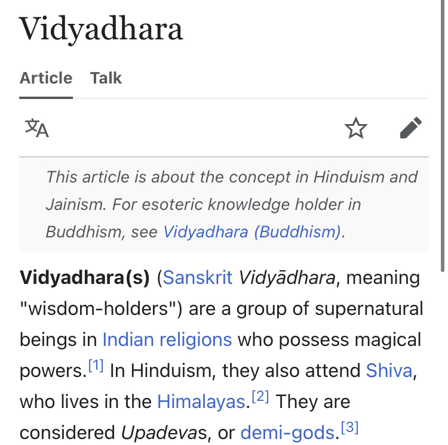

### [不吐不快]这群13文案真是糟蹋了米家这么好的音乐

Made by ngapost2md (c) ludoux [GitHub Repo](https://github.com/ludoux/ngapost2md)

----

##### 0.[2] \<pid:0\> 2023-07-28 19:04:39 by 洛长河
感觉抛开剧情不谈，崩三和崩铁音乐都挺好的，专辑都是想要循环听的那种，刚做完崩铁新主线那个boss战的侗族音乐真的震撼到我了，让我想起来第一次听到尼尔机械纪元里面遮光的时候(不是比较没有比较单纯个人感受！！！可能孩子没吃过好的原谅孩子吧可以推荐一些好的)

但是想想猛干哥爆的那个典，全都出脑了，好恶心啊，前一幕被景元感动，后一幕和丹恒站一起就觉得啊啊啊啊五人组爱恨纠葛去尼玛的好恶心啊

还有散兵那个周本bgm，多好的歌配了一个瘤子。。。然后3j搁那狂吹

猛干哥你在看吗？你对得起你同事的努力吗？

还是说“这重要吗？也就你们这些还对米家游戏抱有幻想的人觉得重要吧？”

----

##### 1.[0] \<pid:705514613\> 2023-07-28 19:06:57 by 随便改个名字吧
这样说你会不会好受点

水龙吟英文翻译是梵文

----

##### 2.[2] \<pid:705514985\> 2023-07-28 19:09:09 by ayainchaos
玩过尼尔难道不是第一反应废弃工厂/森林王国么，那个念经唱法

----

##### 3.[1] \<pid:705515191\> 2023-07-28 19:10:18 by 温小任_
就想知道我喜欢的那几个角色的美术设计是谁，我直接推你得了，省得去屎里淘金

----

##### 4.[0] \<pid:705515219\> 2023-07-28 19:10:26 by UID3563849
他家音乐人都署名，方便关注喜欢的音乐人，多好的习惯啊
策划和文案都来好好学一学

----

##### 5.[0] \<pid:705515224\> 2023-07-28 19:10:28 by 洛长河
>[jump](#pid705514613) 随便改个名字吧(2023-07-28 19:06) 说: 
>
>这样说你会不会好受点
>
>水龙吟英文翻译是梵文

我突然发现那个歌手是上海迪士尼唱烟花主题曲的。。。我循环了他那版的主题曲很久很久

----

##### 6.[0] \<pid:705515225\> 2023-07-28 19:10:28 by 摆烂的鱼鱼
确实糟蹋东西，不如切割好了，反正角色实际塑造根本达不到对应音乐的高度，感觉就像各做各的，~~也许就是如此~~。

----

##### 7.[0] \<pid:705515537\> 2023-07-28 19:12:24 by 洛长河
>[jump](#pid705514985) ayainchaos(2023-07-28 19:09) 说: 
>
>玩过尼尔难道不是第一反应废弃工厂/森林王国么，那个念经唱法

老实说我还没玩呢。。。只云过。。。小的时候没那个条件只云过一点点剧情和歌单，不过最近准备补了，刚入手了xss(还是得感谢老米直接让我准备玩单机游戏了。。)

----

##### 8.[0] \<pid:705515544\> 2023-07-28 19:12:28 by cbzmxx
米()的音乐确实到目前为止没有任何黑点，绝对的顶中顶。但如果放眼整个游戏圈，好的音乐多了去了，真没必要单吊在米的树上。

----

##### 9.[0] \<pid:705515705\> 2023-07-28 19:13:25 by ZFBXBD
我喜欢崩三的一个符华的小提琴曲！
还好我不玩崩三可以安心享受音乐。

----

##### 10.[1] \<pid:705531076\> 2023-07-28 20:50:39 by ritsukaalter
>[jump](#pid705515225) 摆烂的鱼鱼(2023-07-28 19:10) 说: 
>
>确实糟蹋东西，不如切割好了，反正角色实际塑造根本达不到对应音乐的高度，感觉就像各做各的，~~也许就是如此~~。

确实，还不如听着音乐看着皮套自己编一个人设出来

----

##### 11.[0] \<pid:705536393\> 2023-07-28 21:25:30 by lomms
音乐做得好的游戏挺多

----

##### 12.[0] \<pid:705537087\> 2023-07-28 21:29:55 by 子夜歌QAQ
我到现在还是觉得米家文案应该给美术和音乐磕个头

----

##### 13.[0] \<pid:705537272\> 2023-07-28 21:31:23 by 吼厚侯
我一直觉得原的音乐可以到T1上游，但是绝对没有T0  
单纯喜欢音乐，那听个歌就行了呗，还玩啥游戏呢

----

##### 14.[0] \<pid:705538251\> 2023-07-28 21:37:51 by moeflan
我之前也觉得音乐质量很稳定，自从听到了水龙吟……

----

##### 15.[0] \<pid:705538495\> 2023-07-28 21:39:35 by めいかい
>[jump](#pid705515191) 温小任_(2023-07-28 19:10) 说: 
>
>就想知道我喜欢的那几个角色的美术设计是谁，我直接推你得了，省得去屎里淘金

讲个鬼故事，万一你讨厌的角色设计和喜欢的，其实出自同一批人呢？

----

##### 16.[0] \<pid:705538706\> 2023-07-28 21:40:50 by Miracle400
其实原的音乐在就二游手游里可以说顶尖，如果把范围扩大到其他领域，音乐优秀的游戏真的太多了。前两天我闲着没事整理了玩过的gal的音乐，很多都不比原差

----

##### 17.[0] \<pid:705539965\> 2023-07-28 21:48:40 by 李孟安的老攻
有吗？我觉得水龙吟很难听

----

##### 18.[0] \<pid:705540355\> 2023-07-28 21:51:15 by 拨云见日ii
陈走了以后我觉得音乐也就那样吧 不如以前惊艳了

----

##### 19.[0] \<pid:705541040\> 2023-07-28 21:55:34 by 怎样才能不被禁言1
是吗，出脑了我觉得一般之前游戏玩太少了

----

##### 20.[0] \<pid:705541227\> 2023-07-28 21:56:51 by 花瓣飘零
>[jump](#pid705540355) 拨云见日ii(2023-07-28 21:51)说:
>[s:ac:哭笑]陈走了以后我觉得音乐也就那样吧 不如以前惊艳了

真的走了？须弥确实好像很多音乐都不是他了，最近放出来的专辑

----

##### 21.[0] \<pid:705541615\> 2023-07-28 21:59:35 by 海与风的礼物w
除了陈老师其他几个写的也有很多不错的我到现在歌单里都有好多原的音乐

----

##### 22.[0] \<pid:705542837\> 2023-07-28 22:08:25 by 阿特拉斯院长
zsbd

----

##### 23.[0] \<pid:705543296\> 2023-07-28 22:11:38 by 一只扁扁
我也觉得很不错，直到我听到了龙水吟(。
那个男声一出来，救命啊那是什么玩意儿。
不过音乐真的是个很主观的东西，我说难听仅代表我自己。

----

##### 24.[0] \<pid:705544199\> 2023-07-28 22:18:02 by 赵十七
原的音乐确实是不错，但现在也有点疲劳了，光靠音乐也撑不起来现在这一摊xx。我只有在洗澡的时候还会哼起白鹭归庭，怀念一下过去的美好，毕竟现在恶心是真的，过去喜欢这游戏也是真的。

----

##### 25.[0] \<pid:705544625\> 2023-07-28 22:21:20 by D_终于考好了
问题来了，有哪个游戏的音乐特别拉胯
我好像从来没听说过那家游戏喷过音乐组

----

##### 26.[0] \<pid:705544890\> 2023-07-28 22:23:07 by 司空萌萌
>[jump](#pid705540355) 拨云见日ii(2023-07-28 21:51) 说: 
>
>陈走了以后我觉得音乐也就那样吧 不如以前惊艳了

居然走了？这是去哪了？

----

##### 27.[0] \<pid:705545724\> 2023-07-28 22:28:37 by xdccc023
觉得米的音乐好的最大原因是这年头内娱的音乐烂中烂。
比如很多人吹的 神女劈观 
一首普通的古风流行歌曲，隔壁古风圈我不懂怎么样，至少我经常听的中V圈里面这类的歌就蛮多的。

当然 神女劈观 歌曲还是很优秀的，比如用的和弦比较高级

----

##### 28.[0] \<pid:705547892\> 2023-07-28 22:43:02 by 今天带钱了没
乐，谁能想到半年前hoyo-mix还是我的年度音乐人

现在真的不想去听了，听着听着就重要吗.mp3

----

##### 29.[0] \<pid:705548332\> 2023-07-28 22:45:57 by Inquisit
>[jump](#pid705545724) xdccc023(2023-07-28 22:28) 说: 
>
>觉得米的音乐好的最大原因是这年头内娱的音乐烂中烂。
>比如很多人吹的 神女劈观 
>一首普通的古风流行歌曲，隔壁古风圈我不懂怎么样，至少我经常听的中V圈里面这类的歌就蛮多的。
>
>当然 神女劈观 歌曲还是很优秀的，比如用的和弦比较高级

感觉神女劈观不合我口味但算不上差，而水龙吟，那是真的过剧情听到两眼一黑的难听

----

##### 30.[0] \<pid:705551897\> 2023-07-28 23:10:10 by cecial
>[jump](#pid705531076) ritsukaalter(2023-07-28 20:50) 说: 
>
>确实，还不如听着音乐看着皮套自己编一个人设出来

周本音乐倒是没提到什么救赎，整体还是蹭波米，风格也像，但是最近b站抖音总是刷到，散解发的那个文案，破碎，重组，什么重生，看得就好笑

----

##### 31.[0] \<pid:705552165\> 2023-07-28 23:12:12 by aswaw111
但是音乐可以外包啊
之前玩别的游戏，出大节奏的时候就是这么指责的：虽然音乐做得好，但那是人家作者水平高，关你公司什么事？

----

##### 32.[0] \<pid:705552403\> 2023-07-28 23:14:09 by pumppiiittt
尼尔玩完最喜欢沙漠和开局的那首，忘了叫啥名，6分多钟的

----

##### 33.[0] \<pid:705552404\> 2023-07-28 23:14:10 by 云影之离
>[jump](#pid705544625) D_终于考好了(2023-07-28 22:21) 说: 
>
>问题来了，有哪个游戏的音乐特别拉胯
>我好像从来没听说过那家游戏喷过音乐组

有，解神者......

----

##### 34.[0] \<pid:705552434\> 2023-07-28 23:14:19 by 戊舒侯卯巩尚
没关系，枫丹开始就不会被糟蹋了

----

##### 35.[0] \<pid:705552823\> 2023-07-28 23:17:19 by 一念の差
你给我几百亿，我把泽野弘之拉你家去给你写

----

##### 36.[0] \<pid:705556817\> 2023-07-28 23:46:14 by abbccdkani
>[jump](#pid705552823) 一念の差(2023-07-28 23:17) 说: 
>
>你给我几百亿，我把泽野弘之拉你家去给你写

业内说个笑话，有个国内公司前几年拿了某IP做手游真想请泽野来着，结果也真去问了，但是人家档期已经排到三年后了

----

##### 37.[0] \<pid:705556970\> 2023-07-28 23:47:22 by 我修院淳平
陈佬润了？

----

##### 38.[0] \<pid:705557098\> 2023-07-28 23:48:18 by 老虎二世
>[jump](#pid705544890) 司空萌萌(2023-07-28 22:23) 说: 
>
>居然走了？这是去哪了？

陈本来就不是米下属的员工，合作关系罢了

----

##### 39.[0] \<pid:705557140\> 2023-07-28 23:48:33 by 山薄荷雪
陈真的走了？
真是又震惊又合理的消息
震惊米家最后一个亮点也没了，合理在早该远离这帮虫豸

----

##### 40.[0] \<pid:705557253\> 2023-07-28 23:49:20 by 洛长河
>[jump](#pid705543296) 一只扁扁(2023-07-28 22:11) 说: 
>
>我也觉得很不错，直到我听到了龙水吟(。
>那个男声一出来，救命啊那是什么玩意儿。
>不过音乐真的是个很主观的东西，我说难听仅代表我自己。

那个歌的确有点拉，但是这个歌手本身有过好的作品，就是上海迪士尼五周年的烟花主题曲，还有崩坏三的主教的阿波卡利斯如是说那个主题曲的音乐会版本(我个人比起原版更喜欢这个歌手唱的)

个人感觉，拉的原因是这个歌手的声音就不太对，那个场景应该像若陀龙王那里雄浑的感觉，而不应该是迪士尼风格。。。导致违和感很重啊。。。不过我不专业，这只是我的个人感觉罢了。。。

----

##### 41.[0] \<pid:705559362\> 2023-07-29 00:04:55 by AiakosG
啊？真的假的，陈致逸不跟米哈游搭伙了？

----

##### 42.[0] \<pid:705564811\> 2023-07-29 00:50:58 by 今天带钱了没
借楼问一下是真的吗，陈老师也走了吗？

----

##### 43.[0] \<pid:705565496\> 2023-07-29 00:54:52 by 怎样才能不被禁言1
cy等陈老师后续

----

##### 44.[0] \<pid:705565998\> 2023-07-29 00:57:55 by 梅兰德协会探员N
游戏音乐的话，感觉只要是精雕细琢的单机，不管大小音乐就没有拉的。只限手游的话，我比较推荐舟和57的，一个活动一个风格，总能找到自己喜欢的，杂食人听得很爽，可以去wyy听听看

----

##### 45.[0] \<pid:705566392\> 2023-07-29 01:00:38 by 马小跳i
4.0前瞻如果陈不出镜，基本实锤走了吧

----

##### 46.[0] \<pid:705566549\> 2023-07-29 01:01:35 by arutty
真不至于。
网易云随机到一首国风战斗曲，真不比原神的差，何况成本肯定比原神低。
点进去看作者也是国人，给一些端游供曲。
有时候看结晶吹过头就觉得有点尬

----

##### 47.[0] \<pid:705568796\> 2023-07-29 01:17:42 by 多托雷铁血单推人
我玩过的游戏音乐都超喜欢，想了一下，好像但凡稍微有点名头的游戏，没有说音乐拉的吧，有时候我想找点新鲜的听的时候，就是直接去扒拉游戏bgm歌单，一个游戏一个风格，甚至对我来说各家拿出来疯狂吹捧的门面都是百听不厌的

----

##### 48.[0] \<pid:705571522\> 2023-07-29 01:45:15 by 猜你想看
春节前后就听说走了，那会儿大风向还是谣言别信
现在嘛，不好说  
另外bgm这块真没必要逮着一个狂吹，狂吹bgm的真的多玩点游戏吧，同样叫水龙吟，仙二和国家宝藏，哪个不把正崩旗的大作吊起来打

----

##### 49.[0] \<pid:705572098\> 2023-07-29 01:52:51 by 0123cola
我记得陈要走老早之前就有传言了吧，我印象里貌似是类似合同到期那种，当时还有人说原神音乐制作是个团队，陈老师走了还有谁和谁在(但是我都没听说过)不会影响很大啥的

----

##### 50.[0] \<pid:705573521\> 2023-07-29 02:13:55 by 在心中描绘
自古烂片出神曲游戏也一样

----

##### 51.[0] \<pid:705574373\> 2023-07-29 02:27:20 by 庚仇倪丁胡钟
走了就走了呗，难道因为一个人的离去，组织就会分崩离析吗？现在游戏配乐大多数或是使用音源，制作完直接当成品，或是实录管弦乐搭配电声乐队的jrpg式配乐(本质上还是摇滚乐，管弦部分还是以衬托为主，写法偏流行不像传统管弦那么复杂)。而原神是为数不多的全管弦实录，重视木管运用，且在尝试将管弦与不同地区的民乐器叠加做混合音色的游戏配乐(当然不管怎么写都没办法写的比本土传统作曲家好的，这是理所当然的，没那个环境，也没有采风的空闲)。首先要说明一件事，越是传统的管弦乐，越是重视对木管的应用，无论是早期的欧洲，好莱坞，日本配乐大师都是走这个路子的，这就考验配乐师的传统作曲基础打的扎不扎实，配器法和乐器法有没有学好。而原神的音乐团队，管弦配器是敲门砖，不会管弦配器根本就没有配乐的机会，而现在的日本游戏配乐，有一大批需要借助配器师才能完成曲子的配乐家，这就很令人费解了，而往往因为配器师的帮助，会把他们的一些瑕疵给掩盖住，如果配器师的风格比较强烈，甚至会直接把原配乐师的风格给覆盖掉。这里引用一下老莫的话:“有一件事让我觉得匪夷所思，那就是我发现很多作曲家，尤其是美国作曲家，不为自己的曲编写管弦乐谱。我不想说名字，但其中不乏知名、重量级音乐家。我对这点感到不解，也让我重新评估那些我原本认为是伟大音乐人的真实价值。”

----

##### 52.[0] \<pid:705586146\> 2023-07-29 07:48:49 by 雾祈心
水龙吟真的难听到要死，过完那段剧情直接和朋骂了十个超长语音条，当时热的难受说话都费劲结果气的口齿清晰
其实我觉得星间的中文版和野火也不好听，我也听过很多茶理理的翻唱，她这种唱见起家的歌手里算是基础和天赋都很好的了，感觉不应该是这个水平~~是不是钱没给够哇~~
野火属于从头到尾都没理解到底哪里让人热血沸腾了

----

##### 53.[0] \<pid:705591103\> 2023-07-29 08:42:07 by 樱舞罗裳
音乐好的游戏真的太多了，真要在全平台算，原神的音乐连T0都挤不进去

每年ign音乐奖打得大道都磨灭了，我喜欢的xb2想当初连提名都拿不到[xb我的Xb——

----

##### 54.[0] \<pid:705591407\> 2023-07-29 08:44:45 by 海上飘丝瓜
>[jump](#pid705544625) D_终于考好了(2023-07-28 22:21) 说: 
>
>问题来了，有哪个游戏的音乐特别拉胯
>我好像从来没听说过那家游戏喷过音乐组

寄掉的诺亚之光算吗，开局主题曲吓死人

----

##### 55.[0] \<pid:705591582\> 2023-07-29 08:46:12 by 香槟买好了就等
还行，音乐是最容易切割的

----

##### 56.[0] \<pid:705594057\> 2023-07-29 09:06:23 by qwertvgty
>[jump](#pid705552403) pumppiiittt(2023-07-28 23:14):

这两首一开始配合场景过剧情听的时候贼震撼

----

##### 57.[0] \<pid:705594567\> 2023-07-29 09:10:34 by 壬应葵辛周数？
>[jump](#pid705514613) 随便改个名字吧(2023-07-28 19:06) 说: 
>
>这样说你会不会好受点
>
>水龙吟英文翻译是梵文

瞳孔地震，本人的今日最蚌为什么是梵文

----

##### 58.[0] \<pid:705595166\> 2023-07-29 09:15:04 by xdccc023
>[jump](#pid705548332) Inquisit(2023-07-28 22:45):

就整个内娱音乐圈来说，神女劈观算是很不错的作品了。水龙吟没听到后面，我都不知道是在唱中文，刚刚开始我还以为音乐团队整大活，用外语唱古风歌曲

----

##### 59.[0] \<pid:705595495\> 2023-07-29 09:17:20 by 参选者VZ
>[jump](#pid705543296) 一只扁扁(2023-07-28 22:11) 说: 
>
>我也觉得很不错，直到我听到了龙水吟(。
>那个男声一出来，救命啊那是什么玩意儿。
>不过音乐真的是个很主观的东西，我说难听仅代表我自己。

我同意

----

##### 60.[0] \<pid:705595951\> 2023-07-29 09:20:47 by 森罗万象AL
散兵这角色
光看大纲：哇好厉害，一定是那种迷途知返系角色吧
再听音乐：哇好厉害，一定是遭受了很多的苦难吧
一看剧情：什么玩意，什么三次抽象背叛，什么小学生无病呻吟

----

##### 61.[0] \<pid:705596230\> 2023-07-29 09:22:44 by SIDK
虽然我觉得米家音乐还可以
但是我有个作曲圈的朋友一直骂米家抄袭狗超级超级鄙视他们，还不是骂一次两次，从原神开服到现在一直没停过

----

##### 62.[0] \<pid:705596848\> 2023-07-29 09:27:10 by Hesperia
>[jump](#pid705545724) xdccc023(2023-07-28 22:28) 说: 
>
>觉得米的音乐好的最大原因是这年头内娱的音乐烂中烂。
>比如很多人吹的 神女劈观 
>一首普通的古风流行歌曲，隔壁古风圈我不懂怎么样，至少我经常听的中V圈里面这类的歌就蛮多的。
>
>当然 神女劈观 歌曲还是很优秀的，比如用的和弦比较高级

神女劈观我其实当时是有点失望的，我以为会是纯京剧，正好本人也是听京剧长大的，所以非常期待o能让京剧推广开……最后出了个比较通俗的唱法，但是当时大家都吹而且也确实做得不错，然后很多戏曲老师翻唱什么的，为了接受度也可以理解吧，只是我还是有点遗憾，明明京剧里也有比较好接受的唱段

----

##### 63.[0] \<pid:705599642\> 2023-07-29 09:45:37 by xdccc023
>[jump](#pid705596848) Hesperia(2023-07-29 09:27)说:
>[quote][pid=705545724,37173515,2]Reply[/pid] <b>Post by [uid=7153566]xdccc023[/uid] (2023-07-28 22:28):</b>  觉得米的音乐好的最大原因是这年头内娱的音乐烂中烂。 比如很多人吹的 神女劈观  一首普通的古风流行歌曲，隔壁古风圈我不懂怎么样，至少我经常听的中V圈里面这类的歌就蛮多的。  当然 神女劈观 歌曲还是很优秀的，比如用的和弦比较高级[s:a2:doge][/quote]神女劈观我其实当时是有点失望的，我以为会是纯京剧，正好本人也是听京剧长大的，所以非常期待o能让京剧推广开……最后出了个比较通俗的唱法，但是当时大家都吹而且也确实做得不错，然后很多戏曲老师翻唱什么的，为了接受度也可以理解吧，只是我还是有点遗憾，明明京剧里也有比较好接受的唱段[s:ac:呆]

先叠甲，以下都是个人观点
神女劈观的宣传上大多着重是古风，很多人忽略了这首歌本质是一首流行音乐。被引流来的人真的去接触京剧啊之类的，就会发现这两者根本不一样。
引流的效果肯定是有的，就我个人来说这种引流的手法不正道，有种虚假宣传先把人骗进来，然后接触到正主后，能接受的留下，不能接受的骂骂咧咧的离开。

推荐一首同样的古风流行歌曲BV17t411y7ZG(不习惯虚拟歌手可以搜真人翻唱)，一样的目的，但是这个引流的手法才是正道

----

##### 64.[0] \<pid:705599677\> 2023-07-29 09:45:48 by 随便改个名字吧
>[jump](#pid705594567) 壬应葵辛周数？(2023-07-29 09:10) 说: 
>
>瞳孔地震，本人的今日最蚌为什么是梵文

持明英文翻译成Vidyadhara了呢

顺带一提若坨龙王的英文名我记得还是中东龙

