### [不吐不快]感觉原开放世界都快比不上逆水寒了

Made by ngapost2md (c) ludoux [GitHub Repo](https://github.com/ludoux/ngapost2md)

----

##### 0.[1] \<pid:0\> 2023-07-28 19:30:17 by 玛什么格大叔
跟风下载玩了段时间，感觉逆水寒糙是糙了点，但汴京和杭州做的真可以，路上无数个npc会互相交流互相八卦，我这个围观玩家竟然看看津津有味，上去对话竟然还有交互
妈的越来越觉得原神地图做的太单调了，四国里npc都没几个 交互也好少 给我冷冷清清感觉

----

##### 1.[4] \<pid:705519174\> 2023-07-28 19:34:00 by Emmmuuuu
智能npc都不用提了
就大轻功随便飞+地图上会标出没有完成的宝箱和解谜就已经完爆原神了

----

##### 2.[9] \<pid:705519362\> 2023-07-28 19:35:11 by fealib
逆水寒就是糙到不行的伪开放世界
但它真做到了探索方便，奖励合理
这毫无疑问是ch能力上的巨大差距
网易的ch就用对玩家的了解，让这个不那么精致的世界在体验上薄纱了原

----

##### 3.[0] \<pid:705519439\> 2023-07-28 19:35:36 by Teddydesu
这就是一个pc上连高模都没有的3A大作给我带来的自信

----

##### 4.[3] \<pid:705519476\> 2023-07-28 19:35:51 by 159357呵
原能给我六块钱的彩虹小马吗！！

逆水寒官方一开头就说自己缝了原，所以我玩得很熟悉也很舒服，入坑特别丝滑
仅代表我自己，顺火暖真的是原玩家退坑后的一个好去处。

----

##### 5.[0] \<pid:705519506\> 2023-07-28 19:36:06 by Inquisit
虽然地图基本平铺但主城交互感真的很强

----

##### 6.[3] \<pid:705519524\> 2023-07-28 19:36:14 by 马林薯薄脆饼干
我身边玩原神的都润去顺火暖了，谁愿意一天天待在原神看自己喜欢的角色坐冷板凳啊

----

##### 7.[1] \<pid:705519692\> 2023-07-28 19:37:25 by 立青今天吃什么
我不知道我在逆水寒玩什么，但是我刨了两天地都没把玩法开完。
虽然有些地方做的挺粗糙的，但是量大管饱

----

##### 8.[0] \<pid:705520029\> 2023-07-28 19:39:27 by 悠悠死鱼
我身边玩原神的都对顺活暖嗤之以鼻

----

##### 9.[1] \<pid:705520082\> 2023-07-28 19:39:46 by 栗林里莉
今天用了一小时把新开地图镜湖的箱子拿完了，跟在别人屁股后面就可以蹭箱子真的非常舒服。

----

##### 11.[0] \<pid:705520098\> 2023-07-28 19:39:51 by A暴富的兔子
用手机玩手感不太行，但真的量大管饱，而且也挺有趣，没忍住花了98买了个皮肤，好看，轻功飞起来的时候更好看。

----

##### 12.[1] \<pid:705520190\> 2023-07-28 19:40:23 by lkjzxm
虽然寒的行走爬行战斗手感跟shit一样，但不妨碍人家缝的多还缝的好玩

----

##### 13.[1] \<pid:705520451\> 2023-07-28 19:42:03 by YOFO
毕竟是端游移植过来的游戏，量肯定大
而且吸取教训做了手游适配，指氪金度跟肝度。
把人跟名字一屏蔽，就是个单机武侠了

----

##### 14.[0] \<pid:705520503\> 2023-07-28 19:42:26 by waterpopo
手机手感很拉胯但是扫地图真的有意思，家长里短鸡毛蒜皮的小任务我做得津津有味

----

##### 15.[0] \<pid:705520628\> 2023-07-28 19:43:18 by Seebird
顺火暖算是扭转了我对mmo的印象，当然他这个明显是缝了不少，但是贵在缝得让人舒服，可以单机(屏蔽其他玩家即可，除大秘境外的副本也可以单机)也可以多人(体验野队团灭和首通出紫的快感)，还不用强度氪金(提升率低，不氪10w没啥用)，剧情也还不错，还可以和月牙儿谈恋爱，真真是退原脱崩之后的好去处

----

##### 16.[0] \<pid:705520861\> 2023-07-28 19:44:59 by 就随便起了个名字
坏了，你们成功让我对逆水寒有兴趣了真的这么有意思吗

----

##### 17.[4] \<pid:705521299\> 2023-07-28 19:47:33 by setsuna2023
不好说，可能在喜欢国风偏现充的玩家这块，不是“都快比不上”，是“已经比不上”
你米基因就有不可直说的问题，拿什么留得住这类玩家

----

##### 18.[0] \<pid:705521340\> 2023-07-28 19:47:48 by 玛什么格大叔
>[jump](#pid705519174) Emmmuuuu(2023-07-28 19:34) 说: 
>
>智能npc都不用提了
>就大轻功随便飞+地图上会标出没有完成的宝箱和解谜就已经完爆原神了 
>反观某赔钱货的升空是什么辣鸡，就这在原神里面还当成独一档的大世界体验来吹呢
>乐
>

智能npc真的好玩，我中午汴京跑解密被一个女npc喊住 说给我讲做媒介绍女npc给我 笑死

----

##### 19.[0] \<pid:705521914\> 2023-07-28 19:51:21 by Abendsonne
其实还行，已经骑上送的马了，原什么时候才能出坐骑系统呢还是准备放哪个角色上卖？

----

##### 20.[0] \<pid:705522101\> 2023-07-28 19:52:23 by 那可真是泰裤辣
我也来吹一下 大家记得做传闻里的人间和红尘
感觉逆水寒的编剧真的很会写，昨天在雁门关做了一个卖酒的老板娘和走镖的故事，全篇没有一个字提到他俩有情情爱爱，但是做完了你就能琢磨出来这两人肯定指定有点啥……
任务快结束，两个人闲聊对话差不多有下面的:
女:&quot;你那两个徒弟现在在哪儿呢？&quot;
男:&quot;长大了，去了别的镖局闯荡了…&quot;
女:&quot;无情无义的人走不远。&quot;
我看到那句无情无义的人走不远真的停下来回味了一下。

还有一个是汴京的金明鱼痴的故事，有个书生，太爱金明池里的鱼了，不忍心看到鱼被杀掉吃，就改良了西湖醋鱼的配方，用豆腐来替换了鱼但是口感几乎以假乱真。

就 小剧情真的秒杀原的12+

----

##### 21.[0] \<pid:705522258\> 2023-07-28 19:53:17 by fealib
>[jump](#pid705521299) setsuna2023(2023-07-28 19:47) 说: 
>
>不好说，可能在喜欢国风偏现充的玩家这块，不是“都快比不上”，是“已经比不上”
>你米基因就有不可直说的问题，拿什么留得住这类玩家

两个城市，都不提建筑风格不同了
就连城市气氛都做出了非常合理的区别
一个纸醉金迷，一个隽秀婉约
你原的“国风”，拿什么来比啊

----

##### 22.[0] \<pid:705522281\> 2023-07-28 19:53:27 by 嘀哩嘀哩怕屁
你怎么知道我在玩逆水寒

----

##### 23.[0] \<pid:705522307\> 2023-07-28 19:53:37 by Seebird
>[jump](#pid705521914) Abendsonne(2023-07-28 19:51) 说: 
>
>其实还行，已经骑上送的马了，原什么时候才能出坐骑系统呢还是准备放哪个角色上卖？

凯亚：说好的“骑”兵队长呢？还是我其实骑的是“兵”

----

##### 24.[0] \<pid:705522471\> 2023-07-28 19:54:34 by 拿到了小孩角色卡噜
>[jump](#pid705520861) 就随便起了个名字(2023-07-28 19:44) 说: 
>
>坏了，你们成功让我对逆水寒有兴趣了真的这么有意思吗

超好玩，可以偷听npc偷晴，而且你还能去告诉他们的家人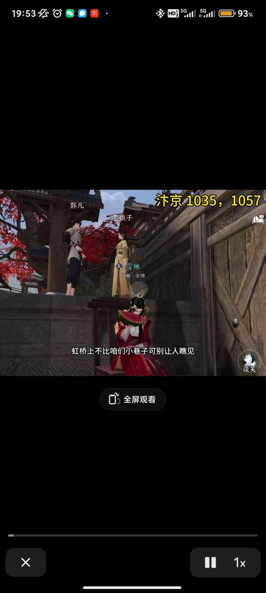 
 甚至有后续，告密之后这俩人都不来了

----

##### 25.[1] \<pid:705522596\> 2023-07-28 19:55:22 by Seebird
>[jump](#pid705520029) 悠悠死鱼(2023-07-28 19:39) 说: 
>
>我身边玩原神的都对顺活暖嗤之以鼻

鉴定为 usia neuma夺舍了

----

##### 26.[0] \<pid:705522621\> 2023-07-28 19:55:31 by 海上飘丝瓜
>[jump](#pid705522258) fealib(2023-07-28 19:53) 说: 
>
>两个城市，都不提建筑风格不同了
>就连城市气氛都做出了非常合理的区别
>一个纸醉金迷，一个隽秀婉约
>你原的“国风”，拿什么来比啊

原的国风，真的完完全全在靠角色撑着，不说现在的逆水寒，网易多少年前的一梦江湖和镇魔曲，从场景和文案什么的上都已经爆杀原了

----

##### 27.[0] \<pid:705522651\> 2023-07-28 19:55:43 by 药师鬼
今天做任务截图发了朋友圈(游戏里)，无情还给我留言对话了，，第一次这么感谢AI

----

##### 28.[0] \<pid:705522684\> 2023-07-28 19:56:01 by 碎冰op
>[jump](#pid705520861) 就随便起了个名字(2023-07-28 19:44):

是的，npc交流啥的真的很强
然后就是真的强度方面不太氪金，至少目前不需要氪一分钱，AI队友带飞就行

唯一难蚌的就是mmo特有的多人同时在线导致花里胡哨的界面。。。
这个可以设置去掉变得像原神，不过我个人会觉得mmo应该如此所以一直在尝试习惯结果一直难蚌

----

##### 29.[0] \<pid:705522858\> 2023-07-28 19:57:05 by 就随便起了个名字
>[jump](#pid705522684) 碎冰op(2023-07-28 19:56) 说: 
>
>是的，npc交流啥的真的很强
>然后就是真的强度方面不太氪金，至少目前不需要氪一分钱，AI队友带飞就行
>
>唯一难蚌的就是mmo特有的多人同时在线导致花里胡哨的界面。。。
>这个可以设置去掉变得像原神，不过我个人会觉得mmo应该如此所以一直在尝试习惯结果一直难蚌

今晚就下一个去看看，听你说感觉还不错

----

##### 30.[0] \<pid:705522896\> 2023-07-28 19:57:19 by 风之碧海之翠
谢邀，已经成了顺火暖群了

----

##### 31.[0] \<pid:705523440\> 2023-07-28 20:00:30 by 就随便起了个名字
>[jump](#pid705522471) 拿到了小孩角色卡噜(2023-07-28 19:54) 说: 
>
>超好玩，可以偷听npc偷晴，而且你还能去告诉他们的家人 
> 甚至有后续，告密之后这俩人都不来了

好家伙还能这么玩吗？已经在下载了

----

##### 32.[1] \<pid:705523573\> 2023-07-28 20:01:22 by 儿童文学
文案没有赛博露音癖已经爆杀原了官博运营再发癫游戏内的文本都是正经故事，反观某些捏鼻写国风的卖梗电商，嘻嘻

----

##### 33.[0] \<pid:705524023\> 2023-07-28 20:04:03 by Yumi42
确实不如顺火暖起码让人有逛地图和npc交互的欲望，原沙漠以来的地图连点开都不想点开

----

##### 34.[0] \<pid:705524082\> 2023-07-28 20:04:30 by Skalski_
快？原有智能npc吗

----

##### 35.[0] \<pid:705524153\> 2023-07-28 20:04:59 by 纠缠的狗
>[jump](#pid705519174) Emmmuuuu(2023-07-28 19:34) 说: 
>
>智能npc都不用提了
>就大轻功随便飞+地图上会标出没有完成的宝箱和解谜就已经完爆原神了 
>反观某赔钱货的升空是什么辣鸡，就这在原神里面还当成独一档的大世界体验来吹呢
>乐
>

同意

----

##### 36.[3] \<pid:705524813\> 2023-07-28 20:09:05 by 芒果布丁555
顺火暖糙确实糙，给我的感觉都比不上网易几年前的一梦江湖，但是玩还是好玩的，玩法多也没什么强制内容，顺火暖城市里面的烟火气薄纱你原

----

##### 37.[1] \<pid:705524951\> 2023-07-28 20:09:58 by 不想上班999号
虽然我完全不知道我在玩什么战斗装备对决什么的完全搞不懂，轻功我也经常控制不好飞过头，拿空中的东西经常飞来飞去飞好久，战斗手感也稀巴烂，画风也不是我喜欢的那款

但是真的大世界乱跑好有意思啊，我也没有做日活打卡的习惯，到现在新手七日都没做完，但就xjb乱跑也挺有意思的，有时候实在解密不了还能跟在别人身后蹭宝箱，虽然轻功玩不好也很喜欢蹭蹭蹭飞天玩

----

##### 38.[4] \<pid:705524959\> 2023-07-28 20:10:01 by 一个苦柚子
我之前玩剑三，所以我完全无法理解吹赔钱货的……

----

##### 39.[0] \<pid:705525123\> 2023-07-28 20:10:59 by 李孟安的老攻
虽然没玩过逆水寒，但我是真的不满意3.0以后的地图，除了堆料就是挖洞，奖励一点不增加只会让人疲劳

----

##### 40.[5] \<pid:705525337\> 2023-07-28 20:12:16 by 白苹果k
快比不上× 完全没法比&amp;#10003;
就一个烟火气原神怎么比啊，原神的城市真的很假，一眼感觉就是虚假的游戏而不是真实的世界

----

##### 41.[2] \<pid:705525702\> 2023-07-28 20:14:43 by 鱼什么都知道
本来我想喷昨天主角酒楼打工的剧情弱智的，但它给了我一套新衣服，这下不得不打工了

----

##### 42.[3] \<pid:705526221\> 2023-07-28 20:18:14 by 那可真是泰裤辣
另外补一下，不说别的，就说有些剧情能有不同的分支就秒杀你原了

----

##### 43.[1] \<pid:705526613\> 2023-07-28 20:20:47 by 戊康宋己师
别的不说，剧情真的很满意
神侯府团宠，大事件高光，爷就是整个故事的核心推手，追人过深可以算核心剧情转折
参与度超高，哪里都离不开爷，爷还真有用处(虽然经常是令牌的用处)，正面人物都能跟爷称兄道弟，剧情告一段落还能看见有人发朋友圈想我/吹我~~/骂我~~
人物塑造也特别好，戚少商真是一身侠骨的好汉子，结拜那里看得我头皮发麻，我宣布以后我就是戚大侠异父异母的亲妹子
就是nmd进入杭州一天开一段剧情，急死我了

----

##### 44.[0] \<pid:705526979\> 2023-07-28 20:23:22 by baiyefuxue
不妥，逆水寒的大世界体验远比原神好得多。
npc对话小场景和AI互动是真有东西，场景美术设计也好看，整体沉浸感非常强。
更不要说剧情文案薄纱原神了。
只要能忍受逆水寒这个稀烂的战斗手感，就很容易玩得开心，尤其是ml爱好者，主控的融入感和团宠感是真的好。

----

##### 45.[2] \<pid:705527157\> 2023-07-28 20:24:43 by 心累板蓝根
原神的大世界，无论自机还是npc，一旦离开了旅行者，时间仿佛就被暂停了一样，凝固在了那一个点，只有隔了很久很久之后文案想着诶该更新了，时间才开始流动

----

##### 46.[0] \<pid:705527179\> 2023-07-28 20:24:51 by baiyefuxue
玩了逆水寒后，对比起来明显感觉原神的大世界太苍白空洞了

----

##### 47.[0] \<pid:705527261\> 2023-07-28 20:25:25 by 星期八的虚
看老哥说得有点心动了。最喜欢玩也最熟的开放世界是老滚5，逆水寒跟老滚比怎么样。不是拉踩，就是想通过比较熟的游戏对比来看看逆水寒好不好玩，值不值得入坑

----

##### 48.[0] \<pid:705527353\> 2023-07-28 20:26:01 by Rean-7
那么崩铁npc和顺火暖比起来如何崩铁上线前访谈好像说非常重视npc互动，上线以后卖梗电商

----

##### 49.[2] \<pid:705527679\> 2023-07-28 20:28:17 by fealib
>[jump](#pid705526613) 戊康宋己师(2023-07-28 20:20) 说: 
>
>别的不说，剧情真的很满意
>神侯府团宠，大事件高光，爷就是整个故事的核心推手，追人过深可以算核心剧情转折
>参与度超高，哪里都离不开爷，爷还真有用处(虽然经常是令牌的用处)，正面人物都能跟爷称兄道弟，剧情告一段落还能看见有人发朋友圈想我/吹我~~/骂我~~
>人物塑造也特别好，戚少商真是一身侠骨的好汉子，结拜那里看得我头皮发麻，我宣布以后我就是戚大侠异父异母的亲妹子
>就是nmd进入杭州一天开一段剧情，急死我了

阵前结拜那里的处理，即使是背景板的耶律大石也一样不失角色魅力，一样的让人感觉也是条好汉子。
这才叫正常的文案，你游这垫来垫去的写法太恶心人了。

----

##### 50.[1] \<pid:705527692\> 2023-07-28 20:28:22 by 壬邝许巳华于
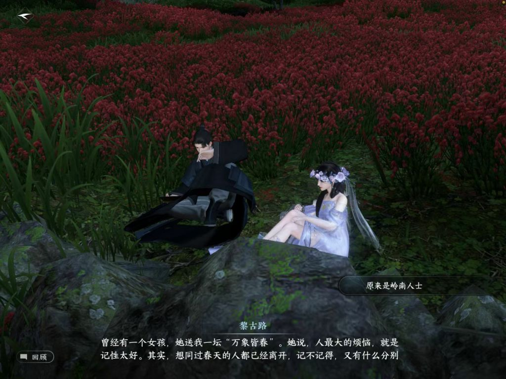

你原能写出这样的故事感？？

----

##### 51.[0] \<pid:705527758\> 2023-07-28 20:28:46 by 侵晓窥檐语丶
前几天在街上遇到了个和尚，他让我给他算姻缘还请我去喝酒吃肉。逆水寒的世界比原神灵动多了，路人的设定都千奇百怪还会随着你的互动变化态度。逆水寒的文案我没怎么注意，不过早年我玩网易的其他武侠游戏，不说剧情多好，但起码人都好好说话，不会给你掉书袋用生僻字让你感觉他就是在装逼还装不像，那些真的古文诗词也能看出文案是有水平的。

----

##### 52.[3] \<pid:705527932\> 2023-07-28 20:29:57 by 熹有长庚雨
>[jump](#pid705527353) Rean-7(2023-07-28 20:26) 说: 
>
>那么崩铁npc和顺火暖比起来如何崩铁上线前访谈好像说非常重视npc互动，上线以后卖梗电商

顺火暖往大世界扔了三十几个还是二十几个ai对话NPC来着崩铁拿头比

----

##### 53.[4] \<pid:705528010\> 2023-07-28 20:30:30 by 六界的雪
顺火暖家园还可以调四季，还有这么大个龙灯，我们原有吗，噢忘了三年海灯节都没有一条龙灯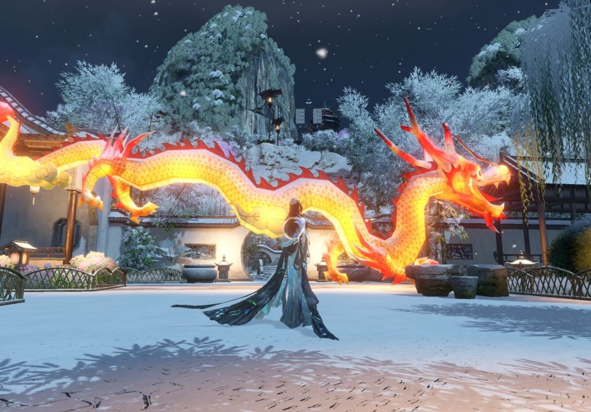

----

##### 54.[3] \<pid:705528194\> 2023-07-28 20:31:57 by 那可真是泰裤辣
>[jump](#pid705528010) 六界的雪(2023-07-28 20:30) 说: 
>
>顺火暖家园还可以调四季，还有这么大个龙灯，我们原有吗，噢忘了三年海灯节都没有一条龙灯

庄园四季的景色差别真的很明显

----

##### 55.[0] \<pid:705528303\> 2023-07-28 20:32:37 by 戊康宋己师
>[jump](#pid705527679) fealib(2023-07-28 20:28) 说: 
>
>阵前结拜那里的处理，即使是背景板的耶律大石也一样不失角色魅力，一样的让人感觉也是条好汉子。
>这才叫正常的文案，你游这垫来垫去的写法太恶心人了。

确实，逆子首先写了个好故事，所以人物立得住，那我自然就会喜欢~~并狂刷好感度~~
原神是故事故事不行，人设不能细究，抛开美术和厨子滤镜真是啥都不是
本来下逆水寒是为了凑热闹，结果现在出不去了

----

##### 56.[0] \<pid:705528337\> 2023-07-28 20:32:49 by 予晞
猪场虽然策划经常作死，但人家是真的想赚钱，流水下来有问题能改就改能道歉就道歉能跪就跪，因为流水低到一定程度项目会被砍
哪里像米啊，以80玩家的姿态设计，道歉是不可能的，跪是别想的，改是偷偷摸摸的

----

##### 57.[0] \<pid:705528708\> 2023-07-28 20:35:22 by 元莱字衮衮
玩原多了刚去顺火暖看到解谜都绕着走，问就是已经嫌麻烦了，后来发现别人解开了自己也能领，切元素技能什么的也不用读条，感觉找回解谜的热情了。
  然后路上捡箱子也不用担心漏，开个望气啥都解决了，不像在你原，神瞳挑战仙灵不标记一下不好核对数量，会漏(宝箱太多已经摆了，拒绝跟视频因为感觉像上班)。
  跑图啥的也没限制，大世界浪了几天才想起了去推主线接任务，没任何影响。(同样是被你原pua觉得做主线和任务麻烦)找关键npc和道具也有坐标，普通代币就能买自动寻路道具，不像在原只能自己根据地形判断去找。

----

##### 58.[0] \<pid:705528710\> 2023-07-28 20:35:22 by scoutqq
蟹妖,赛博割棉花已经一个星期了

----

##### 59.[0] \<pid:705529003\> 2023-07-28 20:37:08 by 宋酒酒捏
逆水寒真好玩，纯社恐人士甚至找的游戏搭子都同龄
回忆起在原，一问年纪都未成年的恐惧(……)

----

##### 60.[0] \<pid:705530425\> 2023-07-28 20:46:38 by 霜糖点点
如果逆水寒够赚钱网易会不会考虑重启搞阴阳师ip大世界的计划那我将毫不犹豫地弃原神而去

拜托了我真的很希望原神狗带然后来一大堆优质竞品

----

##### 61.[0] \<pid:705531500\> 2023-07-28 20:53:32 by MartiG
真的吗？我现在就去下载来体验一下！

----

##### 62.[0] \<pid:705531638\> 2023-07-28 20:54:25 by TooruW
>[jump](#pid705527692) 壬邝许巳华于(2023-07-28 20:28) 说: 
>
>
>
>
>你原能写出这样的故事感？？

这段已经看得emo了

----

##### 63.[0] \<pid:705532150\> 2023-07-28 20:58:01 by 青春派洛迪
在下载了在下载了朋友也力推，这就去加入无根门

----

##### 64.[0] \<pid:705532338\> 2023-07-28 20:59:13 by iphone28pro
顺火暖殊途同归玩法是真的不错，我懒得打本，光庄园种了几天菜就已经宗师了而且庄园有四季变化能下雪哎，这不薄纱垃圾尘歌壶，大世界解迷就更不用说了，人家顺火暖做大世界是想着加什么功能才能更方便玩家探索，而你原是想着怎么能更恶心玩家

----

##### 65.[0] \<pid:705532499\> 2023-07-28 21:00:29 by 媚宅不硬核
有的公司号称专利上百 但是3年多了 在游戏里几乎看不到任何技术进步
有的公司嘴上不说 但是却不停钻研新技术 一有成果立马运用到新游戏  

大部分玩家眼睛是雪亮的 他们只是来玩游戏 根本不追星  只要游戏做的好 就会买单  并且主动帮你安利

----

##### 66.[1] \<pid:705532964\> 2023-07-28 21:03:35 by 侵晓窥檐语丶
>[jump](#pid705522258) fealib(2023-07-28 19:53) 说: 
>
>两个城市，都不提建筑风格不同了
>就连城市气氛都做出了非常合理的区别
>一个纸醉金迷，一个隽秀婉约
>你原的“国风”，拿什么来比啊

吹原国风文输的我只认神女劈观，吹其他的建议去吃点好的

----

##### 67.[1] \<pid:705533005\> 2023-07-28 21:03:54 by 花瓣飘零
顺火暖如果真的像评级说的有千万月活的话，肯定是吸走了原神的很多轻度玩家，而他的大世界轻功也绝对砍到散兵吹的大世界能力的大动脉了

----

##### 68.[0] \<pid:705533387\> 2023-07-28 21:06:11 by 奔跑的苦茶子
>[jump](#pid705520029) 悠悠死鱼(2023-07-28 19:39) 说: 
>
>我身边玩原神的都对顺活暖嗤之以鼻

在，看看你自己还有“周围人”天数box练度氪度？别大火个个59、60在这骂，你和你小伙伴打本还得联机摇大火这种没品的人带、摇不到就动辄暴死破防吧

----

##### 69.[1] \<pid:705533508\> 2023-07-28 21:07:05 by 蛋黄的长裙
逆水寒剧情做好了真的有代入感的，问就是过主线被那对狼感动到了，结果和别人讨论才知道可以回顾剧情改结局的天知道我为了给乌云那个铁甲跑了多少图哈哈哈哈，但最后达成了好结局真的好有成就感(前面龙家三兄弟也能救

----

##### 70.[0] \<pid:705533984\> 2023-07-28 21:10:16 by 神奇毛球
逆水寒光从苹果榜来说，武侠手游能持续这么长时间的前五，质量绝对是上乘的。
我近期也在体验，可以这么说，系统的人性化是我这么多年来玩过的手游里最好的，是经过精心打磨的，玩过的就有体会。

----

##### 71.[0] \<pid:705534251\> 2023-07-28 21:11:56 by 朝云无觅
这玩意能三端互通吗

----

##### 72.[0] \<pid:705534266\> 2023-07-28 21:12:00 by ln271828
虽然建模跟好几年前玩的古风手游没什么区别，但是他的大世界探索让我做到了走到哪儿探索到哪儿，虽然是个网游但是也没啥战力焦虑是真的想怎么玩就怎么玩，每天跟npc对话充满了新鲜感

----

##### 73.[0] \<pid:705534404\> 2023-07-28 21:12:48 by biubiu222
真有这么好吗，我蝗到进城就润了

----

##### 74.[2] \<pid:705534666\> 2023-07-28 21:14:27 by 一只扁扁
我真的很爱武侠。玩原之前我玩的最久的就是剑三了。逆水寒给了我当时玩剑三的感觉哈哈哈。但是他的师徒系统真的很不行，而且年纪大了也社交不起来了，但是这游戏当个单机休闲也不错。
真的乐不思原了耶，而且人家有28的小裙子，穿上我觉得我是一只红通通的小锦鲤(。
我算是悟了、花个大几万满命一个心水角色还不如花钱让我自己变美
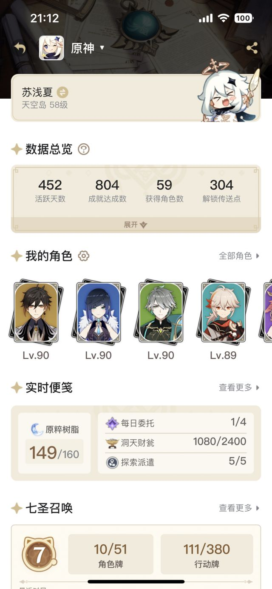
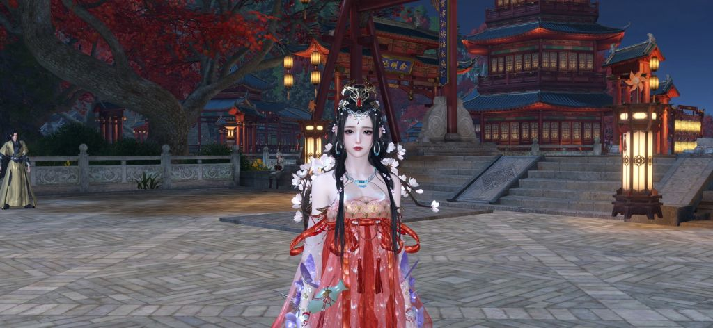

----

##### 75.[1] \<pid:705534784\> 2023-07-28 21:15:12 by 尽倾江河里
>[jump](#pid705534251) 朝云无觅(2023-07-28 21:11) 说: 
>
>这玩意能三端互通吗

哪来的三端，这是手游，pc端是模拟器

----

##### 76.[0] \<pid:705535090\> 2023-07-28 21:17:08 by kiyota119
逆水寒又让我回想起来我原本是一个讨厌ml团宠剧的玩家
我玩游戏一般比起ml，更喜欢搞角色之间
而这样的我，却真诚怜爱原神这边的ml玩家，甚至对mhy卖的每一对角色cp嗤之以鼻，确实是mhy让我变成这样的

----

##### 77.[0] \<pid:705535124\> 2023-07-28 21:17:22 by 水色晴月
动心了，想问下pc端和手机端互通吗

----

##### 78.[1] \<pid:705535141\> 2023-07-28 21:17:29 by YOFO
>[jump](#pid705522684) 碎冰op(2023-07-28 19:56):

关于人多花里胡哨：设置→显示，把人数调到0，右边把只显示可见人物名称勾上，然后世界清净

----

##### 79.[1] \<pid:705535304\> 2023-07-28 21:18:32 by 渣渣2000
>[jump](#pid705527353) Rean-7(2023-07-28 20:26) 说: 
>
>那么崩铁npc和顺火暖比起来如何崩铁上线前访谈好像说非常重视npc互动，上线以后卖梗电商

我昨天在虹桥口对别的npc说npc芊芊的坏话 然后还打了一个npc抢了他一个西湖醋鱼 今天再去虹桥口所有npc对我的态度都变了 他们走路我挡了他们的道他们就开始撞我 铁的npc有这么智能？

----

##### 80.[0] \<pid:705535396\> 2023-07-28 21:19:09 by 丑毛邵戊杨康
>[jump](#pid705533005) 花瓣飘零(2023-07-28 21:03)说:
>顺火暖如果真的像评级说的有千万月活的话，肯定是吸走了原神的很多轻度玩家，而他的大世界轻功也绝对砍到散兵吹的大世界能力的大动脉了，七圣召唤当年趁着网易暴雪解约的时候偷家，现在原锁住的拿来卖的大世界飞行渡河能力，文案爆典，阴阳怪气嘲玩家，主角边缘化，自机有自己的生活，有的角色500天不复刻，有的角色半年以上才有一次剧情还能写崩，凹人设，崩人设，大世界和自机0互动，npc无互动如死城，地图探索自由度极低，解密各方面给你找不痛快，还要在开放世界拿散兵语音内涵你：这你也要？活动4399换皮，半年出一次皮肤，100多的皮肤连动作也不舍得调一下，这些债也该慢慢还了吧，我会一直在理查看乐子的，相信内部的阴湿策划也在看吧，米这么纵容内部乱来，不会是在养猪吧，米要是裁员了，这些人去哪啊，大厂以后谁还敢要一年了整不出新活，研发技术能力也没有，文案写的也差，美术做的也不好看只会缝，思想品德还会爆雷的员工啊

对于手游来说千万月活其实很容易，逆水寒手游这个声量，绝对不止千万，首月mau起码得有个三四千万水平，虽然很多人都说跟原神不是一个赛道，但是实际上他确实在高速抢人

----

##### 81.[0] \<pid:705535481\> 2023-07-28 21:19:46 by 雾海漫游者
很喜欢体验逆水寒的剧情和各种身份探索，这次我不当强度党了

----

##### 82.[0] \<pid:705540294\> 2023-07-28 21:50:50 by 慕樊。
家园下雪多好看   还能一键摆放全套模板    更不谈能塞两套庄园进去
原的那个弱智壶能装啥  塞俩东西就负载不足  什么玩意儿
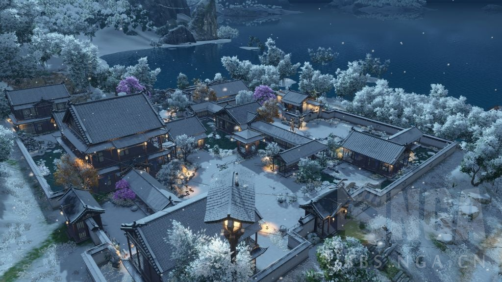

----

##### 83.[1] \<pid:705541979\> 2023-07-28 22:02:21 by 盆菜
就不说大世界了，我至今都记得退坑前想把自己喜欢的角色放在壶里，结果因为那个nc负荷，还得让我拆点家具才给放人

----

##### 84.[0] \<pid:705542483\> 2023-07-28 22:05:57 by 墨意一痕
很喜欢逆水寒的剧情分支设计，一些主线支线都有多分支多结局能感受到玩家的选择影响到了结局。
举几个例子：如果玩家能在宋辽开战前完成一个奇遇，为连云寨的两头狼拿到狼王甲，它们就会活下来，反之就会一只为了保护玩家而死一只殉情。还有个意图xq幼女被反杀的案件，姐姐为妹妹顶罪，玩家要帮助姐姐脱罪，中途玩家的选择会决定姐姐最终的判决，有四个结局。如果想体验其他结局，还可以开启二周目弥补遗憾。
而且逆水寒也有像顾惜朝这样的争议角色，官方说了以后也会安排剧情，让玩家决定他的去向和生死。
如果其他的剧情也能像这样做多分支，估计争议可能会小不少，至少讨厌其他的人心情能得到一定的安抚。只能说你原的文案既偏心又懒，本质还是想捧他的太子，而不是想写好一个故事

----

##### 85.[0] \<pid:705544656\> 2023-07-28 22:21:31 by 我的猫咪
真的很爱戚少商，我玩的是女性角色，他给我的感觉就是真正的侠骨柔情，有血有肉的男人还有我的师兄师姐是最爱我的人之一，更别提神侯府了，满满的安全感，只要进了神侯府没人敢欺负我

----

##### 86.[0] \<pid:705545364\> 2023-07-28 22:26:07 by Cecilia非羽
>[jump](#pid705540294) 慕樊。(2023-07-28 21:50) 说: 
>
>家园下雪多好看   还能一键摆放全套模板    更不谈能塞两套庄园进去
>原的那个弱智壶能装啥  塞俩东西就负载不足  什么玩意儿
>

这么美前原壶玩家一下子心动了
(为什么是前，当然是因为尘歌壶优秀的摆放系统啦)

----

##### 87.[0] \<pid:705545754\> 2023-07-28 22:28:47 by xiehuaijiu76
泥潭推荐了那么多次逆水寒手游，结果也没见到几个攻略指路
每次下载后都被各种UI和养成劝退

----

##### 88.[1] \<pid:705546275\> 2023-07-28 22:32:35 by 冬虫夏草花花茶
逆的世界是真的因为主角的选择有变化的。

弹琴的莲姨的大支线应该很多人都做过，我以为故友没见到就算完了。没想到今天去陶陶镇闲逛的时候，竟然又见到老人家了，当时是真的让我惊讶了。

她有老姐妹照顾，现在过的还不错，手毁了不能弹琴有点低落，但是主角安慰鼓励了她一番，老人家又打起精神准备写琴谱流传后世了。

还有汴京码头的小工，之前劝他回家，他说要考虑考虑，后来路过听周围他的工友npc聊天，他真的回家照顾母亲去了。我特意回村子去找他，结果这哥们儿真的在？！还准备相亲，相关npc的对话也都变了。

这种小支线很多的，探索的时候遇到熟人真的非常惊喜，有的npc过段时间还会给你寄信，告诉你ta现在的生活近况。

我觉得这才是真正的“角色有自己的生活”。

所以技术力再高，渲染的再好有什么用，冷冰冰的纸片人永远没有人间烟火气打动人。

----

##### 89.[0] \<pid:705547334\> 2023-07-28 22:39:30 by fealib
>[jump](#pid705545364) Cecilia非羽(2023-07-28 22:26) 说: 
>
>这么美前原壶玩家一下子心动了
>(为什么是前，当然是因为尘歌壶优秀的摆放系统啦)

他这庄园是真不卡进度一天能肝到满级
建筑只要你资源够也是秒建
自己直接自带自由模式，随便穿模浮空界外
模板可以直接保存，你材料不够还有个试验场给你建筑全开试建
试过一回就能明白mhy卡人卡的有多死了

----

##### 90.[0] \<pid:705547431\> 2023-07-28 22:40:05 by Inquisit
>[jump](#pid705545364) Cecilia非羽(2023-07-28 22:26) 说: 
>
>这么美前原壶玩家一下子心动了
>(为什么是前，当然是因为尘歌壶优秀的摆放系统啦)

这只是普通模板，大佬能弄的比这还好看很多可以去阿b搜搜看，自由度超高整什么活的都有，而且有设计站不需要资源就能玩，我觉得寒的庄园可以说是结合了市面上mmo家园的大部分优点了，一端上来就是成品系统喜欢这玩法不试可惜了(怂恿

----

##### 91.[2] \<pid:705547502\> 2023-07-28 22:40:29 by 红绳会太子
被原剧情pua惯了来逆水寒突然变成团宠还真惊喜，天下第一的关系户师兄师姐师弟师傅全都把我哄着宠着，下山了四大名捕也全都是我师兄文案也好逻辑通畅，卖ml没给我很违和刻意讨好的感觉，而是真的和师姐度过了这么久时光看到师姐心一下就软了这就是当团宠的感受吗

----

##### 92.[0] \<pid:705547792\> 2023-07-28 22:42:25 by Inquisit
>[jump](#pid705544656) 我的猫咪(2023-07-28 22:21) 说: 
>
>真的很爱戚少商，我玩的是女性角色，他给我的感觉就是真正的侠骨柔情，有血有肉的男人还有我的师兄师姐是最爱我的人之一，更别提神侯府了，满满的安全感，只要进了神侯府没人敢欺负我  手粽版老踩逆水寒我以为我玩错了

太平有象那里符合条件拿神侯令出来搜查的NPC会真说在无情身边见过我然后毕恭毕敬走人不管了，虽然奖励没区别但狐假虎威的感觉就是爽
虽然ml浓度拉满但真能感觉他们自己有自己的事在办互相有交流还抽空关心我，杭州能遇到金剑银剑被出题去办案，能遇到冷血给神侯府大家买书还有我的份，连跟路边老头八卦帮大娘找鹅都能开出可攻略角色的支线，而原我在蒙德做了半年日常只碰到过一次艾米

----

##### 93.[0] \<pid:705548022\> 2023-07-28 22:43:54 by EIVAAAA
>[jump](#pid705532150) 青春派洛迪(2023-07-28 20:58):

已经玩上了，现在像个萌新站在大街上看见一群奇装异服的人不知所措

----

##### 94.[0] \<pid:705548154\> 2023-07-28 22:44:49 by 请看签名
原哪里比得上逆水寒？大世界就不说了，就凭代入感，原的文案他除了玩梗和发闹骚还有什么？哦还有岁月史书恶人甄姬，我作为有正常三观和道德的人当然选择润去逆水寒。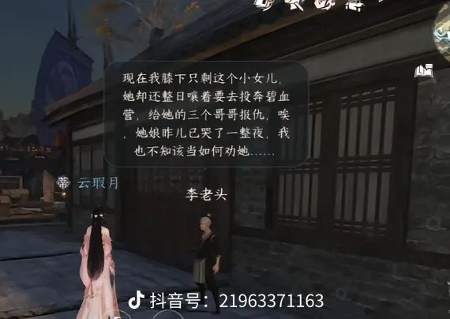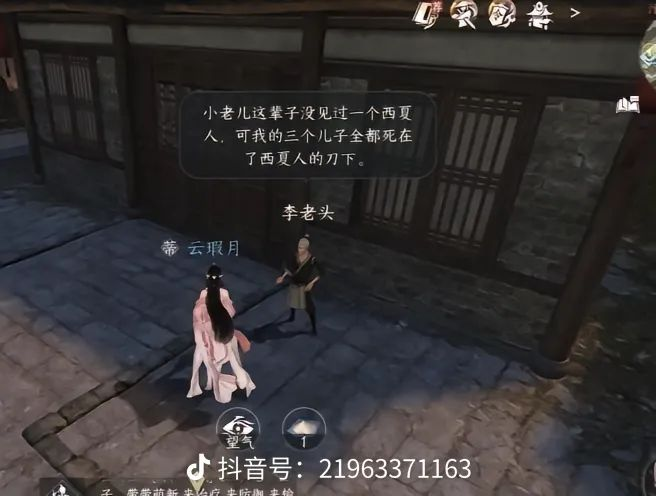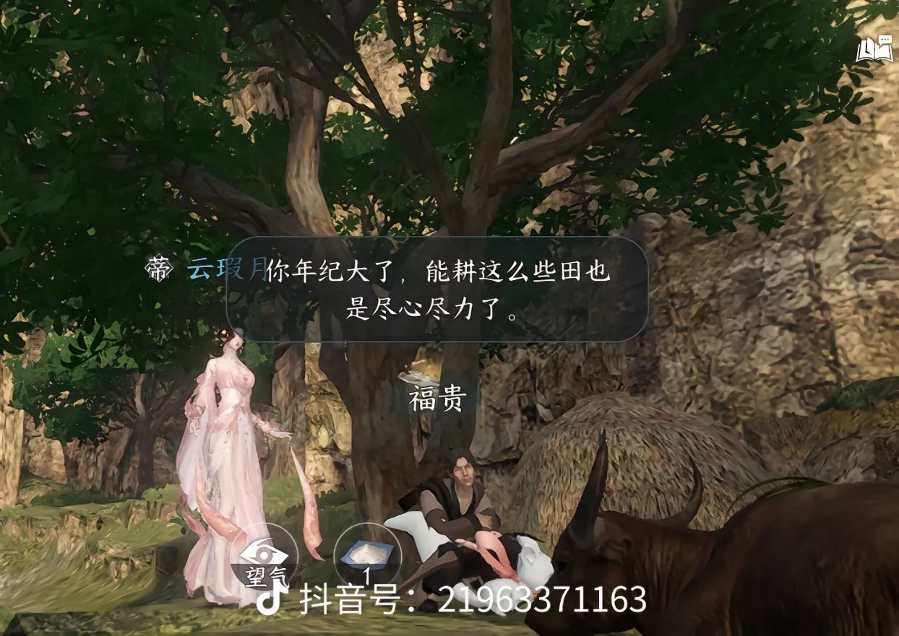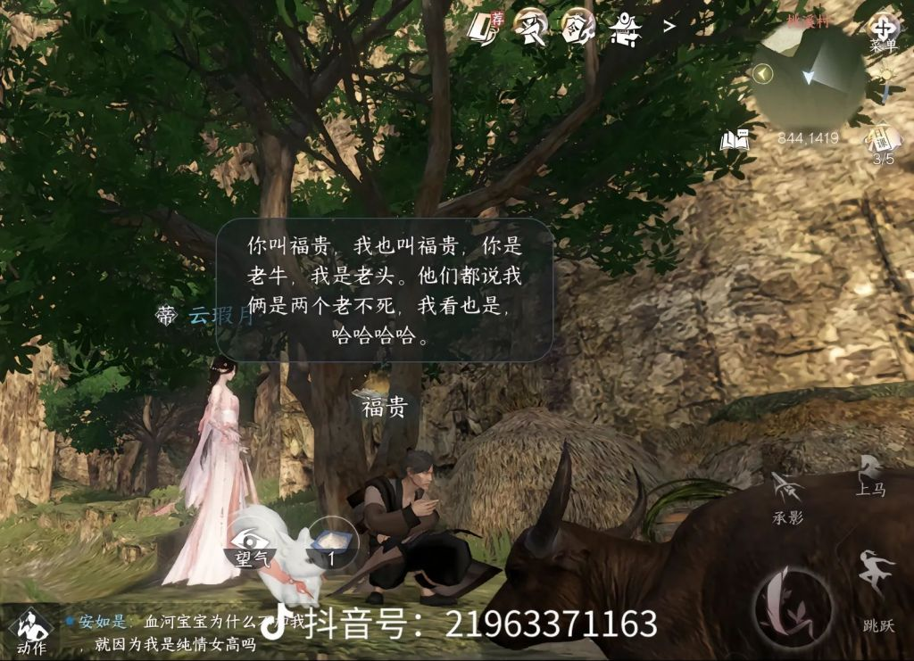光看图上这些话，我就觉得逆水寒编剧比为了看同人女撕架故意写角色之间爱恨情仇的阴虱文案好的多。之前的五日流派剧情，篇幅虽短但每个流派的坚守和信念都完美演绎出来，如果是原神来写，是不是要变成3.6学院争霸啊。更别说逆水寒NPC真的很多，对话也不是完全固定，我无聊去点对话还能增加剧情点。原的NPC就突出一个任务工具人催泪工具人。

----

##### 95.[0] \<pid:705548598\> 2023-07-28 22:47:45 by Asche1017
大地图上有活人的感觉真的很好(不是说玩家，就是指npc)会聊天，也有自己的生活轨迹，旁观/聊两句还有各种小任务，没有时限，也没有什么卡顿，很完整很丰满。

----

##### 96.[0] \<pid:705549000\> 2023-07-28 22:50:25 by 159357呵
人类的底蕴要被lowb文案忘完了吧，毕竟只顾着发泄负能量和不满了
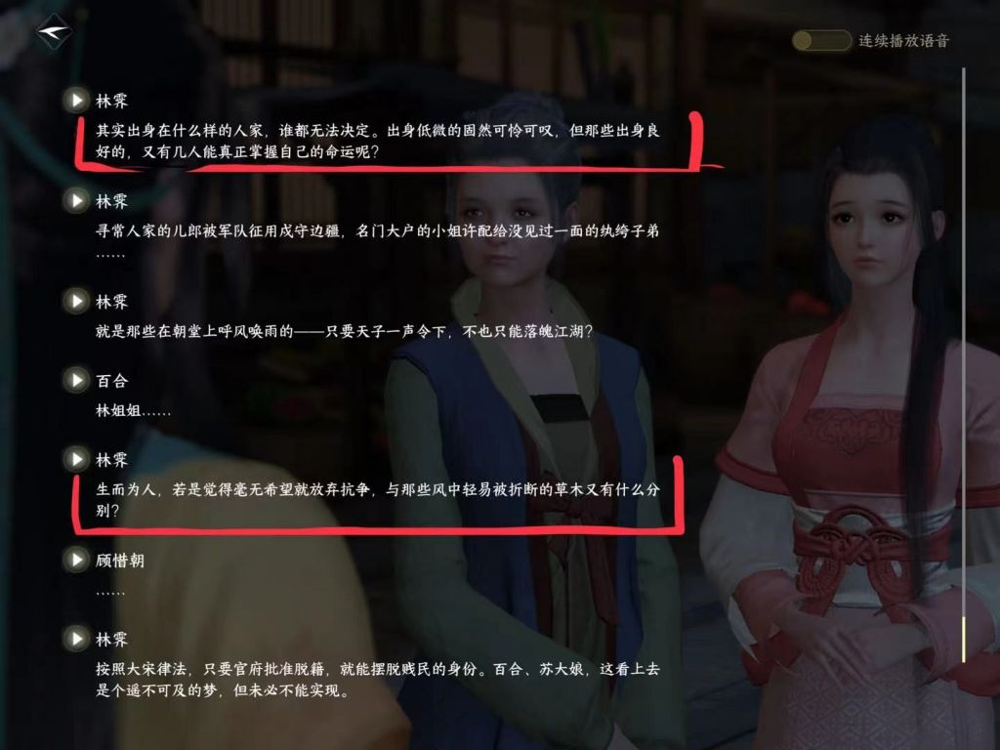

----

##### 97.[0] \<pid:705549033\> 2023-07-28 22:50:42 by wen646dao
以前没玩过网易，感觉顺火暖确实有点“会呼吸的江湖”内味了。
我甚至因为在城里烧npc被官差追着打，就凭这个小细节够保持我好长一段时间的游戏热情了。

----

##### 98.[0] \<pid:705549113\> 2023-07-28 22:51:09 by 猜你想看
>[jump](#pid705528010) 六界的雪(2023-07-28 20:30):

还有龙筝 原神做得到吗
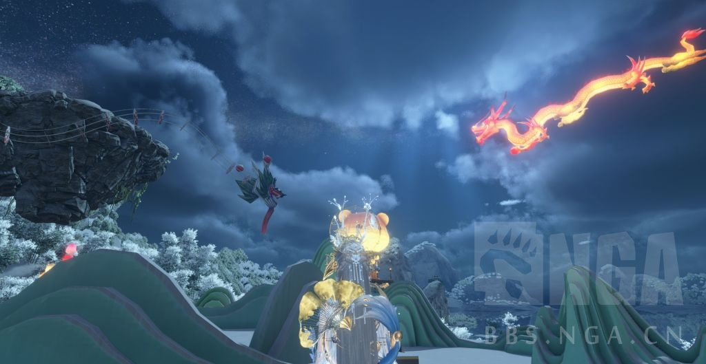

----

##### 99.[0] \<pid:705549120\> 2023-07-28 22:51:10 by UID43055609
>[jump](#pid705545754) xiehuaijiu76(2023-07-28 22:28) 说: 
>
>泥潭推荐了那么多次逆水寒手游，结果也没见到几个攻略指路
>每次下载后都被各种UI和养成劝退

就是闭着眼睛跟着指引走，走完指引就看你喜欢哪方面了
大世界探索可以点望气，指引没开的箱子
PvP在竞技里，33和12V12
pve主打副本，想和玩家玩就普通组队，想单机就选单人，系统自动匹配Ai大腿队友。几个日常本现在都可以等级碾压，武林英雄录普通也是，英雄可能吃点练度，但问题不大。舞阳内外城普通是目前最难的本，大概得拉一拉装备练度再进，英雄舞阳城还没开，1.2版本新开的爬塔还没玩暂时不知道啥情况
PvX这边更是多种多样，庄园种田养殖装修一应俱全，文字游戏混江湖一周两次，身份玩法就是各种副职，所有职业都可以学，不想慢慢做东西升级还可以挂机打工；游历玩法类似于挂机，其他各种各样杂七杂八的小游戏更是堆满整个地图
~~来试试吧！真的很好玩，突出一个不知道自己在干啥但就是能玩很久~~

----

##### 100.[3] \<pid:705549433\> 2023-07-28 22:52:58 by 厉害费多大劲
剧情分支做的不错，里面做了一个潘金莲的奇遇，我劝她离婚，结果她真离了，后来跑去开封做绣品，不靠男人靠自己，自己把日子过得红红火火
后来去搜了一下其他结局，发现主角的抉择是真的可以影响一个NPC的人生
而不是像原里，一直被编剧按头
还有那个崽种xq幼女，然后被反杀的案子。虽然有点冗长，但后面结尾的话真的挺让人感触的，你和所有人的努力，不仅为这对姐妹讨回公道，还让以后的受害者都能在面对伤害时，有勇气拿起武器防卫
那一瞬间感觉自己真的是行侠仗义的少侠，做了一件了不得的大事，保护了受到不公正待遇的弱小
现在我已经不指望原的编剧策划三观像正常人，我只希望他们能学逆水寒的分支设计 把他们的阴湿XP藏在那些根本就不会有人选的选项里，饶了玩家们吧
但凡原的3.3和3.6能像隔壁一样出剧情分支，我现在都能跟他们和解

----

##### 101.[0] \<pid:705549947\> 2023-07-28 22:56:19 by cfsbmbh
我捡了条鱼，然后就有个捕快带着条狗来抓我，让我赔钱我当然不赔了，然后打了他一顿……这样看我好像一个带恶人……偷小姑娘的鱼还打人……

----

##### 102.[0] \<pid:705550085\> 2023-07-28 22:57:17 by 尘世の闲游
体验完了隔壁望气(类原神元素视野)一键标记宝箱位置，我是真不想回来带个寻宝罗盘钻地洞了

----

##### 103.[0] \<pid:705550133\> 2023-07-28 22:57:38 by Cecilia非羽
>[jump](#pid705547431) Inquisit(2023-07-28 22:40) 说: 
>
>这只是普通模板，大佬能弄的比这还好看很多可以去阿b搜搜看，自由度超高整什么活的都有，而且有设计站不需要资源就能玩，我觉得寒的庄园可以说是结合了市面上mmo家园的大部分优点了，一端上来就是成品系统而且不花钱只花绑定玉喜欢这玩法不试可惜了(怂恿

在下载了

----

##### 104.[0] \<pid:705550360\> 2023-07-28 22:59:20 by 雾海漫游者
还有很多人吐槽的一生一世一双人，但我当时第一次做还是不争气的流下了眼泪任务结束后配上bgm和悬崖俯视巨大的漩涡给人一种强烈的孤独感，，，后来为了达成he结局真是折腾了好半天，他那些任务我都不是冲着奖励去的，看着还是挺共情的

----

##### 105.[2] \<pid:705550488\> 2023-07-28 23:00:07 by jasmine4869
什么都没干，一直在那里弹琴跳舞，把自己打扮得花里胡哨，还有种菜养猪

----

##### 106.[1] \<pid:705550595\> 2023-07-28 23:00:48 by 冬虫夏草花花茶
>[jump](#pid705548022) EIVAAAA(2023-07-28 22:43):

最近有带新系统，需要帮助直接世界或者新人频道喊一嗓子，大把老东西如狼似虎的扑上来带你到毕业。

如果只想单机的话，设置选择玩家同屏数量0，旁边id显示数量同玩家显示数量打开，现在除了组队打本，就是纯单机了。

ui随自己习惯可以自由编辑。

一般觉着ui太乱是自己没搞清楚设置，逆水寒的东西太多了，引导做的不是很好。

----

##### 107.[0] \<pid:705550600\> 2023-07-28 23:00:52 by 天涯墨刀
>[jump](#pid705522101) 那可真是泰裤辣(2023-07-28 19:52) 说: 
>
>我也来吹一下 大家记得做传闻里的人间和红尘
>感觉逆水寒的编剧真的很会写，昨天在雁门关做了一个卖酒的老板娘和走镖的故事，全篇没有一个字提到他俩有情情爱爱，但是做完了你就能琢磨出来这两人肯定指定有点啥……
>任务快结束，两个人闲聊对话差不多有下面的:
>女:&quot;你那两个徒弟现在在哪儿呢？&quot;
>男:&quot;长大了，去了别的镖局闯荡了…&quot;
>女:&quot;无情无义的人走不远。&quot;
>我看到那句无情无义的人走不远真的停下来回味了一下。
>编辑:这个任务名字叫 边城故人，有几句对白的留白真的能让你脑补出很多故事，建议做

卧槽古龙那味有了！今晚就去下载

----

##### 108.[2] \<pid:705551169\> 2023-07-28 23:04:48 by YuXiOtt
才知道原来可以让乌云活下来，还有龙家三兄弟，我这就去改变世界线。
以及逆子是真的崆峒，男女主角的剧情是有差分的，男主剧情和师姐等女性角色交互会多一点，女主是师兄，而且装扮方面，男主没法开启美甲系统~~男生美个甲怎么你了~~

----

##### 109.[0] \<pid:705551342\> 2023-07-28 23:06:11 by EIVAAAA
>[jump](#pid705550595) 冬虫夏草花花茶(2023-07-28 23:00)说:
><b>Reply to [pid=705548022,37173772,5]Reply[/pid] Post by [uid=65095447]EIVAAAA[/uid] (2023-07-28 22:43)</b>  最近有带新系统，需要帮助直接世界或者新人频道喊一嗓子，大把老东西如狼似虎的扑上来带你到毕业。  如果只想单机的话，设置选择玩家同屏数量0，旁边id显示数量同玩家显示数量打开，现在除了组队打本，就是纯单机了。  ui随自己习惯可以自由编辑。  一般觉着ui太乱是自己没搞清楚设置，逆水寒的东西太多了，引导做的不是很好。

原来如此，感谢你

----

##### 110.[4] \<pid:705551352\> 2023-07-28 23:06:15 by 罗德羽兰
逆水寒确实不错，很多任务都能做分支结局让我觉得我不是个摄像头，真真正正的在这个江湖里，可以影响他们的结局，改变些既定的悲剧
轻功也好玩，大世界也舒服，打本抱npc大腿也轻松，送的衣服坐骑也好看，推主线就送了我好几套好看的，就是没有玄机荒羽玩，等以后手游更新了肯定跑去转职
唯一不满的就是，加情缘npc师兄师姐无情还有白发姐姐我都不要，我要铁手追命和大哥

----

##### 111.[3] \<pid:705551376\> 2023-07-28 23:06:25 by 159357呵
>[jump](#pid705550600) 天涯墨刀(2023-07-28 23:00) 说: 
>
>卧槽古龙那味有了！今晚就去下载

本体的温瑞安和古龙文风就有点点像

----

##### 112.[0] \<pid:705551523\> 2023-07-28 23:07:36 by fealib
>[jump](#pid705550360) 雾海漫游者(2023-07-28 22:59) 说: 
>
>还有很多人吐槽的一生一世一双人，但我当时第一次做还是不争气的流下了眼泪任务结束后配上bgm和悬崖俯视巨大的漩涡给人一种强烈的孤独感，，，后来为了达成he结局真是折腾了好半天，他那些任务我都不是冲着奖励去的，看着还是挺共情的

很多任务都是给个任务相关的配饰，相关的江湖武学，给个有故事的独珍装备。
这些显然不如直接给原石直接，价值也不一定比原石高。
但却更能让人把关注度放在故事本身上，最后给人的沉浸感和满足感会高出很多。

当然，这一切的前提都是文案别犯病。

----

##### 113.[0] \<pid:705551814\> 2023-07-28 23:09:38 by Flappa
在汴京街上惹了个npc打了一架，结果转头就被通缉了，在你原要是对npc舞枪弄棒根本nbcs
还有我在顺火暖加入无根门，本来都忘了这茬了，今天在镜湖跟别的玩家做了公主抱动作结果无根门火速发信来斥责我，笑死了

----

##### 114.[0] \<pid:705552045\> 2023-07-28 23:11:21 by 桑葚煮酒
>[jump](#pid705533005) 花瓣飘零(2023-07-28 21:03) 说: 
>
>顺火暖如果真的像评级说的有千万月活的话，肯定是吸走了原神的很多轻度玩家，而他的大世界轻功也绝对砍到散兵吹的大世界能力的大动脉了，七圣召唤当年趁着网易暴雪解约的时候偷家，现在原锁住的拿来卖的大世界飞行渡河能力，文案爆典，阴阳怪气嘲玩家，主角边缘化，自机有自己的生活，有的角色500天不复刻，有的角色半年以上才有一次剧情还能写崩，凹人设，崩人设，大世界和自机0互动，npc无互动如死城，地图探索自由度极低，解密各方面给你找不痛快，还要在开放世界拿散兵语音内涵你：这你也要？活动4399换皮，半年出一次皮肤

我经常在各种地方看到一个说法“米哈游的经历可以给简历镀金”，不清楚真的假的，我也不干这行

----

##### 115.[0] \<pid:705552264\> 2023-07-28 23:13:00 by 159357呵
>[jump](#pid705551523) fealib(2023-07-28 23:07) 说: 
>
>很多任务都是给个任务相关的配饰，相关的江湖武学，给个有故事的独珍装备。
>这些显然不如直接给原石直接，价值也不一定比原石高。
>但却更能让人把关注度放在故事本身上，最后给人的沉浸感和满足感会高出很多。
>
>当然，这一切的前提都是文案别犯病。

也不一定就比不上。原石=抽卡，这是原神最主要的消费途径。
但顺火暖里卖衣服可不是它消费内容中的边边角角啊

----

##### 116.[0] \<pid:705552820\> 2023-07-28 23:17:19 by 夭叶舒华
>[jump](#pid705551352) 罗德羽兰(2023-07-28 23:06) 说: 
>
>逆水寒确实不错，很多任务都能做分支结局让我觉得我不是个摄像头，真真正正的在这个江湖里，可以影响他们的结局，改变些既定的悲剧
>轻功也好玩，大世界也舒服，打本抱npc大腿也轻松，送的衣服坐骑也好看，推主线就送了我好几套好看的，就是没有玄机荒羽玩，等以后手游更新了肯定跑去转职
>唯一不满的就是，加情缘npc师兄师姐无情还有白发姐姐我都不要，我要铁手追命和大哥

可能性不大这几个都是有官配的，不过原作戚少商跟他对象息红泪be了，息红泪嫁了诸葛春水，戚少商复仇，后来又追逐李师师

----

##### 117.[1] \<pid:705552973\> 2023-07-28 23:18:21 by UID43055609
逆水寒文案还有一点让我感触颇深的是汴京城咋一看灯红酒绿歌舞升平，是个繁华又安宁的昌盛之都
但只要多和街头巷尾npc们对话，就能看见贵族们的纸醉金迷背后大厦将倾的前兆
雁门关与杭州汴京就像两个世界，边城的军队鱼肉乡民，前线沦落到要靠义军支撑。卖樱桃的大爷看似贪小便宜耍心眼，实际上是因为贵族们想要樱桃，便逼着种橘子的农户们把长势良好的橘子树全砍了改种水土不服的樱桃，导致收获惨淡只能用这种办法骗一口饭吃……尽管有识之士在奋力奔走试图悬崖勒马，但既定的历史不会改变如果游戏能够持续运营下去，汴京迟早会有城破家亡那一天的

----

##### 118.[0] \<pid:705553715\> 2023-07-28 23:23:32 by 橘枕…
之前不小心烧了个npc头发，后来见到了他找我要赔偿，我当然不给，于是我们打起来了
完事他没打过我，还悬赏我，还有玩家接悬赏
给我气的时候见他一次打一次，现在好感度已经是十分厌恶了
虽然我很无语，到真的挺有代入感的

----

##### 119.[0] \<pid:705553925\> 2023-07-28 23:25:05 by qiu丘
那个轻功好酷?真的有江湖的感觉

----

##### 120.[5] \<pid:705553978\> 2023-07-28 23:25:28 by fealib
[quote][pid=705552973,37173772,6]Reply[/pid] <b>Post by [uid=43055609]UID43055609[/uid] (2023-07-28 23:18):</b>

逆水寒文案还有一点让我感触颇深的是汴京城咋一看灯红酒绿歌舞升平，是个繁华又安宁的昌盛之都
但只要多和街头巷尾npc们对话，就能看见贵族们的纸醉金迷背后大厦将倾的前兆
雁门关与杭州汴京就像两个世界，边城的军队鱼肉乡民，前线沦落到要靠义军支撑。卖樱桃的大爷看似贪小便宜耍心眼，实际上是因为贵族们想要樱桃，便逼着种橘子的农户们把长势良好的橘子树全砍了改种水土不服的樱桃，导致收获惨淡只能用这种办法骗一口饭吃……尽管有识之士在奋力奔走试图悬崖勒马，但既定的历史不会改变

相比你原逃避了三年的“大药”…

----

##### 121.[0] \<pid:705554250\> 2023-07-28 23:27:35 by 药师鬼
你们这群火烧npc的是不是就想被铁手大哥逮啊？在虹桥站了一下，铁手出来两次追小师妹带去大牢……

游戏里有很多物品可以给npc看。比如春宫图，师兄会沉默一会问你“是不是看完了”，铁手老司机会说怎么还是旧版没出新……

----

##### 122.[0] \<pid:705554284\> 2023-07-28 23:27:52 by ballax
>[jump](#pid705548154) 请看签名(2023-07-28 22:44):

看最后两张图就想到了活着，唉

----

##### 123.[1] \<pid:705554473\> 2023-07-28 23:29:09 by 能做的岂止如此
>[jump](#pid705548154) 请看签名(2023-07-28 22:44) 说: 
>
>原哪里比得上逆水寒？大世界就不说了，就凭代入感，原的文案他除了玩梗和发闹骚还有什么？哦还有岁月史书恶人甄姬，我作为有正常三观和道德的人当然选择润去逆水寒。[img]./mon_20230

虽然但是，后面这两张图是明牌引用的余华老师《活着》吧强烈推荐大家品味这本书，我当时高中晚上为了看完这本书没回宿舍导致没洗成澡但是值得

----

##### 124.[0] \<pid:705554619\> 2023-07-28 23:30:20 by 扶光む
>[jump](#pid705548154) 请看签名(2023-07-28 22:44) 说: 
>
>原哪里比得上逆水寒？大世界就不说了，就凭代入感，原的文案他除了玩梗和发闹骚还有什么？哦还有岁月史书恶人甄姬，我作为有正常三观和道德的人当然选择润去逆水寒。[img]./mon_20230

福贵这里应该是取材于余华的《活着》，如果俺没记错的话

----

##### 125.[0] \<pid:705554623\> 2023-07-28 23:30:21 by 冬虫夏草花花茶
要喜欢古龙或者武侠的话，真的可以体验一下剧情。他家文案是真的有点东西的。

我之前掉悬崖触发的几个奇遇：

要么荒村、破店、美艳老板娘；要么山洞，火把，破烂巨棺；要么桃花源中隐世高人，只闻笛音不见其人；要么巨鹰救了“我”，一声鹰唳中巨鹰远去，而“我”追寻不可得……

很多小奇遇都没几句话的，但是真的……有的恐怖的让我起鸡皮疙瘩，有的又让人怅然若失……

模型确实糙，但是那个氛围感，拉满。

----

##### 126.[0] \<pid:705557126\> 2023-07-28 23:48:27 by Inquisit
>[jump](#pid705553978) fealib(2023-07-28 23:25) 说: 
>
>短短的开篇剧情，就出场了徽宗柔福岳飞赵构这些如雷贯耳的角色们，体会完东京梦华，立刻就把你赶去残破边关，我只能说文案的野心是真的昭然若揭的
>想想也是，能在如此大的平台上，由自己书写千古奇难靖康耻这种历史大事，我要是文案我都高潮了
>
>相比你原逃避了三年的“大药”…

猪场不会不敢写的，隔壁一梦已经写到战乱了，可惜游戏太逼氪而且抠门网易没续版权前面剧情改的一团乱。人哪怕麦南通都比mhy麦的带劲多了，讲好故事才是重点，主旨都是家国恩义而且惨的头掉
原就是不敢下死手虐自机，写剧情也没笔力感动人，刀一个路人有什么好刀的，但凡其他的三次背叛重量级亿点都不至于显得这么消愁

----

##### 127.[1] \<pid:705557388\> 2023-07-28 23:50:10 by 硫酸氢
我就说一点，目前顺火暖我作为白嫖玩家，体验还是相当不错的，但我点开官方微博发现评论都是一顿骂，我只能说完爆你原好吧

----

##### 128.[2] \<pid:705558126\> 2023-07-28 23:55:35 by XREXXX
>[jump](#pid705551523) fealib(2023-07-28 23:07) 说: 
>
>很多任务都是给个任务相关的配饰，相关的江湖武学，给个有故事的独珍装备。
>这些显然不如直接给原石直接，价值也不一定比原石高。
>但却更能让人把关注度放在故事本身上，最后给人的沉浸感和满足感会高出很多。
>
>当然，这一切的前提都是文案别犯病。

顺火暖里我最喜欢的剧情奖励是衣服，哪怕那衣服不好看
给原石这种抽卡道具真的很没劲，当然给原石肯定省了我充的钱。但是最好还是能不用抽卡和养角色，问就是被原神给的扣扣搜搜的抽卡资源，和养一个角色要花的精力给搞怕了。~~我有个号海哥抽了后一直是40级，那号没有草神，反正40级海哥也不影响我大世界体验海行久瑶(瑶瑶也是40级)~~

----

##### 129.[0] \<pid:705558208\> 2023-07-28 23:56:14 by 熹有长庚雨
>[jump](#pid705535124) 水色晴月(2023-07-28 21:17) 说: 
>
>动心了，想问下pc端和手机端互通吗

pc有两个，一个是正经端游，另一个是套了层模拟器皮的手游pc版，手游怎么会不互通呢

----

##### 130.[0] \<pid:705558687\> 2023-07-28 23:59:46 by ohgscn
逆水寒的江湖沉浸感很足的，比如你夸赞npc会提升江湖善名，你去劫法场会增加江湖悬赏值；
可以和npc贴贴，npc会给你送钱送东西；

----

##### 131.[0] \<pid:705559388\> 2023-07-29 00:05:07 by 芙芙蓉蓉
>[jump](#pid705522596) Seebird(2023-07-28 19:55) 说: 
>
>鉴定为 usia neuma夺舍了

usia neuma是啥？

----

##### 132.[0] \<pid:705559971\> 2023-07-29 00:09:39 by TooruW
>[jump](#pid705552820) 夭叶舒华(2023-07-28 23:17) 说: 
>
>可能性不大这几个都是有官配的，不过原作戚少商跟他对象息红泪be了，息红泪嫁了诸葛春水，戚少商复仇，后来又追逐李师师

不是赫连春水吗

----

##### 133.[1] \<pid:705560229\> 2023-07-29 00:11:59 by xlsq03
你原能给我这种简单朴素的快乐吗
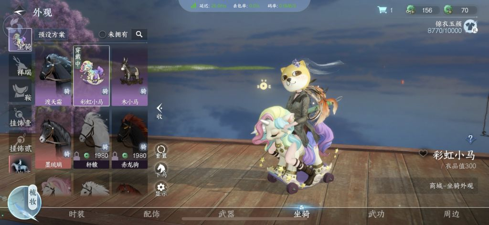
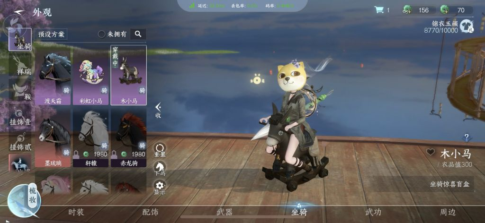
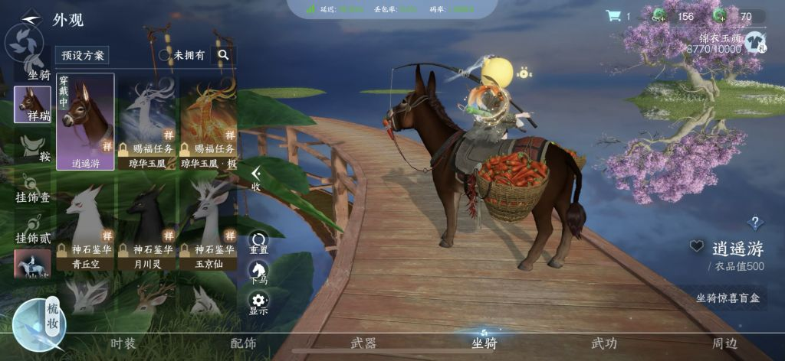

----

##### 134.[0] \<pid:705560962\> 2023-07-29 00:18:23 by 碎冰op
>[jump](#pid705535124) 水色晴月(2023-07-28 21:17):

官网那个所谓的mumu模拟器版就是电脑端，好像是因为没版号只能这么叫
必须手机扫码不能直接电脑登。。。
如果手机只打算用来扫码电脑玩，手机可以下云逆水寒不需要下完整客户端

----

##### 135.[0] \<pid:705561007\> 2023-07-29 00:18:49 by xlsq03
>[jump](#pid705551814) Flappa(2023-07-28 23:09) 说: 
>
>在汴京街上惹了个npc打了一架，结果转头就被通缉了，在你原要是对npc舞枪弄棒根本nbcs
>还有我在顺火暖加入无根门，本来都忘了这茬了，今天在镜湖跟别的玩家做了公主抱动作结果无根门火速发信来斥责我，笑死了

我之前天天捅别人屁股最终被逐出平天门
就是说有时候可以不要这么真实……！

----

##### 136.[0] \<pid:705561102\> 2023-07-29 00:19:29 by C6H7O8
顺火暖如果能适应它的风格还真的不错的，而且确实量大管饱，刚开服猪厂也算得上良心

----

##### 137.[1] \<pid:705562510\> 2023-07-29 00:31:29 by xlsq03
对了，顺火暖有些可以拿技能的小支线写得非常不错
比如这个支线，开启支线其中一个方式是坐牢，但它整个支线的中心思想却是赎罪，这个吊儿郎当的“狱警”背后的故事也很让人动容
他训斥我的样子就真的很像老大哥一样……
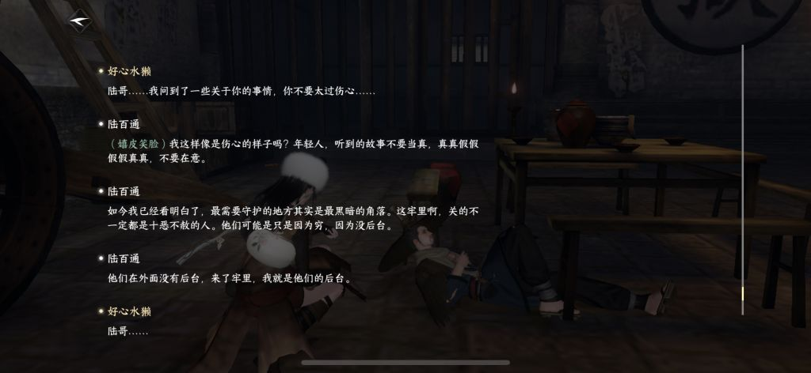
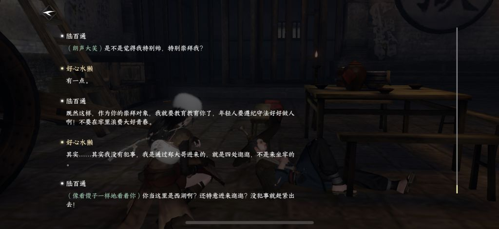

----

##### 138.[0] \<pid:705563526\> 2023-07-29 00:40:33 by SamidareTacho
有人说过了吗，单人打本换铁衣(别的暂时没发现)有几率刷出那个酒鬼师兄追命，还会有特殊发言，比如说打架不叫他，要给你秀两手；血量低了会叫你先走开避一避；被打了他会说敢伤我师弟/师妹，要叫你(boss)百倍偿还还是怎么个成语的这种小彩蛋真的很有意思，让人会心一笑那种感觉

----

##### 139.[0] \<pid:705564225\> 2023-07-29 00:46:26 by 雁行未晓
逆水寒的大世界地图的地形设计可能不如原，其他的都薄纱原吧
探索方面，遍地宝箱就不提，自带望气地图标注，根本不用你那破罗盘。不用跟攻略也能探索100%

赶路方面，顺火暖自带坐骑和大轻功，轻功的体力限制就可以忽略不计，还有个承影剑可以精准定位飞过去。不比原的探索机制拆分到角色身上好多了?

还有顺火暖虽然也缝了那些个元素，元素技能你随时可以换，不用读条换角色

ai的npc的互动就不说了前面已经多的够多了，不比你固定路线机器人有烟火味儿多了

----

##### 140.[0] \<pid:705564418\> 2023-07-29 00:47:53 by fanqiecaodan
我觉得仙的下一个奶嘴可能就是逆水寒了

----

##### 141.[0] \<pid:705566491\> 2023-07-29 01:01:14 by 秘密首领
>[jump](#pid705564418) fanqiecaodan(2023-07-29 00:47) 说: 
>
>我觉得仙的下一个奶嘴可能就是逆水寒了

嗦的动吗？

----

##### 142.[0] \<pid:705567873\> 2023-07-29 01:10:49 by 请看签名
>[jump](#pid705554619) 扶光む(2023-07-28 23:30) 说: 
>
>福贵这里应该是取材于余华的《活着》，如果俺没记错的话

我知道的，余华的《活着》就算没有读过书，也知道他的故事。感人的NPC很多，我特地拿出这两张，就是因为他叫福贵，他还有一头老牛也叫福贵。我之前并不吹逆水寒剧情，顶多在能骂原神的时候夸两句，但是看见这个NPC我就感觉不一样，他虽只说了两句话，但玩家却能知道他完整的一生，自然会对npc产生特殊的情感。如果是原，他只会把想嘲讽的对象做成npc，来发表自己的高论想了很久该怎么说福贵这个NPC给我的感触，得出的结论是都归功于原文案那逆天下限，让我觉得正常人多宝贵

----

##### 143.[0] \<pid:705568158\> 2023-07-29 01:12:53 by 啪哒砰砰
起码敢说

----

##### 144.[0] \<pid:705568775\> 2023-07-29 01:17:29 by Kururugi
>[jump](#pid705568158) 啪哒砰砰(2023-07-29 01:12) 说: 
>
>起码敢说
>

能联动茨木吗我真的好喜欢茨木

----

##### 145.[0] \<pid:705568869\> 2023-07-29 01:18:16 by ANUBlS
我电脑带不动逆水寒没有玩
但楼里一个个的，不是说npc坏话就是抢npc东西就是烧npc
你们这是什么恶霸，鬼子进村吗~~这下玩原神玩的了~~

----

##### 146.[0] \<pid:705569681\> 2023-07-29 01:25:38 by 银色放逐
>[jump](#pid705568869) ANUBlS(2023-07-29 01:18)说:
>我电脑带不动逆水寒没有玩[s:ac:哭笑] 但楼里一个个的，不是说npc坏话就是抢npc东西就是烧npc 你们这是什么恶霸，鬼子进村吗<del class='gray'> 这下玩原神玩的了 </del>

还有被npc绿了的和绿了npc的呢~~还有忽悠npc切掉吉尔的~~，我忽悠一个小女孩叫我爸爸忽悠了十分钟好感度直降20，她说我不配做她爸爸
坑npc都是常规操作，甚至还可以把下线后的玩家喂迷药卖掉，身份玩法也特别多，跳舞，画画，演奏啥都有。逆水寒人最多的地方一个是汴京天桥，一个是刑部大牢，半夜三四点都人山人海，到处都是奇形怪状的卖艺乞讨唠嗑跳舞挖地插旗的

----

##### 147.[1] \<pid:705569804\> 2023-07-29 01:26:45 by 尘世の闲游
>[jump](#pid705563526) SamidareTacho(2023-07-29 00:40) 说: 
>
>有人说过了吗，单人打本换铁衣(别的暂时没发现)有几率刷出那个酒鬼师兄追命，还会有特殊发言，比如说打架不叫他，要给你秀两手；血量低了会叫你先走开避一避；被打了他会说敢伤我师弟/师妹，要叫你(boss)百倍偿还还是怎么个成语的这种小彩蛋真的很有意思，让人会心一笑那种感觉

据说师姐是碎梦，师兄是神相，方承意是血河，顾惜朝是90。然后还会匹配到一些江湖上的NPC，应该都有彩蛋语音，可惜我还没遇上过

----

##### 148.[0] \<pid:705570467\> 2023-07-29 01:33:33 by 油炸食品滚出地球
>[jump](#pid705569804) 尘世の闲游(2023-07-29 01:26)说:
>[quote][pid=705563526,37173772,7]Reply[/pid] <b>Post by [uid=62754659]SamidareTacho[/uid] (2023-07-29 00:40):</b>  [s:ac:哭笑]有人说过了吗，单人打本换铁衣(别的暂时没发现)有几率刷出那个酒鬼师兄追命，还会有特殊发言，比如说打架不叫他，要给你秀两手；血量低了会叫你先走开避一避；被打了他会说敢伤我师弟/师妹，要叫你(boss)百倍偿还还是怎么个成语的[s:ac:羞]这种小彩蛋真的很有意思，让人会心一笑那种感觉[/quote]据说师姐是碎梦，师兄是神相，方承意是血河，顾惜朝是90。然后还会匹配到一些江湖上的NPC，应该都有彩蛋语音，可惜我还没遇上过[s:ac:哭1]

我打风云录碰到马保国了马保国居然是碎梦，我也不懂为什么
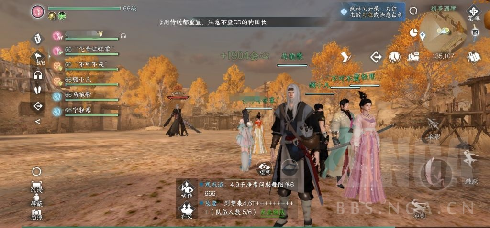

----

##### 149.[0] \<pid:705571087\> 2023-07-29 01:39:53 by 猫栗子4440
逆水寒那个元素解密我觉得很舒适的一点，是很符合生活逻辑和五行逻辑，和场景也融入很好。
不是那种硬塞解密和箱子让你探索。

----

##### 150.[0] \<pid:705572122\> 2023-07-29 01:53:16 by 半面海棠开
>[jump](#pid705569804) 尘世の闲游(2023-07-29 01:26) 说: 
>
>据说师姐是碎梦，师兄是神相，方承意是血河，顾惜朝是90。然后还会匹配到一些江湖上的NPC，应该都有彩蛋语音，可惜我还没遇上过

应该是随机刷吧，我九零过本遇到过追命

----

##### 151.[0] \<pid:705573757\> 2023-07-29 02:17:41 by 烟颜研嫣
你们这说得我好想下回来。~~可惜那稀碎的操作感真的让我玩不下去~~

----

##### 152.[0] \<pid:705574022\> 2023-07-29 02:21:48 by akanatsu
>[jump](#pid705568158) 啪哒砰砰(2023-07-29 01:12) 说: 
>
>起码敢说
>

这个玩家id叫灭净三业，我觉得有概率是玩原神玩的

----

##### 153.[0] \<pid:705574160\> 2023-07-29 02:24:09 by 匿名用户114514
刚才朋友的帮会被犯见的人盯上了遂去雁门关战斗线走了一趟，22个敌人，最高的对战值25，目前是我累积起来的，最终评价是我想转血河，神相被切死了要

----

##### 154.[0] \<pid:705578343\> 2023-07-29 03:49:27 by Hesperia
原的代入感比不上顺火暖一根，我能在顺火暖和npc聊半小时，原做得到吗？而且虽然缝了很多玩法但他缝的实在是太多了，休闲战斗恋爱mmo探索小游戏换装解密pvp看剧情，想玩啥都行，场景也很漂亮，地图挺大的突出一个量大管饱
火子最大的缺点就是手感dio差，走路爬墙战斗哪都差，希望能赶紧优化

----

##### 155.[0] \<pid:705578731\> 2023-07-29 04:01:15 by 宣无邪
我信了你们吹的啊，去煌一波看看，希望猪场这波真的能站起来，有竞争才有好环境
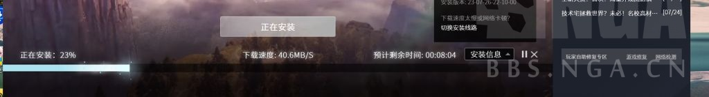
MD笑死我，技术宅拯救世界？未必
这是飞龙骑脸了啊，明着要干米忽悠

----

##### 156.[0] \<pid:705578778\> 2023-07-29 04:02:52 by drpocky
今天下了玩了一会，想问问这个手感怎么改善啊
还有这个按键是怎么个按法，wasd和12345一起按属实按不过来，是走位的优先级高还是技能的优先级高啊

----

##### 157.[0] \<pid:705579239\> 2023-07-29 04:20:18 by 扶光む
刚试玩俩小时，手机玩手感还是太差了，感觉比第五都难受。准备下个模拟器看电脑能不能带动。
本身我对捏脸系统是没什么兴趣的(因为很缺乏艺术细胞)但是系统推荐的好好看！
做了一些小小的调整，最终没有选眼罩~~什么芭别尔主母这下玩原神玩的了~~白头发还是有点显黑，~~什么白发魔女传我好中二~~总体还是挺满意的(除了操作系统)
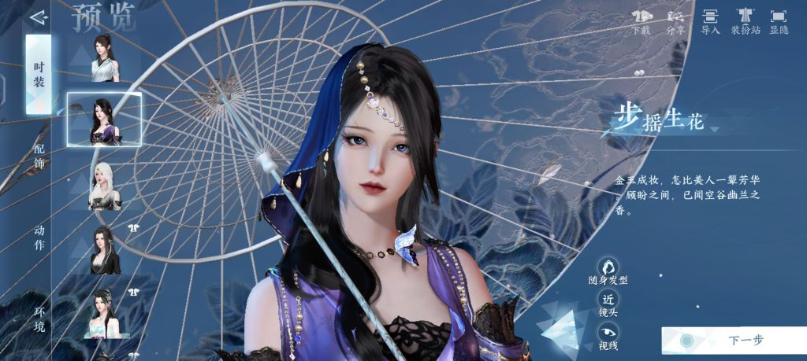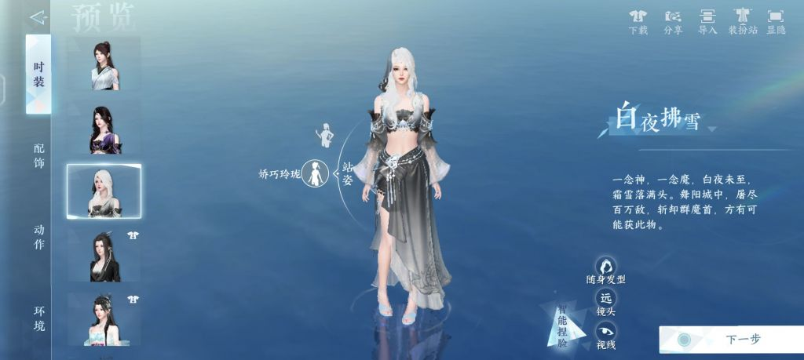

----

##### 158.[0] \<pid:705580453\> 2023-07-29 05:09:33 by Cris_Wang
>[jump](#pid705578778) drpocky(2023-07-29 04:02)说:
>今天下了玩了一会，想问问这个手感怎么改善啊[s:a2:大哭] 还有这个按键是怎么个按法，wasd和12345一起按属实按不过来，是走位的优先级高还是技能的优先级高啊[s:a2:大哭]

可以开一键连招，按住鼠标左键就可以自动打

----

##### 159.[0] \<pid:705580600\> 2023-07-29 05:14:49 by 飞霜叩门
>[jump](#pid705568158) 啪哒砰砰(2023-07-29 01:12) 说: 
>
>起码敢说
>

这个玩家id出现的时候我仿佛就看到了上万字的背景故事，太地狱了

----

##### 160.[0] \<pid:705580659\> 2023-07-29 05:17:22 by 戊康宋己师
>[jump](#pid705578778) drpocky(2023-07-29 04:02) 说: 
>
>今天下了玩了一会，想问问这个手感怎么改善啊
>还有这个按键是怎么个按法，wasd和12345一起按属实按不过来，是走位的优先级高还是技能的优先级高啊

按y，左边点推荐套路选中间的应用，退出来把技能右下角那个圈打钩
然后背一下循环：wasd走到怪脸上，长按鼠标左键3秒，打开nga里茶馆开始冲浪

----

##### 161.[0] \<pid:705580813\> 2023-07-29 05:24:03 by 戊康宋己师
>[jump](#pid705551169) YuXiOtt(2023-07-28 23:04) 说: 
>
>才知道原来可以让乌云活下来，还有龙家三兄弟，我这就去改变世界线。
>以及逆子是真的崆峒，男女主角的剧情是有差分的，男主剧情和师姐等女性角色交互会多一点，女主是师兄，而且装扮方面，男主没法开启美甲系统~~男生美个甲怎么你了~~

可以救人的吗，我今天的安排有了，兄弟们我来了

----

##### 162.[0] \<pid:705580920\> 2023-07-29 05:28:37 by 垂露东风
我觉得逆水寒是鼓励玩家自由探索到处乱逛的，因为奇遇的触发看运气、挑时间，传闻也是经过npc的时候突然就蹦出来了，这些都给玩家惊喜，而不是去跟视频攻略
而且我很喜欢那种巧合感，前几天在树下捡到一根棍子，旁边有人说自家擀面杖老丢我就给他了，结果今天触发奇遇碰到一个人拿着这根棍子打劫我，是那个人的哥哥，给我拼命道歉说以后不走歪路了
还有多结局，做了一个盲女和哑女的友情故事，结局哑女死了，我就很难过，点开整个流程发现不算复杂的一个故事居然可以有6个结局，有点惊喜(另外官方给的顾惜朝结局好像也是很多个，可死可不死

----

##### 163.[0] \<pid:705581590\> 2023-07-29 05:59:44 by yblc
>[jump](#pid705580920) 垂露东风(2023-07-29 05:28) 说: 
>
>我觉得逆水寒是鼓励玩家自由探索到处乱逛的，因为奇遇的触发看运气、挑时间，传闻也是经过npc的时候突然就蹦出来了，这些都给玩家惊喜，而不是去跟视频攻略
>而且我很喜欢那种巧合感，前几天在树下捡到一根棍子，旁边有人说自家擀面杖老丢我就给他了，结果今天触发奇遇碰到一个人拿着这根棍子打劫我，是那个人的哥哥，给我拼命道歉说以后不走歪路了
>还有多结局，做了一个盲女和哑女的友情故事，结局哑女死了，我就很难过，点开整个流程发现不算复杂的一个故事居然可以有6个结局，有点惊喜(另外官方给的顾惜朝结局

那个盲女与哑女有一个结局就是你靠神侯府的关系保下她们，然后她们就定居汴京，一个卖插花一个卖绣品  
~~哪怕是个虚假的故事，我也很难接受沉重的别离~~

----

##### 164.[0] \<pid:705581801\> 2023-07-29 06:09:29 by samiyako
都4202年了，安装程序居然不使用unicode，打开是乱码，安装路径还不让用半角英数，我tm惊了
它有海外CDN又是让人更惊讶的

----

##### 165.[0] \<pid:705582211\> 2023-07-29 06:25:22 by 奔跑的苦茶子
>[jump](#pid705563526) SamidareTacho(2023-07-29 00:40) 说: 
>
>有人说过了吗，单人打本换铁衣(别的暂时没发现)有几率刷出那个酒鬼师兄追命，还会有特殊发言，比如说打架不叫他，要给你秀两手；血量低了会叫你先走开避一避；被打了他会说敢伤我师弟/师妹，要叫你(boss)百倍偿还还是怎么个成语的这种小彩蛋真的很有意思，让人会心一笑那种感觉

对！我今天神相女号打单人也roll到师姐了(就是可惜她好像不咋会走位，那血条看着蛮吓人)应该是每个职业都有几率roll到相应职业的特殊人物吧

----

##### 166.[0] \<pid:705584291\> 2023-07-29 07:17:46 by 夭叶舒华
>[jump](#pid705559971) TooruW(2023-07-29 00:09) 说: 
>
>不是赫连春水吗

艹………好久以前看的了名字记错

----

##### 167.[0] \<pid:705585406\> 2023-07-29 07:37:54 by fealib
昨天把善恶断奇遇做了
即使是在一个腐朽的封建时代
依然会有黑暗中的义士来贯彻恶有恶报的观念
袭杀那些以钱以权逃脱自己罪行的应死之人
认同这种观念后，你的奖励就是无比契合这个奇遇的武学——善恶断.黑
最妙的是，你如果不认同这种以杀止恶的观念
甚至可以出言反驳，故事会有另一个结局，你会有一个新的奖励——善恶断.白

对比一下你原吧
你的开放性在哪呢？
你的选择在哪呢？
你的恶有恶报在哪呢？

----

##### 168.[0] \<pid:705585565\> 2023-07-29 07:40:20 by sihighy
>[jump](#pid705563526) SamidareTacho(2023-07-29 00:40) 说: 
>
>有人说过了吗，单人打本换铁衣(别的暂时没发现)有几率刷出那个酒鬼师兄追命，还会有特殊发言，比如说打架不叫他，要给你秀两手；血量低了会叫你先走开避一避；被打了他会说敢伤我师弟/师妹，要叫你(boss)百倍偿还还是怎么个成语的这种小彩蛋真的很有意思，让人会心一笑那种感觉

我昨天单人武林也遇到追命师兄助战了，是个铁衣，伤害还挺高

----

##### 169.[0] \<pid:705587345\> 2023-07-29 08:04:05 by 廓尔克蜀黍
>[jump](#pid705579239) 扶光む(2023-07-29 04:20) 说: 
>
>刚试玩俩小时，手机玩手感还是太差了，感觉比第五都难受。准备下个模拟器看电脑能不能带动。
>本身我对捏脸系统是没什么兴趣的(因为很缺乏艺术细胞)但是系统推荐的好好看！
>做了一些小小的调整，最终没有选眼罩~~什么芭别尔主母这下玩原神玩的了~~白头发还是有点显黑，~~什么白发魔女传我好中二~~总体还是挺满意的(除了操作系统)
>[img]./mon_2023

模拟器问题是播完动画键盘无响应

----

##### 170.[0] \<pid:705587990\> 2023-07-29 08:11:27 by GrossGrass
把标题的快字去掉

----

##### 171.[0] \<pid:705590914\> 2023-07-29 08:40:07 by 阿九爱吃红烧肉
谢谢，已经上头买了皮肤了

我个人喜欢过剧情，大世界乱逛还有和师兄恋爱毕竟芋泥的情缘也是师兄

原神真不熟，好几天没上了谁愿意回去当傻子黄毛啊

顺便贴一下捏的脸脸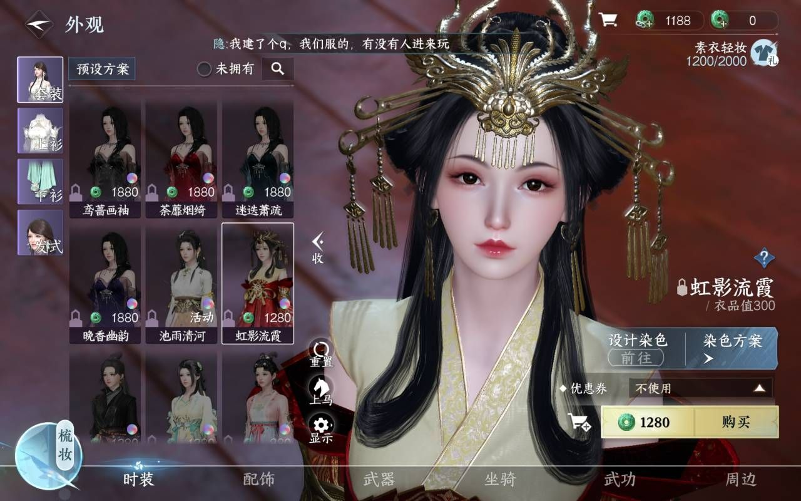

----

##### 172.[0] \<pid:705591905\> 2023-07-29 08:48:51 by 娜娜莉莉丝
对比一下，原的城市根本不配叫城市，就像是有人搭建的模拟秘境一样

----

##### 173.[0] \<pid:705594548\> 2023-07-29 09:10:23 by 是大可不是duck
作为半正统momo人，先是跑去剑三玩了几年又被亲友拖去ff14，现在在逆水寒无比快乐。我们绝本现在都暂停一段时间在逆水寒偷鸡摸狗，我还给我家dk噶了。

----

##### 174.[0] \<pid:705595213\> 2023-07-29 09:15:21 by Seebird
>[jump](#pid705559388) 芙芙蓉蓉(2023-07-29 00:05) 说: 
>
>usia neuma是啥？

Ousia Pneuma 不荒不芒

----

##### 175.[0] \<pid:705595939\> 2023-07-29 09:20:41 by ThedesAlizes
你们都是玩哪个流派啊我创了五个号除了铁衣都想玩一遍 妈的

----

##### 176.[0] \<pid:705596122\> 2023-07-29 09:21:57 by Lagrange_
>[jump](#pid705568869) ANUBlS(2023-07-29 01:18):

没，我纯良人我只说顾惜朝坏话

----

##### 177.[0] \<pid:705596136\> 2023-07-29 09:22:03 by Seebird
>[jump](#pid705595939) ThedesAlizes(2023-07-29 09:20) 说: 
>
>你们都是玩哪个流派啊我创了五个号除了铁衣都想玩一遍 妈的

神相欢迎你

----

##### 178.[0] \<pid:705596535\> 2023-07-29 09:24:57 by 泣场所叹
感觉跟以前的天涯明月刀剑灵没什么区别，我是不吃这一套风格

----

##### 179.[0] \<pid:705597227\> 2023-07-29 09:29:39 by msg_477
>[jump](#pid705595939) ThedesAlizes(2023-07-29 09:20) 说: 
>
>你们都是玩哪个流派啊我创了五个号除了铁衣都想玩一遍 妈的

好家伙8月还是10月会开转职系统的，你悠着点

----

##### 180.[0] \<pid:705597779\> 2023-07-29 09:33:12 by 梦后楼台高锁
已经有点受不了开放世界了，前几天去玩暗黑四发现这游戏也是“开放世界”，还得跑一百多个莉莉丝祭坛(可以理解成神瞳)，真的血压马上上来了只能说这下真是玩原神玩的

----

##### 181.[0] \<pid:705598205\> 2023-07-29 09:35:58 by MeliMor
今天下了个逆水寒，但是发现我在这游戏里晕3d有点严重，可能因为不想用电脑玩画面里人物和按键都太小了，逛了一会儿脑壳痛了

----

##### 182.[0] \<pid:705598288\> 2023-07-29 09:36:34 by Inquisit
>[jump](#pid705595939) ThedesAlizes(2023-07-29 09:20) 说: 
>
>你们都是玩哪个流派啊我创了五个号除了铁衣都想玩一遍 妈的

我大号神相小号素问，小号已经摆的cd都不清任务都不做了东西太多大号都玩不过来

----

##### 183.[0] \<pid:705598398\> 2023-07-29 09:37:11 by 别慌冷静
本来mhy扩张人员大头就是网易tx，这下mhy又得高薪从网易挖人了呀，什么战神设计师，我看还不如网易呢

----

##### 184.[1] \<pid:705598910\> 2023-07-29 09:40:54 by 熹有长庚雨
>[jump](#pid705568158) 啪哒砰砰(2023-07-29 01:12) 说: 
>
>起码敢说
>

我去，我真信了啊啥时候端上来

----

##### 185.[1] \<pid:705599162\> 2023-07-29 09:42:29 by 岩间琉璃，云间月
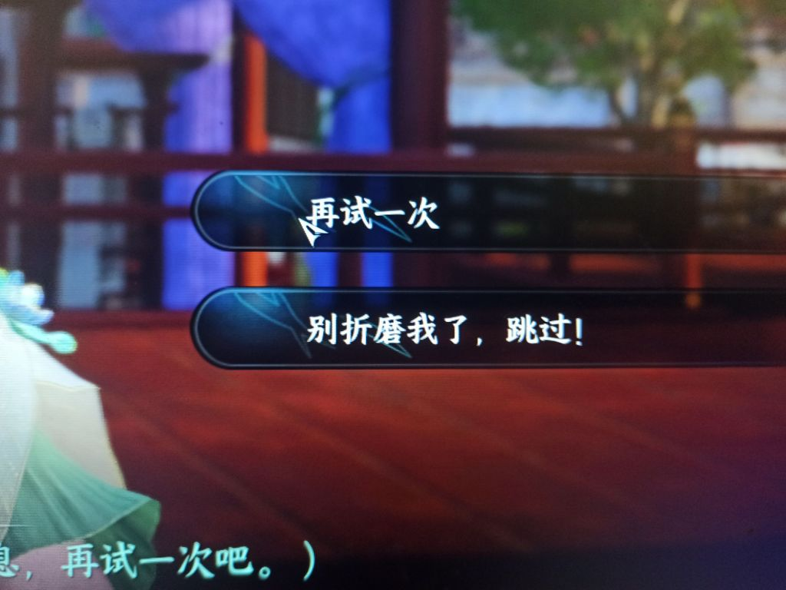我就要用逆水寒拉踩原神

----

##### 186.[0] \<pid:705599200\> 2023-07-29 09:42:45 by 池霜丶
>[jump](#pid705549120) UID43055609(2023-07-28 22:51) 说: 
>
>就是闭着眼睛跟着指引走，走完指引就看你喜欢哪方面了
>大世界探索可以点望气，指引没开的箱子
>PvP在竞技里，33和12V12
>pve主打副本，想和玩家玩就普通组队，想单机就选单人，系统自动匹配Ai大腿队友。几个日常本现在都可以等级碾压，武林英雄录普通也是，英雄可能吃点练度，但问题不大。舞阳内外城普通是目前最难的本，大概得拉一拉装备练度再进，英雄舞阳城还没开，1.2版本新开的爬塔还没玩暂时不知道啥情况
>PvX这边更是多种多样，庄园种田养殖装修一应俱全，文字游戏混江湖一周两次，身份玩

好言相劝，不要去大秘境坐牢！！！本来奖励方向就是纯pve体力消耗也大，这个就是给核心pve人刷成就感的地方，不是特别在意的不要去碰，我坐牢已经坐出阴影了

----

##### 187.[0] \<pid:705599614\> 2023-07-29 09:45:27 by yblc
>[jump](#pid705595939) ThedesAlizes(2023-07-29 09:20):

90,流派里面骚里骚气的大师兄值得你
~~90校服也很骚气~~

----

##### 188.[0] \<pid:705599897\> 2023-07-29 09:47:12 by 阿瓦隆aqq
其实好多mmorpg都薄纱了，例如古剑

只是O真的是年一游或者那些游戏只有pc

----

##### 189.[0] \<pid:705604292\> 2023-07-29 10:15:14 by SamidareTacho
>[jump](#pid705585406) fealib(2023-07-29 07:37) 说: 
>
>昨天把善恶断奇遇做了
>即使是在一个腐朽的封建时代
>依然会有黑暗中的义士来贯彻恶有恶报的观念
>袭杀那些以钱以权逃脱自己罪行的恶贯满盈之辈
>认同这种观念后，你的奖励就是无比契合这个奇遇的武学——善恶断.黑
>最妙的是，你如果不认同这种以杀止恶的观念
>甚至可以出言反驳，故事会有另一个结局，你会有一个新的奖励——善恶断.白
>
>对比一下你原吧
>你的开放性在哪呢？
>你的选择在哪呢？
>你的恶有恶报在哪呢？

错啦，“旅行者只是过客负责见证”就完事了嘛，从来没见过这么厚颜无耻的说法，既然只是旅行过路，那为什么要掺和其中，既然掺和其中又怎么能说“只是见证”，简直就是又想刷存在感又不想承担相应责任的究极典范根本不能细想，不然剧情差还连带黄毛根本就是个唯利是图做事“明哲”保身的小人。

----

##### 190.[0] \<pid:705609012\> 2023-07-29 10:44:02 by YuXiOtt
>[jump](#pid705585406) fealib(2023-07-29 07:37) 说: 
>
>昨天把善恶断奇遇做了
>即使是在一个腐朽的封建时代
>依然会有黑暗中的义士来贯彻恶有恶报的观念
>袭杀那些以钱以权逃脱自己罪行的恶贯满盈之辈
>认同这种观念后，你的奖励就是无比契合这个奇遇的武学——善恶断.黑
>最妙的是，你如果不认同这种以杀止恶的观念
>甚至可以出言反驳，故事会有另一个结局，你会有一个新的奖励——善恶断.白
>
>对比一下你原吧
>你的开放性在哪呢？
>你的选择在哪呢？
>你的恶有恶报在哪呢？

善恶断还有奇遇吗？我刚路过磁州，过路触发了一个剧情，帮了个被一群大汉围在一起的女子，然后就获得了善恶断白。

----

##### 191.[0] \<pid:705609279\> 2023-07-29 10:45:31 by fealib
>[jump](#pid705609012) YuXiOtt(2023-07-29 10:44) 说: 
>
>善恶断还有奇遇吗？我刚路过磁州，过路触发了一个剧情，帮了个被一群大汉围在一起的女子，然后就获得了善恶断白。  
>
>看来武功获取方法应该还挺多样的

善恶断黑的奇遇在杭州大牢  白有两种获得方法

----

##### 192.[0] \<pid:705610497\> 2023-07-29 10:52:49 by ThedesAlizes
>[jump](#pid705597227) msg_477(2023-07-29 09:29) 说: 
>
>好家伙8月还是10月会开转职系统的，你悠着点

转职得花钱吧不知道贵不贵

----

##### 193.[0] \<pid:705611373\> 2023-07-29 10:57:50 by 子岳窦丙韩纪
逆水寒有什么事他是真处理，你米只会装死然后还有学长赶着护捏人家对于不利玩家的地方也是当天更新当天改，你米只会一句底层代码罢了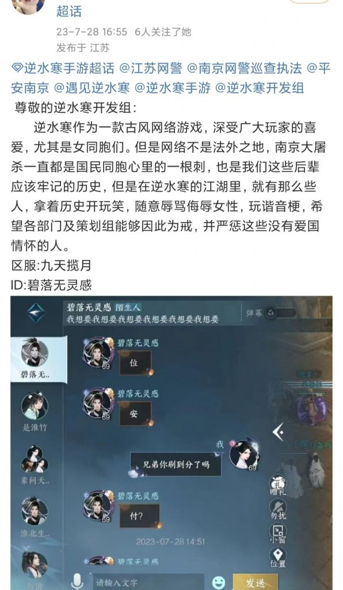

----

##### 195.[0] \<pid:705612951\> 2023-07-29 11:06:30 by 被暗算的第一天
能随便起飞和满地的智能NPC已经薄纱了，虽然大轻功不咋好用还老被师兄抓

----

##### 196.[0] \<pid:705613018\> 2023-07-29 11:06:54 by 四方形打柠檬茶
昨天我因为烧npc被人目击，被官兵给追了最后交了钱了事
还看见一个玩家被一堆官兵追然后被打死了

----

##### 197.[0] \<pid:705613755\> 2023-07-29 11:10:57 by Frranxx
>[jump](#pid705610497) ThedesAlizes(2023-07-29 10:52) 说: 
>
>转职得花钱吧不知道贵不贵

出新职业的时候应该会有一次免费转职，其他时候肯定得花钱

----

##### 198.[0] \<pid:705614086\> 2023-07-29 11:12:52 by Frranxx
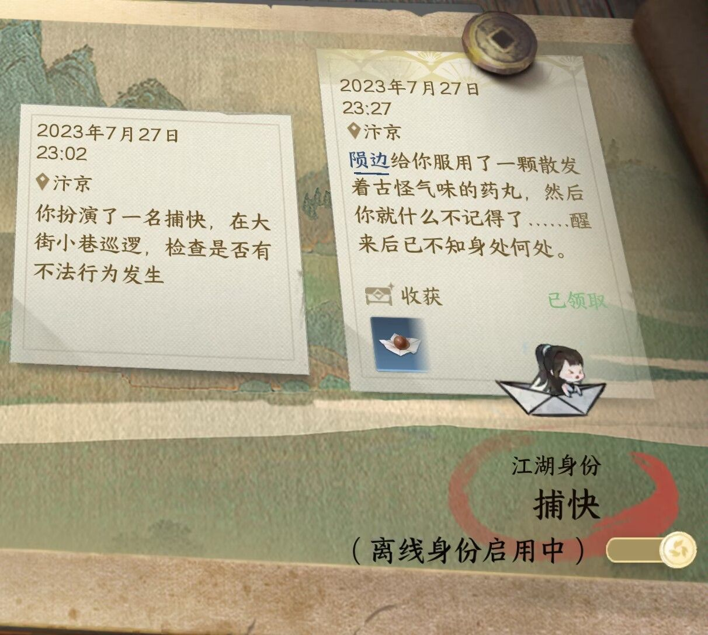
其实我还挺喜欢这个离线玩法的，下线之后角色留在大世界当npc，这不，昨天下线后还被人拐卖了(一万交子一个人)

----

##### 199.[0] \<pid:705614825\> 2023-07-29 11:17:08 by fealib
>[jump](#pid705611373) 子岳窦丙韩纪(2023-07-29 10:57) 说: 
>
>逆水寒有什么事他是真处理，你米只会装死然后还有学长赶着护捏人家对于不利玩家的地方也是当天更新当天改，你米只会一句底层代码罢了

我只能说对比过于鲜明了

----

##### 200.[0] \<pid:705615394\> 2023-07-29 11:20:15 by fealib
另外，其实逆水寒前天的更新里，很明显就没测试过，有一堆烂活
但玩家就是可以直球去喷，喷了也真改，当天晚上和第二天白天就陆续优化了
不管网易ch的恶名有多大，至少现阶段是真的比你原强太多。
你试试去喷现在的mhy？不把你嘴缝了算轻的。

----

##### 201.[0] \<pid:705615784\> 2023-07-29 11:22:17 by 燐Rin
原来你也玩顺火暖.gif

----

##### 202.[0] \<pid:705615934\> 2023-07-29 11:23:08 by 雾海漫游者
>[jump](#pid705611373) 子岳窦丙韩纪(2023-07-29 10:57) 说: 
>
>逆水寒有什么事他是真处理，你米只会装死然后还有学长赶着护捏人家对于不利玩家的地方也是当天更新当天改，你米只会一句底层代码罢了

感觉这游戏处处都在打hy的脸

----

##### 203.[0] \<pid:705615977\> 2023-07-29 11:23:24 by 渣渣2000
>[jump](#pid705613018) 四方形打柠檬茶(2023-07-29 11:06) 说: 
>
>昨天我因为烧npc被人目击，被官兵给追了最后交了钱了事
>还看见一个玩家被一堆官兵追然后被打死了

红名玩家被官兵抓捕而已，那是他自己要挑战官兵等级 ，直接投降不打架直接进去坐牢。抓捕是逐渐升级的，最开始是普通官兵抓捕，然后是空降部队抓捕，3级忘了是哪只部队抓捕，接着六扇门，六扇门都不赢你的话，天上落雷劈你。我昨天红名跑六扇门门口逛街，官兵来抓捕我，我把官兵一顿揍然后跳水里溜了。

----

##### 204.[1] \<pid:705616024\> 2023-07-29 11:23:39 by ThedesAlizes
>[jump](#pid705598288) Inquisit(2023-07-29 09:36) 说: 
>
>我大号神相小号素问，小号已经摆的cd都不清任务都不做了东西太多大号都玩不过来

对，东西太多了根本玩不过来所以我也想只玩一个号氪一个号，但那五个流派都好喜欢每次玩这种选门派的都能纠结好久

----

##### 205.[0] \<pid:705616060\> 2023-07-29 11:23:53 by 待星落
来个好心人告诉我怎么提升战力吧逆水寒玩了半个月了我战力才两万出头，和ai打本都打不过好绝望主要逆水寒缝的太多了指引太拉了，我好多东西都玩的懵懵懂懂的。
但是也真的上头，我这几天时间都给了大世界探索。感觉和原不一样的是，在原里大世界探索就是开宝箱找原石，在逆水寒里我不是为了资源，重点也不在宝箱而在那些npc身上。最喜欢奇遇传闻断案这三个点，尤其探案，狠狠满足了我侦探欲

----

##### 206.[0] \<pid:705616079\> 2023-07-29 11:24:01 by 无涯本涯
>[jump](#pid705614086) Frranxx(2023-07-29 11:12) 说: 
>
>
>其实我还挺喜欢这个离线玩法的，下线之后角色留在大世界当npc，这不，昨天下线后还被人拐卖了(一万交子一个人)

捕快竟然也能被拐卖学到了这就去~~逝一逝~~试一试

----

##### 207.[0] \<pid:705616502\> 2023-07-29 11:26:25 by 待星落
>[jump](#pid705616024) ThedesAlizes(2023-07-29 11:23) 说: 
>
>对，东西太多了根本玩不过来所以我也想只玩一个号氪一个号，但那五个流派都好喜欢每次玩这种选门派的都能纠结好久

我第一眼直接心动九灵，太美丽了！！但是又实在喜欢神相就又开了个神相小号，琴剑永远是我心头好真的很难忍住结果根本玩不过来，神相还停留在10级

----

##### 208.[0] \<pid:705616587\> 2023-07-29 11:26:48 by 渣渣2000
>[jump](#pid705616060) 待星落(2023-07-29 11:23) 说: 
>
>来个好心人告诉我怎么提升战力吧逆水寒玩了半个月了我战力才两万出头，和ai打本都打不过好绝望主要逆水寒缝的太多了指引太拉了，我好多东西都玩的懵懵懂懂的。
>但是也真的上头，我这几天时间都给了大世界探索。感觉和原不一样的是，在原里大世界探索就是开宝箱找原石，在逆水寒里我不是为了资源，重点也不在宝箱而在那些npc身上。最喜欢奇遇传闻断案这三个点，尤其探案，狠狠满足了我侦探欲

到商店换装备啊，或者玩游历。游历给我出了好几件67等装的装备了

----

##### 209.[0] \<pid:705616734\> 2023-07-29 11:27:36 by 无涯本涯
>[jump](#pid705616060) 待星落(2023-07-29 11:23) 说: 
>
>来个好心人告诉我怎么提升战力吧逆水寒玩了半个月了我战力才两万出头，和ai打本都打不过好绝望主要逆水寒缝的太多了指引太拉了，我好多东西都玩的懵懵懂懂的。
>但是也真的上头，我这几天时间都给了大世界探索。感觉和原不一样的是，在原里大世界探索就是开宝箱找原石，在逆水寒里我不是为了资源，重点也不在宝箱而在那些npc身上。最喜欢奇遇传闻断案这三个点，尤其探案，狠狠满足了我侦探欲

自力更生法：点开角色界面，有个成名赏，会有小暖指点
循规蹈矩法：跟商城一排的小图标里有一个里面有新手任务，跟着做就行
天降猛男法：去世界频道喊一嗓子，现在有师徒活动，只要服别太冷一般会有人理的  
ai打本认准化骨咩咩掌，奶和铁衣的输出在ai里是前排的

----

##### 210.[0] \<pid:705616771\> 2023-07-29 11:27:46 by 四方形打柠檬茶
>[jump](#pid705615977) 渣渣2000(2023-07-29 11:23) 说: 
>
>红名玩家被官兵抓捕而已，那是他自己要挑战官兵等级 ，直接投降不打架直接进去坐牢。抓捕是逐渐升级的，最开始是普通官兵抓捕，然后是空降部队抓捕，3级忘了是哪只部队抓捕，接着六扇门，六扇门都不赢你的话，天上落雷劈你。我昨天红名跑六扇门门口逛街，官兵来抓捕我，我把官兵一顿揍然后跳水里溜了。

原来是这样哈哈

----

##### 211.[0] \<pid:705617502\> 2023-07-29 11:31:44 by ThedesAlizes
>[jump](#pid705616502) 待星落(2023-07-29 11:26) 说: 
>
>我第一眼直接心动九灵，太美丽了！！但是又实在喜欢神相就又开了个神相小号，琴剑永远是我心头好真的很难忍住结果根本玩不过来，神相还停留在10级

我都喜欢我第一个号选的就是九灵，真的美，但素问是奶妈出招也很美还有个小狐狸，我以前玩楚留香的时候也是选的云梦，神相仙，校服也好看，碎梦和血河都很帅，都想玩一遍根本选不过来

----

##### 212.[0] \<pid:705617747\> 2023-07-29 11:33:04 by 栗林里莉
>[jump](#pid705616060) 待星落(2023-07-29 11:23)说:
>来个好心人告诉我怎么提升战力吧[s:ac:晕]逆水寒玩了半个月了我战力才两万出头，和ai打本都打不过好绝望[s:a2:大哭]主要逆水寒缝的太多了指引太拉了，我好多东西都玩的懵懵懂懂的。 但是也真的上头，我这几天时间都给了大世界探索。感觉和原不一样的是，在原里大世界探索就是开宝箱找原石，在逆水寒里我不是为了资源，重点也不在宝箱而在那些npc身上。最喜欢奇遇传闻断案这三个点，尤其探案，狠狠满足了我侦探欲[s:ac:哭笑]

升战力最快的就是高等级装备和稀有内功。
装备现在开了69级百炼令兑换，每周记得清一清日常副本攒百炼慢慢换就行。
内功搭配可以按你选的门派在B站/NGA搜一搜，每个内功自带金木水火土属性，内功周天要凑属性，要输出一般是凑三级金三级火。

----

##### 213.[0] \<pid:705617803\> 2023-07-29 11:33:21 by 药师鬼
>[jump](#pid705616060) 待星落(2023-07-29 11:23) 说: 
>
>来个好心人告诉我怎么提升战力吧逆水寒玩了半个月了我战力才两万出头，和ai打本都打不过好绝望主要逆水寒缝的太多了指引太拉了，我好多东西都玩的懵懵懂懂的。
>但是也真的上头，我这几天时间都给了大世界探索。感觉和原不一样的是，在原里大世界探索就是开宝箱找原石，在逆水寒里我不是为了资源，重点也不在宝箱而在那些npc身上。最喜欢奇遇传闻断案这三个点，尤其探案，狠狠满足了我侦探欲

闲鱼找个老手帮你调内功战力，我一开始2w+直接跳到4w5……然后就慢慢上路了。

----

##### 214.[1] \<pid:705617949\> 2023-07-29 11:34:06 by fealib
>[jump](#pid705616060) 待星落(2023-07-29 11:23) 说: 
>
>来个好心人告诉我怎么提升战力吧逆水寒玩了半个月了我战力才两万出头，和ai打本都打不过好绝望主要逆水寒缝的太多了指引太拉了，我好多东西都玩的懵懵懂懂的。
>但是也真的上头，我这几天时间都给了大世界探索。感觉和原不一样的是，在原里大世界探索就是开宝箱找原石，在逆水寒里我不是为了资源，重点也不在宝箱而在那些npc身上。最喜欢奇遇传闻断案这三个点，尤其探案，狠狠满足了我侦探欲

好说，逆水寒战力很多都是细枝末节，最重要的三个方面
1内功 挑选好一套元素量能够组成三金三火，或者二金三火的内功，把它们升到20-25级(你甚至可以不用管词条是啥，当然成品如果战力太低了还是得换个)
2装备 在各种商店 和单人团本里混一身65%67 69左右的百炼装备
3打造 把四个位置的打造不用管属性，先全弄成红色的，红色很好出基本不花资源

然后再把细枝末节的地方，比如多学点江湖武学，装备生个4级左右，补一补(这里就不需要花任何资源了
把这三个大项弄完，你战力基本就5万了，单人打本和周一去混团就都可以了，不去追第一梯队就可以体验所有最高端pve内容。

----

##### 215.[1] \<pid:705617950\> 2023-07-29 11:34:06 by Qovo
给大家看一下某个aiNPC寄给我的信，这下不得不用糖葫芦塞爆阿禅了
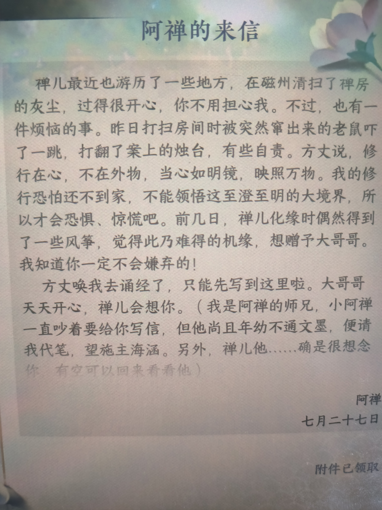

----

##### 216.[0] \<pid:705618191\> 2023-07-29 11:35:26 by YuXiOtt
>[jump](#pid705614086) Frranxx(2023-07-29 11:12) 说: 
>
>
>其实我还挺喜欢这个离线玩法的，下线之后角色留在大世界当npc，这不，昨天下线后还被人拐卖了(一万交子一个人)

谢谢你提醒我看离线身份，我看了一下，真的是玩家迫害玩家，有个玩家敲我闷棍，我没晕，于是把我药晕了。
而且这个身份换的频率略高，最短的4个钟一换，然后一天内我连换3个身份

----

##### 217.[0] \<pid:705622897\> 2023-07-29 12:02:00 by 江之岛
>[jump](#pid705613018) 四方形打柠檬茶(2023-07-29 11:06) 说: 
>
>昨天我因为烧npc被人目击，被官兵给追了最后交了钱了事
>还看见一个玩家被一堆官兵追然后被打死了

我做善恶断黑任务的时候善名太高了，被悬赏了那些npc都在包庇我，不去报官，往那些街头百姓和门口站岗的小捕快身边晃一晃，他们说:“发生什么事了，你怎么被通缉了？”“官府要来了，快逃吧，千万不要被抓到了！”

