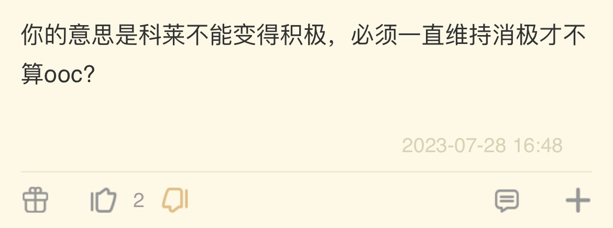

### [不吐不快][玩原玩的] 外面有个猜3.8大改过的贴子太有意思了

Made by ngapost2md (c) ludoux [GitHub Repo](https://github.com/ludoux/ngapost2md)

----

##### 0.[4] \<pid:0\> 2023-07-28 21:41:24 by oaoa2016
RT，外面有个楼主猜测3.8原来有()出场，被紧急叫停了，怎么说呢，就觉得楼主的分析，无论真假，都特别有意思，特别是猛干自爆之后，就觉得这通过活动剧情结合爆料推导米内部斗争的玩法，咋说呢，太有意思了，看楼主的分析居然让我重燃当年看考据党猜测原神世界观的乐子。概括起来一句话，玩原神玩的，总有新乐子，也是挺厉害了

----

##### 1.[0] \<pid:705538933\> 2023-07-28 21:42:21 by 芙芙蓉蓉
你不上链接大家怎么吃瓜

----

##### 2.[0] \<pid:705538965\> 2023-07-28 21:42:35 by 大漠孤雪
在哪儿？指个路

----

##### 3.[0] \<pid:705539010\> 2023-07-28 21:42:51 by Gdygfdqqqq
链接呢？标题呢？什么都不留lz小心被雷普

----

##### 4.[1] \<pid:705539062\> 2023-07-28 21:43:10 by 哒哒块
评价为并非完全不可能，看了猛子哥之后我觉得怎么滑都不过分

----

##### 5.[0] \<pid:705539076\> 2023-07-28 21:43:15 by 今锁朱楼
我觉得那个帖子说得可能是真的，其他不说，就须弥运动会端上来的东西，就证明让散兵开嘴炮或者卖人情文案绝对觉得没问题。

----

##### 6.[0] \<pid:705539098\> 2023-07-28 21:43:21 by wlgcwcl
我链接呢？
出脑以后我最喜欢看这种一本正经的胡说八道了，快给我链接！

----

##### 7.[1] \<pid:705539162\> 2023-07-28 21:43:46 by La da
那我有个问题，这次的ep是来不及改吗？

如果内部想转向的话、或者说不想继续激起玩家的意见，不该把草神去掉吗？

----

##### 8.[0] \<pid:705539195\> 2023-07-28 21:43:58 by 青禾木
链接呢？

----

##### 9.[0] \<pid:705539277\> 2023-07-28 21:44:28 by 青春派洛迪
链接呢？干聊？

----

##### 10.[0] \<pid:705539290\> 2023-07-28 21:44:33 by 柑橘橙橙橙橙橙子
链接呢？主板没找到啊

----

##### 11.[0] \<pid:705539826\> 2023-07-28 21:47:46 by oaoa2016
>[jump](#pid705539162) La da(2023-07-28 21:43)说:
>那我有个问题，这次的ep是来不及改吗？
>
>如果内部想转向的话、或者说不想继续激起玩家的意见，不该把草神去掉吗？

不，我觉得是故意的，毕竟这种要高清放大才能看到的做法也太猥琐了，我倾向于这是一种阴恻恻的试探，但其实试探的不是三姐，而是普通玩家和草神厨，毕竟经过了3.6，其实当时骂最厉害的是草神厨和普通玩家，反而三姐接受良好，他们可能误会了三姐的接受度

----

##### 12.[0] \<pid:705540059\> 2023-07-28 21:49:18 by oaoa2016
>[jump](#pid705539195) 青禾木(2023-07-28 21:43)说:
>链接呢？

主楼补上了

----

##### 13.[0] \<pid:705544541\> 2023-07-28 22:20:43 by 冰冻之零
我觉得这还是想太多

----

##### 14.[0] \<pid:705546102\> 2023-07-28 22:31:12 by 一念の差
那可惜了
要是()流水爆炸，被删掉的人就能起事重掌剧本
不得不感叹，他最近是怎么了，被哪个xx给夺舍了？

----

##### 15.[0] \<pid:705546576\> 2023-07-28 22:34:44 by 小号勿扰
太合理反而不合理了。
这就是原神文案给我的自信。

----

##### 17.[0] \<pid:705547620\> 2023-07-28 22:41:15 by 小样儿鸣
>[jump](#pid705539162) La da(2023-07-28 21:43) 说: 
>
>那我有个问题，这次的ep是来不及改吗？
>
>如果内部想转向的话、或者说不想继续激起玩家的意见，不该把草神去掉吗？

在米官方道歉之前，永远不要把它往好的方面想。

退一万步讲，ep现在这遮遮掩掩的别扭感是内部拉扯的结果，那也说明米还是烂着的，好不起来。

----

##### 18.[1] \<pid:705548629\> 2023-07-28 22:47:56 by 冰川真琴
和15L一个想法：逻辑很正常，所以应该是想多了。

柯莱应该只是文案正常写崩，反正总有人会护精神错乱是成长。

----

##### 19.[0] \<pid:705548826\> 2023-07-28 22:49:12 by lalawwww
感觉像脑补太多

----

##### 21.[0] \<pid:705549237\> 2023-07-28 22:51:50 by 不织围脖
>[jump](#pid705539162) La da(2023-07-28 21:43) 说: 
>
>那我有个问题，这次的ep是来不及改吗？
>
>如果内部想转向的话、或者说不想继续激起玩家的意见，不该把草神去掉吗？

我觉得，有可能本来是一个正经出场的草神，已经是经过极限拉扯才变成如今这个列文虎克草神

----

##### 22.[0] \<pid:705549736\> 2023-07-28 22:54:57 by 迷你靓仔
3.8如果真因为怕影响观感删了()戏份，那后面又加了一堆编剧黑泥就看不懂
不管怎么内部混乱，只要终审文案的那个人想恶心人，最后的东西都会是恶心的

----

##### 23.[0] \<pid:705549948\> 2023-07-28 22:56:19 by 景邀明
之前发现太子无剧情复刻我就觉得纳闷，这可是第一次复刻，其他三个五星都出现了，还在须弥，怎么可能没有他！但是还是觉得这个分析经不起细看，文案写崩很正常，不足以作为删除戏份的依据

----

##### 25.[0] \<pid:705550109\> 2023-07-28 22:57:29 by jasmine4869
有一点说的对，柯莱虽然出场很多，但大多数都感觉很工具人

----

##### 26.[0] \<pid:705550247\> 2023-07-28 22:58:23 by 突棘嵴线
>[jump](#pid705549948) 景邀明(2023-07-28 22:56)说:
>之前发现太子无剧情复刻我就觉得纳闷，这可是第一次复刻，其他三个五星都出现了，还在须弥，怎么可能没有他！但是还是觉得这个分析经不起细看，文案写崩很正常，不足以作为删除戏份的依据

那你也没法解释2.2 胡桃 公子复刻，谁没有剧情我不说

----

##### 27.[0] \<pid:705550434\> 2023-07-28 22:59:48 by Cloudrapid133
还有一个反常的点是前瞻里其他那张归途
合理怀疑是当初已经画好了不用白不用

堂堂开滑

----

##### 28.[0] \<pid:705550446\> 2023-07-28 22:59:51 by 罗一川
想多了，反应没那么快的，能把他从剧情里删除就说明已经要雪藏这个角色了还买这么多宣传干嘛

----

##### 29.[0] \<pid:705550704\> 2023-07-28 23:01:32 by ζ泪水沾湿的奇迹
>[jump](#pid705546102) 一念の差(2023-07-28 22:31) 说: 
>
>那可惜了
>要是()流水爆炸，被删掉的人就能起事重掌剧本
>不得不感叹，他最近是怎么了，被哪个xx给夺舍了？  
>
>看到这个回复还是蚌埠住了，原来真有对文案没b数的
>

不懂就问，原的角色有哪个成长了吗

----

##### 30.[0] \<pid:705551008\> 2023-07-28 23:03:41 by 油门踩到底
楼上别真的去较真其他的戏份到底有没有被删啊~~这种事情重要吗？~~
这种时候就应该去嘲讽散解“你家割割剧情被删啦”
说不定会有散解狠狠地破防，然后转头去冲mhy了

----

##### 31.[2] \<pid:705551150\> 2023-07-28 23:04:38 by Adrammelech
1g内鬼图包里有现3.8版本封面的草图，那个包的泄露时间是去年11月左右
不要幻想mhy会规避节奏去散兵化

----

##### 32.[0] \<pid:705551241\> 2023-07-28 23:05:26 by mASAYUMecHASIN
最大的问题不在于楼主结合剧情分析的合不合理，而在于假如米哈游真的删掉了散兵戏份，意味着什么？意味着米哈游终于在意起社区风向和玩家的不满情绪了，但这不就跟散兵ep都非要见缝插针插入草神走上了南辕北辙的两条路了吗？你觉得会有公司精分到这种地步？

----

##### 33.[0] \<pid:705551384\> 2023-07-28 23:06:26 by 老虎二世
感觉想的有点多啊，剧情安排的不自然恐怕只是单纯的写烂了吧

----

##### 34.[0] \<pid:705551558\> 2023-07-28 23:07:48 by somebodyelse
肯定是厨子不爆米害的，不然剧情怎么可能被删

----

##### 35.[0] \<pid:705551901\> 2023-07-28 23:10:12 by aphemia777
也有可能是临时删了枫丹的戏份，塞进3.8的

----

##### 36.[0] \<pid:705552112\> 2023-07-28 23:11:49 by 就随便起了个名字
>[jump](#pid705551008) 油门踩到底(2023-07-28 23:03) 说: 
>
>楼上别真的去较真其他的戏份到底有没有被删啊~~这种事情重要吗？~~
>这种时候就应该去嘲讽散解“你家割割剧情被删啦”
>说不定会有散解狠狠地破防，然后转头去冲mhy了

你的话配上你的id简直绝了狠狠加速是吧

----

##### 37.[0] \<pid:705552890\> 2023-07-28 23:17:48 by 一只墩邦妮
我觉得是脑洞太大了，不存在临时换掉的可能，官方不会这么对自己的好宝的。

----

##### 38.[0] \<pid:705552931\> 2023-07-28 23:18:06 by momookyk
>[jump](#pid705539162) La da(2023-07-28 21:43) 说: 
>
>那我有个问题，这次的ep是来不及改吗？
>
>如果内部想转向的话、或者说不想继续激起玩家的意见，不该把草神去掉吗？

内部转向应该是把散兵边缘化吧
至于EP本身改不改没啥区别吧

----

##### 39.[0] \<pid:705554135\> 2023-07-28 23:26:41 by 景邀明
>[jump](#pid705550247) 突棘嵴线(2023-07-28 22:58) 说: 
>
>那你也没法解释2.2 胡桃 公子复刻，谁没有剧情我不说

不是，这关他俩什么事，人家是太子能一样吗？而且第一次无剧情复刻的就是公子，跟我扯这个干嘛？分析散是否删除戏份就分析，为什么要扯无关角色

----

##### 40.[0] \<pid:705554739\> 2023-07-28 23:31:09 by 莫莫宵
>[jump](#pid705546102) 一念の差(2023-07-28 22:31) 说: 
>
>那可惜了
>要是()流水爆炸，被删掉的人就能起事重掌剧本
>不得不感叹，他最近是怎么了，被哪个xx给夺舍了？  
>
>看到这个回复还是蚌埠住了，原来真有对文案没b数的
>

笔在人家手里.jpg

----

##### 41.[0] \<pid:705554907\> 2023-07-28 23:32:32 by 莫莫宵
>[jump](#pid705551150) Adrammelech(2023-07-28 23:04) 说: 
>
>1g内鬼图包里有现3.8版本封面的草图，那个包的泄露时间是去年11月左右
>不要幻想mhy会规避节奏去散兵化

老哥 内鬼图包能不能私一份

----

##### 42.[0] \<pid:705555589\> 2023-07-28 23:38:01 by 扶光む
>[jump](#pid705551008) 油门踩到底(2023-07-28 23:03) 说: 
>
>楼上别真的去较真其他的戏份到底有没有被删啊~~这种事情重要吗？~~
>这种时候就应该去嘲讽散解“你家割割剧情被删啦”
>说不定会有散解狠狠地破防，然后转头去冲mhy了

哈哈哈哈哈哈字词，有没有来sj的，你家giegie戏份被删啦

----

##### 43.[0] \<pid:705555762\> 2023-07-28 23:39:13 by oaoa2016
>[jump](#pid705551241) mASAYUMecHASIN(2023-07-28 23:05):

咋说呢，正常来说不会，但一想到这是米哈游，又觉得很合理，魈厨和散厨都能做同事了，这么一说是不是突然合理

----

##### 44.[0] \<pid:705556056\> 2023-07-28 23:41:04 by 好想幹林尼
想多了，很久之前就知道散兵沒有劇情復刻了

----

##### 45.[0] \<pid:705556095\> 2023-07-28 23:41:23 by 突棘嵴线
>[jump](#pid705554135) 景邀明(2023-07-28 23:26) 说: 
>
>不是，这关他俩什么事，人家是太子能一样吗，而且第一次无剧情复刻的就是公子，跟我扯这个干嘛？分析散是否删除戏份就分析，为什么要扯无关角色  
>
>编辑：而且我俩观点也不冲突吧，我说删戏份可能性有，但是我倾向于文案写崩了，应该没有删戏份，你说同时间up的五星也有可能没有戏份，那不是一样的吗？

所以散没戏份也不是理由嘛 也有人第一次复刻没戏份  
草，我错了 只看了第一句，后半句回复的时候忘掉了

----

##### 46.[0] \<pid:705556380\> 2023-07-28 23:43:16 by 嘀嘟滴嘟嘀
这样啊。
那我会想，是不是米哈游自己测试觉得须弥太几把烂了，改又来不及，于是决定拿散兵出来当靶子，把须弥彻底搞烂，只要够烂，之后不管怎么样都是进步的，还能提纯一波结晶。

----

##### 47.[0] \<pid:705558617\> 2023-07-28 23:59:12 by h26hxutz
>[jump](#pid705556380) 嘀嘟滴嘟嘀(2023-07-28 23:43) 说: 
>
>这样啊。
>那我会想，是不是米哈游自己测试觉得须弥太几把烂了，改又来不及，于是决定拿散兵出来当靶子，把须弥彻底搞烂，只要够烂，之后不管怎么样都是进步的，还能提纯一波结晶。

这就想当然了，3.0到3.2虽然地图设计上的问题已经出现，但根本到不了烂的地步。剧情上的高光更是相当程度掩盖了地图设计、女五星过少的问题。

----

##### 48.[0] \<pid:705563629\> 2023-07-29 00:41:23 by ZFBXBD
>[jump](#pid705539162) La da(2023-07-28 21:43) 说: 
>
>那我有个问题，这次的ep是来不及改吗？
>
>如果内部想转向的话、或者说不想继续激起玩家的意见，不该把草神去掉吗？

可以改，我干后期的告诉你，ep基本全是静止镜头，草神也很小，哪怕不用游戏引擎实录，找个视频后期，也就几个小时就能改。
这个和跑男鸡哥不一样，这个ep甚至可以拿个草底的小图片直接遮住草神。

