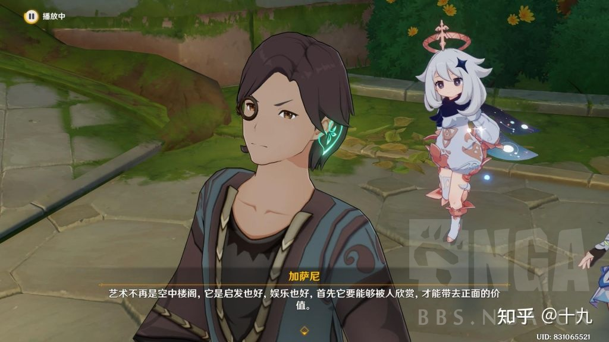

### [热点事件] 妮露传说任务算不算对李猛干先生的回旋镖

Made by ngapost2md (c) ludoux [GitHub Repo](https://github.com/ludoux/ngapost2md)

----

##### 0.[0] \<pid:0\> 2023-07-29 00:27:10 by 龙澂
“鸱鸮怪叫，难掩鹓鶵清音”，在猛干哥看来，他们创作者是有才华的，我们读者都是一群没品位的“鸱鸮”所以才会质疑他们，但是妮露传说任务表达的不是这样的精神吧。
让我们看看NPC加萨尼的原话。
[quote]<b>艺术的意义，并不是由创作者赋予，而是由欣赏者赋予的。</b> 
<b>换句话说，只有能被人欣赏的艺术，才会在欣赏者的精神世界中留下痕迹与价值。</b> 
我曾经像学者追求智慧那样，追求过艺术的穷尽。但我体会到的只有不理解，从那时起，我就很在乎&#39;是否被理解&#39;这件事。
<b>我明白曲高和寡的道理，但我无法从这个借口中获得安慰。</b>
我一直在为之困惑，直到我来到这里，看到了妮露的表演。这里的所有人，都乐在其中，台上的表演者享受观众的表演，台下的欣赏者，沉浸于美妙的氛围。 
说实话，以我挑剔的眼光看，演得不怎么样。但更让我困惑的是，演的不怎么样，却能征服所有观众，甚至征服了我。
 —— 原来是我走错了路，我想要的从来都不是什么穷尽。 我离开了所谓艺术研究者的前沿领域，来到了这个剧场，因为这里才有我想要的东西。
 <b>艺术不再是空中楼阁，它是启发也好，娱乐也好，首先要能够被人欣赏，才能带去正面的价值。如果做不到这一点，艺术便毫无意义。</b>[/quote]借用两张知乎大佬的截图。

   

----

##### 1.[0] \<pid:705562128\> 2023-07-29 00:27:58 by 食茄少年
原来是妮露的传说任务啊，我还以为是npc的

----

##### 2.[0] \<pid:705562380\> 2023-07-29 00:30:29 by Sigmoni
……这事很重要吗？

----

##### 3.[0] \<pid:705562443\> 2023-07-29 00:31:01 by Vallhalla_Marsblast
别看他说什么，看他做什么
说场面话和不要脸是社会人的必要生存技能

----

##### 4.[0] \<pid:705562544\> 2023-07-29 00:31:48 by 银河外的水滴
但是笔在人家手里

----

##### 5.[2] \<pid:705562672\> 2023-07-29 00:32:49 by 天堂地狱破
他会说拿笔的被op夺舍了

----

##### 6.[0] \<pid:705562702\> 2023-07-29 00:33:05 by 哈啤哈沃克
谁是回旋镖还不一定呢

----

##### 7.[0] \<pid:705562725\> 2023-07-29 00:33:20 by whiskyDJ
回旋镖很重要吗？也就你们看剧情的人觉得重要而已

----

##### 8.[2] \<pid:705562818\> 2023-07-29 00:34:11 by Bauhaus的大豪斯
啊？你竟然记得妮露传说任务讲了什么

----

##### 9.[2] \<pid:705562968\> 2023-07-29 00:35:28 by setsuna2023
是吗，那我会说，你们内部员工相互看不惯可以直接当面塔塔开的，不用为了私货的醋包这个自机传说的饺子，只会显得张猛干打不了老员工李猛干还打不了玩家

----

##### 10.[0] \<pid:705563054\> 2023-07-29 00:36:16 by safindem
这文案有种小镇做题家出身的美

----

##### 11.[0] \<pid:705563191\> 2023-07-29 00:37:29 by 超定归约律
你还认真了.jpg

----

##### 12.[0] \<pid:705563333\> 2023-07-29 00:38:39 by 无聊的冻青蛙
我当时做这个的时候总在想妮露碰上辛焱会是什么场面

----

##### 13.[0] \<pid:705586011\> 2023-07-29 07:46:56 by 格里兹纳特
>[jump](#pid705563054) safindem(2023-07-29 00:36) 说: 
>
>这文案有种小镇做题家出身的美

小镇做题家的道德水平是毋庸置疑的，不要乳做题家了

