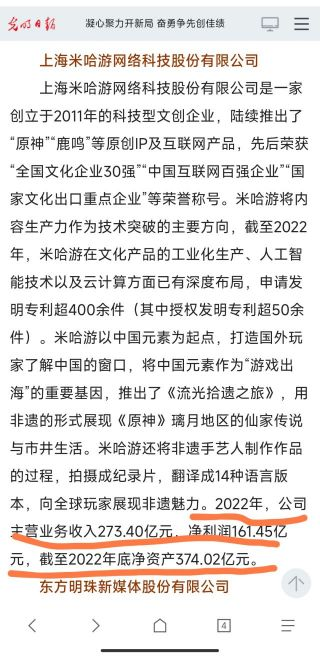

### [不吐不快]比起钟离事件和崩三兔女郎轰轰烈烈的炎上，现在粉饰太平的样子才是最致命的

Made by ngapost2md (c) ludoux [GitHub Repo](https://github.com/ludoux/ngapost2md)

----

##### 0.[1] \<pid:0\> 2023-07-29 02:13:30 by Cazedor
钟离和兔女郎事件虽然声势浩大，但是对流水的影响远远没到腰斩的地步，所以后面整点好活就平息下来了。但是现在的原神是内部全方面的溃烂，外有孝子堵嘴粉饰太平，玩家大量流失，提纯的结晶拉不起流水，可以说是进ICU了

----

##### 1.[0] \<pid:705573678\> 2023-07-29 02:16:28 by 普露璐特
这不直接开香槟？

----

##### 2.[0] \<pid:705573720\> 2023-07-29 02:17:13 by 桑葚煮酒
为啥不能是问题不严重呢
我也想看米哈游的乐子，但是我不敢打包票说现在的问题比之前让米滑轨的问题重

----

##### 3.[0] \<pid:705573988\> 2023-07-29 02:21:07 by Cazedor
>[jump](#pid705573678) 普露璐特(2023-07-29 02:16) 说: 
>
>这不直接开香槟？

反正当年空中劈叉清洁工没让我生气，兔女郎没让我生气，一年没出女限五真的让我炸毛了。哪怕给个女限五想必我都不会对林尼发表什么意见。我朋友说的，你这么宽容的人，mhy都能踩你雷点，总有一个雷点适合你

----

##### 4.[0] \<pid:705574093\> 2023-07-29 02:22:51 by 右手边03
哪里太平，现在号价崩盘的贼离谱本来要跑路的，现在我还是选择烂手里好了。

----

##### 5.[0] \<pid:705574332\> 2023-07-29 02:26:42 by akanatsu
问题就在每个单项问题拿出来好像都是小问题和噪音，那就不会改，人人踩油门

----

##### 6.[1] \<pid:705574660\> 2023-07-29 02:32:10 by Sigmoni
感觉是理查特有的对数字没概念，米哈游现在这个规模的流水(以370亿算)，再腰斩两次，扣掉运营成本(以50亿算)，依然比战双的全年流水高

你米至少还能称霸五年，收割好几茬中学生的情怀，别瞎开香槟了

----

##### 7.[1] \<pid:705574846\> 2023-07-29 02:35:09 by ANUBlS
>[jump](#pid705574660) Sigmoni(2023-07-29 02:32) 说: 
>
>感觉是理查特有的对数字没概念，米哈游现在这个规模的流水(以370亿算)，再腰斩两次，扣掉运营成本(以50亿算)，依然比战双的全年流水高
>
>你米至少还能称霸五年，收割好几茬中学生的情怀，别瞎开香槟了

吃仙洗脑包了吧
前阵子《光明日报》的新闻，2022年米哈游年度营收270亿

----

##### 8.[0] \<pid:705574932\> 2023-07-29 02:36:30 by distaling
我倒是觉得，现在没到触底的时候，枫丹版本落地之后，散草将在公众视野消失一段时间，这段时间足够让深刻的印象变得淡忘。

与此同时，大量的散草和猛干相关的梗，在非散草相关的情景下乱刷，其意义将会从原来的嘲讽渐渐转变为令人厌恶。类似“感觉不如原神”一样，语句的原意会在大量无关场景的使用中逐步消解，最后变得攻击力和杀伤力失却大半，甚至转变过来变成对着自己的武器。

简单来说就是装死不能完全解决问题，但是可以淡化问题。时间拉得越长，先前的坏印象就越难存在，米就越容易扮回原来的好皮囊。

----

##### 10.[0] \<pid:705575162\> 2023-07-29 02:39:58 by 底片影子
>[jump](#pid705574660) Sigmoni(2023-07-29 02:32) 说: 
>感觉是理查特有的对数字没概念，米哈游现在这个规模的流水(以370亿算)，再腰斩两次，扣掉运营成本(以50亿算)，依然比战双的全年流水高
>你米至少还能称霸五年，收割......

他少赚钱我就开心啊……遥想胡夜池的盛况，结果三个月就雪崩了。

而且三巨头不差钱不代表猛干哥这种中底层也财务自由了吖，说不定手头宽裕按巅峰流水预算了几年收入，然后去超前消费了一波豪宅豪车，奖金分红跟着流水一掉压力不就立刻上来了。

----

##### 11.[1] \<pid:705575331\> 2023-07-29 02:42:27 by 底片影子
>[jump](#pid705574932) distaling(2023-07-29 02:36) 说: 
>我倒是觉得，现在没到触底的时候，枫丹版本落地之后，散草将在公众视野消失一段时间，这段时间足够让深刻的印象变得淡忘。
>与此同时，大量的散草和猛干相关的梗，在非散草相关的情景下乱刷，其......

主要4.0准备撕卡也是个大活啊，按前几个月巅峰热度来看可能不算啥，问题是这游戏热度崩得太狠，再踩油门只怕到时候很难看啊。

----

##### 12.[2] \<pid:705575340\> 2023-07-29 02:42:34 by 马小跳i
>[jump](#pid705574932) distaling(2023-07-29 02:36)说:
>我倒是觉得，现在没到触底的时候，枫丹版本落地之后，散草将在公众视野消失一段时间，这段时间足够让深刻的印象变得淡忘。  与此同时，大量的散草和猛干相关的梗，在非散草相关的情景下乱刷，其意义将会从原来的嘲讽渐渐转变为令人厌恶。类似“感觉不如原神”一样，语句的原意会在大量无关场景的使用中逐步消解，最后变得攻击力和杀伤力失却大半，甚至转变过来变成对着自己的武器。  简单来说就是装死不能完全解决问题，但是可以淡化问题。时间拉得越长，先前的坏印象就越难存在，米就越容易扮回原来的好皮囊。

 一年不出女限五和散草有啥关系，流水这么低绝对不单单是剧情问题

----

##### 13.[0] \<pid:705575361\> 2023-07-29 02:43:04 by YVANLAU
下面的人蒙蔽圣听，开香槟见证楼塌了就好，操那心何必呢

----

##### 14.[0] \<pid:705575425\> 2023-07-29 02:44:15 by 小景一郎
我拿这个案例问了下我做营销的父亲，得到的回答是:为了扩张用户群体抛弃自己的基本盘这种顾头不顾腚的策略简直不可思议，这群人都没上过基本的课程吗

要我说米厂就是赚的太多躺的太舒服，钱赚够了开始急着和过去的自己搞切割了，想整点自己的东西输出进去做点大的，挺乐的就是了，我反正是不知道什么样的商业策略能让他们把自己的核心用户得罪的七七八八来换一些付费欲望和消费能力没有那么强的新用户的，多少个月卡党能抵得上一个氪佬啊，何况某些钱少事多声音大的群体估计连氪个月卡都得从每天泡面里面扣个鸡蛋的钱出来

----

##### 15.[0] \<pid:705575540\> 2023-07-29 02:46:10 by 怎样才能不被禁言1
至少，不吝赞美温和批评的时代已经过去了，下面的版本将会接受更严格的审视，你觉得死不悔改的mhy能讨到多少好处另外你游的全肯定结晶太rz了，属于一听就是厂商xz，话术重复，“演技”太尬

----

##### 16.[0] \<pid:705575547\> 2023-07-29 02:46:16 by 吃烤肉去啊
>[jump](#pid705574660) Sigmoni(2023-07-29 02:32)说:
>感觉是理查特有的对数字没概念，米哈游现在这个规模的流水(以270亿算)，再腰斩两次，扣掉运营成本(以50亿算)，依然比战双的全年流水高[s:ac:哭笑]  你米至少还能称霸五年，收割好几茬中学生的情怀，别瞎开香槟了[s:ac:茶]   

<a href="javascript:;" onclick="collapse(this);">+</a>编辑 ...
数字记错了，但是结论不变。双宝，你看看你[s:ac:中枪]

飞碟桌做鬼灭之刃一集也才两百万人民币成本，mhy随随便便就蒸发几十亿的流水是什么概念
还是赚得太多，钱来得太容易，飘了。

----

##### 17.[0] \<pid:705575549\> 2023-07-29 02:46:19 by 龙澂
>[jump](#pid705575425) 小景一郎(2023-07-29 02:44)说:
>我拿这个案例问了下我做营销的老爸[s:ac:哭笑]，得到的回答是:为了扩张用户群体抛弃自己的基本盘甚至不惜得罪一大批自己曾经的核心用户这种顾头不顾腚的策略简直不可思议，这群人都没上过基本的课程吗  要我说米厂就是赚的太多躺的太舒服，钱赚够了开始急着和过去的自己搞切割了，想整点自己的东西输出进去做点大的，挺乐的就是了，我反正是不知道什么样的商业策略能让他们把自己的核心用户得罪的七七八八来换一些付费欲望和消费能力没有那么强的新用户的，多少个月卡党能抵得上一个氪佬啊，何况某些钱少事多声音大的群体估计连氪个月卡都得从每天泡面里面扣个鸡蛋的钱出来[s:a2:偷吃]

她们甚至连广告牌都舍不得花钱要用免费的捏

----

##### 18.[0] \<pid:705575581\> 2023-07-29 02:46:46 by 涨幅为困难
>[jump](#pid705574932) distaling(2023-07-29 02:36) 说: 
>
>我倒是觉得，现在没到触底的时候，枫丹版本落地之后，散草将在公众视野消失一段时间，这段时间足够让深刻的印象变得淡忘。
>
>与此同时，大量的散草和猛干相关的梗，在非散草相关的情景下乱刷，其意义将会从原来的嘲讽渐渐转变为令人厌恶。类似“感觉不如原神”一样，语句的原意会在大量无关场景的使用中逐步消解，最后变得攻击力和杀伤力失却大半，甚至转变过来变成对着自己的武器。
>
>简单来说就是装死不能完全解决问题，但是可以淡化问题。时间拉得越长，先前的坏印象就越难存在，米就越容易扮回原来的好皮囊。

散草我不好说
恶心的到最后也就是厨子。
但大猛老师这个想淡化？
不可能的。
像原神梗，是ky，那都是场景专用词语。
但大猛老师语录。泛用性强到突破天际。
几乎任何场景都可以来一句
[这事很重要吗？也就你这样的xxxxx觉得这事很重要了。]
所以这必然会成为传世名梗。
毕竟我们都知道它米哈游不是小公司了
原神与米哈游早就人尽皆知
没有腾笼换鸟的空间了
没有新鲜血液了
还想着背刺老用户
awwbwg？
火星上去拉萌萌人吧

----

##### 19.[0] \<pid:705575637\> 2023-07-29 02:47:49 by 龙澂
>[jump](#pid705574660) Sigmoni(2023-07-29 02:32)说:
>感觉是理查特有的对数字没概念，米哈游现在这个规模的流水(以270亿算)，再腰斩两次，扣掉运营成本(以50亿算)，依然比战双的全年流水高[s:ac:哭笑]  你米至少还能称霸五年，收割好几茬中学生的情怀，别瞎开香槟了[s:ac:茶]   

<a href="javascript:;" onclick="collapse(this);">+</a>编辑 ...
数字记错了，但是结论不变。双宝，你看看你[s:ac:中枪]

来，光明日报官网的原文，少看点仙的洗脑包。

----

##### 20.[0] \<pid:705575754\> 2023-07-29 02:49:35 by 未始有物
年初踩了脚刹车都五千人往上冲了，任何企业扩张都是所谓惊险一跃，要我说最先出大问题的都未必是游戏，什么猛干什么豪车恶劣态度也许只是打个样，五千人管不好能整出的活比游戏热闹多了

----

##### 21.[1] \<pid:705576109\> 2023-07-29 02:55:44 by ANUBlS
>[jump](#pid705575547) 吃烤肉去啊(2023-07-29 02:46) 说: 
>
>飞碟桌做鬼灭之刃一集也才两百万人民币成本，mhy随随便便就蒸发几十亿的流水是什么概念
>还是赚得太多，钱来得太容易，飘了。

有些人是没意识到mhy已经是个几千员工的庞然大物了 光这批人的工资和奖金一年就是不少钱(网易我记得全体员工工资一年就发三四十个亿吧)，真以为腰斩斩的都是空气呢，跟战双比战双是个什么成本你米什么成本，麦当劳腰斩了也比沙县大是吧
这两年比你米大得多的互联网巨头也不过是赚得少一点了，还不是降本增效，连发给员工擦屁股的纸都降级了

----

##### 22.[0] \<pid:705576170\> 2023-07-29 02:56:44 by ptreesptrees
我不好说，目前原的低迷跟它自己一年不出女限五，玩法摆烂有很大关系，散兵的影响我感觉真的没有那么大，xz很多，也有很多路人根本不在乎。如果枫丹能开始整好活的话还是有可能重新崛起的，除非它自己再作死
玩家的力量我看就这样了，接下来还是看mhy自己的选择，现在能打败mhy的只有它自己，玩家突破仙家军的封锁都很困难。哦还有虚无缥缈的友商，目前二次元赛道还是没有特别能打的

----

##### 23.[0] \<pid:705576171\> 2023-07-29 02:56:45 by safindem
>[jump](#pid705575425) 小景一郎(2023-07-29 02:44):

巧了，我也拿米哈游这个例子问了下我的煤老板老爹，他就像三巨头肚子里的蛔虫一样完美演示了老板的运营心理并极力支持他们的做法，甚至还纯靠脑补还原了一系列我还没有提及到的信息。
最后反复强调“绝大多数创业者一开始谁没个好初心啊，最后还是会被社会的洪流推着走塑造成类似的模样，身不由己。”

----

##### 24.[1] \<pid:705576260\> 2023-07-29 02:58:33 by 小景一郎
>[jump](#pid705575549) 龙澂(2023-07-29 02:46) 说: 
>
>她们甚至连广告牌都舍不得花钱要用免费的捏

蚌埠住了，这穷酸样还学别人推饭圈gege，不过也确实，赔钱货就是赔钱货，这群人和某个赔钱货倒是蛮相衬的，网暴别人的时候声音倒是挺大，咋一看流水拉了大胯呢，不会有人自己兜里没半个子儿还在劝别人再氪一点然后自己看向瘪瘪的钱包咬咬牙勒紧裤头嗦根鞋带吃两口皮鞋，用面黄肌瘦的身体呐喊出:

“米老板，来一个月卡，抽两发”

老米见状一边嫌弃一边装出乐呵呵的样子给他们发了两把黎明神剑，把他们眼里最后的一丝光亮掐灭了，某些人看着两道蓝光，开始思考今晚该去哪个桥洞过夜才没那么冷了
<b>没钱还学人家装阔，活该！</b>

----

##### 25.[0] \<pid:705576568\> 2023-07-29 03:04:12 by 尘文竹一
>[jump](#pid705574932) distaling(2023-07-29 02:36) 说: 
>
>我倒是觉得，现在没到触底的时候，枫丹版本落地之后，散草将在公众视野消失一段时间，这段时间足够让深刻的印象变得淡忘。
>
>与此同时，大量的散草和猛干相关的梗，在非散草相关的情景下乱刷，其意义将会从原来的嘲讽渐渐转变为令人厌恶。类似“感觉不如原神”一样，语句的原意会在大量无关场景的使用中逐步消解，最后变得攻击力和杀伤力失却大半，甚至转变过来变成对着自己的武器。
>
>简单来说就是装死不能完全解决问题，但是可以淡化问题。时间拉得越长，先前的坏印象就越难存在，米就越容易扮回原来的好皮囊。

小典王的比例尺论么。。

----

##### 26.[1] \<pid:705576637\> 2023-07-29 03:05:35 by akanatsu
再扯两句闲谈，即使不是上市公司，表面上没有那么急迫的业绩增长压力，这个五千人的盘子很大程度上也是靠着花团锦簇的超强利润来维系的
270亿缩一半到135亿账面上确实还能赚，但是除了绑死在战车上的核心管理层，下面的人难道不会对未来产生悲观预期从而人心浮动吗，静态的去算数字账才是把“工业化”项目管理想得太简单了

----

##### 27.[0] \<pid:705578708\> 2023-07-29 04:00:22 by distaling
>[jump](#pid705576568) 尘文竹一(2023-07-29 03:04)说:
>[quote][pid=705574932,37177534,1]Reply[/pid] <b>Post by [uid=62756484]distaling[/uid] (2023-07-29 02:36):</b>  我倒是觉得，现在没到触底的时候，枫丹版本落地之后，散草将在公众视野消失一段时间，这段时间足够让深刻的印象变得淡忘。  与此同时，大量的散草和猛干相关的梗，在非散草相关的情景下乱刷，其意义将会从原来的嘲讽渐渐转变为令人厌恶。类似“感觉不如原神”一样，语句的原意会在大量无关场景的使用中逐步消解，最后变得攻击力和杀伤力失却大半，甚至转变过来变成对着自己的武器。  简单来说就是装死不能完全解决问题，但是可以淡化问题。时间拉得越长，先前的坏印象就越难存在，米就越容易扮回原来的好皮囊。[/quote]小典王的比例尺论么。。

装死的理论源泉就在这里呀，人总是健忘的

----

##### 28.[0] \<pid:705579952\> 2023-07-29 04:50:01 by 蓝蓝路50号
这剧情早在外服上演过了啊，你现在去reddit twitter一样是外国结晶堵嘴，一看外服流水，腰斩再腰斩

----

##### 29.[0] \<pid:705579968\> 2023-07-29 04:50:24 by 迷你靓仔
>[jump](#pid705574660) Sigmoni(2023-07-29 02:32):

资金链都是一环扣一环的，营收大幅缩水也不是随便补一补就能补上那么大公司的消耗的
战双。前段时间不都在辞退刚入职应届生了么，最近游戏烂活不多不骂他了还是
加速吧 我等着看米资金链断了把投的项目一一叫停的那一天

----

##### 30.[0] \<pid:705582572\> 2023-07-29 06:37:40 by 大大呱official
零点酒吧的时候我觉得数值失误改了就好，还后悔没买一张380的卡收藏
空中劈叉的时候我觉得文案挺幽默的，舰长开个玩笑活跃气氛没啥不好
tnl的时候我觉得一个圣痕而已，国服也有很多特供圣痕没啥大不了
按理说我这种节奏绝缘体应该没什么失望的机会，直到终章剧情和终焉设计做成那个样子，社区结晶还高强度堵嘴不让说。哪怕剧情做得差了其实也没那么难接受，人非圣贤总有发挥不好的时候，但结晶不允许正常人吐槽的游戏环境是真的没救了。

----

##### 31.[0] \<pid:705583156\> 2023-07-29 06:52:53 by 格里兹纳特
>[jump](#pid705579968) 迷你靓仔(2023-07-29 04:50) 说: 
>
>资金链都是一环扣一环的，营收大幅缩水也不是随便补一补就能补上那么大公司的消耗的
>战双。前段时间不都在辞退刚入职应届生了么，最近游戏烂活不多不骂他了还是
>加速吧 我等着看米资金链断了把投的项目一一叫停的那一天

米应该不存在你说的问题，他们是现金用不完的状态。  
也许假以时日，你说的情况会发生吧？不是很看好

----

##### 32.[0] \<pid:705583356\> 2023-07-29 06:57:23 by szqiyimu
>[jump](#pid705574846) ANUBlS(2023-07-29 02:35) 说: 
>
>吃仙洗脑包了吧
>前阵子《光明日报》的新闻，2022年米哈游年度营收270亿

他说的夸张了，我的预估是草妮池的衰退程度，按最大计算，如果保持一年，会对原造成亏损级别的影响
现在才保持了3个月，我希望大家枫丹也不要氪金，一年以后原亏损了我再开香槟。

----

##### 33.[0] \<pid:705583997\> 2023-07-29 07:11:45 by 海上飘丝瓜
>[jump](#pid705575425) 小景一郎(2023-07-29 02:44) 说: 
>
>我拿这个案例问了下我做营销的老爸，得到的回答是:为了扩张用户群体抛弃自己的基本盘甚至不惜得罪一大批自己曾经的核心用户这种顾头不顾腚的策略简直不可思议，这群人都没上过基本的课程吗
>
>要我说米厂就是赚的太多躺的太舒服，钱赚够了开始急着和过去的自己搞切割了，想整点自己的东西输出进去做点大的，挺乐的就是了，我反正是不知道什么样的商业策略能让他们把自己的核心用户得罪的七七八八来换一些付费欲望和消费能力没有那么强的新用户的，多少个月卡党能抵得上一个氪佬啊，何况某些钱少事多声音大的群体估计连

来钱太容易，导致看不起自己的消费群体，以为还是疫情期间，不发版号，怎么折腾普通玩家都会有人买账

----

##### 34.[0] \<pid:705584339\> 2023-07-29 07:18:41 by 海上飘丝瓜
>[jump](#pid705582572) 大大呱official(2023-07-29 06:37) 说: 
>
>零点酒吧的时候我觉得数值失误改了就好，还后悔没买一张380的卡收藏
>空中劈叉的时候我觉得文案挺幽默的，舰长开个玩笑活跃气氛没啥不好
>tnl的时候我觉得一个圣痕而已，国服也有很多特供圣痕没啥大不了
>按理说我这种节奏绝缘体应该没什么失望的机会，直到终章剧情和终焉设计做成那个样子，社区结晶还高强度堵嘴不让说。哪怕剧情做得差了其实也没那么难接受，人非圣贤总有发挥不好的时候，但结晶不允许正常人吐槽的游戏环境是真的没救了。

感觉你列举的这几个更多只是单纯的烂活，原现在是制作烂三观不可描述的基础上，文案(以及幕后那些叫不上工作岗位的员工)在利用游戏和角色和玩家对线，
讨厌cp？塞待机塞ep塞生日信不想看也得给我看；
考据角色背景？让她亲口承认自己是普通人；
黑皮？一个个下毒下得惨不忍睹；
然后把自己现实生活的黑泥和对玩家的不满处处塞npc塞任务侮辱性嘲讽

----

##### 35.[0] \<pid:705585096\> 2023-07-29 07:32:35 by 55小玮555
>[jump](#pid705575425) 小景一郎(2023-07-29 02:44) 说: 
>
>我拿这个案例问了下我做营销的老爸，得到的回答是:为了扩张用户群体抛弃自己的基本盘甚至不惜得罪一大批自己曾经的核心用户这种顾头不顾腚的策略简直不可思议，这群人都没上过基本的课程吗
>
>要我说米厂就是赚的太多躺的太舒服，钱赚够了开始急着和过去的自己搞切割了，想整点自己的东西输出进去做点大的，挺乐的就是了，我反正是不知道什么样的商业策略能让他们把自己的核心用户得罪的七七八八来换一些付费欲望和消费能力没有那么强的新用户的，多少个月卡党能抵得上一个氪佬啊，何况某些钱少事多声音大的群体估计连

但这种事真的不少见啊李宁找肖战，英特尔、车企、酒厂找杨笠

----

##### 36.[0] \<pid:705585259\> 2023-07-29 07:35:16 by 海上飘丝瓜
>[jump](#pid705574932) distaling(2023-07-29 02:36) 说: 
>
>我倒是觉得，现在没到触底的时候，枫丹版本落地之后，散草将在公众视野消失一段时间，这段时间足够让深刻的印象变得淡忘。
>
>与此同时，大量的散草和猛干相关的梗，在非散草相关的情景下乱刷，其意义将会从原来的嘲讽渐渐转变为令人厌恶。类似“感觉不如原神”一样，语句的原意会在大量无关场景的使用中逐步消解，最后变得攻击力和杀伤力失却大半，甚至转变过来变成对着自己的武器。
>
>简单来说就是装死不能完全解决问题，但是可以淡化问题。时间拉得越长，先前的坏印象就越难存在，米就越容易扮回原来的好皮囊。

前提是枫丹可以像须弥3.03.2和稻妻2.42.8的地图剧情连续好活那样好得无可争议，好得让人没有选择。

但是疫情已经结束了，人们被困家中只能玩手游的时代结束了；版号重新开始发，逆水寒这样的新开服或还在路上的优质新游戏，还有各种各样百花齐放的娱乐方式，

很难想象原想重回巅峰需要什么样的投入和管理能力。还是笃定了2022赚够了，后面无所谓反正亏不了了？

----

##### 37.[0] \<pid:705585612\> 2023-07-29 07:41:10 by szqiyimu
>[jump](#pid705576171) safindem(2023-07-29 02:56) 说: 
>
>巧了，我也拿米哈游这个例子问了下我的煤老板老爹，他就像三巨头肚子里的蛔虫一样完美演示了老板的运营心理并极力支持他们的做法，甚至还纯靠脑补还原了一系列我还没有提及到的信息。
>最后反复强调“绝大多数创业者一开始谁没个好初心啊，最后还是会被社会的洪流推着走塑造成类似的模样，身不由己。”
>所以米氏骨子里其实是不是还是老封建人压根没经受过现代商业道德的洗礼啊

这不是初心不初心
这是愚蠢，如果你爹也支持他们的做法，我不知道你爹有没有预料到现在卡池流水是这个样子
不考虑客户互噬盲目引进新产品，新用户，是营销课的最基础的大忌，能理所当然这么搞的人我不好说是不是有点蠢。

----

##### 38.[0] \<pid:705585956\> 2023-07-29 07:46:03 by 廓尔克蜀黍
>[jump](#pid705585096) 55小玮555(2023-07-29 07:32) 说: 
>
>但这种事真的不少见啊李宁找肖战，英特尔、车企、酒厂找杨笠

营销部门的小仙女真是一个比一个逆天

----

##### 39.[0] \<pid:705587115\> 2023-07-29 08:01:32 by ζ泪水沾湿的奇迹
>[jump](#pid705574660) Sigmoni(2023-07-29 02:32) 说: 
>
>感觉是理查特有的对数字没概念，米哈游现在这个规模的流水(以270亿算)，再腰斩两次，扣掉运营成本(以50亿算)，依然比战双的全年流水高
>
>你米至少还能称霸五年，收割好几茬中学生的情怀，别瞎开香槟了  
>

<a href="javascript:;" onclick="collapse(this);">+</a>编辑 ...
数字记错了，但是结论不变。双宝，你看看你

战双是谁的竞品你好好想想，原神沦落到跟战双比流水，还不寒碜么

----

##### 40.[0] \<pid:705587318\> 2023-07-29 08:03:51 by 已经成为了一种笑话
>[jump](#pid705576109) ANUBlS(2023-07-29 02:55) 说: 
>
>有些人是没意识到mhy已经是个几千员工的庞然大物了 光这批人的工资和奖金一年就是不少钱(网易我记得全体员工工资一年就发三四十个亿吧)，真以为腰斩斩的都是空气呢，跟战双比战双是个什么成本你米什么成本，麦当劳腰斩了也比沙县大是吧
>这两年比你米大得多的互联网巨头也不过是赚得少一点了，还不是降本增效，连发给员工擦屁股的纸都降级了

编辑了，记不太清楚了

----

##### 41.[0] \<pid:705591812\> 2023-07-29 08:48:10 by 芽儿呦芽儿
>[jump](#pid705574932) distaling(2023-07-29 02:36) 说: 
>
>我倒是觉得，现在没到触底的时候，枫丹版本落地之后，散草将在公众视野消失一段时间，这段时间足够让深刻的印象变得淡忘。
>
>与此同时，大量的散草和猛干相关的梗，在非散草相关的情景下乱刷，其意义将会从原来的嘲讽渐渐转变为令人厌恶。类似“感觉不如原神”一样，语句的原意会在大量无关场景的使用中逐步消解，最后变得攻击力和杀伤力失却大半，甚至转变过来变成对着自己的武器。
>
>简单来说就是装死不能完全解决问题，但是可以淡化问题。时间拉得越长，先前的坏印象就越难存在，米就越容易扮回原来的好皮囊。

散草和猛干，只是大家最近在骂米哈游的直接原因，但更深层次的原因是是自3.3以来持续性的烂活，以及玩家的要求和反馈迟迟得不到回应，根本原因是公司管理层失能。里茶馆不是一天建立的，如果散这ep和猛干这件事在3.2爆出，在原版也不会滑坡至此。米哈游不从内部把跗骨之毒剜除，散草和猛干只会是个开始，里茶馆的乐子只会越来越多。

----

##### 42.[1] \<pid:705593094\> 2023-07-29 08:58:33 by 小景一郎
>[jump](#pid705591812) 芽儿呦芽儿(2023-07-29 08:48) 说: 
>
>散草和猛干，只是大家最近在骂米哈游的直接原因，但更深层次的原因是是自3.3以来持续性的烂活，以及玩家的要求和反馈迟迟得不到回应，根本原因是公司管理层失能。里茶馆不是一天建立的，如果散这ep和猛干这件事在3.2爆出，在原版也不会滑坡至此。米哈游不从内部把跗骨之毒剜除，散草和猛干只会是个开始，里茶馆的乐子只会越来越多。

从内部剜掉跗骨之毒是吧，那坏了，估计三巨头一个都跑不了，兵熊熊一个，将熊熊一窝。没有三巨头上行下效怎么可能把原这么大的体量搞到今天这种人人喊打的地步，这公司从根就烂掉了

----

##### 43.[0] \<pid:705594187\> 2023-07-29 09:07:29 by 狗头子
结晶已经会自己骗自己了年轻人的第一款公司养成游戏，成了

----

##### 44.[0] \<pid:705595893\> 2023-07-29 09:20:19 by 一念の差
mhy:150年？还有这种好事？

----

##### 45.[0] \<pid:705600427\> 2023-07-29 09:50:43 by bbb7789
感觉像当年的盛大，印象里靠游戏起家但好像又有点看不起游戏，记得最后貌似是卖了游戏部门去搞房地产来着？~~如果有记错的那不好意思毕竟年代有点久远~~

----

##### 46.[0] \<pid:705605142\> 2023-07-29 10:20:49 by 花瓣飘零
>[jump](#pid705600427) bbb7789(2023-07-29 09:50)说:
>感觉像当年的盛大，印象里靠游戏起家但好像又有点看不起游戏，记得最后貌似是卖了游戏部门去搞房地产来着？[s:ac:哭笑]<del class='gray'> 如果有记错的那不好意思毕竟年代有点久远 </del>

我记得是被家长举报了，当时很严重

----

##### 47.[0] \<pid:705605375\> 2023-07-29 10:22:10 by 咸鱼摆烂王
>[jump](#pid705574660) Sigmoni(2023-07-29 02:32):

库洛什么规模米哈游什么规模，要是真腰斩到沦落到和战双比流水倒是想看看是你现在嘴硬还是米哈游被优化掉大半员工掉小珍珠哪个乐子更大

----

##### 48.[0] \<pid:705605784\> 2023-07-29 10:24:42 by Bauhaus的大豪斯
>[jump](#pid705575425) 小景一郎(2023-07-29 02:44):

除了mhy，不还有一个B站也在这么搞吗最近都能把瓶子封7天，我也挺佩服管理层的

----

##### 49.[0] \<pid:705606148\> 2023-07-29 10:26:46 by 神性魔武
>[jump](#pid705575637) 龙澂(2023-07-29 02:47):

你这回复不是和他说的差不多，而且要说我其实可以腰斩10次，我买的另一家上市公司股票，那公司年利润才几亿，但是公司员工比米还多

----

##### 50.[0] \<pid:705606177\> 2023-07-29 10:26:56 by safindem
>[jump](#pid705585612) szqiyimu(2023-07-29 07:41) 说: 
>
>这不是初心不初心
>这是愚蠢，如果你爹也支持他们的做法，我不知道你爹有没有预料到现在卡池流水是这个样子
>不考虑客户互噬盲目引进新产品，新用户，是营销课的最基础的大忌，能理所当然这么搞的人我不好说是不是有点蠢。

嘘

----

##### 51.[0] \<pid:705607997\> 2023-07-29 10:37:55 by 神性魔武
>[jump](#pid705576109) ANUBlS(2023-07-29 02:55):

网易1.8W人，人数高4倍，还是和巨人那些类比比较准确

----

##### 52.[0] \<pid:705608652\> 2023-07-29 10:41:56 by 龙澂
>[jump](#pid705606148) 神性魔武(2023-07-29 10:26)说:
><b>Reply to [pid=705575637,37177534,1]Reply[/pid] Post by [uid=62367885]龙澂[/uid] (2023-07-29 02:47)</b>  你这回复不是和他说的差不多，而且要说我其实可以腰斩10次，我买的另一家上市公司股票，那公司年利润才几亿，但是公司员工比米还多

我发的时候他还没改，我查个新闻的功夫他改了

----

##### 53.[1] \<pid:705608656\> 2023-07-29 10:41:57 by xiehuaijiu76
>[jump](#pid705574846) ANUBlS(2023-07-29 02:35):

一想起来更好笑了，年营收270亿，二观给了个原神400亿流水手综一大波人居然还信了哈哈哈

----

##### 54.[0] \<pid:705610348\> 2023-07-29 10:51:57 by 潜水企鹅
借猛干哥名言。
米能不能赚钱重要吗，只有那些结晶和公司厨才会觉得重要。
说真这两年原神为米哈游赚的钱太多，米变得更加傲慢，觉得玩家的钱太好赚，就算没游戏内容，文案阴阳玩家，乱组CP、卖腐、只要开卡池玩家就会立刻抽爆；加上决策失误，加速扩圈，吸引大批钱少事大的XXN，无视基本盘玩家的诉求，用一整个大版本来抬太子爷散兵，结果就是玩家大量流失，从而导致流水大幅下滑。
未来4.0和4.1会出3个新男人，4.2开始女限定连发，水神假小子雌小鬼属性、要抽水神的无氪都能储1+1了，我相信4.0到4.2的流水还有下跌的空间。

----

##### 55.[0] \<pid:705610502\> 2023-07-29 10:52:50 by ＦＦＦＦ
>[jump](#pid705575425) 小景一郎(2023-07-29 02:44) 说: 
>
>我拿这个案例问了下我做营销的老爸，得到的回答是:为了扩张用户群体抛弃自己的基本盘甚至不惜得罪一大批自己曾经的核心用户这种顾头不顾腚的策略简直不可思议，这群人都没上过基本的课程吗
>
>要我说米厂就是赚的太多躺的太舒服，钱赚够了开始急着和过去的自己搞切割了，想整点自己的东西输出进去做点大的，挺乐的就是了，我反正是不知道什么样的商业策略能让他们把自己的核心用户得罪的七七八八来换一些付费欲望和消费能力没有那么强的新用户的，多少个月卡党能抵得上一个氪佬啊，何况某些钱少事多声音大的群体估计连

虽然体量差很多，但是上一个想“转形”的游戏工作室已经爆死了

----

##### 56.[0] \<pid:705612163\> 2023-07-29 11:02:00 by 狼煞天泣
>[jump](#pid705575425) 小景一郎(2023-07-29 02:44) 说: 
>我拿这个案例问了下我做营销的老爸，得到的回答是:为了扩张用户群体抛弃自己的基本盘甚至不惜得罪一大批自己曾经的核心用户这种顾头不顾腚的策略简直不可思议，这群人都没上过基本的课程吗

想起某游开服时的经典评论

----

##### 57.[0] \<pid:705614610\> 2023-07-29 11:15:52 by 灵芝是个快乐的小蘑菇
>[jump](#pid705574932) distaling(2023-07-29 02:36):

只有散草的时候，这样想，可是谁想到又来了个猛干啊，里版能存续至今，靠的就是mhy整活不断，顾头不顾腚的公关捂嘴，拆东补西，臭味还是不断溢出。

