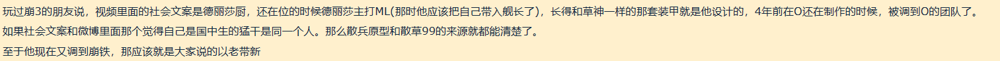
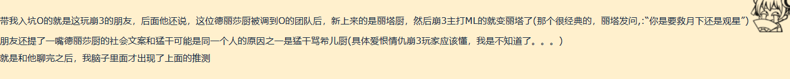
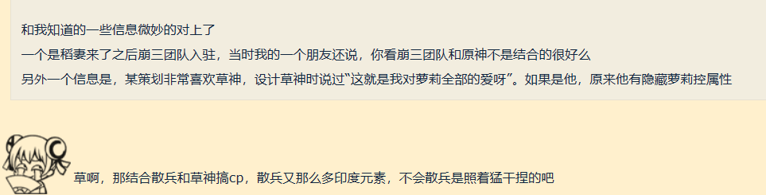
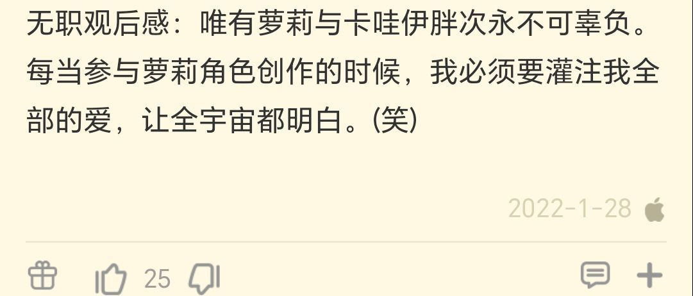

### [热点事件] 由猛干哥称赞尘世锁联想到很多男作者的厕品感情戏，搞不好内部文案真是在搞CP的精神状态下写出散草的

Made by ngapost2md (c) ludoux [GitHub Repo](https://github.com/ludoux/ngapost2md)

----

##### 0.[1] \<pid:0\> 2023-07-29 07:49:23 by 咸鱼小咕哒
尘世锁不就是经典的为了搞暧昧不要政治逻辑
感觉很多男作者写感情戏会跟失智了一样让女主忘掉身份责任和道德
下面请欣赏神奇东出的 经典怀孕梗：

“——那个，只是突然想到。你能怀孕吗？”
时机刚好，ruler刚刚吃完三明治，正在小口喝着咖啡，理解提问意图的瞬间，顺势把咖啡喷了出来。
“突、突突突然之间说什么啊！？”
“……不，没什么”
“小、小孩子！小孩子！小孩子！小、小孩子是上天赐予的东西圣杯战争中考虑这种事简直是无耻至极还要对别人说这种事…………不对！啊啊啊冷静一点啊我！”
……
“那个……难道……齐格君是想让我怀孕吗……？”

看到没，虽然是救国圣女，但是要跟纯真的人造人搞暧昧，也会说出这种让人喷饭的话

散草搞不好是大龄中二文案代入巨婴视角写跟草暧昧才写得这么逆天
“被那个白色的小小的少女，软禁在了净善宫中，可恶，竟然有种还不错的感觉……”
“呐，阿帽君，去做学者好不好？人家想给你修改论文。”
“啊咧？论文什么的……”
卧槽，太合理了，难怪三姐破防了，人家文案并不是拿小草当抹布洗白就扔，人家是来真的。有不知真假的内鬼说散宝在枫丹的剧情是为了受伤的小草怒日博士，这个言情戏走向还真的是……

----

##### 1.[0] \<pid:705586565\> 2023-07-29 07:54:28 by Gdygfdqqqq
“多来点，爱看”
这散草都端上来了，散解怎么不磕啊磕啊，tnnd，不磕是吧，不磕今天谁也别想活着(指ep绑死散草)

----

##### 2.[0] \<pid:705586631\> 2023-07-29 07:55:23 by EIVAAAA
就这样写~~看热闹不嫌事大~~

----

##### 3.[0] \<pid:705586701\> 2023-07-29 07:56:18 by 继往开来之人
看见ruler吓我一跳

----

##### 4.[0] \<pid:705586732\> 2023-07-29 07:56:44 by 萨卡兹甲鱼
能否写的好异性取决于作者的水平，不然写出来的就只是他们想象中的异性，充满了不真实感。

----

##### 5.[0] \<pid:705586940\> 2023-07-29 07:59:24 by 羧基吡啶
别把厕所编的匿名投稿当内鬼消息啊

----

##### 6.[1] \<pid:705587316\> 2023-07-29 08:03:51 by 戊戴董乙韦佘
额，但是齐格是fa的主角，对应的位置是原神的黄毛
实际上东出但凡把齐格和贞德的形象写的好一点，这剧情就该归类到贞德的萌点里去了

----

##### 7.[0] \<pid:705587505\> 2023-07-29 08:06:02 by 己卜薛丁敖焦
反正我和人讨论时觉得文案是真磕散草的，还是吃萝莉妈妈那个口味，让小草降智突然变成对男方暧昧关怀无限包容的圣母
我同意楼主说的男作者在写感情戏时，很容易让女角色失真，蘑菇写女角色写得好是当女儿来看的
凡是把女角色当梦中情人来塑造的非常容易一泻千里，很多男作者写和男主有感情对手戏的女角色时就会原形毕露，比如大刘

之前有人说散草的不合理之处在于宅男不吃，因为没法代入散兵，<b>但如果是男文案自己在代呢</b>，玩家代不代无所谓反正自己爽了先
和想找个妈宠散兵的女性向思路不谋而合，所以拍板下来就这么写，结果男文案越写越high，散兵受众逐渐发现不是cb能解释的，也被创飞了
我可以肯定女性向思路里散草是不可能捆这么死的，来个散解文案写散草绝对不是这个味

----

##### 8.[0] \<pid:705587556\> 2023-07-29 08:06:37 by 咸鱼小咕哒
>[jump](#pid705587316) 戊戴董乙韦佘(6楼) (2023-07-29 08:03)说:
>额，但是齐格是fa的主角，对应的位置是原神的黄毛 实际上东出但凡把齐格和贞德的形象写的好一点，这剧情就该归类到贞德的萌点里去了

但我觉得很多时候编剧根本没代入黄毛，代入的话不会写得这么摄像头工具人。
也许是中二少年更能让编剧共情，情不自禁就代入伞而不是黄毛

----

##### 9.[0] \<pid:705587745\> 2023-07-29 08:08:49 by 咸鱼小咕哒
>[jump](#pid705586940) 羧基吡啶(2023-07-29 07:59)说:
>别把厕所编的匿名投稿当内鬼消息啊[s:ac:喷]

啊，这个消息是厕所传的吗？
我怎么感觉这个展开这么合理，铺垫了博士跟小草的对峙小草搞掉博士切片，铺垫了博士伤害过散宝，铺垫了散宝跟小草的感情，那么接下来……

----

##### 10.[0] \<pid:705587918\> 2023-07-29 08:10:35 by 七月七日长生殿-
想起道诡异仙小白成了白莲圣女之后给男主洗脚了

----

##### 11.[1] \<pid:705588488\> 2023-07-29 08:16:53 by 咸鱼小咕哒
>[jump](#pid705587505) 己卜薛丁敖焦(7楼) (2023-07-29 08:06)说:
>反正我和人讨论时觉得文案是真磕散草的，还是吃萝莉妈妈那个口味，让小草降智突然变成对男方暧昧关怀无限包容的圣母 我同意楼主说的男作者在写感情戏时，很容易让女角色失真，蘑菇写女角色写得好是当女儿来看的 凡是把女角色当梦中情人来塑造的非常容易一泻千里，很多男作者写和男主有感情对手戏的女角色时就会原形毕露，比如大刘  之前有人说散草的不合理之处在于宅男不吃，因为没法代入散兵，<b>但如果是男文案自己在代呢</b>，玩家代不代无所谓反正自己爽了先 和想找个妈宠散兵的女性向思路不谋而合，所以拍板下来就这么写，结果男文案越写越high，散兵受众逐渐发现不是cb能解释的，也被创飞了 我可以肯定女性向思路里散草是不可能捆这么死的，来个散解文案写散草绝对不是这个味[s:ac:哭笑]

[把女角色当梦中情人来塑造的非常容易一泻千里]
想起了江南的路明非和诺诺，江南在那投射Celina学姐，他自己沉醉得无法自拔，外人看着就是傻逼舔狗和绿茶……结果江南还为了这个在微博上怼读者

----

##### 13.[0] \<pid:705589214\> 2023-07-29 08:24:05 by 湖心石
男作者虽然喜欢搞突兀的感情戏，但是一般人家对象是主角啊

----

##### 14.[0] \<pid:705589593\> 2023-07-29 08:27:54 by 涨幅为困难
这猜想给我恶心的够呛，唯一一个不想留档的完了。这事很重要吗？也就你这样草神厨会觉得这事儿很重要了吧。完了，我成情绪价值了

----

##### 15.[0] \<pid:705589807\> 2023-07-29 08:30:11 by Lilith330
>[jump](#pid705589214) 湖心石(2023-07-29 08:24) 说: 
>
>男作者虽然喜欢搞突兀的感情戏，但是一般人家对象是主角啊

3.2之前包括3.3小草确实是和主角卖，除了留了羽毛伏笔
3.3之后主线结束，主角没有留在须弥的戏份了，活动剧情里也摄像头化，没法当皮套了所以换自机cp继续写
这个思路好像也说得通

----

##### 16.[0] \<pid:705590501\> 2023-07-29 08:36:24 by 球球游侠
“这有什么错？我只是犯了每个男频作者都会犯的错误罢了。”

----

##### 18.[0] \<pid:705590977\> 2023-07-29 08:40:45 by baiyefuxue
枫丹散草剧情这么甜吗？这不得不嗑了编剧在推散草这点现在已经算是明牌了吧，不然完全没法解释为什么再三地塞两个人的小料，连散()都骗不了她们自己了。

----

##### 19.[0] \<pid:705591364\> 2023-07-29 08:44:24 by 少男看上哥哥
乳东出了，人东出至少在开播前还想穿越到过去痛打当时的自己一顿。要是猛狗子回去能说的大概只有“不必为过去的自己感到羞愧，不如说为此而感到自豪！”的心情罢。

----

##### 20.[0] \<pid:705591495\> 2023-07-29 08:45:31 by 香槟买好了就等
>[jump](#pid705590501) 球球游侠(2023-07-29 08:36) 说: 
>
>“这有什么错？我只是犯了每个男频作者都会犯的错误罢了。”

猛子哥强就强在男频女频的错都能信手拈来

----

##### 21.[0] \<pid:705591870\> 2023-07-29 08:48:34 by 咸鱼小咕哒

隔壁看到的，太合理了，我以前也听说过小草是内部投射了对萝莉的爱，再想想往小草身上投入的那么多资源……

----

##### 22.[1] \<pid:705592172\> 2023-07-29 08:51:03 by znaibeind
>[jump](#pid705587505) 己卜薛丁敖焦(2023-07-29 08:06) 说: 
>
>反正我和人讨论时觉得文案是真磕散草的，还是吃萝莉妈妈那个口味，让小草降智突然变成对男方暧昧关怀无限包容的圣母
>我同意楼主说的男作者在写感情戏时，很容易让女角色失真，蘑菇写女角色写得好是当女儿来看的
>凡是把女角色当梦中情人来塑造的非常容易一泻千里，很多男作者写和男主有感情对手戏的女角色时就会原形毕露，比如大刘
>
>之前有人说散草的不合理之处在于宅男不吃，因为没法代入散兵，<b>但如果是男文案自己在代呢</b>，玩家代不代无所谓反正自己爽了先
>和想找个妈宠散兵的女性向思路不谋而合，所以拍板下来就这么写

我靠你这思路绝了。。。散兵现在的人设。。。说不定真是男文案自我代入写出来的。。。

----

##### 23.[4] \<pid:705592765\> 2023-07-29 08:56:12 by znaibeind
救命，发散了一下思维，如果猛干哥真的对小草投射了不可名状之爱并用散兵当oc代入，那他被网友社会化扒出来的时间点真的很可疑啊！本来以为是内部矛盾有人想搞他下位，但是现在想想，是不是他之前搞下的烂摊子导致现在草散人设双崩，内部有人看网友冲塔越看越气，把始作俑者用炎枪冲锋的方式扒出来了

----

##### 24.[0] \<pid:705592837\> 2023-07-29 08:56:49 by 某炎
>[jump](#pid705589807) Lilith330(2023-07-29 08:30):

3.3怎么可能卖啊，我在当时就觉得草神在演黄毛了，虽然没1.5w字想的那么深，但是一句在进世界树前加密就觉得不对劲了。由于个人原因我对预案这种事有点敏感，而人从逻辑上来说是没办法给没想到的事做预案的。换言之她这里就是明明想过这个结果的可能性还要去贴其他，这能理解成和黄毛卖也想太多了

----

##### 26.[0] \<pid:705593952\> 2023-07-29 09:05:36 by piepiero
~~滑坡是吧 ~~
如果是散兵oc论，那问题来了，取名系统到底是在讨好谁
李猛干已经表明爱看玩家打架，玩家不是文盲就是op，而且这些话是发在其公开且与同事互关的账号上的，证明公司风气大概率对这些羞辱玩家的言论并不在意
那为什么要给散兵专门搞一个取名系统，且这个系统在后续麻烦无穷，程序员一天到晚和玩家斗智斗勇设违禁词，难道还能是因为散兵赚钱？

----

##### 27.[0] \<pid:705595984\> 2023-07-29 09:21:01 by 咸鱼小咕哒
>[jump](#pid705593952) piepiero(2023-07-29 09:05)说:
><del class='gray'> 滑坡是吧[s:ac:哭笑]  </del> 如果是散兵oc论，那问题来了，取名系统到底是在讨好谁[s:ac:哭笑] 李猛干已经表明爱看玩家打架，玩家不是文盲就是op，而且这些话是发在其公开且与同事互关的账号上的，证明公司风气大概率对这些羞辱玩家的言论并不在意 那为什么要给散兵专门搞一个取名系统，且这个系统在后续麻烦无穷，程序员一天到晚和玩家斗智斗勇设违禁词，难道还能是因为散兵赚钱？

理由当然是“看着女玩家们为自己的oc抓耳挠腮翻遍字典去取名真是太快乐了，一个不受太多制约的编剧真是最快乐的职业呼呼哈哈哈哈哈”

----

##### 28.[0] \<pid:705598211\> 2023-07-29 09:36:00 by D_终于考好了
东出fa里就把主角组写崩了，其他塑造的都很好，天草，女帝 肯娘，小莫啥的配角都刻画的很好，像小太阳还会关心红方master的安危，就也不ooc

----

##### 29.[0] \<pid:705598242\> 2023-07-29 09:36:12 by 澄江月影
回复错了斯密马赛

----

##### 30.[0] \<pid:705598491\> 2023-07-29 09:37:58 by 澄江月影
>[jump](#pid705591870) 咸鱼小咕哒(2023-07-29 08:48) 说: 
>
>
>
>
>
>
>
>隔壁看到的，太合理了，我以前也听说过小草是内部投射了对萝莉的爱，再想想往小草身上投入的那么多资源……

这个咯，幽夜八重csf前后来了个mhych叫T型A系，著名发言“玩家不知道自己要什么”，然后这是在别的板块的发言

----

##### 31.[0] \<pid:705602571\> 2023-07-29 10:04:37 by 咸鱼6666668
这种投射自己的oc在游戏里不应该是大雷吗，什么隔壁的白衍，青雀有人物模型之类基本石锤了吧…有哪个乙女游戏被疑策划带入女主被玩家喷，还有农不是也有个曜是策划以自己为原型制作集体被玩家喷的瓜，所以mhy这怎么就能无事发生，是mhy太糊了吗？

----

##### 32.[0] \<pid:705603161\> 2023-07-29 10:08:22 by Frranxx
男嬷嬷才是最可怕的他们嬷起角色来离谱得要命

----

##### 33.[0] \<pid:705608785\> 2023-07-29 10:42:40 by 猹飞
舔狗只能写出来舔狗舔女神的东西

----

##### 34.[0] \<pid:705609051\> 2023-07-29 10:44:15 by featherine1988
>[jump](#pid705598491) 澄江月影(2023-07-29 09:37) 说: 
>
>
>这个咯，幽夜八重csf前后来了个mhych叫T型A系，著名发言“玩家不知道自己要什么”，然后这是在别的板块的发言

据当时的幽夜疑似内部的人说，T型A系不是编剧，也不是小ch，他是PM

----

##### 35.[1] \<pid:705610198\> 2023-07-29 10:51:04 by 银色放逐
>[jump](#pid705587505) 己卜薛丁敖焦(7楼) (2023-07-29 08:06):

刘慈欣是真的，我当初连看他几本书感觉他心中肯定是有某个女神形象模板的，好几本女主角外貌描写都一个味，性格也是利落但有点生硬，不似活人

----

##### 36.[0] \<pid:705610564\> 2023-07-29 10:53:12 by 疯子二太郎
>[jump](#pid705610198) 银色放逐(2023-07-29 10:51) 说: 
>
>刘慈欣是真的，我当初连看他几本书感觉他心中肯定是有某个女神形象模板的，好几本女主角外貌描写都一个味，性格也是利落但有点生硬，不似活人

只能说还好刘的小说中这些只是很小的一环，也不是重点，有瑕疵也无所谓了

----

##### 37.[0] \<pid:705612452\> 2023-07-29 11:03:34 by 拓跋烨
>[jump](#pid705587505) 己卜薛丁敖焦(7楼) (2023-07-29 08:06):

蘑菇老婆是青子啊，后面的凛也带点青子要素

----

##### 38.[0] \<pid:705615090\> 2023-07-29 11:18:44 by 银色放逐
>[jump](#pid705610564) 疯子二太郎(2023-07-29 10:53)说:
>[quote][pid=705610198,37178323,2]Reply[/pid] <b>Post by [uid=61437304]银色放逐[/uid] (2023-07-29 10:51):</b>  刘慈欣是真的，我当初连看他几本书感觉他心中肯定是有某个女神形象模板的，好几本女主角外貌描写都一个味，性格也是利落但有点生硬，不似活人[/quote]只能说还好刘的小说中这些只是很小的一环[s:ac:哭笑]，也不是重点，有瑕疵也无所谓了

那肯定瑕不掩瑜，又不是江南这种言情作者

----

##### 39.[0] \<pid:705615206\> 2023-07-29 11:19:21 by 向日葵之梦
>[jump](#pid705593952) piepiero(2023-07-29 09:05) 说: 
>
>~~滑坡是吧 ~~
>如果是散兵oc论，那问题来了，取名系统到底是在讨好谁
>李猛干已经表明爱看玩家打架，玩家不是文盲就是op，而且这些话是发在其公开且与同事互关的账号上的，证明公司风气大概率对这些羞辱玩家的言论并不在意
>那为什么要给散兵专门搞一个取名系统，且这个系统在后续麻烦无穷，程序员一天到晚和玩家斗智斗勇设违禁词，难道还能是因为散兵赚钱？

可以设置自己的名字 不一定叫猛干 直接用本名就行 多好代入

