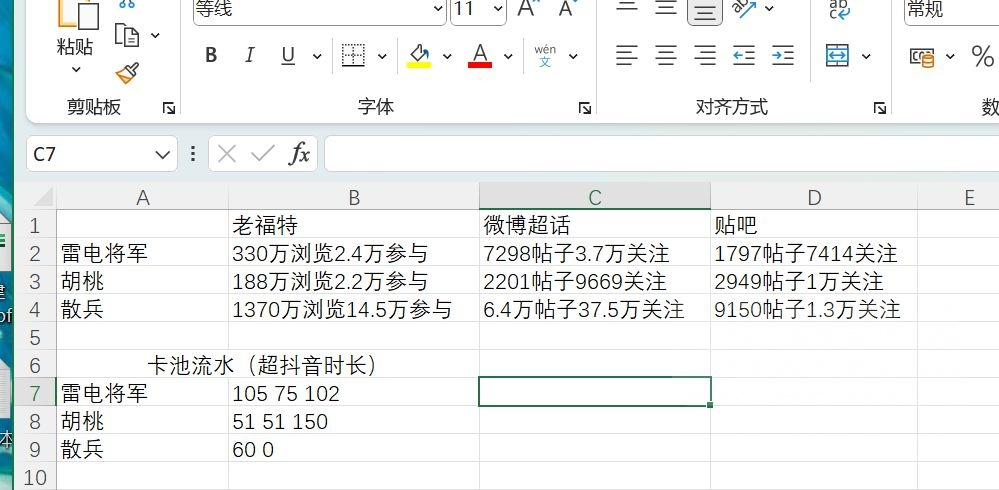

### [不吐不快] 粗略对比下各平台数据来感受下散解的发声能力

Made by ngapost2md (c) ludoux [GitHub Repo](https://github.com/ludoux/ngapost2md)

----

##### 0.[0] \<pid:0\> 2023-07-29 10:11:44 by lng236
首先是b站上有位up通过芭比与其他电影的票房和豆瓣评论量的对比，算出了一个&quot;芭比指数&quot;，即女性的发声量为男性的24倍，虽说这样的分析只能算得上图一乐，但姑且有一定参考价值。考虑到原神各平台角色的流水、以及粉丝数、发帖数等数据都也是可查的，那么我们不妨也对比下散兵和其他角色，通过这些粗略的数据来感受下散解的“发声能力”

在这里我挑选了胡桃和雷神两位超高人气的女角色，通过贴吧微博老福特三个受众有一定差异的平台做出对比，具体如下图

在老福特散兵的参与人数是其余两人之和的约3倍，浏览量约为2.6倍
在微博超话散兵的粉丝人数是其余两人之和的约8倍，发帖量约为7倍
贴吧的数据是最有意思的，散兵吧的人数1.3万，但发帖数是其余两吧之和1.9倍

流水数据，散兵两次卡池流水总时长60h，雷神胡桃前两次卡池之和为180h，102h

----

##### 1.[0] \<pid:705605231\> 2023-07-29 10:21:18 by yian127
三阶话痨啊，一人顶十人。

----

##### 2.[0] \<pid:705605436\> 2023-07-29 10:22:31 by 大饼卷馒头就着稀饭吃
想起某漫画家的一个观点

----

##### 3.[0] \<pid:705605552\> 2023-07-29 10:23:17 by hgsCinnabar
>[jump](#pid0) lng236(2023-07-29 10:11):

兄弟，散加解和三加阶都是禁称，被举办就6+3，我建议用散大妈。

----

##### 4.[0] \<pid:705605887\> 2023-07-29 10:25:14 by Gdygfdqqqq
>[jump](#pid705605552) hgsCinnabar(2023-07-29 10:23) 说: 
>
>兄弟，散加解和三加阶都是禁称，被举办就6+3，我建议用散大妈。

其实版规里虽然禁了，但大伙都在用貌似也没出什么问题

----

##### 5.[0] \<pid:705605892\> 2023-07-29 10:25:14 by 赛博督战円
我建议，改叫原太子妃吧。。。

----

##### 6.[1] \<pid:705606112\> 2023-07-29 10:26:33 by xlsq03
散tag很水的，可以说一半以上是注水
这也算老坟头一个漏洞，不管你是注水还是正经做饭还是炸tag刷屏，只要打了tag就算参与了建设
当年的水皇喻黄也差不多是这个情况(说完送直出去

----

##### 7.[0] \<pid:705606170\> 2023-07-29 10:26:53 by lng236
>[jump](#pid705605552) hgsCinnabar(2023-07-29 10:23)说:
><b>Reply to [tid=37179304]Topic[/tid] Post by [uid=65136140]lng236[/uid] (2023-07-29 10:11)</b>  兄弟，散加解和三加阶都是禁称，被举办就6+3，我建议用散大妈。

感谢提醒，改成散厨算了

----

##### 8.[0] \<pid:705606231\> 2023-07-29 10:27:14 by hgsCinnabar
>[jump](#pid705605887) Gdygfdqqqq(2023-07-29 10:25) 说: 
>
>其实版规里虽然禁了，但大伙都在用貌似也没出什么问题

那这不就是想封你就封你

----

##### 9.[1] \<pid:705606371\> 2023-07-29 10:28:05 by 甲章谢甲卜柳
你想想2.2w楼和这次散兵的抽取数人穷批话多

----

##### 10.[0] \<pid:705606419\> 2023-07-29 10:28:22 by Auroramae
()()不愧是数据女工，感觉补充一下人均浏览量/发帖量可能会更直观

----

##### 11.[1] \<pid:705606706\> 2023-07-29 10:29:55 by 一塊紅布
茶馆里面一百多个3÷能屙出几万楼就能说明问题

----

##### 12.[6] \<pid:705606856\> 2023-07-29 10:30:43 by Wing64
2.2w楼里前100位解解贡献了1.1w楼，看这就知道了

----

##### 13.[0] \<pid:705607061\> 2023-07-29 10:32:01 by kjhbiuhuhiuh123
之前nga那专楼我记得就是所有角色楼里最高的吧，是真的能水

----

##### 14.[0] \<pid:705607163\> 2023-07-29 10:32:41 by lng236
>[jump](#pid705606419) Auroramae(2023-07-29 10:28)说:
>()()不愧是数据女工，感觉补充一下人均浏览量/发帖量可能会更直观

人均我也估了一下，除了贴吧以外其他地方没有太大差异，可能和平台受众也有很大关系

----

##### 15.[0] \<pid:705607263\> 2023-07-29 10:33:16 by 青春派洛迪
1只散厨=250只鸭子

----

##### 16.[0] \<pid:705607313\> 2023-07-29 10:33:35 by 四十度大陆
转自虎扑老哥的话
人少钱少   声音大屁事多

----

##### 17.[0] \<pid:705607482\> 2023-07-29 10:34:37 by 水幻形
就叫赔钱指数吧

----

##### 18.[0] \<pid:705607493\> 2023-07-29 10:34:41 by 路过的炀
芭比指数，女性发言欲望是男性的24倍。

----

##### 19.[4] \<pid:705607677\> 2023-07-29 10:35:46 by Lilith330
而且极有可能是同一帮人在各个平台活跃，我前几天看了一些豆瓣原组的截图，那些人说话和微博厕妹是一个味，而我去年之前在原组的体验不是这样的，里面是真萌萌人，说话是豆瓣土著女性用户风格。
现在原组那味已经变成“爱看，多来点”“烫烫的很安心”这种垃圾话了

还有，在泥潭发晚安贴的人也非常可能和超话，豆瓣，小红薯是同一批人(假定他们真的是发的自己的满命而不是假图吧)

----

##### 20.[3] \<pid:705607681\> 2023-07-29 10:35:48 by 戊童葛庚崔祝
散兵tag有一张炸tag的图，散粉能刷出两三千个重复tag美名其曰把黑图刷下去，之前还沾沾自喜有人炸tag就是在帮她家散兵做数据，我简直怀疑她家炸tag都是自导自演方便名正言顺刷数据了，放眼整个二次元圈子应该都找不到比她家更水的了，估计只有真人明星的tag水度可以和散兵一拼

----

##### 21.[0] \<pid:705607708\> 2023-07-29 10:36:00 by 森罗万象AL
声音大，人数少，屁事多

----

##### 22.[0] \<pid:705607946\> 2023-07-29 10:37:36 by 残血之殇
澳大利亚袋鼠 无端联想

