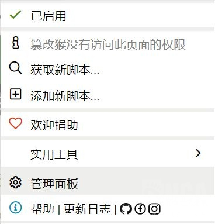
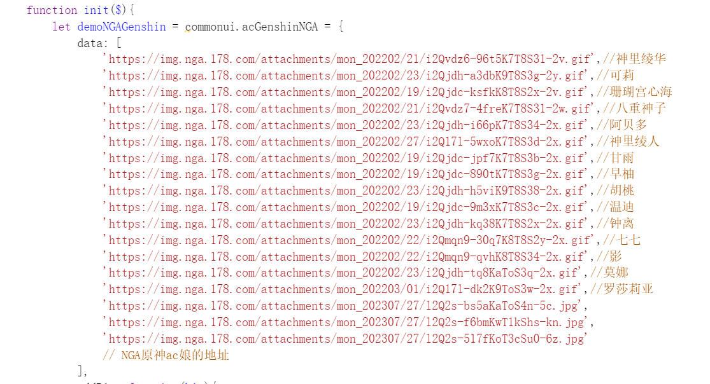
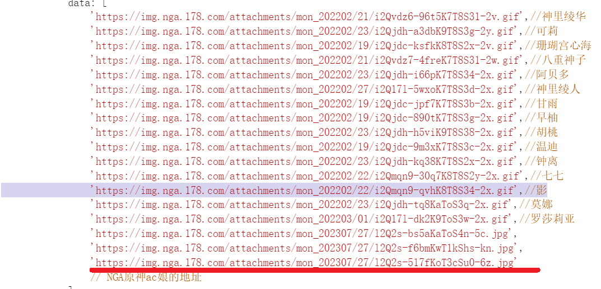
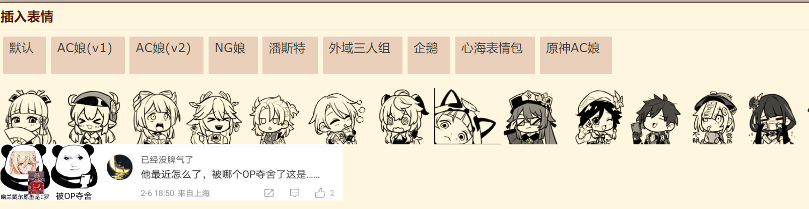

### [不吐不快]教你如何把大猛干语录加入nga表情

Made by ngapost2md (c) ludoux [GitHub Repo](https://github.com/ludoux/ngapost2md)

----

##### 0.[4] \<pid:0\> 2023-07-29 12:33:31 by 油门踩到底
第一步
按照[该教程](https://bbs.nga.cn/read.php?tid=30740157)，添加原神表情包

第二步
点击右上角的油猴插件图标
点击管理面板

找到原神表情包，点开

往下翻，来到这一部分(因为我的脚本已经自行做了一些删改，所以看起来比你们刚装好的要少，但是不要紧)

第三步
删掉某一行，即可删掉对应的表情(图里的影)
增加某一图片链接，即可添加对应的表情(图里的横线)
注意格式：图片链接的前后有英文单引号，最后有逗号

效果如下：

附注：图片链接的获取方式
右键单击图片，点击复制图片地址

----

##### 1.[1] \<pid:705630364\> 2023-07-29 12:45:28 by 经常看书看得开

----

##### 2.[0] \<pid:705636155\> 2023-07-29 13:19:13 by 迷你靓仔
另外强烈建议油猴的nga摸鱼小助手 用了都说好

----

##### 3.[0] \<pid:706111134\> 2023-07-31 21:14:48 by 油门踩到底
顶顶，技术贴别沉了

----

##### 4.[0] \<pid:706111674\> 2023-07-31 21:18:49 by 清蒸盐姜香菜鱼
帮顶一下hhhh

----

##### 5.[0] \<pid:706112491\> 2023-07-31 21:24:08 by kemax3
技术贴支持下

----

##### 6.[0] \<pid:706112618\> 2023-07-31 21:25:05 by 友项
支持下老哥

----

##### 7.[0] \<pid:706112642\> 2023-07-31 21:25:15 by safindem
滋瓷！

----

##### 8.[0] \<pid:706112813\> 2023-07-31 21:26:22 by 岁晚云绮
顶，好帖莫沉

