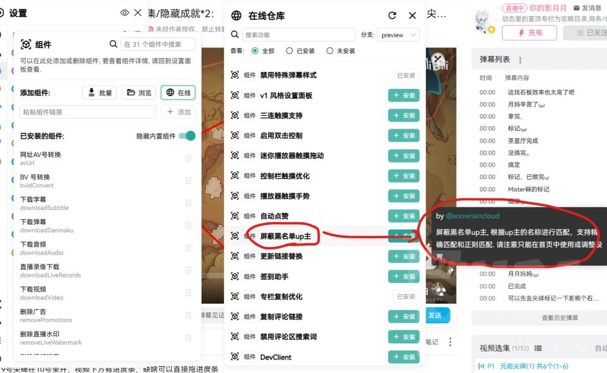

### [不吐不快] b站web端有拉黑功能吗

Made by ngapost2md (c) ludoux [GitHub Repo](https://github.com/ludoux/ngapost2md)

----

##### 0.[0] \<pid:0\> 2023-07-29 13:53:23 by UID64544820
或者类似的脚本， 首页刷新一次一个其他。

----

##### 1.[0] \<pid:705649421\> 2023-07-29 14:35:57 by 摆烂的鱼鱼
有的吧，印象中以前有人提过，看有没有老哥愿意解答了。或者自己找，别做伸手党。

----

##### 2.[0] \<pid:705650206\> 2023-07-29 14:40:35 by 残血之殇
点进首页关注旁边不就是拉黑吗

----

##### 3.[0] \<pid:705650662\> 2023-07-29 14:43:08 by UID3563849
可以拉黑但不能点踩

----

##### 4.[0] \<pid:705651493\> 2023-07-29 14:48:06 by moseyuyan
貌似哔哩漫游可以

----

##### 6.[0] \<pid:705652035\> 2023-07-29 14:51:43 by 青春派洛迪
有，下个油猴，再去greasyfork搜索b站下个脚本复制进去就行了

----

##### 7.[0] \<pid:705653069\> 2023-07-29 14:57:55 by 小星星暄妍
bilibili evolved，一个综合脚本里面，有个屏蔽拉黑up主功能
我记得再github上有，可以找找看
然后他的脚本仓库大陆直连有点慢

----

##### 8.[0] \<pid:705653191\> 2023-07-29 14:58:40 by ★_☆
[url](https://github.com/the1812/Bilibili-Evolved)
这个应该有你想要的功能

