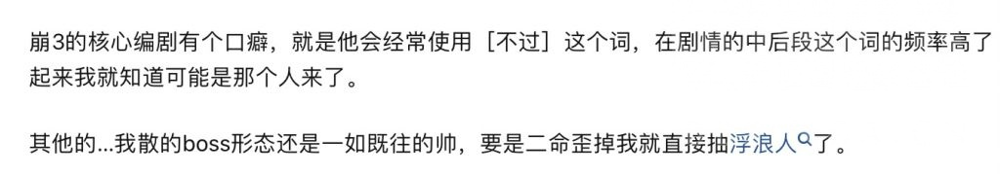
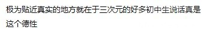
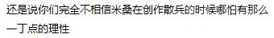
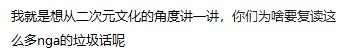
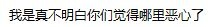
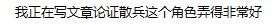

### [不吐不快] 突然想分享一篇关于散兵的分析，倒是很大程度上启发了我

Made by ngapost2md (c) ludoux [GitHub Repo](https://github.com/ludoux/ngapost2md)

----

##### 0.[0] \<pid:0\> 2023-07-29 17:30:56 by 不尔魃
先放链接:
[url](https://www.zhihu.com/question/597192620/answer/3081568079)

~~应该有不少人认识这位著名的末日钟作者~~
先知对散兵的塑造评价整体反而没那么负面，这和我不太相同，但是他对散兵的定性我个人是比较赞同的，散兵形象的主要内核，其实就是一个初中生对人生定位的迷茫。
如原文所说
[quote]
原神里的绝大多数人物都有一个极为明确的社会定位，下到服务员、街溜子，上到什么什么官，什么什么仙，再往上还有七神，大家都各安其位，各司其职。他们的社会定位尽管也未必都是与生俱来的，但在此之前的经历处于一个存而不论的状态，在她们的人物弧光上占据的份额无限接近于零，甚至可以说就没有人物弧光。原神在设定上也暗合了“社会定位的确定”——神之眼会固化持有者最强烈的心愿。能与旅行者同行的都是有神之眼的，并且在他们与旅行者同行(也就是参与到剧情中)时早就拿到神之眼了，因此他们的形象基本上不会发生太大改变。流浪者则很不一样，他的剧情重点落在拿到神之眼之前，而旅行者深度参与了他取得神之眼的过程。一个人怎样看待他的社会定位，很大程度上反映了他所处的发育阶段。认为自己需要有一个社会定位，并且已经处在那个位置，或者能看到通往那个位置的路(哪怕可行性无限接近零)，就算是成年人了，这样的角色占了多数；并不认为自己需要一个社会定位，那就是儿童，比如可莉、瑶瑶等；如果非常渴望自己有一个社会定位，却完全不知道怎么达到这个定位，甚至不知道这个定位是什么，那就是“初中生”。原神里唯一位于“初中生”这个发育阶段的，就是流浪者了。与小学生和高中生相比，初中生在教学工作上是最棘手的对象，其根本原因就反映在上一段中。小学生没有社会定位的概念，老师说什么就是什么，所以好带；高中生已经认识到自己来念书的主要目的是考大学，自己跟老师就是一个相互冲业绩的关系，所以也不难带；初中生则往往有着各种各样的奇怪诉求，他们渴望成为社会的一部分，因自己可能还不被社会所接纳而感到巨大焦虑，并且为了弄到一个专属的社会定位，他们什么都敢做。你在初中，对老师讲课感到无聊而看向窗外时，就真的没有想象过，大怪兽(或者使徒，或者绿巨人，或者神尊恐虐放血鬼，或者随便什么玩意)破门而入，你觉醒了什么什么力量挺身而出把大怪兽消灭吗？你被困在“初中生”这个毫无意义的临时定位上，而打败这个大怪兽能让你马上收获一个牛逼闪闪的社会角色。几十年以来，基于这一图景的轻小说可谓是满坑满谷，从中古时代的《夏娜》到现在的“全班穿越到异世界但只有我如何如何”全都是为了满足初中生获取一个专属定位的心理需求。哪怕这一创作切入点被《我的朋友很少》和《我的青春恋爱物语果然有问题》狠狠地批判过，都依然长盛不衰，因为这本来就是客户的刚需啊，最多只是换个形式罢了。[/quote]“初中生”这三个字一下子就解决了我之前一直隐约觉得不对的地方——
为啥我老觉得散兵矫情呢？因为初中生本来就矫情
为啥散兵自始至终都不知道自己要干啥呢?因为初中生的特点就是不知道自己要干啥。
包括散兵身上融的那一堆乱七八糟的典故——倒也确实符合中二的人设(
甚至连很多散厨的反应，只要想想为什么他会和散兵共情，都豁然开朗了

我现在唯一的疑惑变成了，写散兵这个剧情的，到底是故意的呢，还是确实就这个水平了

----

##### 1.[0] \<pid:705678966\> 2023-07-29 17:36:17 by 怎样才能不被禁言1
有人搬过的，就在秋圣那会

----

##### 2.[9] \<pid:705679248\> 2023-07-29 17:38:04 by sbsx123
你想写初中生的迷茫，那这个角色最好真是个初中生，而不是个灭人全家的500岁巨婴。这就是散兵和文中提到的轻小说的区别。

----

##### 3.[0] \<pid:705679538\> 2023-07-29 17:39:45 by 不尔魃
>[jump](#pid705679248) sbsx123(2023-07-29 17:38)说:
>你想写初中生的迷茫，那这个角色最好真是个初中生，而不是个灭人全家的500岁巨婴。这就是散兵和文中提到的轻小说的区别。

~~老米乱缝东西顾头不顾腚也不是第一天了~~

----

##### 4.[0] \<pid:705679822\> 2023-07-29 17:41:23 by 卡普琪琪3
缺点是初中生平均来看既有爹又有妈，而散兵无论爹妈都得靠抢别人的。

当然，散兵有个萝莉老婆，散兵，赢！

----

##### 5.[0] \<pid:705679832\> 2023-07-29 17:41:27 by mihomopromax
我朋友今天跟我聊:我打完3.3感觉就是迷茫，其他有什么好委屈的
我:你套一下xxn思维，是不是完全理解了。

----

##### 6.[1] \<pid:705679928\> 2023-07-29 17:42:04 by 寅路严甲齐冯
>[jump](#pid705679248) sbsx123(2023-07-29 17:38) 说: 
>
>你想写初中生的迷茫，那这个角色最好真是个初中生，而不是个灭人全家的500岁巨婴。这就是散兵和文中提到的轻小说的区别。

有个舅舅发的废案里对雷电五传的解释是留有余地的(绝大部分都是被散兵恐吓离开的或者逃出了稻妻)，包括散草在废案里关系很一般，但是现文里写百目全门被杀，散草暧昧，你说他不是故意改成这样引起玩家吵架我真不信

----

##### 7.[0] \<pid:705680452\> 2023-07-29 17:44:40 by safindem
这哥在评论区就没正面过和500岁阅历正面冲突的问题啊，鉴定为还是初中老师做出优越感了，觉得自己在人性把握上高于众网友。
不过话说回来清华本博最后选择做初中老师也挺那啥的。

----

##### 8.[0] \<pid:705681315\> 2023-07-29 17:48:22 by 不织围脖
哪个初中生有这么多“战绩”啊

----

##### 9.[0] \<pid:705681597\> 2023-07-29 17:49:42 by 不尔魃
>[jump](#pid705680452) safindem(2023-07-29 17:44)说:
>这哥在评论区侃侃而谈但唯独就没正面回应过和500岁阅历冲突的问题啊，鉴定为还是初中老师做出优越感了，觉得自己在人性把握上高于众网友。 不过话说回来清华本博最后选择做初中老师也挺那啥的。

这个本身倒也不是问题(
毕竟就像他自己的另一篇文章说得那样，设定的年龄、外貌的年龄、心理的年龄，是三回事，也没人要求草神表现得像个老奶奶不是(

我对他不赞同的点主要在于，单个的人物形象可以low可以就巨婴，但是作品里面的整个客观环境不应该就这么围着这个巨婴转、跟着初中生化，因为大部分玩家既不是初中生也不是巨婴。

----

##### 10.[0] \<pid:705681795\> 2023-07-29 17:50:43 by 四枝星穗
我朝！《国中生》！

----

##### 11.[1] \<pid:705682089\> 2023-07-29 17:52:01 by Giovann
>[jump](#pid705680452) safindem(2023-07-29 17:44) 说: 
>
>这哥在评论区侃侃而谈但唯独就没正面回应过和500岁阅历冲突的问题啊，鉴定为还是初中老师做出优越感了，觉得自己在人性把握上高于众网友。
>不过话说回来清华本博最后选择做初中老师也挺那啥的。

现在高学历人才大量进入初高中已经不是什么新鲜事了，清北也是一样的

----

##### 12.[0] \<pid:705682307\> 2023-07-29 17:52:58 by Seeyoupelos
初中生首先是上过中学，你游写的什么野人

----

##### 13.[1] \<pid:705682310\> 2023-07-29 17:52:58 by 我话山居不记年
>[jump](#pid705679248) sbsx123(2023-07-29 17:38)说:
>你想写初中生的迷茫，那这个角色最好真是个初中生，而不是个灭人全家的500岁巨婴。这就是散兵和文中提到的轻小说的区别。[s:ac:茶]

因为初中生就喜欢那种身怀利器，杀心自起的狗屁剧情

----

##### 14.[0] \<pid:705682426\> 2023-07-29 17:53:32 by kunizu
惨圈思维的具象化，别人没照顾到我凄惨的劣势条件，那就是背叛我。我被世界背叛，我要嘴臭世界

----

##### 15.[2] \<pid:705683201\> 2023-07-29 17:57:25 by 不尔魃
>[jump](#pid705682426) kunizu(2023-07-29 17:53)说:
>惨圈思维的具象化，别人没照顾到我凄惨的劣势条件，那就是背叛我。我被世界背叛，我要嘴臭世界

~~刚好之前了解过这个圈，确实就有点没长大的初中生的感觉~~
整个散兵剧情最大的问题是，你可以塑造一个这样的角色，但是你不能连自己也跟着入戏跟着自怨自艾去了啊

我总怀疑是编剧里面混进去了有些真情实意和这玩意共情的人

----

##### 16.[0] \<pid:705684071\> 2023-07-29 18:01:46 by 秋眠我东阁
>[jump](#pid705681795) 四枝星穗(2023-07-29 17:50) 说: 
>
>我朝！《国中生》！

我超，四枝星穗

----

##### 17.[0] \<pid:705684399\> 2023-07-29 18:03:39 by lym9494
纠正一下，不是初中生，是国中生

----

##### 18.[0] \<pid:705685295\> 2023-07-29 18:08:11 by safindem
>[jump](#pid705682426) kunizu(2023-07-29 17:53)说:
>惨圈思维的具象化，别人没照顾到我凄惨的劣势条件，那就是背叛我。我被世界背叛，我要嘴臭世界

代入一下大伟哥想起TNL事件的阴影潸然泪下

----

##### 20.[0] \<pid:705686002\> 2023-07-29 18:12:18 by safindem
>[jump](#pid705681597) 不尔魃(2023-07-29 17:49)说:
><b>Reply to [pid=705680452,37183781,1]Reply[/pid] Post by [uid=25913940]safindem[/uid] (2023-07-29 17:44)</b>这个本身倒也不是问题( 毕竟就像他自己的另一篇文章说得那样，设定的年龄、外貌的年龄、心理的年龄，是三回事，也没人要求草神表现得像个老奶奶不是(  我对他不赞同的点主要在于，单个的人物形象可以low可以就巨婴，但是作品里面的整个客观环境不应该就这么围着这个巨婴转、跟着初中生化，因为大部分玩家既不是初中生也不是巨婴。

有没有一种可能，是原神这个编剧组确实没活了才显得太子的剧情很突出3.2只是一个意外

----

##### 21.[0] \<pid:705686444\> 2023-07-29 18:14:48 by EIVAAAA
>[jump](#pid705683201) 不尔魃(2023-07-29 17:57) 说: 
>
>~~刚好之前了解过这个圈，确实就有点没长大的初中生的感觉~~
>整个散兵剧情最大的问题是，你可以塑造一个这样的角色，但是你不能连自己也跟着入戏跟着自怨自艾去了啊
>
>我总怀疑是编剧里面混进去了有些真情实意和这玩意共情的人

你指的是38岁长相像国中生的李猛干老师吗

----

##### 22.[0] \<pid:705686534\> 2023-07-29 18:15:15 by 寻找着徘徊着
14岁的初中生和500岁的初中生那不是一个待遇，懂吗？

----

##### 23.[0] \<pid:705690918\> 2023-07-29 18:41:48 by 色胚茄子
前面霓虹国中生那边分析得还真挺好，让我想通了一个久远的三次背叛的问题

<a href="javascript:;" onclick="collapse(this);">+</a>如果你好奇我在想什么，不看也没事，没改变我对这剧情的理解 ...
第三次背叛他的可能并不是小孩而是[自己]
也就是这个不死不灭的人偶的身份
“我把小孩当成一个被双亲背叛(放弃)、被社会背叛(自然灾害)的同类，为什么他寄了我没事”“如果我就是个普通人，这时候不就也寄了吗”
可以说那时候他就开始潜意识中在追求自我毁灭了，只不过一直到面对这个B世界树时才完全意识到
后面这不就又回到最开始的问题了，因为纳西妲破防的都是炼铜的自律人，有种天下皆醉他独醒的感觉还字里行间暗示mhy卖小草ml，不惜“暧昧地暗示”“享用幼女了”，嗯……挠头了哥
纳西妲智力部分中，度化散兵的话疗尚不能使玩家信服，如何使玩家认定散兵已经心服口服？在这种错位下安排他去读书、钦定他去参加学园祭只能说是败笔里的败笔。就算是他经常爱拐的日轻，嘴炮的地方也是实实在在能让中二熊孩子共鸣的，原这段的迷惑之处在于小草这两句干巴巴的，属实是把不懂人心发挥到极致，仿佛伊迪娅的大治疗术，一下子就改邪归正了
其他部分潭里车过太多了，不再赘述
最后想菜评一下他申鹤的部分，“《神女劈观》是大家想象中的申鹤，在某种意义上也是申鹤理想中的自己。” 我和他肯定有一个人对神女劈观的理解出了问题。至少在我的理解里，申鹤不会期待一个所谓理想中的自己。我认为她是更加现实的，不会对“假如我……”多加考量。

----

##### 25.[0] \<pid:705696452\> 2023-07-29 19:05:48 by 奔跑的苦茶子
>[jump](#pid705679248) sbsx123(2023-07-29 17:38) 说: 
>
>你想写初中生的迷茫，那这个角色最好真是个初中生，而不是个灭人全家的500岁巨婴。这就是散兵和文中提到的轻小说的区别。

但是初中生的话，确实喜欢给自己艹这种人设(至今记得初中女同学写小说，把班里女生都写成xxx妃子xxx郡主什么的，然后冠上据说是历史上的大姓，还一堆人去报名挑人设)，能不能hold住人家是不管的，高大上是第一位的散兵这种啥好的都往身上堆的行为，又是神造物又是执行官又是什么白枝的，不是和“xx大姓的xx妃”一样嘛

----

##### 26.[0] \<pid:705696989\> 2023-07-29 19:08:31 by sbsx123
>[jump](#pid705696452) 奔跑的苦茶子(2023-07-29 19:05) 说: 
>
>但是初中生的话，确实喜欢给自己艹这种人设(至今记得初中女同学写小说，把班里女生都写成xxx妃子xxx郡主什么的，然后冠上据说是历史上的大姓，还一堆人去报名挑人设)，能不能hold住人家是不管的，高大上是第一位的散兵这种啥好的都往身上堆的行为，又是神造物又是执行官又是什么白枝的，不是和“xx大姓的xx妃”一样嘛

所以这就是“专业作家写初中生”和“初中生写作文”的区别啊，而mhy文案的水平是后者

----

##### 27.[0] \<pid:705697606\> 2023-07-29 19:11:53 by ninesky1985
前排预警，这个歧路先知是个真散兵厨子

----

##### 28.[0] \<pid:705698326\> 2023-07-29 19:16:03 by 不尔魃
>[jump](#pid705697606) ninesky1985(2023-07-29 19:11)说:
>前排预警，这个歧路先知是个真散兵厨子  [img]https://img.nga.178.com/attachments/mon_202307/29/l2Q2s-j8asK8T1kS9f-1k.jpg[/img] [img]https://img.nga.178.com/attachments/mon_202307/29/l2Q2s-6dadK2ToS3u-t.jpg[/img] [img]https://img.nga.178.com/attachments/mon_202307/29/l2Q2s-fjxfKaT1kS9a-1e.jpg[/img] [img]https://img.nga.178.com/attachments/mon_202307/29/l2Q2s-1x9mK4ToS5v-q.jpg[/img] [img]https://img.nga.178.com/attachments/mon_202307/29/l2Q2s-aol8KaT1kS9g-1c.jpg[/img] [img]https://img.nga.178.com/attachments/mon_202307/29/l2Q2s-ih29K9T1kS9k-1e.jpg[/img] [img]https://img.nga.178.com/attachments/mon_202307/29/l2Q2s-4x1rK4ToS5s-r.jpg[/img] [img]https://img.nga.178.com/attachments/mon_202307/29/l2Q2s-di3tK6ToS7m-p.jpg[/img] [img]https://img.nga.178.com/attachments/mon_202307/29/l2Q2s-di3tK6ToS7m-p.jpg[/img]

他是什么出发点其实我并不在乎
我个人觉得他对散兵角色本人的定性是准确的，而米的问题从来不是在于散兵这个形象本身，而在于故事中整个大环境的对这个形象的反应，你要以什么样的态度应对这样一个人 这才是问题所在

----

##### 29.[0] \<pid:705701439\> 2023-07-29 19:34:03 by ninesky1985
>[jump](#pid705698326) 不尔魃(2023-07-29 19:16) 说: 
>
>他是什么出发点其实我并不在乎
>我个人觉得他对散兵角色本人的定性是准确的，而米的问题从来不是在于散兵这个形象本身，而在于故事中整个大环境的对这个形象的反应，你要以什么样的态度应对这样一个人 这才是问题所在

我其实也不在乎，但是我很讨厌这种高高在上以老子的身份对儿子说教的态度，说句难听的汝勾八何人啊您配吗

----

##### 30.[0] \<pid:705701712\> 2023-07-29 19:35:40 by 贾元春儿
>[jump](#pid705697606) ninesky1985(2023-07-29 19:11) 说: 
>
>前排预警，这个歧路先知是个真散兵厨子
>
>
>
>
>
>[img]./mon_202307/29/l

塑造一个嘴臭角色本身不是问题，但你tm要把配套的“吃瘪”环节给补到位啊！

总有反驳的人提到“唉，傲娇退环境了”或者“雌小鬼不是受众很多吗？怎么现在出一个雄小鬼就那么多人受不了？”

拜托搞清楚一点：
- 傲娇傲娇，重点是要有娇。迪奥娜的傲娇怎么没退环境呢？优菈的傲娇怎么没退环境呢？甚至小提传说里那句“笨，往上看！”也有傲娇味，可受欢迎得很呢！
- 雌小鬼的关键是要有“吃瘪”环节，雌小鬼不吃瘪谁看？观众/玩家又不是抖M…而散呢？除了高达战大头朝下一次他还吃啥瘪了？编剧倒是一直在安排他狂妄刻薄锐评嘴臭让别人吃瘪呢。

这能让玩家观感好才是见了鬼了

----

##### 31.[0] \<pid:705701947\> 2023-07-29 19:36:55 by Nimbus純水100
>[jump](#pid705679822) 卡普琪琪3(2023-07-29 17:41) 说: 
>缺点是初中生平均来看既有爹又有妈，而散兵无论爹妈都得靠抢别人的。
>当然，散兵有个萝莉老婆，散兵，赢！

这家的萝莉老婆年纪跟八重一样大

----

##### 32.[0] \<pid:705729000\> 2023-07-29 22:01:50 by 奔跑的苦茶子
>[jump](#pid705696989) sbsx123(2023-07-29 19:08) 说: 
>
>所以这就是“专业作家写初中生”和“初中生写作文”的区别啊，而mhy文案的水平是后者

那确实是

