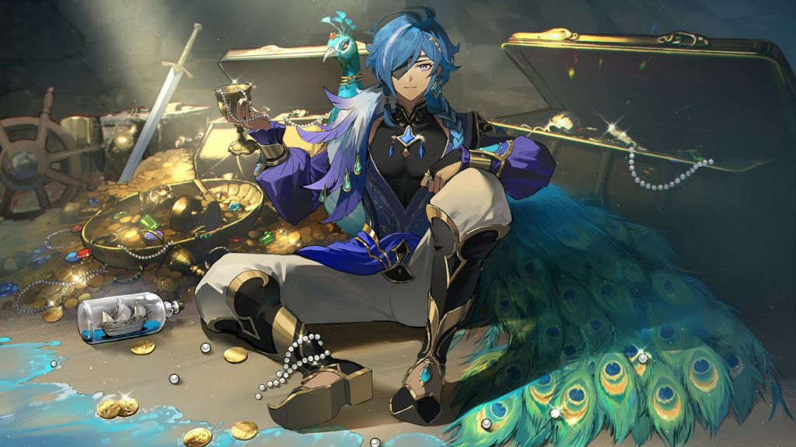
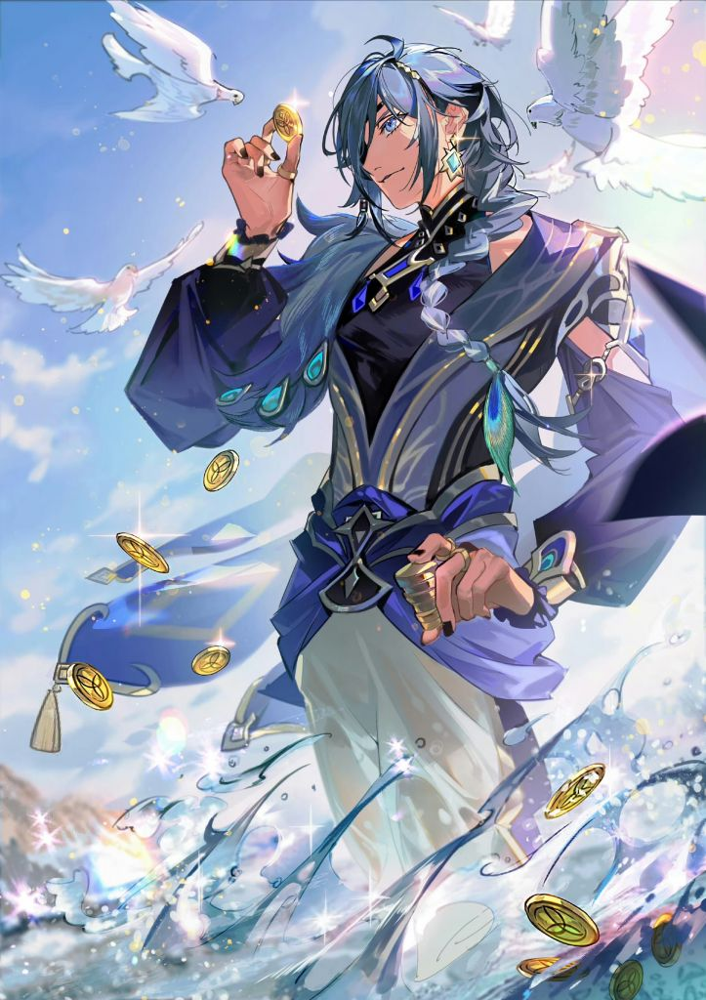

### [不吐不快][不吐不快]米哈游：版本宣传图我放了4个人，你猜猜谁没被邀请

Made by ngapost2md (c) ludoux [GitHub Repo](https://github.com/ludoux/ngapost2md)

----

##### 0.[1] \<pid:0\> 2023-07-29 17:32:07 by 奈何子不语

凯亚:原来我只是路人

----

##### 1.[0] \<pid:705678436\> 2023-07-29 17:33:14 by 丹阳子-
你猜猜流水池子还有一个人是谁

----

##### 2.[2] \<pid:705678777\> 2023-07-29 17:35:08 by 狐言轻语
须弥太子没和她们在一幅图里，已经是太子的仁慈了。

----

##### 3.[3] \<pid:705678802\> 2023-07-29 17:35:17 by 侧卫711
我是挺佩服mhy了，一个角色搞那么多是非出来还非要推。也是七圣做成这样没啥关注也一直推，毕竟都是他们y“用心”做的，不吃也要吃。

----

##### 4.[0] \<pid:705678862\> 2023-07-29 17:35:38 by Abendsonne
我们有单人大图，你其他活动角色有吗
打码谢谢

----

##### 5.[1] \<pid:705678996\> 2023-07-29 17:36:28 by meg1412
挺好的四个美少女，凯亚有个皮肤立绘画的也还行

----

##### 6.[0] \<pid:705679053\> 2023-07-29 17:36:50 by mihomopromax
感觉不如商单余烬重生

----

##### 7.[5] \<pid:705679363\> 2023-07-29 17:38:49 by 小卒龍寒
怎么又是这张鬼图啊，记得之前前瞻是不是也放过，米哈游就这么喜欢这张图？不会真是原本的1kw贺图吧

----

##### 8.[0] \<pid:705679502\> 2023-07-29 17:39:34 by 奈何子不语
凯亚：我寻思我还有邀约

----

##### 9.[0] \<pid:705679661\> 2023-07-29 17:40:27 by 巳龚蓝丑郝芦
归途打马

----

##### 10.[0] \<pid:705679742\> 2023-07-29 17:40:50 by 寻找着徘徊着
我真的很好奇，明知道一个东西已经烂透了，不急着切割，反而继续按照原有的方案硬推下去，到底是怎样的精神和毅力，或者说，傲慢？

----

##### 11.[1] \<pid:705679955\> 2023-07-29 17:42:13 by hgsCinnabar
F**k  you man，鬼图打码please

----

##### 12.[0] \<pid:705680471\> 2023-07-29 17:44:45 by 魑魅魍魉魖魌
凯亚不需要和晦气玩意儿同屏，谢谢

----

##### 13.[0] \<pid:705680908\> 2023-07-29 17:46:33 by 不要和傻逼争论
>[jump](#pid705678802) 侧卫711(2023-07-29 17:35) 说: 
>
>我是挺佩服mhy了，一个角色搞那么多是非出来还非要推。也是七圣做成这样没啥关注也一直推，毕竟都是他们y“用心”做的，不吃也要吃。

用心做的x
用心拉的√

----

##### 14.[0] \<pid:705681038\> 2023-07-29 17:47:10 by 水果布丁布丁
不能比较这<b>版本宣传图</b>和单人图的用心程度

----

##### 15.[0] \<pid:705681173\> 2023-07-29 17:47:45 by 云影之离
>[jump](#pid705679363) 小卒龍寒(2023-07-29 17:38) 说: 
>
>怎么又是这张鬼图啊，记得之前前瞻是不是也放过，米哈游就这么喜欢这张图？不会真是原本的1kw贺图吧

这张显然是3.8版本下半的版图啊

----

##### 16.[0] \<pid:705681377\> 2023-07-29 17:48:42 by 废墟幻想
兰纳罗又被当工具

----

##### 17.[0] \<pid:705682745\> 2023-07-29 17:55:15 by 时不时谋定国之计
不沾屎是好事

----

##### 18.[0] \<pid:705685844\> 2023-07-29 18:11:16 by 谢小咸
鬼图打码

----

##### 19.[1] \<pid:705687187\> 2023-07-29 18:19:00 by 侧卫711
>[jump](#pid705680908) 不要和傻逼争论(2023-07-29 17:46) 说: 
>
>用心做的x
>用心拉的√

关键不符合商业逻辑啊，怪不得不上市，上市这些神仙估计早被赶走了。

----

##### 20.[0] \<pid:705687426\> 2023-07-29 18:20:22 by Kaekaekae
你这就不懂了，这是为了顺理成章给散画单人大海报
你看看之前同样是第一次复刻的其他须弥角色有这待遇吗

----

##### 21.[0] \<pid:705688879\> 2023-07-29 18:29:01 by 甜橙子焦糖汽水
能不能给那谁打码啊伤害到我眼睛了

----

##### 22.[0] \<pid:705689349\> 2023-07-29 18:31:58 by 渐行渐远ii
今天刷到上半池子的同人征集(约稿)获奖作品了，里面凯亚那质量真的很高，哪张都秒了其他

