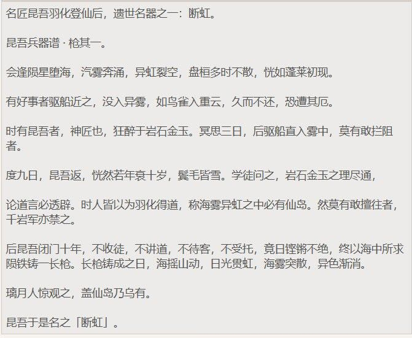
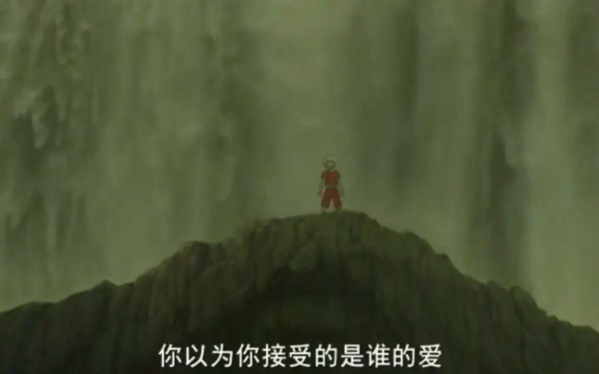
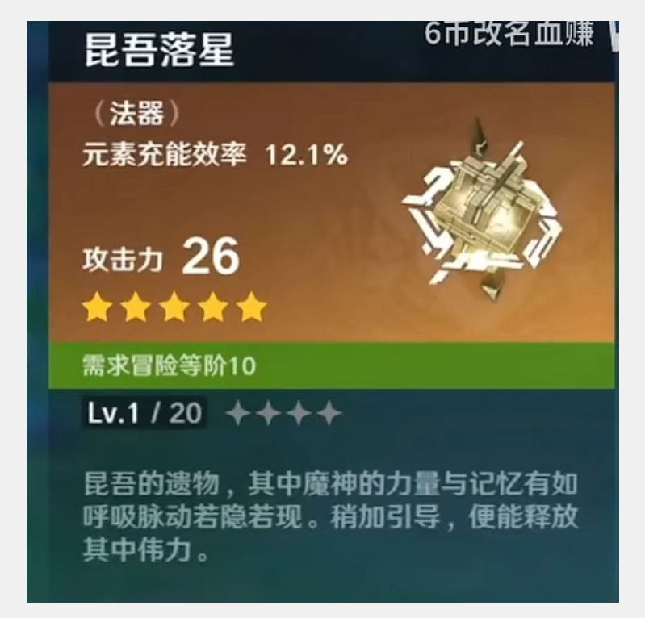

### [不吐不快] 不客气的说一句，从文案写的后期散兵对丹羽的感情来看，原的文案的感情观也是极其有问题的

Made by ngapost2md (c) ludoux [GitHub Repo](https://github.com/ludoux/ngapost2md)

----

##### 0.[0] \<pid:0\> 2023-07-29 19:00:49 by 乙应王戊韦盛
看到有人还拿“反正猛干不是原神文案关我p事”来幻想的，我只能说原的文案的感情观也是很有问题，问题在后期散兵对丹羽的表现上特别突出

而且丹羽还是个有老婆有孩子的人，你把散兵对他的友情写得这么暧昧没问题？还磕尼玛的枫散，差点砍了人家万叶的曾祖父，又把人家爷爷吓得不敢锻刀了，而且万叶还是朋友的后代

甚至散兵去稻妻城求助都变成为了丹羽了，只是不想看到丹羽辛苦和难受才冒着狂风暴雨去的稻妻城

还有一点是，为了描写散兵对丹羽友情之深，雷电五传的伤亡情况被描写得越来越严重

3.0以前就有散兵对五传的报复描写，不过一直尽量避免让玩家觉得刀匠中出现了众多死亡情况，容彩祭是“刀匠叛逃”，绫华语音里的“刀匠背叛，监督不力被责罚”，华馆套说“世人眼里这些衰败不过是时间长了的结果”

但是3.3间章里装都不装了，直接写散兵因为恨丹羽背叛了他，如何突然杀害了百目家很多刀匠，血染一片

为什么要这么写？就是为了表现出散兵对丹羽的用情至深，3.3文案写到这里的时候，一定有一种：没有了你，我要这世界有何用的爽感

当然玩家只觉得毛骨悚然，但是对于米家文案来说，他们至少很多人都特别喜欢类似的感情戏，哪怕是很多人称赞的崩坏系列……懂得都懂

谁能保证原神以后不会继续摊上这种文案呢？

----

##### 1.[1] \<pid:705698357\> 2023-07-29 19:16:17 by 乙应王戊韦盛
>[jump](#pid0) 乙应王戊韦盛(2023-07-29 19:00) 说: 
>
>看到有人还拿“反正猛干不是原神文案关我p事”来幻想的，我只能说原的文案的感情观也是很有问题，问题在后期散兵对丹羽的表现上特别突出
>
>而且丹羽还是个有老婆有孩子的人，你把散兵对他的友情写得这么暧昧没问题？还磕尼玛的枫散，差点砍了人家万叶的曾祖父，又把人家爷爷吓得不敢锻刀了，而且万叶还是朋友的后代
>
>甚至散兵去稻妻城求助都变成为了丹羽了，只是不想看到丹羽辛苦和难受才冒着狂风暴雨去的稻妻城
>
>还有一点是，为了描写散兵对丹羽友情之深，雷电五传的伤亡情况被描写得越来越严重
>
>3.0以前就有散兵对五传的报复

我只能说还好琉璃百合那文本没实装

----

##### 2.[2] \<pid:705698519\> 2023-07-29 19:17:11 by EIVAAAA
>[jump](#pid0) 乙应王戊韦盛(2023-07-29 19:00) 说: 
>
>看到有人还拿“反正猛干不是原神文案关我p事”来幻想的，我只能说原的文案的感情观也是很有问题，问题在后期散兵对丹羽的表现上特别突出
>
>而且丹羽还是个有老婆有孩子的人，你把散兵对他的友情写得这么暧昧没问题？还磕尼玛的枫散，差点砍了人家万叶的曾祖父，又把人家爷爷吓得不敢锻刀了，而且万叶还是朋友的后代
>
>甚至散兵去稻妻城求助都变成为了丹羽了，只是不想看到丹羽辛苦和难受才冒着狂风暴雨去的稻妻城
>
>还有一点是，为了描写散兵对丹羽友情之深，雷电五传的伤亡情况被描写得越来越严重
>
>3.0以前就有散兵对五传的报复

我现在回想起这剧情发觉和隔壁云上5贵乱一个味，对面演狗血仙侠古偶，这边演民国苦情戏？

----

##### 4.[0] \<pid:705699281\> 2023-07-29 19:21:13 by 云影之离
这不就是万事皆爱情的国产烂剧

----

##### 5.[0] \<pid:705700098\> 2023-07-29 19:26:06 by Schia19
你们总是说幸好那个文本没实装，所以到底哪里才能看到那个文本啊？
到底讲了什么，大家都一副心有余悸的样子。

----

##### 6.[0] \<pid:705700654\> 2023-07-29 19:29:28 by wjxjh
>[jump](#pid705700098) Schia19(2023-07-29 19:26) 说: 
>
>你们总是说幸好那个文本没实装，所以到底哪里才能看到那个文本啊？
>到底讲了什么，大家都一副心有余悸的样子。

《璃月风土志·琉璃百合篇》
琉璃百合是现在璃月的一种珍稀植物。
似乎只有在璃月的园林以及少数偏远的野外，我们才能发现这种高贵、精致的植物的踪迹。它们性喜潮湿环境，因而常见于水源附近。
琉璃百合喜欢水、光和歌声。
如果伴随着优美的歌声，它们会生长得格外茂盛；而靠近哀悼与纷争，则会变得虚弱、干枯甚至发黄。
早在魔神战争之前，那个仙凡共居于辽阔的璃月大陆的时代，琉璃百合曾经遍及归离原、荻花洲的沃土之中。彼时，这种纤细而美丽的花正是尘王归终的钟爱之物。
璃月民间一直流传着一个古老的传说：
岩王帝君治下的时代，他所制定的律法冰冷无情；心灵手巧的归终却为归离原的第一批百姓带来精巧的器械、美丽的画作和甜美的音乐。
为了给百姓带来幸福的生活，当权利与义务的规则被履行时，岩王帝君会施以森然的注视；而在同时，归终则凭借她的智慧为脆弱的凡人带来憧憬与幸福。
双王共治的时代，琉璃百合在这片广阔的大地上生根了。
璃月的老人喜欢讲一个故事。说是在那个单纯的年代，某一天，向来聪颖的归终突然生起一丝顽皮的念头，用手捂住帝君的双眼。她一边笑着，一边从长袖中洒出熠熠生辉的蓝色种子，散落在归离原上。
伴随着神王们轻柔的笑声和诗歌中，晶莹剔透、如琉璃般的蓝色花朵，就开始绽放在乡间了。
璃月人的先祖曾在明亮而柔软的花海中一起工作、休息、生活、恋爱、唱歌与玩耍，而他们崇拜的神灵们则悠闲地漫步在琉璃百合花丛中。岩王帝君会聆听尘神带着稚子般快乐的话语，久而久之，连他也开始逐渐理解凡人世界里的喜怒哀乐。
他意识到，迁就与宽容中同样隐藏着力量——虽轻于尘埃，却无穷无尽。
关于这种美丽植物的传说，所谓它诞生于千年前神灵间的嬉戏，也许仅仅是一个浪漫的故事。
然而，令人无从反驳的是，琉璃百合如今已濒临灭绝——原因无疑是两千多年前的魔神战争。在那场战争中，这些纤细无辜的花儿，也因为发生在人们身上的无数悲剧而变得苍白。
巨浪滔天，淹没一切，而幸存下来的人被困在归离原那片肥沃的土地上，他们永远留在了那里。
灾难性的混乱和残酷的屠杀中，纵然是轻盈而温柔的尘王，也无法逃脱不幸；据说她陨落在第一批移民定居的土地上，安息在最后的琉璃百合花丛中。
故事的结局是这样的。
就在即将化为尘土之际，尘王给她心爱的朋友留下了最后一个谜语：人们常说，尘埃的智慧可以让岩石之心变得柔软——纵使花费千年时光。
风带走了尘神，归离原上最后的琉璃百合也随之一一凋谢，化作尘埃。
数百年的时光过去，当和平回归，岩王帝君把老朋友最喜欢的花又重新种在璃月的土地上。
我亲自拜访璃月时曾稍作留意，虽然成活的数量确实不多，但生长得很健康。
也许再过一百年，这片和平的土地上会拥有另一片琉璃百合的花海。

----

##### 7.[0] \<pid:705700874\> 2023-07-29 19:30:48 by 乙应王戊韦盛
>[jump](#pid705700098) Schia19(2023-07-29 19:26) 说: 
>
>你们总是说幸好那个文本没实装，所以到底哪里才能看到那个文本啊？
>到底讲了什么，大家都一副心有余悸的样子。

你百度一下琉璃百合文案，那个文案磕cp还是次要的，最主要的是把钟离写得有点low，里面的归终也也没怎么写好

----

##### 8.[0] \<pid:705701146\> 2023-07-29 19:32:22 by Cloudrapid133
>[jump](#pid0) 乙应王戊韦盛(2023-07-29 19:00) 说: 
>
>看到有人还拿“反正猛干不是原神文案关我p事”来幻想的，我只能说原的文案的感情观也是很有问题，问题在后期散兵对丹羽的表现上特别突出
>
>而且丹羽还是个有老婆有孩子的人，你把散兵对他的友情写得这么暧昧没问题？还磕尼玛的枫散，差点砍了人家万叶的曾祖父，又把人家爷爷吓得不敢锻刀了，而且万叶还是朋友的后代
>
>甚至散兵去稻妻城求助都变成为了丹羽了，只是不想看到丹羽辛苦和难受才冒着狂风暴雨去的稻妻城
>
>还有一点是，为了描写散兵对丹羽友情之深，雷电五传的伤亡情况被描写得越来越严重
>
>3.0以前就有散兵对五传的报复

你再想想其他的立绘故事，数百年后回去扫墓，什么深情寡妇文案。。。。瞎说的，我要吐了，先让我去吐一会

----

##### 9.[0] \<pid:705701336\> 2023-07-29 19:33:28 by 就随便起了个名字
>[jump](#pid705700654) wjxjh(2023-07-29 19:29) 说: 
>
>《璃月风土志·琉璃百合篇》
>琉璃百合是现在璃月的一种珍稀植物。
>似乎只有在璃月的园林以及少数偏远的野外，我们才能发现这种高贵、精致的植物的踪迹。它们性喜潮湿环境，因而常见于水源附近。
>琉璃百合喜欢水、光和歌声。
>如果伴随着优美的歌声，它们会生长得格外茂盛；而靠近哀悼与纷争，则会变得虚弱、干枯甚至发黄。
>早在魔神战争之前，那个仙凡共居于辽阔的璃月大陆的时代，琉璃百合曾经遍及归离原、荻花洲的沃土之中。彼时，这种纤细而美丽的花正是尘王归终的钟爱之物。
>璃月民间一直流传着一个古老的传说：
>岩王帝君治下的

……难评……

我好奇啊，我真的很好奇，为什么米哈游总是喜欢在一些边边角角塞他那并不让人喜欢的爱情或者cp呢？真以为他cp凑的很好吗？
~~归钟cp算是我最早的雷点cp了，当时的归终厨可太可怕了~~

----

##### 10.[0] \<pid:705702041\> 2023-07-29 19:37:23 by 花瓣飘零
不知道有没有人看过长月尽low，然后那部剧主角差不多就是这种没三观的，甚至大家气愤到把倒霉催想好好活下的普通人女配抬到了lofter热度榜一。。。还是个在老福特女角色热度低的地方，但是在这部剧low到在抖音还挺有市场的，本来我以为散也是这套古早下沉市场写法，而且散三次背叛啥的卖惨手法恨不得全世界都知道，也特别像那部剧的名场面男女主吐血互喷那里，非常外放的写法但是输在内核写的很难让人动情，最后只招惹来了厕妹

----

##### 11.[1] \<pid:705702322\> 2023-07-29 19:38:53 by Schia19
救命啊这写的是什么啊受不了了！文笔加强版的玛丽苏小说？？！

----

##### 12.[0] \<pid:705702515\> 2023-07-29 19:39:56 by 宣无邪
>[jump](#pid705700654) wjxjh(2023-07-29 19:29)说:
>[quote][pid=705700098,37185168,1]Reply[/pid] <b>Post by [uid=65073277]Schia19[/uid] (2023-07-29 19:26):</b>  你们总是说幸好那个文本没实装，所以到底哪里才能看到那个文本啊？ 到底讲了什么，大家都一副心有余悸的样子。[/quote]《璃月风土志·琉璃百合篇》 琉璃百合是现在璃月的一种珍稀植物。 似乎只有在璃月的园林以及少数偏远的野外，我们才能发现这种高贵、精致的植物的踪迹。它们性喜潮湿环境，因而常见于水源附近。 琉璃百合喜欢水、光和歌声。 如果伴随着优美的歌声，它们会生长得格外茂盛；而靠近哀悼与纷争，则会变得虚弱、干枯甚至发黄。 早在魔神战争之前，那个仙凡共居于辽阔的璃月大陆的时代，琉璃百合曾经遍及归离原、荻花洲的沃土之中。彼时，这种纤细而美丽的花正是尘王归终的钟爱之物。 璃月民间一直流传着一个古老的传说： 岩王帝君治下的时代，他所制定的律法冰冷无情；心灵手巧的归终却为归离原的第一批百姓带来精巧的器械、美丽的画作和甜美的音乐。 为了给百姓带来幸福的生活，当权利与义务的规则被履行时，岩王帝君会施以森然的注视；而在同时，归终则凭借她的智慧为脆弱的凡人带来憧憬与幸福。 双王共治的时代，琉璃百合在这片广阔的大地上生根了。 璃月的老人喜欢讲一个故事。说是在那个单纯的年代，某一天，向来聪颖的归终突然生起一丝顽皮的念头，用手捂住帝君的双眼。她一边笑着，一边从长袖中洒出熠熠生辉的蓝色种子，散落在归离原上。 伴随着神王们轻柔的笑声和诗歌中，晶莹剔透、如琉璃般的蓝色花朵，就开始绽放在乡间了。 璃月人的先祖曾在明亮而柔软的花海中一起工作、休息、生活、恋爱、唱歌与玩耍，而他们崇拜的神灵们则悠闲地漫步在琉璃百合花丛中。岩王帝君会聆听尘神带着稚子般快乐的话语，久而久之，连他也开始逐渐理解凡人世界里的喜怒哀乐。 他意识到，迁就与宽容中同样隐藏着力量——虽轻于尘埃，却无穷无尽。 关于这种美丽植物的传说，所谓它诞生于千年前神灵间的嬉戏，也许仅仅是一个浪漫的故事。 然而，令人无从反驳的是，琉璃百合如今已濒临灭绝——原因无疑是两千多年前的魔神战争。在那场战争中，这些纤细无辜的花儿，也因为发生在人们身上的无数悲剧而变得苍白。 巨浪滔天，淹没一切，而幸存下来的人被困在归离原那片肥沃的土地上，他们永远留在了那里。 灾难性的混乱和残酷的屠杀中，纵然是轻盈而温柔的尘王，也无法逃脱不幸；据说她陨落在第一批移民定居的土地上，安息在最后的琉璃百合花丛中。 故事的结局是这样的。 就在即将化为尘土之际，尘王给她心爱的朋友留下了最后一个谜语：人们常说，尘埃的智慧可以让岩石之心变得柔软——纵使花费千年时光。 风带走了尘神，归离原上最后的琉璃百合也随之一一凋谢，化作尘埃。 数百年的时光过去，当和平回归，岩王帝君把老朋友最喜欢的花又重新种在璃月的土地上。 我亲自拜访璃月时曾稍作留意，虽然成活的数量确实不多，但生长得很健康。 也许再过一百年，这片和平的土地上会拥有另一片琉璃百合的花海。 [s:ac:反对]

后面没写完的是转世轮回之后和神王再续前缘虐恋吧，这狗血剧既视感太强了，而且把钟离塑造成了类似高塔孤王的无情暴君，只被温柔聪慧的尘王打动
NMMD这铁定是某个文案发癫自我代入归终的产物，MD看这个我还不如去看仙侠剧呢

----

##### 13.[1] \<pid:705702668\> 2023-07-29 19:40:45 by 你掉的是西瓜还是南瓜
>[jump](#pid705700654) wjxjh(2023-07-29 19:29)说:
>[quote][pid=705700098,37185168,1]Reply[/pid] <b>Post by [uid=65073277]Schia19[/uid] (2023-07-29 19:26):</b>  你们总是说幸好那个文本没实装，所以到底哪里才能看到那个文本啊？ 到底讲了什么，大家都一副心有余悸的样子。[/quote]《璃月风土志·琉璃百合篇》 琉璃百合是现在璃月的一种珍稀植物。 似乎只有在璃月的园林以及少数偏远的野外，我们才能发现这种高贵、精致的植物的踪迹。它们性喜潮湿环境，因而常见于水源附近。 琉璃百合喜欢水、光和歌声。 如果伴随着优美的歌声，它们会生长得格外茂盛；而靠近哀悼与纷争，则会变得虚弱、干枯甚至发黄。 早在魔神战争之前，那个仙凡共居于辽阔的璃月大陆的时代，琉璃百合曾经遍及归离原、荻花洲的沃土之中。彼时，这种纤细而美丽的花正是尘王归终的钟爱之物。 璃月民间一直流传着一个古老的传说： 岩王帝君治下的时代，他所制定的律法冰冷无情；心灵手巧的归终却为归离原的第一批百姓带来精巧的器械、美丽的画作和甜美的音乐。 为了给百姓带来幸福的生活，当权利与义务的规则被履行时，岩王帝君会施以森然的注视；而在同时，归终则凭借她的智慧为脆弱的凡人带来憧憬与幸福。 双王共治的时代，琉璃百合在这片广阔的大地上生根了。 璃月的老人喜欢讲一个故事。说是在那个单纯的年代，某一天，向来聪颖的归终突然生起一丝顽皮的念头，用手捂住帝君的双眼。她一边笑着，一边从长袖中洒出熠熠生辉的蓝色种子，散落在归离原上。 伴随着神王们轻柔的笑声和诗歌中，晶莹剔透、如琉璃般的蓝色花朵，就开始绽放在乡间了。 璃月人的先祖曾在明亮而柔软的花海中一起工作、休息、生活、恋爱、唱歌与玩耍，而他们崇拜的神灵们则悠闲地漫步在琉璃百合花丛中。岩王帝君会聆听尘神带着稚子般快乐的话语，久而久之，连他也开始逐渐理解凡人世界里的喜怒哀乐。 他意识到，迁就与宽容中同样隐藏着力量——虽轻于尘埃，却无穷无尽。 关于这种美丽植物的传说，所谓它诞生于千年前神灵间的嬉戏，也许仅仅是一个浪漫的故事。 然而，令人无从反驳的是，琉璃百合如今已濒临灭绝——原因无疑是两千多年前的魔神战争。在那场战争中，这些纤细无辜的花儿，也因为发生在人们身上的无数悲剧而变得苍白。 巨浪滔天，淹没一切，而幸存下来的人被困在归离原那片肥沃的土地上，他们永远留在了那里。 灾难性的混乱和残酷的屠杀中，纵然是轻盈而温柔的尘王，也无法逃脱不幸；据说她陨落在第一批移民定居的土地上，安息在最后的琉璃百合花丛中。 故事的结局是这样的。 就在即将化为尘土之际，尘王给她心爱的朋友留下了最后一个谜语：人们常说，尘埃的智慧可以让岩石之心变得柔软——纵使花费千年时光。 风带走了尘神，归离原上最后的琉璃百合也随之一一凋谢，化作尘埃。 数百年的时光过去，当和平回归，岩王帝君把老朋友最喜欢的花又重新种在璃月的土地上。 我亲自拜访璃月时曾稍作留意，虽然成活的数量确实不多，但生长得很健康。 也许再过一百年，这片和平的土地上会拥有另一片琉璃百合的花海。 [s:ac:反对]

按照万能的皮套论来分析，归终该不会又是米内部某个员工的二次元皮套吧……

----

##### 14.[1] \<pid:705702725\> 2023-07-29 19:41:05 by kayashen
以前就有人发过贴，说在和丹羽的关系上，散兵好像李莫愁。

----

##### 15.[0] \<pid:705703628\> 2023-07-29 19:44:55 by EIVAAAA
>[jump](#pid705701146) Cloudrapid133(2023-07-29 19:32) 说: 
>
>你再想想其他的立绘故事，数百年后回去扫墓，什么深情寡妇文案。。。。瞎说的，我要吐了，先让我去吐一会

别说了，一旦意识到散博丹他们在演民国苦情戏，现在我看博士都忍不住脑补他长了一张艾丽脸~~恶毒女二~~

----

##### 16.[2] \<pid:705703706\> 2023-07-29 19:45:20 by 给我七天光明
woc我第一次看琉璃百合废弃的完整文案，感谢大家当初把锁和琉璃百合一起冲了回去，冲的太对了，这水平连长月烬明都不如

----

##### 17.[0] \<pid:705704229\> 2023-07-29 19:48:08 by 今锁朱楼
还记得童话里说博士陷害散兵是因为 嫉妒 吗
只是暗恋算什么，说不定人家是三角恋，博士暗恋丹羽嫉妒散兵呢

----

##### 20.[3] \<pid:705706165\> 2023-07-29 19:58:03 by 呙邱邱
>[jump](#pid705698958) Fablet(2023-07-29 19:19):

仙侠？仙偶！用最大的年龄谈最low的恋爱，无事天下苍生，有事毁灭三界，天天正事不做光谈恋爱，三界众生都是他们play的一环

----

##### 21.[0] \<pid:705706372\> 2023-07-29 19:59:10 by 竹沥半夏-莲贞
>[jump](#pid705703628) EIVAAAA(2023-07-29 19:44) 说: 
>
>别说了，一旦意识到散博丹他们在演民国苦情戏，现在我看博士都忍不住脑补他长了一张艾丽脸~~恶毒女二~~  
>
>编辑：淦，你提到深情寡妇，结合官推替身梗，该不会枫散小鬼舞的“祖传童养媳”设定也是mhy私下放出来的吧。  
>~~我也去吐会~~

这个吗？淦，我现在也怀疑这些都是米哈游内部下场舞的了

----

##### 22.[0] \<pid:705706508\> 2023-07-29 19:59:48 by cfsbmbh
>[jump](#pid705700654) wjxjh(2023-07-29 19:29) 说: 
>
>《璃月风土志·琉璃百合篇》
>琉璃百合是现在璃月的一种珍稀植物。
>似乎只有在璃月的园林以及少数偏远的野外，我们才能发现这种高贵、精致的植物的踪迹。它们性喜潮湿环境，因而常见于水源附近。
>琉璃百合喜欢水、光和歌声。
>如果伴随着优美的歌声，它们会生长得格外茂盛；而靠近哀悼与纷争，则会变得虚弱、干枯甚至发黄。
>早在魔神战争之前，那个仙凡共居于辽阔的璃月大陆的时代，琉璃百合曾经遍及归离原、荻花洲的沃土之中。彼时，这种纤细而美丽的花正是尘王归终的钟爱之物。
>璃月民间一直流传着一个古老的传说：
>岩王帝君治下的

WTF……这不TM须弥赤树翻版？我TM被恶心到了……

----

##### 23.[0] \<pid:705706546\> 2023-07-29 20:00:03 by 在豆田发现少女
不知道文案都根据什么来塑造角色的。
不能参照点传奇人物吗

----

##### 24.[0] \<pid:705706682\> 2023-07-29 20:00:45 by Cloudrapid133
>[jump](#pid705703628) EIVAAAA(2023-07-29 19:44) 说: 
>
>别说了，一旦意识到散博丹他们在演民国苦情戏，现在我看博士都忍不住脑补他长了一张艾丽脸~~恶毒女二~~  
>
>编辑：淦，你提到深情寡妇，结合官推替身梗，该不会枫散小鬼舞的“祖传童养媳”设定也是mhy私下放出来的吧。  
>~~我也去吐会~~

关乎其他的剧情总是同人要素拉满(早期文案除外)，你用下三滥恶俗玛丽苏脑回路去揣测这家文案那一定不是你错觉

----

##### 25.[5] \<pid:705706852\> 2023-07-29 20:01:43 by 云影之离
最早是1.2流出来的准备1.3实装，是英文，我没记错的话直接都用了cruel，cold反正就是比中文还过分的词形容钟离幽夜前身就是因为这个逆天文案

----

##### 26.[0] \<pid:705706933\> 2023-07-29 20:02:12 by 你掉的是西瓜还是南瓜
>[jump](#pid705706165) 呙邱邱(2023-07-29 19:58) 说: 
>
>仙侠？仙偶！用最大的年龄谈最low的恋爱，无事天下苍生，有事毁灭三界，天天正事不做光谈恋爱，三界众生都是他们play的一环

总结得太好了……隔壁崩铁现在真有这种倾向……希望米能用1.3剧情狠狠打我的脸
不然崩铁也是要被挂在耻辱柱上狠狠嘲笑的

----

##### 27.[0] \<pid:705707283\> 2023-07-29 20:04:18 by 香槟买好了就等
米家文案一看里查这么怕琉璃百合，回头中译中整上

----

##### 28.[0] \<pid:705707308\> 2023-07-29 20:04:25 by miliao_d
我以前在3.3sb出来之前，还给万叶拉过枫散的郎(我有罪我悔过)，然后sb剧情出来后，我一堆喜欢的角色全被岁了(万叶绫华影八重绫人)全成了sb的垫子，我可qnmd，枫散纯纯厕品，只有傻逼才能磕的下去
还是散草好，散草官配锁死

----

##### 29.[0] \<pid:705707366\> 2023-07-29 20:04:42 by rrrrawae
>[jump](#pid705706933) 你掉的是西瓜还是南瓜(2023-07-29 20:02) 说: 
>
>总结得太好了……隔壁崩铁现在真有这种倾向……希望米能用1.3剧情狠狠打我的脸
>不然崩铁也是要被挂在耻辱柱上狠狠嘲笑的

打不了脸的，怎么想都不可能

----

##### 30.[0] \<pid:705707679\> 2023-07-29 20:06:36 by 别再重复了！！！
>[jump](#pid705706933) 你掉的是西瓜还是南瓜(2023-07-29 20:02)说:
>[quote][pid=705706165,37185168,2]Reply[/pid] <b>Post by [uid=62041319]呙邱邱[/uid] (2023-07-29 19:58):</b>  仙侠？仙偶！用最大的年龄谈最low的恋爱，无事天下苍生，有事毁灭三界，天天正事不做光谈恋爱，三界众生都是他们play的一环[/quote]总结得太好了……隔壁崩铁现在真有这种倾向……希望米能用1.3剧情狠狠打我的脸[s:a2:怒] 不然崩铁也是要被挂在耻辱柱上狠狠嘲笑的[s:a2:goodjob]

还对mhy抱有期待是你最大的错误，孟干哥都实锤爱恨生死了，怕不是最后给你端出来个饮月镜流杀刃是为了挚爱白狐狸医闹

----

##### 31.[0] \<pid:705708154\> 2023-07-29 20:09:20 by 你掉的是西瓜还是南瓜
>[jump](#pid705707366) rrrrawae(2023-07-29 20:04) 说: 
>
>
>打不了脸的，怎么想都不可能

那我就能狠狠嘲笑了

----

##### 32.[0] \<pid:705708196\> 2023-07-29 20:09:37 by 看我把那飞机打下来
>[jump](#pid705707679) 别再重复了！！！(2023-07-29 20:06)说:
><b>Reply to [pid=705706933,37185168,2]Reply[/pid] Post by [uid=65054638]你掉的是西瓜还是南瓜[/uid] (2023-07-29 20:02)</b>还对mhy抱有期待是你最大的错误，孟干哥都实锤爱恨生死了，怕不是最后给你端出来个饮月镜流杀刃是为了挚爱白狐狸医闹[s:ac:哭笑]

最搞的是有些女角色实际上还是男员工的皮套

----

##### 33.[0] \<pid:705708454\> 2023-07-29 20:11:22 by EIVAAAA
>[jump](#pid705706372) 竹沥半夏-莲贞(2023-07-29 19:59) 说: 
>
>这个吗？淦，我现在也怀疑这些都是米哈游内部下场舞的了

我当时听到的时候震惊极了，这个脑回路我怎么想都想不通，怎么就转到“祖传童养媳”了？祖传童养媳又是哪个圈子的说法？现在我想通了，这个祖传童养媳还真像mhy文案能写出来的设定。

----

##### 34.[0] \<pid:705708649\> 2023-07-29 20:12:30 by 设备锁谁还没关
>[jump](#pid705706372) 竹沥半夏-莲贞(2023-07-29 19:59) 说: 
>
>这个吗？淦，我现在也怀疑这些都是米哈游内部下场舞的了

哈哈哈哈哈哈哈哈哈哈哈哈哈哈哈哈家传妻子哈哈哈哈哈哈哈哈哈哈哈哈哈哈哈哈哈哈哈哈哈哈哈哈哈哈哈哈哈哈哈哈哈哈哈哈哈哈哈哈
逆天

----

##### 35.[0] \<pid:705708673\> 2023-07-29 20:12:41 by 月宫的牧羊人C
怎么还有人幻想米丧文案能用剧情打脸，米丧文案从来平开低走，水平最好的就是故事还没展开谜语人的时候，它只会打对剧情还抱有希望之人的脸罢了

----

##### 36.[0] \<pid:705709121\> 2023-07-29 20:15:18 by 雷军单推人
>[jump](#pid705701146) Cloudrapid133(2023-07-29 19:32):

就关键那个扫墓也吃书了，按照3.3，丹羽哪里来的墓？
不是直接给博士弄死然后人间蒸发了嘛，哪里来的墓给他祭奠
还是说他把杀死的雷电五传都葬在了一起当丹羽的衣冠冢？更地狱了好嘛

----

##### 37.[0] \<pid:705709137\> 2023-07-29 20:15:25 by 我冲我自己
我草，这个文案把钟离整的low死了，什么同人品味

----

##### 38.[0] \<pid:705709370\> 2023-07-29 20:16:43 by ggt12
其实稻妻有一段应该是猛干老师写的。

----

##### 39.[0] \<pid:705709376\> 2023-07-29 20:16:44 by 五蕴盛苦
>[jump](#pid705706372) 竹沥半夏-莲贞(2023-07-29 19:59)说:
>[quote][pid=705703628,37185168,1]Reply[/pid] <b>Post by [uid=65095447]EIVAAAA[/uid] (2023-07-29 19:44):</b>  别说了，一旦意识到散博丹他们在演民国苦情戏，现在我看博士都忍不住脑补他长了一张艾丽脸<del class='gray'> 恶毒女二 </del>[s:ac:哭笑]    编辑：淦，你提到深情寡妇，结合官推替身梗，该不会枫散小鬼舞的“祖传童养媳”设定也是mhy私下放出来的吧。[s:ac:哭笑]   <del class='gray'> 我也去吐会 </del>[/quote]这个吗？淦，我现在也怀疑这些都是米哈游内部下场舞的了[s:ac:喷][img]https://img.nga.178.com/attachments/mon_202307/29/l2Q2s-7c6wZcT1kSg1-11l.jpg[/img]

谢谢，吐得很干净

----

##### 40.[0] \<pid:705709460\> 2023-07-29 20:17:09 by 看我把那飞机打下来
>[jump](#pid705709121) 雷军单推人(2023-07-29 20:15)说:
><b>Reply to [pid=705701146,37185168,1]Reply[/pid] Post by [uid=64400568]Cloudrapid133[/uid] (2023-07-29 19:32)</b>  就关键那个扫墓也吃书了，按照3.3，丹羽哪里来的墓？ 不是直接给博士弄死然后人间蒸发了嘛，哪里来的墓给他祭奠[s:ac:哭笑] 还是说他把杀死的雷电五传都葬在了一起当丹羽的衣冠冢？更地狱了好嘛[s:ac:哭笑]

有没有可能是桂木或者长正的

哦，我忘了，现在的散兵心里还有长正桂木这两个人吗

----

##### 41.[0] \<pid:705709476\> 2023-07-29 20:17:15 by usfdocb
>[jump](#pid705706372) 竹沥半夏-莲贞(2023-07-29 19:59) 说: 
>
>这个吗？淦，我现在也怀疑这些都是米哈游内部下场舞的了

我的眼睛

----

##### 42.[0] \<pid:705709518\> 2023-07-29 20:17:30 by 还想长高耶
正常人谁会写出SB这种剧情

----

##### 43.[0] \<pid:705709770\> 2023-07-29 20:19:01 by 你掉的是西瓜还是南瓜
>[jump](#pid705707679) 别再重复了！！！(2023-07-29 20:06) 说: 
>
>还对mhy抱有期待是你最大的错误，孟干哥都实锤爱恨生死了，怕不是最后给你端出来个饮月镜流杀刃是为了挚爱白狐狸医闹

其实可以看一看崩铁内测第六件遗器的文案莉提及的玉壶和今天B站商单的刃同人曲，还真有个葫芦，
不过同人曲过了几个小时之后就把葫芦删了。
只能说白露是白珩转世真有可能是废弃设定，我笑死

----

##### 44.[0] \<pid:705710188\> 2023-07-29 20:21:33 by 别再重复了！！！
>[jump](#pid705709770) 你掉的是西瓜还是南瓜(2023-07-29 20:19)说:
>[quote][pid=705707679,37185168,2]Reply[/pid] <b>Post by [uid=43135761]别再重复了！！！[/uid] (2023-07-29 20:06):</b>  还对mhy抱有期待是你最大的错误，孟干哥都实锤爱恨生死了，怕不是最后给你端出来个饮月镜流杀刃是为了挚爱白狐狸医闹[s:ac:哭笑][/quote]其实可以看一看崩铁内测第六件遗器的文案莉提及的玉壶和今天B站商单的刃同人曲，还真有个葫芦， 不过做同人曲的UP过了几个小时之后就把葫芦删了。 只能说白露是白珩转世真有可能是废弃设定，我笑死[s:ac:哭笑]

你怎么就知道是废弃了，而不是还没说，看着景元对白露的语音和1.2那个破防的再让我见她一面的语音，可不好说

----

##### 45.[0] \<pid:705710392\> 2023-07-29 20:22:39 by 看我把那飞机打下来
>[jump](#pid705709770) 你掉的是西瓜还是南瓜(2023-07-29 20:19)说:
>[quote][pid=705707679,37185168,2]Reply[/pid] <b>Post by [uid=43135761]别再重复了！！！[/uid] (2023-07-29 20:06):</b>  还对mhy抱有期待是你最大的错误，孟干哥都实锤爱恨生死了，怕不是最后给你端出来个饮月镜流杀刃是为了挚爱白狐狸医闹[s:ac:哭笑][/quote]其实可以看一看崩铁内测第六件遗器的文案莉提及的玉壶和今天B站商单的刃同人曲，还真有个葫芦， 不过做同人曲的UP过了几个小时之后就把葫芦删了。 只能说白露是白珩转世真有可能是废弃设定，我笑死[s:ac:哭笑]

不是说白珩还是内部男员工的皮套嘛

这么一想更雷了

----

##### 46.[0] \<pid:705710903\> 2023-07-29 20:25:39 by 你掉的是西瓜还是南瓜
>[jump](#pid705708673) 月宫的牧羊人C(2023-07-29 20:12) 说: 
>
>怎么还有人幻想米丧文案能用剧情打脸，米丧文案从来平开低走，水平最好的就是故事还没展开谜语人的时候，它只会打对剧情还抱有希望之人的脸罢了

我是对米没有幻想，但是我有几个朋友对米还有幻想，我只希望崩铁1.3爆个大雷，好让我那些朋友清醒一下

----

##### 47.[4] \<pid:705711967\> 2023-07-29 20:31:43 by うみです
>[jump](#pid705700654) wjxjh(2023-07-29 19:29) 说: 
>
>《璃月风土志·琉璃百合篇》
>琉璃百合是现在璃月的一种珍稀植物。
>似乎只有在璃月的园林以及少数偏远的野外，我们才能发现这种高贵、精致的植物的踪迹。它们性喜潮湿环境，因而常见于水源附近。
>琉璃百合喜欢水、光和歌声。
>如果伴随着优美的歌声，它们会生长得格外茂盛；而靠近哀悼与纷争，则会变得虚弱、干枯甚至发黄。
>早在魔神战争之前，那个仙凡共居于辽阔的璃月大陆的时代，琉璃百合曾经遍及归离原、荻花洲的沃土之中。彼时，这种纤细而美丽的花正是尘王归终的钟爱之物。
>璃月民间一直流传着一个古老的传说：
>岩王帝君治下的

我真是谢谢文案啊，如果这玩意实装了我就不会喜欢钟离，如果我不喜欢钟离早就因为这垃圾剧情退坑了，如果不是没退坑我才不会天天跟个怨种一样自我折磨

----

##### 48.[0] \<pid:705712267\> 2023-07-29 20:33:38 by 咸鱼6666668
>[jump](#pid705711967) うみです(2023-07-29 20:31) 说: 
>
>我真是谢谢文案啊，如果这玩意实装了我就不会喜欢钟离，如果我不喜欢钟离早就因为这垃圾剧情退坑了，如果不是没退坑我才不会天天跟个怨种一样自我折磨

虽然被冲没了，但是转世到须弥和隔壁仙舟了，他们真是很爱呀

----

##### 49.[0] \<pid:705712421\> 2023-07-29 20:34:39 by 你掉的是西瓜还是南瓜
>[jump](#pid705710392) 看我把那飞机打下来(2023-07-29 20:22) 说: 
>
>不是说白珩还是内部男员工的皮套嘛
>
>这么一想更雷了

真的很雷，我认识的几个白露厨和刃厨都在微信小群激情辱骂米

----

##### 50.[1] \<pid:705712898\> 2023-07-29 20:37:31 by 别再重复了！！！
>[jump](#pid705712421) 你掉的是西瓜还是南瓜(2023-07-29 20:34)说:
>>[jump](#pid705710392) 看我把那飞机打下来(2023-07-29 20:22) 说: 
>>
>>不是说白珩还是内部男员工的皮套嘛
>>
>>这么一想更雷了
>
>真的很雷，我认识的几个白露厨和刃厨都在微信小群激情辱骂米

回去告诉你的朋友，卡芙卡的拉小提琴的动作是大伟哥动捕，估计所有人都要破防

----

##### 51.[0] \<pid:705712909\> 2023-07-29 20:37:35 by setsuna2023
incel文案的感情观没有严重问题才是稀罕事，换言之不是感情观有严重问题，上海IT独角兽的高薪员工(甚至高管)至于incel吗

----

##### 52.[1] \<pid:705713243\> 2023-07-29 20:39:32 by 咸鱼6666668
>[jump](#pid705709137) 我冲我自己(2023-07-29 20:15) 说: 
>
>我草，这个文案把钟离整的low死了，什么同人品味

那什么，长月烬low
&quot;苍生不是你们play中的一环，放过苍生”
“谈恋爱的神请滚出拆拿”
 
文案能不能像fgo署名，欣赏一下文案们各自的作品水平，康康是哪位神仙的作品代替了原来写好的文案

----

##### 53.[0] \<pid:705713794\> 2023-07-29 20:41:43 by 你掉的是西瓜还是南瓜
>[jump](#pid705712898) 别再重复了！！！(2023-07-29 20:37) 说: 
>
>回去告诉你的朋友，卡芙卡的拉小提琴的动作是大伟哥动捕，估计所有人都要破防

其实只是动态捕捉也没啥的，日游也有男演员给女角色做动捕的例子，
我还不如说老杨原型是刘伟，更能让我朋友心碎

----

##### 54.[0] \<pid:705714071\> 2023-07-29 20:42:41 by 当个乐子人
天哪，我点进来之前没想到会被呐呐锁文案暴击一次有没有好心人折叠下

----

##### 55.[0] \<pid:705714358\> 2023-07-29 20:43:48 by NeroliPortofino
>[jump](#pid705712898) 别再重复了！！！(2023-07-29 20:37) 说: 
>
>回去告诉你的朋友，卡芙卡的拉小提琴的动作是大伟哥动捕，估计所有人都要破防

不至于，大伟直播时候那个提琴架势和左右手完全是错的，卡芙卡至少左手立腕和运弓还是那个意思，左手手型倒是可以临时学，运弓还是要练一下的  

我当时还在说hoyomix都不来个人救一下你们老板的吗笑死

----

##### 56.[0] \<pid:705714667\> 2023-07-29 20:45:04 by bzbjzj
难蚌，这都是什么魔鬼玩意

----

##### 57.[0] \<pid:705714780\> 2023-07-29 20:45:34 by 云影之离
>[jump](#pid705714071) 当个乐子人(2023-07-29 20:42) 说: 
>
>天哪，我点进来之前没想到会被呐呐锁文案暴击一次有没有好心人折叠下

不是呐呐锁，是比呐呐锁更厉害的传说中的琉璃百合

----

##### 58.[0] \<pid:705719254\> 2023-07-29 21:06:48 by 看我把那飞机打下来
>[jump](#pid705712421) 你掉的是西瓜还是南瓜(2023-07-29 20:34)说:
>[quote][pid=705710392,37185168,3]Reply[/pid] <b>Post by [uid=62526866]看我把那飞机打下来[/uid] (2023-07-29 20:22):</b>  不是说白珩还是内部男员工的皮套嘛  这么一想更雷了[s:ac:哭笑][/quote]真的很雷，我认识的几个白露厨和刃厨都在微信小群激情辱骂米[s:ac:哭笑]

哪天他说某个女角色原型孙笑川我都不奇怪

----

##### 59.[0] \<pid:705720074\> 2023-07-29 21:11:24 by 叶二
谢谢好心人，终于见识了传说中的琉璃百合废案
虽然看过之后我宁可自己没看到过

----

##### 60.[0] \<pid:705720716\> 2023-07-29 21:14:57 by 平淡无奇的今天
有没有人放一个唢呐文案，没去搜有点好奇

----

##### 61.[0] \<pid:705720748\> 2023-07-29 21:15:05 by 清明上核图
low璃百合文案该不会真的是哪个高层~~limengan~~写的吧，不然冲掉个文案而已，至于恨这多年而且这种是个玩家都能创飞的文笔和设定，在差评如潮下没被开除还坚持给须弥稻妻世界文案增砖添瓦，什么样的毅力啊

----

##### 62.[1] \<pid:705721763\> 2023-07-29 21:20:44 by 只差一个约定
我c，琉璃百合那个我第一次看，真炸裂啊我的眼睛啊看了什么东西味也太怪了

----

##### 63.[1] \<pid:705721824\> 2023-07-29 21:21:04 by lkjzxm
>[jump](#pid705720716) 平淡无奇的今天(2023-07-29 21:14) 说: 
>
>有没有人放一个唢呐文案，没去搜有点好奇

蕴含着某种悠远记忆的石锁，随着无穷的变换透露出其中的力量。

&#39;这是盟约的信物，也是我对你的挑战&#39;
&#39;我的一切智慧，都藏在这把石锁之中&#39;
他想起初次见面，大衣袖的少女呈上信物时故作庄严而雀跃的样子。
真是愚蠢，明明就没有正式的契约，明明只不过自顾自地一同行动……
但就是会想起，过去琉璃百合盛放的原野上，两人初次相见的情景，
以及最后，在琉璃百合丛中，她说的话。

&#39;那些小小的人儿们，如同微尘般渺小又脆弱&#39;
&#39;因为渺小，所以不知何时会殒命于天灾人祸。所以总是害怕&#39;
&#39;因为害怕，所以总是努力，想变得更聪明。我啊，是明白的&#39;
&#39;所以我想，既然与你力量差距太大，那就运用技术与智慧吧&#39;
&#39;同时具有你的力量与我的头脑的话……这座城市会很了不起吧&#39;
她最后有些落寞地笑了笑，慢慢化作了无比细微的尘埃。
&#39;看来还是无法和你一同走下去了。那把锁的事情，忘了它吧&#39;

&#39;这是盟约的信物，也是我对你的挑战&#39;
&#39;我的一切智慧，都藏在这把石锁之中&#39;
&#39;如果能解开它的话——&#39;
许多年，他都没能解开这把锁，也不知道那句话的下文。
随着岁月变迁，如今野生的琉璃百合也几乎不见踪迹了。

忍着恶心帮大家粘过来了，记得给我算工伤

----

##### 64.[4] \<pid:705722409\> 2023-07-29 21:24:26 by 七月七日长生殿-
这个废案不光是直接改了钟离人设，而且有股子浓浓的怪味啊

璃月民间一直流传着一个古老的传说：
岩王帝君治下的时代，他所制定的律法冰冷无情；心灵手巧的归终却为归离原的第一批百姓带来精巧的器械、美丽的画作和甜美的音乐。
为了给百姓带来幸福的生活，当权利与义务的规则被履行时，岩王帝君会施以森然的注视；而在同时，归终则凭借她的智慧为脆弱的凡人带来憧憬与幸福。

意思是上战场打仗，制定规则律法的人带来冷酷带不来快乐，音乐美术带来幸福生活呗

----

##### 65.[0] \<pid:705722427\> 2023-07-29 21:24:32 by 平淡无奇的今天
>[jump](#pid705721824) lkjzxm(2023-07-29 21:21) 说: 
>
>蕴含着某种悠远记忆的石锁，随着无穷的变换透露出其中的力量。
>
>&#39;这是盟约的信物，也是我对你的挑战&#39;
>&#39;我的一切智慧，都藏在这把石锁之中&#39;
>他想起初次见面，大衣袖的少女呈上信物时故作庄严而雀跃的样子。
>真是愚蠢，明明就没有正式的契约，明明只不过自顾自地一同行动……
>但就是会想起，过去琉璃百合盛放的原野上，两人初次相见的情景，
>以及最后，在琉璃百合丛中，她说的话。
>
>&#39;那些小小的人儿们，如同微尘般渺小又脆弱&#39;
>&#39;因为渺小，所以不知何时会殒命于天灾人祸。所以总是害怕&#39;
>&#39;因为害怕，所以总是努力，想变得

啊啊啊啊啊我要瞎了

----

##### 66.[1] \<pid:705722917\> 2023-07-29 21:27:16 by 墨筱澜鄢
你别说呐呐锁的文案最后那个说的好几句话和须弥沙漠的某些剧情还有散兵的一些自述味道一模一样

----

##### 67.[1] \<pid:705722925\> 2023-07-29 21:27:17 by 其实是kiki
后面还有孝子给米洗说冲这个文案是乙女姐破防呢 
不知道帖子里面的大家有没有被赛博变性就是

----

##### 68.[0] \<pid:705723031\> 2023-07-29 21:27:46 by Soliddddddd
我个人觉得综合原和铁的剧情来看，米文案想写的东西是古装偶像剧，期待切割二次元的一天早点到来

----

##### 70.[0] \<pid:705724047\> 2023-07-29 21:33:35 by 香槟买好了就等
>[jump](#pid705722409) 七月七日长生殿-(2023-07-29 21:24) 说: 
>
>这个废案不光是直接改了钟离人设，而且有股子浓浓的怪味啊
>
>璃月民间一直流传着一个古老的传说：
>岩王帝君治下的时代，他所制定的律法冰冷无情；心灵手巧的归终却为归离原的第一批百姓带来精巧的器械、美丽的画作和甜美的音乐。
>为了给百姓带来幸福的生活，当权利与义务的规则被履行时，岩王帝君会施以森然的注视；而在同时，归终则凭借她的智慧为脆弱的凡人带来憧憬与幸福。
>
>意思是上战场打仗，制定规则律法的人带来冷酷带不来快乐，音乐美术带来幸福生活呗

钟离是靠那句“我虽无意逐鹿，却知苍生疾苦”圈粉的(包括本被赛博变性乙姐)，还有一句忘记哪里的文案说他治下无贫者，突然整个冰冷无情森然真的很那个

----

##### 71.[6] \<pid:705724352\> 2023-07-29 21:35:16 by Macline330206
>[jump](#pid705722409) 七月七日长生殿-(2023-07-29 21:24) 说: 
>
>这个废案不光是直接改了钟离人设，而且有股子浓浓的怪味啊
>
>璃月民间一直流传着一个古老的传说：
>岩王帝君治下的时代，他所制定的律法冰冷无情；心灵手巧的归终却为归离原的第一批百姓带来精巧的器械、美丽的画作和甜美的音乐。
>为了给百姓带来幸福的生活，当权利与义务的规则被履行时，岩王帝君会施以森然的注视；而在同时，归终则凭借她的智慧为脆弱的凡人带来憧憬与幸福。
>
>意思是上战场打仗，制定规则律法的人带来冷酷带不来快乐，音乐美术带来幸福生活呗

我一直觉得归的智慧人设很迷看到现在也就搞器械这点比较专业，其他方面到底哪里智慧了，如何管理好国家没有体现，制定战略战术更没有表示，吹她是女诸葛是不是有点早了

----

##### 72.[5] \<pid:705724487\> 2023-07-29 21:36:02 by 当个乐子人
我怀疑归终是不是被内部文案套皮了，因为钟离的边角料文案一涉及到归终就感觉怪味儿特别大，感觉是有些人在带入归终？

----

##### 73.[2] \<pid:705724563\> 2023-07-29 21:36:31 by 墨筱澜鄢
>[jump](#pid705722409) 七月七日长生殿-(2023-07-29 21:24)说:
>这个废案不光是直接改了钟离人设，而且有股子浓浓的怪味啊[s:ac:哭笑]  璃月民间一直流传着一个古老的传说： 岩王帝君治下的时代，他所制定的律法冰冷无情；心灵手巧的归终却为归离原的第一批百姓带来精巧的器械、美丽的画作和甜美的音乐。 为了给百姓带来幸福的生活，当权利与义务的规则被履行时，岩王帝君会施以森然的注视；而在同时，归终则凭借她的智慧为脆弱的凡人带来憧憬与幸福。  意思是上战场打仗，制定规则律法的人带来冷酷带不来快乐，音乐美术带来幸福生活呗[s:ac:哭笑]那璃月也别练兵了，钟离也别打架了，大家围在一起唱歌跳舞等着奥赛尔和螭碾碎城市每个人就发自内心的幸福

你别说现在某些浪国艺术家的表现还真是这样，写实了，也是文案的心声呢

----

##### 74.[0] \<pid:705724605\> 2023-07-29 21:36:44 by 雾海漫游者
>[jump](#pid705724047) 香槟买好了就等(2023-07-29 21:33)说:
>[quote][pid=705722409,37185168,4]Reply[/pid] <b>Post by [uid=63204606]七月七日长生殿-[/uid] (2023-07-29 21:24):</b>  这个废案不光是直接改了钟离人设，而且有股子浓浓的怪味啊[s:ac:哭笑]  璃月民间一直流传着一个古老的传说： 岩王帝君治下的时代，他所制定的律法冰冷无情；心灵手巧的归终却为归离原的第一批百姓带来精巧的器械、美丽的画作和甜美的音乐。 为了给百姓带来幸福的生活，当权利与义务的规则被履行时，岩王帝君会施以森然的注视；而在同时，归终则凭借她的智慧为脆弱的凡人带来憧憬与幸福。  意思是上战场打仗，制定规则律法的人带来冷酷带不来快乐，音乐美术带来幸福生活呗[s:ac:哭笑][/quote]钟离是靠那句“我虽无意逐鹿，却知苍生疾苦”圈粉的(包括本被赛博变性乙姐)，还有一句忘记哪里的文案说他治下无贫者，突然整个冰冷无情森然真的很那个[s:ac:冷]

开服也有武器文案说摩拉克斯的温柔的，只能说明内部打架。而且这个是须弥学者写的，也能直接甩锅。不过这种水平的文案啊，我希望他能坚持不懈地霍霍原神

----

##### 75.[0] \<pid:705724779\> 2023-07-29 21:37:44 by 0123cola
琉璃百合文案怎么和赤花树的味有点像

----

##### 76.[0] \<pid:705725016\> 2023-07-29 21:39:11 by 香槟买好了就等
>[jump](#pid705724487) 当个乐子人(2023-07-29 21:36) 说: 
>
>我怀疑归终是不是被内部文案套皮了，因为钟离的边角料文案一涉及到归终就感觉怪味儿特别大，感觉是有些人在带入归终？

不止归终，在流水楼发过一次

<a href="javascript:;" onclick="collapse(this);">+</a>点击展开 ...
在轻策庄的孩童之间，流传着这样的寓言：无妄坡的年轻人们被遥远海怪的鲸歌诱惑，追随着虛幻的许诺与幼稚的梦想纷纷投入碧水河平静的流水中，任飘摇的河波将自己推向遥远的云来海，在那里与大海中无数浪花融为一体，失却了一切山林与村庄的记忆…而他们的梦，也成了海怪的歌。
一代代少年皆如此离去，直到最后，随着无妄坡的老人们一个接一个在嗟叹中离开人世，岩王帝君注视的宏大港城放射着绚烂灼目的光彩，吞噬了又一座沉默的鬼村。

----

##### 77.[0] \<pid:705725239\> 2023-07-29 21:40:27 by 甲邵贾辛巫范
>[jump](#pid705725016) 香槟买好了就等(2023-07-29 21:39)说:
>>[jump](#pid705724487) 当个乐子人(2023-07-29 21:36) 说: 
>>
>>我怀疑归终是不是被内部文案套皮了，因为钟离的边角料文案一涉及到归终就感觉怪味儿特别大，感觉是有些人在带入归终？
>
>不止归终，在流水楼发过一次

<a href="javascript:;" onclick="collapse(this);">+</a>点击展开 ...
在轻策庄的孩童之间，流传着这样的寓言：无妄坡的年轻人们被遥远海怪的鲸歌诱惑，追随着虛幻的许诺与幼稚的梦想纷纷投入碧水河平静的流水中，任飘摇的河波将自己推向遥远的云来海，在那里与大海中无数浪花融为一体，失却了一切山林与村庄的记忆…而他们的梦，也成了海怪的歌。
>一代代少年皆如此离去，直到最后，随着无妄坡的老人们一个接一个在嗟叹中离开人世，岩王帝君注视的宏大港城放射着绚烂灼目的光彩，吞噬了又一座沉默的鬼村。

这不就文青猛干哥吗，味太大了

----

##### 78.[3] \<pid:705725335\> 2023-07-29 21:41:02 by 当个乐子人
>[jump](#pid705724352) Macline330206(2023-07-29 21:35) 说: 
>
>我一直觉得归的智慧人设很迷看到现在也就搞器械这点比较专业，其他方面到底哪里智慧了，如何管理好国家没有体现，制定战略战术更没有表示，吹她是女诸葛是不是有点早了

感觉最能体现智慧的就是那个锁(谜语)，但是后文又提到了带来音乐啥啥的，咱就是说治理国家能不能先主打一个务实越看越像文案套皮带入了，“怎么想都是音乐和爱比较重要吧”！

----

##### 79.[1] \<pid:705725405\> 2023-07-29 21:41:22 by 七月七日长生殿-
>[jump](#pid705724563) 墨筱澜鄢(2023-07-29 21:36) 说: 
>
>你别说现在某些浪国艺术家的表现还真是这样，写实了，也是文案的心声呢

是这样的当时上海下雨有个编剧在家马桶堵了修理工来不了发微博说大意是我崩溃了我被压垮了我对世界绝望了

----

##### 80.[0] \<pid:705725807\> 2023-07-29 21:43:53 by 平淡无奇的今天
说实在的智慧在战争年代不应该是搞制度搞科技吗，这文案到底在强调什么啊，用歌曲和舞蹈去面对战争?

----

##### 81.[0] \<pid:705726157\> 2023-07-29 21:45:48 by 香槟买好了就等
>[jump](#pid705725335) 当个乐子人(2023-07-29 21:41) 说: 
>
>感觉最能体现智慧的就是那个锁(谜语)，但是后文又提到了带来音乐啥啥的，咱就是说治理国家能不能先主打一个务实越看越像文案套皮带入了，“怎么想都是音乐和爱比较重要吧”！

归终机(感觉neta诸葛连弩)最能体现吧，也算是保卫国家了

----

##### 82.[1] \<pid:705726455\> 2023-07-29 21:47:30 by 给我七天光明
>[jump](#pid705725807) 平淡无奇的今天(2023-07-29 21:43) 说: 
>
>说实在的智慧在战争年代不应该是搞制度搞科技吗，这文案到底在强调什么啊，用歌曲和舞蹈去面对战争?

甚至归终相关文案是和钟离传说一割裂的，盐神的故事很明确说了战争年代这样的神只会葬送自己和子民，我只能理解为根本不是一个人写的，而且他们之间没有沟通，或者意见完全割裂。

----

##### 83.[0] \<pid:705726480\> 2023-07-29 21:47:38 by jasmine4869
无意中搜到过磕cp的说其他像李莫愁的，额

----

##### 84.[0] \<pid:705727368\> 2023-07-29 21:52:28 by 玩c罗玩的
>[jump](#pid705722409) 七月七日长生殿-(2023-07-29 21:24) 说: 
>
>这个废案不光是直接改了钟离人设，而且有股子浓浓的怪味啊
>
>璃月民间一直流传着一个古老的传说：
>岩王帝君治下的时代，他所制定的律法冰冷无情；心灵手巧的归终却为归离原的第一批百姓带来精巧的器械、美丽的画作和甜美的音乐。
>为了给百姓带来幸福的生活，当权利与义务的规则被履行时，岩王帝君会施以森然的注视；而在同时，归终则凭借她的智慧为脆弱的凡人带来憧憬与幸福。
>
>意思是上战场打仗，制定规则律法的人带来冷酷带不来快乐，音乐美术带来幸福生活呗那璃月也别练兵了，钟离也别打架了

不知为何 这里的钟离和归终总有一种巡猎和丰饶的感觉……

----

##### 85.[0] \<pid:705729880\> 2023-07-29 22:06:35 by narozx
>[jump](#pid705700654) wjxjh(2023-07-29 19:29):

异味冲得我受不了

----

##### 86.[2] \<pid:705730156\> 2023-07-29 22:08:12 by 那菈純
“真是愚蠢，明明就没有正式的契约，明明只不过自顾自地一同行动……但就是会想起，过去琉璃百合盛放的原野上，两人初次相见的情景”
太草了完全無法把這段內心戲聯繫到我現在認識的鍾離

----

##### 87.[1] \<pid:705730199\> 2023-07-29 22:08:27 by 咸鱼6666668
>[jump](#pid705726455) 给我七天光明(2023-07-29 21:47) 说: 
>
>甚至归终相关文案是和钟离传说一割裂的，盐神的故事很明确说了战争年代这样的神只会葬送自己和子民，我只能理解为根本不是一个人写的，而且他们之间没有沟通，或者意见完全割裂。

这两篇文案甚至和璃月一直cue的&quot;人”也是割裂的，原武器一些是人类名匠昆吾铸造的名器，一个绿玉系列，有那么一点人和神的对照在，原昆吾断虹是昆吾为挑战岩神的技艺铸造的武器，后这武器成为钟离的专武就有点意思，而且稍微看下有关钟离文本，基本上都会可以去强调人怎么怎么样，怎么强大，包括白术专武也不忘cue一下。
但是改动后的尘锁有点好笑的是不仅文笔差一大截，甚至直接把人类昆吾的遗物，昆吾的智慧替换成另一个魔神的遗物并说这遗物蕴含神的智慧就很地狱，甚至改动的文案直接强调“一个魔神的智慧和另一个魔神的力量”使这个国家更强大之类的，论为什么改动的锁呐文在各个方面都很low。
但是这样的文案居然能够在上线前通过并实装，只能说明有拍板决定权的人一定是猛干哥这类的文案，水平低下，还好意思说笔在别人手里，不如说决定权在别人手里。
所以接下来的mhy的游戏文案真的不要抱什么期望了，就算有好的文案也不会重用，毕竟不对高层pg，有一两个水平不行的还能忍受，可是能力不行但拥有最终决定权才是真的毒

----

##### 88.[0] \<pid:705730607\> 2023-07-29 22:10:41 by 墨筱澜鄢
草，我又想起来草石头文案了，给我一种大家一起跳舞就能解决大事的样子

----

##### 89.[0] \<pid:705730635\> 2023-07-29 22:10:48 by gaoyaa
>[jump](#pid705730199) 咸鱼6666668(2023-07-29 22:08)说:
>>[jump](#pid705726455) 给我七天光明(2023-07-29 21:47) 说: 
>>
>>甚至归终相关文案是和钟离传说一割裂的，盐神的故事很明确说了战争年代这样的神只会葬送自己和子民，我只能理解为根本不是一个人写的，而且他们之间没有沟通，或者意见完全割裂。
>
>这两篇文案甚至和璃月一直cue的&quot;人”也是割裂的，原武器一些是人类名匠昆吾铸造的名器，一个绿玉系列，有那么一点人和神的对照在，原昆吾断虹是昆吾为挑战岩神的技艺铸造的武器，后这武器成为钟离的专武就有点意思，而且稍微看下有关钟离文本，基本上都会可以去强调人怎么怎么样，怎么强大，包括白术专武也不忘cue一下。
>但是改动后的尘锁有点好笑的是不仅文笔差一大截，甚至直接把人类昆吾的遗物，昆吾的智慧替换成另一个魔神的遗物并说这遗物蕴含神的智慧就很地狱，甚至改动的文案直接强调“一个魔神的智慧和另一个魔神的力量”使这个国家更强大之类的，论为什么改动的锁呐文在各个方面都很low。
>但是这样的文案居然能够在上线前通过并实装，只能说明有拍板决定权的人一定是猛干哥这类的文案，水平低下，还好意思说笔在别人手里，不如说决定权在别人手里。
>所以接下来的mhy的游戏文案真的不要抱什么期望了，就算有好的文案也不会重用，毕竟不对高层pg，有一两个水平不行的还能忍受，可是能力不行但拥有最终决定权才是真的毒

尘锁的原文案有吗？想看看

----

##### 91.[1] \<pid:705732153\> 2023-07-29 22:19:15 by 寻找着徘徊着
总感觉归终文案在须弥美美转生了，赤树花的味道真的太熟悉了，然后转生称散草99，不懂感情的冷酷，残酷的男神被善良热爱艺术的智慧女神感化，花朵随着他们的感情开满大地……

----

##### 92.[0] \<pid:705732402\> 2023-07-29 22:20:44 by 香槟买好了就等
想看点好看的，昆吾断虹文案怎么写的

----

##### 93.[0] \<pid:705732683\> 2023-07-29 22:22:14 by 当个乐子人
>[jump](#pid705732402) 香槟买好了就等(2023-07-29 22:20) 说: 
>
>想看点好看的，昆吾断虹文案怎么写的

----

##### 94.[0] \<pid:705733519\> 2023-07-29 22:27:14 by 子夜歌QAQ
“破防乙解”

----

##### 95.[1] \<pid:705733567\> 2023-07-29 22:27:33 by 咸鱼6666668
>[jump](#pid705730635) gaoyaa(2023-07-29 22:10) 说: 
>
>尘锁的原文案有吗？想看看

如果明天有时间，干脆单独整理一个武器文案吧，不知道会不会被锁
顺便对比一下不错的文案和一些明显水平低下的文案好好鞭拷打

----

##### 96.[0] \<pid:705734902\> 2023-07-29 22:35:46 by 墨筱澜鄢
楼上贴了昆吾断虹的文案，可以结合圣遗物磐岩套的沙漏文案来看，我真的太欣赏昆吾了

----

##### 97.[0] \<pid:705735330\> 2023-07-29 22:38:35 by 咸鱼小咕哒
日轻宅男的味道太明显了
相比中国的玄幻，日轻总是更强调美少女和爱情，政治戏更加儿戏

----

##### 98.[0] \<pid:705735347\> 2023-07-29 22:38:43 by 咸鱼6666668
>[jump](#pid705734902) 墨筱澜鄢(2023-07-29 22:35) 说: 
>
>楼上贴了昆吾断虹的文案，可以结合圣遗物磐岩套的沙漏文案来看，我真的太欣赏昆吾了
>

是的，我刚想发，昆吾这个背景板的角色塑造通过这些文案就已经立起来了

----

##### 99.[0] \<pid:705735392\> 2023-07-29 22:39:02 by Schia19
>[jump](#pid705733567) 咸鱼6666668(2023-07-29 22:27)说:
>[quote][pid=705730635,37185168,5]Reply[/pid] <b>Post by [uid=25521705]gaoyaa[/uid] (2023-07-29 22:10):</b>  尘锁的原文案有吗？想看看[/quote]如果明天有时间，干脆单独整理一个武器文案吧，不知道会不会被锁 顺便对比一下不错的文案和一些明显水平低下的文案好好鞭拷打[s:ac:blink]

整理完了拜托喊我一声，想看看高水平的文案有哪些。

----

##### 100.[0] \<pid:705735433\> 2023-07-29 22:39:17 by 山药薏米粥
>[jump](#pid705700654) wjxjh(2023-07-29 19:29) 说: 
>
>《璃月风土志·琉璃百合篇》
>琉璃百合是现在璃月的一种珍稀植物。
>似乎只有在璃月的园林以及少数偏远的野外，我们才能发现这种高贵、精致的植物的踪迹。它们性喜潮湿环境，因而常见于水源附近。
>琉璃百合喜欢水、光和歌声。
>如果伴随着优美的歌声，它们会生长得格外茂盛；而靠近哀悼与纷争，则会变得虚弱、干枯甚至发黄。
>早在魔神战争之前，那个仙凡共居于辽阔的璃月大陆的时代，琉璃百合曾经遍及归离原、荻花洲的沃土之中。彼时，这种纤细而美丽的花正是尘王归终的钟爱之物。
>璃月民间一直流传着一个古老的传说：
>岩王帝君治下的

我踏马就不该看这逆天玩意，太逆天了

----

##### 102.[0] \<pid:705735903\> 2023-07-29 22:42:02 by 白浪梅
鉴定为：

----

##### 103.[0] \<pid:705737066\> 2023-07-29 22:49:18 by 咸鱼小咕哒
>[jump](#pid705735330) 咸鱼小咕哒(2023-07-29 22:38):

而且日轻血统论的味道更重一些

----

##### 105.[0] \<pid:705738172\> 2023-07-29 22:56:02 by 墨筱澜鄢
>[jump](#pid705735347) 咸鱼6666668(2023-07-29 22:38):

这么一看我真的毫不怀疑内部有带入想写魔神相关乱七八糟感情戏，本来武器文案没改的话和圣遗物联动这提瓦特人类的底蕴不是很容易展开嘛，当时改怕是准备花的废案和呐呐锁联动搞古偶，太恶心了

----

##### 106.[0] \<pid:705738985\> 2023-07-29 23:01:43 by 山药薏米粥
>[jump](#pid705724352) Macline330206(2023-07-29 21:35) 说: 
>
>我一直觉得归的智慧人设很迷看到现在也就搞器械这点比较专业，其他方面到底哪里智慧了，如何管理好国家没有体现，制定战略战术更没有表示，吹她是女诸葛是不是有点早了

如果一定要来个女诸葛，那还是给你心打榜吧都是矮子但你心起码真干了点事……

----

##### 107.[0] \<pid:705740429\> 2023-07-29 23:11:22 by 玉石白六维转角
云上五骁现在也有古偶味了，加速加速

----

##### 108.[4] \<pid:705741176\> 2023-07-29 23:16:30 by 看什么看？骂的就是你
再看一遍琉璃百合废案还是很想吐，文案想写你那玛丽苏白月光女神麻烦离钟离远点，滚一边去，没品味的家伙！

----

##### 109.[1] \<pid:705743676\> 2023-07-29 23:34:08 by 冷光小调
唢呐文案和琉璃百合志都是狗血言情文里很典型的玛丽苏和冷酷霸总，观须弥赤花数树，以及隔壁铁的古偶味，mhy文案是真挺爱吃这一套的
不过从琉璃百合志作废以及上次海灯节pv里狂卖萍归来看，mhy估计是不敢再玩钟离冷酷霸总那套

----

##### 110.[0] \<pid:705744514\> 2023-07-29 23:40:13 by 咸鱼6666668
>[jump](#pid705743676) 冷光小调(2023-07-29 23:34) 说: 
>
>唢呐文案和琉璃百合志都是狗血言情文里很典型的玛丽苏和冷酷霸总，观须弥赤花数树，以及隔壁铁的古偶味，mhy文案是真挺爱吃这一套的
>不过从琉璃百合志作废以及上次海灯节pv里狂卖萍归来看，mhy估计是不敢再玩钟离冷酷霸总那套

很难泵，须弥过去的故事赤王与花神也占的太多了吧，就连树王在三个人关系里也是边缘人物，更别说新生的草神，简直是过去没有她事，现在也融不进须弥合家欢。
难道这就是文案为了好释放自己xp，所以拼命写npc，而路人化自机角色的原因？

----

##### 111.[0] \<pid:705744902\> 2023-07-29 23:42:59 by 淡淡星光i
>[jump](#pid705730199) 咸鱼6666668(2023-07-29 22:08) 说: 
>
>这两篇文案甚至和璃月一直cue的&quot;人”也是割裂的，原武器一些是人类名匠昆吾铸造的名器，一个绿玉系列，有那么一点人和神的对照在，原昆吾断虹是昆吾为挑战岩神的技艺铸造的武器，后这武器成为钟离的专武就有点意思，而且稍微看下有关钟离文本，基本上都会可以去强调人怎么怎么样，怎么强大，包括白术专武也不忘cue一下。
>但是改动后的尘锁有点好笑的是不仅文笔差一大截，甚至直接把人类昆吾的遗物替换成另一个魔神的遗物并说这遗物蕴含神的智慧就很地狱，甚至改动的文案直接强调“一个魔神的智慧和另一个魔神的

cy，现在才知道唢呐被改过，想看看改过的文案

----

##### 113.[1] \<pid:705745506\> 2023-07-29 23:47:05 by gfdfykhds41268
给男神角色安排一个要素点满的玛丽苏女，文案没搞代入我是不信的，问就是在别的游戏多次见过这种操作，太熟悉辣！

----

##### 114.[0] \<pid:705745828\> 2023-07-29 23:49:29 by 咸鱼6666668
>[jump](#pid705744902) 淡淡星光i(2023-07-29 23:42) 说: 
>
>cy，现在才知道唢呐被改过，想看看改过的文案

存了一张不知道能不能发，不能发我就编辑
原名昆吾落星，昆吾的遗物

----

##### 115.[0] \<pid:705746011\> 2023-07-29 23:50:50 by 冷光小调
散兵和丹羽的纠葛直接套进那堆烂俗古偶剧里也真的是完全无违和

----

##### 116.[1] \<pid:705747256\> 2023-07-29 23:59:13 by 看我把那飞机打下来
>[jump](#pid705725807) 平淡无奇的今天(2023-07-29 21:43):

很典型的古早晋江虐文写法，活泼欢脱的女主用歌声打开了冷酷无情的君王的心扉，然后以悲剧告终

----

##### 117.[0] \<pid:705747494\> 2023-07-30 00:01:07 by 香槟买好了就等
你们都发了点啥，有人回复我到现在都没放出来

----

##### 118.[1] \<pid:705748159\> 2023-07-30 00:06:01 by 我家养了只猫
我感觉丹羽完全就是空降啊，明明是桂木把倾奇者从借景之馆里带出来的，散兵应该会对桂木有雏鸟情节才对，怎么就把感情纠葛重心放在丹羽身上去了呢？

----

##### 119.[1] \<pid:705749505\> 2023-07-30 00:15:36 by 猜你想看
>[jump](#pid705724605) 雾海漫游者(2023-07-29 21:36) 说: 
>
>开服也有武器文案说摩拉克斯的温柔的，只能说明内部打架。而且这个是须弥学者写的，也能直接甩锅。不过这种水平的文案啊，我希望他能坚持不懈地霍霍原神

温柔的文案都没落地 琥珀玥至今没实装感觉也实装不了 定土……定土不用说了

----

##### 121.[2] \<pid:705751755\> 2023-07-30 00:33:15 by 请叫我RMB
一切问题转言情恋爱，是我很讨厌的

这可能让我联想到网文一直争论的有没有女主之类的话题，身为郭楠我应该支持有女主的有后宫的，但我内心深处总有点不对劲。

现在我觉得我找到原因了，我不喜欢言情作为主线的任何故事，所以没有女主也无所谓，有女主我也不想看到言情的戏份太多，我也更喜欢看到战友式女主，而非完全为了言情戏而存在的女主。

----

##### 123.[0] \<pid:705752247\> 2023-07-30 00:37:10 by 香槟买好了就等
>[jump](#pid705751755) 请叫我RMB(2023-07-30 00:33) 说: 
>
>一切问题转言情恋爱，是我很讨厌的
>
>这可能让我联想到网文一直争论的有没有女主之类的话题，身为郭楠我应该支持有女主的有后宫的，但我内心深处总有点不对劲。
>
>现在我觉得我找到原因了，我不喜欢言情作为主线的任何故事，所以没有女主也无所谓，有女主我也不想看到言情的戏份太多，我也更喜欢看到战友式女主，而非完全为了言情戏而存在的女主。

一模一样，还有那种挂件女主我也不知道写出来图啥，我不是男主他爸不会逼婚他的

也不是不能接受言情要素，问题是第一，这个情不能破坏角色本身的塑造，第二，角色总还得干点正事吧

----

##### 126.[1] \<pid:705752754\> 2023-07-30 00:41:24 by 祠卅撒
其实我最纳闷的事情是，脚本既然那么喜欢卖cp，里面甚至连一个货真价实非造谣意义上的宿敌cp都没有……要知道宿敌设定可是快被用烂的元素
作为传统铜仁女真的很震撼于cp模式的贫瘠()

----

##### 127.[0] \<pid:705753422\> 2023-07-30 00:47:56 by 香槟买好了就等
>[jump](#pid705752754) 祠卅撒(2023-07-30 00:41) 说: 
>
>其实我最纳闷的事情是，脚本既然那么喜欢卖cp，里面甚至连一个货真价实非造谣意义上的宿敌cp都没有……要知道宿敌设定可是快被用烂的元素
>作为传统铜仁女真的很震撼于cp模式的贫瘠()

我听说过一个，西风团团长和愚人众队长？

----

##### 128.[0] \<pid:705760860\> 2023-07-30 02:07:20 by 红薯干
>[jump](#pid705709460) 看我把那飞机打下来(2023-07-29 20:17) 说: 
>
>有没有可能是桂木或者长正的
>
>哦，我忘了，现在的散兵心里还有长正桂木这两个人吗

我觉得其他大概率是不记得这两哪位了，你说长正给桂木扫墓倒是合理

----

##### 129.[2] \<pid:705764112\> 2023-07-30 03:06:45 by 天月璐
车呐呐锁和琉璃百合傻逼文案的地方必定有我 喜欢我米家热爱、猛干们推崇的嘴喊智慧但塑造弱智还带崩其他角色的白月光圣女女神吗？什么你居然不喜欢，你肯定厌女！
凡是被伟大的mhy明牌贴了智慧标签的角色实际写出来都成了不同类型的智障和典，里版的朋友们你们有什么头猪吗
心海传说任务写弱智了被反复鞭尸花式车，呐呐锁写了个嘴上喊着自己有智慧但干出来的事儿智商情商政治素养都low穿地心的女神怎么就有那么多人闭着眼吹圣女有大智慧，我真的想十天十夜都想不明白啊！

----

##### 130.[0] \<pid:705764690\> 2023-07-30 03:22:10 by safindem
仔细想想我个人印象里白月光好像也就梅博士刻画得不错？拜米氏的科幻底子所赐，不过严格意义上说她的女性气质其实并不明显

----

##### 131.[0] \<pid:705766824\> 2023-07-30 04:33:51 by gloriel
>[jump](#pid705764690) safindem(2023-07-30 03:22) 说: 
>
>仔细想想我个人印象里白月光好像也就梅博士刻画得不错？拜米氏的科幻底子所赐，不过严格意义上说她的女性气质其实并不明显

因为你从凯文的角度来看，实际上爱莉希雅才是那个纯洁无暇人见人爱闭月羞花最后又自我牺牲的白月光圣女担当，只不过凯梅作为BG版琪芽是祖传cp所以最爱的才必须是梅

----

##### 132.[0] \<pid:705767243\> 2023-07-30 04:56:21 by sikaolvwo
枫原家祖传的仇人吧真会给你家哥哥贴金拉瓜拉的丹羽的老婆成同妻了是吧哦，没人反驳这个我也是很震惊

----

##### 134.[0] \<pid:705768073\> 2023-07-30 05:31:35 by safindem
>[jump](#pid705766824) gloriel(2023-07-30 04:33)说:
>[quote][pid=705764690,37185168,7]Reply[/pid] <b>Post by [uid=25913940]safindem[/uid] (2023-07-30 03:22):</b>  仔细想想我个人印象里白月光好像也就梅博士刻画得不错？拜米氏的科幻底子所赐，不过严格意义上说她的女性气质其实并不明显[s:ac:怕][/quote]因为你从凯文的角度来看，实际上爱莉希雅才是那个纯洁无暇人见人爱闭月羞花最后又自我牺牲的白月光圣女担当，只不过凯梅作为BG版琪芽是祖传cp所以最爱的才必须是梅[s:ac:哭笑]

楼里对感情观的讨论更接近Eros和Philia吧，所以我也是默认从这个方面考虑的。爱莉希雅这种是神性占主导的agape的层次了，我们真教徒其实反倒不会把吉瑟斯视作白月光，默认为是崩三编剧组超常发挥的产物，不纳入考量范围。

----

##### 135.[0] \<pid:705768366\> 2023-07-30 05:46:15 by gloriel
>[jump](#pid705768073) safindem(2023-07-30 05:31) 说: 
>
>楼里对感情观的讨论更接近Eros和Philia吧，所以我也是默认从这个方面考虑的。爱莉希雅这种是神性占主导的agape的层次了，我们真教徒其实反倒不会把吉瑟斯视作白月光，默认为是崩三编剧组超常发挥的产物，不纳入考量范围。

我倒是觉得这主要是因为崩3里自机的是爱莉所以包括凯文在内众星捧月给塑造起来了，原神这边如果自机的是归终，钟离也只是与萍儿流云等一起垫给归终的背景人物，那归终的风评显然也会截然不同

----

##### 136.[0] \<pid:705768716\> 2023-07-30 06:00:40 by safindem
>[jump](#pid705768366) gloriel(2023-07-30 05:46)说:
>[quote][pid=705768073,37185168,7]Reply[/pid] <b>Post by [uid=25913940]safindem[/uid] (2023-07-30 05:31):</b>  楼里对感情观的讨论更接近Eros和Philia吧，所以我也是默认从这个方面考虑的。爱莉希雅这种是神性占主导的agape的层次了，我们真教徒其实反倒不会把吉瑟斯视作白月光，默认为是崩三编剧组超常发挥的产物，不纳入考量范围。[s:ac:哭笑][/quote]我倒是觉得这主要是因为崩3里自机的是爱莉所以包括凯文在内一起众星捧月把她的形象塑造起来了，原神这边如果自机的是尘神归终，钟离也只是与萍儿流云等一起垫给归终的背景人物，那归终的风评显然也会截然不同，人气也会直接前排[s:ac:哭笑]

归终那篇其实我觉得本意是好的，符合精神分析理论中Logos和Eros的补偿观念。只是编剧品味太low又想最大化收拢CP粉，各种因素集结起来最终写成小白文画风而已。
林尼也是同样这个问题，雌雄同体在猛干Giegie强推的《黑暗的左手》这部科幻小说里就有比较严肃和前沿的讨论和展望，但看样子同样也是由于编剧本人笔力不足以及想收拢特殊XP消费者的缘故最终整成四不像。

----

##### 137.[0] \<pid:705768856\> 2023-07-30 06:06:20 by 给我七天光明
>[jump](#pid705768716) safindem(2023-07-30 06:00) 说: 
>
>归终那篇其实我觉得本意是好的，符合精神分析理论中Logos和Eros的补偿观念。只是编剧品味太low又想最大化收拢CP粉，各种因素集结起来最终写成小白文画风而已。
>林尼也是同样这个问题，雌雄同体在炼金术文献里喷泉(正好对应枫丹fountaine，我不太相信这是巧合)的意象中发挥着举足轻重的作用，在猛干Giegie强推的《黑暗的左手》这部科幻小说里也有比较严肃和前沿的讨论和展望，但看样子同样也是由于编剧本人笔力不足以及想收拢特殊XP消费者的缘故最终玩成四不像。
>说白了菜且自负才是原罪….

其实真没必要替文案加这么多概念，因为low了就是low了，文案他写出来的就是一坨仙偶狗血剧。不然按这个思路，现在市面上的那堆烂剧都可以套这个理论：编剧的本意是好的，只是不小心写成了不顾天下苍生只谈情情爱爱而已

----

##### 138.[0] \<pid:705768948\> 2023-07-30 06:10:25 by 给我七天光明
>[jump](#pid705768366) gloriel(2023-07-30 05:46) 说: 
>
>我倒是觉得这主要是因为崩3里自机的是爱莉所以包括凯文在内一起众星捧月把她的形象塑造起来了，原神这边如果自机的是尘神归终，钟离也只是与萍儿流云等一起垫给归终的背景人物，那归终的风评显然也会截然不同，人气也会直接前排

实际上爱莉的塑造这几天在里版也看了不少吐槽了，崩三那个体量尚且没完全按下去有了反噬的迹象，换到原这个体量一定会爆炸，只是早晚的问题而已

----

##### 139.[0] \<pid:705769934\> 2023-07-30 06:46:18 by EmmaDragon
如果真要写归子姐，我真希望是个很飒、又擅长机关术的理科女，有点像九九八十一黄月英？(好多年没看那漫画了但记得当时很喜欢她，机关术很帅还挺御的，不知道后面有没有写崩……而且记忆中她在漫画里跟蜀国其他人包括诸葛更趋近清爽的战友情，不狗血、每个人有自己的追求，在此基础上就算大家要嗑cp也很对味)现在留云如果真要出、除了搞笑人设、不知道能不能往这方面发展一下(指理科女和清爽的人际关系)……

----

##### 139.[0] \<pid:705769934\> 2023-07-30 06:46:18 by EmmaDragon
如果真要写归子姐，我真希望是个很飒、又擅长机关术的理科女，有点像九九八十一黄月英？(好多年没看那漫画了但记得当时很喜欢她，机关术很帅还挺御的，不知道后面有没有写崩……而且记忆中她在漫画里跟蜀国其他人包括诸葛更趋近清爽的战友情，不狗血、每个人有自己的追求，在此基础上就算大家要嗑cp也很对味)现在留云如果真要出、除了搞笑人设、不知道能不能往这方面发展一下(指理科女和清爽的人际关系)……

就，真要写cp、能不能看看人家周恩来邓颖超的情书“愿我们两个人，和他们两个人一样，将来共同走向断头台”，人家是为了共同的志向走到一起的，不是像劣质古偶一样嘴上说为了苍生实际上满脑子爱恨情仇黏黏糊糊俩人人设都崩得没影……

----

##### 140.[0] \<pid:705770348\> 2023-07-30 06:56:43 by EmmaDragon
>[jump](#pid705733567) 咸鱼6666668(2023-07-29 22:27):

没事，你发了之后可以再简单提两句须弥提了几万字的导师论文经费和新的定土玉圭结尾，piapia打脸

----

##### 141.[0] \<pid:705771560\> 2023-07-30 07:21:44 by 看我把那飞机打下来
>[jump](#pid705760860) 红薯干(2023-07-30 02:07):

踏鞴砂纸条和华馆里都能看出来桂木和长正都是散兵很重要的人，结果3.3开始就像跟他们根本不熟一样

----

##### 142.[0] \<pid:705772167\> 2023-07-30 07:34:03 by Hesperia
>[jump](#pid705751755) 请叫我RMB(2023-07-30 00:33) 说: 
>
>一切问题转言情恋爱，是我很讨厌的
>
>这可能让我联想到网文一直争论的有没有女主之类的话题，身为郭楠我应该支持有女主的有后宫的，但我内心深处总有点不对劲。
>
>现在我觉得我找到原因了，我不喜欢言情作为主线的任何故事，所以没有女主也无所谓，有女主我也不想看到言情的戏份太多，我也更喜欢看到战友式女主，而非完全为了言情戏而存在的女主。

大哥！只要你喜欢无女主无cp你就是我异父异母的亲兄弟口牙

~~这个b世道无论jj还是qd无论男频女频男作者女作者谁都写不好感情线这是可以说的吗~~

----

##### 143.[0] \<pid:705773084\> 2023-07-30 07:50:05 by tbiph9277
>[jump](#pid705712898) 别再重复了！！！(2023-07-29 20:37) 说: 
>
>回去告诉你的朋友，卡芙卡的拉小提琴的动作是大伟哥动捕，估计所有人都要破防

原来是这样
我就说为什么拿小提琴装逼选的卡农

倒不是说对卡农有啥意见，但是都拿小提琴装逼了还是二次元，选卡农就有种这个逼装的不如不装的尴尬感

----

##### 144.[0] \<pid:705778248\> 2023-07-30 08:51:49 by 看我把那飞机打下来
>[jump](#pid705744514) 咸鱼6666668(2023-07-29 23:40):

文案里可能有把自己代入赤王的，但是因为赤王是个活在背景故事的角色，所以没怎么爆典

----

##### 145.[0] \<pid:705810662\> 2023-07-30 12:30:09 by 红薯干
>[jump](#pid705771560) 看我把那飞机打下来(2023-07-30 07:21) 说: 
>
>踏鞴砂纸条和华馆里都能看出来桂木和长正都是散兵很重要的人，结果3.3开始就像跟他们根本不熟一样

有一种看中间不知道换过几次作者的推理小说，中后期反复强调一个凶手童年时期也是一个受害者，而别的受害者中有两个和他疑似关系很好的与童年的事件和现在这个凶手犯下的罪行都有关系，这时所有读者都会觉得，这两人一定很重要
结果结局告诉读者，啊这两一个除了最开始给凶手带回家跟他不能说完全不熟，也只能算个普通朋友，另一个更是查无此人，而跟这两起案件真正有重要关联的人在大后期才出现姓氏，案件结束犯人解释动机了才给全名的美~~懂得都懂，在丹羽久秀这个全名出来前要么觉得他和桂木是一个人，要么觉得他就一路人，还有觉得是波乱文案里那位的，谁能想到是散兵白月光这么重量级的存在~~
就，也不是不行，但是好离谱，请问这是后来的想大改人际设定完全不给任何关于新主角的线索这种离谱行为还是大纲真就这么荒谬

----

##### 146.[0] \<pid:705812869\> 2023-07-30 12:42:49 by 单推鸽子人
至今不懂为什么会突然插一个丹羽进来，桂木长正接着写一点问题没有，甚至可能更顺一点

----

##### 147.[0] \<pid:705812897\> 2023-07-30 12:43:01 by piepiero
>[jump](#pid705768948) 给我七天光明(2023-07-30 06:10) 说: 
>
>实际上爱莉的塑造这几天在里版也看了不少吐槽了，mhy是真的喜欢写白月光圣女但也是真的不会写。崩三那个体量尚且没完全按下去有了反噬的迹象，换到原这个体量一定会爆炸，只是早晚的问题而已

米哈游写的圣女白月光……还有活的卡莲厨吗，卡莲厨出来说两句

----

##### 148.[0] \<pid:705814146\> 2023-07-30 12:50:28 by Mgffrcffgdxch
>[jump](#pid705745828) 咸鱼6666668(2023-07-29 23:49) 说: 
>
>存了一张不知道能不能发，不能发我就立马编辑了
>原名昆吾落星，昆吾的遗物

昆吾落星这个名字好有意境
听说内测的时候温迪也没有那个少年友人，估计是后面哪个文案想给每个神都搞个死故人剧情，然后昆吾系列文案惨遭毒手

----

##### 149.[0] \<pid:705814703\> 2023-07-30 12:53:50 by 墨筱澜鄢
今天随便看看小说思维发散的时候突然想到圣女白月光这个属性真的是没有几个写的好的
米哈游还非常喜欢这类但是塑造出来的基本都很拉垮只能说自己作的

----

##### 150.[0] \<pid:705815240\> 2023-07-30 12:57:15 by 竹沥半夏-莲贞
>[jump](#pid705812869) 单推鸽子人(2023-07-30 12:42) 说: 
>
>至今不懂为什么会突然插一个丹羽进来，桂木长正接着写一点问题没有，甚至可能更顺一点

为了和万叶扯上关系呗，没有丹羽哪来枫散cp？2.6之前我可不知道万叶有这么个丹羽祖宗

----

##### 151.[0] \<pid:705816653\> 2023-07-30 13:05:36 by Schia19
>[jump](#pid705735879) 咸鱼6666668(2023-07-29 22:41):

感谢推荐，这就去找找看。

----

##### 152.[1] \<pid:705817824\> 2023-07-30 13:13:03 by 微眜
>[jump](#pid705734902) 墨筱澜鄢(2023-07-29 22:35):

匣里系列也都是昆吾锻造的(这人确实挺有意思，最终也真的有可能超越天工)
贴一下匣里日月的文案
[quote]在璃月坊间流转的暗金宝珠。

曾经吸满了日月天地的光，之后千百年一直保存在木匣中。
如此，它的力量不会白白逸散。如今木匣已去，宝珠放光。
在通晓天地古今的人手里，想必能发挥千年沉寂的力量吧。

在璃月港的宝石商人中间素有传说，名匠昆吾曾取天地之光集于一匣。
又将木匣藏入玄岩密室，幽闭四十九天又十个时辰，方夺日月之晶辉。
即使故事听来如此离奇，璃月人仍旧多深信匠人昆吾的技艺远胜天工。

有胆大者前去询问年老的名匠，乖僻老人置之一哂：
&#39;打磨不辍而已&#39;

但学徒暗中透露：&#39;匣里日月&#39;磨削将成之时，天降异彩，血月盈空。
此等异象是匠人真有神助，还是其超凡的灵感与意志震动了日月苍穹？[/quote]

----

##### 153.[0] \<pid:705819515\> 2023-07-30 13:24:29 by RNG丶明谷文
这是你的理解，我和我妈说了一年阿散的故事，从阿散出生到现在，我能倒背如流，你的观点我不反驳，但事实我还是会说的。我妈爱我，只要我的三观正常，喜欢什么只要不太离谱她都支持，我有过重抑，在我人生至暗时刻，是迪卢克支撑着我，在家人中，只有我妈能救我，她也不相信，但她还是以她的方法拉着我，带我看病，是她把我带到阳光下，那种感觉我这辈子都贪恋而痴迷着，她会听我一遍又一遍地讲着那些故事，关于自己也关于喜欢的角色。在这之前，我是厌恶自己的，我无时无刻地认为自己是恶心的，不配活在这世界上的，他们对我的伤害如影子，如梦魔，每晚我就拿着刀片，在胳膊上划着放血，那种污浊从体内渗出的感觉令我着迷，我觉得我有错，但我什么也做不了，那些过往我改变不了，现在也令我绝望，唯有死才能赎罪。但阿散不是啊，他带着痛苦过去，执着地走向他期望的未来，无所谓自己是好还是坏。我羡慕心疼地要疯，也否定着他的错误，我不喜欢一些反派，但没有理由要求他们善良，他们的过去是悲哀的，我的过去也是悲哀的，但我还有人爱着，他们没有，我不能站在道德的至高点指责他们的不善，那会变得虚伪。当我得到救赎的那一刻我就明白，这个世界不能对人太苛责了，在道德的圣光下没人能逃得掉，而我作为一个从深渊中爬出的人，注定要帮助那些同样是灰色的人勇敢地站在阳光下。我的存在没有影响太多的人，但一句话可能决定了一个人的命运，阿散也是，他的存在影响了很多人，但当他选择抹除自己的时候，“既定”的命运却没有被修改，他的存在和众多人一样，只能改变自己，过去也许没多么重要，只有活着才能改变未来，明明成为流浪者后过去已经与他无关，比如:丹恒，但他依旧去承担过去的责任，没人能逃得掉，该做的还是要做，他没有逃避，没有推脱，但也没有理由去打扰那些曾被他伤害的人了，如果有人某天对你说“我曾经对你做了过分的事情，来抱负我吧”你会想什么？会做什么？明明你的生活逐渐走入正轨，他为什么还要重新走到你面前折磨你，如果你忘了，那他也太可笑了，只有他自己一个人记得那些罪恶，活在过去，在未来的每一天还要为此赎罪，永远活在自己的世界里，活着如此恶心，死了只有他一人释然，但道德的圣光会这么简单放过他吗？生不如死才是它想看的，但被伤害的人已经无所谓了，这审判，这罪罚，又是给谁看的？给那圣光，给那罪人自己。对世界有意义吗？这罪罚能让黑暗消退吗？可能黑暗中的那些人也在兴奋地尖叫，想让罪罚更加猛烈吧，毕竟被罚的人他们一点也不认识呢。

----

##### 154.[0] \<pid:705823009\> 2023-07-30 13:48:02 by 鹊之歌
>[jump](#pid705819515) RNG丶明谷文(2023-07-30 13:24) 说: 
>
>这是你的理解，我和我妈说了一年阿散的故事，从阿散出生到现在，我能倒背如流，你的观点我不反驳，但事实我还是会说的。我妈爱我，只要我的三观正常，喜欢什么只要不太离谱她都支持，我有过重抑，在我人生至暗时刻，是迪卢克支撑着我，在家人中，只有我妈能救我，她也不相信，但她还是以她的方法拉着我，带我看病，是她把我带到阳光下，那种感觉我这辈子都贪恋而痴迷着，她会听我一遍又一遍地讲着那些故事，关于自己也关于喜欢的角色。在这之前，我是厌恶自己的，我无时无刻地认为自己是恶心的，不配活在这世界上的，他们对我的伤害如影子

嘶……

<a href="javascript:;" onclick="collapse(this);">+</a>…… ...
~~有点奇怪的感觉~~
~~但是人家有抑郁症~~

----

##### 155.[0] \<pid:705824115\> 2023-07-30 13:55:30 by ahnp3144
雷电五传：
穿起散兵发生在稻妻上故事的的重要背景(X)
内部枫散play的一环(√)

----

##### 156.[0] \<pid:705825254\> 2023-07-30 14:03:27 by 墨筱澜鄢
>[jump](#pid705819515) RNG丶明谷文(2023-07-30 13:24)说:
>这是你的理解，我和我妈说了一年阿散的故事，从阿散出生到现在，我能倒背如流，你的观点我不反驳，但事实我还是会说的。我妈爱我，只要我的三观正常，喜欢什么只要不太离谱她都支持，我有过重抑，在我人生至暗时刻，是迪卢克支撑着我，在家人中，只有我妈能救我，她也不相信，但她还是以她的方法拉着我，带我看病，是她把我带到阳光下，那种感觉我这辈子都贪恋而痴迷着，她会听我一遍又一遍地讲着那些故事，关于自己也关于喜欢的角色。在这之前，我是厌恶自己的，我无时无刻地认为自己是恶心的，不配活在这世界上的，他们对我的伤害如影子，如梦魔，每晚我就拿着刀片，在胳膊上划着放血，那种污浊从体内渗出的感觉令我着迷，我觉得我有错，但我什么也做不了，那些过往我改变不了，现在也令我绝望，唯有死才能赎罪。但阿散不是啊，他带着痛苦过去，执着地走向他期望的未来，无所谓自己是好还是坏。我羡慕心疼地要疯，也否定着他的错误，我不喜欢一些反派，但没有理由要求他们善良，他们的过去是悲哀的，我的过去也是悲哀的，但我还有人爱着，他们没有，我不能站在道德的至高点指责他们的不善，那会变得虚伪。当我得到救赎的那一刻我就明白，这个世界不能对人太苛责了，在道德的圣光下没人能逃得掉，而我作为一个从深渊中爬出的人，注定要帮助那些同样是灰色的人勇敢地站在阳光下。我的存在没有影响太多的人，但一句话可能决定了一个人的命运，阿散也是，他的存在影响了很多人，但当他选择抹除自己的时候，“既定”的命运却没有被修改，他的存在和众多人一样，只能改变自己，过去也许没多么重要，只有活着才能改变未来，明明成为流浪者后过去已经与他无关，比如:丹恒，但他依旧去承担过去的责任，没人能逃得掉，该做的还是要做，他没有逃避，没有推脱，但也没有理由去打扰那些曾被他伤害的人了，如果有人某天对你说“我曾经对你做了过分的事情，来抱负我吧”你会想什么？会做什么？明明你的生活逐渐走入正轨，他为什么还要重新走到你面前折磨你，如果你忘了，那他也太可笑了，只有他自己一个人记得那些罪恶，活在过去，在未来的每一天还要为此赎罪，永远活在自己的世界里，活着如此恶心，死了只有他一人释然，但道德的圣光会这么简单放过他吗？生不如死才是它想看的，但被伤害的人已经无所谓了，这审判，这罪罚，又是给谁看的？给那圣光，给那罪人自己。对世界有意义吗？这罪罚能让黑暗消退吗？可能黑暗中的那些人也在兴奋地尖叫，想让罪罚更加猛烈吧，毕竟被罚的人他们一点也不认识呢。[img]https://img.nga.178.com/attachments/mon_202307/30/l2Q2s-a0k7ZhT3cShs-12i.jpg[/img][img]https://img.nga.178.com/attachments/mon_202307/30/l2Q2s-9vxjZiT3cShs-12i.jpg[/img][img]https://img.nga.178.com/attachments/mon_202307/30/l2Q2s-8gqkZiT3cShs-12i.jpg[/img][img]https://img.nga.178.com/attachments/mon_202307/30/l2Q2s-blmfZaT1kShs-12i.jpg[/img]

本来想说啥的，后面想了想和你辩经可能是无意义支教，我只能祝你生活愉快

----

##### 157.[0] \<pid:705825409\> 2023-07-30 14:04:32 by 微眜
小作文来了，蹲蹲看 后面有没有打滚人

<a href="javascript:;" onclick="collapse(this);">+</a>脏话 ...
说文笔 矫揉造作 无病呻吟(华冠、三次背叛、磨牙)
说逻辑 狗屁不通 处处漏风(神之心何来？博士为什么不删？)
说立意 恶人正机 历史虚无(往事成空、受害者背锅)
一窍不通的剧情文本，最后也只能谈个人主观感情 
祸害他人 却只会卖惨

----

##### 158.[0] \<pid:705825427\> 2023-07-30 14:04:37 by 墨筱澜鄢
>[jump](#pid705817824) 微眜(2023-07-30 13:13)说:
><b>Reply to [pid=705734902,37185168,5]Reply[/pid] Post by [uid=42777406]墨筱澜鄢[/uid] (2023-07-29 22:35)</b>匣里系列也都是昆吾锻造的(这人确实挺有意思，最终也真的有可能超越天工) 贴一下匣里日月的文案 [quote]在璃月坊间流转的暗金宝珠。  曾经吸满了日月天地的光，之后千百年一直保存在木匣中。 如此，它的力量不会白白逸散。如今木匣已去，宝珠放光。 在通晓天地古今的人手里，想必能发挥千年沉寂的力量吧。  在璃月港的宝石商人中间素有传说，名匠昆吾曾取天地之光集于一匣。 又将木匣藏入玄岩密室，幽闭四十九天又十个时辰，方夺日月之晶辉。 即使故事听来如此离奇，璃月人仍旧多深信匠人昆吾的技艺远胜天工。  有胆大者前去询问年老的名匠，乖僻老人置之一哂：&#39;打磨不辍而已&#39;  但学徒暗中透露：&#39;匣里日月&#39;磨削将成之时，天降异彩，血月盈空。 此等异象是匠人真有神助，还是其超凡的灵感与意志震动了日月苍穹？[/quote]匣里系列也是 昆吾年轻时的作品——匣里龙吟，文案介绍是雕饰浮华的利刃，被评价为“唯此物最欠慈悲” 他仅花一天时间铸剑，事后却用一年时间做鞘。 年轻时气盛，仅一天铸剑。年老后倒是“打磨不辍”

<a href="javascript:;" onclick="collapse(this);">+</a>匣里龙吟 ...
在璃月坊间流传的宝刀。 据说它的刀鞘以沉香为基，饰以云母，雕有战争传说的图景。 价值连城的刀鞘已经遗失了。  对于这把刀来说，刀鞘是禁锢它，不让它做应做之事的枷锁。 据说锐利无比，被刺中的人要过一个时辰才会发现自己已死。  传说昆吾仅花了一日一夜，便打成了这柄锐利的宝刀。 但年迈的师父眼见高徒之作，却扼腕兴嗟，以杖击地。&#39;惜哉，唯此物最欠慈悲&#39; 老人喟然长叹，蹒跚离去。  于是，昆吾沉思三日，其间不触碰任何刀剑。 又用一年的时光，精心雕琢出一个沉香木匣。  年轻的昆吾自以为，这华丽的刀鞘定能约束不羁的宝刀。 但后来，宝刀失入民间。锋刃犹在，刀鞘却化作了传说。 锋利的刀永远渴求连天的血光。再好的匣也无法拘束它。

昆吾真的是一位榜样人物

----

##### 159.[0] \<pid:705825798\> 2023-07-30 14:07:27 by 墨筱澜鄢
>[jump](#pid705825409) 微眜(2023-07-30 14:04)说:
>小作文来了，蹲蹲看 后面有没有打滚人

<a href="javascript:;" onclick="collapse(this);">+</a>脏话 ...
说文笔 矫揉造作 无病呻吟(华冠、三次背叛、磨牙) 说逻辑 狗屁不通 处处漏风(神之心何来？博士为什么不删？) 说立意 恶人正机 历史虚无(往事成空、受害者背锅) 一窍不通的剧情文本，最后也只能谈个人主观感情  祸害他人 却只会卖惨

潭友文笔太好了

----

##### 160.[0] \<pid:705828046\> 2023-07-30 14:22:57 by sikaolvwo
枫原万叶太奶奶被迫同妻

----

##### 161.[0] \<pid:705834044\> 2023-07-30 15:04:49 by 隔壁的一只小鲸鱼
>[jump](#pid705700654) wjxjh(2023-07-29 19:29) 说: 
>
>《璃月风土志·琉璃百合篇》
>琉璃百合是现在璃月的一种珍稀植物。
>似乎只有在璃月的园林以及少数偏远的野外，我们才能发现这种高贵、精致的植物的踪迹。它们性喜潮湿环境，因而常见于水源附近。
>琉璃百合喜欢水、光和歌声。
>如果伴随着优美的歌声，它们会生长得格外茂盛；而靠近哀悼与纷争，则会变得虚弱、干枯甚至发黄。
>早在魔神战争之前，那个仙凡共居于辽阔的璃月大陆的时代，琉璃百合曾经遍及归离原、荻花洲的沃土之中。彼时，这种纤细而美丽的花正是尘王归终的钟爱之物。
>璃月民间一直流传着一个古老的传说：
>岩王帝君治下的

被创死了

----

##### 162.[0] \<pid:705835841\> 2023-07-30 15:17:44 by 待得云开时
看不懂，琉璃百合的文案怎么了
就战争发生前安宁祥和，战争破坏了这些安宁，然后战后重建而已
大伙是不是滑过头了

----

##### 163.[2] \<pid:705836372\> 2023-07-30 15:21:33 by 剑筑师と書記官
>[jump](#pid705819515) RNG丶明谷文(2023-07-30 13:24) 说: 
>
>这是你的理解，我和我妈说了一年阿散的故事，从阿散出生到现在，我能倒背如流，你的观点我不反驳，但事实我还是会说的。我妈爱我，只要我的三观正常，喜欢什么只要不太离谱她都支持，我有过重抑，在我人生至暗时刻，是迪卢克支撑着我，在家人中，只有我妈能救我，她也不相信，但她还是以她的方法拉着我，带我看病，是她把我带到阳光下，那种感觉我这辈子都贪恋而痴迷着，她会听我一遍又一遍地讲着那些故事，关于自己也关于喜欢的角色。在这之前，我是厌恶自己的，我无时无刻地认为自己是恶心的，不配活在这世界上的，他们对我的伤害如影子

评价是越没有什么越强调什么

----

##### 164.[3] \<pid:705836588\> 2023-07-30 15:23:04 by wjxjh
>[jump](#pid705835841) 待得云开时(2023-07-30 15:17) 说: 
>
>看不懂，琉璃百合的文案怎么了
>就战争发生前安宁祥和，战争破坏了这些安宁，然后战后重建而已
>大伙是不是滑过头了

因为帝君在这里面的人设是冷酷君王因为善良的女孩子懂得了爱人…另外里面负责制定律法保护民众的帝君的形容词是偏向负面的，而音乐美术才能给大家带来幸福…

----

##### 165.[3] \<pid:705836716\> 2023-07-30 15:24:09 by 墨筱澜鄢
楼上经常泡剑斗的哥们还是别在每次主版里版大家车剧情车ch时突然发出自己的懵逼之感

----

##### 166.[0] \<pid:705837423\> 2023-07-30 15:29:02 by 我冲我自己
>[jump](#pid705819515) RNG丶明谷文(2023-07-30 13:24) 说: 
>
>这是你的理解，我和我妈说了一年阿散的故事，从阿散出生到现在，我能倒背如流，你的观点我不反驳，但事实我还是会说的。我妈爱我，只要我的三观正常，喜欢什么只要不太离谱她都支持，我有过重抑，在我人生至暗时刻，是迪卢克支撑着我，在家人中，只有我妈能救我，她也不相信，但她还是以她的方法拉着我，带我看病，是她把我带到阳光下，那种感觉我这辈子都贪恋而痴迷着，她会听我一遍又一遍地讲着那些故事，关于自己也关于喜欢的角色。在这之前，我是厌恶自己的，我无时无刻地认为自己是恶心的，不配活在这世界上的，他们对我的伤害如影子

啥？你认真的？我还以为你在拿定型文帆船结果居然是认真的？

----

##### 167.[0] \<pid:705837734\> 2023-07-30 15:31:18 by 大碗番茄炒鸡拌饭
>[jump](#pid705819515) RNG丶明谷文(2023-07-30 13:24) 说: 
>
>这是你的理解，我和我妈说了一年阿散的故事，从阿散出生到现在，我能倒背如流，你的观点我不反驳，但事实我还是会说的。我妈爱我，只要我的三观正常，喜欢什么只要不太离谱她都支持，我有过重抑，在我人生至暗时刻，是迪卢克支撑着我，在家人中，只有我妈能救我，她也不相信，但她还是以她的方法拉着我，带我看病，是她把我带到阳光下，那种感觉我这辈子都贪恋而痴迷着，她会听我一遍又一遍地讲着那些故事，关于自己也关于喜欢的角色。在这之前，我是厌恶自己的，我无时无刻地认为自己是恶心的，不配活在这世界上的，他们对我的伤害如影子

----

##### 168.[0] \<pid:705838424\> 2023-07-30 15:36:21 by 白浪梅
>[jump](#pid705819515) RNG丶明谷文(2023-07-30 13:24):

你有你想象的那么坏吗，你是叛国了还是战犯了还是杀人了还是把全世界记忆洗了你要剖析自己心理，就少内耗，多读书，共情点好的

----

##### 169.[0] \<pid:705839740\> 2023-07-30 15:45:49 by Schia19
>[jump](#pid705819515) RNG丶明谷文(2023-07-30 13:24):

老哥，知道你想表达什么，但这楼里大家都在讨论文案的问题，就别把这些逆天言论贴过来了吧，辣到眼睛了。
拜托你编辑一下吧，你看大家都误解你了。

----

##### 170.[0] \<pid:705840372\> 2023-07-30 15:49:59 by RNG丶明谷文
>[jump](#pid705825254) 墨筱澜鄢(2023-07-30 14:03) 说: 
>
>本来想说啥的，后面想了想和你辩经可能是无意义支教，我只能祝你生活愉快

我只是文案的搬运工

----

##### 171.[0] \<pid:705840577\> 2023-07-30 15:51:16 by RNG丶明谷文
>[jump](#pid705838424) 白浪梅(2023-07-30 15:36) 说: 
>
>你有你想象的那么坏吗，你是叛国了还是战犯了还是杀人了还是把全世界记忆洗了是离开妈妈就没独立人格了吗
>你要剖析自己心理，就少内耗，多读书，共情点好的，而不是用别人过错惩罚自己一步步自品惨味自甘堕落，在你的舒适圈里抱着妈妈困死一辈子

我只是评论的搬运工

----

##### 172.[0] \<pid:705840670\> 2023-07-30 15:51:52 by RNG丶明谷文
>[jump](#pid705837423) 我冲我自己(2023-07-30 15:29) 说: 
>
>啥？你认真的？我还以为你在拿定型文帆船结果居然是认真的？

别，我只是文案的搬运工 别吓我

----

##### 173.[0] \<pid:705842210\> 2023-07-30 16:01:25 by 白浪梅
>[jump](#pid705840577) RNG丶明谷文(2023-07-30 15:51)说:
>[quote][pid=705838424,37185168,9]Reply[/pid] <b>Post by [uid=63610211]白浪梅[/uid] (2023-07-30 15:36):</b>  你有你想象的那么坏吗，你是叛国了还是战犯了还是杀人了还是把全世界记忆洗了[s:ac:擦汗]是离开妈妈就没独立人格了吗 你要剖析自己心理，就少内耗，多读书，共情点好的，而不是用别人过错惩罚自己一步步自品惨味自甘堕落，在你的舒适圈里抱着妈妈困死一辈子[/quote]我只是评论的搬运工[s:ac:喷]

老哥，答应我下次，
 [quote]内容[/quote] 
至少打个引用框突然来这下太没头没脑了，还以为当场犯病呢

----

##### 174.[0] \<pid:705842643\> 2023-07-30 16:04:08 by 射箭脱靶了吗
祖传儿媳妇

祖传那啥才对吧，正巧又是小男孩，联想一下枫丹小男孩，什么本子设定啊

----

##### 175.[0] \<pid:705842755\> 2023-07-30 16:04:51 by 就随便起了个名字
>[jump](#pid705819515) RNG丶明谷文(2023-07-30 13:24) 说: 
>
>这是你的理解，我和我妈说了一年阿散的故事，从阿散出生到现在，我能倒背如流，你的观点我不反驳，但事实我还是会说的。我妈爱我，只要我的三观正常，喜欢什么只要不太离谱她都支持，我有过重抑，在我人生至暗时刻，是迪卢克支撑着我，在家人中，只有我妈能救我，她也不相信，但她还是以她的方法拉着我，带我看病，是她把我带到阳光下，那种感觉我这辈子都贪恋而痴迷着，她会听我一遍又一遍地讲着那些故事，关于自己也关于喜欢的角色。在这之前，我是厌恶自己的，我无时无刻地认为自己是恶心的，不配活在这世界上的，他们对我的伤害如影子

老哥，如果这不是你自己的你还是编辑说明一下吧，这一长串吓到我了

----

##### 176.[0] \<pid:705843212\> 2023-07-30 16:07:46 by 香槟买好了就等
>[jump](#pid705840670) RNG丶明谷文(2023-07-30 15:51) 说: 
>
>别，我只是文案的搬运工 别吓我

下次还是加个折叠吧

----

##### 177.[1] \<pid:705843258\> 2023-07-30 16:08:11 by 墨筱澜鄢
>[jump](#pid705840372) RNG丶明谷文(2023-07-30 15:49)说:
>[quote][pid=705825254,37185168,8]Reply[/pid] <b>Post by [uid=42777406]墨筱澜鄢[/uid] (2023-07-30 14:03):</b>  本来想说啥的，后面想了想和你辩经可能是无意义支教，我只能祝你生活愉快[s:ac:汗][/quote]我只是文案的搬运工

哥们下次排版清楚一点，我之前感觉眼睛受了重创

----

##### 178.[0] \<pid:705846417\> 2023-07-30 16:27:52 by 缇娜小逗比
>[jump](#pid705819515) RNG丶明谷文(2023-07-30 13:24) 说: 
>
>这是你的理解，我和我妈说了一年阿散的故事，从阿散出生到现在，我能倒背如流，你的观点我不反驳，但事实我还是会说的。我妈爱我，只要我的三观正常，喜欢什么只要不太离谱她都支持，我有过重抑，在我人生至暗时刻，是迪卢克支撑着我，在家人中，只有我妈能救我，她也不相信，但她还是以她的方法拉着我，带我看病，是她把我带到阳光下，那种感觉我这辈子都贪恋而痴迷着，她会听我一遍又一遍地讲着那些故事，关于自己也关于喜欢的角色。在这之前，我是厌恶自己的，我无时无刻地认为自己是恶心的，不配活在这世界上的，他们对我的伤害如影子

你妈又不是我妈，她说话算个几把？你不会觉得网友网上冲浪还要看你妈脸色吧？你妈给钱吗？一点米爆不出来，你是个几把？富姐先给我打50看看实力？

----

##### 179.[0] \<pid:705847335\> 2023-07-30 16:32:58 by RNG丶明谷文
>[jump](#pid705846417) 缇娜小逗比(2023-07-30 16:27) 说: 
>
>你妈又不是我妈，她说话算个几把？你不会觉得网友网上冲浪还要看你妈脸色吧？你妈给钱吗？一点米爆不出来，你是个几把？富姐先给我打50看看实力？

那不是我妈
那是散姐的妈
我只是评论搬运工

----

##### 180.[0] \<pid:705847659\> 2023-07-30 16:35:03 by 大碗番茄炒鸡拌饭
>[jump](#pid705819515) RNG丶明谷文(2023-07-30 13:24) 说: 
>
>这是你的理解，我和我妈说了一年阿散的故事，从阿散出生到现在，我能倒背如流，你的观点我不反驳，但事实我还是会说的。我妈爱我，只要我的三观正常，喜欢什么只要不太离谱她都支持，我有过重抑，在我人生至暗时刻，是迪卢克支撑着我，在家人中，只有我妈能救我，她也不相信，但她还是以她的方法拉着我，带我看病，是她把我带到阳光下，那种感觉我这辈子都贪恋而痴迷着，她会听我一遍又一遍地讲着那些故事，关于自己也关于喜欢的角色。在这之前，我是厌恶自己的，我无时无刻地认为自己是恶心的，不配活在这世界上的，他们对我的伤害如影子

前面加个搬运吧，很容易被认为是突然发病的

----

##### 181.[0] \<pid:705850001\> 2023-07-30 16:48:21 by 缇娜小逗比
>[jump](#pid705847335) RNG丶明谷文(2023-07-30 16:32) 说: 
>
>那不是我妈
>那是散姐的妈
>我只是评论搬运工

我焯，误伤友军了

----

##### 182.[0] \<pid:705850833\> 2023-07-30 16:52:40 by 阿荠赛
>[jump](#pid705721824) lkjzxm(2023-07-29 21:21):

感觉这段文案好像那种……日语翻译成汉语没润色过的样子不知道大家有没看过一些水平比较次的字幕组翻译的动画片，就这味儿，带着日语的语序，很怪啊啊啊

----

##### 183.[0] \<pid:705851427\> 2023-07-30 16:55:58 by 不想上班999号
只能说早期的文案里看起来像两拨人打架，现在的文案看起来像之前打架的两拨人里对低俗古偶不感兴趣且更倾向于“人类的底蕴”而且相对行文更大气的那波人打输了

----

##### 184.[1] \<pid:705853319\> 2023-07-30 17:05:52 by findandlose
罕见真不是白骂的，头一次看到那个说璃月港在帝君注视下光彩夺目，掩盖了偏远村子死人的事情的文案剑冢就是剑冢，看来废案发不出来也是知道自己私货太明显了

----

##### 185.[0] \<pid:705853776\> 2023-07-30 17:08:16 by abasiyaluo2
散兵还是比隔壁要更逆天一点的但作为隔壁那位的厨子容我辩解一下，散兵属于是模仿隔壁模仿了个四不像
首先隔壁还没有逆天到因为心爱的人背叛了之类莫名其妙的理由，就杀人泄愤，隔壁是因为心爱的人枉死了，最后起兵把腐败高层给铲除了(虽然是他亲人)，至少有个正当名义。
虽然中期也发癫到一点不做人了，但那毕竟是试了几百年都看不到结果之后，几百年了人黑化一下很正常吧(虫爷.jpg)。而且深知是因为自己神经病，不会扯什么三次背叛(虽然还是抱怨了一下世道不好之类的，但他行动上还算是为守护世界出了些力)，最后也算是选择自杀了。

----

##### 185.[0] \<pid:705853776\> 2023-07-30 17:08:16 by abasiyaluo2
散兵还是比隔壁要更逆天一点的但作为隔壁那位的厨子容我辩解一下，散兵属于是模仿隔壁模仿了个四不像
首先隔壁还没有逆天到因为重要的人背叛了之类莫名其妙的理由，就杀人泄愤，隔壁是因为心爱的人枉死了，最后起兵把腐败高层给铲除了(虽然是他亲人)，至少有个正当名义。
虽然中期也发癫到一点不做人了，但那毕竟是试了几百年都看不到结果之后，几百年了人黑化一下很正常吧(虫爷.jpg)。而且深知是因为自己神经病，不会扯什么三次背叛(虽然还是抱怨了一下世道不好之类的，但他行动上还算是为守护世界出了些力)，最后也算是选择冲树自杀了，计划通且死得干净利落。

----

##### 186.[0] \<pid:705856473\> 2023-07-30 17:23:21 by 不想上班999号
>[jump](#pid705853319) findandlose(2023-07-30 17:05) 说: 
>
>罕见真不是白骂的，头一次看到那个说璃月港在帝君注视下光彩夺目，掩盖了偏远村子死人的事情的文案剑冢就是剑冢，看来废案发不出来也是知道自己私货太明显了

那个不是废案哦，是绝云记闻无妄坡部分，这里贴的琉璃百合，盾枪盾法器是废案，盾法器现在的也贴了

----

##### 187.[0] \<pid:705868891\> 2023-07-30 18:32:53 by 噪声污染方法
两个被归终厨念念不忘的文案今天一口气在这个帖子里面看到
真的要了大命，怎么原神一卖cp文学就这么雷又土，你们985高材生文案是不是不上网呀，才会喜欢这种15年前流行的古早土味文学。

----

##### 188.[0] \<pid:705869321\> 2023-07-30 18:35:42 by 这个西瓜好甜
后排提醒，琉璃百合是从没实装进游戏的废案，看个乐就行了，不用当回事

----

##### 189.[0] \<pid:705874033\> 2023-07-30 18:58:21 by bingximofa1998
>[jump](#pid705701336) 就随便起了个名字(2023-07-29 19:33) 说: 
>
>……难评……
>
>我好奇啊，我真的很好奇，为什么米哈游总是喜欢在一些边边角角塞他那并不让人喜欢的爱情或者cp呢？真以为他cp凑的很好吗？
>~~归钟cp算是我最早的雷点cp了，当时的归终厨可太可怕了~~

还一定要拉低一边去垫另一边。一计不成再生一计，看看须弥赤王花神

----

##### 190.[0] \<pid:705874306\> 2023-07-30 18:59:33 by bingximofa1998
>[jump](#pid705698357) 乙应王戊韦盛(2023-07-29 19:16) 说: 
>
>我只能说还好琉璃百合那文本没实装

然后前面那边实装了一个同口味的，再没人阻止得了猛干们了

----

##### 191.[0] \<pid:705874779\> 2023-07-30 19:02:00 by 就随便起了个名字
>[jump](#pid705874033) bingximofa1998(2023-07-30 18:58) 说: 
>
>还一定要拉低一边去垫另一边。一计不成再生一计，看看须弥赤王花神

赤王花神怎么了被须弥地图狠狠恶心到了没做这个任务

----

##### 192.[0] \<pid:705880065\> 2023-07-30 19:31:22 by qqqqqzzzz
昆吾好惨…一个凡人角色文案被删得七七八八了…就这还要去写人治呢

----

##### 194.[0] \<pid:705893094\> 2023-07-30 20:35:50 by 夜子归
>[jump](#pid705732683) 当个乐子人(2023-07-29 22:22) 说: 
>
>

“人类的底蕴”“废案”
现在的文案应该恨死写足迹的人了吧

----

##### 195.[0] \<pid:705895011\> 2023-07-30 20:47:21 by bingximofa1998
>[jump](#pid705874779) 就随便起了个名字(2023-07-30 19:02) 说: 
>
>赤王花神怎么了被须弥地图狠狠恶心到了没做这个任务

花神赤王都是从天空岛下来的但是花神想回去又回不去，遂产生了自毁倾向。于是花神对赤王说人类太无知太可怜了我们要free他们。赤王说好的。两个人就开始研究禁忌知识对抗天理，然后花神以自身为媒介引来禁忌知识，达成了轰轰烈烈的自毁，在赤王心中狠狠留下一道伤疤。赤王研究着研究着忽然惊觉自己只是想复活花神，而不是什么free人类，他就闭关走歪路试图复活花神了结果把魔麟病传播给了沙漠人民，在人民的哀嚎里他也自杀了，[之前被赤花二人逼宫一样找上门结盟的]树王和赤王祭司想尽办法耗尽力量和生命暂缓了魔麟病的蔓延，给这对x男x女收拾烂摊子。[赤王还给花神造了片永恒凝固的绿洲当坟墓，还放了三把椅子怀念结盟，花神这小xx还自我感动留了点意识让椅子开花说是对赤王的回馈……yue]
大概就是这么个情况。

----

##### 197.[0] \<pid:705897832\> 2023-07-30 21:03:11 by USJNS
琉璃百合和锁这个文案，真的好恶心啊眼睛要瞎了

----

##### 198.[0] \<pid:705898203\> 2023-07-30 21:05:14 by 香槟买好了就等
>[jump](#pid705869321) 这个西瓜好甜(2023-07-30 18:35) 说: 
>
>后排提醒，琉璃百合是从没实装进游戏的废案，看个乐就行了，不用当回事

但是放在bwiki里了

----

##### 199.[0] \<pid:705898523\> 2023-07-30 21:07:13 by bingximofa1998
>[jump](#pid705724352) Macline330206(2023-07-29 21:35) 说: 
>
>我一直觉得归的智慧人设很迷看到现在也就搞器械这点比较专业，其他方面到底哪里智慧了，如何管理好国家没有体现，制定战略战术更没有表示，吹她是女诸葛是不是有点早了

M()一旦设定智慧就会开始欠费……

----

##### 200.[0] \<pid:705898980\> 2023-07-30 21:09:42 by 平淡无奇的今天
>[jump](#pid705898523) bingximofa1998(2023-07-30 21:07) 说: 
>
>M()一旦设定智慧就会开始欠费……

笑死了，一谈起智慧智商就会欠费是吧

----

##### 201.[0] \<pid:705899984\> 2023-07-30 21:15:40 by 零点，陈彬
>[jump](#pid705898980) 平淡无奇的今天(2023-07-30 21:09) 说: 
>
>笑死了，一谈起智慧智商就会欠费是吧

智慧这个大主题很明显没有把关。。。不知道钱都花那里去了多找几个教授帮忙一下都不至于

----

##### 202.[0] \<pid:705900931\> 2023-07-30 21:21:24 by bingximofa1998
>[jump](#pid705778248) 看我把那飞机打下来(2023-07-30 08:51) 说: 
>
>文案里可能有把自己代入赤王的，但是因为赤王是个活在背景故事的角色，所以没怎么爆典

也许代入的是花神呢……

----

##### 204.[0] \<pid:705906999\> 2023-07-30 21:58:36 by 月宫的牧羊人C
顶锅盖说一句虽然米倾尽全力捧爱莉希雅看上去捧得还算成功，但是爱莉希雅的塑造真的让整个原本铺垫出的备受好评的那个底色沉重的前文明成了儿戏，喜欢我一边天灾人祸城市毁灭千万人死去亲友离散战友背叛挣扎求活极限二选一甚至没得选一边神的女儿悲悯世人“美丽的女孩子是世界的珍宝，要漂漂亮亮开开心心哦”吗
这么看爱莉希雅和本楼的归终还真是一个味儿的，问就是正经保卫建设流血流汗的战友都是森然麻木痛苦纠结的，全靠活泼轻佻的圣女灌鸡汤带来生命中唯一的亮色，最后圣女一个众人围观集体哀悼的牺牲仪式，从此成为白月光活在大家的心里，我那垫惨了的阿波尼亚维尔薇樱和萍儿哟

----

##### 205.[0] \<pid:705910892\> 2023-07-30 22:23:21 by ayainchaos
>[jump](#pid705850833) 阿荠赛(2023-07-30 16:52) 说: 
>
>感觉这段文案好像那种……日语翻译成汉语没润色过的样子不知道大家有没看过一些水平比较次的字幕组翻译的动画片，就这味儿，带着日语的语序，很怪啊啊啊

你的感觉没错，就是那个味道，因为文案写的时候脑子里就是先浮现出记忆里的日轻/动改语音，然后就这么脑内自翻写出来的，非常标准的早年二次元味道，光看中文甚至能原样给他逆翻出他当时脑子里的日文文案来，所以大家看到这串呐就知道发音是ne这感觉味道冲鼻
“我啊，是知道的”
“叔叔我啊……”
味道熟悉不

----

##### 206.[1] \<pid:705912442\> 2023-07-30 22:33:15 by 天月璐
>[jump](#pid705724352) Macline330206(2023-07-29 21:35):

因为mhy给归进行的“智慧”塑造就只有让她自己喊过至少两次我有智慧，这人设能不虚吗 (并且在呐呐锁里硬是干出了双商和政治素养都惨不忍睹的事儿……怀疑写呐呐锁的那位猛干或者猛干们的字典里智慧和智障是同义词)
还要说的话，世界任务宝藏归离里给子民的归终四诫好歹算是沾了点边的正面塑造

