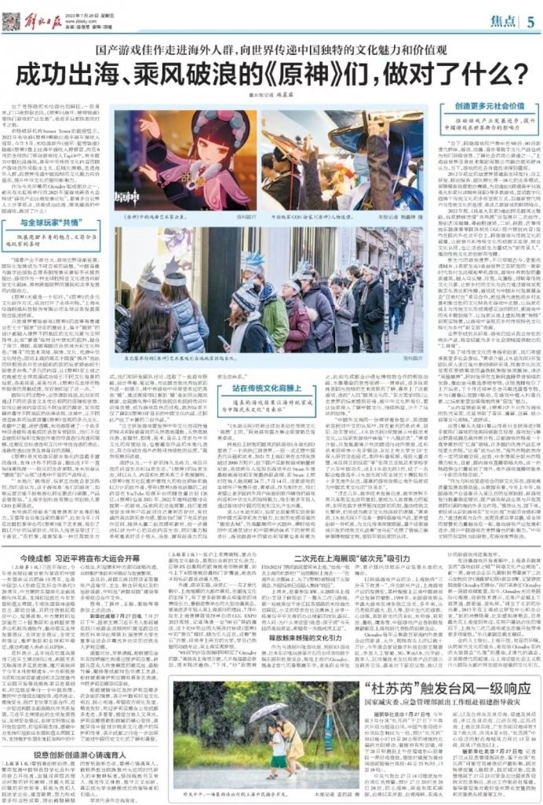

### [不吐不快]  百足之虫，死而不僵，期待原神加速出海

Made by ngapost2md (c) ludoux [GitHub Repo](https://github.com/ludoux/ngapost2md)

----

##### 0.[0] \<pid:0\> 2023-07-29 20:19:03 by 信仰大地的闪电
多年以后，面对行将就木的原，米哈游准会想起那个被官媒注视的日子。

米哈游的经验是 “既要展现IP本身的魅力，又要符合当地玩家的喜好”。比如今年1月在法国巴黎举办的《原神》线下艺术展，吸引了数以万计的玩家到访，排队人流甚至穿过了三个街区。 “在巴黎，逛展览是一种日常娱乐方式。我们和研发团队讨论，选取了一批游戏原画、设计草稿、笔记等，与法国当地优秀玩家的作品一起展示。其中有游戏中非常受欢迎的角色 ‘魈’，通过展览可以看到‘魈’是如何从傩戏傩面、金翅鹏鸟等中国传统民俗和民间传说中获得灵感，成为游戏角色的过程。欧洲玩家不仅了解到《原神》IP背后的中国文化内涵，还因此产出了丰富的二创作品。”

“自主研发游戏要发挥中华文化包容性强的特点和网络游戏的天然落地属性、天然落地优势，在题材、剧情、美术、音乐上寻求与中华文化的深度结合，也要重视作品的本地化表达，努力形成在海外市场可持续性的运营。”敖然观察后说道。

凌妤认为，一个IP的持久生命力，来自开放的内容生态和玩家生态。 “《原神》的玩家生态，可以从人、内容和社群关系三个角度解析。《原神》官方社区维护着庞大的粉丝群体和数以万计的创作者，带有《原神》游戏话题的二创内容在YouTube视频平台的播放量达到126亿；《原神》也是2021年、2022年推特话题讨论度第一的游戏，玩家间的交流频繁。我们能感受到全球用户在面对自己喜欢的IP时，有旺盛的表达欲和参与感。要给他们留下充足的创作空间，提供大量二创灵感和素材，进一步激活以IP为中心的共创内容生态，同时竭力服务和维系好这个庞大、活跃、富有创造力的玩家生态体系。”

既然国内市场不够霍霍那就跑到国外，结果滤镜背后是个夹带私货的猥琐小作坊，内容不是水就是自我陶醉，各种小动作尽显阴湿本色，连本来是个靠软sq抽卡发家的本分都忘了。这三姐盛世如你所愿捏

----

##### 1.[0] \<pid:705709892\> 2023-07-29 20:19:51 by 希望不要再非了
怎么一直都是这个报纸

----

##### 2.[0] \<pid:705710577\> 2023-07-29 20:23:46 by 乙樊庄庚耿贾
害，纸媒也要追热点的嘛，更何况现在一些比较有地位的媒体也成天整点烂活，很多媒体的话看看得了，他说啥也不影响你对吧
~~你说对吧，三流媒体~~

----

##### 3.[0] \<pid:705710748\> 2023-07-29 20:24:50 by 给我七天光明
>[jump](#pid705709892) 希望不要再非了(2023-07-29 20:19) 说: 
>
>怎么一直都是这个报纸

因为这是上海的报社

----

##### 4.[0] \<pid:705711029\> 2023-07-29 20:26:21 by 552233001100ppa
出去见到玩崩铁的法国人聊了几句，崩铁全图，人家须弥又臭又长的沙漠开始后都没碰游戏了，而且认为是日本游戏，特别喜欢稻妻……出了，也没出

----

##### 5.[0] \<pid:705713890\> 2023-07-29 20:42:03 by 希望不要再非了
>[jump](#pid705710748) 给我七天光明(2023-07-29 20:24) 说: 
>
>因为这是上海的报社

我知道，我故意这么说的

----

##### 6.[0] \<pid:705714485\> 2023-07-29 20:44:16 by gyhggg
再看到右下角才确认是最近的报纸

----

##### 7.[1] \<pid:705716932\> 2023-07-29 20:54:53 by astonishkwon
妈呀这居然是昨天的报纸？我还以为是多少年前买过的通稿呢。。
既然这么新鲜，那咋不报导一下这几天散宝池在国外的灰黄成就呢？

----

##### 8.[0] \<pid:705717686\> 2023-07-29 20:58:35 by Karq
这日报的水平马上也就跟人民日报差不多了

----

##### 9.[0] \<pid:705720786\> 2023-07-29 21:15:20 by mithy-
>[jump](#pid705717686) Karq(2023-07-29 20:58) 说: 
>
>这日报的水平马上也就跟人民日报差不多了

这报纸现在就是上海地方报纸……但毕竟上海一线城市，有历史在这，这两字名头给人感觉很大……上海还有蛮多这样的报，什么劳动报啥的都上海地方的

