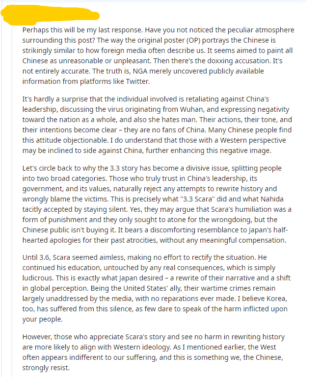

### [热点事件]重点不是在于抹黑吗，其他只不过是新的通道罢了

Made by ngapost2md (c) ludoux [GitHub Repo](https://github.com/ludoux/ngapost2md)

----

##### 0.[0] \<pid:0\> 2023-07-30 03:47:30 by 火星的居民3
这么讨厌倒是滚蛋啊，没本事出国狗叫什么从中国出去不适应回来的见过，出国后拿身份觉得不好，又换另外一个国家的也有，也没本事又tm事多的天天看点营销号当真理了
大家还是多多骂mhy，不要忘了理查的初心

----

##### 1.[0] \<pid:705768656\> 2023-07-30 05:58:19 by 婆娑树影斑驳光影
其实我觉得，这个老哥说的在理，有点敏感，所以自己拿手机翻译翻译得了
实质上3.3以来的故事就是价值观的争斗，每个群体都有他们的价值观，也别提谁魔怔，在我看来米哈游没被沉默的大多数冲死而是简单弃游，已经很对得起他们了

----

##### 2.[1] \<pid:705769180\> 2023-07-30 06:20:12 by akxttx1
>[jump](#pid705768656) 婆娑树影斑驳光影(2023-07-30 05:58) 说: 
>
>其实我觉得，这个老哥说的在理，有点敏感，所以自己拿手机翻译翻译得了
>实质上3.3以来的故事就是价值观的争斗，每个群体都有他们的价值观，也别提谁魔怔，在我看来米哈游没被沉默的大多数冲死而是简单弃游，已经很对得起他们了
>
>

屁用没有。白皮根本不看。看了也看不懂。看得懂也不想看懂。他们社会如果没有敌人就无法转移矛盾。那离崩溃就不远了

----

##### 3.[0] \<pid:705769501\> 2023-07-30 06:32:08 by 婆娑树影斑驳光影
>[jump](#pid705769180) akxttx1(2023-07-30 06:20) 说: 
>
>屁用没有。白皮根本不看。看了也看不懂。看得懂也不想看懂。他们社会如果没有敌人就无法转移矛盾。那离崩溃就不远了

他回复的是个韩国人，看内容仔细点
为什么要白人认同，在我看来老哥把中国人的观点堂堂正正摆在白男论坛才叫有种，在我看来他早就知道白男不可能认同，不然他不会说那句“those with western perspectives will incline to the side against China”，和xxn求洋大人升堂有明显区别

----

##### 4.[0] \<pid:705769751\> 2023-07-30 06:40:25 by 莫日雨虫单
体感海外玩o的很多亚裔(abc，abk之类)，不用假设都是白人

----

##### 5.[0] \<pid:705770063\> 2023-07-30 06:50:22 by OraKun
>[jump](#pid705768656) 婆娑树影斑驳光影(2023-07-30 05:58) 说: 
>
>其实我觉得，这个老哥说的在理，有点敏感，所以自己拿手机翻译翻译得了
>实质上3.3以来的故事就是价值观的争斗，每个群体都有他们的价值观，也别提谁魔怔，在我看来米哈游没被沉默的大多数冲死而是简单弃游，已经很对得起他们了
>
>

老哥你这个是在哪看到的？事情发展到现在实在是太冤枉了，经典的三节刻板印象+片面之语让红迪上基本都在aoe整个中国和中国人，甚至看到有人说“日本干的是正确的事”？？？？现在红迪怎么骂的人都有，说好话的有的甚至被downvote

aoe的人完完全全没有一个说对点的，为什么大家讨厌散兵草神骂米哈游等等，为什么这个三节被骂汉奸，基本上全部相信原帖zoe fang的话，那个debunk理中客的post都没怎么人看有，你这张图片概括得太好了，应该是国人英语大神

nga有时候确实有点毒，以前幽夜三节拳师在更毒，现在nga被认为比三节还毒我接受不了，三节出了名人人喊，现在跑到国外造谣，摇身一变成受害者是真的牛逼，在我看来从3.3到现在nga才是三观正的人居多的地方，b站是真的粪坑现在，一句坏话都不能说，一说就被团建，我是真的不很理解，什么年代了还搞这套，有点自主思考能力稍微成熟点都能理解这样24小时巡逻评论区全身心维护mhy这样一个游戏公司是个nt到爆炸的行为，至于吗？

----

##### 6.[0] \<pid:705770441\> 2023-07-30 06:58:34 by 婆娑树影斑驳光影
>[jump](#pid705770063) OraKun(2023-07-30 06:50) 说: 
>
>老哥你这个是在哪看到的？事情发展到现在实在是太冤枉了，经典的三节刻板印象+片面之语让红迪上基本都在aoe整个中国和中国人，甚至看到有人说“日本干的是正确的事”？？？？现在红迪怎么骂的人都有，说好话的有的甚至被downvote
>
>aoe的人完完全全没有一个说对点的，为什么大家讨厌散兵草神骂米哈游等等，为什么这个三节被骂汉奸，基本上全部相信原帖zoe fang的话，那个debunk理中客的post都没怎么人看有，你这张图片概括得太好了，应该是国人英语大神
>
>nga有时候确实有点毒，以前幽夜三节拳师在

在红迪那个最早的方女士升堂贴下面，按时间近排序，应该挺新的

----

##### 7.[0] \<pid:705771174\> 2023-07-30 07:13:34 by 婆娑树影斑驳光影
>[jump](#pid705770063) OraKun(2023-07-30 06:50) 说: 
>
>老哥你这个是在哪看到的？事情发展到现在实在是太冤枉了，经典的三节刻板印象+片面之语让红迪上基本都在aoe整个中国和中国人，甚至看到有人说“日本干的是正确的事”？？？？现在红迪怎么骂的人都有，说好话的有的甚至被downvote，最离谱的是他们认为mhy是最听中国玩家的话，他们现在很担心新的角色设计和剧情，认为中国玩家对剧情的不满会“迫使”mhy往“坏方向走”的去写剧情，nga三观正的人被冤枉到这地步我看得心烦
>
>aoe的人完完全全没有一个说对点的，为什么大家讨厌散兵草神骂米哈游等等，为什么这个三节

方女士的评论都被那个人删了
你知道这个up也就是吃米哈游流量那种，反正游戏死不死，内容对不对他们是不关心的

----

##### 8.[0] \<pid:705771319\> 2023-07-30 07:16:33 by PuneumaMidori
>[jump](#pid705770063) OraKun(2023-07-30 06:50) 说: 
>
>老哥你这个是在哪看到的？事情发展到现在实在是太冤枉了，经典的三节刻板印象+片面之语让红迪上基本都在aoe整个中国和中国人，甚至看到有人说“日本干的是正确的事”？？？？现在红迪怎么骂的人都有，说好话的有的甚至被downvote，最离谱的是他们认为mhy是最听中国玩家的话，他们现在很担心新的角色设计和剧情，认为中国玩家对剧情的不满会“迫使”mhy往“坏方向走”的去写剧情，nga三观正的人被冤枉到这地步我看得心烦
>
>aoe的人完完全全没有一个说对点的，为什么大家讨厌散兵草神骂米哈游等等，为什么这个三节

现在大家都应该懂了顾维钧先生的心情吧！
我觉得坛友你不用太在意，实际上本来CN在那边的形象就是索多玛与蛾摩拉，等着被天火灭的城市在外面别指望能看见什么好的，不如巨魔一下：“CN玩家意见就是能影响mhy，而你们对迪希雅的意见mhy根本看都不会看的Lmao”

----

##### 9.[0] \<pid:705771360\> 2023-07-30 07:17:27 by DxhSN2022
“汉奸”在国内有用，在海外屁用没有。

昨天从这个角度攻击她，我还以为诸位真不在乎外面说啥了。

即使在大陆，泥潭都算政治光谱和外面相对更合不来的地方。想和外面玩家进行有效交流，避开政治是必要前提。
版里湾友港友那么多，也从来不阐述自己的政治倾向。(当然也发不出来

----

##### 10.[0] \<pid:705771464\> 2023-07-30 07:19:54 by OraKun
>[jump](#pid705771174) 婆娑树影斑驳光影(2023-07-30 07:13) 说: 
>
>方女士的评论都被那个人删了
>你知道这个up也就是吃米哈游流量那种，反正游戏死不死，内容对不对他们是不关心的

是的我去找了下，没有看到，这回是真的唉了

----

##### 11.[1] \<pid:705771914\> 2023-07-30 07:28:47 by 婆娑树影斑驳光影
>[jump](#pid705771464) OraKun(2023-07-30 07:19) 说: 
>
>是的我去找了下，没有看到，这回是真的唉了

其实你也不用那么难受，外面对我们是这样的，璃月上线以来光原神版对CN的印象都不错，他们这么搞，其实只不过回归常态而已。
但是背后的原因引人深思，为什么米早期内容全是给中国带货的，而现在一个散就让CN又退化成人人喊打了呢？都是因为散黑虐猫么？都是散黑开盒的原因么？为什么这个话题变成了他们对中国“汉奸”一词的嘲笑，甚至直接用nz形容我们，米哈游在游戏里价值观的转变其实才是根本原因
我们的玩家都太可爱了，不喜欢的内容就是大不了退坑，但是这种触及基本价值观的东西，其实在西方游戏里面到处都有，你要是搞砸了你这碗饭直接就被资方端走了。他们的游戏偷偷塞他们的私货，而米哈游现在塞得是谁的私货我就不直接说了。

----

##### 12.[0] \<pid:705774723\> 2023-07-30 08:13:42 by 迈步启航
>[jump](#pid705770063) OraKun(2023-07-30 06:50) 说: 
>
>老哥你这个是在哪看到的？事情发展到现在实在是太冤枉了，经典的三节刻板印象+片面之语让红迪上基本都在aoe整个中国和中国人，甚至看到有人说“日本干的是正确的事”？？？？现在红迪怎么骂的人都有，说好话的有的甚至被downvote，最离谱的是他们认为mhy是最听中国玩家的话，他们现在很担心新的角色设计和剧情，认为中国玩家对剧情的不满会“迫使”mhy往“坏方向走”的去写剧情，nga三观正的人被冤枉到这地步我看得心烦
>
>aoe的人完完全全没有一个说对点的，为什么大家讨厌散兵草神骂米哈游等等，为什么这个三节

老哥放宽心，要改变外国人从小就被打上的思想钢印，光靠几篇贴子还是太难了，而且还不知道那些发言里面有多少是反串的。中国在外国人眼里一直都很不好，但那些人无论怎么想怎么做，都影响不了我们国家。这样的人就跟背景音乐一样，人人都知道他们在那，但不会去care。尔曹身与名俱灭，不废江河万古流。

虽然()()颠倒黑白非常恶心，但是理查最近肉眼可见地人越来越多，各个平台上也逐渐有了不同的声音。洗脑包和社区管控确实有效，但都这架不住玩家自己在游戏中的真实感受。3.2的时候社区是一片祥和，3.6就连b站都失守了，大家都是看在眼里的。即使被恶心到还继续玩的人也不在少数，但只要米继续喂屎，信任裂缝总会越来越多的。人不可能在所有时候欺骗所有人。即使社区不断粉饰太平、混淆视听，他们也改变不了玩家对游戏的真实感受，我相信沉默的大多数最终会根据自己的立场和感受做出正确的选择。至于那些为了一个虚假的偶像可以出卖任何东西的人，想想我国14亿人，不出几个____，是以为自己活在天堂吗

----

##### 15.[0] \<pid:705779689\> 2023-07-30 09:05:10 by 普鲁士蓝蓝蓝
已经2023年了没有必要在乎洋人的想法了也就fang那种慕洋犬才觉得洋大人的想法很重要了

----

##### 16.[0] \<pid:705780606\> 2023-07-30 09:13:01 by ZFBXBD
这事发到外面，这种春秋笔法，只是借着散兵节奏之名摸黑我们而已。
就像之前有人借散黑用那个敏感词骂人为名，去官方底下讨伐散黑。
只是用他人觉得对的观点，以春秋笔法的方式，去暗中帮助自己完成某种目的。

----

##### 17.[0] \<pid:705781082\> 2023-07-30 09:17:12 by ateh2412
这次是借着散兵之名抹黑cn玩家，那个人可不是单纯的祸水东引

----

##### 18.[0] \<pid:705793032\> 2023-07-30 10:43:30 by 火星的居民3
>[jump](#pid705770063) OraKun(2023-07-30 06:50) 说: 
>
>老哥你这个是在哪看到的？事情发展到现在实在是太冤枉了，经典的三节刻板印象+片面之语让红迪上基本都在aoe整个中国和中国人，甚至看到有人说“日本干的是正确的事”？？？？现在红迪怎么骂的人都有，说好话的有的甚至被downvote，最离谱的是他们认为mhy是最听中国玩家的话，他们现在很担心新的角色设计和剧情，认为中国玩家对剧情的不满会“迫使”mhy往“坏方向走”的去写剧情，nga三观正的人被冤枉到这地步我看得心烦
>
>aoe的人完完全全没有一个说对点的，为什么大家讨厌散兵草神骂米哈游等等，为什么这个三节

你不用管他们其实，我看到有人说，这里(指红迪)几乎没人会中文，中国那边大部分玩家又不会英语，大家应该把这当一个乐子看，不应该这么激动。真的会有成年人因为一个帖子就对某个根本不了解的国家下定义吗，都是早就定义好了

----

##### 20.[0] \<pid:705805889\> 2023-07-30 12:01:46 by 山薄荷雪
脑抽的外网人和脑抽的散姐一起端走完了
一个可能是厨散兵厨的，一个不厨散兵也脑残，有什么不敢说的
跟他们解释个p解释

----

##### 23.[0] \<pid:705806965\> 2023-07-30 12:08:22 by 哒哒块
真白皮只会在4chan臭你“chink scarafujo”，2023年了还有殖人对洋大人抱有幻想

----

##### 24.[0] \<pid:705807001\> 2023-07-30 12:08:33 by 格里兹纳特
>[jump](#pid705771914) 婆娑树影斑驳光影(2023-07-30 07:28):

这是碰都不能碰的滑梯

----

##### 25.[0] \<pid:705809126\> 2023-07-30 12:21:13 by 乙文麦丙殷阮
爬完楼只觉得想笑
ld

----

##### 26.[0] \<pid:705811090\> 2023-07-30 12:32:31 by 过客型逆戟鲸
润人经典回踩，借用某个群体的话来讲就是别太爱了

----

##### 27.[0] \<pid:705811406\> 2023-07-30 12:34:17 by sbsx123
真fh就别玩国产游戏啊，难道都是镍币人吗

----

##### 28.[0] \<pid:705812183\> 2023-07-30 12:38:47 by 碎冰op
>[jump](#pid705770063) OraKun(2023-07-30 06:50):

你信你就输了，搞得好像国外流水就很高一样

----

##### 29.[0] \<pid:705813829\> 2023-07-30 12:48:31 by 海与风的礼物w
>[jump](#pid705769501) 婆娑树影斑驳光影(2023-07-30 06:32) 说: 
>
>他回复的是个韩国人，看内容仔细点
>为什么要白人认同，在我看来老哥把中国人的观点堂堂正正摆在白男论坛才叫有种，在我看来他早就知道白男不可能认同，不然他不会说那句“those with western perspectives will incline to the side against China”，和xxn求洋大人升堂有明显区别

没错就是这样咱不管你咋样认为，就堂堂正正告诉你咱是怎么样的，你想要继续攻击抹黑那随便

----

##### 30.[0] \<pid:705816242\> 2023-07-30 13:03:04 by c6537
应该把流水图贴给白皮看看告诉他们实际上他们连迪希雅都改变不了，fw白皮一辈子也就住在爹妈房子地下室玩二手ps4看原神打胶了，钱包比他皮都白，希望他们早日参军为拜登大总统献出心脏最后回国拿不到抚恤金最后流落街头的时候能想起现实是没有纳西妲给他们散兵的待遇的。

奥对了，方女士你在看吗，在看帮我翻译给白皮下捏

----

##### 31.[0] \<pid:705850966\> 2023-07-30 16:53:32 by 婆娑树影斑驳光影
>[jump](#pid705775887) OraKun(2023-07-30 08:28) 说: 
>
>天，希望没有那么复杂，宁愿米哈游单纯能力不行或者重心不在，你说的对西方认为CN毒也不是一天两天的事了，上次周年庆问题红迪都能转到gov还配图，确实是回归常态，人与人注定不能相互理解，去红迪基本和去b站差不多了，浓度都是极高的地方，希望都过好自己，都是网上说说，不要带入现实生活就好了

你可能希望一切都美好，至少只是小小的不如意
但是至少，价值观之争就是很残酷，我说难听点你在美国主流媒体看到的任何东西都是符合主流价值观的，如果你不符合，你会很快的就被清算，像散兵这种故事一般都是用来扰乱敌国的文化入侵产品。
有些人，天真的以为拿现代影音娱乐技术做出来一段富含中国文化元素的游戏，就是文输么？差远了，价值观才是一切。西方人在此道上会的比我们要强得多的多了

----

##### 32.[0] \<pid:705856048\> 2023-07-30 17:20:35 by aureolia
这种东西真的相当无所谓，也没必要汴京和带坏自己的心情

都2023年了还有不明白太平洋两岸结构性矛盾的人吗，这种情况下说什么都是滑到赛力斯被西方媒体塑造的刻板印象上去的，没必要在白皮的地盘为自己做任何的辩解

至于3j找洋大人赛博升堂，这种事情乐见其成就是，你猜3j和普遍反华的reddit合流怕的是我们还是米哈游？

----

##### 33.[0] \<pid:705864121\> 2023-07-30 18:05:12 by xdccc023
多来点，快进到和隔壁以闪一样节奏爆炸

----

##### 34.[0] \<pid:705866319\> 2023-07-30 18:17:29 by 秘密首领
>[jump](#pid705770063) OraKun(2023-07-30 06:50) 说: 
>
>老哥你这个是在哪看到的？事情发展到现在实在是太冤枉了，经典的三节刻板印象+片面之语让红迪上基本都在aoe整个中国和中国人，甚至看到有人说“日本干的是正确的事”？？？？现在红迪怎么骂的人都有，说好话的有的甚至被downvote，最离谱的是他们认为mhy是最听中国玩家的话，他们现在很担心新的角色设计和剧情，认为中国玩家对剧情的不满会“迫使”mhy往“坏方向走”的去写剧情，nga三观正的人被冤枉到这地步我看得心烦
>
>aoe的人完完全全没有一个说对点的，为什么大家讨厌散兵草神骂米哈游等等，为什么这个三节

散兵人气高。
鉴定为批嘴易位，因为散兵池子在美国连前五十都没进去

