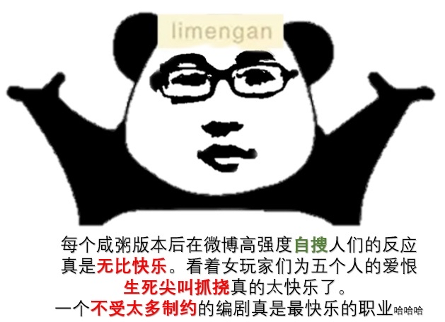
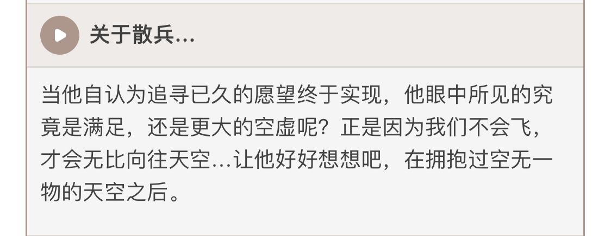
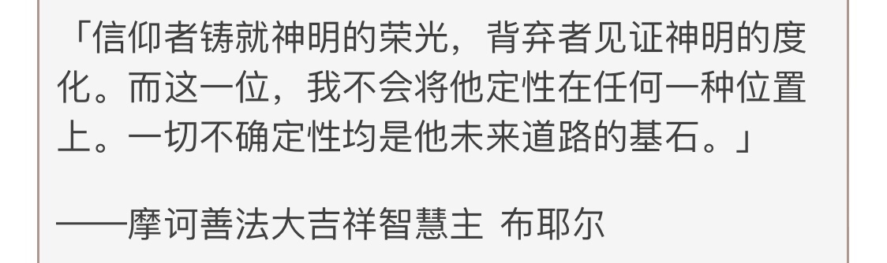
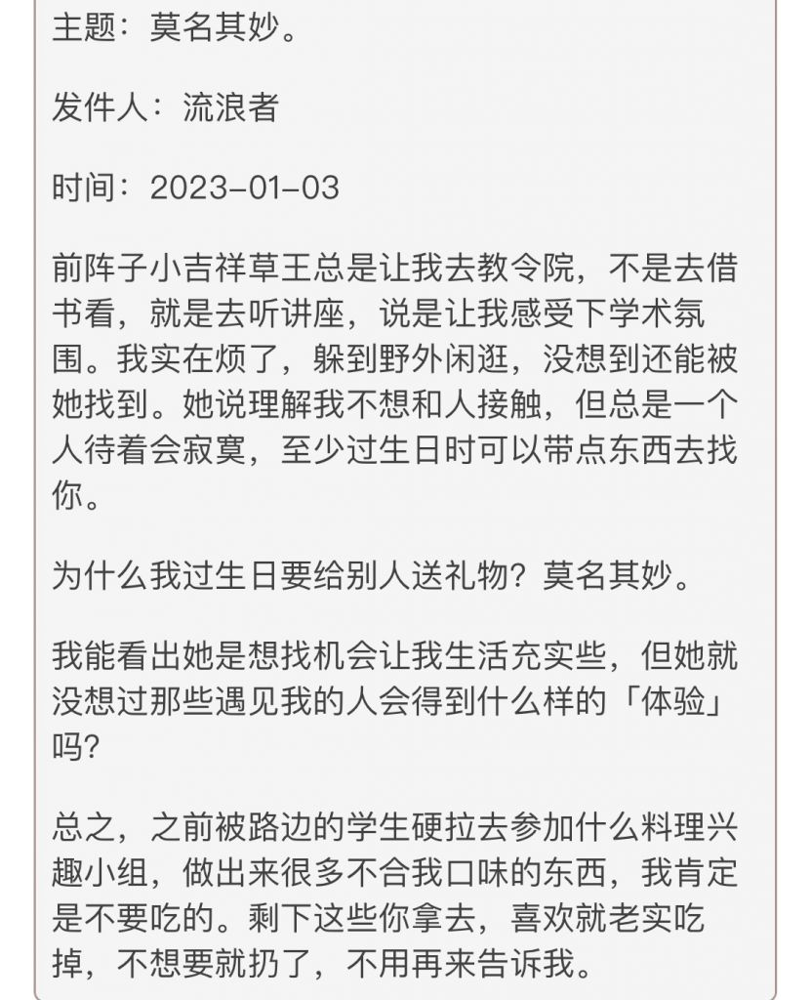
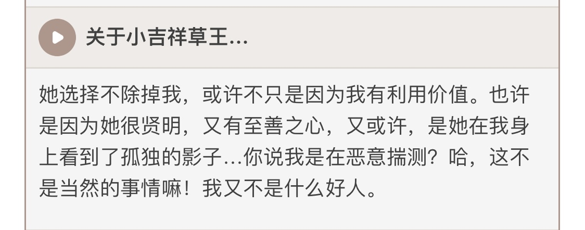
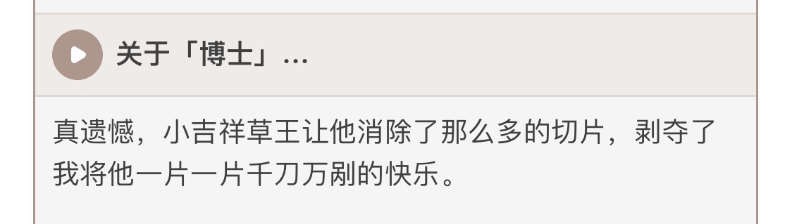
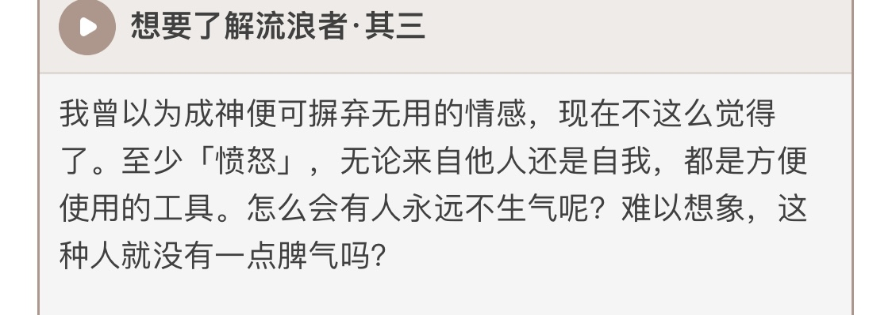

### [不吐不快] 浅谈散草cp，论散兵是另一个“limengan”型的自我代入皮套的可能性，以及纳西妲后期沦为“深情工具人”的可能性

Made by ngapost2md (c) ludoux [GitHub Repo](https://github.com/ludoux/ngapost2md)

----

##### 0.[1] \<pid:0\> 2023-07-30 11:09:16 by 落穹千刃
先叠甲，一本人没有aoe任何一个群体的意图，二以下仅为本人小论文，逻辑也许会比较凌乱

limengan其实是非常典型的自恋文青男，而且很明确米忽悠内部不止一个limengan这种类型的

隔壁楼吐槽散兵和丹羽的友情线导致的自机“深情难脑”和设定观感矛盾，我可以理解为：<b>制作须弥版本前，散兵并不是文案的主要怨念对象，而是一个代入了部分情绪并且还等着卖卡的反派</b>

<b>修改刀谱，利用刀匠心理将他们骗去至冬，甚至让其他非五传的稻妻民众觉得只不过是时间长了自然就衰败了</b>这种写法就不像是写单纯无知的少年，而是一个危险的反派的，试问一下，大家是觉得3.3那种突然冲进工厂杀了很多人更有反派压迫感，还是2.0和2.6和2.7那种幕后黑手式玩弄人心的更有反派压迫感，同时容彩祭这么写方便后面展开，如果明显写散兵杀很多人是很难写后期剧情的

但是须弥版本开始就不一样了，相信很多玩家也发现，不止散兵，其他角色也或多或少被投射了文案的情绪

最匪夷所思的是3.1神意pv，基本上正常玩家都不能理解，但是如果套用另一种方式，用文青病的方式去解读，就看出想表达什么

<b>被造物主影不重视，认为她被力量所左右——在现实中被自己重视的女性(可能是母亲，姐妹，甚至暗恋的人)认为不中用，对方追求别的去了</b>

<b>被朋友背叛，被视为异类憎恨——和前女友或者挚友分道扬镳，老死不相往来</b>

包括3.3显示丹羽没背叛也可以视作为自我安慰：TA当时是出于某种被迫的原因离开我的

<b>同类背弃与我的约定——解读的方向太多，比如和自己玩得不错的后辈同事闹崩</b>

雷电五传变成了自己怨恨的人的替身，所以其实不需要什么理由，杀了就杀了

以上也可以套用文青女，性别调换即可，<b>只要精神不正常，无论男女都可以是limengan</b>

带着这样几条前所未有的特质，也正因如此须弥版本里的散兵所集中的文案怨念之深前所未有，反复多次表现出他的暴躁态度，再不敏感的玩家多少也觉得不对劲

那么散兵作为文案的焦虑感的集合体，文案必定是要安排一种方式来“拯救自己”的

那么去拯救的是谁呢，我相信大家都有答案了

萝莉通常作为通俗文学里带来温馨和引起保护欲的存在，代表了一种人类原初的纯洁美好状态，光是看到小孩子天真的外表，就如同身处童话一般，所以非常容易得到大众的好感滤镜，以至于能忽视魔神抢椅子这一类不成熟的言论

象征着白纸的萝莉来救赎自己，自己被感动同时回报以凝视，也是挺常见的感情线

其实这种写作细细打磨也不是不行，但是文案太急着消除自己的焦虑暴躁，导致剧情观感极差

但是文青病版模式里，萝莉是非常容易成为衬托出对方高光的工具人(甚至不光是萝莉，应该说去完成治愈任务的角色都容易出现这种情况)

一般会表现为，渡过一段美好时光后，危险的外部因素会侵入，伤害到萝莉

但是萝莉是没有自救欲望和想法的，她甚至会考虑去牺牲自己拯救别人，那么谁来救萝莉呢？当然是曾经被萝莉治愈的少年啊

但是写作过程中文案犯了一个大错：纳西妲的人设崩了，以及散兵因为各种吃书和骚操作导致泛人气清零，彻底断绝了补救的机会

造成这种局面的原因大家也都很清楚，文案水平低+自恋过头不顾玩家+对玩家恶意溢出的意图惹怒大众

大后期很有可能会有纳西妲被威胁，散兵花很大代价去救她的情节，但是已经彻底出脑的玩家是完全不会接受的，一句话

<b>重要吗？也就文案这样的cp粉觉得重要吧</b>

----

##### 1.[0] \<pid:705797393\> 2023-07-30 11:10:27 by 今锁朱楼
一翻到最下面。
这怎么还骂起自己来了

我焯看错了我是sb

----

##### 2.[0] \<pid:705797756\> 2023-07-30 11:12:39 by write54
太长不看
理由其实这张图就是理由
人家就是看玩家间打架爽呢

----

##### 3.[0] \<pid:705798665\> 2023-07-30 11:18:12 by 纠缠的狗
又是老哥你啊

----

##### 4.[0] \<pid:705798743\> 2023-07-30 11:18:43 by Question10086
你猜除了厕妹，所谓正常散厨里有多少人是这种自恋文青？

----

##### 5.[0] \<pid:705798828\> 2023-07-30 11:19:16 by mihomopromax
我发散了一下结合解牛者甚至怀疑是草散皮套人公器私用。玩家抓耳挠腮是play的一环

----

##### 6.[0] \<pid:705799364\> 2023-07-30 11:22:22 by 梅子昆布茶
我觉得老哥说的挺有道理的
毕竟但凡只是仙女文案在推散兵
那我完全想不出来怎么会不卖ML而是卖CP
还卖的是散草

所以，只可能是男文案自我代入
是希望被萝莉妈妈爱的男文案一枚吖～

----

##### 7.[0] \<pid:705799529\> 2023-07-30 11:23:25 by piepiero
说到草神，当时看到“不过魔神抢椅子的游戏”，就觉得有一股怪味
草神的塑造基本上是围绕着“智慧且慈爱”展开的，这样的台词，我不知道能突出她哪一个角色特点~~坏了，变成特典了~~
这句话有一股编剧一边听中二歌曲一边幻想，到了幻想高潮处，作为执笔者对手下纸片人的优越感骤然爆发的感觉
不然前有蒙徳塑造的塔王战争，贵族战争；璃月的魔神战争，钟离的pv直接说“无意逐鹿”；稻妻，魔神战争对影来说代表着失去和折磨，传二更是单独拿出一段写了士兵幻影保护雷神
这三国对于魔神战争的描写无疑都在凸显悲壮、痛苦，到了须弥一句充满鄙夷态度的抢椅子游戏，一转态度，甚至有种把被害者变成加害者的意图
我不知道要这么才能做出这样的转变坚定为被干总夺舍

----

##### 8.[0] \<pid:705800128\> 2023-07-30 11:27:15 by 涨幅为困难
一开始就这么写谁管他，非要玩弄大伙感情，杀了这些人的心都有了

----

##### 9.[0] \<pid:705800434\> 2023-07-30 11:29:16 by 落穹千刃
>[jump](#pid705797756) write54(2023-07-30 11:12) 说: 
>
>太长不看
>理由其实这张图就是理由
>人家就是看玩家间打架爽呢
>
>

这是从另一个角度来猜想为什么不顾大众情绪也要力推散草，其实把散兵理解为另一个猛哥代入自己无法自拔，也能说得过去

----

##### 10.[1] \<pid:705801038\> 2023-07-30 11:33:05 by fealib
真出现结尾这种情况(虽然是大概率
我只能说一句
别恶心我

----

##### 11.[0] \<pid:705801071\> 2023-07-30 11:33:17 by write54
>[jump](#pid705800434) 落穹千刃(2023-07-30 11:29) 说: 
>
>这是从另一个角度来猜想为什么不顾大众情绪也要力推散草，其实把散兵理解为另一个猛哥代入自己无法自拔，也能说得过去

米一直擅长黑红营销

----

##### 13.[0] \<pid:705801211\> 2023-07-30 11:34:04 by kunizu
基于策划心理学的新原学开山之作

----

##### 14.[0] \<pid:705801561\> 2023-07-30 11:36:06 by bluebayouplus
崩坏宇宙，错
李猛干宇宙，对

----

##### 15.[0] \<pid:705801644\> 2023-07-30 11:36:40 by SCP250
可以说两者形成这种关系之后，必然有其中一方落难另一方拯救的情节，唯一的问题是哪个版本放出来，盲猜和3.6一样藏到水神up的下半版本我已经迫不及待想看猛干哥和他的徒子徒孙表演了

----

##### 16.[1] \<pid:705802176\> 2023-07-30 11:39:49 by 痛苦上班
>[jump](#pid705798743) Question10086(2023-07-30 11:18) 说: 
>
>你猜除了厕妹，所谓正常散厨里有多少人是这种自恋文青？

可是你游编剧也是厕妹/厕弟啊

----

##### 17.[0] \<pid:705802285\> 2023-07-30 11:40:26 by 造化小片
必然的啊

----

##### 18.[0] \<pid:705802928\> 2023-07-30 11:44:24 by 落穹千刃
>[jump](#pid705801188) h26hxutz(2023-07-30 11:33) 说: 
>
>我发现大伙是不是都成猛干哥单推人了怎么天天提他？  看来他那些话对大伙影响有点大啊，虽然我看了没啥感觉来着

因为大家发现了原学的真谛，真正的考据不是考据角色伏笔，而是考据文案的逻辑思维

----

##### 19.[0] \<pid:705803354\> 2023-07-30 11:46:53 by kunizu
>[jump](#pid705802928) 落穹千刃(2023-07-30 11:44) 说: 
>
>因为大家发现了原学的真谛，真正的考据不是考据角色伏笔，而是考据文案的逻辑思维

人是最大的变量。从人、创作者的扭曲、人性的挣扎出发，也许能找到许多真相

----

##### 20.[0] \<pid:705803998\> 2023-07-30 11:50:40 by 衛陽
文案被夏亚夺舍了？

----

##### 21.[0] \<pid:705804963\> 2023-07-30 11:56:21 by 衛陽
>[jump](#pid705799529) piepiero(2023-07-30 11:23) 说: 
>
>说到草神，当时看到“不过魔神抢椅子的游戏”，就觉得有一股怪味
>草神的塑造基本上是围绕着“智慧且慈爱”展开的，这样的台词，我不知道能突出她哪一个角色特点~~坏了，变成特典了~~
>这句话有一股编剧一边听中二歌曲一边幻想，到了幻想高潮处，作为执笔者对手下纸片人的优越感骤然爆发的感觉
>不然前有蒙徳塑造的塔王战争，贵族战争；璃月的魔神战争，钟离的pv直接说“无意逐鹿”；稻妻，魔神战争对影来说代表着失去和折磨，传二更是单独拿出一段写了士兵幻影保护雷神
>这三国对于魔神战争的描写无

“抢椅子”大约是真的文案原本想突出草神的“智慧”，“智慧”怎么突出？当然是锐评，怎么锐评有智慧？显然是高次元视角，而小草高次元视角就是文案本身视角，因此文案的不专业，一下把写手视角带入了，偏偏对于写手来说，这真的可能是“抢椅子”游戏。。。

----

##### 22.[0] \<pid:705805779\> 2023-07-30 12:01:07 by Question10086
>[jump](#pid705802176) 痛苦上班(2023-07-30 11:39) 说: 
>
>可是你游编剧也是厕妹/厕弟啊

绷

----

##### 23.[0] \<pid:705806071\> 2023-07-30 12:02:56 by Lilith330
如果是男文案套皮，以后散兵也是爱纳西妲的工具人

----

##### 24.[0] \<pid:705807096\> 2023-07-30 12:09:06 by 落穹千刃
>[jump](#pid705806071) Lilith330(2023-07-30 12:02) 说: 
>
>如果是男文案套皮，以后散兵也是爱纳西妲的工具人

其实那个ep出来后，我觉得是文青男文案自我代入的可能性更大了

----

##### 25.[1] \<pid:705808711\> 2023-07-30 12:18:48 by 在心中描绘
你们觉得草是舔散工具人，但实际上是反过来的。
所谓舔散不过是草给散兵免罪，但这种女性当权者给面首赦罪的故事不要太多了，比如赵太后和嫪毐。。
如果认真讲的话，其实纳西妲是比较希望散兵去过自己的生活，而自己去观察他的，因为很有趣。这个在纳西妲对散兵的语音里，和散兵的角色介绍里都有

而散兵心态就属于快没了草不能活的那种。
因为喜欢草，他要逃课，目的就是让小草骂他，参见青春校园剧里常见的叛逆小男生和品学兼优的小女生。

还有第三段，意思就是“她居然把我往外人那里推，我就要给他们点颜色看看”
生日信末尾特意做了枣椰蜜糖哦，散解们应该知道阿散他不爱吃甜食的。
语音里也是提到小草三次

锡兵的故事里，最后锡兵化成了灰烬，但是留了一颗心给自己爱的芭比娃娃。灰烬pv引用了这段，那么芭比娃娃是谁呢。一醒过来就周游世界到处冒险找哥哥/妹妹的旅行者显然不符呢。
最重要的一点，也是最大的逻辑。对于散兵而言，他现在最重要的事情是什么，要么是找博士复仇，要么找五传赎罪，对不对。为了吃喝玩乐留在须弥也太low了。
那就只能是爱情把他束缚在了须弥，一天不看到小吉祥草王他就要亖了。
流水是个赔钱货。剧情里也是个倒插门的舔狗呢，这下表里如一双向奔赴了。

----

##### 26.[1] \<pid:705809228\> 2023-07-30 12:21:48 by 杀菌消毒
>[jump](#pid705801188) h26hxutz(2023-07-30 11:33):

猛干哥语录之余米桑游戏，是不可辩解的绝对真理。对所有讨论米哈游游戏剧情人物塑造甚至角色强度都是有指导意义的。你读书时候也不会说自己单推语文书单推新华字典吧。所以不是我们要单推，是不得不推。

----

##### 27.[0] \<pid:705810836\> 2023-07-30 12:31:04 by 落穹千刃
>[jump](#pid705808711) 在心中描绘(2023-07-30 12:18) 说: 
>
>你们觉得草是舔散工具人，但实际上是反过来的。
>所谓舔散不过是草给散兵免罪，但这种女性当权者给面首赦罪的故事不要太多了，比如赵太后和嫪毐。。
>如果认真讲的话，其实纳西妲是比较希望散兵去过自己的生活，而自己去观察他的，因为很有趣。这个在纳西妲对散兵的语音里，和散兵的角色介绍里都有
>
>
>[img]./mon_202307/30/l2Q2s-7ld4ZdT3cS

纳西妲喜欢吃枣椰蜜糖，这下破案了

----

##### 28.[0] \<pid:705811705\> 2023-07-30 12:36:02 by 在心中描绘
>[jump](#pid705810836) 落穹千刃(2023-07-30 12:31) 说: 
>
>纳西妲喜欢吃枣椰蜜糖，这下破案了

所以说散解真的是好迟钝啊。如果换成别人，ml向的角色搞这一套，早就开始骂mhy了，散解还搁那“寨男割破防了”呢。
让我看看现在是谁在破防啊

----

##### 29.[0] \<pid:705816323\> 2023-07-30 13:03:32 by 落穹千刃
>[jump](#pid705805779) Question10086(2023-07-30 12:01) 说: 
>
>绷

猛兄身为高层都sj厕妹的bot，下面的人自然更不用说

----

##### 30.[0] \<pid:705817291\> 2023-07-30 13:09:54 by Cloudrapid133
>[jump](#pid705808711) 在心中描绘(2023-07-30 12:18) 说: 
>
>你们觉得草是舔散工具人，但实际上是反过来的。
>所谓舔散不过是草给散兵免罪，但这种女性当权者给面首赦罪的故事不要太多了，比如赵太后和嫪毐。。
>如果认真讲的话，其实纳西妲是比较希望散兵去过自己的生活，而自己去观察他的，因为很有趣。这个在纳西妲对散兵的语音里，和散兵的角色介绍里都有
>
>
>[img]./mon_202307/30/l2Q2s-7ld4ZdT3cS

我嗑到了
散草99

----

##### 31.[0] \<pid:705817412\> 2023-07-30 13:10:35 by 普露璐特
>[jump](#pid705808711) 在心中描绘(2023-07-30 12:18) 说: 
>你们觉得草是舔散工具人，但实际上是反过来的。
>所谓舔散不过是草给散兵免罪，但这种女性当权者给面首赦罪的故事不要太多了，比如赵太后和嫪毐。。
>如果认真讲的话，其实纳西......

枣椰蜜糖可是草神最喜爱的食物，信里还说是剩的送给旅行者。

----

##### 32.[0] \<pid:705822093\> 2023-07-30 13:41:50 by 在心中描绘
>[jump](#pid705817412) 普露璐特(2023-07-30 13:10) 说: 
>
>枣椰蜜糖可是草神最喜爱的食物，信里还说是剩的送给旅行者。
>

我觉得真的挺明显的。
散兵对他认识的所有人，只有纳西妲是一句重话都说不出来。
对旅行者：真慢，没叫你跟着，这你也要啊。
感觉散解真的是在净善宫倒尿桶都不一定配

----

##### 33.[1] \<pid:705822780\> 2023-07-30 13:46:27 by 冷泠棱凌
>[jump](#pid705808711) 在心中描绘(2023-07-30 12:18) 说: 
>
>你们觉得草是舔散工具人，但实际上是反过来的。
>所谓舔散不过是草给散兵免罪，但这种女性当权者给面首赦罪的故事不要太多了，比如赵太后和嫪毐。。
>如果认真讲的话，其实纳西妲是比较希望散兵去过自己的生活，而自己去观察他的，因为很有趣。这个在纳西妲对散兵的语音里，和散兵的角色介绍里都有
>
>
>[img]./mon_202307/30/l2Q2s-7ld4ZdT3cS

这么一看，散草的关系明面上是草神贴散兵，给他审论文让他去上课，处处都替他着想希望他好，散兵甚至也可以嘴她，但实际上这段关系里真正离不开对方的是散兵啊。
想想也是，一个世界树黑户，目前记得他的只有黄毛和草神，而黄毛自己要到处跑不说，散兵甚至看不上她，那么他剩下的依靠有且只有一个了。
啧啧啧，真真是官推cp啊，甜，太甜了。要是草神哪天真的自爆变成小白枝了，散兵肯定是承受不了这第四次背叛的吧。

----

##### 34.[0] \<pid:705828022\> 2023-07-30 14:22:45 by 无意识koishi
其实不用那么隐晦
直说原神文案都是散兵就行了
我觉得最起码也有80%散兵

----

##### 35.[0] \<pid:705828155\> 2023-07-30 14:23:52 by kowla
这下可以代入一下文案的视角了

这群黄毛玩家要求真多，b事还多。还背刺我(钟离文案，臆想文案身上的缺点来找到优越感，骂文案)，还想要ml? 散兵(真慢，没叫你跟着，好话当然是对着我的全部的爱萝莉说的啦)，给个摄像头给你黄毛就不错了

时不时地给个甜枣(宵宫2)稳定一下，你们这些黄毛旅行者还不是乖乖舔回来给我氪金? 每次版本更新看着你们这些黄毛在剧情下面死痛来快活去，真是有趣啊。

----

##### 36.[0] \<pid:705828308\> 2023-07-30 14:25:01 by 涨幅为困难
太恶心了，我超老哥们太厉害了。。
这分析乍一看荒谬可笑
但越想越真，越想越可怕
明明是毫无证据的猜想
但近来原神的操作却让它显得愈发逼真了

----

##### 37.[0] \<pid:705830279\> 2023-07-30 14:38:33 by Mumucun
我被25楼震惊了。。。太细了太细了

----

##### 38.[0] \<pid:705834616\> 2023-07-30 15:09:07 by 触手酱133
这太弗洛伊德了我喜欢

----

##### 39.[0] \<pid:705840661\> 2023-07-30 15:51:48 by 看我把那飞机打下来
>[jump](#pid705828155) kowla(2023-07-30 14:23)说:
>这下可以代入一下文案的视角了[s:ac:吻][s:a2:你已经死了]  这群黄毛玩家要求真多，b事还多。还背刺我(钟离文案，臆想文案身上的缺点来找到优越感，骂文案)，还想要ml? 散兵(真慢，没叫你跟着，好话当然是对着我的全部的爱萝莉说的啦)，给个摄像头给你黄毛就不错了[s:a2:jojo立3][s:a2:jojo立5]  时不时地给个甜枣(宵宫2)稳定一下，你们这些黄毛旅行者还不是乖乖舔回来给我氪金? 每次怨神版本更新看着你们这些黄毛在剧情下面死痛来快活去，真是有趣啊。[s:ac:哭笑]

语音里其实散兵还是会挺关心旅行者的，剧情里真的是突出一个我们不想多说话

----

##### 40.[0] \<pid:705841490\> 2023-07-30 15:57:00 by 糖送哥哥

----

##### 41.[1] \<pid:705851794\> 2023-07-30 16:57:59 by xdccc023
我的猜测就比较简单粗暴，老员工猛干原来是一个德丽莎厨，草神和德丽莎的某一套皮长得一样。所以猛干把自己代入散兵和草神99

----

##### 42.[0] \<pid:705853405\> 2023-07-30 17:06:21 by 安希雅_R4
>[jump](#pid705799529) piepiero(2023-07-30 11:23) 说: 
>
>说到草神，当时看到“不过魔神抢椅子的游戏”，就觉得有一股怪味
>草神的塑造基本上是围绕着“智慧且慈爱”展开的，这样的台词，我不知道能突出她哪一个角色特点~~坏了，变成特典了~~
>这句话有一股编剧一边听中二歌曲一边幻想，到了幻想高潮处，作为执笔者对手下纸片人的优越感骤然爆发的感觉
>不然前有蒙徳塑造的塔王战争，贵族战争；璃月的魔神战争，钟离的pv直接说“无意逐鹿”；稻妻，魔神战争对影来说代表着失去和折磨，传二更是单独拿出一段写了士兵幻影保护雷神
>这三国对于魔神战争的描写无

还有个细思恐极的点……草二会不会原本就是[散兵拯救草神]的故事，但因为闹了节奏上面把[散兵拯救草神]的桥段硬压下去了，所以才会是个不明所以的“蘑菇拯救草神”
(宁可蘑菇救草神都不让近在咫尺的主角出手或者让草神自己支楞，编剧是真的)

----

##### 43.[0] \<pid:705853565\> 2023-07-30 17:07:09 by 飘渺的往昔
>[jump](#pid705851794) xdccc023(2023-07-30 16:57)说:
>我的猜测就比较简单粗暴，老员工猛干原来是一个德丽莎厨，草神和德丽莎的某一套皮长得一样。所以猛干把自己代入散兵和草神99[s:ac:哭笑]

那为啥不直接代旅行者

隔壁德莉莎智商给复制人剧情垫光了，直接拉了两个同位体当舰长老婆，一个智慧型管家婆，一个黑化病娇

----

##### 44.[0] \<pid:705853852\> 2023-07-30 17:08:42 by 安希雅_R4
>[jump](#pid705811705) 在心中描绘(2023-07-30 12:36) 说: 
>
>所以说散解真的是好迟钝啊。如果换成别人，ml向的角色搞这一套，早就开始骂mhy了，散解还搁那“寨男割破防了”呢。
>让我看看现在是谁在破防啊

我觉得她们现在破防都怪了，之前没破防我还以为他们接受散草CP早变成散草解了，原来不是吗

----

##### 45.[0] \<pid:705868906\> 2023-07-30 18:33:01 by 在心中描绘
>[jump](#pid705853852) 安希雅_R4(2023-07-30 17:08) 说: 
>
>我觉得她们现在破防都怪了，之前没破防我还以为他们接受散草CP早变成散草解了，原来不是吗

Ep出来以后散兵吧两个著名女明星一个破防跑路一个在散兵吧开贴怒斥这种黑泥行为并且坚定相信米哈游认为散草是cb，你以为呢

----

##### 46.[0] \<pid:705882760\> 2023-07-30 19:43:48 by 安希雅_R4
>[jump](#pid705868906) 在心中描绘(2023-07-30 18:33) 说: 
>
>Ep出来以后散兵吧两个著名女明星一个破防跑路一个在散兵吧开贴怒斥这种黑泥行为并且坚定相信米哈游认为散草是cb，你以为呢

太能骗自己了

----

##### 47.[0] \<pid:705883827\> 2023-07-30 19:48:31 by linmenil
看这架势散兵原型有可能是蔡喵，能发动全组人给他猫塑

----

##### 48.[0] \<pid:705888696\> 2023-07-30 20:11:41 by 甲叶
很正常，各位也都是上过学的——阅读类题目可是各国语文教育当中的经典题目

而分析阅读类题目的时候，一类常用的分析方法不就是“结合创作者自身境遇”，“结合创作者自身情感”嘛？

原现在剧情这个样子，你要说跟创作者自身没什么关系那也得有人信啊？那么原或者说所有米游的创作者又是谁呢？我想是不言而喻的

