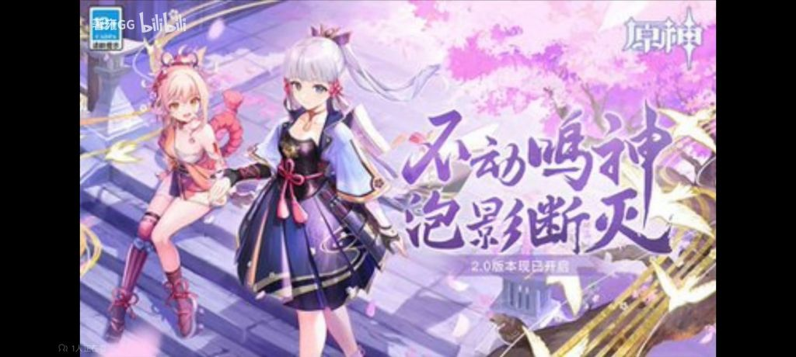
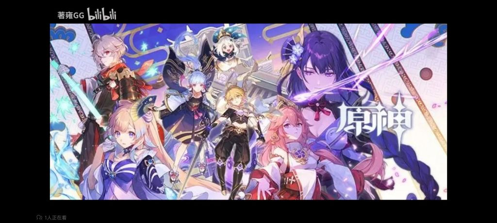

### [不吐不快]重新回头看2.0pv真的感慨万千

Made by ngapost2md (c) ludoux [GitHub Repo](https://github.com/ludoux/ngapost2md)

----

##### 0.[0] \<pid:0\> 2023-07-30 13:25:52 by 子守歌
不得不说，虽然稻妻主线后续太赶烂完了，但2.0pv真的是巅峰之作
叙事的同时不剧透，各有特色的<b>女角色</b>一个接一个出现，音乐恰到好处带点惊艳，节奏简直是完美，甚至单听BGM脑子里都有画面
须弥也不知道什么时候开始连看pv的兴趣都没了，节奏点也基本记不住本来我就算退坑也会刷刷pv的
现在须弥版本快结束了，高人气女角色还是稻妻那一批，不知道米有何感想？~~这重要吗，只有你们女角色厨会觉得重要吧~~

----

##### 1.[1] \<pid:705820051\> 2023-07-30 13:27:53 by 不织围脖
至今还记得3.5pv那个从迪希雅普攻硬切到米卡，从“生命啊，为何在跪拜呢”的须弥渡劫硬切到蒙德风花节的逆天转场

----

##### 2.[1] \<pid:705820186\> 2023-07-30 13:28:44 by 希望不要再非了
我要滑坡了，因为那是稻妻捏

----

##### 3.[0] \<pid:705820305\> 2023-07-30 13:29:26 by 子守歌
>[jump](#pid705820186) 希望不要再非了(2023-07-30 13:28) 说: 
>
>我要滑坡了，因为那是稻妻捏

那把稻妻主线写成那样岂不是孝顺孝成了逆子

----

##### 4.[0] \<pid:705820321\> 2023-07-30 13:29:33 by muziqiduan
只要枫丹发起进攻，一切都会好起来的。
只要纳塔发起进攻，一切都会好起来的。
只要至冬发起进攻，一切都会好起来的。
只要坎瑞亚发起进攻，一起都会好起来的。
致旅行者，我们做出了一个艰难的决定。

----

##### 5.[0] \<pid:705820906\> 2023-07-30 13:33:52 by 希望不要再非了
>[jump](#pid705820305) 子守歌(2023-07-30 13:29) 说: 
>
>那把稻妻主线写成那样岂不是孝顺孝成了逆子

纯诈骗PV

----

##### 6.[0] \<pid:705821322\> 2023-07-30 13:36:36 by 无月之想

顺便一提，当时的版本封面长这样  
下一个版本韶光抚月，天下人间封面长这样

----

##### 7.[0] \<pid:705822042\> 2023-07-30 13:41:33 by 小粥舟周
稻妻pv刚出来的那几天我每天都要刷个好几遍。现在只能说物非人也非了

----

##### 8.[0] \<pid:705822550\> 2023-07-30 13:45:04 by TooruW
>[jump](#pid705821322) 无月之想(2023-07-30 13:36) 说: 
>
>
>顺便一提，当时的版本封面长这样  
>下一个版本韶光抚月，天下人间封面长这样
>

这几张图质量好的吓人

----

##### 10.[1] \<pid:705823552\> 2023-07-30 13:51:45 by bug失去联系
我还记得2.0前瞻直播那天，泥潭一堆老哥激动得嗷嗷叫，买好瓜子零食专门侯着，现在那些老哥不知道是不是还玩原神

----

##### 11.[0] \<pid:705824122\> 2023-07-30 13:55:33 by 色雨声花
>[jump](#pid705821322) 无月之想(2023-07-30 13:36) 说: 
>
>
>顺便一提，当时的版本封面长这样  
>下一个版本韶光抚月，天下人间封面长这样
>

第一张图一脚把我踹进坑

----

##### 12.[0] \<pid:705824881\> 2023-07-30 14:00:46 by zzzzzzccc
地图展示，角色介绍，剧情透露，台词从托马引入，八重接上，心海出场雷神拔刀一波接一波高潮，主打一个风格融合节奏到位，结果诈骗了(bushi
我最喜欢的版本内容其实是2.4，但因为内容并不统一，pv效果在我心里没能超越2.0的

----

##### 13.[0] \<pid:705830417\> 2023-07-30 14:39:28 by 壬方杨卯赵阮
>[jump](#pid705822550) TooruW(2023-07-30 13:45) 说: 
>
>这几张图质量好的吓人

韶光抚月，天下人间这个图可是fgo中原画的，质量当然暴高

是不是说了什么不得了的话题

----

##### 14.[0] \<pid:705832979\> 2023-07-30 14:57:16 by xyx6464
我当年非常喜欢宵宫在pv里登场的那一幕，留下了很深刻的印象
&quot;我，宵宫，多多关照！&quot;   

----

##### 15.[0] \<pid:705833700\> 2023-07-30 15:02:29 by 迷你靓仔
2.0pv 甘雨角色演示 我之前都反复看过好多遍
运镜踩点配乐都超好评
3.0以后的pv肉眼可见的烂成一坨，让人点开的欲望都没有了

----

##### 16.[0] \<pid:705837384\> 2023-07-30 15:28:47 by kunizu
转场还得学

----

##### 17.[0] \<pid:705838419\> 2023-07-30 15:36:20 by 碎银酿普洱
>[jump](#pid705821322) 无月之想(2023-07-30 13:36) 说: 
>
>
>顺便一提，当时的版本封面长这样  
>下一个版本韶光抚月，天下人间封面长这样
>

韶光抚月，天下人间

这个标题从我开始玩就记到了现在，意境太美了。
(然后编剧嫌眼狩令只影响了精英阶级又加了一个影响老百姓的锁国令来让稻妻更乱象重生，编剧真的太爱了)

----

##### 19.[0] \<pid:705839456\> 2023-07-30 15:43:52 by 等把美又强的剑
认真的说当时的剧情也配不上这些宣传，只不过当时还可以说才刚起步之后会好的，谁知道只会越来越烂。

----

##### 20.[0] \<pid:705840431\> 2023-07-30 15:50:23 by 独揽濡沫
稻妻pv最重要的是有压迫感和使命感，最后莫名其妙就洗白一起逛街了可以说是国家线剧情崩坏的前奏，虽说打了补丁，但是是真的烂出天际。逻辑和美末2是差不多的。后面就逐渐破窗效应，越来越烂，烂出史诗级水平

----

##### 21.[0] \<pid:705842014\> 2023-07-30 16:00:20 by 640orochi
>[jump](#pid705830417) 壬方杨卯赵阮(2023-07-30 14:39) 说: 
>
>韶光抚月，天下人间这个图可是fgo中原画的，质量当然暴高
>
>是不是说了什么不得了的话题

你这么一说，我就去找凸点去了，好像还真有？

