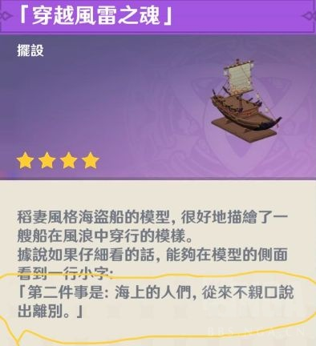

### [不吐不快]3.8快结束了，老实说你们真的觉得比2.8好吗？

Made by ngapost2md (c) ludoux [GitHub Repo](https://github.com/ludoux/ngapost2md)

----

##### 0.[1] \<pid:0\> 2023-07-30 15:41:16 by 拱墅银枪小霸王孙一峰
说实话不管剧情还是演出，拿头跟2.8比啊原神确实越来越无聊

----

##### 1.[0] \<pid:705839394\> 2023-07-30 15:43:28 by yaemikochan
小水珠可爱加分  其他各方面不如2.8
不过2.8的万叶地图太坐牢玩的也不爽

----

##### 2.[0] \<pid:705840270\> 2023-07-30 15:49:22 by luckyhawk
这3.8几乎是按着我对2.8的反馈完美修改的结果，我当然觉得好了。

别的不说，就飞车在大动作之前拉的远景，就比晕3D的2.8人性太多了。

剧情？2.8那些少年不知愁滋味，与赋新词强作愁的中二少年青春期无病呻吟，真的好吗？

----

##### 3.[0] \<pid:705840528\> 2023-07-30 15:50:59 by 互联网不是法外之地
2.8这个时候社区对须弥的讨论非常活跃吧官方也放了短片，而现在社区一潭死水，这让我完全联想不到还有16天就是枫丹了

----

##### 4.[0] \<pid:705840564\> 2023-07-30 15:51:13 by 纸游W
倒也不必  
2.8明显更答辩

----

##### 5.[0] \<pid:705840888\> 2023-07-30 15:53:17 by 云恭
两个都一般，实话我觉得除了情怀和厨子喜欢，海岛版本除了第一个1.6版有点新奇感以外，个人反正没听别人告诉我他进原神是听闻任何一个海岛版本太有趣了，二次元能过童话故事太难得了，特别来玩的

----

##### 6.[0] \<pid:705841103\> 2023-07-30 15:54:34 by shi态
2.8也要分开看，万叶秘境就是真有点恶心(生理上)了，评价最高的还得是莫娜+谢皇堡
3.8这个就觉得有点重复了，全图都是雨林环境。过山车倒是挺有意思
至于玩法解密，那就基本都一样宝宝巴士了

----

##### 7.[0] \<pid:705841664\> 2023-07-30 15:58:05 by 再也不随意注销了
从我个人的审美来看，海岛天然就是加分项，森林这种只能说比沙漠舒服，但和海岛比那肯定是不行
~~不然为什么海景房那都那么热门，人类就是喜欢看海啊小子~~

----

##### 8.[0] \<pid:705842004\> 2023-07-30 16:00:14 by Z10y8h23
3.8在探索方面我个人是满意的，解密不算复杂，有专门的道具查缺补漏。限时地图就应该轻量化，不动脑子也能快速拿满奖励。
但地图设计和剧情完全不如2.8。2.8不同岛屿间风格迥异，3.8地图设计风格还是须弥那一套，已经审美疲劳了。还有典中典的活动剧情写NPC，好歹2.8还是围绕四个自机展开，3.8自机就是来捧哏的，完全没什么看头。

----

##### 9.[0] \<pid:705842066\> 2023-07-30 16:00:39 by setsuna2023
我觉得3.8有一种对着2.8赌气的感觉
2.8的缺点是改了，优点亮点也没了，正因其徒劳的支线不吊打文案黑泥刻薄的攻讦一百倍？谢皇堡夜鸦小剧场写作用心还有配音不吊打那个无聊至极的摇星星看npc演三岁儿童剧？莫娜岛踩着星空爬到天顶也比龟速摩天轮有意思
对着玩家赌气怎么可能做好游戏内容呢

----

##### 11.[0] \<pid:705842567\> 2023-07-30 16:03:42 by MC6666698
3.8就是须弥景观毫无特色看腻歪了都
2.8蟹皇堡跟星空岛都美极了，也就万叶复读没啥意思

----

##### 12.[1] \<pid:705842582\> 2023-07-30 16:03:45 by xzhlm
今年的夏活我都没法评价无不无聊了，因为根本就没碰过一下那个活动

----

##### 13.[0] \<pid:705842693\> 2023-07-30 16:04:30 by LiviaOsria
2.8星空太漂亮了，我还记得那个追星星，虽然很累但是追星星真好看

----

##### 14.[0] \<pid:705842930\> 2023-07-30 16:06:00 by 羲一望
3.8的剧情太过于敷衍了，跟流水账似的。
玩法的多样性也不如2.8
内容量也少的可怜，就不怕没东西玩，玩家润去玩别的游戏吗？

----

##### 15.[0] \<pid:705843010\> 2023-07-30 16:06:30 by bluebayouplus
今年退坑了不知道，但去年万叶秘境成功让我生理上吐出来了反正在我这去年不行

----

##### 17.[0] \<pid:705843218\> 2023-07-30 16:07:49 by FrozenFrigidFrantic
我才意识到3.8地图应该还没关，但我已经忘了3.8玩了啥了

----

##### 18.[1] \<pid:705843445\> 2023-07-30 16:09:22 by 雷军单推人
2.8我喜欢蟹黄堡和莫娜秘境
万叶秘境真的眩晕
辛炎那个岛的设计师真的是天才
就不提要切来切去了
我当时在那个岛上看到漂浮灵和流血狗时 我真的震惊了
这tm是海岛诶 这tm是度假诶 你居然在这里放漂浮灵和流血狗？？

----

##### 19.[1] \<pid:705843522\> 2023-07-30 16:09:55 by 凌晨十八分
单论版本内容对比，我整体体验3.8优于2.8。2.8四个秘境我喜欢的只有小艾咪秘境，其他个人体验都不怎么样，内容也多到不想打开。3.8整体围绕游乐园不同区域设计，有智能罗盘，宝箱也少，可以说很不错了。剧情上只能说半斤八两。
但是如果对比场外……我还是喜欢2.8的欣欣向荣。现在还有16天开枫丹，米就像那种考试成绩拉了胯磨蹭着不想给家长签字的小孩你丫现在知道心虚了？3.6不是还很自信吗？

----

##### 20.[0] \<pid:705843553\> 2023-07-30 16:10:13 by KOUBAKU
唯二優點是那個道具還有機關沒有2.8那樣一堆BUG，其他全輸2.8。

----

##### 21.[0] \<pid:705843709\> 2023-07-30 16:11:18 by 残血之殇
2.8除了复读的部分剧情还行 探索好看但是还是算了吧

----

##### 22.[0] \<pid:705844015\> 2023-07-30 16:13:09 by Madtiger123
去年的剧情沉浸感很足，今年的就记得两个蓝色npc吵架，我甚至不知道优菈是来干什么的

----

##### 23.[0] \<pid:705844574\> 2023-07-30 16:16:44 by 渐行渐远ii
2.8美术确实强，但是让我去探索和解密的话体验太差，非要选的话我选3.8，没有特别惊艳的美术和设计但是简单的小山小路开宝箱玩的很舒服

----

##### 24.[0] \<pid:705844857\> 2023-07-30 16:18:35 by 鬼脸天晴
场景美术和玩法丰富程度不如2.8是事实，2.8无论莫娜秘境还是谢皇堡都是原神美术史里可以大书特书的优秀案例。但是3.8在游玩的体验和轻松程度上确实爆杀2.8那一大坨乱七八糟的解密和各种犄角旮旯里的普通宝箱

----

##### 25.[0] \<pid:705844995\> 2023-07-30 16:19:26 by 用户名未命名用户
喜欢3.8这种轻量化的

----

##### 26.[0] \<pid:705845078\> 2023-07-30 16:19:55 by hx0539
别够吧整那海岛了，有那闲工夫给其他国家dlc端上来

----

##### 27.[0] \<pid:705845897\> 2023-07-30 16:24:42 by 鹭闲
我个人而言，都不如1.6，那时候第二天放全图真的惊喜，芭芭拉和琴虽然不是泳装但好歹清凉不少，可莉妈妈说可莉是夏天与风送给她的孩子，那段话真的让我挺感动的~~谁知道后来魔女会是这样的啊~~没有黑深残的剧情，重点确实放在了度假上，开着船从迷雾冲出来也挺好玩的，有个岛上有个爱心光影当初还拉着闺中密友打卡去了。有时候想着，那个夏天确实回不去了

----

##### 28.[0] \<pid:705846220\> 2023-07-30 16:26:51 by Laughingkum
一个可能大多数人都忘掉的设定，瓶子内是可以实现愿望的，那么进去的这波角色有哪位实现(虚假的)愿望了吗

可莉除外，人家真是来玩的

别告诉我角色扮演就是愿望

----

##### 29.[0] \<pid:705847231\> 2023-07-30 16:32:23 by 赵十七
2.8确实印象深刻，现在回想起来脑海里还有bgm响起。而最近的3.8我只记得被转晕的小心海和“假编剧”的阴阳怪气了

----

##### 30.[0] \<pid:705851339\> 2023-07-30 16:55:30 by ganglion
万叶辛焱的岛确实不太行，但莫娜和皇女的很优秀，不论是美术设计还是解谜方面。

----

##### 31.[0] \<pid:705852140\> 2023-07-30 16:59:55 by 请叫我RMB
>[jump](#pid705840528) 互联网不是法外之地(2023-07-30 15:50) 说: 
>
>2.8这个时候社区对须弥的讨论非常活跃吧官方也放了短片，而现在社区一潭死水，这让我完全联想不到还有16天就是枫丹了

很恐怖好吧，16天以后就4.0了，我完全没意识到这件事

----

##### 32.[0] \<pid:705852648\> 2023-07-30 17:02:26 by 海与风的礼物w
剧情比较无聊和2.8没得比，地图上倒还好
抛开编剧在npc对话夹带私货，这种平平淡淡的版本总比3.6这种逆天好

----

##### 33.[0] \<pid:705853450\> 2023-07-30 17:06:38 by LejourNora
吃瓜看看泥潭大哥们的评论

今年剧情开了点就没兴趣了, 不太喜欢带孩子.

去年除了万叶的线, 其他几人的图都玩得很开心, 还有正因其徒劳这种支线, 更别说还有大肉丸和大肉丸的穿越风雷之魂

我承认成年人的童话这个说法能被贴上各种各样不同的故事, 但可能我个人更吃2.8这种的吧. 
在最后莫娜岛, 自己寻完星星, 然后惊喜发现隐藏空气梯, 然后在太空中看着星星消散的那一刻, 虽然有种烟花燃尽, 怅然若失, 感到夏天悄然要过去了的遗憾, 但也会对原神后续的创作打起信心.

----

##### 34.[0] \<pid:705853463\> 2023-07-30 17:06:40 by 独过落影
3.8比起2.8，像是在纠正缺点的同时把优点也给纠正掉了
看看4.8原神能不能做到平衡吧(前提是米不整大活让我能支撑到4.8)

----

##### 35.[0] \<pid:705860095\> 2023-07-30 17:44:38 by 花瓣飘零
2.8的夜鸦我超级喜欢，真的很有新意，3.8水珠也来这套还不能说话，已经减少了很多文案让你出脑的机会了，原以为文案可以闭嘴了，但是文案借个喇叭附身npc也要给你吐黑泥，真的没有办法

----

##### 36.[0] \<pid:705862013\> 2023-07-30 17:54:23 by pspniw1w1xindingmy
飞车每次到悬崖都会给我一种寸止的感觉，nmd冲了吗，如冲，速度慢的跟乌龟一样。

----

##### 37.[0] \<pid:705862710\> 2023-07-30 17:57:49 by 花散里爱洗铁路
别的不说，2.8的海岛什么蟹黄堡，夜鸦故事各种二创满天飞，3.8我一个都没见到。

----

##### 38.[0] \<pid:705863212\> 2023-07-30 18:00:19 by 右席酱
2.8总的还是挺快乐的，可以说承上启下的版本，至于3.8？不好意思，我已经2周没有上游戏了，AFK爽的一批

----

##### 39.[0] \<pid:705863216\> 2023-07-30 18:00:20 by 零点，陈彬
2.8设计的很好，但是视角优化不行，这一点差评，今年，三日的小剧本不错，但是没有配音，小水滴和吉祥物很可爱，但是整体不算很有趣

----

##### 40.[0] \<pid:705863300\> 2023-07-30 18:00:47 by 到头来一天
可莉的剧情只要一出现就特别低幼无聊，从12+直接变成6+。

----

##### 41.[0] \<pid:705863914\> 2023-07-30 18:04:07 by layman_unsc
2.8缺点不少，但是真的是瑕不掩瑜。但是也理解很多人不喜欢这个2.8，毕竟限时地图，但游玩强度上要比所有的版本活动都高。

但是吧，我还是坚持，我做不做得完是我的事，你提不提供是你的事。做不完那是我的问题，你不提供那就是你的问题了。

----

##### 42.[0] \<pid:705864732\> 2023-07-30 18:08:20 by 玩c罗玩的
有点降智
可莉降智就算了 你心海凯亚也跟着降智是吧

----

##### 43.[0] \<pid:705864833\> 2023-07-30 18:08:52 by yudingxuan
>[jump](#pid705845897) 鹭闲(2023-07-30 16:24) 说: 
>我个人而言，都不如1.6，那时候第二天放全图真的惊喜，芭芭拉和琴虽然不是泳装但好歹清凉不少，可莉妈妈说可莉是夏天与风送给她的孩子，那段话真的让我挺感动的......

没被剧透玩到1.6那一段的时候真的惊了...

----

##### 44.[0] \<pid:705865884\> 2023-07-30 18:14:35 by 御坂2180号
2.8虽然又累又烦，但是还是挺想去找宝箱的3.8或许比2.8体验要好，但是我自己是没有那个热情了

----

##### 45.[0] \<pid:705867317\> 2023-07-30 18:23:26 by 柑橘橙橙橙橙橙子
2.8探索体验不好，限时地图还引导差宝箱多奖励少，加上晕3D debuff但是莫娜岛的演出和蟹黄堡整体氛围都太棒了，我永远无法忘记那漫天繁星和绮丽的粉色晚霞，古堡，鸟笼，和可爱的夜鸦们，当真是如梦似幻的夏天

----

##### 46.[0] \<pid:705867576\> 2023-07-30 18:24:51 by 九尾卫星回收站
2.8至少给4个自机搞专属秘境，真的秒了
谁几把想看3.8几个似人npc过家家，纯啥b

----

##### 47.[0] \<pid:705867599\> 2023-07-30 18:24:59 by 老虎二世
2.8玩的挺开心的，蟹黄堡观光飞行玩的不亦乐乎

3.8过山车没开完就润了

----

##### 48.[0] \<pid:705868100\> 2023-07-30 18:28:12 by P-erttior
3.8除了轻量化以外，其他的对比2.8就是一坨这次玩下来我完全没感觉到2.8那种轻松愉快的氛围和心情。
2.8剧情围绕自机展开，3.8写的大部分都是npc
支线任务正因其徒劳和大肉丸开船也是薄纱3.8的编剧吐黑泥
地图设计 沙漠和雨林都看吐了，须弥里都品鉴的够多了，做的再好也审美疲劳了，更别说你看看做的是啥。
2.8的四个海岛秘境各有特色，虽然万叶秘境各种旋转看的人晕~~和不停的复读放下~~，蟹黄堡判定有bug，但是依然不妨碍一眼看过去能让人有耳目一新眼前一亮的感觉，设计的要比3.8高出不知道几个档次。
那个过山车设计的也是一坨，加速也没有，就搁那硬蹭，过山车开的慢我还以为是想让你欣赏风景，结果你视角锁的那么小，对比蟹黄堡最后塔顶有个飞天的挑战，可以在飞行过程中环绕蟹黄堡一圈好好看风景，高下立判。还有地图里散落的各种跳水母也可以让人进一步探索地图角落，这些哪个不比3.8有意思
2.8作为收尾的莫娜岛，最后的追星星雨过天晴仰望星空，是实打实的给我带来了震撼和感动的。看看3.8是个啥，修个轮縠~~毂~~就没了，这设计连给2.8提鞋都不配

----

##### 49.[0] \<pid:705878752\> 2023-07-30 19:24:09 by 邬宏畅
2.8内容优点和缺点都很明显，且优点大于缺点。
3.8只能说是无功无过，在本来就一路颓势的3.x版本加持下显得不够看了。

----

##### 50.[0] \<pid:705879227\> 2023-07-30 19:26:58 by 超音速凉面
3.8就是一坨，每个阶段一个小时不到就探完了，还要看他那b套皮剧情，我还宁愿大世界多逛逛找找~~呀哈哈~~小水珠呢，拿点萝卜也比看牛魔酬宾文案yygq好，啥b

----

##### 51.[0] \<pid:705879601\> 2023-07-30 19:28:56 by 羲一望
对比下3.8和2.8流水。
流水高峰跟氪佬有关，先不看。流水低谷基本是月卡党支撑，可以看出付费用户数量。
3.8的流水低谷是一路向下的，证明玩家在流失。
2.8的流水低谷则是略微向上的。

所以还是2.8海岛更能留存玩家。
喜欢这种宝宝巴士版本，终究是少数。

----

##### 52.[0] \<pid:705879657\> 2023-07-30 19:29:13 by 超音速凉面
>[jump](#pid705868100) P-erttior(2023-07-30 18:28)说:
>3.8除了轻量化以外，其他的对比2.8就是一坨[s:ac:反对]这次玩下来我完全没感觉到2.8那种轻松愉快的氛围和心情。 2.8剧情围绕自机展开，3.8写的大部分都是npc 支线任务正因其徒劳和大肉丸开船也是薄纱3.8的编剧吐黑泥 地图设计 沙漠和雨林都看吐了，须弥里都品鉴的够多了，做的再好也审美疲劳了，更别说你看看做的是啥。 2.8的四个海岛秘境各有特色，虽然万叶秘境各种旋转看的人晕<del class='gray'> 和不停的复读放下 </del>，蟹黄堡判定有bug，但是依然不妨碍一眼看过去能让人有耳目一新眼前一亮的感觉，设计的要比3.8高出不知道几个档次。 那个过山车设计的也是一坨，加速也没有，就搁那硬蹭，过山车开的慢我还以为是想让你欣赏风景，结果你视角锁的那么小，对比蟹黄堡最后塔顶有个飞天的挑战，可以在飞行过程中环绕蟹黄堡一圈好好看风景，高下立判。还有地图里散落的各种跳水母也可以让人进一步探索地图角落，这些哪个不比3.8有意思[s:ac:反对] 2.8作为收尾的莫娜岛，最后的追星星雨过天晴仰望星空，是实打实的给我带来了震撼和感动的。看看3.8是个啥，修个轮縠<del class='gray'> 毂 </del>就没了[s:a2:你看看你]，这设计连给2.8提鞋都不配

过山车最刺激的大回环还给锁2d视角，真的生怕你感觉爽了就不给你看

----

##### 53.[0] \<pid:705881363\> 2023-07-30 19:37:40 by 描绘着抛物线
至少2.8我还没出脑，愿意坐在观众席上看完剧团表演，当时还有个温迪进我世界弹了段琴体验超棒。莫娜岛繁琐到第一次跟攻略但飞天cg的观感爆杀托马斯小火车。

----

##### 54.[0] \<pid:705888533\> 2023-07-30 20:10:51 by 斐林试剂水浴加热
虽然2.8的主要剧情挺烂，但我是真的很喜欢那些夜鸦们，甚至在听说有流星雨之后特意拿我推跑图把那一段录下来了(虽然电脑重装忘记备份没了)，3.8呃呃，一个是讨厌看吵架，二一个是到底是谁陪谁玩谁是玩家啊，除了爆的典没有任何印象深刻的地方这是可以说的吗

----

##### 55.[0] \<pid:705890540\> 2023-07-30 20:21:39 by yenfsjs
觉得心海优菈真是倒霉，碰上须弥版本在这当可有可无的捧哏。确实就是堵嘴，平时不都说女路人待遇差吗，现在给你剧情了啊
去年就算是万叶复读，探索效果不好，也是认真的给他做了专属且独特的岛屿秘境pv，完整的复读一遍。今年这是个啥，把自机删了当成npc大世界任务有啥区别吗，刚好大世界也能用寻宝罗盘，雨林沙漠也和须弥一样，没任何新鲜感，小水珠过山车也只能说效果普普通通

----

##### 56.[0] \<pid:705892837\> 2023-07-30 20:34:18 by 不断寻觅着
我倒是觉得2.8是原神的巅峰了，至少是在以游戏为前提在设计，前3国是一路走向成熟的过程。
反正到了须弥，味道完全就变了。

----

##### 57.[0] \<pid:705894266\> 2023-07-30 20:42:48 by 羽衣草
2.8虽然典王开盒问题很大，但上帝视角来看挺有趣的，至少讲的是我抽到的角色的故事，3.8须弥味太重，又是主角和自机角色当摄像头看npc表演

----

##### 58.[0] \<pid:705896519\> 2023-07-30 20:55:46 by 子夜歌QAQ
我对2.8的想法是万叶秘境解密别转来转去了，换个别的，皇女秘境判定准一点，明明对上了就是放不进去太sb了，再就是加个这次的显示宝箱的道具就行了，其他的都很好
但是优化出来的东西嘛……这次的世界任务被2.8吊打

