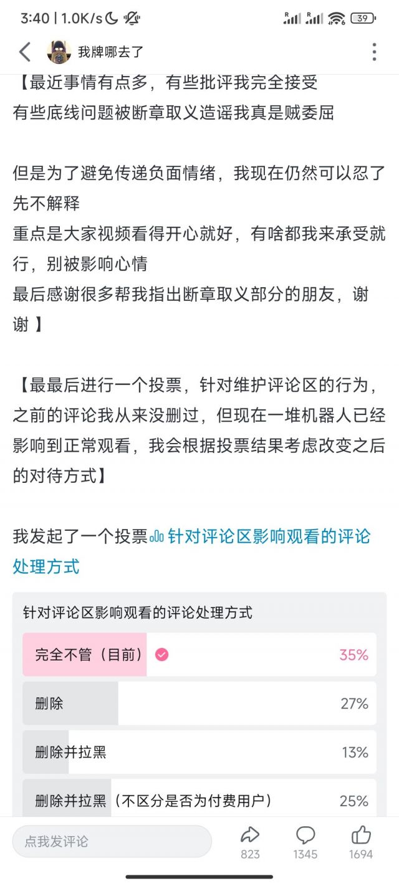

### [不吐不快][不吐不快]某榨菜up的投票有点可怕

Made by ngapost2md (c) ludoux [GitHub Repo](https://github.com/ludoux/ngapost2md)

----

##### 0.[1] \<pid:0\> 2023-07-30 15:47:47 by 半步逍遥

倒是没想到这么多人投 删除拉黑且不管是否是付费用户……颠覆认知，如果真的投票成功将是一言堂的评论区。而且在我理解下，付费用户是非常重要的，直接拉黑真的也太不好了吧
所以什么时候能把3.3端上来看看

----

##### 1.[0] \<pid:705840776\> 2023-07-30 15:52:37 by 肯定不是真的
一般这种选最后一个的，都是不付费的人吧

----

##### 2.[0] \<pid:705841591\> 2023-07-30 15:57:40 by 玩c罗玩的
如果我是喜欢主播的付费用户我选3
不过我现在就是单纯看乐子 所以必然选1

----

##### 3.[0] \<pid:705841794\> 2023-07-30 15:58:57 by Inquisit
区分付费用户的话不就和我以前在虎牙找乐子一样上牌骂人

----

##### 4.[0] \<pid:705842030\> 2023-07-30 16:00:26 by 113322qwe1
我作为看热闹的，肯定选最后一个啊

----

##### 5.[0] \<pid:705842145\> 2023-07-30 16:01:05 by 墨筱澜鄢
有这些功夫不如把视频端上来

----

##### 6.[0] \<pid:705844267\> 2023-07-30 16:14:39 by 夕音子
肯定有拱火的啊

----

##### 7.[0] \<pid:705844461\> 2023-07-30 16:15:56 by bluecross3729
这就有点像直播间花钱恶心人的sc，是不是该删除的问题

----

##### 8.[0] \<pid:705844605\> 2023-07-30 16:16:57 by 吾是D君
不管怎么样，他的乐子我必须捧场

----

##### 9.[2] \<pid:705846526\> 2023-07-30 16:28:25 by Tony特别帅
最后一个选项说白了不应该拿到明面上沟通，而且还是以投票的名义推脱责任。他想拉黑就拉黑呗，是有些奇葩付费粉丝，也不是人人都有高情商能应对。但投票就绷不住了，颇有现在米社区即视感，0氪嫌氪佬黑泥多，然后官方师出有名正义下场。

所以看来不管什么消费，能0氪尽量0氪，对双方都好。相当多时候氪金场景的商业伦理并不完整，享受不到预期中的完整服务，收钱方也没意识完整的付费体验会囊括什么，只是觉得收了这么多钱的自己牛逼。

----

##### 10.[0] \<pid:705846723\> 2023-07-30 16:29:33 by 冰冻之零
我是看乐子的 所以选了1

----

##### 11.[0] \<pid:705848903\> 2023-07-30 16:42:06 by 半步逍遥
>[jump](#pid705846723) 冰冻之零(2023-07-30 16:29) 说: 
>
>我是看乐子的 所以选了1

选1的应该都是看乐子的吧

----

##### 12.[0] \<pid:705855471\> 2023-07-30 17:17:32 by 冰冻之零
>[jump](#pid705848903) 半步逍遥(2023-07-30 16:42)说:
>[quote][pid=705846723,37194255,1]Reply[/pid] <b>Post by [uid=62407466]冰冻之零[/uid] (2023-07-30 16:29):</b>  我是看乐子的 所以选了1[/quote]选1的应该都是看乐子的吧[s:ac:上]

不至于 这个up的看乐子率肯定没有这么高

----

##### 13.[0] \<pid:705856441\> 2023-07-30 17:23:11 by 塑料xxx
这个投票设置不合理吧，看起来是希望不管的多，但实际上希望不管的35%，希望删除的都65%了

----

##### 14.[1] \<pid:705860430\> 2023-07-30 17:46:43 by Bauhaus的大豪斯
>[jump](#pid705846526) Tony特别帅(2023-07-30 16:28)说:
>[s:ac:哭笑]最后一个选项说白了不应该拿到明面上沟通，而且还是以投票的名义推脱责任。他想拉黑就拉黑呗，是有些奇葩付费粉丝，也不是人人都有高情商能应对。但投票就绷不住了，颇有现在米社区即视感，0氪嫌氪佬黑泥多，然后官方师出有名正义下场。  所以看来不管什么消费，能0氪尽量0氪，对双方都好。相当多时候氪金场景的商业伦理并不完整，享受不到预期中的完整服务，收钱方也没意识完整的付费体验会囊括什么，只是觉得收了这么多钱的自己牛逼。

删这些付费人得“师出有名”，不然对他来说，负面影响可不要太大。付费用户应该清醒一些，这个选项被拿出来说明up已经对他们动了心思，现在不过是在找一个借口罢了

----

##### 15.[0] \<pid:705863981\> 2023-07-30 18:04:29 by 花散里爱洗铁路
无聊，我要看到血流成河

----

##### 16.[1] \<pid:705884756\> 2023-07-30 19:52:24 by 安比Anby
我不关心投不投票写不写动态小作文，我就想知道3.3实况在哪

----

##### 17.[0] \<pid:705891156\> 2023-07-30 20:24:49 by 不织围脖
难道不应该是“完全不管”和“删除”两个选项吗，“删除”之内再区分“不拉黑”“拉黑”“拉黑(包括付费用户)”，他这样稀释票数了

