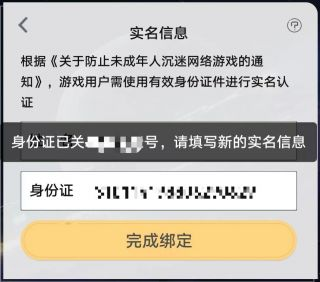
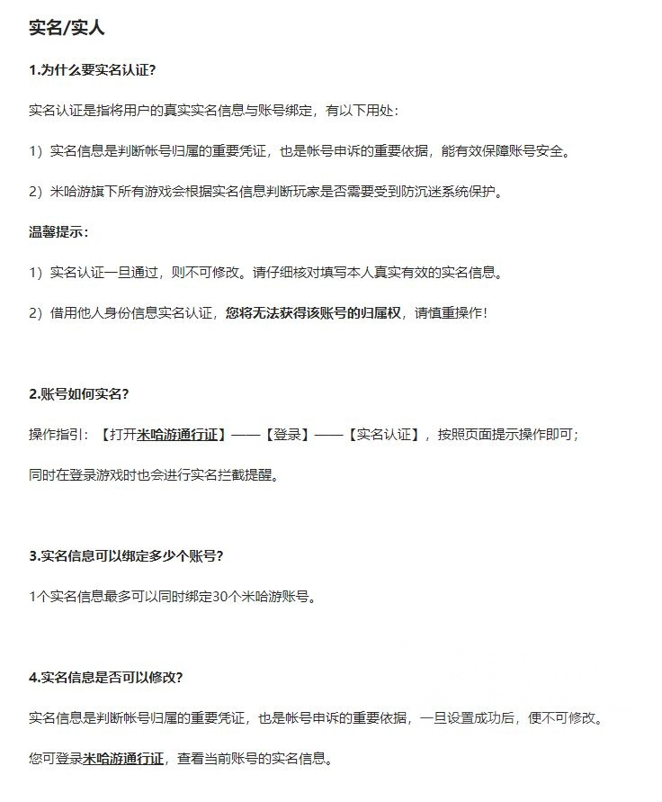

### [不吐不快] 自己的实名信息被他人盗用，导致自己无法实名认证自己账号，如何维权？

Made by ngapost2md (c) ludoux [GitHub Repo](https://github.com/ludoux/ngapost2md)

----

##### 0.[0] \<pid:0\> 2023-07-30 20:18:28 by 夢の繯影
事情是这样的，朋友想注册米哈游通行证
用手机号注册后要求实名认证
输入实名信息后被告知已经关联其他账号

打客服电话，被客服告知该问题目前无法解决，主要意思有以下几点：
1.一个身份证号可以关联不止一个账号(确实我自己绑定了两个)
2.一个身份证号可以关联的账号数量可能存在上限，但他们不知道上限是多少个
3.该问题是否因为该身份证号所关联的账号数量达到上限，他们也不知道
4.目前实名认证后无法更改，也无法通过身份证号倒查被认证的账号并重新认证，因此该问题目前无解
5.请玩家自己保护好个人信息，免遭泄露
也就是现在我朋友除非自己也用别人的身份信息进行实名认证，否则就等于被剥夺了拥有自己账号的权利

除去这一点，我和我朋友也有几个问题
1.米哈游的实名只需要姓名和身份证号就可以认证，不需要人脸或者上传身份证照片，在实名操作不可逆的情况下，这是不是太随便了？
2.由于我自己认证第二个账号时(我有两个手机号)，并没有提示我身份证已经关联其他账号，是不是说明我朋友的身份证号已经被用于很多个账号实名认证
3.由2可见，盗用我朋友的实名认证行为有大概率是工作室所为，例如刷初始号进行出售，需要大量实名认证
4.目前个人信息被泄露贩卖的现象十分普遍，根本不是个人注意保护信息就能避免的，但凡有网上购物，注册账号等行为，就有概率被泄露身份信息
5.米哈游是否应该对此提供解决方法，否则是否构成侵权行为或者对侵权行为的纵容和不作为

我朋友已经致电12345对该问题进行投诉，12345表示会把该问题转接到新闻出版局，由他们联系游戏公司给予答复。
这里也想问问懂法律的朋友，像这种实名信息被盗用导致自己无法注册账号，自己的权益收到的侵犯，而游戏公司又不作为的情况，能否上诉游戏公司？
实名认证门槛低，且不可逆，玩家也无法通过实名认证找回账号，变相纵容了初始号，是否也涉嫌变相纵容未成年人逃避防沉迷(未成年只要购买通过认证的初始号就可以进行游戏)

----

##### 1.[0] \<pid:705892610\> 2023-07-30 20:33:03 by ninesky1985
可以上诉，我记得别家是可以通过本人认证强制注销其它绑定账号的，不知道为什么米哈游不行。

----

##### 2.[0] \<pid:705895823\> 2023-07-30 20:51:48 by 夢の繯影
>[jump](#pid705892610) ninesky1985(2023-07-30 20:33)说:
>可以上诉，我记得别家是可以通过本人认证强制注销其它绑定账号的，不知道为什么米哈游不行。

我也很奇怪，这根本就不是一个技术问题
我很怀疑是不是因为像类似初始号的存在可以给米哈游带来潜在的收益
所以他不给强制认证收回

----

##### 3.[0] \<pid:705896042\> 2023-07-30 20:52:57 by 夢の繯影
>[jump](#pid705892610) ninesky1985(2023-07-30 20:33)说:
>可以上诉，我记得别家是可以通过本人认证强制注销其它绑定账号的，不知道为什么米哈游不行。

我可以提供所有人的本人信息，包括人脸，身份证原件照片等
但是他直接不给你渠道

----

##### 4.[0] \<pid:705900608\> 2023-07-30 21:19:11 by 剑筑师と書記官
2.一个身份证号可以关联的账号数量可能存在上限，但他们不知道上限是多少个

<b>我印象里是10个</b>

----

##### 5.[0] \<pid:705907550\> 2023-07-30 22:02:06 by luyas
一个身份证号可以绑定30个米哈游账号

----

##### 6.[0] \<pid:705908323\> 2023-07-30 22:07:05 by k384698637
毕竟是傲慢的米，能说出awwbwg我也没啥好说了

----

##### 7.[0] \<pid:705908520\> 2023-07-30 22:08:24 by ai助手
不能直接找回吗？
我记得有实名可以直接找回的

----

##### 8.[0] \<pid:705912143\> 2023-07-30 22:31:22 by 5151208
??那这就是你的号啊。
收了吧

----

##### 9.[0] \<pid:705912780\> 2023-07-30 22:35:39 by 夢の繯影
>[jump](#pid705907550) luyas(2023-07-30 22:02)说:
>一个身份证号可以绑定30个米哈游账号  [img]https://img.nga.178.com/attachments/mon_202307/30/l2Q2s-kd9yZcT3cSkg-or.jpg[/img]

借用他人身份信息实名认证，您将无法获得该账号的归属权

现在明明是被借用身份信息的人，无法拥有账号！

----

##### 10.[0] \<pid:705918922\> 2023-07-30 23:13:50 by 夢の繯影
>[jump](#pid705912143) 5151208(2023-07-30 22:31)说:
>??那这就是你的号啊。 收了吧[s:ac:哭笑]

不是，是我朋友根本不知道自己的实名关联了哪些账号
然后米哈游还不给倒查
就是我提供实名信息，他不能倒查关联的账号

