### [不吐不快] 现在这个环境下能不能公正讨论下“古战场”、“黑暗降临”、“百万XXX”这些个陈年破事了？

Made by ngapost2md (c) ludoux [GitHub Repo](https://github.com/ludoux/ngapost2md)

----

##### 0.[1] \<pid:0\> 2023-07-30 21:23:05 by 长野原新之助
尤其想听一听两者都玩过的各位的看法。

旷几个存档加起来400小时，玩原从0开始两个号60级，应该早就数倍于400小时了。玩旷的时候就经常桃能有一个经常定期更新DLC的代餐，英杰之诗结束后格外怅然若失。

所以个人而言，对原的包容性其实挺强的。毕竟一来也没什么精神洁癖，二来从小玩鹅厂游戏长大的，早已锻造出灵活的道德底线~~这下真成tx打压惹~~

就拿开服的蒙德篇来说，原力爬墙，风之翼和滑翔伞，上升气流和钻圈加速，基础怪丘丘人和波克布林、史莱姆和丘丘，怪物营地的构造(出镜率极高的炸药桶)，包括进阶点的深渊法师和长袍魔法师(带位移和操控元素力)、大机器人蹲坑或巡逻等等，至于力巴尔乌尔波扎技能这些就不多展开了。

稍微正常点的玩家应该都会觉得既视感很浓厚的吧？不过这个问题吧，只玩过其中之一的反倒喜欢提起来大书特书，利用嗓门大和先攻优势在舒适区虚空索敌，真的都玩并坚持下来的首先人数不算多，再者也懒得趟这趟浑水，毕竟那个环境下说了也是找不自在。

人家自有一套拳法利于不败之地：<b>你玩过原吗？没玩过我就往地上一趟，扣帽子复读猴猴猴猴猴，玩过我就换个帽子复读镍币人</b>，总之大win特win就完事了。

遇到争议一律以鉴抄员先手制敌，实在不占理再套那几段车轱辘话，比如：

1、任天堂都让原上NS了，最黑暗的一天云云。
然而三年多过去，依旧没有消息，最近有指出可能是自导自演的嫌疑，毕竟当时挂着NS图标的comingsoon预告片，任天堂官方从未出过，这个问题具体情况不太清楚，不站队。

2、热知识，米从未被告抄袭，然而任天堂被XXX告了，win！
实际上这话术也就偷换概念，唬唬不明真相的路人，占领舆论高地，<b>法律意义的抄袭跟我们平时观念里的抄袭是两码事</b>，郭敬明拍爵迹，FATE没告他，所以郭敬明不是抄袭，话说小四粉应该也没那么能说会道吧？再比如我们看在眼里的鹅厂，很多人都觉得他抄了一个又一个，然而回到法律准则，人家却是南山必胜客。再再比如，两个人打架，回家说受了点轻伤，就我们日常的认知里，这就不是个事，但法律意义认定的轻伤，就转化成刑事案件了，其中一人被弄成轻伤，另一人是需要被追刑责的。

所以，在一两年前版里的氛围来说，时不时刷到这些个跳脸的帖子，内心还是挺意味不明的，而且在某二次元子版块经常有着“这个up主有什么黑点吗？”“有啊，原开服时他嘴了原”这些个言论，而且说出来非常理所应当，哪怕有人反对也会立马被团建围歼，当时不知道怎么形容这种感觉，直到最近看到被某群体反嘲“百万哲平厨”，才大概心里明了。

----

##### 1.[0] \<pid:705902024\> 2023-07-30 21:28:02 by 叶落寒宵
公正讨论？很重要吗？也只有你们这些玩原神的在意罢了

----

##### 2.[0] \<pid:705902643\> 2023-07-30 21:31:47 by 最初的剑鱼二番队队长
19年第一次看到原神宣传片时的想法：抄得有点明显，换腾讯估计网上骂一骂就消停了，但这个公司盛产孝子有所耳闻，估计后面会变成“没有原神谁知道你们塞尔达”然后吵个不停

----

##### 3.[10] \<pid:705903168\> 2023-07-30 21:35:04 by 王系重生之翼
真要说的话，当初原是有点碰瓷营销的

----

##### 4.[1] \<pid:705903298\> 2023-07-30 21:35:53 by 老虎二世
既玩过塞尔达又玩过原的人肯定不少，不懂为什么舆论从一开始就非要让两个游戏的玩家这么对立
同期的塞尔达Like游戏也不止原一个，比如育碧的渡神纪，好像都没那么大风波

不过现在出脑后我也懒得去纠结这个问题了，一句awwbwg能解决一切问题，只能说塞尔达信者和米学长本质上就是同一类人

----

##### 5.[3] \<pid:705903364\> 2023-07-30 21:36:12 by 再也不随意注销了
须弥刚开时那个死域瘤也有一波节奏，后面莫名其妙没了，也没人讨论了  
去b站看了一下，只搜到一个视频，但评论区过于好笑了

----

##### 6.[2] \<pid:705903482\> 2023-07-30 21:36:53 by Inquisit
抄从来不妨碍我玩
mxz像天龙人一样到处出警煎炒而且出警水平还不如纯白之月的时候我才开始反感的

----

##### 7.[3] \<pid:705903495\> 2023-07-30 21:36:58 by 霞云
在知乎我见过不少说原超越塞尔达的(一般会从建模，画面和大世界来说)

----

##### 10.[3] \<pid:705903867\> 2023-07-30 21:39:11 by lng236
19年当初米可是自己承认“借鉴”了塞尔达等等的，可惜现在的结晶们估计都没看过这篇文章。“百万塞尔达”和“猴”算是被岁的最成功的例子了，最初这俩词都是骂结晶的，指当初突然蹦出来一堆“steam上百小时塞尔达玩家”洗地说米没抄袭
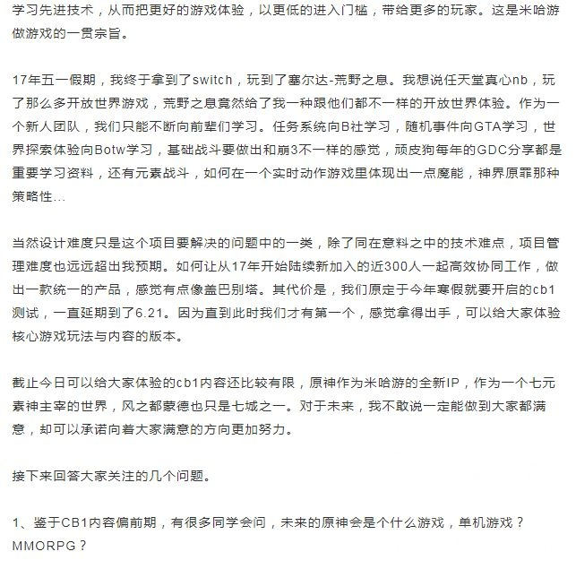
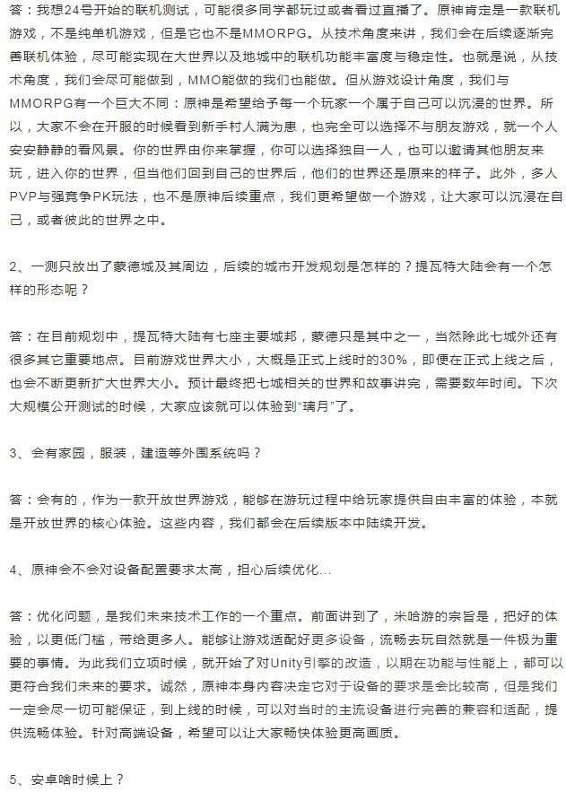
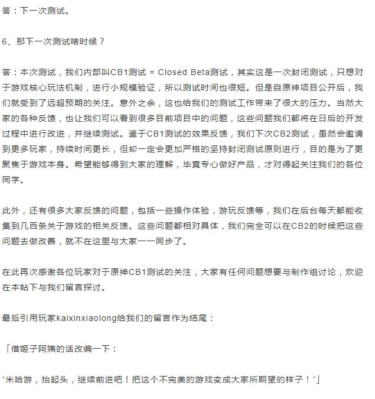

----

##### 11.[0] \<pid:705903903\> 2023-07-30 21:39:25 by 的呢抵抗
那个时间点，米最为人熟知的游戏是崩三，崩三最为人熟知的角色一个是初始的琪亚娜，一个是八重樱的勿忘皮，这时候你说米做了一个抄袭塞尔达的游戏，信的人肯定多啊

----

##### 12.[0] \<pid:705903954\> 2023-07-30 21:39:44 by 。一念七绝
我只觉得很轨迹 这话是能说的吗主线做到愚人众 我直接幻视噬身蛇 后面做到博士 啊是你白面桑
另一种庆幸 幸好还没有绿毛神父 不然做代餐后我可能就真的掉入深渊了

----

##### 13.[0] \<pid:705904147\> 2023-07-30 21:41:01 by 镀金牌咖啡
原这个程度够不上抄袭的。如果把原定义为抄袭那很多游戏的借鉴度都应该被判死刑了。

个人觉得不能因为原现在走入歧途就全盘否定，事情还是要分开看的

----

##### 14.[0] \<pid:705904195\> 2023-07-30 21:41:21 by kemax3
我只能说

原最早有在有“参照物”的情况下做出来的地图真的有些意思，和后来没有“参照物”做的地图在游玩体感上真的是差距明显。

----

##### 15.[0] \<pid:705904209\> 2023-07-30 21:41:28 by 零点，陈彬
塞和原没啥好比的。。。原是手游能一直缝，但塞是单机形式，不可能比的。。。
原至今也没能超越塞尔达的设计的有料理的组合和风弹时停之类的玩法。。。王泪就更不必比了，社区还在产出

----

##### 16.[0] \<pid:705904379\> 2023-07-30 21:42:35 by 零点，陈彬
>[jump](#pid705903954) 。一念七绝(2023-07-30 21:39) 说: 
>
>我只觉得很轨迹 这话是能说的吗主线做到愚人众 我直接幻视噬身蛇 后面做到博士 啊是你白面桑
>另一种庆幸 幸好还没有绿毛神父 不然做代餐后我可能就真的掉入深渊了

轨迹系列？那他要是做的好就不提了，争着和法老控一起摆烂啊？黎之轨迹2我绷不住了

----

##### 17.[3] \<pid:705904403\> 2023-07-30 21:42:44 by 老虎二世
>[jump](#pid705903954) 。一念七绝(2023-07-30 21:39) 说: 
>
>我只觉得很轨迹 这话是能说的吗主线做到愚人众 我直接幻视噬身蛇 后面做到博士 啊是你白面桑
>另一种庆幸 幸好还没有绿毛神父 不然做代餐后我可能就真的掉入深渊了

结果铁道真变轨迹了

----

##### 18.[10] \<pid:705904515\> 2023-07-30 21:43:22 by 卡普琪琪3
原开始那波被黑算是对不起他的质量，没啥可说的。

不过有一个问题，我当时不相信有什么公司会搞这种黑红营销，现在我开始质疑了。

----

##### 19.[1] \<pid:705904672\> 2023-07-30 21:44:15 by Aritaaa
我只能说开服骂原的人确实有，挺多的，但是你有一说一，现在哪个稍微火点的游戏开服不是一堆破事
不过米从中添油加醋的多少不好说，毕竟他从崩三就在宣扬tx打压，营销部的猛干哥可是也可以从崩三一路坐到崩铁路径依赖的
反正我记得当时有明确截到米买的贴吧的通稿说这个话题，因为文案太统一被发现了

----

##### 20.[3] \<pid:705904756\> 2023-07-30 21:44:50 by 露缇娜丝
你跟我们讨论，那是能讨论的
但你跟结晶讨论什么，结晶和你讲道理吗
？网上汴京永远不是看谁有理，而是看谁会抱团，会抱团逆风都能当顺风打

----

##### 21.[0] \<pid:705904777\> 2023-07-30 21:44:56 by 海崎新太9139
因为国内舆论对抄袭的界定还在一个缺乏共识的阶段吧。
这类问题出现在包括不限于绘画、音乐、玩法、动作设计等方面，每个人对学习到抄袭之间这个度的感知不同，对这个模糊地带的接受程度也不同。
另外当时荒野之息正值口碑大爆出圈，还有米哈游自带一些debuff恶评(比如认为崩三抄袭了某些动作游戏是当时很多二游玩家单机玩家的共识)，最后变成了舆论对还原神作的群嘲。

----

##### 22.[7] \<pid:705904793\> 2023-07-30 21:45:02 by setsuna2023
我只能说洗脑纯化结晶很成功，甚至到了3.6活动开始之前都还有人在主版喜滋滋发帖“黑暗降临”，而实际上只是在户外看到了原的地推广告
现实是一个二游广告打到了线下无孔不入，不管它叫什么名字，都已经是扩张到了瓶颈的表现，和黑暗不黑暗的一毛钱关系也没有

----

##### 23.[0] \<pid:705904797\> 2023-07-30 21:45:04 by 山薄荷雪
我说句得罪两边的话：赛原这事儿，结果看来是营销对双方都有好处，所以双方官方似乎有默契

----

##### 24.[7] \<pid:705904932\> 2023-07-30 21:45:57 by 我不是路过的
非要拿法律条文说抄袭那可能打不赢，但是你要说一点没有借鉴那也是谁信谁傻。

这点是没啥好辩的。我觉得这事更恶心的还是就现在看，当初就是纯粹的碰瓷营销，买量拱火这事米哈游是一定有下场的。不然我说难听点就当时米哈游一个二游赛道都只能算中规中矩的厂商，在有腾讯这么个抄袭惯犯的情况下他拿塞尔达点东西做个游戏哪来那么大风浪。对更多人来说对于米哈游甚至对于塞尔达都是“TM你谁啊？”的程度好么。

----

##### 25.[0] \<pid:705904985\> 2023-07-30 21:46:16 by BackinTown
从游戏本身来说，玩法没什么抄袭不抄袭的，或者我觉得讨论这个没有必要，确定不了标准，野炊之前没有开放世界这一类，开创了大类后大家都开始做了也很正常，现在都过了这么些年了，难道说野炊之外其他人不能做开放世界了吗

跳出游戏本身，玩家群体啊、营销碰瓷、社区争端之类的，大家各自都有自己的答案。本来这也没有真相，除非mhy自己站出来说，不然再怎么有理有据也只是一种“推测”，每个人信自己想信的
总的来讲，我觉得作为玩家，去攻击别的玩家是毫无必要的

----

##### 26.[6] \<pid:705905052\> 2023-07-30 21:46:38 by 冬马乔太郎
这事分开看，开服那会黑的确实过头了，当时舆论确实对原神不太好，不过那会我是认为mhy不搞黑红营销，玩社区节奏的，现在回忆一下，首爆视频让up承担火力，自己装死也挺恶心的。

----

##### 27.[0] \<pid:705905367\> 2023-07-30 21:48:39 by 矛盾双螺旋
如果要我评价，那就是深受野炊和老滚5的影响。
说抄也好，借鉴也罢，在如今的互联网上很多时候指的是程度轻重。
原神在开服时受到的很多负面评价是过分的，就如同现在的不少吹捧是可笑的。

----

##### 28.[10] \<pid:705905447\> 2023-07-30 21:49:08 by 寅臧金乙蓝黄
当时有一小撮人认为原是在黑红营销。原因很简单，抄袭压根就不是一个阻碍玩家游玩的黑点，换皮才是。玩家只在乎游戏好不好玩，你抄一个大家都没玩过的好游戏，那就是新鲜/有趣/好玩。原的抄袭风波对于游戏而言并不是什么不好的宣传，背负骂名的一直只有原神玩家而已。

不过这套理论被学长以“如果不是质量过硬早就被黑子黑死了，怎么可能是黑红营销”给洗过去了就跟“挖了这么久黑料都没挖出大料，gg一定没黑点”一样，是个非常优秀的洗脑话术变体

----

##### 29.[0] \<pid:705905535\> 2023-07-30 21:49:44 by 纠缠的狗
>[jump](#pid705903495) 霞云(2023-07-30 21:36) 说: 
>
>在知乎我见过不少说原超越塞尔达的(一般会从建模，画面和大世界来说)

《开放世界》

----

##### 30.[4] \<pid:705905872\> 2023-07-30 21:51:39 by 野猫布鲁斯
抄不抄有什么所谓吗？真要这么严格tx很多游戏也不算抄，但谁会为tx说话，不都是骂他抄袭的

----

##### 31.[0] \<pid:705905897\> 2023-07-30 21:51:45 by 猫小乐1124
我倾向于当初确实被腾讯等其他厂商给搞了一手，主要当时米用自己的渠道发行原神，也得罪了硬核联盟。多方势力都从你这喝不到汤，你还要侵占别人的蛋糕，搞你是肯定的。

但正如那句话，打不死你的会让你更强大；塞翁失马焉知非福。这波黑暗降临没能搞死原神的话，那就是给了原神独一无二的宣发。
真要回到20年，要是不搞黑暗降临，原我觉得也不会这么火。

但还是那句话，塞翁失马焉知非福，黑暗降临同时也带给了原神独一无二的互联网处境。太多的人因为当初的事情而给你米套了层免死金牌，才会让你米如此的肆无忌惮。
免死金牌从来不会真的免死，这层免死金牌的滤镜去掉，会让你米死得更惨。

曾经我还是mwb的时候，我就说过，别啥事儿都护着米哈游，不要因为20年的事儿搞到现在好像米哈游还是受害者。
但他们不听，他们甚至还反过来骂我。那没办法了，加速咯。

----

##### 32.[0] \<pid:705905951\> 2023-07-30 21:52:05 by 天堂地狱破
原神当时的确遭遇了很多莫须有的鉴抄节奏

大概是这种程度都得被鉴
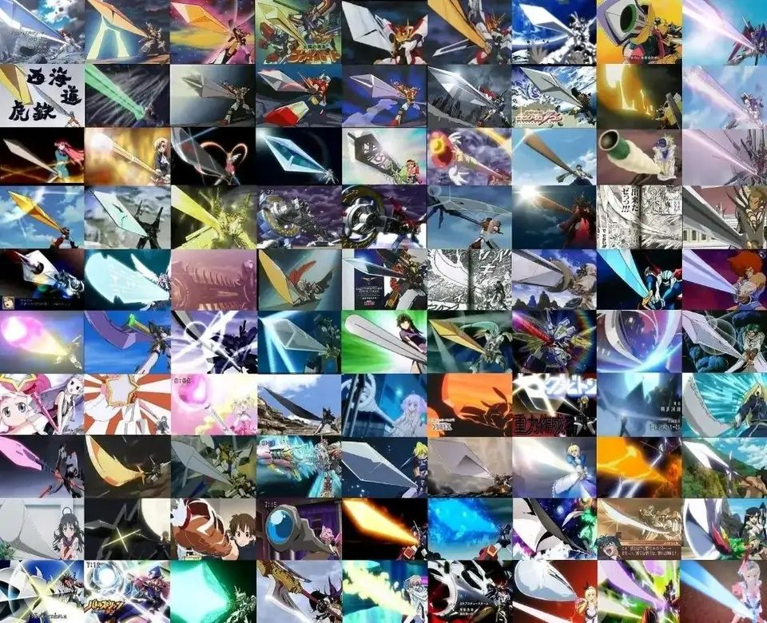

但就现在这弔内容质量，我求他多抄一抄吧

----

##### 33.[1] \<pid:705906107\> 2023-07-30 21:53:04 by cccherch
你在这里当然能理智讨论，去B站这些地方还不是一样给你扣帽子。前不久还在试图抹黑别人瘴气点火呢，这几年米家社区越来越极端化，对引外战分化玩家转移矛盾越来越路径依赖。发展至今米家的饭圈已经到了独尊米游，攻击其他一切厂商游戏的地步了，已经没什么恢复讨论环境的可能了。

----

##### 34.[0] \<pid:705906304\> 2023-07-30 21:54:17 by 无。乡4
现在原神还不如多抄，早期游戏设计真的比现在强多了(说的就是你雪山)

----

##### 35.[3] \<pid:705906736\> 2023-07-30 21:56:56 by 白浊果酱
我说一个现在已经被岁掉的，百万塞尔达玩家其实是讽刺原神玩家反串自己是塞尔达玩家。

----

##### 36.[2] \<pid:705906873\> 2023-07-30 21:57:50 by 哒哒块
我算是个鬼泣等动作游戏的爱好者吧，从三蹦子时代就在骂抄袭，或者更准确说叫过度借鉴，此为煎炒天龙人

我不是塞尔达粉，只能算是个野吹玩家，骂过碰瓷营销，此为百万塞尔达

至于为啥我一直在玩原神，甚至还算是个三蹦子开服玩家(一个月)，单纯是因为我觉得玩了才有资格评价一个游戏的游戏性

----

##### 37.[0] \<pid:705907092\> 2023-07-30 21:59:14 by 无。乡4
>[jump](#pid705906736) 白浊果酱(2023-07-30 21:56) 说: 
>
>我说一个现在已经被岁掉的，百万塞尔达玩家其实是讽刺原神玩家反串自己是塞尔达玩家。

然而并不是是任豚爆的典，说国内玩家超百万，随便来点口水都能吐死原神，后远古米元帅饭帅下场指出国内ns用户不足50w被原神吧传为百万塞尔达玩家

----

##### 38.[0] \<pid:705907454\> 2023-07-30 22:01:35 by 冷清的夜i
你要在b站聊这个粥p宦官里选一个喜欢的帽子吧

21年初的时候我还会跑去古战场跨时空出警任豚 现在看多了“mhy是受害者”的言论只觉得恶心p事都拿古战场出来说mhy是被友商攻击只会越来越让人觉得你米当初是故意碰瓷的就这p大点脑子还觉得自己能操控舆论建议吃点时事补补脑子

----

##### 39.[0] \<pid:705907573\> 2023-07-30 22:02:12 by 。一念七绝
>[jump](#pid705904379) 零点，陈彬(2023-07-30 21:42) 说: 
>
>轨迹系列？那他要是做的好就不提了，争着和法老控一起摆烂啊？黎之轨迹2我绷不住了

我这截止在碧零了 后面没有qq小人我适应不了..我土 我就是喜欢qq小人和小表情还有料理书籍钓鱼刷羊波波
直到我看到主线想起琪雅 然后又刷到帖子有人拿她洗()的感受吗

----

##### 41.[0] \<pid:705907679\> 2023-07-30 22:02:54 by rosa__canina
旷80，王200，原1000
奔着抄袭节奏来玩的
就我开服的体验来说，旷和原不像
旷本质还是解密，原是rpg
只是两者都套了开放世界的皮

----

##### 42.[2] \<pid:705907791\> 2023-07-30 22:03:36 by 已经成为了一种笑话
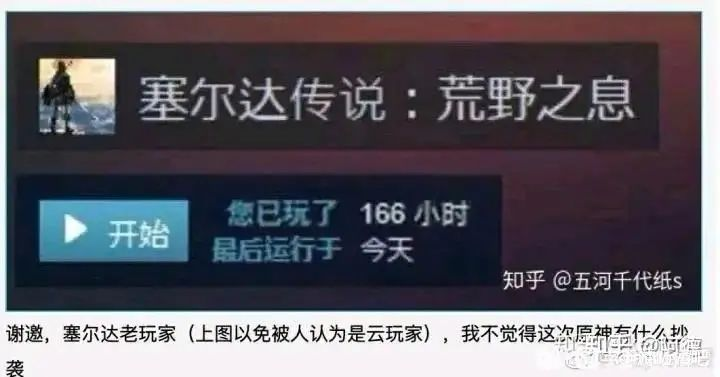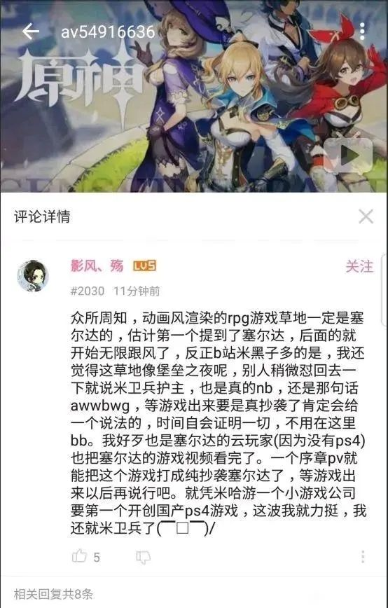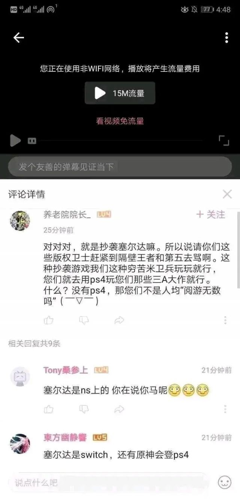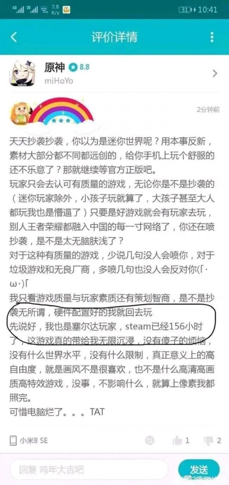

“百万塞尔达玩家”

----

##### 43.[0] \<pid:705907845\> 2023-07-30 22:03:54 by lleevvin
>[jump](#pid705902643) 最初的剑鱼二番队队长(2023-07-30 21:31):

19年原神pv之前米哪有xz玩家之间都很和谐，被飞马的只有ch
你怕不是记忆错乱了

----

##### 44.[0] \<pid:705907859\> 2023-07-30 22:04:00 by kkffffff20
我其实想法一直是，抄就抄了呗(我这里的抄比较中性)，只要别双标或者嘴硬否认就行，一但你维护了b抄a，那你就不能去嘲讽抄b的c；一但你说前期抄了，就别嘴硬说后期走了不同的赛道

----

##### 45.[0] \<pid:705907951\> 2023-07-30 22:04:38 by 。一念七绝
>[jump](#pid705904403) 老虎二世(2023-07-30 21:42) 说: 
>
>结果铁道真变轨迹了

去铁道的时候 我满怀欣喜：绿毛神父的代餐了终于要来了吗
然后 抽完刃就跑了 我理解不了刃卡cp 一点也理解不了
~~再次幸好没有代餐~~

----

##### 46.[0] \<pid:705908175\> 2023-07-30 22:06:03 by 我冲我自己
只能说无论是黑红营销还是友商打压，被拿来当盾顶的泛式都挺惨的

----

##### 47.[1] \<pid:705908639\> 2023-07-30 22:09:06 by 月小炎
那是破事不是早就被结晶岁掉了
你拿出历史来他们会说是反串，是洗脑包
他们才是真相

----

##### 48.[0] \<pid:705908703\> 2023-07-30 22:09:33 by 墩墩桃
我的评价是还不如多抄点

----

##### 49.[1] \<pid:705908775\> 2023-07-30 22:10:05 by grox133
要不然你以为开服那么多差评哪来的，一个就是宣传碰瓷，第二个就是很多去实际游玩的人发现这就是个辣鸡

----

##### 50.[0] \<pid:705909143\> 2023-07-30 22:12:50 by 长野原新之助
>[jump](#pid705907679) rosa__canina(2023-07-30 22:02) 说: 
>
>旷80，王200，原1000
>奔着抄袭节奏来玩的
>就我开服的体验来说，旷和原不像
>旷本质还是解密，原是rpg
>只是两者都套了开放世界的皮

原开局御三家带你去那些个神庙，还是挺像那么回事的，其实很多像的元素后面都有淡化和舍去了

----

##### 51.[0] \<pid:705909818\> 2023-07-30 22:17:00 by Teddydesu
原宝是有点表气的
这也是我当初入坑的原因，够涩

----

##### 52.[0] \<pid:705910178\> 2023-07-30 22:18:57 by 无。乡4
>[jump](#pid705905897) 猫小乐1124(2023-07-30 21:51) 说: 
>
>我倾向于当初确实被腾讯等其他厂商给搞了一手，主要当时米用自己的渠道发行原神，也得罪了硬核联盟。多方势力都从你这喝不到汤，你还要侵占别人的蛋糕，搞你是肯定的。
>
>但正如那句话，打不死你的会让你更强大；塞翁失马焉知非福。这波黑暗降临没能搞死原神的话，那就是给了原神独一无二的宣发。
>真要回到20年，要是不搞黑暗降临，原我觉得也不会这么火。
>
>但还是那句话，塞翁失马焉知非福，黑暗降临同时也带给了原神独一无二的互联网处境。太多的人因为当初的事情而给你米套了层免死金牌，才会让你米如此的肆无忌惮。
>免死金牌从

其实当年节奏倒是有诸多疑点，当年pv公布4小时就有了煎炒PV的视频，让人很难不怀疑有人在带节奏。可惜远古战场消失了不少无从考据了。当时有人说原神组因为节奏这事过大了，有策划掉珍珠了。一测结束当天就发了封信表示自己的灵感确实起源于botw，看的出来当年那波节奏大到原神组自己都受不了

----

##### 53.[0] \<pid:705910508\> 2023-07-30 22:21:00 by 我不会撒谎
一开始蒙德的这些东西(包括美术剧情玩法、关卡设计等等)说是没借鉴是不可能的，自己也承认过借鉴知名的开放世界游戏。后面璃月其实塞尔达味就淡很多了。稻妻须弥我的评价是不如多抄点

----

##### 54.[0] \<pid:705910779\> 2023-07-30 22:22:34 by k384698637
其实原神2.x版本已经变很多了，我挺喜欢稻妻版本的

----

##### 55.[0] \<pid:705912292\> 2023-07-30 22:32:14 by EWSCHNEE
不得不说那既视感是真的强，尤其是蒙德。到了璃月之后才做了区分。

第一次玩的人大概率会觉得新鲜，如果是玩的多的到最后发现就是个半吊子。很多系统水平就那样，比如秘境，元素视野。本质上就是套了个大世界的手游，跟塞尔达就不是一个东西。

原能起起落落都是看玩家的脸色，那段时间能风评慢慢回升那就是有好的一面，大家还愿意买账。现在风评差明显就是作的，玩家也不给好脸色看了。

----

##### 56.[0] \<pid:705913063\> 2023-07-30 22:37:31 by Gwyndo1in
当初骂原神的人多主要原因一是原神是米哈游出的，二是因为一眼像塞尔达。当时人们对米哈游的态度跟现在原友们对腾讯一样，就是一个抄袭厂商，从崩2各种neta借鉴到崩3从猎天使魔女鬼泣闪乱神乐各种抄动作，现在又准备抄，那可不得好好喷一下。举个具体的例子，原友对幻塔的看法(抄袭大厂腾讯又出抄袭游戏了还要抄原神)就是最初大部分人对原神的看法(抄袭小厂米哈游又出抄袭游戏了还抄到塞尔达头上)，最大的区别大概在于幻塔不是腾讯的，而米哈游倒一直在抄。质量什么的都是后话，毕竟当时大部分人没玩到，就看个pv。你要说冤我也不觉得冤，因为崩2崩3给别人留下的印象确实不好，而且也有米卫兵一直在反击为整件事加热度，并不是一边倒的局面。

----

##### 57.[0] \<pid:705913733\> 2023-07-30 22:41:39 by 小卒龍寒
话说原在pc公测前的另一次测试是不是能够公开直播或者随意发布视频的，我记忆中有不少在pc公测前原神的画面和双方混战的印象，但我又因为隔了太久想不起来具体在哪看过

----

##### 58.[0] \<pid:705914186\> 2023-07-30 22:44:23 by jasmine4869
老米跟明星粉圈一样的运营思路，对外黑红碰瓷炒作，对内营造一种内部抱团与世界为敌的错觉，你看这跟其他粉不是也一样？

----

##### 59.[0] \<pid:705914982\> 2023-07-30 22:49:45 by 猫小乐1124
>[jump](#pid705907653) 星辰之剑(2023-07-30 22:02)说:
><b>Reply to [pid=705905897,37198394,2]Reply[/pid] Post by [uid=64400493]猫小乐1124[/uid] (2023-07-30 21:51)</b>  你说的这个就是洗脑包之一了，说白了现在回过去看看就发现当时很多问题是不正常的。原神真正的大爆其实是2.0以后而不是1.0，你没发现初期去对原神打压完全不符合商业逻辑么 其次原神前二游市场只是小众从体量和规模角度来说被打压的可能性很低。所以反过来，当时对原神巨大的声势援护本质应该是反猪鹅才对

其实我想说的重点就是因为这档子事儿，现在成了米哈游的免死金牌了。

只要你黑了，那你就是收钱了，你就是带着任务来的。
而一众mmr现在就信这一口，这也是为啥哪怕现在原神都成这吊样了，依然再二游有着强势的收入。
因为所有的负面言论都被岁成打压了。

----

##### 60.[1] \<pid:705915288\> 2023-07-30 22:51:46 by 望月奈奈子
要前科有未定官方忘切号下场带节奏 要现状有猛干自爆厨力狗屁不是 要宣传二创上单无限买 原 铁病毒式宣发

谁还信开服碰瓷 全是友商和黑子下场我笑他一辈子 里面绝对有收了米家钱办事的人 甚至米家自己的人去带头碰瓷的

----

##### 61.[0] \<pid:705915292\> 2023-07-30 22:51:46 by 清蒸盐姜香菜鱼
每次看到法律上告不赢就不是抄袭这种话就觉得有点好笑
上次崩铁文案搬文案一个博主的那事，xz们的洗地话术就是，你这么打抱不平你去让博主告mhy吧，不然算什么抄袭，真的被恶心到了

----

##### 62.[0] \<pid:705915444\> 2023-07-30 22:52:42 by 卯农于辛雷黄
有什么好讨论的

米抄了吗？抄了
那骂抄袭狗合理吗？合理
堵嘴不让骂了吗？堵了
反过来骂人是不是有目共睹？是
最后玩原神的享受抄袭成果了吗？享受了

那还有什么好说的，每一个玩原神的都给米提供了收益，给op骂人搅乱环境提供了底气。现在搁这讨论什么是非对错，显得你们很干净是吗

----

##### 63.[0] \<pid:705915543\> 2023-07-30 22:53:25 by Yau1968
客观来说 当初刚出的时候确实很有既视感 另一方面 确实有很多浪国小画家跟风鉴定抄袭

----

##### 64.[1] \<pid:705915926\> 2023-07-30 22:55:50 by 冷清的夜i
>[jump](#pid705915444) 卯农于辛雷黄(2023-07-30 22:52) 说: 
>
>有什么好讨论的
>
>米抄了吗？抄了
>那骂抄袭狗合理吗？合理
>堵嘴不让骂了吗？堵了
>反过来骂人是不是有目共睹？是
>最后玩原神的享受抄袭成果了吗？享受了
>
>那还有什么好说的，每一个玩原神的都给米提供了收益，给op骂人搅乱环境提供了底气。现在搁这讨论什么是非对错，显得你们很干净是吗

没干净啊 里版说的最多的不就是我玩原神玩的你这么急 你被op夺舍了？

----

##### 65.[1] \<pid:705916062\> 2023-07-30 22:56:40 by 清蒸盐姜香菜鱼
>[jump](#pid705915444) 卯农于辛雷黄(62楼) (2023-07-30 22:52)说:
>有什么好讨论的[s:ac:茶]  米抄了吗？抄了 那骂抄袭狗合理吗？合理 堵嘴不让骂了吗？堵了 反过来骂人是不是有目共睹？是 最后玩原神的享受抄袭成果了吗？享受了  那还有什么好说的，每一个玩原神的都给米提供了收益，给op骂人搅乱环境提供了底气。现在搁这讨论什么是非对错，显得你们很干净是吗

这是我从没见过的新话术啊，因为玩了原神所以不能说他抄袭了

----

##### 66.[1] \<pid:705916435\> 2023-07-30 22:58:49 by 盈众有为1t阴湿地狗
>[jump](#pid705915444) 卯农于辛雷黄(2023-07-30 22:52) 说: 
>
>有什么好讨论的
>
>米抄了吗？抄了
>那骂抄袭狗合理吗？合理
>堵嘴不让骂了吗？堵了
>反过来骂人是不是有目共睹？是
>最后玩原神的享受抄袭成果了吗？享受了
>
>那还有什么好说的，每一个玩原神的都给米提供了收益，给op骂人搅乱环境提供了底气。现在搁这讨论什么是非对错，显得你们很干净是吗

所以说，玩原神不能骂，不玩原神不能骂，那谁能骂

----

##### 67.[0] \<pid:705916540\> 2023-07-30 22:59:28 by 夭叶舒华
其实原的程度我觉得叫融梗更合适，小说圈还有个说法就是“中译中”，一般来说很难判定，最多自由心证，没有实锤，至于要说有没有碰瓷营销嘛……我不好说

----

##### 68.[0] \<pid:705917480\> 2023-07-30 23:05:08 by 长野原新之助
>[jump](#pid705915444) 卯农于辛雷黄(2023-07-30 22:52) 说: 
>
>有什么好讨论的
>
>米抄了吗？抄了
>那骂抄袭狗合理吗？合理
>堵嘴不让骂了吗？堵了
>反过来骂人是不是有目共睹？是
>最后玩原神的享受抄袭成果了吗？享受了
>
>那还有什么好说的，每一个玩原神的都给米提供了收益，给op骂人搅乱环境提供了底气。现在搁这讨论什么是非对错，显得你们很干净是吗

我主楼里提到的往地上一趟复读猴or镍币人起码都动脑子思考打滚话术了，你这说了个哈？

----

##### 69.[0] \<pid:705918230\> 2023-07-30 23:09:37 by Vanitas0
“百万塞尔达”其实是最好笑的，MWB说这话想表达的意思是“国内没有多少玩过塞尔达的，但网上却那么多，所以大部分都是云玩家和无脑黑”，但它们说这话显然是想当然地以为主机游戏玩家少，但凡它们稍微了解一下旷野之息是什么体量的游戏，稍微估算一下就知道国内玩过旷野之息的玩家远远超过一百万

----

##### 70.[0] \<pid:705918241\> 2023-07-30 23:09:41 by 遗憾奖i
>[jump](#pid705904777) 海崎新太9139(2023-07-30 21:44) 说: 
>
>因为国内舆论对抄袭的界定还在一个缺乏共识的阶段吧。
>这类问题出现在包括不限于绘画、音乐、玩法、动作设计等方面，每个人对学习到抄袭之间这个度的感知不同，对这个模糊地带的接受程度也不同。
>另外当时荒野之息正值口碑大爆出圈，还有米哈游自带一些debuff恶评(比如认为崩三抄袭了某些动作游戏是当时很多二游玩家单机玩家的共识)，最后变成了舆论对还原神作的群嘲。

难道没抄动作吗

----

##### 71.[0] \<pid:705918258\> 2023-07-30 23:09:45 by 超级龙击炮
原神开服，只要不是瞎子就能认出来铁抄袭，米忽悠抄袭的前科也是历历在目

装傻罢了都说玩原神玩的，不装傻哪来的原神玩

----

##### 72.[0] \<pid:705918523\> 2023-07-30 23:11:26 by 废墟幻想
米就该多抄点塞尔达，增加互动性和自由度

----

##### 73.[0] \<pid:705919602\> 2023-07-30 23:17:53 by DxhSN2022
根据我的记忆和查到的资料，我更倾向于“百万塞尔达”是当时米玩家用来攻击对面的。

19年6月 知乎(彼时的知乎和现在不同，我有关原神最早的接触就是在知乎上看原神黑料)上的问题：“有多少中国玩家玩过《塞尔达传说：旷野之息》？”
下方塞尔达玩家的回答更像是被从实际玩家数量角度攻击后进行的回击：
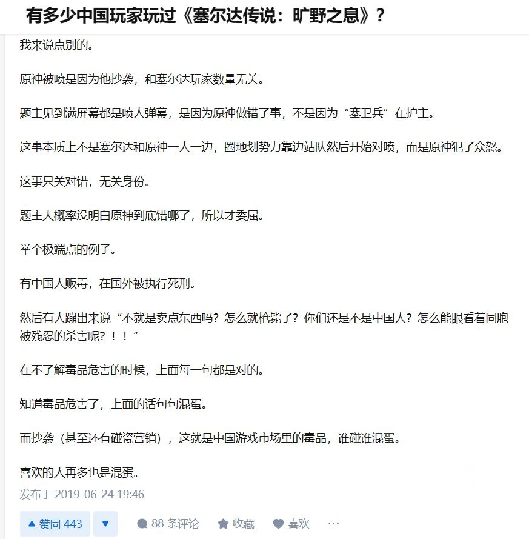
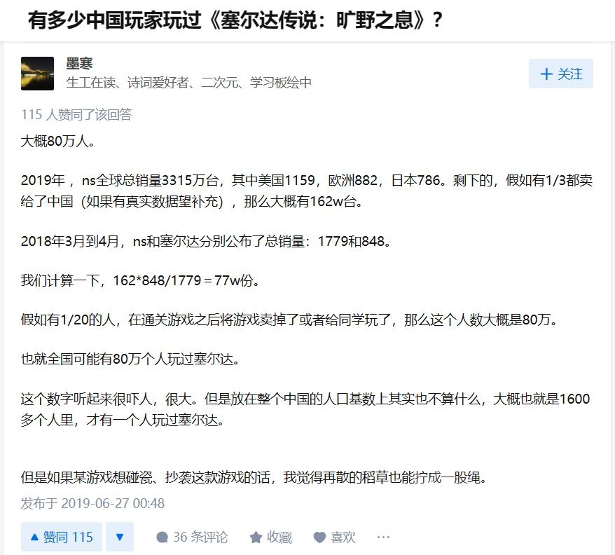
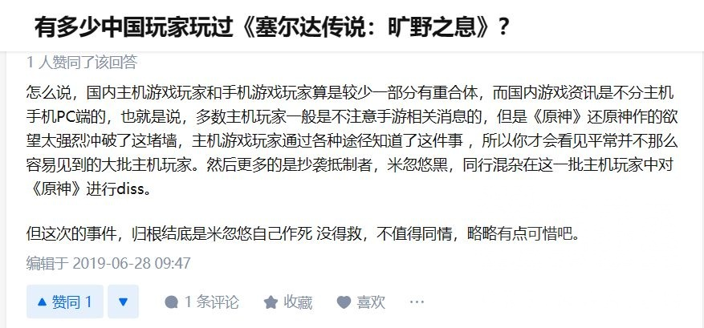

20年2月 B站 文章《从不造谣米卫兵》
其中一段是对“百万塞尔达”的反驳，说明此时B站“百万塞尔达”是用于攻击批评者的。

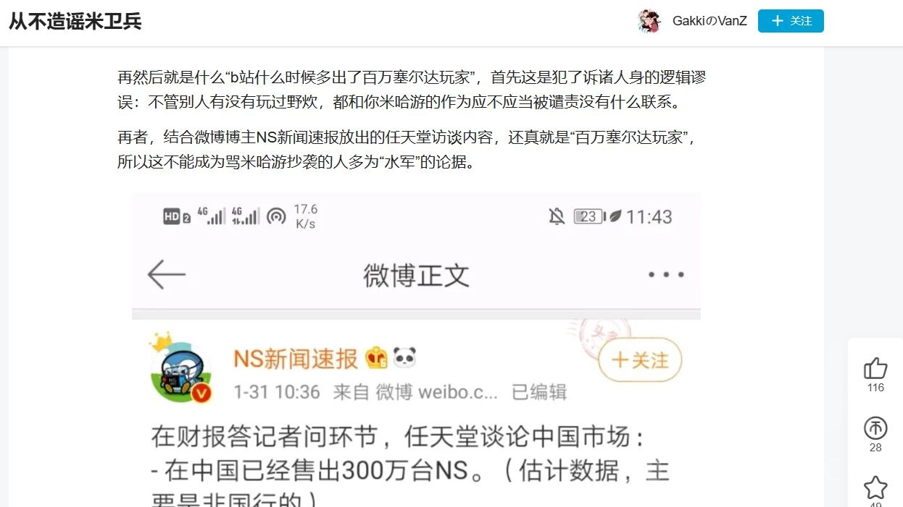

20年3月 mihoyo吧 楼主的标题：“转自B站 米卫兵行为大赏，百万塞尔达玩家是这么来的啊”。主楼内容：“干干净净mhy，清清白白mwb”。
后面内容是mwb发言的截图(包括帆船，这套路历史这么悠久了，汗……)。
其中有一张也说明了当时“百万塞尔达”已被mwb用于攻击对面，但该贴没有对这个用法提出异议。

综上，如果这个词被岁的话只会发生在19年，不过我没有找到相关内容。

----

##### 74.[0] \<pid:705919606\> 2023-07-30 23:17:54 by ll614807
>[jump](#pid705904195) kemax3(2023-07-30 21:41) 说: 
>
>只能说
>
>原最早有在有“参照物”的情况下做出来的地图真的有点意思，和后来没有“参照物”做的地图在游玩体感上真的差距明显。

应该说刚开始在做大世界，后面在做箱庭吧

蒙德地区是最像荒野之息的，璃月倒是做出了自己的特色，感觉参考了现实中的地形
转折点是好评如潮的雪山吧，让mhy把地图设计往箱庭靠拢
后面稻妻因为岛屿分割，除了鸣神有点蒙德的影子，后面的岛一个比一个箱庭，沙漠部分更是用力过猛

实际上mhy的箱庭不算差的，只是的确不是大世界，也没那么多自由探索的乐趣

----

##### 75.[0] \<pid:705920192\> 2023-07-30 23:21:25 by sbsx123
我的态度：
原神借鉴了吗？当然借鉴了。
有问题吗？没问题。
“百万塞尔达”不论背后是谁，都该死。如果是mhy黑红营销，那mhy该死。如果是友商，那友商该死。如果是天龙人，那天龙人该死

----

##### 76.[1] \<pid:705920635\> 2023-07-30 23:24:09 by 柑橘橙橙橙橙橙子
质疑抄袭，理解抄袭，恳请抄袭就现在的水平，还是多抄点吧

----

##### 77.[0] \<pid:705921275\> 2023-07-30 23:27:58 by id不知道用什么id
以前是被煎炒，现在巴不得多炒点。

----

##### 78.[0] \<pid:705921678\> 2023-07-30 23:30:22 by 都离我而去吧。
我一像是不介意游戏抄袭的

----

##### 79.[1] \<pid:705921808\> 2023-07-30 23:31:12 by ZX_hysh
这事输一手太久远了，很难辨明了。
只能说我屁股从原一开服就是歪的觉得是米买黑红营销，但是这件事不是发生在现在，你很难一个个去查成分到底是任豚无理取闹还是米的水军在地上打滚。

----

##### 80.[0] \<pid:705922218\> 2023-07-30 23:33:45 by ZX_hysh
喔，诺艾尔动作实锤抄机械纪元来着，只能说没人在意，另外当时不抄的那几个大剑做得很差，没有人身被大剑带动的感觉，评价是还不如抄的。

----

##### 81.[0] \<pid:705922335\> 2023-07-30 23:34:26 by 夕音子
玩了原就知道是俩游戏了，这么说吧，我觉得抄袭是贴金了

----

##### 83.[1] \<pid:705922873\> 2023-07-30 23:37:50 by distaling
开服的原神:社区评价配不上实际质量
现在的原神:社区评价很好地反映了游戏当前版本的质量

