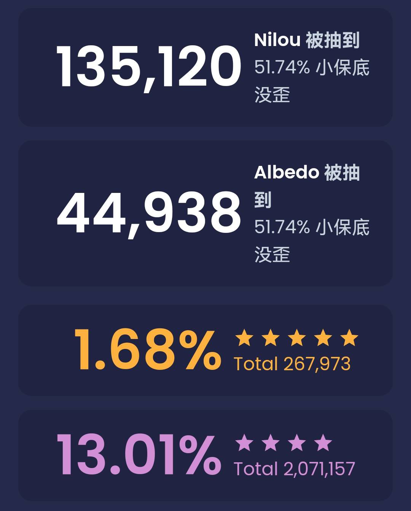
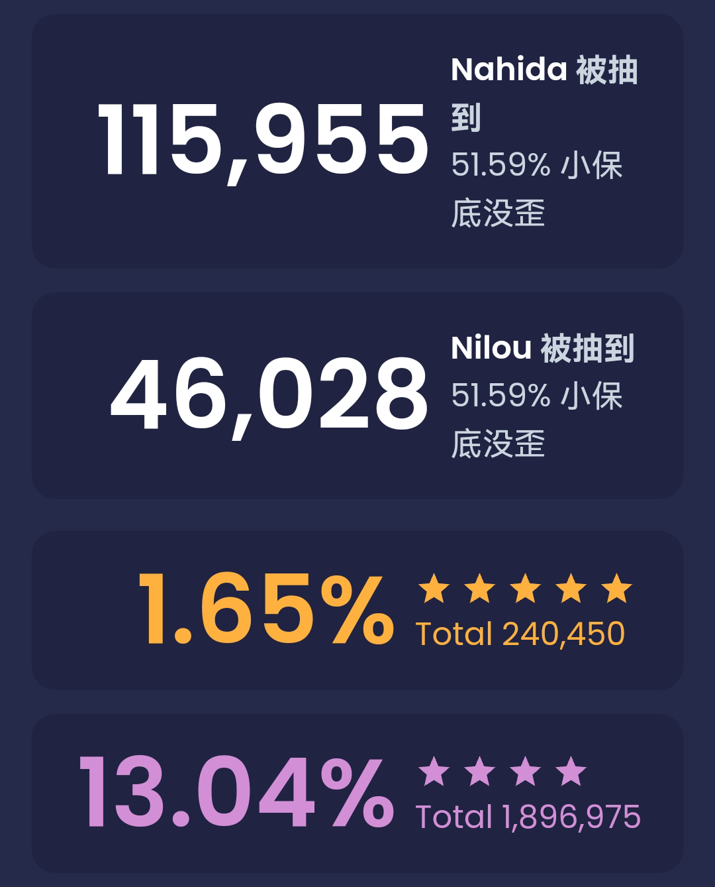
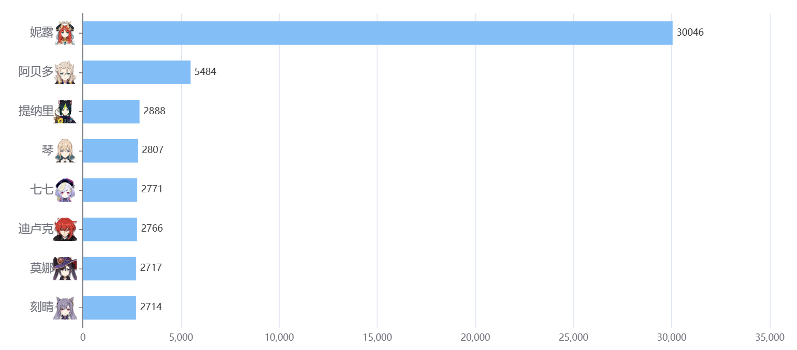
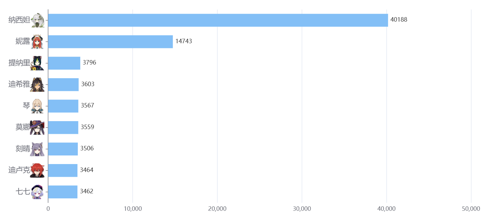

### [不吐不快] 近来，玩家上传祈愿记录的热情下降严重，祈愿网站的样本已无法良好地反映抽取比例

Made by ngapost2md (c) ludoux [GitHub Repo](https://github.com/ludoux/ngapost2md)

----

##### 0.[1] \<pid:0\> 2023-07-30 22:00:14 by Auroratwilight
以妮露为例，非小酋和paimon.moe两个祈愿网站的样本均有严重下滑。

<a href="javascript:;" onclick="collapse(this);">+</a>paimon.moe妮露抽取情况 ...

paimon.moe3.1版本的抽取数是135120，3.6版本是46028，比值为2.94

<a href="javascript:;" onclick="collapse(this);">+</a>非小酋妮露抽取情况 ...

非小酋3.1版本的抽取数是30046，3.6版本是14743，比值为2.04

但是从持有率来看，3.6相比3.5却翻了一倍(以小助手为例，3.5持有率为23%，3.6为45%左右)，也就是说反映到持有率的数值要远高于最后一次up的抽取数上。说明了随着版本推进，<b>上传祈愿记录的样本严重下降</b>，不光是妮露，其他角色一样有这个趋势。

再看回3.8下半池，非小酋宕机了几天修复之后，小保底数量从8000左右上涨到13283，散兵和心海的抽取数比例从1.43：1跌至1.37：1，算是比较大的波动
paimon.moe波动较小，从1.20：1跌至1.17：1
说明目前的样本数距离真实值误差很大，<b>真实值一定小于1.17，甚至恐怕会小于1</b>

<a href="javascript:;" onclick="collapse(this);">+</a>非小酋3.8下半池 ...

----

##### 1.[0] \<pid:705908700\> 2023-07-30 22:09:32 by AMADUESver0
不抽的角色也没上传的必要吧

----

##### 2.[0] \<pid:705908863\> 2023-07-30 22:10:43 by Lilith330
小助手的持有率是打深渊的才统计吗？

----

##### 3.[0] \<pid:705908915\> 2023-07-30 22:11:04 by 扶光む
这么一说我好像从3.5抽完申鹤后就再也没上传过抽卡数据了

----

##### 4.[0] \<pid:705908971\> 2023-07-30 22:11:29 by yxliu24
从各种角度，只要统计网站统计命座，在这个抽取比下抽心海的人肯定比抽其他的人多

----

##### 5.[3] \<pid:705908976\> 2023-07-30 22:11:33 by fcvqz421
难道不是抽数热情下滑吗

----

##### 6.[0] \<pid:705909166\> 2023-07-30 22:12:58 by Auroratwilight
>[jump](#pid705908863) Lilith330(2023-07-30 22:10)说:
>小助手的持有率是打深渊的才统计吗？

是的，大众持有率比小助手的低，但是比例是没问题的，也是翻倍(总不能3.1全是xp抽卡，3.6就全变成打深渊的了吧，无论哪个版本，都有这两种玩家)

----

##### 7.[0] \<pid:705909319\> 2023-07-30 22:13:52 by Auroratwilight
>[jump](#pid705908700) AMADUESver0(2023-07-30 22:09)说:
>不抽的角色也没上传的必要吧

现在的情况是，更多的玩家是我抽了角色，但还是没上传

----

##### 8.[0] \<pid:705909489\> 2023-07-30 22:14:58 by Auroratwilight
>[jump](#pid705908976) fcvqz421(2023-07-30 22:11)说:
>难道不是抽数热情下滑吗[img]https://img.nga.178.com/attachments/mon_201209/14/-47218_5052bc4cc6331.png[/img]

如果只是简单的抽数下滑，就不该是持有率翻倍了啊

----

##### 9.[0] \<pid:705909585\> 2023-07-30 22:15:34 by 碎银酿普洱
其实是的，出现了大量几万出头甚至几千的样本，雷夜草这种级别顶天十多万，结果我往回傲腾的时候发现雷心池雷神的上传数是37万，按理雷心流水其实差雷绫不少，那只能说明传样本的骤降

----

##### 10.[0] \<pid:705910054\> 2023-07-30 22:18:19 by qhmi
是大部分原来上传记录的人现在懒得上传记录了吗？游戏活跃度一定是稳中向好

----

##### 11.[1] \<pid:705910545\> 2023-07-30 22:21:14 by fcvqz421
>[jump](#pid705909489) Auroratwilight(2023-07-30 22:14) 说: 
>如果只是简单的抽数下滑，就不该是持有率翻倍了啊

持有率不是总持有率，只是深渊持有率，这两个之间数据是不能等比换算过去的

----

##### 12.[0] \<pid:705910660\> 2023-07-30 22:21:58 by HitsugayaToushirou
游戏蒸蒸日上是仙吹出来的，
游戏凉是各方面都能看到的。
我现在佛系摆烂，不慌不忙。

----

##### 13.[0] \<pid:705910972\> 2023-07-30 22:23:47 by YVANLAU
为什么同期用户上传持有率很积极，上传祈愿记录就不积极了

----

##### 14.[0] \<pid:705911003\> 2023-07-30 22:24:00 by Auroratwilight
>[jump](#pid705910545) fcvqz421(2023-07-30 22:21) 说: 
>
>持有率不是总持有率，只是深渊持有率，这两个之间数据是不能等比换算过去的

见6l，比例是可以换算的

----

##### 15.[0] \<pid:705911043\> 2023-07-30 22:24:18 by 冰川真琴
考虑到角色受众上传数据的殷勤程度，心海抽取数确实可能比显示的高。
但遗憾的是并不能看到

----

##### 16.[0] \<pid:705911273\> 2023-07-30 22:25:45 by xklwjz
说起来，我自从3.6之后也不去小助手上传深渊了，剑斗也屏蔽了

----

##### 17.[0] \<pid:705911408\> 2023-07-30 22:26:38 by UID42694396
以我逛论坛的个人体感，很早的时候看的都是那单机软件的统计，后来是非小酋的界面，而最近小助手用的比例高很多了，

----

##### 18.[0] \<pid:705911429\> 2023-07-30 22:26:45 by 我不是琴秀
大伙都不抽卡
虚空上传吗

----

##### 19.[0] \<pid:705911487\> 2023-07-30 22:27:05 by Auroratwilight
>[jump](#pid705910972) YVANLAU(2023-07-30 22:23) 说: 
>
>为什么同期用户上传持有率很积极，上传祈愿记录就不积极了

因为前半句是错的，事实上小助手的样本数也在严重下滑，只是因为持有率能消除样本数的影响，所以可以拿来计算

----

##### 20.[0] \<pid:705911496\> 2023-07-30 22:27:08 by Luoxifq
流水0不就代表抽的人少吗
那可想而知会上传的人就更少了
加上这个你用的这个还是外网统计,原神现在在国外那是越来越凉啊
但我还是有上传抽我心的

----

##### 21.[0] \<pid:705911862\> 2023-07-30 22:29:34 by Inquisit
其实就是勉勉强强在玩在抽卡的人也没有统计抽数的热情了

----

##### 22.[0] \<pid:705911966\> 2023-07-30 22:30:14 by お宅不是
>[jump](#pid705911487) Auroratwilight(2023-07-30 22:27) 说: 
>
>因为前半句是错的，事实上小助手的样本数也在严重下滑，只是因为持有率能消除样本数的影响，所以可以拿来计算

是的巅峰时期的小助手从6w一跃12w的样本量，我记得好像就是3.1-3.2附近时候？

----

##### 23.[0] \<pid:705912016\> 2023-07-30 22:30:32 by Auroratwilight
>[jump](#pid705911496) Luoxifq(2023-07-30 22:27) 说: 
>
>流水0不就代表抽的人少吗
>那可想而知会上传的人就更少了
>加上这个你用的这个还是外网统计,原神现在在国外那是越来越凉啊
>但我还是有上传抽我心的

抽的少是一方面，抽了的人不愿意上传也是一方面，共同导致了祈愿网站的数据很难看
非小酋是国内网站啊，我特意挑了一个国内和国外的

----

##### 24.[0] \<pid:705912063\> 2023-07-30 22:30:50 by k384698637
毕竟大家都生怕抽到sb，还很多退坑的，当然不用上传了

----

##### 25.[0] \<pid:705912167\> 2023-07-30 22:31:32 by cbzmxx
我最后一次打深渊是在3.6，尝试了一下脱离了草神的草反应队能不能打，结论是不行，于是原对我而言最后的一点挂念也没有了。如果草体系能脱离蒸馍，那我可能会愿意留下原当一个深渊启动器吧

----

##### 26.[0] \<pid:705914011\> 2023-07-30 22:43:22 by Auroratwilight
>[jump](#pid705911862) Inquisit(2023-07-30 22:29) 说: 
>
>其实就是勉勉强强在玩在抽卡的人也没有统计抽数的热情了

正解
在流水未明显下滑的3.6版本之前，就出现了上传热情下滑的现象，只是大伙没有意识到
现在因为流水下滑，数据简直没法看

----

##### 27.[0] \<pid:705915779\> 2023-07-30 22:54:58 by aphemia777
可能海外确实凉透了

----

##### 28.[0] \<pid:705921746\> 2023-07-30 23:30:47 by 情诗。
你提醒了我要上传，给我??提高一下样本量

----

##### 29.[0] \<pid:705921928\> 2023-07-30 23:32:02 by 雨源rainsource
我抽完优菈传了个小助手，然后就没进过卡池了，好像也没多久，不过我感觉我要憋到4.2了

