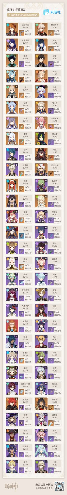

### [不吐不快]有些东西从开服起就没弄懂(关于卡池)

Made by ngapost2md (c) ludoux [GitHub Repo](https://github.com/ludoux/ngapost2md)

----

##### 0.[0] \<pid:0\> 2023-07-30 22:20:25 by 罗德羽兰
前排叠个甲先，楼主不是来转移话题或者其他啥的，只不过以前在哪问都会挨喷，单纯现在想再问问

开服起的全“限定”卡池到底是一个什么目的，复刻一次之后进海池或者直接进海池然后开固定角色轮换，重要角色限定这种模式不好吗，问了玩崩三的朋友也不是现在这样开服角色也扣扣搜搜的不给进海池啊

全限定还得跟着一起复刻，出现卡池占位导致某些角色武器复刻时间拉长和卡池拖沓的问题

难道还是单纯恶心玩家

----

##### 1.[0] \<pid:705910614\> 2023-07-30 22:21:39 by 罗德羽兰
前排叠个甲，放个的box

----

##### 2.[0] \<pid:705910920\> 2023-07-30 22:23:29 by 卯尚倪甲易常
就是恶心人啊玩家能抽什么完全由他们说了算，不然也整不成500天不复刻这种烂活

----

##### 3.[0] \<pid:705911507\> 2023-07-30 22:27:13 by 扶光む
只要你不喜欢米的nt操作，那么欢迎进入理查

----

##### 4.[0] \<pid:705911513\> 2023-07-30 22:27:15 by 格里兹纳特
大概是想营造一种稀缺感吧，大部分角色复刻规律是16~17个卡池出现一次的。17*21=357天，相当于一年。
当然还有一些角色8个卡池复刻，也有的角色27个卡池才复刻
相信以后不会有27个卡池才复刻的情况出现了，太久不复刻=失去复刻的爆米能力(攒都能攒满命了)

----

##### 5.[0] \<pid:705911864\> 2023-07-30 22:29:34 by conntroll
另一种意义上的饥饿营销嘛

----

##### 6.[0] \<pid:705912942\> 2023-07-30 22:36:46 by fcvqz421
其实就是涨价价格翻倍
常驻不能歪等于一半原石都是白给，仅此而已

----

##### 7.[3] \<pid:705913347\> 2023-07-30 22:39:23 by ou2021
想起来我退坑两三个月了入坑就在等的钟离还没复刻就

----

##### 8.[0] \<pid:705913592\> 2023-07-30 22:40:47 by jasmine4869
感觉快要开三卡池了

----

##### 9.[0] \<pid:705913649\> 2023-07-30 22:41:07 by Skalski_
赚钱吗，不磕碜

原是我见过唯一一个全限定的游戏，正常不都是首次up概率提升后面进轮换池或者海选池，偶尔周年春节出个限定的吗

----

##### 10.[0] \<pid:705914870\> 2023-07-30 22:48:58 by 河畔稻田
说实话，本质就是饥饿营销
你喜欢一个角色那就要做好过了这村没这店的准备，否则优菈就是前车之鉴。
这样子全限定一搞，你想攒原石就要做好付出巨大时间成本的顾虑了，比如我攒的原石甚至可能要等几个月之后才能用于抽喜欢的角色，而且中间还穿插其他同样是我喜欢的角色，那么对攒原石的焦虑程度就会有一定的提升，自然就会有人去考虑直接氪金强抽。说白了这种挤压玩家舒适区去制造攒原石焦虑营造稀缺感就是策划想看到的。

----

##### 11.[0] \<pid:705915249\> 2023-07-30 22:51:29 by 道仰
嘿呀……普池300抽自选这个很难吗，隔壁崩铁不是已经上了吗
~~这很重要吗，也就我这种镍币人才在乎吧。是不是被()()夺舍了~~

----

##### 12.[0] \<pid:705920787\> 2023-07-30 23:25:06 by kunizu
手游的本质就是用限时限定等方式逼你购买，王者甚至也如此

----

##### 13.[0] \<pid:705921404\> 2023-07-30 23:28:44 by 淮水东边旧时月
吊着厨力驱动的玩家呗，我是喜欢神里哥入坑的结果刚好错过他复刻卡池，现在等了快半年了还没复刻，说实话已经快失去耐心了

