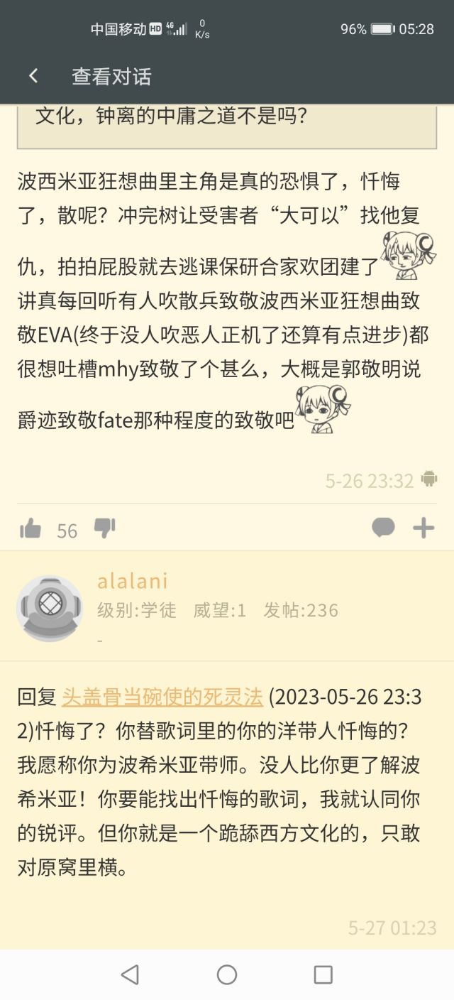

### [热点事件] 这是怎么辉石呢？

Made by ngapost2md (c) ludoux [GitHub Repo](https://github.com/ludoux/ngapost2md)

----

##### 0.[0] \<pid:0\> 2023-07-31 00:25:59 by ZFBXBD
联动某锁帖

一、为什么对散兵这个区区一个纸片人那么大恶意？我们是提瓦特里那个被散兵扇过的愚人众吗？我们是被灭门还被扣上骂名的百目吗？不是，那我们为什么烦他？
为什么很多人对227那个明星有那么大的恶意？他们是认识某明星还是被某明星扇了一巴掌？完全没有，那为什么某明星被人烦？

二、是我心传说任务太好了才没人车吗？就算车有8个月之久吗？二者答案都是不。
是你散兵剧情写的太好我们才不满意吗？这个答案仁者见仁。那为啥比起颇有争议的散兵剧情，公认的那么烂的2.1出的心海传说，在2.2就没人骂了呢？

三、为什么草厨破防呢？为什么散草cp让一部分人破防呢？为什么3.6pv就那么几秒就让很多赛诺玩家担心自推有台词呢？为什么游戏里一句台词都没有的卡维就被洗脑包洗成欠了阿帽一个人情呢？为什么雷神要为其他(500岁)成年人的事情负责呢？

四、为什么珐露珊这个跨越百年所有亲朋离去的人，可以用一句“总有失败的时候”就那么看似轻松实则沉重的带过呢？为什么卢姥爷父亲去世，父亲无法平反且兄弟反目的时候，没有去骑士团大杀四方为父讨公道呢？为什么罗莎莉亚亲即便自杀死恩人，她的名片也写着“那些恩情是她无法回报的罪业”呢？

五、为什么魈业障缠身知道普通人粘上自己没好事，会主动避开人群呢？为什么甘雨可以融不进去人间的情况下，依然兢兢业业打了2000年工呢？这俩为了璃月别说十指熔断，哪怕赴死都抢着上。

六、为什么散兵时刻想着向博士复仇呢？不是往事据已成空了吗？为什么散兵没去蹈妻，那怕在远处远远看着然后露出一丝复杂的神情呢？不是往事剧已成空了吗？

七、为什么女士在周本死前的最后一句话是“从来不需要救赎”呢？为什么公子2.2活动又是怕被九条看见脸，又是不像让辛焱知道自己身份呢？哦对了，3.2宵宫知道了，那为啥现在没有人用2.2和3.2前后矛盾的剧情攻击公子呢？

其他0h的角色厨回答这些问题，散兵厨回答这些问题，你觉得答案会如何呢？

----

##### 1.[8] \<pid:705931932\> 2023-07-31 00:41:27 by 海与风的礼物w
我很反感“散黑”这个词，这是对我的一种贬低。
用这个词就意味着，他()就是冰清玉洁的，只强调我们这些人“黑”他，却不顾他和他的厨子们都干了什么不当人的事。
你不恶心人，我“黑”你干啥？诶？好像全世界都在“黑”他哦？

----

##### 2.[0] \<pid:705932648\> 2023-07-31 00:47:42 by Divestala
旁观者视角吃了好几天的瓜，憋不住下场了，说的不好听务必见谅
依我看来这些角色都各有特色，行事有其合理性，策划想通过鲜明人设来卖卡的目的算是大部分都达到了的。
不为散兵说话，单纯客观事实，目前世界观已被改变，强行跑人脸上去说我是你仇人来砍我似乎也怪怪的。
但退步来讲，这么多喷子也非常合理。因为编剧想明白了太多方向是不可行的，偏偏就没想明白，怎样才是可行的。
因此最近几个版本从露面机会看到的散兵是这副德行，那人见人喷是不为过的。角色是死物没啥办法。策划是闹谈。
外加这些厨子。
虽然我也6+5了，但我非角色厨，单纯的为强度。
而且在我看来一个哲学和史学氛围浓厚的剧情里能给这帮厨子污染成这样是真够&amp;#8482;恶心的。
饭圈文化怎么真就这么无处不在，烦的要死。

----

##### 3.[0] \<pid:705932672\> 2023-07-31 00:47:53 by 归邪SAMA
>[jump](#pid705931932) 海与风的礼物w(2023-07-31 00:41)说:
>我很反感“散黑”这个词，这是对我的一种贬低。 用这个词就意味着，他()就是冰清玉洁的，只强调我们这些人“黑”他，却不顾他和他的厨子们都干了什么不当人的事。 你不恶心人，我“黑”你干啥？诶？好像全世界都在“黑”他哦？[s:ac:羡慕]

什么散黑，我是CP粉

----

##### 4.[0] \<pid:705932756\> 2023-07-31 00:48:37 by 怎样才能不被禁言1
srds，我觉得那贴皮下是社区运营

----

##### 5.[0] \<pid:705933033\> 2023-07-31 00:51:03 by Divestala
>[jump](#pid705932648) Divestala(2023-07-31 00:47) 说: 
>
>旁观者视角吃了好几天的瓜，憋不住下场了，说的不好听务必见谅
>依我看来这些角色都各有特色，行事有其合理性，策划想通过鲜明人设来卖卡的目的算是大部分都达到了的。
>不为散兵说话，单纯客观事实，目前世界观已被改变，强行跑人脸上去说我是你仇人来砍我似乎也怪怪的。
>但退步来讲，这么多喷子也非常合理。因为编剧想明白了太多方向是不可行的，偏偏就没想明白，怎样才是可行的。
>因此最近几个版本从露面机会看到的散兵是这副德行，那人见人喷是不为过的。角色是死物没啥办法。策划是闹谈。
>外加这些厨子。
>虽然我也6+5了，但我

补一句
这个ep 初见没那么细  看到里茶 才知道有这么多道道，确实又是被恶心了一把
我还比较在意剧情连贯性。
如果这个ep单纯是某些内部人士满足一己喜好，不顾前文剧情铺垫 强行要推某些所谓cp的东西
那我说一句某司好似不过分吧？内部都腐烂到这地步了，不管一管就等似吧你们。

----

##### 6.[0] \<pid:705933133\> 2023-07-31 00:51:48 by ZFBXBD
>[jump](#pid705932648) Divestala(2023-07-31 00:47) 说: 
>
>旁观者视角吃了好几天的瓜，憋不住下场了，说的不好听务必见谅
>依我看来这些角色都各有特色，行事有其合理性，策划想通过鲜明人设来卖卡的目的算是大部分都达到了的。
>不为散兵说话，单纯客观事实，目前世界观已被改变，强行跑人脸上去说我是你仇人来砍我似乎也怪怪的。
>但退步来讲，这么多喷子也非常合理。因为编剧想明白了太多方向是不可行的，偏偏就没想明白，怎样才是可行的。
>因此最近几个版本从露面机会看到的散兵是这副德行，那人见人喷是不为过的。角色是死物没啥办法。策划是闹谈。
>外加这些厨子。
>虽然我也6+5了，但我

没错，跑去跟他们说“我是你仇人你来砍我吧”确实很奇怪，所以我主楼用的说辞是“哪怕站在远处远远看一眼露出复杂神情。”
望周知，别误会。

----

##### 7.[0] \<pid:705933590\> 2023-07-31 00:55:37 by Divestala
>[jump](#pid705933133) ZFBXBD(2023-07-31 00:51) 说: 
>
>没错，跑去跟他们说“我是你仇人你来砍我吧”确实很奇怪，所以我主楼用的说辞是“哪怕站在远处远远看一眼露出复杂神情。”
>望周知，别误会。

同意的。但凡有这么个行为也算是做了些正事。身不能至，心里想的很。
这也是人设的正向塑造不是么。我说的正向是符合初始设定的那种。傻逼一个，行事莽撞不计后果，不过敢爱敢恨啥的。
正如公子和弟弟说的，犯了错误就好好道歉。哪怕表露有这个态度也行。

然而呵呵，没有呢。还强行拉个神来配一配。给人喷死都得说句该。

----

##### 8.[0] \<pid:705934271\> 2023-07-31 01:01:52 by 玩c罗玩的
感觉……都是mhy引导的

----

##### 9.[0] \<pid:705934640\> 2023-07-31 01:05:15 by 单影系
>[jump](#pid705932648) Divestala(2023-07-31 00:47) 说: 
>
>旁观者视角吃了好几天的瓜，憋不住下场了，说的不好听务必见谅
>依我看来这些角色都各有特色，行事有其合理性，策划想通过鲜明人设来卖卡的目的算是大部分都达到了的。
>不为散兵说话，单纯客观事实，目前世界观已被改变，强行跑人脸上去说我是你仇人来砍我似乎也怪怪的。
>但退步来讲，这么多喷子也非常合理。因为编剧想明白了太多方向是不可行的，偏偏就没想明白，怎样才是可行的。
>因此最近几个版本从露面机会看到的散兵是这副德行，那人见人喷是不为过的。角色是死物没啥办法。策划是闹谈。
>外加这些厨子。
>虽然我也6+5了，但我

他去找受害者说我是你仇人会让你觉得奇怪，那散兵让黄毛去找受害者说他是仇人不是更奇怪吗？

----

##### 10.[0] \<pid:705934664\> 2023-07-31 01:05:24 by ZFBXBD
>[jump](#pid705934271) 玩c罗玩的(2023-07-31 01:01) 说: 
>
>感觉……都是mhy引导的

玩c罗玩的，mhy引导的，这俩配合的什么好，哥你想笑死我吗

----

##### 11.[0] \<pid:705936885\> 2023-07-31 01:28:10 by 廓尔克蜀黍
散兵的塑造太糟糕，太过割裂

----

##### 12.[0] \<pid:705936952\> 2023-07-31 01:28:55 by tbiph9277
>[jump](#pid705931932) 海与风的礼物w(2023-07-31 00:41) 说: 
>
>我很反感“散黑”这个词，这是对我的一种贬低。
>用这个词就意味着，他()就是冰清玉洁的，只强调我们这些人“黑”他，却不顾他和他的厨子们都干了什么不当人的事。
>你不恶心人，我“黑”你干啥？诶？好像全世界都在“黑”他哦？

怎么能叫我散黑我黑啥了，我只不过把它散干的缺德事复述了一遍就叫黑了吗

----

##### 13.[0] \<pid:705937178\> 2023-07-31 01:31:12 by 某炎
>[jump](#pid705934640) 单影系(2023-07-31 01:05)说:
>[quote][pid=705932648,37200241,1]Reply[/pid] <b>Post by [uid=64930358]Divestala[/uid] (2023-07-31 00:47):</b>  旁观者视角吃了好几天的瓜，憋不住下场了，说的不好听务必见谅 依我看来这些角色都各有特色，行事有其合理性，策划想通过鲜明人设来卖卡的目的算是大部分都达到了的。 不为散兵说话，单纯客观事实，目前世界观已被改变，强行跑人脸上去说我是你仇人来砍我似乎也怪怪的。 但退步来讲，这么多喷子也非常合理。因为编剧想明白了太多方向是不可行的，偏偏就没想明白，怎样才是可行的。 因此最近几个版本从露面机会看到的散兵是这副德行，那人见人喷是不为过的。角色是死物没啥办法。策划是闹谈。 外加这些厨子。 虽然我也6+5了，但我[/quote]他去找受害者说我是你仇人会让你觉得奇怪，那散兵让黄毛去找受害者说他是仇人不是更奇怪吗？

有句讲句，一个完全不认识的陌生人和一个有过硬交情的人相比，后者哪怕是胡扯也是能让人听进去几句的吧

----

##### 14.[0] \<pid:705937561\> 2023-07-31 01:35:44 by tbiph9277
>[jump](#pid705932648) Divestala(2023-07-31 00:47) 说: 
>
>旁观者视角吃了好几天的瓜，憋不住下场了，说的不好听务必见谅
>依我看来这些角色都各有特色，行事有其合理性，策划想通过鲜明人设来卖卡的目的算是大部分都达到了的。
>不为散兵说话，单纯客观事实，目前世界观已被改变，强行跑人脸上去说我是你仇人来砍我似乎也怪怪的。
>但退步来讲，这么多喷子也非常合理。因为编剧想明白了太多方向是不可行的，偏偏就没想明白，怎样才是可行的。
>因此最近几个版本从露面机会看到的散兵是这副德行，那人见人喷是不为过的。角色是死物没啥办法。策划是闹谈。
>外加这些厨子。
>虽然我也6+5了，但我

他去说很怪，那旅行者说就不怪了吗

你设身处地想想，你对着你的好朋友好搭档甚至对你有好感表明心迹的姑娘/小伙说：我跟你说你家的不幸全是个你已经不记得但你应该记得的缺德崽种干的，现在崽种在国外混的很风生水起，他让我给你带句话，实在气不住就去砍他

你就说吧这是什么逆天剧情这比玩意写出来就已经八成表明了旅行者不会说真相，散兵成功完成岁月史书，这一步写出来就他娘的没有“旅行者说实话”的可能，就算小黄毛现在是个想垫随便垫的摄像头都没法顺的下来这一段

----

##### 15.[1] \<pid:705938182\> 2023-07-31 01:43:39 by ZFBXBD
>[jump](#pid705937178) 某炎(2023-07-31 01:31) 说: 
>
>有句讲句，一个完全不认识的陌生人和一个有过硬交情的人相比，后者哪怕是胡扯也是能让人听进去几句的吧

关键不是在于是否让主角带话，关键是散兵本人的想法。看一个人不要看他说了什么，要看他能做什么，或者他有什么一定会做但是还没做的。
倘若真心赎罪，真心忏悔，或者轻一点，真心觉得自己做的不对有一些愧疚。如我文中所说，站在远处露出复杂深色深深地看一眼蹈妻，这也是散兵所做的。
他一没有在言语上直接很明显的表达愧疚感这种态度，二没有在行为上表现出任何对过往愧疚的情绪。

再次强调我的观点，他是否让人传话不是关键，关键是他在态度上和行为上都没有表现出愧疚感。

----

##### 16.[0] \<pid:705938328\> 2023-07-31 01:45:31 by 我御御了
已知里茶馆的成分复杂，大家有目共睹，上次那个流水楼就看出来了
同时在外部大环境性别对立越来越严重的情况下，里茶馆能做到5:5
那么问题来了，这么久了散解找的理由还少吗
到底是什么能够让这么多pg不同的人把分歧都能放在一边，放着好好的游戏不打，就偏偏要泡在这里和ta们作对呢，怎么绘事呢

----

##### 17.[0] \<pid:705938333\> 2023-07-31 01:45:34 by 被暗算的第一天
我是忠实的散草CP粉，官糖一大堆都不用特意抠，多甜的官配啊，我哪里是散嘿？大人冤枉啊

----

##### 18.[0] \<pid:705940251\> 2023-07-31 02:16:51 by Seebird
>[jump](#pid705932648) Divestala(2023-07-31 00:47)说:
>旁观者视角吃了好几天的瓜，憋不住下场了，说的不好听务必见谅 依我看来这些角色都各有特色，行事有其合理性，策划想通过鲜明人设来卖卡的目的算是大部分都达到了的。 不为散兵说话，单纯客观事实，目前世界观已被改变，强行跑人脸上去说我是你仇人来砍我似乎也怪怪的。 但退步来讲，这么多喷子也非常合理。因为编剧想明白了太多方向是不可行的，偏偏就没想明白，怎样才是可行的。 因此最近几个版本从露面机会看到的散兵是这副德行，那人见人喷是不为过的。角色是死物没啥办法。策划是闹谈。 外加这些厨子。 虽然我也6+5了，但我非角色厨，单纯的为强度。 而且在我看来一个哲学和史学氛围浓厚的剧情里能给这帮厨子污染成这样是真够&amp;#8482;恶心的。 饭圈文化怎么真就这么无处不在，烦的要死。

好一个理中客，好一个6+5，游戏里岁月史书，现实也来这一套是吧，鉴定为被哪个sj夺舍了

----

##### 19.[0] \<pid:705940702\> 2023-07-31 02:25:41 by nanamisamas
拙劣的画作让人看一眼就难受，我相信任何头脑清澈的人在看到()的所做所为时，都会感慨他的塑造之矛盾和恶心

为了寄托某种扭曲情感的容器
为了满足小资文案的自我意淫的精神星奴
为了显示自己的卓而不凡而妄为的铁证

没有任何弧光可言，没有现实的映照，再扭曲的生活也刻画不出如此丑态，再多笔墨也无法诉说这个角色的失败

在诸多作品中，我们对某些角色怀抱恶意，是因为他们手段卑劣，不知廉耻，作恶多端，精于诡谲，但从没有过一个角色兼具卑劣懦弱滑稽丑陋乃至毫无形态

算了，不编了，反正就是一坨答辩

----

##### 20.[0] \<pid:705940725\> 2023-07-31 02:26:01 by Divestala
>[jump](#pid705940251) Seebird(2023-07-31 02:16) 说: 
>
>好一个理中客，好一个6+5，游戏里岁月史书，现实也来这一套是吧，鉴定为被哪个sj夺舍了

看人评论最好带脑子外加看完整。我什么地方提到现实里也岁月史书了

----

##### 21.[1] \<pid:705941083\> 2023-07-31 02:31:49 by Seebird
>[jump](#pid705940725) Divestala(2023-07-31 02:26)说:
>[quote][pid=705940251,37200241,1]Reply[/pid] <b>Post by [uid=62039536]Seebird[/uid] (2023-07-31 02:16):</b>  好一个理中客，好一个6+5，游戏里岁月史书，现实也来这一套是吧，鉴定为被哪个sj夺舍了[s:ac:偷笑][/quote]看人评论最好带脑子外加看完整。我什么地方提到现实里也岁月史书了

我看得很完整
“不为散兵说话，单纯客观事实，目前世界观已被改变，强行跑人脸上去说我是你仇人来砍我似乎也怪怪的。”
你在批评别人脑子的时候，可能没发现自己脑子被坐在屁股底下了

----

##### 22.[0] \<pid:705941212\> 2023-07-31 02:33:10 by Divestala
>[jump](#pid705941083) Seebird(2023-07-31 02:31) 说: 
>
>我看得很完整
>“不为散兵说话，单纯客观事实，目前世界观已被改变，强行跑人脸上去说我是你仇人来砍我似乎也怪怪的。”
>你在批评别人脑子的时候，可能没发现自己脑子被坐在屁股底下了

还是建议你先把自己的脑袋从坐垫下面掏出来再仔细看看。这说的是剧情里。世界观改变了，与五传相关的事件被复写，这时候上去说一句真相，谁知道是个怎么回事。

----

##### 23.[0] \<pid:705941600\> 2023-07-31 02:38:51 by Seebird
>[jump](#pid705941212) Divestala(2023-07-31 02:33) 说: 
>
>还是建议你先把自己的脑袋从坐垫下面掏出来再仔细看看。这说的是剧情里。世界观改变了，与五传相关的事件被复写，这时候上去说一句真相，谁知道是个怎么回事。

连剧情都没看，本来想问你是不是米文案套皮来着，我看你连这都不配你以为那个3.3被打碎的花瓶是什么意思？世界树除了记忆会改变任何东西？到你这里就变成了“世界观的改变”

看来你的屁股还挺沉，脑子给坐变形了

----

##### 24.[0] \<pid:705941752\> 2023-07-31 02:41:01 by Divestala
>[jump](#pid705941600) Seebird(2023-07-31 02:38) 说: 
>
>连剧情都没看，本来想问你是不是米文案套皮来着，我看你连这都不配你以为那个3.3被打碎的花瓶是什么意思？世界树除了记忆会改变任何东西？到你这里就变成了“世界观的改变”
>
>看来你的屁股还挺沉，脑子给坐变形了

麻了。所谓人心观念以及主观历史的改变在你这完全不发育的小脑里面看来是理解不出来什么东西了，还是闭掉这个话题吧，再见

----

##### 25.[0] \<pid:705942134\> 2023-07-31 02:47:59 by 梦里寻欢-
>[jump](#pid705934640) 单影系(2023-07-31 01:05) 说: 
>
>他去找受害者说我是你仇人会让你觉得奇怪，那散兵让黄毛去找受害者说他是仇人不是更奇怪吗？

都奇怪，编剧明显是制造了矛盾却不知道如何解决，只能用拙劣的手段捂着不让爆发，后续旅行者都见过神里绫华和万叶了，你咋不让我告诉他们呢？

----

##### 26.[0] \<pid:705946710\> 2023-07-31 05:17:08 by zhy68872
>[jump](#pid705941212) Divestala(2023-07-31 02:33) 说: 
>
>还是建议你先把自己的脑袋从坐垫下面掏出来再仔细看看。这说的是剧情里。世界观改变了，与五传相关的事件被复写，这时候上去说一句真相，谁知道是个怎么回事。

你把别人爹妈杀光再把人家孩子毒失忆，被黄毛揪出来后还委屈的说；人家都忘了跑去认罪怪怪的耶

----

##### 27.[0] \<pid:705946863\> 2023-07-31 05:26:46 by 单影系
>[jump](#pid705942134) 梦里寻欢-(2023-07-31 02:47) 说: 
>
>都奇怪，编剧明显是制造了矛盾却不知道如何解决，只能用拙劣的手段捂着不让爆发，后续旅行者都见过神里绫华和万叶了，你咋不让我告诉他们呢？

他甚至不是让我们直接去找，祂说的还是“你大可以去告诉他们”，如果是可以选择的，我肯定选择当场报废他。

----

##### 28.[0] \<pid:705946966\> 2023-07-31 05:33:18 by 缩到刀里
说句实话，感觉sj可能看不懂lz发的东西。毕竟可能是准备小升初的小初升，可能连语序逻辑一类都不懂的

----

##### 29.[0] \<pid:705946967\> 2023-07-31 05:33:20 by futurewqx
散姐锐评，没有人比我更懂波西米亚！

后面还有更典的“我在美国工作”之类的没截。码也懒得打了，因为此人在和我对线以后就再也没有信的nga发言了，大抵是转世投胎了吧

----

##### 30.[1] \<pid:705947012\> 2023-07-31 05:35:38 by 缩到刀里
>[jump](#pid705946967) futurewqx(2023-07-31 05:33) 说: 
>
>散姐锐评，没有人比我更懂波西米亚！
>
>
>
>
>后面还有更典的“我在美国工作”之类的没截。码也懒得打了，因为此人在和我对线以后就再也没有新的nga发言了，大抵是转世投胎了吧

《伞在欧美很火》真敢说啊赔钱货

----

##### 31.[0] \<pid:705988594\> 2023-07-31 11:01:27 by Bean＆bean
补点我的看法，其他角色的问题都属于剧情行为逻辑上的缺点，即：也许角色在此时不应该有这些行为。但散兵的问题在于(以我个人而言)：它违反了我自己一直所坚持的善恶有报的道德底线，所以我怎么看它都烦。

----

##### 32.[0] \<pid:705989229\> 2023-07-31 11:03:51 by ToutSeul
>[jump](#pid705932648) Divestala(2023-07-31 00:47):

哲学...史学...?!
你这个问题光骂二逼厨子应该无法解决吧

----

##### 33.[0] \<pid:705990310\> 2023-07-31 11:08:00 by Divestala
>[jump](#pid705989229) ToutSeul(2023-07-31 11:03) 说: 
>
>哲学...史学...?!
>你这个问题光骂二逼厨子应该无法解决吧

没事，问题不大，那些味道重的厨子的问题几乎是没法解决的，我只管骂我的，骂爽了就行了。
我想解决的一直是我自己的问题，他们嘛，我只能说医生能救的是病人不是死人

----

##### 34.[0] \<pid:705991042\> 2023-07-31 11:10:40 by ToutSeul
>[jump](#pid705990310) Divestala(2023-07-31 11:08)说:
>[quote][pid=705989229,37200241,2]Reply[/pid] <b>Post by [uid=60635158]ToutSeul[/uid] (2023-07-31 11:03):</b>  哲学...史学...?! 你这个问题光骂二逼厨子应该无法解决吧[s:a2:哦嗬嗬嗬][/quote]没事，问题不大，那些味道重的厨子的问题几乎是没法解决的，我只管骂我的，骂爽了就行了。 我想解决的一直是我自己的问题，他们嘛，我只能说医生能救的是病人不是死人

我单纯觉得你说剧情和哲学与史学有关联这件事情就很扯...
这xjb写的剧情根本和这两个学科不沾边啊？

----

##### 35.[0] \<pid:706000904\> 2023-07-31 11:50:07 by Divestala
>[jump](#pid705991042) ToutSeul(2023-07-31 11:10) 说: 
>
>我单纯觉得你说剧情和哲学与史学有关联这件事情就很扯...
>这xjb写的剧情根本和这两个学科不沾边啊？

问题不能当不存在，也不能以偏概全。有病的地方无限放大不影响写的漂亮的内容作为经典留存。前期剧情再好也不可能掩盖当下就是有一个内部sb和一群饭圈若至跳梁作妖。我一直是这么看待这些事情的。
无论是世界布局之大还是个人情境之小，从头看下来其实有不少可圈点之处。时间带来的意志动摇、凡人的愿望发出的光亮、伟人终究毁于zz权谋、捏了几千年的沙漠诸国战争以及靠剧情映射的一些当下现实问题；高岭，哲平，伯阳等等人物的塑造等等，都还挺发人深思的。
我之前一直以为整个编剧团队都是很棒的，能写出这些东西来，那么文学功底、对历史了解的沉淀和对一些哲学问题的思考，高度都很OK，值得看一看并站在他们的观点去审视他们提出的这些问题。
不过确实是任何地方都总有污秽和渣子。这一点看来永远不会改变。
---
所以回答你的问题。我不可能因为这些漂亮的内容就会反过头觉得猛干是个正常人，但也绝无会因为这次的瓜就把一个三年下来的游戏批到一无是处。

想喷就喷吧，我一直坚信这样去评价才是中肯的。有亮眼处就要好好夸赞，有蠢货当道就要喷的毫不留情。
这年头，喷子也要讲基本法啊。

----

##### 36.[0] \<pid:706005222\> 2023-07-31 12:07:53 by 程品
>[jump](#pid706000904) Divestala(2023-07-31 11:50) 说: 
>
>问题不能当不存在，也不能以偏概全。有病的地方无限放大不影响写的漂亮的内容作为经典留存。前期剧情再好也不可能掩盖当下就是有一个内部sb和一群饭圈若至跳梁作妖。我一直是这么看待这些事情的。
>无论是世界布局之大还是个人情境之小，从头看下来其实有不少可圈点之处。时间带来的意志动摇、凡人的愿望发出的光亮、伟人终究毁于zz权谋、捏了几千年的沙漠诸国战争以及靠剧情映射的一些当下现实问题；高岭，哲平，伯阳等等人物的塑造等等，都还挺发人深思的。
>我之前一直以为整个编剧团队都是很棒的，能写出这些东西来，那么文学功底

里版最初凝聚的标志之一就是erzj考据，对于夹带erzj和比例尺的歪屁股文案就应该先骂死再来写墓志铭

----

##### 37.[0] \<pid:706007678\> 2023-07-31 12:18:50 by 璃月优质牛
>[jump](#pid705932648) Divestala(2023-07-31 00:47) 说: 
>
>旁观者视角吃了好几天的瓜，憋不住下场了，说的不好听务必见谅
>依我看来这些角色都各有特色，行事有其合理性，策划想通过鲜明人设来卖卡的目的算是大部分都达到了的。
>不为散兵说话，单纯客观事实，目前世界观已被改变，强行跑人脸上去说我是你仇人来砍我似乎也怪怪的。
>但退步来讲，这么多喷子也非常合理。因为编剧想明白了太多方向是不可行的，偏偏就没想明白，怎样才是可行的。
>因此最近几个版本从露面机会看到的散兵是这副德行，那人见人喷是不为过的。角色是死物没啥办法。策划是闹谈。
>外加这些厨子。
>虽然我也6+5了，但我

“不为其他说话”
“喷子”

好高傲啊这位朋友，你能不能从理查滚出去啊

----

##### 38.[0] \<pid:706019365\> 2023-07-31 13:16:19 by 狐狸吃团子
>[jump](#pid705946967) futurewqx(2023-07-31 05:33) 说: 
>
>散姐锐评，没有人比我更懂波西米亚！
>
>
>
>
>后面还有更典的“我在美国工作”之类的没截。码也懒得打了，因为此人在和我对线以后就再也没有新的nga发言了，大抵是转世投胎了吧

前面说散在欧美人气高，人设是从波西米亚狂想曲汲取的，你们理解不了那就爱玩玩不玩滚，后面给你扣跪舔西方文化的帽子，不带脑子的饭圈话术太6了，在美国工作？在厂里打螺丝差不多
散解总以为自己说什么别人信什么，但别人从它们的语言和行为上都能看出来它们是nt，反驳一句它们就哭喊着你散黑，然后给你扣各种帽子

----

##### 39.[0] \<pid:706021984\> 2023-07-31 13:29:59 by 狐狸吃团子
>[jump](#pid705932648) Divestala(2023-07-31 00:47) 说: 
>
>旁观者视角吃了好几天的瓜，憋不住下场了，说的不好听务必见谅
>依我看来这些角色都各有特色，行事有其合理性，策划想通过鲜明人设来卖卡的目的算是大部分都达到了的。
>不为散兵说话，单纯客观事实，目前世界观已被改变，强行跑人脸上去说我是你仇人来砍我似乎也怪怪的。
>但退步来讲，这么多喷子也非常合理。因为编剧想明白了太多方向是不可行的，偏偏就没想明白，怎样才是可行的。
>因此最近几个版本从露面机会看到的散兵是这副德行，那人见人喷是不为过的。角色是死物没啥办法。策划是闹谈。
>外加这些厨子。
>虽然我也6+5了，但我

“角色都各有特色，行事有其合理性”
散兵去至冬呆了几百年后回来灭杀雷电五传的合理性是？

“不为散兵说话，单纯客观事实，目前世界观已被改变，强行跑人脸上去说我是你仇人来砍我似乎也怪怪的。”
不为散兵说话，单纯客观事实，目前世界观已改变，强行把受害者记忆篡改成他们自己就是加害者怪怪的。

“一个哲学和史学氛围浓厚的剧情里能给这帮厨子污染成这样是真够恶心的”
哲学：尼采超人？超人并非徒具蛮力的勇者或残酷的暴君，而是勇于自我超越、自我批判及价值重估的人。显然散兵不是
史学：岁月史书，改变不了史实的情况下修改人的意识扭曲历史记忆从而达到逃避罪责的目的。散兵冲树的目的是删除自己也是一种逃避，但删除自我的目的未达到并且修改了他人意识的情况下他也并未表现出任何懊悔和亏欠，可推测他本来目的就是逃避责任。厨子污染环境确实，但散兵是源头。

