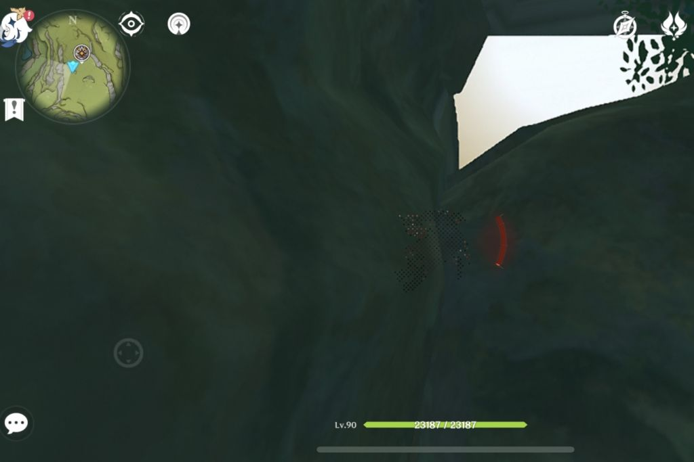
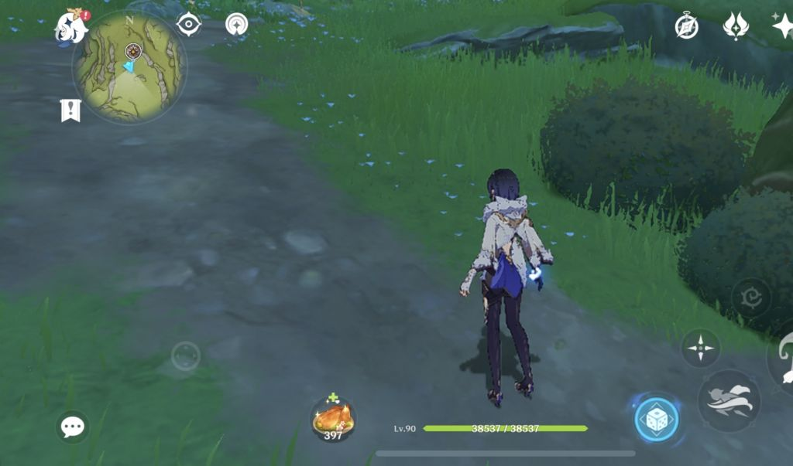
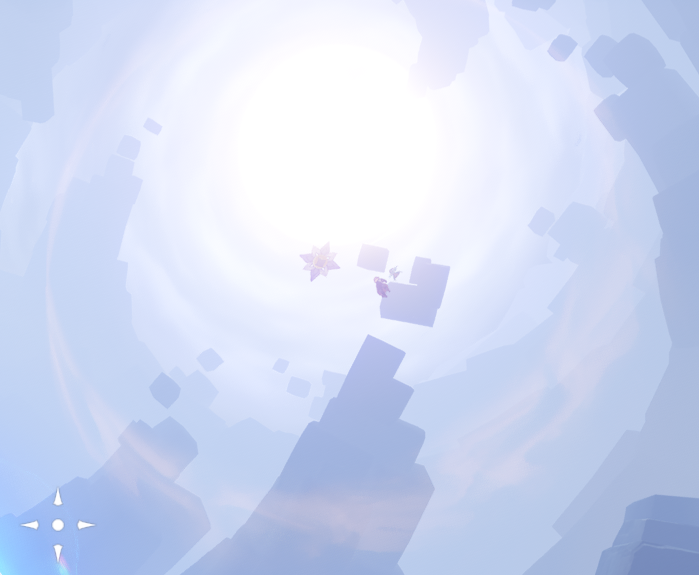
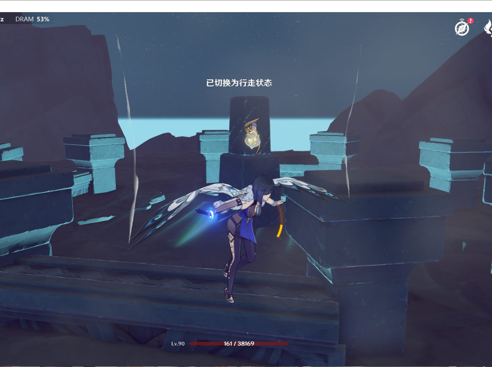
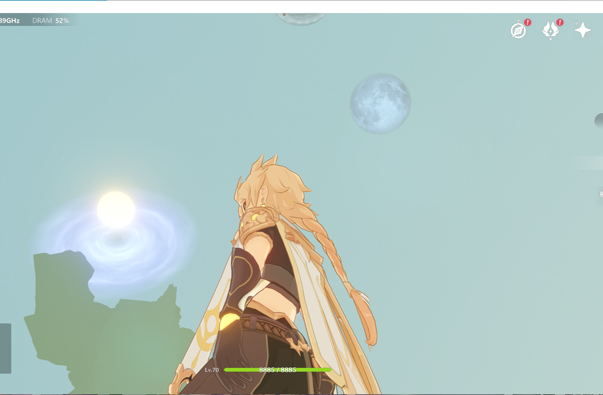
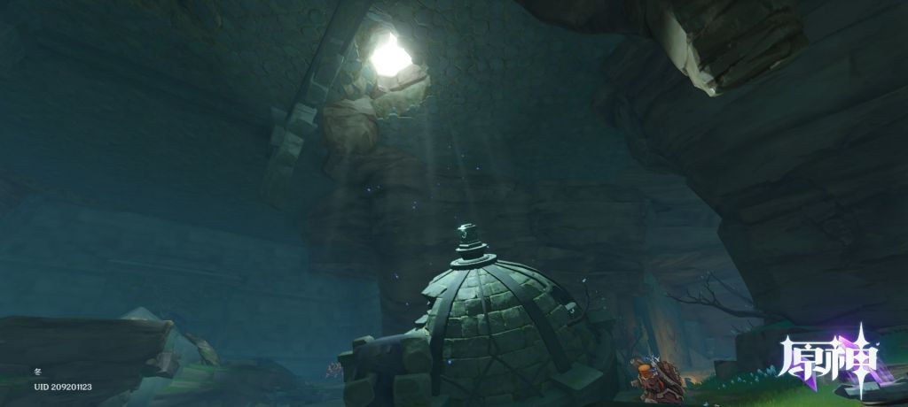

### [不吐不快]群友的问题触及了我的知识盲区

Made by ngapost2md (c) ludoux [GitHub Repo](https://github.com/ludoux/ngapost2md)

----

##### 0.[0] \<pid:0\> 2023-07-31 01:31:43 by 闲人闲事儿
在龙兽的洞里有一个可能大多数人(包括我)都没怎么注意的细节，那就是在龙兽洞窟顶有一个山洞。

然后这位水友选择从上方过去看看，结果同一位置却是

现在的问题是，这个顶上的洞通往哪里？

----

##### 1.[0] \<pid:705937373\> 2023-07-31 01:33:40 by bzbjzj
打光而已

----

##### 2.[0] \<pid:705937392\> 2023-07-31 01:33:48 by 残血之殇
假的洞吧

----

##### 3.[0] \<pid:705937464\> 2023-07-31 01:34:36 by 淮水东边旧时月
好像有点印象无相草顶上的洞是不是也是这样的

----

##### 4.[0] \<pid:705937584\> 2023-07-31 01:36:10 by 今锁朱楼
贴图，在提瓦特的二次元平面里，三次元旅行者没有进入资格。
我试过朝着各个洞顶爬，绝大多数都是贴图。

----

##### 5.[0] \<pid:705937596\> 2023-07-31 01:36:17 by FeTJIPIN
假的洞，沙漠地图里面一堆地宫也有洞，打光而已。

----

##### 6.[0] \<pid:705937621\> 2023-07-31 01:36:35 by 怡_寶
答案是吸顶灯，甚至与天空隔着海水和海床的恒常机关阵列也是这样

----

##### 7.[0] \<pid:705937673\> 2023-07-31 01:37:16 by kmoretti
完了 看到夜兰的图就想起兰豆了

----

##### 8.[0] \<pid:705937777\> 2023-07-31 01:38:30 by RebbitX
假的洞很多啊，起码从3.0开始就大量出现了，应该是因为洞外洞内地图是分开制作的，而洞内又有打光的需求。

----

##### 9.[0] \<pid:705938037\> 2023-07-31 01:41:46 by 梅子昆布茶
之前层岩是不是也有哪个角落大家这么问过

----

##### 10.[0] \<pid:705944711\> 2023-07-31 03:56:42 by 凝紫寒C
>[jump](#pid705938037) 梅子昆布茶(2023-07-31 01:41) 说: 
>
>之前层岩是不是也有哪个角落大家这么问过

层岩有棵树吧……
当时我费半天劲往上爬结果爬了个寂寞

----

##### 11.[0] \<pid:705945740\> 2023-07-31 04:27:41 by 普露璐特
璃月开始就有假洞，爬上去发现是贴图。

----

##### 12.[0] \<pid:705945969\> 2023-07-31 04:37:36 by 火郭 Electronica
现在的地图，假洞多到都有人不知道爆炎树头上是个真洞了

----

##### 13.[0] \<pid:705946127\> 2023-07-31 04:45:08 by Dawilight
老头环这种游戏，地底世界的位置都是和上层世界一一对应的，甚至王城，下水道，地底墓穴，深根底层的垂直关系都是严格对应的。
这就是差距。  之前在知乎和人对线，那人非要说老头环被原爆的时候就举了这个例子。

----

##### 14.[0] \<pid:705946629\> 2023-07-31 05:12:19 by YVANLAU
>[jump](#pid705946127) Dawilight(2023-07-31 04:45) 说: 
>
>老头环这种游戏，地底世界的位置都是和上层世界一一对应的，甚至王城，下水道，地底墓穴，深根底层的垂直关系都是严格对应的。
>这就是差距。  之前在知乎和人对线，那人非要说老头环被原爆的时候就举了这个例子。

环被原爆是认真的？

----

##### 15.[0] \<pid:705946750\> 2023-07-31 05:19:54 by 红苦艾Clover
奇怪这个的是没去过鹤观知比山地下遗迹吗
海底的遗迹 顶上贴透光贴图 究极逆天

----

##### 16.[0] \<pid:705947057\> 2023-07-31 05:38:30 by 阿青青青青呀
侧面说明层岩地图是巅峰
矿区和卡bug外的螺旋山体是一片完整可攀爬
中间只有一道空气墙隔着

倒吊水池的上面是镜像的凸状建筑，可以下去

寒天之钉上面有个洞口也可以下去

----

##### 17.[0] \<pid:705947344\> 2023-07-31 05:54:57 by Dotless
原很多这种地下天井光的场景，但无一不是假的，地图上对应地点根本没有洞。最离谱的例子是水无相...

----

##### 18.[0] \<pid:705948593\> 2023-07-31 06:42:01 by 格里兹纳特
虚假之天.jpg

----

##### 19.[0] \<pid:705948948\> 2023-07-31 06:52:10 by 月小炎
>[jump](#pid705946629) YVANLAU(2023-07-31 05:12)说:
>[quote][pid=705946127,37200649,1]Reply[/pid] <b>Post by [uid=65106485]Dawilight[/uid] (2023-07-31 04:45):</b>  老头环这种游戏，地底世界的位置都是和上层世界一一对应的，甚至王城，下水道，地底墓穴，深根底层的垂直关系都是严格对应的。 这就是差距。  之前在知乎和人对线，那人非要说老头环被原爆的时候就举了这个例子。[/quote][s:ac:喷]环被原爆是认真的？

结晶眼里不是什么游戏都能被爆
原风评差到底是厂商打压还是nt太多的路人心里有数的

----

##### 20.[0] \<pid:705949083\> 2023-07-31 06:55:13 by Lilith330
假洞最早我记得是稻妻地图就开始了，那会地图没分层，鹤观有个支线任务显示在海上，很多人绕着那地方转了半天也不知道怎么下去，下去之后发现那地方天花板确实是有洞的
那会主版还有一堆人辩论呢，3.0后见怪不怪了，到处都是假洞打光

----

##### 21.[0] \<pid:705949795\> 2023-07-31 07:11:03 by 月华丛云
他在出口搞那么长的洞就是为了加载后面那个场景，所以必不可能在这边给你开洞的，会造成卡顿，优化不了。树那边可以是因为场景没有这边复杂。  可以说这个是为了效果牺牲体验了。

----

##### 21.[0] \<pid:705949795\> 2023-07-31 07:11:03 by 月华丛云
他在出口搞那么长的洞就是为了加载后面那个场景，所以必不可能在这边给你开洞的，会造成卡顿，难以优化。这也是为什么森林书里大部分复杂场景前面你都要跑一段狭窄没什么东西的路才能看到。冰树那边可以是因为场景没有这边复杂。  可以说这个是为了效果牺牲体验了。  你在洞里面的时候外面的场景是被卸载掉的，所以里面的场景可以无限延伸也不会影响到外面。当你朝着外面跑接近外面的时候才会开始加载大世界地图，出去之后会卸载掉洞里的场景。如果要能让你直接跳进去，只能像层岩巨渊那样做得很高，跳进去的时候能有时间加载场景。

----

##### 22.[0] \<pid:705950695\> 2023-07-31 07:25:57 by 海豹嘴里的咸鱼
>[jump](#pid705944711) 凝紫寒C(2023-07-31 03:56) 说: 
>
>层岩有棵树吧……
>当时我费半天劲往上爬结果爬了个寂寞

现在书那个洞爬出来会到须弥，因为森林书把坑填了
其余的就没这个运气了

----

##### 23.[0] \<pid:705954613\> 2023-07-31 08:10:31 by Axcend
是假洞
印象比较深刻的是璃月有一个有宝箱的小山洞里第一次看到，还有就是沙地底下的山洞里也有

----

##### 24.[0] \<pid:705964128\> 2023-07-31 09:10:53 by rindunica
>[jump](#pid705947344) Dotless(2023-07-31 05:54) 说: 
>
>原很多这种地下天井光的场景，但无一不是假的，地图上对应地点根本没有洞。最离谱的例子是水无相...  所以说他这个开放世界做的假中假。

我开放世界里有几顶吊灯应该不是问题吧

----

##### 25.[0] \<pid:705965182\> 2023-07-31 09:16:02 by 野猫布鲁斯
答案是发光苔藓，这波啊，这波是致敬

----

##### 26.[0] \<pid:705965919\> 2023-07-31 09:19:51 by HitsugayaToushirou
不仅是龙兽，桓那兰纳的大洋葱上面的光也是假的

----

##### 27.[0] \<pid:705966646\> 2023-07-31 09:23:25 by momookyk
>[jump](#pid705946629) YVANLAU(2023-07-31 05:12) 说: 
>
>环被原爆是认真的？

椅子不能坐，墙壁不能爬是这样的

----

##### 28.[0] \<pid:705966706\> 2023-07-31 09:23:42 by 一只二一四啊
>[jump](#pid705946127) Dawilight(2023-07-31 04:45) 说: 
>
>老头环这种游戏，地底世界的位置都是和上层世界一一对应的，甚至王城，下水道，地底墓穴，深根底层的垂直关系都是严格对应的。
>这就是差距。  之前在知乎和人对线，那人非要说老头环被原爆的时候就举了这个例子。

出层岩的时候我本来以为会开始慢慢像魂系的地图水平靠近，然后

----

##### 29.[0] \<pid:705966831\> 2023-07-31 09:24:17 by 最近很郁闷
>[jump](#pid705947344) Dotless(2023-07-31 05:54) 说: 
>
>原很多这种地下天井光的场景，但无一不是假的，地图上对应地点根本没有洞。最离谱的例子是水无相...  所以说他这个开放世界做的假中假。

水无相还好吧，我记得上面有个瀑布洞可以跳下去，可惜不能从里面上来

----

##### 30.[0] \<pid:705967948\> 2023-07-31 09:29:55 by 鹰眼且狩猎
鹤观的知比山与千来神社的地下遗迹中的上方空洞对应的是哪里呢？
[url](https://ngabbs.com/read.php?tid=30091600)

我以前也发过类似的情况来着
层岩地图更神奇，甚至可以通过缝隙爬到里世界去，在里面乱逛，可惜上次我再去已经发现那个缝隙卡不进去了

----

##### 31.[0] \<pid:705983769\> 2023-07-31 10:41:06 by 無鐵炮娘
>[jump](#pid705947344) Dotless(2023-07-31 05:54) 说: 
>
>原很多这种地下天井光的场景，但无一不是假的，地图上对应地点根本没有洞。最离谱的例子是水无相...  所以说他这个开放世界做的假中假。

大部分是假的,但是无相水那个是真的..从海面上可以找到那个瀑布的入口.
所以其实无相水有俩入口

----

##### 32.[0] \<pid:705986773\> 2023-07-31 10:53:55 by 巷里住风
>[jump](#pid705949795) 月华丛云(2023-07-31 07:11) 说: 
>
>他在出口搞那么长的洞就是为了加载后面那个场景，所以必不可能在这边给你开洞的，会造成卡顿，难以优化。这也是为什么森林书里大部分复杂场景前面你都要跑一段狭窄没什么东西的路才能看到。冰树那边可以是因为场景没有这边复杂。  可以说这个是为了效果牺牲体验了。  你在洞里面的时候外面的场景是被卸载掉的，所以里面的场景可以无限延伸也不会影响到外面。当你朝着外面跑接近外面的时候才会开始加载大世界地图，出去之后会卸载掉洞里的场景。如果要能让你直接跳进去，只能像层岩巨渊那样做得很高，跳进去的时候能有时间加载场景。 

那多放几个发光蘑菇什么的不能达到类似的效果吗？或者整点什么发光苔藓之类的。

----

##### 33.[0] \<pid:705987380\> 2023-07-31 10:56:30 by Kiddor
>[jump](#pid705986773) 巷里住风(2023-07-31 10:53)说:
>[quote][pid=705949795,37200649,2]Reply[/pid] <b>Post by [uid=60526800]月华丛云[/uid] (2023-07-31 07:11):</b>  他在出口搞那么长的洞就是为了加载后面那个场景，所以必不可能在这边给你开洞的，会造成卡顿，难以优化。这也是为什么森林书里大部分复杂场景前面你都要跑一段狭窄没什么东西的路才能看到。冰树那边可以是因为场景没有这边复杂。  可以说这个是为了效果牺牲体验了。  你在洞里面的时候外面的场景是被卸载掉的，所以里面的场景可以无限延伸也不会影响到外面。当你朝着外面跑接近外面的时候才会开始加载大世界地图，出去之后会卸载掉洞里的场景。如果要能让你直接跳进去，只能像层岩巨渊那样做得很高，跳进去的时候能有时间加载场景。 [/quote]那多放几个发光蘑菇什么的不能达到类似的效果吗？或者整点什么发光苔藓之类的。

可能是底层代码的问题罢

----

##### 34.[0] \<pid:705987467\> 2023-07-31 10:56:54 by 冷清的夜i
>[jump](#pid705946127) Dawilight(2023-07-31 04:45) 说: 
>
>老头环这种游戏，地底世界的位置都是和上层世界一一对应的，甚至王城，下水道，地底墓穴，深根底层的垂直关系都是严格对应的。
>这就是差距。  之前在知乎和人对线，那人非要说老头环被原爆的时候就举了这个例子。

这也爆那也爆
结晶的日常就是 妈的 跟全世界爆了

----

##### 35.[0] \<pid:705993628\> 2023-07-31 11:20:59 by 巷里住风
>[jump](#pid705987380) Kiddor(2023-07-31 10:56) 说: 
>
>可能是底层代码的问题罢

不，这应该归类为照顾手机。

----

##### 36.[0] \<pid:705994037\> 2023-07-31 11:22:35 by 大魔王的小忠犬
是LED灯光

----

##### 37.[0] \<pid:705994463\> 2023-07-31 11:24:15 by rosa__canina
天空灯，鹤观就有了

----

##### 38.[0] \<pid:706050690\> 2023-07-31 15:51:56 by 8991aiih
>[jump](#pid705948948) 月小炎(2023-07-31 06:52):

这也能爆？
下一步是不是去跟mono社比地图设计啊，正好也是二次元开放世界

----

##### 39.[0] \<pid:706057016\> 2023-07-31 16:20:38 by jasmine4869
之前说为什么不做分层地图，说这样就暴露出上下两层完全不在一个空间里连不起来

----

##### 40.[0] \<pid:706058703\> 2023-07-31 16:28:09 by 月小炎
>[jump](#pid706050690) 8991aiih(2023-07-31 15:51)说:
><b>Reply to [pid=705948948,37200649,1]Reply[/pid] Post by [uid=10515670]月小炎[/uid] (2023-07-31 06:52)</b>  这也能爆？[s:ac:喷] 下一步是不是去跟mono社比地图设计啊，正好也是二次元开放世界[s:ac:哭笑]

昨天S1有个钓鱼楼，刚好爆杀完xb3就被狗叔杀了

