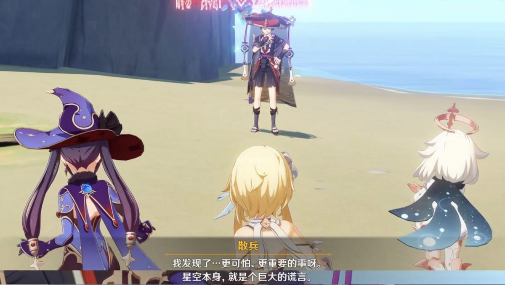
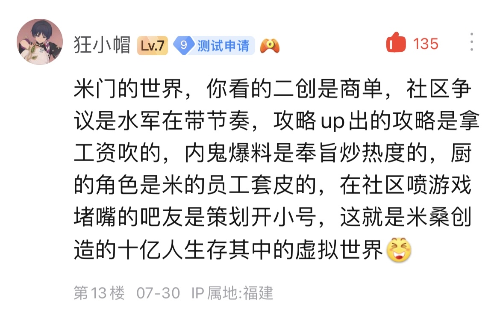

### [不吐不快]星空本身，就是一个巨大的谎言。

Made by ngapost2md (c) ludoux [GitHub Repo](https://github.com/ludoux/ngapost2md)

----

##### 0.[1] \<pid:0\> 2023-07-31 08:30:07 by HitsugayaToushirou
联动一下刚刚在版里看到的贴子，
“我发现了……更可怕，更重要的事呀。”
“星空本事，就是一个巨大的谎言。”
这是散兵在未归的熄星中说的话。
虚假之天在游戏里已经不再提了，但玩家在现实里发现原来米哈游营造的信息茧房才是真正的虚假之天。你看到的一切都是米哈游营造出来的。
说来也巧，恰好是3.3-3.6的散兵剧情让大家醒悟的。
我一直在想究竟什么是虚假之天，散兵，原来这才是你说的虚假之天啊。

----

##### 1.[0] \<pid:705959381\> 2023-07-31 08:44:08 by fcvqz421
#雷散因为指出楚门生活的世界是假的，直接被开除，换了个演员#

怪不得这么恨雷散解呢

----

##### 2.[0] \<pid:705960323\> 2023-07-31 08:49:54 by 晓美ker
星空怎么你了

----

##### 3.[1] \<pid:705960480\> 2023-07-31 08:50:48 by 路人名不详
星空怎么你了陶门

----

##### 4.[0] \<pid:705960719\> 2023-07-31 08:52:11 by Torchka123
sb因为发现一切都是米在主导，于是加入其中，成为了太子

----

##### 5.[1] \<pid:705960965\> 2023-07-31 08:53:41 by 格里兹纳特
但是，玩家是想要偶尔地抽离开现实，在虚拟世界中获得短暂静谧的呀
结果在虚拟世界里battle？然后大口吃巧克力味shit吗？
本体拉了就是拉了，金玉其外败絮其中还不能说吗

----

##### 6.[0] \<pid:705961323\> 2023-07-31 08:55:45 by bluebayouplus
当年派任务的丑角甚至不叫皮耶罗，人设估计早就改过无数次了

----

##### 7.[0] \<pid:705963209\> 2023-07-31 09:06:19 by rindunica
有一说一，虚假之天这个好像3.2主线结束博士提了一嘴

----

##### 8.[1] \<pid:705963297\> 2023-07-31 09:06:43 by 狐狸吃团子
窥屏的编剧：早就告诉过你们，现在才反应过来，我乐子都看几轮了

----

##### 9.[0] \<pid:706522905\> 2023-08-02 18:07:50 by 壬娄丁壬甘康
>[jump](#pid705961323) bluebayouplus(2023-07-31 08:55) 说: 
>
>当年派任务的丑角甚至不叫皮耶罗，人设估计早就改过无数次了

苍白之火里不是就叫皮耶罗了吗

----

##### 10.[0] \<pid:706523470\> 2023-08-02 18:10:38 by Dotless
IT JUST WORKS!

----

##### 11.[0] \<pid:706528333\> 2023-08-02 18:33:59 by 冬末繁雪
这下真的从世界之外取得否定世界的力量了

----

##### 12.[0] \<pid:706562723\> 2023-08-02 21:49:57 by 易居壳
啊，那时候还正常的其他

----

##### 13.[1] \<pid:706599058\> 2023-08-03 03:51:31 by bluebayouplus
>[jump](#pid706522905) 壬娄丁壬甘康(2023-08-02 18:07) 说: 
>
>苍白之火里不是就叫皮耶罗了吗

1.1公子角色故事里叫佩德里诺(英语)，1.4统一改了

----

##### 14.[0] \<pid:706600225\> 2023-08-03 04:46:25 by 云有时
#散兵发现了真相，牺牲了自己，致力于让大家走出米门的世界#

