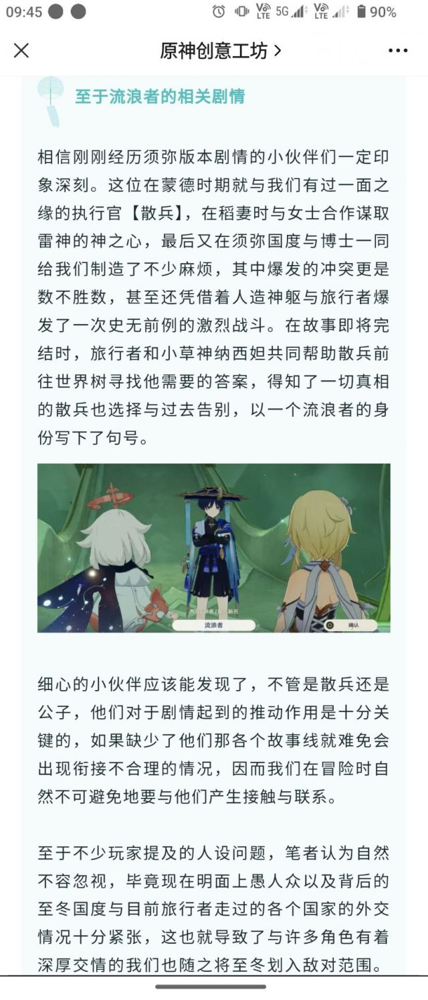
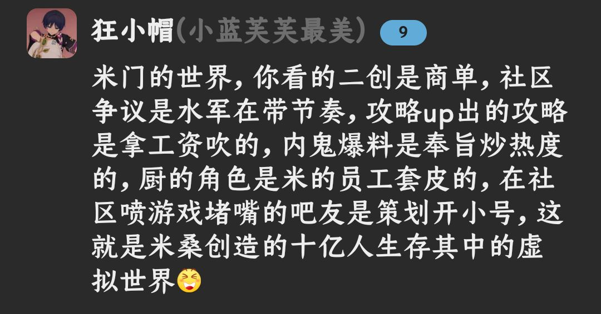

### [不吐不快]放以前我只会觉得这是营销号在灌水

Made by ngapost2md (c) ludoux [GitHub Repo](https://github.com/ludoux/ngapost2md)

----

##### 0.[3] \<pid:0\> 2023-07-31 10:02:10 by RebbitX
现在来看，明显就是收了钱写的商稿吧。拿公子做垫子不说，甚至紧接着的下一篇就是吹铃铛的，演都不带演

洗地水平还很次，变流浪者之后的故事怎么不说了？这避重就轻的春秋笔法，颇有修改世界树的味道

只能感叹一句，不愧是米门的世界哇~

----

##### 1.[0] \<pid:705979198\> 2023-07-31 10:22:05 by 灵芝是个快乐的小蘑菇
立绘放在一起都是一种残忍

----

##### 2.[2] \<pid:705979455\> 2023-07-31 10:23:13 by 随便看看186215
归途打马

----

##### 3.[0] \<pid:705979667\> 2023-07-31 10:24:12 by wyfrs
和女士合谋取得雷神神之心，什么地狱笑话

----

##### 4.[2] \<pid:705980004\> 2023-07-31 10:25:35 by 嘀嘟滴嘟嘀
辱公子了，公子虽然是个反派但还是可以说一句各为其主。
而说散兵是反派那是侮辱反派。
不过米哈游也捞了啊，怎么不给赔钱货买热门了，改买这种了？能不能再来十个热门商单？

----

##### 5.[1] \<pid:705980075\> 2023-07-31 10:25:54 by mithy-
关注这个号的ys玩家起码也有六位数了，确实需要公关打理下

----

##### 6.[0] \<pid:705980455\> 2023-07-31 10:27:22 by 落穹千刃
听说后面女士归终还有复活转生大戏，我很好奇米忽悠要怎么搞

----

##### 7.[1] \<pid:705983571\> 2023-07-31 10:40:16 by 火花骑士四叶草
他这篇公众号怎么不发虎扑啊？是不敢吗？

----

##### 8.[0] \<pid:705983671\> 2023-07-31 10:40:42 by cclean
看过这公众号写的什么武器背后的故事这一系列吗？第一篇就是锁，全文都是那种一二十年前的顾影自怜傻不愣登的文青散文味儿，还搁那儿自我代入，怜惜归终的单恋，然后又扯钟离(时间太长记忆可能有点偏差，但看到归离粉自我高潮我特么忍不了)，这个系列的小编后来还担任了公众号其他东西的文案，还是那股味儿，属实给我恶心透了

----

##### 9.[0] \<pid:705985082\> 2023-07-31 10:46:44 by 司及乌
公子没有导致别的角色爆典，放一起说实在太抬举公子了

----

##### 10.[0] \<pid:705985492\> 2023-07-31 10:48:30 by 灵芝是个快乐的小蘑菇
不过记得有一个版里搬了好几次的，写的特别好的关于3.3和3.6剧情分析的视频，那个up之前讲过一期关于公子和散兵塑造上的差异，真有兴趣的可以去搜搜看。

----

##### 12.[0] \<pid:705986167\> 2023-07-31 10:51:25 by 哒哒块
本来我只觉得是整活，看到下面的铃铛恍然大悟

----

##### 13.[0] \<pid:705986197\> 2023-07-31 10:51:32 by D_终于考好了
散兵出来以后，公子和博士的风评直接猛涨，阿扎尔甚至涨停板了~~这可能是他对愚人众做的最大贡献~~

----

##### 14.[0] \<pid:705986303\> 2023-07-31 10:52:02 by lllililylaly
文笔有一种扔给ai滚过一遍的感觉

----

##### 15.[4] \<pid:705986649\> 2023-07-31 10:53:27 by aiopsx
又带公子，但公子在米游社的讨厌率不也就4%吗
保守估计进枫丹要带仆人了，进纳塔带队长少女，一直带到女皇

----

##### 16.[0] \<pid:705987271\> 2023-07-31 10:56:01 by 左岸浅滩
公子做错什么了要和其他放在一起？

----

##### 17.[0] \<pid:705987970\> 2023-07-31 10:58:57 by 雷电女王的鬼铠
妈的，公子罪不至此啊

----

##### 18.[0] \<pid:705989149\> 2023-07-31 11:03:32 by 丁牛姜寅凌甘
不是，米社几万人投票人家公子4%的讨厌率，你散17%，人家都顶不到你散的零头，自我感觉挺良好还觉得五五开呢
想起一些b站三阶硬吹散兵强度的笑话“我们执行官的强度都很高”打开使用率榜一看一个47%，一个13%，太子妈你现在这个状态蹭正常角色大家最多也只是觉得你不要脸，别找反派角色蹭了，再蹭怕是所有人都要意识到这不是反派问题了

----

##### 19.[0] \<pid:705989271\> 2023-07-31 11:04:01 by ZFBXBD
>[jump](#pid705986197) D_终于考好了(2023-07-31 10:51) 说: 
>
>散兵出来以后，公子和博士的风评直接猛涨，阿扎尔甚至涨停板了~~这可能是他对愚人众做的最大贡献~~

公子，公子喝汤啦！

----

##### 20.[3] \<pid:705989722\> 2023-07-31 11:05:43 by 老君喵被口球了
无事就拿散的语音踩公子，有事就拉公子共沉沦，“都是男反派，都招人讨厌”，虽然确实不少人讨厌公子，可是米游社统计的讨厌率也就是4%，是和96%的其他合砍100%讨厌率吗。

----

##### 21.[0] \<pid:705993472\> 2023-07-31 11:20:21 by cbzmxx
游戏内公子的剧情虽然也不咋滴，但至少他武痴的形象多少还是立住了，而且公子的塑造也没有拿别人来垫背直接垫到别人人物形象都扭曲了。
游戏外，我也没有被公子厨恶心过，而那个挺热门的公钟也没有米()强推，以前没事时我甚至还出于好奇心看过一部分。

----

##### 22.[0] \<pid:705995613\> 2023-07-31 11:28:44 by 丑欧苑子米翟
公子在璃月篇当反派
散兵在蒙徳(熄星)、稻妻当反派，在须弥当周本boss后荣登须弥赘婿唯独绕开了璃月，却斩获了“其它”头衔，这就是我们太子的硬实力

----

##### 23.[0] \<pid:705996130\> 2023-07-31 11:30:49 by 是风动，也是心动
什么倒霉玩意儿，别来粘公子，恶心心喔

----

##### 24.[0] \<pid:705996373\> 2023-07-31 11:31:49 by 景邀明
围公救散不得不品，这个洗地水平不如ai

----

##### 25.[0] \<pid:705998625\> 2023-07-31 11:40:58 by 蘑菇菇不下去了
怎么又是公子值班

----

##### 26.[0] \<pid:705998697\> 2023-07-31 11:41:21 by hx0539
原神的反派塑造相当于只有一个立绘，没了脸什么都不是都挺拉的，讨厌()不代表就能接受公子了
愚人众还是自己开个桌玩吧别出来嚯嚯主线也行

----

##### 27.[3] \<pid:705999267\> 2023-07-31 11:43:31 by 丑祝荣甲黄麦
看到这俩人放在一起我就崩溃，散兵给公子带来了什么，3.2彩蛋完全ooc大垫特垫，4句辱骂语音，岁掉实装以来唯一的活动剧情，拆走深渊人设。公子给散兵带来了什么，一个完美的人肉护盾！只要有人提散兵，必定拉上3.2彩蛋的公子一起骂。草拟马了米哈游，谁他妈求着你写那逼彩蛋了！如果不算那个彩蛋，公子就是整整两年在原神没有任何剧情，这他妈是个卖角色二游的待遇！只有公子厨才觉得这些重要是吧？我操刘伟的马了，蔡浩宇也爆蛋了，李猛干最好坟里尖叫抓挠他的棺材板。米哈游哪天死了我必去漕河泾放鞭炮庆祝这群傻逼应得的。

