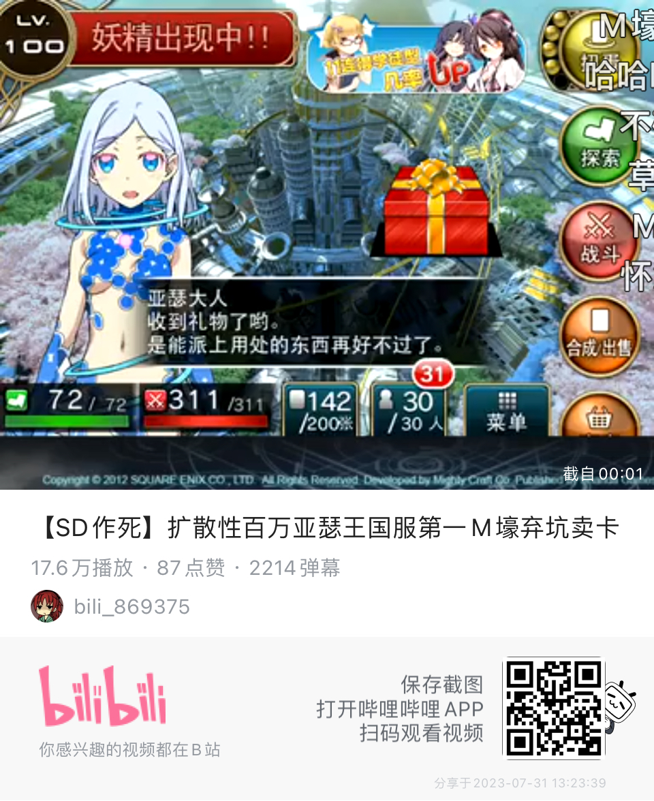

### [不吐不快] 日本抽卡手游模式是糟粕，我这么说没问题吧

Made by ngapost2md (c) ludoux [GitHub Repo](https://github.com/ludoux/ngapost2md)

----

##### 0.[0] \<pid:0\> 2023-07-31 12:55:32 by omen7314
理想中的未来开放世界arpg游戏，应该是数值与付费完全分离，充值只能买外观，影响手感或者出去装x，至少付费部分不能明显的影响到游戏平衡(大概像王者荣耀一样+10攻击力就是极限了)
所谓皮肤付费不能支持大制作游戏成本纯属扯淡，只要用户规模够大，哪怕是金铲铲这种人均付费率在手游里最低的那一档，人均年付费差不多100元不到，年收入也有接近50亿，这已经是最顶级的那批3a大作首发水平的收入了，何况金铲铲已经稳定的运营两年。50亿，运营一个3a品质的网游，太够了。
无非就是厂商有没有能力赌的问题，能支撑起完全pay for cool的大dau作品厂家国内也没几家(甚至可以说国内只有腾讯网易)
不过只要这种游戏能做出来，那就是对原神的降维打击。因为付费不涉及平衡的游戏真的有能力去做数值平衡，做玩法，玩家对游戏也真的很宽容，会有一大批忠实玩家去长期的支持你，哪怕你现在这个版本很烂。
不像原神，一个角色上了正式服就等于拔管了

----

##### 1.[0] \<pid:706015703\> 2023-07-31 12:57:32 by 封风
但是已经被原发扬光大了

现在小保底大保底动不动几个648一个限定

有已经是业界标准了

----

##### 2.[2] \<pid:706016031\> 2023-07-31 12:59:11 by aswaw111
多少有点冷笑话了，王者皮肤+10攻击力当年可是被骂的狗血淋头

----

##### 3.[0] \<pid:706016247\> 2023-07-31 13:00:26 by 香梦兮沉酣
就是利用人好睹的本性来骗你做出预期意外的消费呗

----

##### 4.[1] \<pid:706016359\> 2023-07-31 13:01:07 by bzbjzj
作为商业模式来说能挣钱的就是精华

----

##### 5.[0] \<pid:706016526\> 2023-07-31 13:01:51 by 唵嘛呢叭弥
你说的对，但挣钱即是正义

----

##### 6.[0] \<pid:706016664\> 2023-07-31 13:02:32 by ochaaki
我倒觉得是定价问题，虚拟商品容易拆碎卖罢了，如果一个普通宝箱一个粉球，每个版本送80抽还糟不糟粕？糟粕的还是资本的贪念本身吧

----

##### 7.[0] \<pid:706016815\> 2023-07-31 13:03:14 by 渡狸時雨丶
付费的角色都不做平衡了，不付费的为什么还要做平衡竞技游戏做平衡是因为平衡属于核心玩法不得不做

----

##### 8.[0] \<pid:706017010\> 2023-07-31 13:04:16 by l秦珺媛
猜你想看：逆水寒

----

##### 9.[0] \<pid:706017056\> 2023-07-31 13:04:30 by SCP250
应该说是价格歧视这个商业玩法探索到极致的产物

----

##### 10.[0] \<pid:706017115\> 2023-07-31 13:04:48 by 月小炎
今天隔壁s1锁妖塔才有老哥告诉我免费抽卡游戏对比点卡收费的确是降维打击，原把免费开放世界带给大众是大进步呢

----

##### 11.[0] \<pid:706017258\> 2023-07-31 13:05:35 by 右手边03
>[jump](#pid706016815) 渡狸時雨丶(2023-07-31 13:03) 说: 
>
>付费的角色都不做平衡了，不付费的为什么还要做平衡竞技游戏做平衡是因为平衡属于核心玩法不得不做

就算是竞技游戏也不会尽全力做平衡肯定要削弱加强让你换着花样玩的。

----

##### 12.[0] \<pid:706017531\> 2023-07-31 13:06:54 by MC6666698
别扯了，开放世界才是陷阱，能赚几个钱？

----

##### 13.[0] \<pid:706018146\> 2023-07-31 13:09:57 by 假面骑士金币
你不抽，我不抽，三巨头的牛马伦怎么加油？

----

##### 14.[0] \<pid:706019553\> 2023-07-31 13:17:19 by NATFproposal
>[jump](#pid706017115) 月小炎(2023-07-31 13:04) 说: 
>
>今天隔壁s1锁妖塔才有老哥告诉我免费抽卡游戏对比点卡收费的确是降维打击，原把免费开放世界带给大众是大进步呢

这是什么神经病，搞的好像米赚钱还是对玩家的恩赐了

----

##### 15.[0] \<pid:706020065\> 2023-07-31 13:20:01 by Nghez
乖离这狗东西，以前氪金没那么贵的

----

##### 16.[0] \<pid:706020467\> 2023-07-31 13:22:14 by derhirte
你说得对 但是mhy利润率谁不眼馋

----

##### 17.[0] \<pid:706020585\> 2023-07-31 13:22:45 by 浮士德噩梦
DOTA2，纯粹的free2play

----

##### 18.[0] \<pid:706020834\> 2023-07-31 13:24:05 by 江鹤疏
我觉得最处的还是当初那个锁648的
捏码码的汇率是会波动的啊，现在氪日本手游一单10000日元换算过来就500rmb啊

----

##### 19.[0] \<pid:706020902\> 2023-07-31 13:24:24 by 年下萝莉控
请补习下二游定价万恶之源的国服经典战役

----

##### 20.[0] \<pid:706025592\> 2023-07-31 13:49:26 by ley233
前面没问题，最后一段话有问题。
对于从业者还有个悖论是，

很多游戏是通过靠 玩家氪金的钱，来持续进行大规模推广营销的，真靠所谓的口碑口口相传做大的游戏只能说非常非常少，几乎不可能。

你说的王者金铲铲都是极个别案例。

----

##### 21.[0] \<pid:706026532\> 2023-07-31 13:54:52 by Bauhaus的大豪斯
当国外在玩battle pass的时候，这里的gacha之风却在盛行

----

##### 22.[0] \<pid:706026673\> 2023-07-31 13:55:37 by 喵帕斯kira
上星期玩了尘白禁区，竟然学你米的系统，直接被人喷爆了，差不多已经爆死了，这就是米的抽卡模式对二次元手游带来的影响

----

##### 23.[0] \<pid:706027031\> 2023-07-31 13:57:29 by 冯仔from2001
>[jump](#pid706016031) aswaw111(2023-07-31 12:59):

时代越来越烂，没办法以前的那些老东西，趁着还没关服就多享受一会吧

----

##### 24.[0] \<pid:706027048\> 2023-07-31 13:57:35 by 哒哒块
现在这些批手游，质量参差不齐但定价大小保底概率都学的你原，始作俑者其无后乎

不过也挺有乐子的，真的是学一个死一个

----

##### 25.[0] \<pid:706027591\> 2023-07-31 14:00:46 by ptreesptrees
之前我支持是因为国产游戏没钱没技术,先靠抽卡积累资金之后再逐渐降价,然而有人好像打算把抽卡模式的奶嘴吸到底,不打算断奶了.那我先用行动抵制一波了

----

##### 26.[0] \<pid:706027662\> 2023-07-31 14:01:06 by 白苹果k
比贩毒还赚钱，公司员工怎么可能不飘呢

----

##### 27.[0] \<pid:706028543\> 2023-07-31 14:05:38 by 子夜歌QAQ
原神千不好万不好人家强度膨胀这块是有控制的，角色强度虽然有差异但是以打满深渊为目的的话开服到现在也没有哪个老角色真的退环境了，角色卖的贵的前提是起码保值吧，有些游戏的强度平衡做的和shi一样还学原神，自找死路

----

##### 28.[0] \<pid:706045140\> 2023-07-31 15:26:07 by qimubai
看到好多个up在宣扬不要横向比价，说到底还不是抽卡手游吸金本质德不配位，说情绪价值不能比，说白了就目前抽卡手游做的剧情有正经番剧写得好吗，说是内容游戏，时长拖得长主线内容更得少，搞了半天还不是靠db机制刺激大脑卖数值，你如果真按剧情章节收费有几个人看得上你那剧情，一比价抽卡手游暴利行业的泡沫被戳破了，真正好的东西，有正常的利润率的产品，怕什么比价

----

##### 29.[0] \<pid:706045546\> 2023-07-31 15:27:58 by 冰冻之零
抽卡模式不是 这个定价是
648不符合收入

----

##### 30.[0] \<pid:706046537\> 2023-07-31 15:32:37 by shi态
pay for cool？这时候就有的是人站出来了
是吧，碧蓝航线，战舰少女？
更别说pvp游戏，除非确保p2w有人能买账，这种就是几个养服佬氪爆，要不然就是滚数据一年暴死。其他就最好还是只卖皮肤，哪怕王者荣耀呢，卡拉彼丘都是只卖皮肤的

----

##### 31.[0] \<pid:706046835\> 2023-07-31 15:33:57 by TheLegislator
玩家角度糟粕，公司角度精华  做的内容少了，但我赚的多了啊，双赢就是公司赢两次

----

##### 32.[0] \<pid:706091822\> 2023-07-31 19:10:17 by KeyMiracle
没问题。
而且方女士那样的人还会一边玩原一边骂“中国人只会整抽卡这种东西捞钱，游戏都是人家日本人做的，中国人抄一下加个抽卡”。把日本daddy洗的干干净净呢。

----

##### 33.[0] \<pid:706093310\> 2023-07-31 19:19:22 by 加贺烧
>[jump](#pid706020902) 年下萝莉控(2023-07-31 13:24) 说: 
>
>请补习下二游定价万恶之源的国服经典战役
>
>

还有人记得M壕，当时的卡池都是不标出率的，盛大中间还暗改出率

