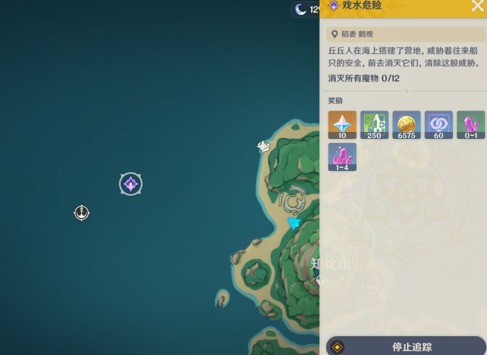
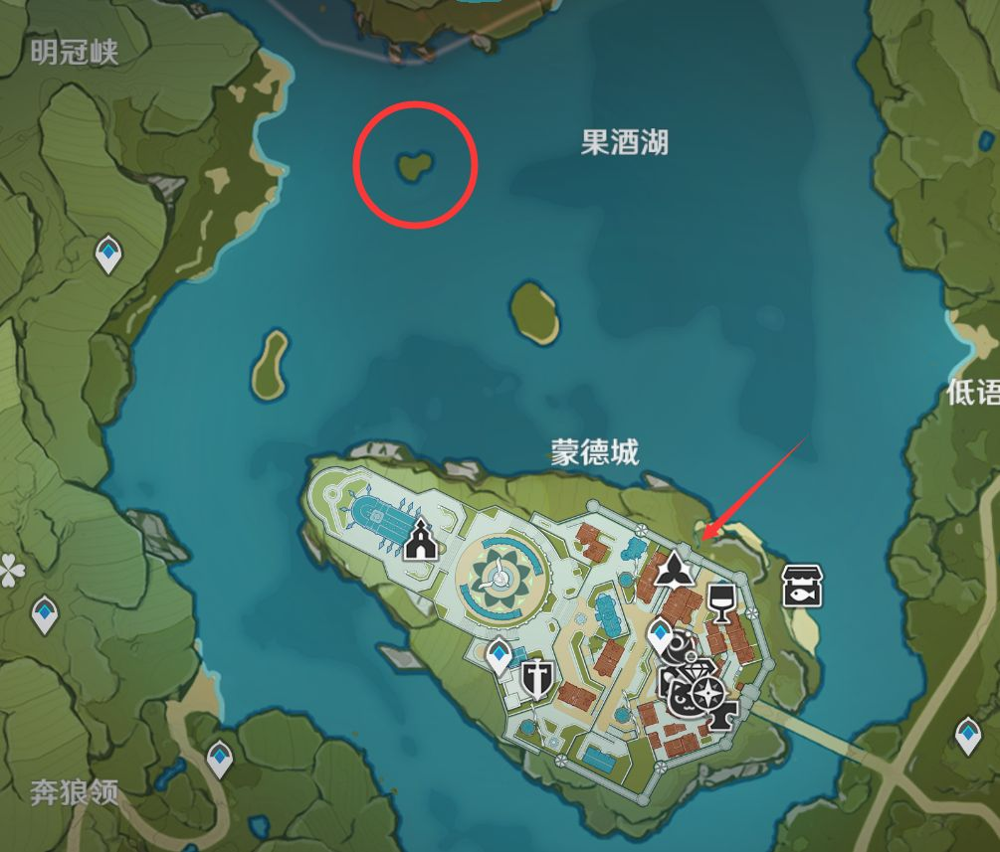
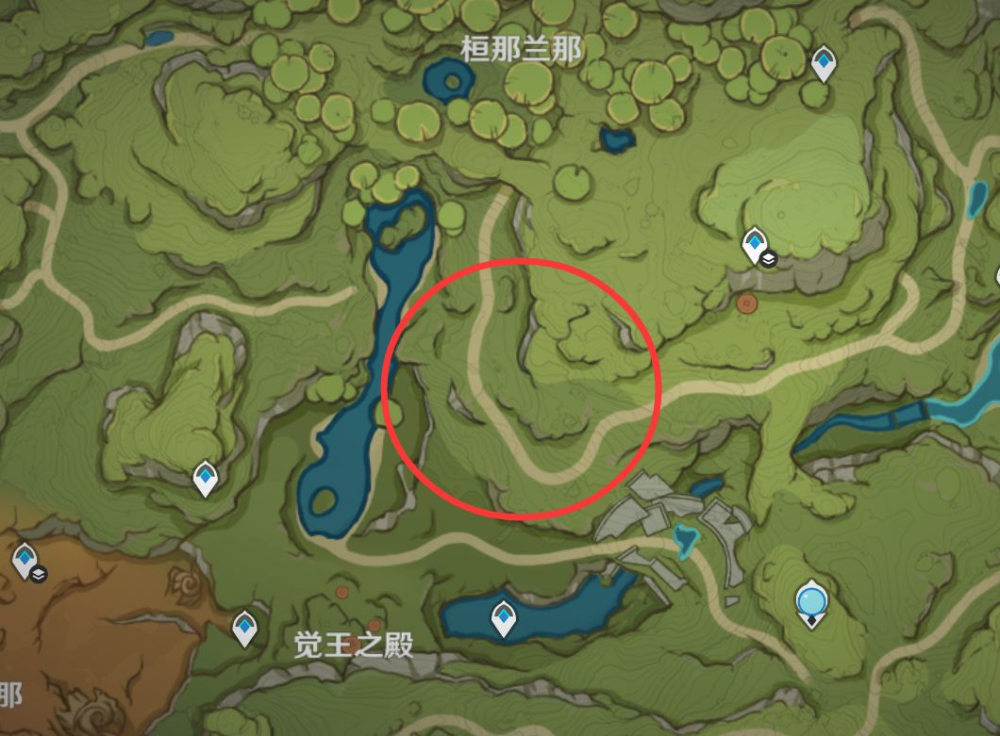
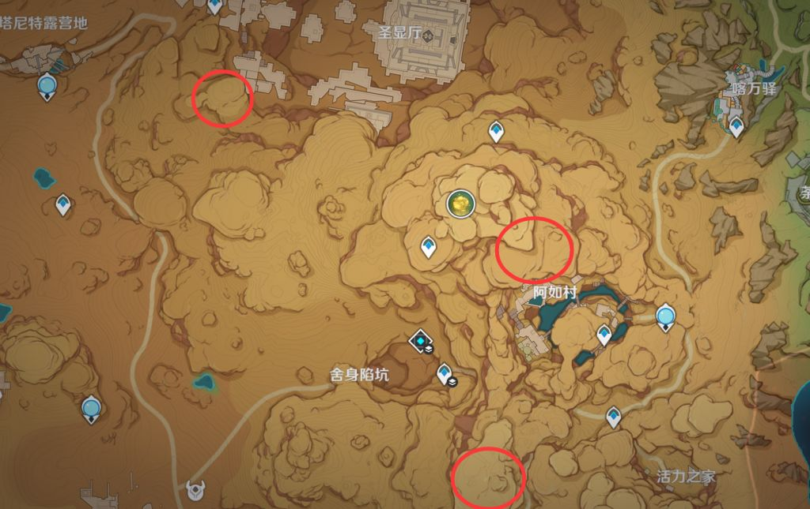
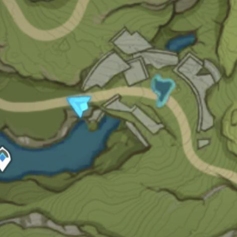
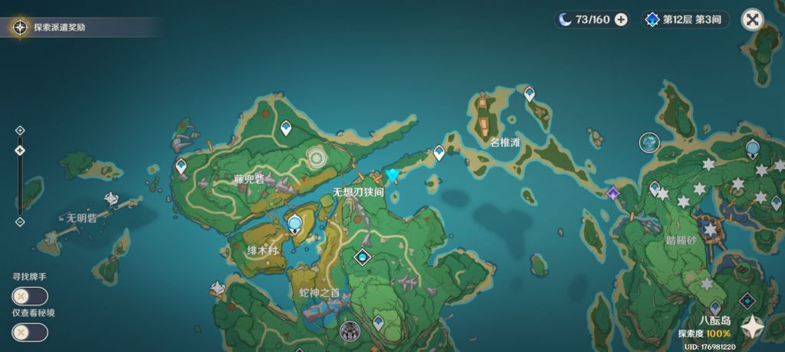

### [热点事件] 原神每日吐槽之——毫无逻辑的拖延时间：赶路篇

Made by ngapost2md (c) ludoux [GitHub Repo](https://github.com/ludoux/ngapost2md)

----

##### 0.[2] \<pid:0\> 2023-07-31 13:51:45 by lolireactor
众所周知，原神的日常是无趣的、弱智的、重复的、毫无逻辑的、意义不明的、让人费解的、故意恶心人的。
只是为了完成拖延在线时长的kpi产生的机制。
所以很多原神的日常都非常的恶心，但是之前我喷的也太多了，现在也没有什么想喷的内容了，于是只是想简单的吐槽一下。
反正里版定期冲水，发到这就纯图一乐。

注意看，丘丘人在海上搭建了营地，威胁着往来船只的安全……
不是，这里tm是鹤观啊，哪来的往来的船只？这附近方圆几百里一丁点人影都没，丘丘人在这盖个营地怎么你了！

同样的，蒙德也有一个这样类似的弱智日常。
一个会刷在蒙德侧门的“圆滚滚的大团骚乱”，每次看到日常刷这我就知道了，是那个破B小孩亚瑟的脑瘫日常。
在这救了他之后(严格意义上来说并不能算救，因为怪物根本不会攻击NPC，甚至不会去理会NPC，只是单纯的在那按照预定的脚本四处乱走)
这个小孩会告诉你在果酒湖的<b>孤岛</b>上有<b>火</b>史莱姆威胁蒙德城的安全。
黄毛摄像头：还有别的事
然后就千里迢迢去把这几个孤岛上的史莱姆清理了，保护了蒙德城的安全。

其他日常，去击败海上训练的丘丘人也是相当弱智。如刷在璃月瑶光滩右侧的、刷在孤云阁五香岩下面的日常，也都是在鸟不拉屎且距离传送点超远的地方告诉你这威胁到城里的安全让玩家去清理的。还有稻妻也有在海上孤岛刃连岛清理浪人的日常，也是毫无逻辑且让人跑超远路途的嗯拖时间的设定。

到了须弥，猛哥同事就有了船新的拖延时间的方式。
须弥雨林的传送点很密集，也很多都在合适的地方，导致想找到不少上面这种鸟不拉屎的地方很难。但是他们还是找到了，就在图的这里。
看似附近5个传送点，但是实际上一个离这里近的都没有。而这里刷出的日常就高达3种不同的。
这就很乐了，有一次我急了，我就非要从下面这个看着离着最近的传送点找到上去的路。然后我拿万叶跳来跳去怎么跳都不如直接从最远的左边飞过去快。
我不得不感叹这帮人确实是有实力的，就雨林这种图都能找到这样故意恶心人的日常点位。
当然，在我发现下面传送点可以跳蘑菇，然后用<b>藏在树叶后面</b>的四叶印，用<b>特定视角连续飞3次</b>才能上去的隐藏道路后，那就是另外一个故事了。

到了沙漠，这下发挥的空间可太多了。
沙漠地图的很多传送点都是十分恶心的，故意放在山下的。而想上山他们也不会给你方便的四叶印，他们十分吝啬的把上山的路藏在了山的特定的一个方向，也就是说只有在这，你才能上山。
这就不得不提阿如村附近的山了，初见堪比迷宫，不跑个四五回你根本不知道这附近是什么构造，哪里能上山。
而偏偏很多日常和地脉花都会刷在这，这不就巧了吗？那么大个沙漠，沙漠上一个日常没有，沙漠真要刷日常就必定刷这几个山上一个。
当然，就算知道上山的四叶印在哪，山也不是好上的，你仍然需要爬很高跑很远才能到目标地点，然后……
然后去打地鼠。
喂，出来这个任务绝对是原神日常恶心人之大成者。强迫玩家玩无聊且弱智毫无逻辑的小游戏，在削弱之前甚至这几个Door宝鼬速度极快还会90%度拐弯，行进路线会重叠，我全程盯着也不能保证100%一次完成。真他妈绝了。

我十分确定，沙漠的很多NT任务就是为了恶心每日定在须弥的人。因为须弥雨林的日常想必前面的其他国家确实优化了不少。脑瘫巨婴少了、碎嘴B话NPC也少了，甚至没有修车护送气球。所以为了平衡须弥日常没有恶心到人的这个情况，GCH们添加了大量的SB沙漠日常。

等于说这个游戏在须弥确实优化了不少日常任务的体验，但是开了沙漠之后他又改了回去。继续恶心人。
我现在就是很期待，枫丹日常能做到多弱智？是否能在恶心人这点上再创辉煌？

----

##### 1.[0] \<pid:706030809\> 2023-07-31 14:16:41 by grp767
我已经被pua了，只要是打怪能解决的我都能接受，毕竟跟一堆傻不愣登的npc搁哪对话办事跑腿多了，打怪已经是天堂了

----

##### 2.[0] \<pid:706031069\> 2023-07-31 14:17:54 by 須賀悠衣
主线都写成这样了，你居然指望日常剧情能符合逻辑

----

##### 3.[0] \<pid:706031163\> 2023-07-31 14:18:27 by 迷你靓仔
ch做日常的时候保留了一部分屎
这样才能让你知道玩的是gayshit

----

##### 4.[0] \<pid:706031426\> 2023-07-31 14:19:44 by 半面海棠开
就是因为日常太恶心了，我连当蛀虫的想法都没有，直接退坑跑路

----

##### 5.[0] \<pid:706031432\> 2023-07-31 14:19:46 by 未始有物
[《暗黑2》制作人：《暗黑4》就是拿出来吸金的半成品]《暗黑2》制作人Mark Kern近期发文批评《暗黑4》是半成品，称其使用“掠夺性策略”来使玩家花费更多的时间，旨在获得更多的数据供开发商分析，让利润最大化。“开发商故意做出糟糕的设计决策来榨取金钱和保持高活跃用户。做一款高完成度的游戏可以，但那并不是获得利润的最优解。”

第一版是那样可以说是没经验，一直不改那基本可以确定就是故意的了

----

##### 6.[0] \<pid:706032354\> 2023-07-31 14:24:19 by 露缇娜丝
然而须弥是最短日常最优选了，稻妻蒙德璃月的日常一个比一个逆天

----

##### 7.[0] \<pid:706033342\> 2023-07-31 14:28:59 by 断神霹雳001
主线支线不给跳过，那看了一万遍的破壁日常对话也不给跳过。

----

##### 8.[0] \<pid:706033620\> 2023-07-31 14:30:22 by 如意云游
须弥沙漠真是初生板块，一堆纯粹磨时长的出生任务，喜欢我绕一大圈的走马斩群魔和喂出来吗？每日委托设计成这样已经是脸都不要就为了拖玩家时长咯

还有须弥本区的大树，感觉也是3.1后新加的，就感觉就是不让玩家简单潇洒做每日

还有，每日剧情为什么不加已读跳过？你主线有配音勉强算是有成本精心设计不能跳过可以理解，你支线也不能跳过我就不是很理解了，你特么每日已读都不能跳过？每日已读不能跳过除了给玩家负体验拖时长外有半丁点意义吗？

我玩过那些游戏每日都在优化减时长加奖励，方舟啊碧蓝那些，甚至你原你米自己的星铁也非常直观地进行了优化，本身对比原神相当程度优化的同时人家1.1对比1.0啥的还继续优化，就你原的每日跟粪坑里的石头一样，又臭又硬

----

##### 9.[0] \<pid:706033768\> 2023-07-31 14:31:03 by 来自非洲大草原的16
讲道理，为什么这贴在里版，这种和每个玩家游戏体验息息相关的主题不应该在主板嘛

----

##### 10.[0] \<pid:706033804\> 2023-07-31 14:31:17 by 肯定不是真的
我说实话，你游地图作为一个开放世界而言，还是稍微小了点
跟着建筑、内部空间也没办法搞的很大，很难做出宏伟这个概念
小的原因很简单，因为跑路效率太低，甚至跑路技能可以当氪金点
须弥加了蜘蛛侠之后，稍微大点了，可是也就那样，毕竟不能铺的满地都是

----

##### 11.[0] \<pid:706034681\> 2023-07-31 14:35:33 by eecctt
沙漠这一块的确实恶心

----

##### 12.[0] \<pid:706034737\> 2023-07-31 14:35:47 by lolireactor
>[jump](#pid706033768) 来自非洲大草原的16(2023-07-31 14:31)说:
>讲道理，为什么这贴在里版，这种和每个玩家游戏体验息息相关的主题不应该在主板嘛[s:ac:哭笑]

里版人更多
太地狱了

----

##### 13.[0] \<pid:706037049\> 2023-07-31 14:47:22 by 废墟幻想
因为出雨林的时候还没有散兵啊。
沙漠那么多日常放在上面，传送点在底下，还不给四叶印，什么意思？就是叫你抽“大世界T0”啦。
就好比双十一之前先涨价，后面才有打折空间嘛。

----

##### 14.[0] \<pid:706039402\> 2023-07-31 14:58:26 by mASAYUMecHASIN
须弥有一些每日是在山上的嘛，刚开始刷须弥每日的时候，路不熟，我真就找了个看上去能靠爬山爬山去的地点爬，然后就是死活爬不上去，沙漠的倒梯形山到底哪个nt设计出来恶心玩家的？

----

##### 15.[0] \<pid:706039429\> 2023-07-31 14:58:37 by iwhcd
>[jump](#pid706033620) 如意云游(2023-07-31 14:30)说:
>须弥沙漠真是初生板块，一堆纯粹磨时长的出生任务，喜欢我绕一大圈的走马斩群魔和喂出来吗？每日委托设计成这样已经是脸都不要就为了拖玩家时长咯   还有，每日剧情为什么不加已读跳过？你主线有配音勉强算是有成本精心设计不能跳过可以理解，你支线也不能跳过我就不是很理解了，你特么每日已读都不能跳过？每日已读不能跳过除了给玩家负体验拖时长外有半丁点意义吗？  我玩过那些游戏每日都在优化减时长加奖励，方舟啊碧蓝那些，甚至你原你米自己的星铁也非常直观地进行了优化，本身对比原神相当程度优化的同时人家1.1对比1.0啥的还继续优化，就你原的每日跟粪坑里的石头一样，又臭又硬

跳过已读剧情很重要吗？也就...

----

##### 16.[0] \<pid:706039741\> 2023-07-31 15:00:03 by RinTabasaki
既然已经在里版我就直说了
顺火暖萌新有自动寻路道具一次30分钟，可以用摩拉买，探索度够了之后做一个任务可以常驻自动寻路

----

##### 17.[0] \<pid:706042459\> 2023-07-31 15:13:14 by 两簸烫皮

是瀑布这里十字印吗

----

##### 18.[0] \<pid:706042925\> 2023-07-31 15:15:23 by FAAET
简直说出了我的心声，主楼里这几个日常赶路令我印象深刻

----

##### 19.[0] \<pid:706044045\> 2023-07-31 15:20:53 by lolireactor
>[jump](#pid706042459) 两簸烫皮(2023-07-31 15:13)说:
>[img]https://img.nga.178.com/attachments/mon_202307/31/l2Q2s-brfmKoT1kSd4-d4.jpg[/img] 是瀑布这里十字印吗

确实，这里的四叶印特别隐秘而且全都藏在树后，我是从反方向做完任务下来才发现的

----

##### 20.[0] \<pid:706044355\> 2023-07-31 15:22:27 by giegie好坏我好爱
8说了，蒙德我记得有个每日是打小宝，但是点位在达达乌帕谷那个铁锅，我记得至少3.6之前完全没见过，很难不怀疑是故意的

----

##### 22.[0] \<pid:706044558\> 2023-07-31 15:23:24 by CUCUK

最恶心的安全运输，起点是紫标，终点是角色
妈的你咋不从蒙德运过来

----

##### 24.[0] \<pid:706239378\> 2023-08-01 14:10:05 by 凌岚望月
合理滑坡，联想之前那个小草发委托的图，很难不猜测净善宫夫妇一边批论文一边用这个表情看着黄毛傻子爬山

----

##### 25.[0] \<pid:706244682\> 2023-08-01 14:36:20 by Luoxifq
>[jump](#pid706037049) 废墟幻想(2023-07-31 14:47):

但&amp;#8943;他那短小的空居力面對沙漠戈壁也是只能飛一段後開始爬啊

----

##### 26.[0] \<pid:706247140\> 2023-08-01 14:48:38 by 废墟幻想
>[jump](#pid706244682) Luoxifq(2023-08-01 14:36)说:
><b>Reply to [pid=706037049,37205443,1]Reply[/pid] Post by [uid=38714455]废墟幻想[/uid] (2023-07-31 14:47)</b> 但&amp;#8943;他那短小的空居力面對沙漠戈壁也是只能飛一段後開始爬啊[s:ac:哭笑]

我确实是云的，那我就更不懂了，ch纯粹为了恶心人？

----

##### 27.[0] \<pid:706253891\> 2023-08-01 15:20:19 by 纠缠的狗
要我们给你提建议的话，就是赶紧退

----

##### 28.[0] \<pid:706260158\> 2023-08-01 15:48:52 by 无意识koishi
散兵我也抽了 
发现吹得那么吊的飞空实际上还真用处不大
时间太短了高度也上不了太高

