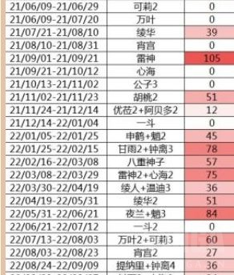

### [不吐不快] 简单预测，如果枫丹失利，纳塔会更快的端上来

Made by ngapost2md (c) ludoux [GitHub Repo](https://github.com/ludoux/ngapost2md)

----

##### 0.[0] \<pid:0\> 2023-07-31 14:41:04 by 龙游旷野
就目前来说，枫丹角色基本没有能预见的可以再续辉煌的卡池，缩短复刻和三卡池近在眼前
依照原神的体量来说，假设4.0开门不红，4.1和4.2的男男池加神池仍然无法挽回颓势的情况下
如果崩铁没能及时成为新时代的资金牛，绝区零前路未明的局面下
延续了两年的一年期国家版图就会大变，枫丹的后续收入难以继续支撑往年的垃圾地图时间，尤其是须弥后续地图广受诟病的情况
我们可以合理猜测，须弥敢于在3.X后几个版本连续推出新地图与复刻卡池，显然是受到了鹤观、渊下宫和层岩深渊的好评和流水影响

<b>对比这一时期的卡池流水，和之前的卡池流水相比，显然是优秀而稳定的</b>

因此基本可以认为，制作组得出了一个不太严谨的收入公式：新地图+角色=稳定优秀的流水
至此，我认为这才是基于流水的，新地图分段推出的逻辑
但是这个公式显然遗憾的在须弥不再成立了，原因是多样的，但我们因此也很难分析制作组现今的制作思路是怎么样的
是归咎于某个人物？还是归因于沙漠地图的空旷？甚至是听取了广泛的玩家建议？
不论哪种，枫丹如果接着失利，那地图推出和复刻卡池必然会显而易见的加速
连带而来，恐怕就是纳塔的加速

----

##### 1.[8] \<pid:706036174\> 2023-07-31 14:42:48 by 涨幅为困难
作为一个不受太多制约的编剧看着玩家胡乱猜测为此尖叫抓挠的样子实在是太快乐啦呼哈哈哈

----

##### 2.[0] \<pid:706036449\> 2023-07-31 14:44:11 by 来自非洲大草原的16
越想赚钱，复刻越频，复刻越频，玩家持有率就越高，期待就越低，玩家持有率越高期待越低，就越赚不到钱
所以越想赚钱就越赚不到钱

----

##### 3.[0] \<pid:706036481\> 2023-07-31 14:44:20 by muziqiduan
赶工越多，质量越差，质量越差，玩家越少，玩家越少，预算越少，预算越少，赶工越少。
所以赶工越多，赶工越少。

